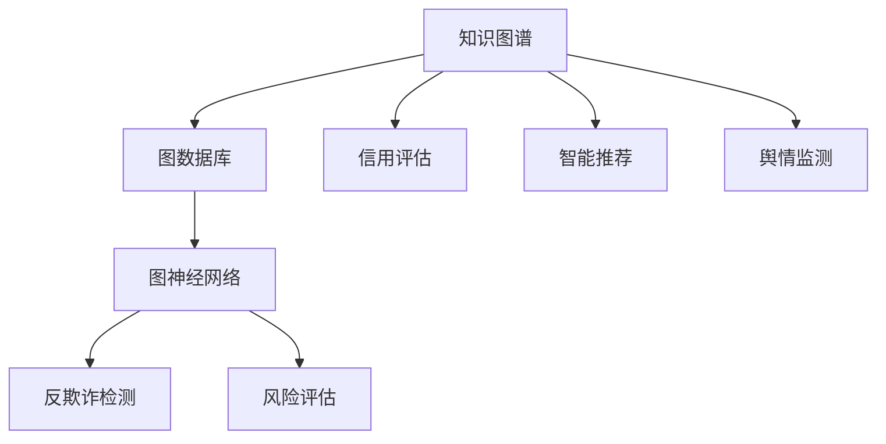

                 

# 知识图谱在金融风控中的应用

> 关键词：金融风控,知识图谱,图神经网络,图数据库,信用评估,反欺诈

## 1. 背景介绍

随着金融科技的快速发展，金融机构面临的风险和挑战也在不断增加。传统的风控手段，如信用评分、反欺诈等，已难以应对日益复杂多变的金融环境。在这样的背景下，知识图谱(Knowledge Graph)作为一种新兴的数据建模和分析技术，以其强大的数据融合、推理和挖掘能力，在金融风控领域逐渐崭露头角。

### 1.1 问题由来

知识图谱是一种语义化的数据表示方式，它通过图形结构将实体、属性和关系组织起来，形成一种直观的、易于理解的数据模型。这种模型能够高效地存储、管理和查询复杂的信息，从而为金融风控提供了新的思路和方法。

在金融风控中，知识图谱可以用于多维度的信息融合、风险评估和欺诈检测，如图谱关联分析、实体关系网络、图神经网络等。通过这些技术，可以构建更为全面、准确的金融风控模型，从而提升金融机构的风险管理能力，保障资金安全，防范金融风险。

### 1.2 问题核心关键点

知识图谱在金融风控中的应用，主要集中在以下几个方面：

- 风险评估：通过构建全面的金融知识图谱，将各类风险因素整合，形成全面的风险评估体系。
- 反欺诈检测：利用图神经网络对异常行为进行检测和预测，构建反欺诈风控模型。
- 信用评估：基于知识图谱进行深度学习，提高信用评估的准确性和可靠性。
- 智能推荐：构建知识图谱推荐系统，为用户提供个性化的金融产品和服务。
- 舆情监测：利用图谱关联分析技术，对金融舆情进行实时监测和预警。

这些核心关键点共同构成了知识图谱在金融风控中的整体应用框架，使得其在风险管理、欺诈防范、信用评估、智能推荐等多个环节发挥重要作用。

### 1.3 问题研究意义

研究知识图谱在金融风控中的应用，对于提升金融机构的决策科学性和风险管理能力，具有重要意义：

1. **风险管理优化**：通过整合多源数据，构建全面、精准的风险评估模型，帮助金融机构更准确地识别和管理风险。
2. **反欺诈能力增强**：利用图谱关联分析、图神经网络等技术，提高欺诈检测的准确性和实时性，有效防范金融欺诈。
3. **信用评估升级**：引入知识图谱的深度学习，提高信用评估模型的性能和可靠性，减少信贷风险。
4. **客户服务提升**：构建基于知识图谱的智能推荐系统，为客户提供更加个性化、精准的金融服务。
5. **舆情预警系统构建**：利用知识图谱的关联分析能力，实时监测金融舆情，及时预警风险事件。

通过这些应用，知识图谱有望成为金融风控的重要工具，推动金融科技的进一步发展。

## 2. 核心概念与联系

### 2.1 核心概念概述

在金融风控领域，知识图谱的应用主要包括以下几个核心概念：

- **知识图谱**：一种语义化的数据建模方式，通过图形结构表示实体、属性和关系，能够高效存储和查询复杂的信息。
- **图数据库**：一种专门用于存储和查询图结构数据的数据库系统，支持高效的图遍历和查询操作。
- **图神经网络(Graph Neural Network, GNN)**：一种基于图结构数据的深度学习模型，能够自动学习和挖掘图谱中的复杂关系和模式。
- **信用评估**：金融机构对客户信用风险的评估和分析过程，通过整合各类信息，进行综合的风险评估。
- **反欺诈检测**：利用图谱关联分析等技术，对异常行为进行检测和预测，防范金融欺诈风险。

这些核心概念通过图谱构建、数据融合、深度学习等技术手段，共同构成了一个高效的金融风控系统，为金融机构提供了全面的风险管理和欺诈防范解决方案。

### 2.2 核心概念原理和架构的 Mermaid 流程图

上述Mermaid流程图展示了知识图谱在金融风控中的应用架构，各个模块通过数据融合和协同工作，实现全面的风险管理和欺诈防范。

## 3. 核心算法原理 & 具体操作步骤

### 3.1 算法原理概述

知识图谱在金融风控中的应用，主要基于以下几个核心算法：

- **图谱构建**：构建金融领域的知识图谱，将各类数据（如客户信息、交易记录、信用报告等）整合并存储到图数据库中，形成语义化的数据结构。
- **图神经网络**：利用图神经网络对图谱中的关系进行挖掘，学习节点之间的复杂关联，提高模型的推理和预测能力。
- **风险评估**：通过图神经网络对图谱中的实体和关系进行融合，构建综合的风险评估模型。
- **反欺诈检测**：利用图谱关联分析技术，对图谱中的异常行为进行检测和预测。
- **信用评估**：结合图神经网络和传统信用评分模型，构建更加准确的信用评估体系。

### 3.2 算法步骤详解

#### 3.2.1 图谱构建

构建金融领域知识图谱的步骤包括：

1. **数据收集与清洗**：收集各类金融数据，如客户信息、交易记录、信用报告等，并进行数据清洗，去除噪音和冗余数据。
2. **实体识别与关系抽取**：利用自然语言处理(NLP)技术，从文本数据中抽取实体和关系，构建基本的图谱结构。
3. **关系计算与聚合**：对抽取的关系进行计算和聚合，构建图谱中的节点和边，形成结构化的数据模型。
4. **图数据库存储**：将构建好的知识图谱存储到图数据库中，支持高效的图遍历和查询操作。

#### 3.2.2 图神经网络

图神经网络在金融风控中的应用，主要包括以下步骤：

1. **图数据准备**：将图谱数据导入图神经网络模型，构建图结构的输入。
2. **图卷积层(GCN)或图注意力网络(GAT)设计**：根据图谱结构设计图神经网络的图卷积层或图注意力网络，学习图谱中的节点和关系。
3. **训练与优化**：通过损失函数和优化算法（如Adam、SGD等）训练图神经网络模型，调整模型参数以提高预测准确性。
4. **推理与预测**：利用训练好的图神经网络模型，对新数据进行推理和预测，进行风险评估或反欺诈检测。

#### 3.2.3 风险评估

风险评估是金融风控的核心任务之一，通过构建图神经网络模型进行风险评估的步骤包括：

1. **风险因子抽取**：从图谱中抽取与风险相关的因子，如客户的资产状况、历史交易行为等。
2. **图神经网络训练**：利用图神经网络模型，对抽取的风险因子进行融合和挖掘，构建综合的风险评估模型。
3. **模型评估与优化**：通过交叉验证等方法，评估模型性能，调整模型参数以提高预测准确性。
4. **风险预警与控制**：根据模型预测结果，对高风险客户进行预警和控制，采取相应的风险管理措施。

#### 3.2.4 反欺诈检测

反欺诈检测是金融机构防范金融风险的重要手段，利用图谱关联分析技术进行反欺诈检测的步骤包括：

1. **异常行为识别**：利用图神经网络对图谱中的异常行为进行识别，找出潜在的欺诈活动。
2. **风险评估**：结合图神经网络和传统欺诈检测算法，对识别到的异常行为进行风险评估，确定欺诈风险等级。
3. **预警与干预**：根据风险评估结果，对高风险客户进行预警和干预，采取措施防范欺诈行为。

#### 3.2.5 信用评估

信用评估是金融机构对客户信用风险的评估和分析过程，结合图神经网络和传统信用评分模型的步骤包括：

1. **信用信息抽取**：从图谱中抽取与信用相关的信息，如客户的资产状况、信用历史等。
2. **图神经网络训练**：利用图神经网络模型，对抽取的信用信息进行融合和挖掘，构建信用评估模型。
3. **信用评分模型融合**：将图神经网络模型与传统信用评分模型进行融合，构建综合的信用评估体系。
4. **模型评估与优化**：通过交叉验证等方法，评估模型性能，调整模型参数以提高预测准确性。
5. **信用审批与调整**：根据模型预测结果，对客户的信用审批进行决策，调整信用额度等参数。

### 3.3 算法优缺点

知识图谱在金融风控中的应用，具有以下优点：

- **数据融合能力强**：能够高效整合多源数据，构建全面的风险评估体系。
- **推理能力强大**：利用图神经网络进行深度学习，提高模型的推理和预测能力。
- **模型鲁棒性好**：结合传统信用评分模型，提高信用评估的准确性和可靠性。
- **实时性高**：利用图数据库的高效查询操作，实现实时风险监控和预警。

同时，也存在一些缺点：

- **数据质量依赖性高**：图谱构建依赖高质量的数据，数据的完整性和准确性直接影响模型性能。
- **模型复杂度高**：图神经网络模型的构建和训练较为复杂，需要大量的计算资源和时间。
- **模型解释性不足**：知识图谱的深度学习模型较为复杂，模型的内部工作机制难以解释。
- **数据隐私问题**：图谱中包含大量敏感信息，需要加强数据隐私保护和合规性管理。

### 3.4 算法应用领域

知识图谱在金融风控中的应用，主要集中在以下几个领域：

1. **信用评估**：利用图神经网络对客户信息进行深度学习，构建综合的信用评估模型，提高信用评估的准确性和可靠性。
2. **反欺诈检测**：利用图谱关联分析技术，对异常行为进行检测和预测，构建反欺诈风控模型。
3. **风险评估**：通过整合多源数据，构建全面的风险评估体系，提高风险管理的科学性和精确度。
4. **智能推荐**：构建基于知识图谱的智能推荐系统，为用户提供个性化的金融产品和服务。
5. **舆情监测**：利用图谱关联分析技术，对金融舆情进行实时监测和预警，防范金融风险。

这些应用领域展示了知识图谱在金融风控中的广泛应用，推动了金融机构风险管理能力的提升和金融科技的发展。

## 4. 数学模型和公式 & 详细讲解 & 举例说明

### 4.1 数学模型构建

知识图谱在金融风控中的应用，主要涉及以下几个数学模型：

- **图结构**：用图形结构表示实体、属性和关系，构建知识图谱的基本框架。
- **图神经网络模型**：基于图结构设计图神经网络，进行深度学习。
- **风险评估模型**：利用图神经网络对图谱中的实体和关系进行融合，构建综合的风险评估模型。

### 4.2 公式推导过程

#### 4.2.1 图结构模型

图结构模型是知识图谱的基本框架，可以用有向图或无向图表示。设图谱中包含 $n$ 个节点和 $m$ 条边，节点 $v_i$ 表示实体，边 $e_{ij}$ 表示实体之间的关系。

#### 4.2.2 图神经网络模型

图神经网络模型利用图卷积层或图注意力网络，对图谱中的节点和关系进行学习。以图卷积网络(GCN)为例，其公式推导过程如下：

$$
\mathbf{H}^{(l+1)} = \text{GCN}(\mathbf{H}^{(l)}, \mathbf{A})
$$

其中，$\mathbf{H}^{(l)}$ 表示节点在 $l$ 层的表示向量，$\mathbf{A}$ 表示图谱的邻接矩阵，$\text{GCN}$ 表示图卷积层的计算公式。

#### 4.2.3 风险评估模型

风险评估模型通过融合图神经网络学习和传统信用评分模型，构建综合的风险评估体系。以逻辑回归模型为例，其公式推导过程如下：

$$
\mathbf{W} = \text{logistic}(\mathbf{H}^{(l+1)})
$$

其中，$\mathbf{H}^{(l+1)}$ 表示图神经网络的输出向量，$\mathbf{W}$ 表示逻辑回归模型的输出向量，$\text{logistic}$ 表示逻辑回归的激活函数。

### 4.3 案例分析与讲解

以信用评估为例，分析知识图谱的应用。

1. **数据准备**：收集客户的基本信息、交易记录、信用报告等数据，构建金融领域知识图谱。
2. **图神经网络设计**：设计图卷积网络，学习节点之间的复杂关联，构建客户信用评估模型。
3. **模型训练与评估**：利用图神经网络模型和传统信用评分模型进行融合，构建综合的信用评估模型。
4. **信用审批决策**：根据模型的预测结果，对客户的信用审批进行决策，调整信用额度等参数。

案例中，知识图谱的应用提高了信用评估的准确性和可靠性，减少了信贷风险，提升了金融机构的风险管理能力。

## 5. 项目实践：代码实例和详细解释说明

### 5.1 开发环境搭建

#### 5.1.1 数据准备

收集客户的基本信息、交易记录、信用报告等数据，构建金融领域知识图谱。

1. **数据收集**：从金融机构的内部系统和第三方数据源获取数据，包括客户基本信息、交易记录、信用报告等。
2. **数据清洗**：对数据进行清洗，去除噪音和冗余数据，保证数据的完整性和准确性。
3. **数据存储**：将清洗后的数据存储到图数据库中，如Neo4j、ArangoDB等。

#### 5.1.2 工具安装

安装所需的Python环境和工具包：

1. **Python环境**：安装Anaconda或Miniconda，创建独立的Python环境。
2. **图数据库**：安装Neo4j或ArangoDB，配置图数据库环境。
3. **图神经网络框架**：安装PyTorch、TensorFlow或GraphSage等图神经网络框架。
4. **数据处理工具**：安装Pandas、Numpy等数据处理工具。

### 5.2 源代码详细实现

#### 5.2.1 图谱构建

构建金融领域知识图谱的步骤如下：

1. **数据导入**：使用Pandas等工具，将数据导入Python环境。
2. **实体抽取**：使用SpaCy、NLTK等NLP工具，从文本数据中抽取实体和关系。
3. **图谱构建**：使用PyTorch Geometric等工具，构建图谱的节点和边，形成图形结构。
4. **图谱存储**：将构建好的图谱存储到图数据库中，如Neo4j、ArangoDB等。

#### 5.2.2 图神经网络

图神经网络的实现步骤如下：

1. **图数据准备**：将图谱数据导入图神经网络模型，构建图结构的输入。
2. **图神经网络设计**：设计图卷积网络(GCN)或图注意力网络(GAT)，学习节点之间的复杂关联。
3. **模型训练与优化**：通过损失函数和优化算法（如Adam、SGD等）训练图神经网络模型，调整模型参数以提高预测准确性。
4. **推理与预测**：利用训练好的图神经网络模型，对新数据进行推理和预测，进行风险评估或反欺诈检测。

#### 5.2.3 风险评估

风险评估的实现步骤如下：

1. **风险因子抽取**：从图谱中抽取与风险相关的因子，如客户的资产状况、历史交易行为等。
2. **图神经网络训练**：利用图神经网络模型，对抽取的风险因子进行融合和挖掘，构建综合的风险评估模型。
3. **模型评估与优化**：通过交叉验证等方法，评估模型性能，调整模型参数以提高预测准确性。
4. **风险预警与控制**：根据模型预测结果，对高风险客户进行预警和控制，采取相应的风险管理措施。

#### 5.2.4 反欺诈检测

反欺诈检测的实现步骤如下：

1. **异常行为识别**：利用图神经网络对图谱中的异常行为进行识别，找出潜在的欺诈活动。
2. **风险评估**：结合图神经网络和传统欺诈检测算法，对识别到的异常行为进行风险评估，确定欺诈风险等级。
3. **预警与干预**：根据风险评估结果，对高风险客户进行预警和干预，采取措施防范欺诈行为。

#### 5.2.5 信用评估

信用评估的实现步骤如下：

1. **信用信息抽取**：从图谱中抽取与信用相关的信息，如客户的资产状况、信用历史等。
2. **图神经网络训练**：利用图神经网络模型，对抽取的信用信息进行融合和挖掘，构建信用评估模型。
3. **信用评分模型融合**：将图神经网络模型与传统信用评分模型进行融合，构建综合的信用评估体系。
4. **模型评估与优化**：通过交叉验证等方法，评估模型性能，调整模型参数以提高预测准确性。
5. **信用审批与调整**：根据模型预测结果，对客户的信用审批进行决策，调整信用额度等参数。

### 5.3 代码解读与分析

以图神经网络模型为例，分析代码实现：

1. **图数据准备**：定义图谱数据的输入，包括节点特征、邻接矩阵等。
2. **图卷积网络设计**：定义图卷积层的计算公式，学习节点之间的复杂关联。
3. **模型训练与优化**：定义损失函数和优化算法，训练图神经网络模型，调整模型参数。
4. **推理与预测**：定义推理过程，对新数据进行预测，进行风险评估或反欺诈检测。

### 5.4 运行结果展示

运行代码，展示模型的推理与预测结果。

1. **训练结果**：显示模型在训练过程中的损失函数变化。
2. **预测结果**：展示模型对新数据的预测结果，进行风险评估或反欺诈检测。
3. **评估结果**：展示模型在测试集上的评估指标，如准确率、召回率等。

## 6. 实际应用场景

### 6.1 智能客服系统

在智能客服系统中，知识图谱可以用于客户信息查询、问题解答、服务推荐等环节。通过构建全面的客户知识图谱，智能客服系统能够更准确地理解客户需求，提供个性化的服务和建议。

1. **客户信息查询**：通过图谱查询技术，快速获取客户的基本信息和历史交易记录，为客户提供精准的服务。
2. **问题解答**：利用图谱关联分析技术，对客户问题进行分类和解析，生成标准化的回答模板。
3. **服务推荐**：基于客户的历史行为和偏好，构建推荐图谱，提供个性化的金融产品和服务推荐。

### 6.2 信贷风控系统

在信贷风控系统中，知识图谱可以用于信用评估、风险管理、反欺诈检测等环节。通过构建全面的信贷知识图谱，信贷风控系统能够更全面地评估客户信用风险，防范欺诈行为。

1. **信用评估**：利用图神经网络对客户信息进行深度学习，构建综合的信用评估模型，提高信用评估的准确性和可靠性。
2. **风险管理**：通过整合多源数据，构建全面的风险评估体系，提高风险管理的科学性和精确度。
3. **反欺诈检测**：利用图谱关联分析技术，对异常行为进行检测和预测，构建反欺诈风控模型。

### 6.3 交易监控系统

在交易监控系统中，知识图谱可以用于异常交易检测、风险预警、合规监控等环节。通过构建全面的交易图谱，交易监控系统能够更全面地监测交易行为，防范金融风险。

1. **异常交易检测**：利用图神经网络对交易数据进行深度学习，检测异常交易行为。
2. **风险预警**：根据交易行为的风险等级，进行实时预警和控制，采取相应的风险管理措施。
3. **合规监控**：利用图谱关联分析技术，对交易行为进行合规性检查，防范违规行为。

### 6.4 未来应用展望

随着知识图谱技术的发展和应用，未来金融风控系统将呈现以下几个发展趋势：

1. **智能化升级**：通过引入AI技术，进一步提升金融风控系统的智能化水平，实现实时风险监控和预警。
2. **多模态融合**：结合图像、语音、文本等多模态数据，构建更全面的金融风控体系，提高系统的鲁棒性和适应性。
3. **深度学习优化**：利用深度学习技术，优化图神经网络和信用评估模型，提高模型的预测准确性。
4. **隐私保护强化**：加强数据隐私保护和合规性管理，保障客户数据的安全性。
5. **跨行业应用推广**：将金融风控系统的经验推广到其他行业，如医疗、物流、电商等，提升各行业的风险管理能力。

这些趋势展示了知识图谱在金融风控中的广阔前景，推动了金融科技的进一步发展，为金融机构的业务创新提供了新的思路和方法。

## 7. 工具和资源推荐

### 7.1 学习资源推荐

为了帮助开发者系统掌握知识图谱在金融风控中的应用，这里推荐一些优质的学习资源：

1. **Coursera《Graph Neural Networks》课程**：由斯坦福大学开设的深度学习课程，系统讲解图神经网络的基本原理和应用。
2. **Udacity《Graph Analytics with Neo4j》课程**：由Neo4j公司提供的图数据库课程，介绍图数据库的基本概念和操作。
3. **Kaggle《Graph Machine Learning》比赛**：通过参与Kaggle的比赛，实践知识图谱在金融风控中的应用，提升实战能力。
4. **ArXiv《Graph Neural Networks in Financial Market》论文**：系统介绍图神经网络在金融市场中的应用，具有较高的学术参考价值。
5. **GitHub《Graph Neural Networks》代码库**：收集了各种图神经网络的代码实现，方便开发者学习参考。

### 7.2 开发工具推荐

高效的开发离不开优秀的工具支持。以下是几款用于知识图谱开发的工具：

1. **Neo4j**：一款高性能的图数据库系统，支持图谱的存储和查询。
2. **ArangoDB**：一款灵活的图数据库系统，支持多种数据模型和查询语言。
3. **PyTorch Geometric**：一款基于PyTorch的图神经网络框架，支持高效的图结构处理和深度学习。
4. **TensorFlow**：一款开源深度学习框架，支持图神经网络的构建和训练。
5. **Jupyter Notebook**：一款强大的Jupyter环境，支持数据处理、模型训练和结果展示。

### 7.3 相关论文推荐

知识图谱在金融风控中的应用，涉及到多领域的交叉研究，以下是几篇代表性的相关论文，推荐阅读：

1. **《Knowledge-graph-based Credit Risk Assessment Model》**：介绍基于知识图谱的信用评估模型，提高信用评估的准确性和可靠性。
2. **《Graph Neural Networks for Fraud Detection in Financial Transactions》**：利用图神经网络进行反欺诈检测，提高金融风控系统的鲁棒性。
3. **《Deep Learning for Credit Risk Assessment in Banking》**：系统介绍深度学习在信用评估中的应用，提升信用评分模型的性能。
4. **《Knowledge Graph in Financial Risk Management》**：介绍知识图谱在金融风险管理中的应用，提高风险管理的科学性和精确度。
5. **《Graph-based Financial Market Prediction》**：利用图神经网络进行金融市场预测，提高模型的预测准确性和实时性。

这些论文代表了大数据、深度学习、图谱构建在金融风控领域的研究进展，值得深入学习。

## 8. 总结：未来发展趋势与挑战

### 8.1 研究成果总结

知识图谱在金融风控中的应用，已经取得了显著的研究成果和实际效果。通过构建全面的知识图谱，利用图神经网络进行深度学习，提高了金融风控系统的智能化水平和鲁棒性。

### 8.2 未来发展趋势

面向未来，知识图谱在金融风控中的应用将呈现以下几个发展趋势：

1. **智能化升级**：通过引入AI技术，进一步提升金融风控系统的智能化水平，实现实时风险监控和预警。
2. **多模态融合**：结合图像、语音、文本等多模态数据，构建更全面的金融风控体系，提高系统的鲁棒性和适应性。
3. **深度学习优化**：利用深度学习技术，优化图神经网络和信用评估模型，提高模型的预测准确性。
4. **隐私保护强化**：加强数据隐私保护和合规性管理，保障客户数据的安全性。
5. **跨行业应用推广**：将金融风控系统的经验推广到其他行业，如医疗、物流、电商等，提升各行业的风险管理能力。

### 8.3 面临的挑战

知识图谱在金融风控中的应用，还面临以下挑战：

1. **数据质量问题**：图谱构建依赖高质量的数据，数据的完整性和准确性直接影响模型性能。
2. **模型复杂度**：图神经网络模型的构建和训练较为复杂，需要大量的计算资源和时间。
3. **模型解释性不足**：知识图谱的深度学习模型较为复杂，模型的内部工作机制难以解释。
4. **数据隐私问题**：图谱中包含大量敏感信息，需要加强数据隐私保护和合规性管理。

### 8.4 研究展望

面向未来，知识图谱在金融风控中的应用需要不断突破和创新。未来的研究方向包括：

1. **数据治理与质量管理**：提升数据治理能力，保证数据质量和一致性，为图谱构建提供坚实的基础。
2. **模型压缩与优化**：开发更高效的图神经网络模型，降低计算资源消耗，提高推理速度。
3. **知识融合与推理**：引入更多领域的知识，构建更全面的知识图谱，提高模型的推理和预测能力。
4. **隐私保护与合规性**：加强数据隐私保护和合规性管理，确保模型的合规性和安全性。

通过不断突破和创新，知识图谱在金融风控中的应用将更加广泛和深入，为金融科技的进一步发展提供新的动力。

## 9. 附录：常见问题与解答

**Q1：什么是知识图谱？**

A: 知识图谱是一种语义化的数据建模方式，通过图形结构将实体、属性和关系组织起来，形成一种直观的、易于理解的数据模型。

**Q2：图神经网络与传统机器学习模型相比，有哪些优势？**

A: 图神经网络通过学习节点之间的复杂关联，能够自动捕捉图谱中的深层次关系，提高模型的推理和预测能力。

**Q3：构建金融知识图谱需要哪些关键步骤？**

A: 构建金融知识图谱需要以下关键步骤：数据收集与清洗、实体抽取与关系抽取、图谱构建与存储、图神经网络设计与训练。

**Q4：如何缓解知识图谱中的数据隐私问题？**

A: 在构建图谱时，需要对敏感数据进行脱敏和匿名化处理。同时，在图谱存储和查询时，需要加强数据访问控制和隐私保护。

**Q5：知识图谱在金融风控中的主要应用有哪些？**

A: 知识图谱在金融风控中的主要应用包括信用评估、反欺诈检测、风险评估、智能推荐和舆情监测等。

通过本文的系统梳理，可以看到，知识图谱在金融风控中的应用具有广阔的前景，不仅能够提高金融机构的决策科学性和风险管理能力，还能推动金融科技的进一步发展。未来，随着技术的不断进步和应用的深入，知识图谱必将在更多的金融领域中发挥重要作用。

