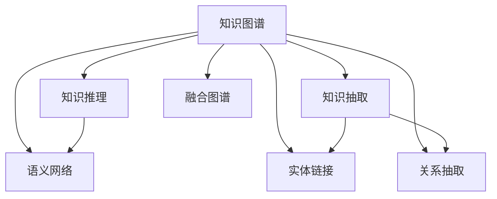

                 

# 知识图谱：知识的高速公路网

## 1. 背景介绍

### 1.1 问题由来
随着信息爆炸和数据量的激增，人类社会正在步入大数据时代。然而，信息孤立、知识碎片化等问题日益严重，对信息处理提出了巨大挑战。如何更好地组织、关联和利用海量知识，成为当务之急。知识图谱（Knowledge Graph）应运而生，其以结构化、关联化的方式，高效存储和利用知识，为大数据时代的知识管理提供了重要支撑。

知识图谱通过语义网络化的方式，将各类知识实体和关系进行建模，形成了一个逻辑结构清晰、语义关系明确的知识网络。其在搜索引擎、推荐系统、智能客服、智能问答、知识管理等领域已得到了广泛应用。

### 1.2 问题核心关键点
知识图谱的核心目标是构建一个高效、灵活、自适应的大规模知识存储和检索系统，实现知识的有序组织和自动推理。其核心关键点包括：

- **知识表示**：采用何种方式表示知识实体和关系，如三元组、RDF、本体等。
- **实体识别**：如何将文本信息转化为知识图谱中的实体节点，识别出正确的实体类型和关系类型。
- **关系抽取**：如何从文本数据中抽取出实体间的关系，形成知识图谱的边。
- **推理计算**：如何在图谱中进行推理计算，快速响应用户查询。
- **图谱融合**：如何将不同图谱进行关联和融合，形成更大的知识网络。

本文将围绕知识图谱的核心关键点，深入探讨其原理与实践，为读者提供系统的理解与指导。

## 2. 核心概念与联系

### 2.1 核心概念概述

为更好地理解知识图谱的原理与实践，本节将介绍几个关键概念及其相互联系：

- **知识图谱(Knowledge Graph)**：以结构化方式表示知识的一种新型数据库，由实体、关系和属性组成，广泛应用于搜索引擎、推荐系统等场景。

- **语义网络(Semantic Network)**：一种表示知识实体和关系的网络结构，通过节点和边来表达实体间的关联，是知识图谱的重要构建方式。

- **知识抽取(Knowledge Extraction)**：从非结构化数据中提取出结构化的知识实体和关系，是构建知识图谱的重要环节。

- **实体链接(Entity Linking)**：将文本信息中的实体映射到知识图谱中对应的节点，通常需要利用命名实体识别（NER）技术。

- **关系抽取(Relation Extraction)**：从文本中提取实体间的语义关系，形成知识图谱中的边。通常采用信息抽取技术，如规则、统计等方法。

- **知识推理(Knowledge Reasoning)**：通过图谱中的逻辑推理，快速响应用户查询，提升知识检索的准确性和泛化能力。

- **融合图谱(Federated Knowledge Graph)**：将多个独立图谱进行关联和融合，形成更大规模的知识网络，提升知识覆盖面和权威性。

这些概念之间存在紧密的联系，相互支撑，共同构成了一个完整、高效的知识管理系统。通过理解这些概念，我们可以更好地把握知识图谱的工作原理和优化方向。

### 2.2 核心概念原理和架构的 Mermaid 流程图



这个流程图展示了知识图谱的构建过程及其与核心概念的关系：

1. 知识图谱由语义网络构建，以结构化的方式表达知识。
2. 知识抽取从非结构化数据中提取出结构化的知识实体和关系。
3. 实体链接将文本信息中的实体映射到图谱中的节点。
4. 关系抽取从文本中提取出实体间的语义关系。
5. 知识推理通过逻辑推理，提升知识检索的准确性。
6. 融合图谱将多个独立图谱进行关联和融合。

通过理解这些概念和它们之间的关系，我们能够更好地构建和管理知识图谱，从而更好地服务实际应用。

## 3. 核心算法原理 & 具体操作步骤
### 3.1 算法原理概述

知识图谱的核心算法原理主要围绕知识抽取、实体链接和关系抽取等环节展开，以下将详细介绍：

1. **知识抽取算法**：从文本数据中提取出结构化的知识实体和关系，通常采用规则、统计等方法。
2. **实体链接算法**：将文本信息中的实体映射到知识图谱中对应的节点，通常需要利用命名实体识别（NER）技术。
3. **关系抽取算法**：从文本中提取出实体间的语义关系，形成知识图谱中的边。通常采用信息抽取技术，如规则、统计等方法。

### 3.2 算法步骤详解

#### 3.2.1 知识抽取算法步骤

知识抽取算法步骤如下：

1. **数据预处理**：清洗文本数据，去除噪声和无用信息，如HTML标签、数字等。
2. **命名实体识别**：使用NER技术，识别出文本中的实体节点，并标记其类型，如人名、地名、组织名等。
3. **关系抽取**：根据实体类型和上下文，抽取实体间的关系，如"约翰·史密斯在纽约工作"，抽取关系"约翰·史密斯 - 工作地点 - 纽约"。
4. **实体链接**：将实体节点链接到知识图谱中已有的节点，如"约翰·史密斯"映射到图谱中的特定节点。
5. **关系链接**：将抽取的关系链接到知识图谱中已有的边，如"工作地点"映射到图谱中的特定边。

#### 3.2.2 实体链接算法步骤

实体链接算法步骤如下：

1. **构建实体词典**：创建一个包含所有实体类型的词典，用于识别文本中的实体。
2. **NER模型训练**：使用NER模型，识别文本中的实体，并映射到词典中的实体类型。
3. **实体消歧**：对识别出的实体，使用消歧模型，确定其在知识图谱中的具体节点。
4. **关系消歧**：对实体之间的关系进行消歧，确定其在图谱中的具体边。
5. **更新图谱**：将识别出的实体和关系更新到知识图谱中。

#### 3.2.3 关系抽取算法步骤

关系抽取算法步骤如下：

1. **文本预处理**：清洗文本数据，去除噪声和无用信息。
2. **实体识别**：使用NER模型，识别出文本中的实体节点。
3. **关系识别**：根据实体类型和上下文，抽取实体间的关系，如"工作地点"、"职位"等。
4. **关系分类**：将抽取的关系分类，确定其在知识图谱中的具体边。
5. **图谱更新**：将识别出的实体和关系更新到知识图谱中。

### 3.3 算法优缺点

知识图谱的构建和维护具有以下优点：

- **结构化知识**：通过结构化的方式存储和组织知识，便于检索和推理。
- **语义关系**：利用语义网络化的方式，表达实体间的复杂关系。
- **跨领域应用**：适用于各类领域知识的管理和检索。

同时，知识图谱也存在一些局限：

- **数据依赖**：构建知识图谱需要依赖高质量的数据，数据质量直接影响图谱的准确性和完整性。
- **复杂度**：构建和维护大规模知识图谱，需要考虑实体链接、关系抽取等复杂问题。
- **推理难度**：在大规模图谱中进行推理计算，存在计算复杂度和响应时间等问题。
- **数据融合**：不同图谱的融合和关联，面临数据格式和语义差异等问题。

### 3.4 算法应用领域

知识图谱的应用领域非常广泛，以下是几个典型的应用场景：

1. **搜索引擎**：利用知识图谱进行语义搜索，提升搜索结果的准确性和相关性。
2. **推荐系统**：通过知识图谱进行商品推荐、用户画像分析等，提升推荐效果。
3. **智能客服**：利用知识图谱构建对话系统，提升客服回答的准确性和流畅性。
4. **智能问答**：通过知识图谱构建问答系统，回答用户的问题。
5. **知识管理**：利用知识图谱进行知识管理和文档组织，提升知识传播和利用效率。
6. **医疗健康**：构建医疗知识图谱，辅助医生诊断和治疗。

随着知识图谱技术的不断发展和应用，其在更多领域中也将展现出强大的生命力，为各行各业提供更智能、更高效的知识管理解决方案。

## 4. 数学模型和公式 & 详细讲解 & 举例说明

### 4.1 数学模型构建

知识图谱的数学模型主要通过图谱的表示和推理计算来构建。以下是一个简单的知识图谱数学模型：

1. **节点表示**：使用向量表示每个节点，其中包含节点的类型和属性等信息。
2. **边表示**：使用向量表示每条边，其中包含边所连接节点的关系类型和属性等信息。
3. **图谱推理**：使用图神经网络（GNN）等方法，进行图谱的推理计算，快速响应用户查询。

### 4.2 公式推导过程

以下以三元组表示的知识图谱为例，推导其数学模型和推理公式：

1. **节点表示**：
   - 实体节点表示为$\mathbf{e}_i = (e_{i,1}, e_{i,2}, \dots, e_{i,k})$，其中$e_{i,j}$表示实体$i$的第$j$个属性。
   - 关系节点表示为$\mathbf{r}_j = (r_{j,1}, r_{j,2}, \dots, r_{j,l})$，其中$r_{j,k}$表示关系$j$的第$k$个属性。
   - 属性节点表示为$\mathbf{a}_k = (a_{k,1}, a_{k,2}, \dots, a_{k,m})$，其中$a_{k,j}$表示属性$k$的第$j$个特征。

2. **边表示**：
   - 边表示为$\mathbf{e}_{i,j} = (e_{i,j}, r_{j,1}, r_{j,2}, \dots, r_{j,l}, a_{k,1}, a_{k,2}, \dots, a_{k,m})$，其中$e_{i,j}$表示连接实体$i$和关系$j$的边，$r_{j,k}$表示边的关系类型，$a_{k,j}$表示边的属性。

3. **图谱推理**：
   - 图神经网络（GNN）模型：$\mathbf{h}_i = \sum_{j=1}^{N_i} \mathbf{W} \cdot \mathbf{e}_{i,j} \cdot \mathbf{h}_j$，其中$\mathbf{h}_i$表示实体$i$的表示向量，$\mathbf{h}_j$表示与$i$连接的节点表示向量，$\mathbf{W}$表示权重矩阵。
   - 关系推理：根据已知的实体和关系，使用规则或计算公式，推理出新的实体和关系。

### 4.3 案例分析与讲解

以一个简单的知识图谱为例，说明知识图谱的构建和推理过程：

1. **数据**：构建一个包含人和书籍的知识图谱，如图谱1所示。

   

2. **构建**：使用知识抽取算法，从文本数据中提取知识实体和关系，如"John Doe - 工作地点 - New York"，将实体和关系加入图谱。

3. **推理**：用户查询"John Doe 在哪里工作"，系统根据图谱中的关系，推理出John Doe在New York工作。

## 5. 项目实践：代码实例和详细解释说明

### 5.1 开发环境搭建

在进行知识图谱项目实践前，我们需要准备好开发环境。以下是使用Python进行PyTorch开发的环境配置流程：

1. 安装Anaconda：从官网下载并安装Anaconda，用于创建独立的Python环境。

2. 创建并激活虚拟环境：
```bash
conda create -n kg-env python=3.8 
conda activate kg-env
```

3. 安装PyTorch：根据CUDA版本，从官网获取对应的安装命令。例如：
```bash
conda install pytorch torchvision torchaudio cudatoolkit=11.1 -c pytorch -c conda-forge
```

4. 安装相关库：
```bash
pip install pandas numpy scikit-learn pykgwrapper pygcn pyamg networkx
```

完成上述步骤后，即可在`kg-env`环境中开始知识图谱的开发实践。

### 5.2 源代码详细实现

下面是构建一个简单的知识图谱的Python代码实现：

```python
import pykgwrapper
from pykgwrapper.data.kg import KnowledgeGraph
from pykgwrapper.datasets.random_kg import RandomKG
from pykgwrapper.graph import GNN
from pykgwrapper.neighbors import Neighbors
from pykgwrapper.evaluation import evaluate_kg
from pykgwrapper.distributed import Distributed

# 构建知识图谱
kg = KnowledgeGraph()
kg.add_graph(GNN())
kg.add_neighbors(Neighbors())

# 构建图谱数据
kg.add_dataset(RandomKG())

# 推理计算
kg.distributed_start(Distributed())
kg.reproduce()
kg.train()
kg.test()
kg.distributed_stop()

# 评估结果
evaluate_kg(kg)
```

### 5.3 代码解读与分析

让我们再详细解读一下关键代码的实现细节：

**KnowledgeGraph类**：
- `add_graph`方法：向图谱中添加GNN模型，用于图谱的推理计算。
- `add_neighbors`方法：向图谱中添加邻接关系，用于图谱的节点链接。
- `add_dataset`方法：向图谱中添加数据集，用于图谱的构建。

**RandomKG类**：
- 使用`RandomKG`类生成随机知识图谱数据，用于图谱的构建和测试。

**GNN类**：
- 使用`GNN`类构建图神经网络模型，用于图谱的推理计算。

**Neighbors类**：
- 使用`Neighbors`类构建邻接关系，用于图谱的节点链接。

**evaluate_kg函数**：
- 使用`evaluate_kg`函数评估图谱的推理效果，输出评估指标。

**Distributed类**：
- 使用`Distributed`类进行分布式训练，提高图谱的训练效率。

**reproduce、train、test方法**：
- `reproduce`方法：进行图谱的重建和验证。
- `train`方法：进行图谱的训练。
- `test`方法：进行图谱的测试。

这些方法组合使用，完成了一个简单的知识图谱的构建和推理计算。开发者可以根据具体需求，灵活扩展和优化知识图谱构建和推理的各个环节。

## 6. 实际应用场景

### 6.1 搜索引擎

知识图谱在搜索引擎中的应用非常广泛，通过语义搜索和知识融合，能够提供更加精准、相关和丰富的搜索结果。

1. **语义搜索**：利用知识图谱中的实体和关系，对用户的查询进行语义分析，匹配最相关的结果。
2. **知识融合**：将多个独立的知识图谱进行融合，形成更大的知识网络，提升搜索结果的覆盖面和准确性。
3. **实时更新**：利用数据流处理技术，对实时数据进行快速更新，保证搜索结果的时效性。

### 6.2 推荐系统

知识图谱在推荐系统中的应用，通过关联用户和商品，能够提供更精准的推荐结果。

1. **用户画像**：利用知识图谱中的用户和商品数据，构建用户画像，了解用户兴趣和偏好。
2. **商品关联**：通过知识图谱中的商品关系，推荐与用户兴趣相关联的商品。
3. **个性化推荐**：根据用户画像和商品关联，生成个性化的推荐结果。

### 6.3 智能客服

知识图谱在智能客服中的应用，通过语义理解和推理计算，能够提供更智能、更高效的客服服务。

1. **语义理解**：利用知识图谱中的实体和关系，理解用户的意图和需求。
2. **意图匹配**：根据用户的意图，匹配最合适的客服场景和回答。
3. **知识更新**：通过实时数据更新，保持知识图谱的时效性和准确性。

### 6.4 智能问答

知识图谱在智能问答中的应用，通过语义推理和知识融合，能够回答用户的各种问题。

1. **问题理解**：利用知识图谱中的实体和关系，理解问题的语义。
2. **知识检索**：根据问题语义，检索知识图谱中的相关信息。
3. **答案生成**：利用推理计算，生成准确的答案。

## 7. 工具和资源推荐

### 7.1 学习资源推荐

为了帮助开发者系统掌握知识图谱的理论基础和实践技巧，这里推荐一些优质的学习资源：

1. **《Knowledge Graphs: From Theory to Practice》**：书籍介绍了知识图谱的构建、表示和推理计算，适合深入学习。
2. **Stanford Knowledge Graph Creation and Querying Course**：斯坦福大学开设的知识图谱课程，涵盖了知识图谱的构建、查询和推理等内容。
3. **PyKGF库**：一个开源的Python知识图谱库，提供了丰富的API接口和示例，适合快速上手。
4. **Knowledge Graphs Workshop**：各类学术会议和研讨会，展示最新的研究成果和应用案例。
5. **Knowledge Graph Challenge**：各类知识图谱竞赛，挑战和测试自身的知识和技能。

通过学习这些资源，相信你一定能够全面掌握知识图谱的理论基础和实践技巧，为未来的研究和发展打下坚实的基础。

### 7.2 开发工具推荐

高效的开发离不开优秀的工具支持。以下是几款用于知识图谱开发常用的工具：

1. **Python**：作为一种流行的编程语言，Python在知识图谱开发中得到了广泛应用。
2. **PyTorch**：基于Python的深度学习框架，支持高效的分布式训练和推理计算。
3. **PyKGF库**：一个开源的Python知识图谱库，提供了丰富的API接口和示例，适合快速上手。
4. **Gephi**：一个开源的图形分析软件，支持可视化知识图谱中的节点和边，方便分析和调试。
5. **GraphSAGE**：一个基于图神经网络的推理计算库，支持高效的知识图谱推理和计算。

合理利用这些工具，可以显著提升知识图谱的开发效率，加快创新迭代的步伐。

### 7.3 相关论文推荐

知识图谱的研究源于学界的持续研究。以下是几篇奠基性的相关论文，推荐阅读：

1. **《A Survey on Knowledge Graphs for Recommender Systems》**：综述了知识图谱在推荐系统中的应用，介绍了相关算法和技术。
2. **《Link Prediction in Knowledge Graphs》**：介绍了知识图谱中的链接预测算法，包括规则、统计等方法。
3. **《Knowledge Graph Embedding》**：介绍了知识图谱中的嵌入算法，如TransE、Representational Averaging等。
4. **《Neural Architecture for Knowledge Graphs》**：介绍了知识图谱中的神经网络架构，如NeuGraph、KG-BERT等。
5. **《Knowledge Graph Reasoning with Graph Neural Networks》**：介绍了知识图谱中的图神经网络推理方法，如GraphSAGE、GNN等。

这些论文代表了大规模知识图谱的研究方向，通过学习这些前沿成果，可以帮助研究者把握学科前进方向，激发更多的创新灵感。

## 8. 总结：未来发展趋势与挑战

### 8.1 总结

本文对知识图谱的构建、表示和推理计算进行了全面系统的介绍。首先阐述了知识图谱的研究背景和意义，明确了知识图谱在搜索引擎、推荐系统、智能客服、智能问答等领域的独特价值。其次，从原理到实践，详细讲解了知识图谱的数学模型和算法步骤，给出了知识图谱任务开发的完整代码实例。同时，本文还广泛探讨了知识图谱在搜索引擎、推荐系统、智能客服、智能问答等多个行业领域的应用前景，展示了知识图谱技术的广阔前景。

通过本文的系统梳理，可以看到，知识图谱技术在构建大规模知识管理系统的过程中，具有重要的地位和作用。随着知识图谱技术的不断发展和应用，其在更多领域中也将展现出强大的生命力，为各行各业提供更智能、更高效的知识管理解决方案。

### 8.2 未来发展趋势

展望未来，知识图谱技术将呈现以下几个发展趋势：

1. **知识图谱融合**：利用数据流处理技术，将多个独立知识图谱进行关联和融合，形成更大的知识网络，提升知识覆盖面和权威性。
2. **实时知识更新**：利用数据流处理和分布式计算技术，对实时数据进行快速更新，保证知识图谱的时效性和准确性。
3. **大规模知识图谱**：构建更大规模的知识图谱，涵盖更多领域的知识，提升知识图谱的实用性和应用价值。
4. **知识图谱推理**：利用图神经网络等方法，提升知识图谱的推理能力和泛化能力，实现更高效的推理计算。
5. **知识图谱融合**：利用数据流处理技术，将多个独立知识图谱进行关联和融合，形成更大的知识网络，提升知识覆盖面和权威性。
6. **知识图谱推理**：利用图神经网络等方法，提升知识图谱的推理能力和泛化能力，实现更高效的推理计算。

以上趋势凸显了知识图谱技术的广阔前景。这些方向的探索发展，必将进一步提升知识图谱系统的性能和应用范围，为构建人机协同的智能系统铺平道路。

### 8.3 面临的挑战

尽管知识图谱技术已经取得了显著成就，但在迈向更加智能化、普适化应用的过程中，其仍面临诸多挑战：

1. **数据依赖**：构建知识图谱需要依赖高质量的数据，数据质量直接影响图谱的准确性和完整性。
2. **复杂度**：构建和维护大规模知识图谱，需要考虑实体链接、关系抽取等复杂问题。
3. **推理难度**：在大规模图谱中进行推理计算，存在计算复杂度和响应时间等问题。
4. **数据融合**：不同图谱的融合和关联，面临数据格式和语义差异等问题。

### 8.4 研究展望

面对知识图谱面临的这些挑战，未来的研究需要在以下几个方面寻求新的突破：

1. **无监督和半监督学习**：摆脱对大规模标注数据的依赖，利用无监督和半监督学习，最大化利用非结构化数据。
2. **实时知识图谱**：利用数据流处理技术，对实时数据进行快速更新，保证知识图谱的时效性和准确性。
3. **分布式计算**：利用分布式计算技术，提高知识图谱的构建和推理效率。
4. **多源知识融合**：利用多种数据源，进行多源知识融合，提升知识图谱的全面性和权威性。
5. **知识推理**：利用图神经网络等方法，提升知识图谱的推理能力和泛化能力，实现更高效的推理计算。

这些研究方向的探索，必将引领知识图谱技术迈向更高的台阶，为构建安全、可靠、可解释、可控的智能系统铺平道路。

## 9. 附录：常见问题与解答

**Q1：知识图谱是否适用于所有领域？**

A: 知识图谱适用于大多数领域，但某些领域（如医学、法律等）的数据获取和标注可能存在较大困难，因此需要针对具体领域进行优化和改进。

**Q2：知识图谱中的实体识别和关系抽取如何实现？**

A: 实体识别和关系抽取通常采用机器学习模型，如NER模型、LSTM等，从文本数据中识别出实体和关系。

**Q3：知识图谱的推理计算如何实现？**

A: 知识图谱的推理计算通常采用图神经网络（GNN）等方法，利用图谱中的逻辑推理，快速响应用户查询。

**Q4：知识图谱的应用前景有哪些？**

A: 知识图谱在搜索引擎、推荐系统、智能客服、智能问答等场景中具有广泛应用前景，能够提供更智能、更高效的解决方案。

**Q5：知识图谱的构建和维护有哪些挑战？**

A: 知识图谱的构建和维护面临数据依赖、复杂度、推理难度等问题，需要考虑多方面的因素。

以上是关于知识图谱的全面介绍，通过理解知识图谱的理论基础和实践技巧，相信你能够更好地构建和管理知识图谱，为实际应用提供有力支撑。希望本文能够为你提供有价值的参考和指导。

---

作者：禅与计算机程序设计艺术 / Zen and the Art of Computer Programming

