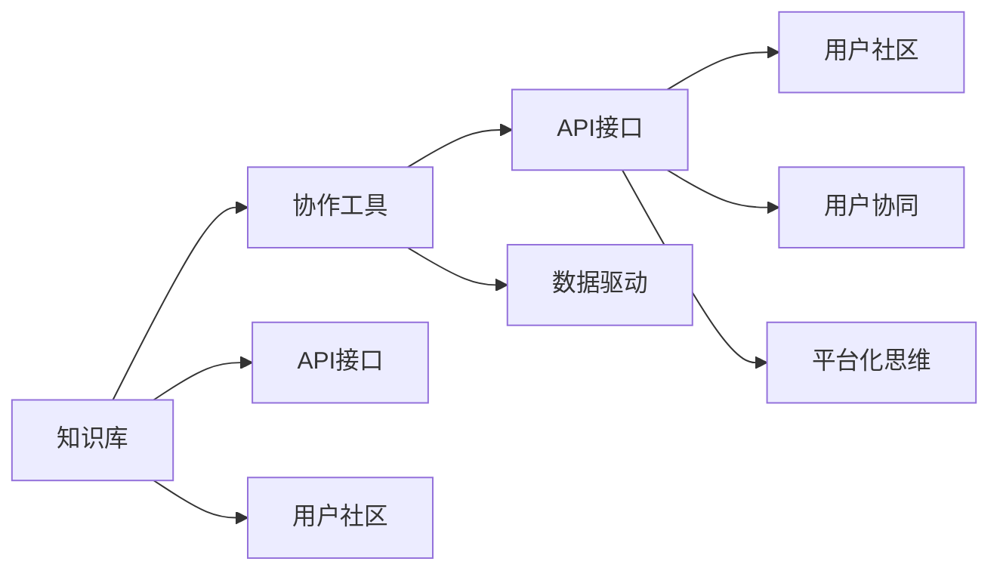

                 

# 知识的共创：开放创新平台的力量

> 关键词：开放创新平台、知识共创、智慧众包、开源社区、知识图谱、数据共享、创新生态

## 1. 背景介绍

### 1.1 问题由来
在快速发展的数字化时代，知识创新已成为推动经济增长和社会进步的关键动力。然而，知识的产生与获取仍面临诸多挑战：资源分散、成本高昂、协作困难、数据孤岛等问题限制了知识流动和应用。为了破解这些难题，学者和企业纷纷探索开放创新平台，利用互联网技术汇聚智慧，促进知识的共享与利用。

### 1.2 问题核心关键点
开放创新平台的核心在于打破知识孤岛，利用开放的协作网络，汇聚全球的智慧资源。这些平台不仅提供了便捷的知识获取渠道，还通过用户互动和数据共享，驱动了知识的共创和创新。主要关注点包括：

- 如何高效汇聚和组织知识资源
- 如何促进用户之间的知识交流与协作
- 如何通过数据共享驱动知识创新
- 如何构建可持续的创新生态系统

### 1.3 问题研究意义
通过开放创新平台，加速知识共创和创新，具有以下几个重要意义：

1. **推动经济增长**：知识驱动的创新是高科技产业的核心，开放创新平台为各类企业、研究人员提供便捷的协作工具和资源，加速技术创新，推动经济增长。
2. **促进社会进步**：通过开放的知识共享和创新协作，解决社会重大问题，如气候变化、公共健康等，提升社会福祉。
3. **激发学术活力**：学术研究也需要广泛的知识协作，开放创新平台为研究人员提供了丰富的数据和工具，促进了学术交流和成果共享。
4. **加速产业升级**：各行各业利用创新平台的资源进行技术改造和流程优化，推动了产业的数字化转型和智能化升级。

## 2. 核心概念与联系

### 2.1 核心概念概述

开放创新平台基于互联网技术，汇聚全球智慧资源，促进知识共创与共享。其主要组成包括：

- **知识库**：收集、存储、组织各类知识资源，如文献、案例、数据等。
- **协作工具**：支持用户之间的知识交流、评论、讨论等协作行为。
- **API接口**：提供可编程接口，便于开发者集成平台功能，开发创新应用。
- **用户社区**：聚集对特定领域感兴趣的用户，形成知识共同体。

开放创新平台的关键原理包括：

- **平台化思维**：通过平台化的组织和机制，整合各类知识资源，促进知识流动。
- **用户协同**：鼓励用户积极参与知识的创造、交流和利用。
- **数据驱动**：利用数据挖掘和分析，发现知识之间的关系和模式，驱动创新。

这些核心概念之间存在着紧密的联系，共同构建了开放创新平台的运作框架。

### 2.2 核心概念原理和架构的 Mermaid 流程图(Mermaid 流程节点中不要有括号、逗号等特殊字符)



## 3. 核心算法原理 & 具体操作步骤

### 3.1 算法原理概述

开放创新平台的知识共创与共享机制主要依赖于算法和模型进行驱动。算法核心在于如何高效汇聚知识资源、如何促进用户间的知识交流、如何利用数据驱动创新。

### 3.2 算法步骤详解

1. **知识汇聚算法**：
   - **爬虫技术**：利用网络爬虫技术，自动获取各类在线资源，如维基百科、学术论文、专利等，存储到平台知识库。
   - **文本处理技术**：对获取的知识资源进行预处理，包括去除重复、降噪、分词、主题提取等，构建知识图谱。

2. **用户协作算法**：
   - **社交网络分析**：利用社交网络算法，识别知识网络中的关键节点和关系，促进用户间的知识交流和协作。
   - **推荐系统**：基于用户行为数据，推荐相关的知识资源和用户，增强用户间的知识共享和交流。

3. **知识驱动创新算法**：
   - **数据挖掘技术**：利用数据挖掘技术，发现知识之间的关系和模式，驱动创新。
   - **机器学习技术**：基于历史数据，训练预测模型，辅助用户进行创新决策。

### 3.3 算法优缺点

开放创新平台的算法主要优点包括：

- **高效汇聚知识**：利用自动化技术，快速汇聚海量知识资源，降低成本。
- **促进知识交流**：通过社交网络和推荐系统，促进用户间的知识交流和协作。
- **数据驱动创新**：利用数据挖掘和机器学习，发现知识之间的关系和模式，驱动创新。

然而，开放创新平台也存在一些缺点：

- **数据质量问题**：网络爬虫获取的资源可能存在不完整、不精准的问题，影响知识质量。
- **用户隐私问题**：平台用户数据的隐私和安全问题，需要引起足够重视。
- **知识孤岛**：不同平台之间的知识孤岛问题，限制了知识的共享和应用。

### 3.4 算法应用领域

开放创新平台已在多个领域得到应用，包括：

- **医疗健康**：利用知识库和协作工具，汇聚医疗专家和患者知识，提升诊疗效果。
- **科学研究**：构建学科知识图谱，促进学术交流和合作，加速科研成果的产出。
- **工业制造**：通过数据共享和创新协作，推动技术革新和流程优化。
- **金融投资**：提供投资案例和专家评论，辅助投资决策，降低投资风险。

## 4. 数学模型和公式 & 详细讲解 & 举例说明（备注：数学公式请使用latex格式，latex嵌入文中独立段落使用 $$，段落内使用 $)

### 4.1 数学模型构建

开放创新平台的算法构建主要依赖于以下几个数学模型：

- **知识图谱模型**：基于知识库中的知识元组，构建图结构表示知识之间的关系和模式。
- **社交网络模型**：利用用户行为数据，构建社交网络模型，识别关键节点和关系。
- **推荐系统模型**：利用用户行为数据和知识资源，训练推荐模型，推荐相关知识资源和用户。

### 4.2 公式推导过程

以知识图谱模型为例，知识元组可以表示为 $(实体,属性,值)$，如 $(王芳,年龄,30)$。知识图谱的构建过程如下：

1. **实体识别**：利用NLP技术，从知识资源中提取实体，如人名、地点、时间等。
2. **关系抽取**：基于自然语言理解技术，从文本中抽取实体之间的关系，如"王芳30岁"。
3. **知识融合**：将从不同资源抽取的知识进行融合，构建统一的知识图谱。

### 4.3 案例分析与讲解

**案例：智慧医疗平台的知识图谱构建**

- **目标**：构建医疗知识图谱，汇聚医疗专家和患者知识，辅助诊疗。
- **方法**：利用NLP技术从医学文献、患者记录中提取知识元组，构建医疗知识图谱。
- **结果**：通过知识图谱查询，快速获取相关病例和诊疗方案，提升诊疗效果。

## 5. 项目实践：代码实例和详细解释说明

### 5.1 开发环境搭建

开发环境搭建主要包括以下步骤：

1. **安装Python和相关库**：
   ```bash
   pip install pandas numpy scikit-learn networkx graph-tool
   ```

2. **搭建知识图谱环境**：
   ```bash
   mkdir graphdb
   cd graphdb
   pip install graph-tool
   ```

### 5.2 源代码详细实现

**知识图谱构建代码示例**：

```python
import pandas as pd
from graph_tool import Graph, GraphDOT
from graph_tool.cluster import label_propagation
from graph_tool.topology import create_shortest_paths

# 读取知识资源
df = pd.read_csv('knowledge.csv')

# 构建知识图谱
graph = Graph(directed=False)
source = graph.add_vertex()
target = graph.add_vertex()
edge = graph.add_edge(source, target)

# 添加实体、关系和值
graph.add_vertex(lab=df['实体'][0])
graph.add_vertex(lab=df['实体'][1])
graph.add_edge(graph.vertex_label_map[df['关系']], graph.vertices[0], graph.vertices[1], label=df['值'][0])

# 可视化知识图谱
graphviz = GraphDOT(graph)
graphviz.draw('knowledge_graph.png', rankdir='LR', overlap=False, groupstyle='sphere', output_format='png')
```

### 5.3 代码解读与分析

**代码解析**：
- **GraphTool库**：用于构建和操作图结构。
- **知识图谱构建**：从知识库中读取知识元组，构建知识图谱，添加实体、关系和值。
- **可视化**：使用GraphDOT库将知识图谱可视化，便于理解和分析。

### 5.4 运行结果展示

**运行结果**：
- **知识图谱可视化**：

## 6. 实际应用场景

### 6.1 智慧医疗

智慧医疗平台通过汇聚医疗专家和患者知识，构建医疗知识图谱，提升诊疗效果。

**应用场景**：

- **医疗知识图谱**：汇聚医学文献、患者记录等知识资源，构建医疗知识图谱。
- **知识查询**：医生和患者可以通过查询图谱，获取相关病例和诊疗方案。
- **协作推荐**：利用社交网络算法，推荐相关医生和专家，促进知识交流和协作。

### 6.2 科研创新

科研创新平台利用开放的知识资源和协作工具，促进学术交流和合作，加速科研成果产出。

**应用场景**：

- **知识库**：汇聚学术论文、专利、综述等知识资源。
- **协作工具**：支持用户之间的知识交流、评论、讨论。
- **数据共享**：通过API接口，促进数据共享和开放利用。

### 6.3 工业制造

工业制造平台利用数据共享和创新协作，推动技术革新和流程优化。

**应用场景**：

- **知识图谱**：汇聚制造领域的知识资源，构建行业知识图谱。
- **协作工具**：支持工程师之间的知识交流和协作。
- **数据驱动**：利用数据分析和机器学习，优化制造流程和设备维护。

### 6.4 金融投资

金融投资平台提供投资案例和专家评论，辅助投资决策，降低投资风险。

**应用场景**：

- **知识库**：汇聚金融领域的知识资源，如市场报告、公司财报等。
- **协作工具**：支持投资者之间的知识交流和讨论。
- **推荐系统**：基于历史数据和用户行为，推荐相关投资案例和专家评论。

## 7. 工具和资源推荐

### 7.1 学习资源推荐

1. **Coursera《Open Collaboration Technologies》课程**：介绍开放创新平台的概念、构建和应用。
2. **Kaggle数据科学竞赛**：通过实际案例，学习数据挖掘和机器学习技术。
3. **IEEE Xplore数据库**：访问各类学术文章和专利，了解最新的知识图谱和推荐系统算法。
4. **Google Scholar**：搜索学术论文，了解学术研究进展。
5. **Codecademy**：学习Python和相关库的使用，提高编程能力。

### 7.2 开发工具推荐

1. **GitHub**：开源社区，获取知识图谱和推荐系统的代码示例。
2. **Google Colab**：免费提供GPU/TPU算力，方便实验最新模型。
3. **Jupyter Notebook**：在线编程环境，方便协作开发和展示代码。
4. **PyTorch**：深度学习框架，支持知识图谱和推荐系统的实现。
5. **GraphTool**：图结构处理库，支持知识图谱的构建和操作。

### 7.3 相关论文推荐

1. **Jarvelin et al., "Semantic Web"**：介绍语义网和知识图谱的基本概念和技术。
2. **Rendle et al., "BPR: Bayesian Personalized Ranking from Implicit Feedback"**：介绍基于隐式反馈的推荐系统算法。
3. **Barabasi et al., "Network Science"**：介绍社交网络和知识图谱的建模和分析方法。
4. **Havelka et al., "An Overview of the "Taxonomy of Artificial Intelligence: From Symbolic to Statistical to Human-AI Cooperative"**：介绍AI的不同分支和应用场景。
5. **Li et al., "Knowledge Graph Embeddings: A Survey and the Future Directions"**：介绍知识图谱的嵌入技术及其应用。

## 8. 总结：未来发展趋势与挑战

### 8.1 研究成果总结

开放创新平台通过汇聚和共享知识资源，促进了知识的共创和创新。目前主要研究内容包括知识图谱构建、推荐系统优化、社交网络分析等，已在医疗、科研、制造、金融等多个领域得到应用。

### 8.2 未来发展趋势

未来，开放创新平台将呈现以下几个发展趋势：

1. **知识图谱的智能化**：通过深度学习和自然语言处理技术，提升知识图谱的构建和查询效率。
2. **推荐系统的个性化**：利用协同过滤和深度学习技术，提高推荐系统的个性化和精准度。
3. **社交网络的动态化**：利用实时数据和动态网络分析，提升用户间的知识交流和协作效果。
4. **数据驱动的智慧化**：通过大规模数据挖掘和分析，驱动更多智慧应用的出现。
5. **开源社区的协同化**：鼓励更多开发者参与平台建设，提升平台的可持续性和开放性。

### 8.3 面临的挑战

开放创新平台在发展过程中仍面临以下挑战：

1. **数据质量问题**：网络爬虫获取的资源可能存在不完整、不精准的问题，影响知识质量。
2. **用户隐私问题**：平台用户数据的隐私和安全问题，需要引起足够重视。
3. **知识孤岛问题**：不同平台之间的知识孤岛问题，限制了知识的共享和应用。
4. **技术壁垒问题**：知识图谱、推荐系统等技术的复杂性和难度，限制了平台的应用普及。

### 8.4 研究展望

未来的研究需要在以下几个方面寻求新的突破：

1. **跨平台数据整合**：解决知识孤岛问题，构建统一的知识共享平台。
2. **隐私保护技术**：开发隐私保护技术，保障用户数据的隐私和安全。
3. **智能化技术**：引入深度学习和自然语言处理技术，提升知识图谱和推荐系统的性能。
4. **开放社区建设**：鼓励更多开发者和用户参与平台建设，构建可持续的开放创新生态。

## 9. 附录：常见问题与解答

**Q1：如何提高知识图谱的构建效率？**

A: 利用深度学习和自然语言处理技术，提高实体识别和关系抽取的准确性。同时，引入自动化工具，加速知识图谱的构建。

**Q2：如何提升推荐系统的个性化？**

A: 利用协同过滤和深度学习技术，基于用户历史行为和兴趣，提高推荐系统的个性化和精准度。

**Q3：如何保障用户数据的隐私和安全？**

A: 采用数据加密、匿名化处理等技术，保障用户数据的隐私和安全。同时，引入访问控制和权限管理机制，限制数据访问权限。

**Q4：如何打破知识孤岛？**

A: 构建跨平台的知识共享机制，实现不同平台之间的数据互通和资源共享。

**Q5：如何应对技术壁垒问题？**

A: 加强跨学科的合作和交流，引入更多领域的专家参与平台建设。同时，提供详细的使用手册和培训，降低技术门槛。

---

作者：禅与计算机程序设计艺术 / Zen and the Art of Computer Programming

