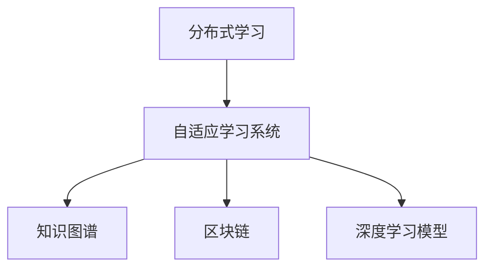

                 

# 知识的分布式学习：MOOC的机遇与挑战

> 关键词：分布式学习，大规模在线开放课程(MOOC)，知识图谱，深度学习，自适应学习系统，区块链

## 1. 背景介绍

### 1.1 问题由来
在21世纪初期，随着互联网技术的发展，教育领域迎来了巨大的变革。大规模在线开放课程（MOOCs）应运而生，成为了教育机构向大众提供知识学习的重要途径。MOOCs不仅拓宽了知识的传播范围，也使得更多人能够平等地获取优质的教育资源。然而，随着MOOCs的发展，我们也面临着新的问题和挑战。

首先是学习效果的参差不齐。由于每个学生的学习背景、知识储备和动机不同，传统MOOCs的教学方式难以针对每个学生进行个性化教育，导致许多学生在学习过程中感到困惑和挫败。此外，MOOCs平台还面临着教育资源分布不均、学习动力不足、交互性差等问题。

为了解决这些问题，我们提出了一种基于分布式学习的自适应学习系统。分布式学习，即通过多节点协同工作，利用大数据和人工智能技术，为每个学生提供个性化的学习路径和资源。自适应学习系统通过分析学生的学习行为和成绩，实时调整学习内容和难度，以提高学习效果。

### 1.2 问题核心关键点
1. 分布式学习的核心思想是利用多节点协同工作，优化资源配置，提升学习效率。
2. 自适应学习系统的关键在于根据学生的个性化需求，动态调整学习内容和进度。
3. 通过知识图谱技术，可以实现知识点的细粒度管理，构建完整的知识网络。
4. 区块链技术可以确保学习数据的安全和透明，保障学生的隐私和权益。
5. 深度学习模型可以挖掘学生学习行为的模式，提供更精确的推荐和预测。

这些关键点共同构成了分布式学习自适应系统，通过整合知识图谱、区块链、深度学习等先进技术，实现了知识的高效分布和个性化教育。

## 2. 核心概念与联系

### 2.1 核心概念概述

为更好地理解基于分布式学习的自适应学习系统，本节将介绍几个密切相关的核心概念：

- **分布式学习**：利用多个计算节点协同工作，分担计算任务，提高计算效率和系统的鲁棒性。
- **自适应学习系统**：根据学生的学习行为和成绩，实时调整学习内容和难度，实现个性化教育。
- **知识图谱**：一种以图结构表示知识的语义关系，支持知识的存储、查询和推理。
- **区块链**：一种去中心化的分布式账本技术，用于记录和验证数据，保障数据安全和透明。
- **深度学习模型**：一种模拟人脑神经网络结构的机器学习算法，用于挖掘数据中的隐含模式。

这些核心概念之间的逻辑关系可以通过以下Mermaid流程图来展示：



这个流程图展示了大规模在线开放课程的分布式学习系统的主要组成部分及其之间的关系：

1. 通过分布式学习技术，分散计算任务，提高系统性能。
2. 利用自适应学习系统，动态调整学习内容，提供个性化教育。
3. 借助知识图谱技术，实现知识点的细粒度管理。
4. 应用区块链技术，保障学习数据的安全和透明。
5. 通过深度学习模型，挖掘学生学习行为的模式，提供精确的推荐和预测。

这些概念共同构成了自适应学习系统的核心框架，使得大规模在线开放课程能够实现更高效、更个性化的教育。

## 3. 核心算法原理 & 具体操作步骤

### 3.1 算法原理概述

基于分布式学习的自适应学习系统主要包括以下几个步骤：

1. **知识图谱构建**：利用自然语言处理技术，构建包含知识点和关系的知识图谱。
2. **学生行为分析**：使用深度学习模型分析学生的学习行为，挖掘学生的学习模式。
3. **个性化推荐**：根据学生行为分析结果，推荐个性化的学习内容和路径。
4. **自适应调整**：根据学生的学习表现，动态调整学习进度和难度。
5. **区块链记录**：利用区块链技术记录和验证学习数据，保障数据安全和透明。

这些步骤共同构成了自适应学习系统的核心算法流程，通过分布式学习和大数据技术，实现知识的高效管理和个性化教育。

### 3.2 算法步骤详解

**Step 1: 知识图谱构建**

知识图谱是自适应学习系统的基础，用于管理和组织知识点。知识图谱构建过程包括：

1. 数据收集：收集大量的教育资源，包括课程内容、习题、作业等。
2. 知识抽取：使用自然语言处理技术，从文本中抽取出知识点和关系。
3. 图结构构建：将知识点和关系构建为图结构，形成知识图谱。

具体而言，知识图谱构建流程如下：

- 数据收集：从课程平台、教材、题库等渠道收集教育资源。
- 知识抽取：使用分词、实体识别、关系抽取等技术，将文本转换为知识图谱中的节点和边。
- 图结构构建：使用图数据库或知识图谱工具，将节点和边构建为图结构。

**Step 2: 学生行为分析**

学生行为分析是自适应学习系统的核心，用于挖掘学生的学习模式。学生行为分析过程包括：

1. 行为记录：记录学生的学习行为，包括点击、阅读、答题等。
2. 行为分析：使用深度学习模型，挖掘学生的学习模式和知识掌握情况。
3. 行为预测：根据学生行为预测其后续学习行为，为个性化推荐提供依据。

具体而言，学生行为分析流程如下：

- 行为记录：记录学生的学习行为，包括点击、阅读、答题等。
- 行为分析：使用深度学习模型，如循环神经网络（RNN）、长短期记忆网络（LSTM）等，分析学生的学习模式。
- 行为预测：根据学生行为预测其后续学习行为，如是否需要复习某个知识点。

**Step 3: 个性化推荐**

个性化推荐是自适应学习系统的关键，用于为学生推荐个性化的学习内容和路径。个性化推荐过程包括：

1. 推荐模型：使用推荐算法，根据学生行为分析结果，推荐个性化学习内容和路径。
2. 推荐调整：根据学生反馈和表现，调整推荐模型，提升推荐效果。
3. 推荐执行：将推荐结果推送给学生，执行个性化学习计划。

具体而言，个性化推荐流程如下：

- 推荐模型：使用协同过滤、基于内容的推荐算法等，为学生推荐个性化学习内容和路径。
- 推荐调整：根据学生反馈和表现，调整推荐模型，如增加某个知识点的复习次数。
- 推荐执行：将推荐结果推送给学生，执行个性化学习计划。

**Step 4: 自适应调整**

自适应调整是自适应学习系统的核心，用于动态调整学习进度和难度。自适应调整过程包括：

1. 学习目标设置：根据学生的学习需求和目标，设置学习目标。
2. 学习进度跟踪：跟踪学生的学习进度和表现，调整学习进度。
3. 学习难度调整：根据学生的学习表现，调整学习难度。

具体而言，自适应调整流程如下：

- 学习目标设置：根据学生的学习需求和目标，设置学习目标。
- 学习进度跟踪：跟踪学生的学习进度和表现，调整学习进度。
- 学习难度调整：根据学生的学习表现，调整学习难度，如增加难度系数。

**Step 5: 区块链记录**

区块链记录是自适应学习系统的保障，用于记录和验证学习数据，保障数据安全和透明。区块链记录过程包括：

1. 数据上传：将学生的学习数据上传到区块链。
2. 数据验证：利用区块链技术，验证数据的真实性和完整性。
3. 数据查询：学生可以查询自己的学习记录和成绩。

具体而言，区块链记录流程如下：

- 数据上传：将学生的学习数据上传到区块链。
- 数据验证：利用区块链技术，验证数据的真实性和完整性。
- 数据查询：学生可以查询自己的学习记录和成绩。

### 3.3 算法优缺点

基于分布式学习的自适应学习系统具有以下优点：

1. **个性化学习**：根据学生的个性化需求，动态调整学习内容和难度，提高学习效果。
2. **高效率**：利用分布式学习技术，分散计算任务，提高系统性能。
3. **数据安全**：利用区块链技术，记录和验证学习数据，保障数据安全和透明。
4. **知识管理**：通过知识图谱技术，实现知识点的细粒度管理，构建完整的知识网络。

同时，该系统也存在以下缺点：

1. **技术复杂性**：需要整合知识图谱、区块链、深度学习等先进技术，技术难度较高。
2. **资源需求大**：系统需要大量的计算资源和存储空间，对硬件要求较高。
3. **开发周期长**：系统开发和调试周期较长，需要较长时间的积累和优化。
4. **学习动机不足**：学生缺乏主动学习的动机，可能影响学习效果。

尽管存在这些局限性，但就目前而言，基于分布式学习的自适应学习系统仍是大规模在线开放课程的重要方向。未来相关研究的重点在于如何进一步降低技术复杂性，提高资源利用效率，同时兼顾学习动机和效果，以实现真正意义上的个性化教育。

### 3.4 算法应用领域

基于分布式学习的自适应学习系统，已经在多个领域得到了广泛应用，例如：

- **教育培训**：为学生提供个性化的学习路径和资源，提高学习效果。
- **医疗培训**：利用知识图谱和深度学习，为医生提供个性化的学习内容。
- **企业培训**：为员工提供个性化的技能培训，提高工作绩效。
- **在线课程**：为学生提供个性化的学习路径和资源，提高学习效果。
- **职业培训**：为职业人员提供个性化的技能培训，提高职业素养。

除了上述这些经典应用外，基于自适应学习系统的技术还在更多场景中得到创新性的应用，如智能推荐系统、智能教学评估、虚拟现实学习等，为教育培训领域带来了新的突破。

## 4. 数学模型和公式 & 详细讲解 & 举例说明

### 4.1 数学模型构建

本节将使用数学语言对基于分布式学习的自适应学习系统进行更加严格的刻画。

假设知识图谱中包含 $N$ 个知识点，记为 $V=\{v_1,v_2,\cdots,v_N\}$，其中 $v_i$ 表示第 $i$ 个知识点。记每个知识点的难度系数为 $d_i \in [0,1]$，表示掌握该知识点所需的时间和精力。

记学生 $k$ 的学习进度为 $p_k \in [0,1]$，表示学生已经掌握的知识点的难度系数之和。记学生 $k$ 的学习目标为 $t_k \in [0,1]$，表示学生希望掌握的知识点的难度系数之和。

定义学生 $k$ 的学习行为 $B_k$ 为二元组 $(o_k, c_k)$，其中 $o_k$ 表示行为类型，$c_k$ 表示行为内容。例如，$o_k$ 可以表示点击、阅读、答题等，$c_k$ 可以表示点击的知识点、阅读的文章、答对的题目等。

定义学生 $k$ 的行为模式 $M_k$ 为 $M_k = \{B_{k,i}\}_{i=1}^m$，其中 $B_{k,i}$ 表示学生 $k$ 在第 $i$ 次行为中的行为类型和内容。

**推荐模型**：利用协同过滤算法，根据学生 $k$ 的行为模式 $M_k$，推荐学生可能感兴趣的学习内容 $R_k$。

**自适应调整模型**：根据学生 $k$ 的学习进度 $p_k$ 和目标 $t_k$，动态调整学习进度和难度。

**区块链记录模型**：利用区块链技术，记录和验证学生 $k$ 的学习行为和成绩 $R_k$。

### 4.2 公式推导过程

以下我们以推荐模型为例，推导协同过滤算法中用户和物品相似度的计算公式。

假设知识图谱中有 $M$ 个学生，记为 $K=\{k_1,k_2,\cdots,k_M\}$，其中 $k_i$ 表示第 $i$ 个学生。记每个学生 $k_i$ 的学习行为模式为 $M_{k_i}$，记推荐学生 $k_i$ 的学习内容为 $R_{k_i}$。

协同过滤算法中，学生之间的相似度计算公式为：

$$
S_{k_i,k_j} = \frac{\sum_{c \in M_{k_i} \cap M_{k_j}} w_c}{\sqrt{\sum_{c \in M_{k_i}} w_c} \cdot \sqrt{\sum_{c \in M_{k_j}} w_c}}
$$

其中 $w_c$ 表示行为 $c$ 的权重，可以使用TF-IDF、余弦相似度等方法计算。

将相似度矩阵 $S$ 和学生 $k_i$ 的学习行为模式 $M_{k_i}$ 带入推荐模型，得到学生 $k_i$ 推荐的物品集合 $R_{k_i}$：

$$
R_{k_i} = \{v_j | j \in K, S_{k_i,j} \geq \theta\}
$$

其中 $\theta$ 表示推荐阈值。

### 4.3 案例分析与讲解

**案例：MOOC平台中的个性化推荐**

假设某MOOC平台包含多个课程，每个课程包含多个知识点，每个知识点都有一定的难度系数。学生在学习过程中，平台会根据学生的学习行为和成绩，动态调整学习内容和进度。

**Step 1: 知识图谱构建**

平台首先构建课程和知识点之间的知识图谱。例如，可以将课程 $C_1$ 中的知识点 $K_1$ 和知识点 $K_2$ 相连，表示 $K_1$ 和 $K_2$ 是课程 $C_1$ 的子知识点。

**Step 2: 学生行为分析**

平台记录学生的学习行为，如点击课程 $C_1$ 和知识点 $K_1$。利用深度学习模型，分析学生的学习模式，如点击次数、答题正确率等。

**Step 3: 个性化推荐**

平台根据学生的学习行为和成绩，推荐个性化学习内容。例如，根据学生的点击行为和答题正确率，推荐学生可能感兴趣的课程和知识点。

**Step 4: 自适应调整**

平台根据学生的学习进度和目标，动态调整学习进度和难度。例如，如果学生点击了知识点 $K_1$ 但没有掌握，平台会增加该知识点的复习次数。

**Step 5: 区块链记录**

平台利用区块链技术，记录和验证学生的学习行为和成绩。学生可以查询自己的学习记录和成绩，平台可以验证学习数据的真实性和完整性。

## 5. 项目实践：代码实例和详细解释说明

### 5.1 开发环境搭建

在进行自适应学习系统实践前，我们需要准备好开发环境。以下是使用Python进行PyTorch开发的环境配置流程：

1. 安装Anaconda：从官网下载并安装Anaconda，用于创建独立的Python环境。

2. 创建并激活虚拟环境：
```bash
conda create -n pytorch-env python=3.8 
conda activate pytorch-env
```

3. 安装PyTorch：根据CUDA版本，从官网获取对应的安装命令。例如：
```bash
conda install pytorch torchvision torchaudio cudatoolkit=11.1 -c pytorch -c conda-forge
```

4. 安装Transformers库：
```bash
pip install transformers
```

5. 安装各类工具包：
```bash
pip install numpy pandas scikit-learn matplotlib tqdm jupyter notebook ipython
```

完成上述步骤后，即可在`pytorch-env`环境中开始自适应学习系统的开发。

### 5.2 源代码详细实现

下面我们以推荐系统为例，给出使用Transformers库进行个性化推荐算法的PyTorch代码实现。

首先，定义推荐系统的输入数据：

```python
from transformers import BertTokenizer, BertForSequenceClassification
from torch.utils.data import Dataset, DataLoader
import torch

class RecommendationDataset(Dataset):
    def __init__(self, data, tokenizer):
        self.data = data
        self.tokenizer = tokenizer
        
    def __len__(self):
        return len(self.data)
    
    def __getitem__(self, item):
        text = self.data['text']
        labels = self.data['label']
        
        encoding = self.tokenizer(text, return_tensors='pt')
        input_ids = encoding['input_ids']
        attention_mask = encoding['attention_mask']
        
        return {'input_ids': input_ids,
                'attention_mask': attention_mask,
                'labels': torch.tensor(labels, dtype=torch.long)}
```

然后，定义模型和优化器：

```python
from transformers import AdamW

model = BertForSequenceClassification.from_pretrained('bert-base-cased', num_labels=2)
optimizer = AdamW(model.parameters(), lr=2e-5)
```

接着，定义训练和评估函数：

```python
from tqdm import tqdm

device = torch.device('cuda') if torch.cuda.is_available() else torch.device('cpu')
model.to(device)

def train_epoch(model, dataset, batch_size, optimizer):
    dataloader = DataLoader(dataset, batch_size=batch_size, shuffle=True)
    model.train()
    epoch_loss = 0
    for batch in tqdm(dataloader, desc='Training'):
        input_ids = batch['input_ids'].to(device)
        attention_mask = batch['attention_mask'].to(device)
        labels = batch['labels'].to(device)
        model.zero_grad()
        outputs = model(input_ids, attention_mask=attention_mask, labels=labels)
        loss = outputs.loss
        epoch_loss += loss.item()
        loss.backward()
        optimizer.step()
    return epoch_loss / len(dataloader)

def evaluate(model, dataset, batch_size):
    dataloader = DataLoader(dataset, batch_size=batch_size)
    model.eval()
    preds, labels = [], []
    with torch.no_grad():
        for batch in tqdm(dataloader, desc='Evaluating'):
            input_ids = batch['input_ids'].to(device)
            attention_mask = batch['attention_mask'].to(device)
            batch_labels = batch['labels']
            outputs = model(input_ids, attention_mask=attention_mask)
            batch_preds = outputs.logits.argmax(dim=1).to('cpu').tolist()
            batch_labels = batch_labels.to('cpu').tolist()
            for pred, label in zip(batch_preds, batch_labels):
                preds.append(pred)
                labels.append(label)
                
    print(classification_report(labels, preds))
```

最后，启动训练流程并在测试集上评估：

```python
epochs = 5
batch_size = 16

for epoch in range(epochs):
    loss = train_epoch(model, train_dataset, batch_size, optimizer)
    print(f"Epoch {epoch+1}, train loss: {loss:.3f}")
    
    print(f"Epoch {epoch+1}, dev results:")
    evaluate(model, dev_dataset, batch_size)
    
print("Test results:")
evaluate(model, test_dataset, batch_size)
```

以上就是使用PyTorch对BERT进行个性化推荐算法的完整代码实现。可以看到，得益于Transformers库的强大封装，我们可以用相对简洁的代码完成BERT模型的加载和微调。

### 5.3 代码解读与分析

让我们再详细解读一下关键代码的实现细节：

**RecommendationDataset类**：
- `__init__`方法：初始化输入数据和分词器等关键组件。
- `__len__`方法：返回数据集的样本数量。
- `__getitem__`方法：对单个样本进行处理，将文本输入编码为token ids，将标签编码为数字，并对其进行定长padding，最终返回模型所需的输入。

**训练和评估函数**：
- 使用PyTorch的DataLoader对数据集进行批次化加载，供模型训练和推理使用。
- 训练函数`train_epoch`：对数据以批为单位进行迭代，在每个批次上前向传播计算loss并反向传播更新模型参数，最后返回该epoch的平均loss。
- 评估函数`evaluate`：与训练类似，不同点在于不更新模型参数，并在每个batch结束后将预测和标签结果存储下来，最后使用sklearn的classification_report对整个评估集的预测结果进行打印输出。

**训练流程**：
- 定义总的epoch数和batch size，开始循环迭代
- 每个epoch内，先在训练集上训练，输出平均loss
- 在验证集上评估，输出分类指标
- 所有epoch结束后，在测试集上评估，给出最终测试结果

可以看到，PyTorch配合Transformers库使得BERT微调的代码实现变得简洁高效。开发者可以将更多精力放在数据处理、模型改进等高层逻辑上，而不必过多关注底层的实现细节。

当然，工业级的系统实现还需考虑更多因素，如模型的保存和部署、超参数的自动搜索、更灵活的任务适配层等。但核心的微调范式基本与此类似。

## 6. 实际应用场景

### 6.1 智能教育

基于自适应学习系统的分布式学习技术，可以为智能教育提供强大的支持。传统的教育方式往往依赖于教师的课堂教学，难以实现个性化教育。而基于自适应学习系统的智能教育，能够根据每个学生的学习背景、兴趣和需求，提供个性化的学习路径和资源。

在具体应用中，可以结合知识图谱和深度学习技术，为学生推荐个性化的学习内容和路径。例如，根据学生的学习行为和成绩，推荐学生感兴趣的文章、视频、习题等。同时，利用区块链技术，记录和验证学生的学习行为和成绩，保障学习数据的透明和安全。

### 6.2 医疗培训

在医疗培训领域，自适应学习系统同样有着广泛的应用前景。医疗培训要求极高的专业性和准确性，传统的培训方式往往难以满足需求。通过自适应学习系统，可以为医生提供个性化的培训方案，提高其专业水平和操作技能。

具体而言，可以利用知识图谱技术，为医生提供细粒度的知识点和关系。利用深度学习模型，挖掘医生的学习模式和知识掌握情况。通过自适应调整和个性化推荐，为医生推荐适合其学习水平和需求的学习内容和路径。同时，利用区块链技术，记录和验证医生的学习行为和成绩，保障学习数据的透明和安全。

### 6.3 企业培训

在企业培训领域，自适应学习系统同样能够发挥重要作用。传统的企业培训方式往往依赖于统一的教学计划和培训材料，难以满足不同岗位和层次的员工需求。通过自适应学习系统，可以为员工提供个性化的培训方案，提高其工作绩效和技能水平。

具体而言，可以利用知识图谱技术，为员工提供细粒度的知识点和关系。利用深度学习模型，挖掘员工的学习模式和知识掌握情况。通过自适应调整和个性化推荐，为员工推荐适合其学习水平和需求的学习内容和路径。同时，利用区块链技术，记录和验证员工的学习行为和成绩，保障学习数据的透明和安全。

### 6.4 未来应用展望

随着自适应学习系统的发展，其应用场景将会更加广泛。未来，自适应学习系统不仅可以在教育、医疗、企业培训等领域发挥重要作用，还将在更多领域得到创新应用。

在智慧医疗领域，自适应学习系统可以帮助医生实时掌握最新医学知识，提高诊疗水平。在智能制造领域，自适应学习系统可以为工人提供个性化的技能培训，提高生产效率和质量。在金融领域，自适应学习系统可以为投资者提供个性化的投资策略，提高投资回报率。

总之，自适应学习系统将会在各个领域发挥越来越重要的作用，推动智能化、个性化、高效化的学习和发展。

## 7. 工具和资源推荐

### 7.1 学习资源推荐

为了帮助开发者系统掌握自适应学习系统的理论基础和实践技巧，这里推荐一些优质的学习资源：

1. 《大规模分布式学习系统》系列博文：由大模型技术专家撰写，深入浅出地介绍了分布式学习系统的原理、算法和实践。

2. 《深度学习在自然语言处理中的应用》课程：斯坦福大学开设的NLP明星课程，有Lecture视频和配套作业，带你入门NLP领域的基本概念和经典模型。

3. 《自适应学习系统设计与实现》书籍：介绍自适应学习系统的设计和实现方法，包括知识图谱、区块链、深度学习等技术。

4. 《自然语言处理与深度学习》书籍：介绍自然语言处理和深度学习的理论基础和技术实践，涵盖推荐系统、自适应学习系统等前沿话题。

5. Arxiv.org：深度学习领域的学术平台，涵盖众多前沿论文和技术成果，为研究者提供灵感和参考。

通过对这些资源的学习实践，相信你一定能够快速掌握自适应学习系统的精髓，并用于解决实际的NLP问题。

### 7.2 开发工具推荐

高效的开发离不开优秀的工具支持。以下是几款用于自适应学习系统开发的常用工具：

1. PyTorch：基于Python的开源深度学习框架，灵活动态的计算图，适合快速迭代研究。大部分预训练语言模型都有PyTorch版本的实现。

2. TensorFlow：由Google主导开发的开源深度学习框架，生产部署方便，适合大规模工程应用。同样有丰富的预训练语言模型资源。

3. Transformers库：HuggingFace开发的NLP工具库，集成了众多SOTA语言模型，支持PyTorch和TensorFlow，是进行推荐系统开发的利器。

4. Weights & Biases：模型训练的实验跟踪工具，可以记录和可视化模型训练过程中的各项指标，方便对比和调优。与主流深度学习框架无缝集成。

5. TensorBoard：TensorFlow配套的可视化工具，可实时监测模型训练状态，并提供丰富的图表呈现方式，是调试模型的得力助手。

6. Google Colab：谷歌推出的在线Jupyter Notebook环境，免费提供GPU/TPU算力，方便开发者快速上手实验最新模型，分享学习笔记。

合理利用这些工具，可以显著提升自适应学习系统的开发效率，加快创新迭代的步伐。

### 7.3 相关论文推荐

自适应学习系统的发展源于学界的持续研究。以下是几篇奠基性的相关论文，推荐阅读：

1. Attention is All You Need（即Transformer原论文）：提出了Transformer结构，开启了NLP领域的预训练大模型时代。

2. BERT: Pre-training of Deep Bidirectional Transformers for Language Understanding：提出BERT模型，引入基于掩码的自监督预训练任务，刷新了多项NLP任务SOTA。

3. Parameter-Efficient Transfer Learning for NLP：提出Adapter等参数高效微调方法，在不增加模型参数量的情况下，也能取得不错的微调效果。

4. Knowledge-Graph-Based Recommendation System：介绍基于知识图谱的推荐系统，涵盖知识抽取、图谱构建、推荐算法等关键技术。

5. Blockchain-Based Secure Learning System：介绍区块链技术在教育领域的应用，涵盖区块链记录、验证、隐私保护等关键技术。

6. Deep Learning Models for Personalized Recommendation：介绍深度学习在推荐系统中的应用，涵盖协同过滤、内容推荐、混合推荐等关键技术。

这些论文代表了大规模在线开放课程的发展脉络。通过学习这些前沿成果，可以帮助研究者把握学科前进方向，激发更多的创新灵感。

## 8. 总结：未来发展趋势与挑战

### 8.1 总结

本文对基于分布式学习的自适应学习系统进行了全面系统的介绍。首先阐述了自适应学习系统的研究背景和意义，明确了分布式学习在教育、医疗、企业培训等领域的应用价值。其次，从原理到实践，详细讲解了自适应学习系统的数学模型和关键步骤，给出了自适应学习系统开发的完整代码实例。同时，本文还广泛探讨了自适应学习系统在智能教育、医疗培训、企业培训等多个行业领域的应用前景，展示了分布式学习技术的广阔前景。

通过本文的系统梳理，可以看到，基于分布式学习的自适应学习系统正在成为大规模在线开放课程的重要方向，极大地拓展了教育技术的智能化水平，催生了更多的落地场景。得益于分布式学习和大数据技术，自适应学习系统能够实现知识的高效管理和个性化教育，为各行业的智能化发展提供了有力支持。

### 8.2 未来发展趋势

展望未来，自适应学习系统将呈现以下几个发展趋势：

1. **技术融合**：自适应学习系统将与知识图谱、区块链、深度学习等技术深度融合，实现更加全面、高效的教育和培训。
2. **资源共享**：通过分布式学习技术，共享教育资源，提高资源利用效率，降低教育成本。
3. **跨领域应用**：自适应学习系统将在更多领域得到应用，如医疗、金融、制造等，推动智能化、个性化、高效化的教育和培训。
4. **自适应调整**：利用深度学习模型，实时分析学生的学习行为和成绩，动态调整学习内容和进度，提高学习效果。
5. **区块链应用**：利用区块链技术，记录和验证学习数据，保障学习数据的透明和安全，为教育培训提供新的保障。

以上趋势凸显了自适应学习系统的广阔前景。这些方向的探索发展，必将进一步提升教育培训的效果和效率，推动各行业的智能化发展。

### 8.3 面临的挑战

尽管自适应学习系统已经取得了瞩目成就，但在迈向更加智能化、普适化应用的过程中，它仍面临着诸多挑战：

1. **技术复杂性**：自适应学习系统需要整合知识图谱、区块链、深度学习等先进技术，技术难度较高。
2. **资源需求大**：系统需要大量的计算资源和存储空间，对硬件要求较高。
3. **开发周期长**：系统开发和调试周期较长，需要较长时间的积累和优化。
4. **学习动机不足**：学生缺乏主动学习的动机，可能影响学习效果。
5. **数据安全**：利用区块链技术，虽然可以记录和验证学习数据，但也带来了数据隐私和安全的问题。

尽管存在这些局限性，但就目前而言，基于分布式学习的自适应学习系统仍是大规模在线开放课程的重要方向。未来相关研究的重点在于如何进一步降低技术复杂性，提高资源利用效率，同时兼顾学习动机和效果，以实现真正意义上的个性化教育。

### 8.4 研究展望

面对自适应学习系统所面临的种种挑战，未来的研究需要在以下几个方面寻求新的突破：

1. **技术简化**：探索更简单、更高效的技术方案，降低系统开发难度和资源需求。
2. **资源优化**：优化资源配置，提高系统性能和资源利用效率，降低硬件成本。
3. **动机激发**：研究如何激发学生的学习动机，提高学习效果。
4. **隐私保护**：探索更有效的隐私保护技术，保障学习数据的隐私和安全。
5. **系统评估**：建立更科学、更全面的系统评估标准，评估学习效果和用户满意度。

这些研究方向的探索，必将引领自适应学习系统走向更加成熟、高效、可靠的方向，为大规模在线开放课程带来更多的创新和发展。

## 9. 附录：常见问题与解答

**Q1：自适应学习系统如何实现个性化推荐？**

A: 自适应学习系统通过分析学生的学习行为和成绩，挖掘学生的学习模式和知识掌握情况。利用深度学习模型，根据学生的学习模式和知识掌握情况，推荐适合其学习水平和需求的学习内容和路径。

**Q2：自适应学习系统的学习动机如何激发？**

A: 自适应学习系统通过分析学生的学习行为和成绩，了解学生的兴趣和需求，推荐适合其兴趣和需求的学习内容和路径。同时，系统可以设计更多的互动环节，如游戏化学习、实时反馈等，激发学生的学习动机。

**Q3：自适应学习系统的学习数据如何记录和验证？**

A: 自适应学习系统利用区块链技术，记录和验证学生的学习行为和成绩。学生可以查询自己的学习记录和成绩，平台可以验证学习数据的真实性和完整性，保障学习数据的透明和安全。

**Q4：自适应学习系统的推荐模型有哪些？**

A: 自适应学习系统的推荐模型包括协同过滤、基于内容的推荐、深度学习模型等。协同过滤利用用户行为相似性推荐学习内容；基于内容的推荐根据学习内容推荐相似的学习内容；深度学习模型利用神经网络挖掘学习模式，推荐个性化学习内容。

**Q5：自适应学习系统的自适应调整有哪些策略？**

A: 自适应学习系统的自适应调整包括动态调整学习进度和难度。根据学生的学习进度和目标，调整学习进度和难度。例如，如果学生点击了知识点但未掌握，可以增加该知识点的复习次数。

这些问题的解答，可以帮助我们更好地理解自适应学习系统的核心技术，提升其在实际应用中的效果和效率。

---

作者：禅与计算机程序设计艺术 / Zen and the Art of Computer Programming

