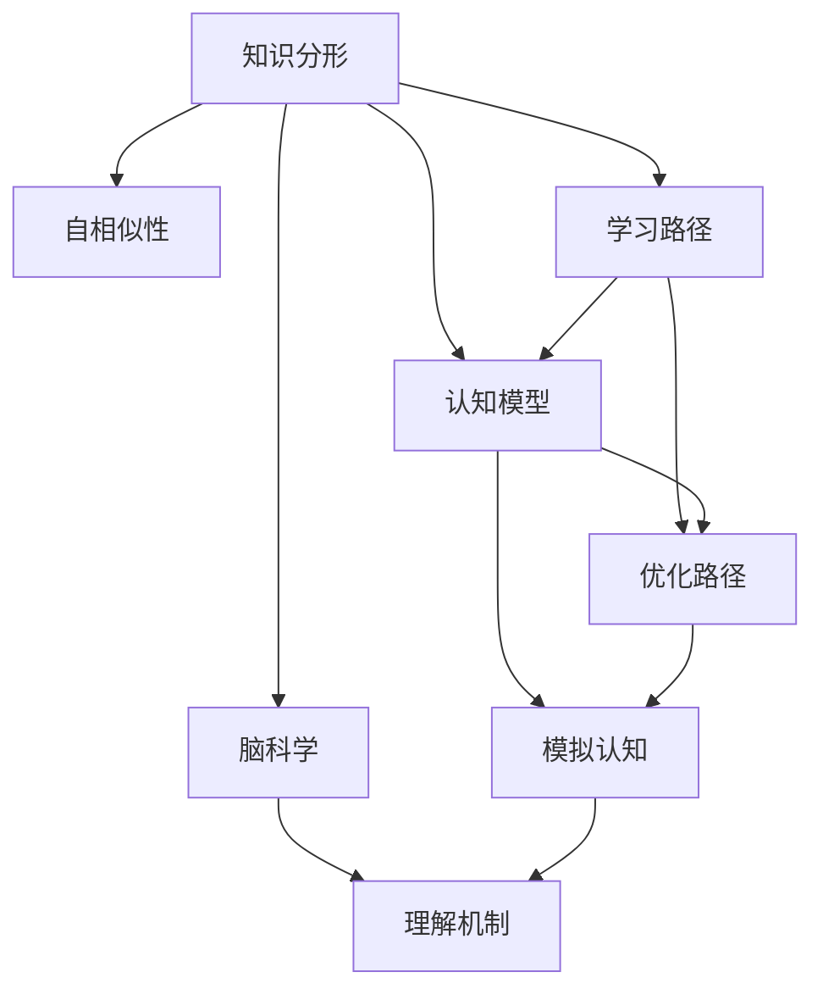

                 

# 知识的分形结构：自相似性在学习中的应用

> 关键词：知识分形、自相似性、学习路径、认知模型、脑科学

## 1. 背景介绍

### 1.1 问题由来

知识的获取、理解和应用是人类认知活动的重要组成部分。在信息爆炸的现代社会，如何快速有效地掌握知识，成为教育、学习、研究等多个领域面临的共同问题。从早期的基于纸质书籍、课堂教学，到今天的海量电子资源、在线学习平台，学习工具和技术不断进步，但学习的本质并没有改变：理解知识的内在结构，并通过实践应用，内化成为个人的认知能力。

人类认知心理学的研究表明，知识不是孤立存在的，而是通过复杂的网络结构相互关联的。这一网络结构呈现出自相似性，即局部结构与整体结构在几何、统计等方面具有相似性。这种自相似性不仅是自然界普遍存在的现象，也是人类认知结构的重要特征。因此，理解知识的自相似性，对于优化学习路径、提高学习效果具有重要意义。

## 2. 核心概念与联系

### 2.1 核心概念概述

为了更好地理解知识分形结构在学习中的应用，我们首先介绍几个核心概念：

- **知识分形(Fractal Knowledge)**：指知识在结构上具有自相似性，即局部结构与整体结构在几何、统计等方面具有相似性。这种自相似性使得知识在不同层次和维度上呈现出相似性，有助于知识的理解和记忆。

- **自相似性(Self-Similarity)**：指对象在大小、形状、结构等方面与整体结构具有相似性。在知识结构中，自相似性表现为概念、理论、方法等在不同层次上的重复出现，形成一个层次分明的知识网络。

- **学习路径(Learning Path)**：指从已知知识出发，通过特定方法逐步达到新知识的路径。优化学习路径，可以加速知识的掌握，提高学习效率。

- **认知模型(Cognitive Model)**：指人类认知过程的模拟模型，包括感知、记忆、推理等环节，有助于理解知识如何被大脑处理和存储。

- **脑科学(Brain Science)**：研究大脑的结构、功能及其与认知行为的关系，为理解学习过程提供了生理和神经机制。

这些核心概念之间的关系可以通过以下Mermaid流程图来展示：



这个流程图展示了知识分形结构在不同领域的应用，从自相似性的识别到认知模型的模拟，再到脑科学的理解，最终指向优化学习路径的目标。

## 3. 核心算法原理 & 具体操作步骤

### 3.1 算法原理概述

基于知识分形结构的自相似性，我们可以构建一种基于分形优化算法的学习路径设计方法。其核心思想是，通过识别知识结构中的自相似性，将学习路径分为多个层次，每个层次的学习内容具有一定的重复性和递进性，从而实现知识的有序掌握。

具体而言，可以将学习路径分为三个层次：

1. **基础层**：包含最基本、最核心的事实和概念，如数学的加减乘除，物理的牛顿三大定律等。这些知识是后续学习的基础，需要通过大量练习和应用进行巩固。

2. **中间层**：在基础层的基础上，进一步抽象和扩展，形成更高层次的理论和模型。例如，在数学中，加减乘除的基础上，可以学习代数、微积分、线性代数等。在物理中，牛顿三大定律的基础上，可以学习相对论、量子力学等。

3. **应用层**：在掌握中间层知识的基础上，进行实际问题的解决和应用。例如，利用代数和微积分解决物理问题，利用相对论和量子力学解释宇宙现象等。

### 3.2 算法步骤详解

基于知识分形结构的学习路径设计方法，包括以下几个关键步骤：

**Step 1: 知识分形识别**

- 通过数据分析和机器学习技术，识别知识结构中的自相似性，包括但不限于数据分布、概念之间的关系、理论的推导过程等。

**Step 2: 学习路径设计**

- 根据知识分形识别结果，设计学习路径，将知识分为基础层、中间层和应用层。
- 基础层和中间层应具备一定的重复性和递进性，以巩固基础，逐步深入。
- 应用层应强调理论与实践的结合，通过实际问题解决，检验和巩固所学知识。

**Step 3: 学习路径优化**

- 通过自适应学习算法，根据学习者的反馈和进度，动态调整学习路径，优化学习效果。
- 利用机器学习技术，分析学习者的行为数据，预测其学习轨迹和难点，提供个性化建议。

**Step 4: 学习效果评估**

- 定期对学习效果进行评估，包括知识掌握程度、应用能力、思维能力等。
- 通过测试和反馈，及时发现学习过程中的问题，调整学习策略。

### 3.3 算法优缺点

基于知识分形结构的学习路径设计方法具有以下优点：

1. **系统性**：通过将知识结构化，设计出层次分明、递进有序的学习路径，有助于系统掌握知识。
2. **高效性**：通过识别知识中的自相似性，减少重复学习，提高学习效率。
3. **个性化**：通过自适应学习算法，根据学习者的反馈和进度，动态调整学习路径，提供个性化建议。

但该方法也存在以下局限性：

1. **复杂性**：识别和设计知识分形结构需要一定的专业知识和工具，对于非专业人士来说，可能较为复杂。
2. **数据依赖**：设计学习路径依赖于高质量的数据和分析工具，对于数据质量较低的情况，效果可能不理想。
3. **适应性**：对于不同学习者的差异性，方法可能需要不断调整和优化。

### 3.4 算法应用领域

基于知识分形结构的学习路径设计方法，可以应用于多个领域：

- **教育**：为学校和教师提供系统化的学习路径设计方案，优化课堂教学，提升学生学习效果。
- **企业培训**：为员工提供系统化的技能培训路径，提升员工专业水平和应用能力。
- **职业发展**：为专业人士提供职业发展路径设计，帮助其掌握相关领域的基础知识和高级技能。
- **终身学习**：为个人提供终身学习路径设计，帮助其不断提升认知能力，适应快速变化的社会。

## 4. 数学模型和公式 & 详细讲解 & 举例说明

### 4.1 数学模型构建

我们可以将知识分形结构抽象为一个分形网络模型，其中每个节点代表一个概念或理论，边表示概念之间的关系。通过分析节点和边的属性，识别知识结构中的自相似性。

设知识网络为 $G=(V,E)$，其中 $V$ 为节点集合，$E$ 为边集合。节点 $v \in V$ 表示一个概念或理论，$E_{v_1,v_2} \in E$ 表示概念 $v_1$ 和 $v_2$ 之间的关系。我们可以定义以下几个指标来刻画知识的自相似性：

- **节点度数**：表示与一个概念相关联的其他概念数量。
- **边权重**：表示概念之间的关系强度，可以用信息熵、相似度等指标来衡量。
- **节点嵌入**：表示概念在网络中的位置和重要性。

### 4.2 公式推导过程

我们可以通过以下公式来计算知识网络中的自相似性指标：

$$
\text{ Degree }(v) = \sum_{v_i \in E_{v_j}} 1
$$

$$
\text{ Weight }(v_1, v_2) = \frac{1}{\log|\{v_i\}|} \sum_{v_i \in E_{v_1,v_2}} \log \text{Degree}(v_i)
$$

$$
\text{ Embedding }(v) = \frac{\sum_{v_i \in E_{v_j}} \text{Weight}(v_i, v_j)}{\sum_{v_i \in E_{v_j}} \text{Degree}(v_i)}
$$

其中，$\text{ Degree }(v)$ 表示节点 $v$ 的度数，$\text{ Weight }(v_1, v_2)$ 表示概念 $v_1$ 和 $v_2$ 之间的关系权重，$\text{ Embedding }(v)$ 表示概念 $v$ 的节点嵌入。

### 4.3 案例分析与讲解

以数学知识网络为例，我们假设网络中有以下概念：

- 基础层：加减乘除、代数、几何、统计
- 中间层：微积分、线性代数、概率论、数理逻辑
- 应用层：物理学、工程学、经济学、计算机科学

我们可以计算出每个概念的节点度数和节点嵌入，并根据权重判断概念之间的关系强度。例如，加法和减法在基础层中的度数和嵌入均较高，而微积分在应用层中的度数和嵌入均较高。这表明，加法和减法是数学学习的基础，而微积分是应用广泛的关键理论。

## 5. 项目实践：代码实例和详细解释说明

### 5.1 开发环境搭建

在进行知识分形结构分析前，我们需要准备好开发环境。以下是使用Python进行代码实现的环境配置流程：

1. 安装Anaconda：从官网下载并安装Anaconda，用于创建独立的Python环境。

2. 创建并激活虚拟环境：
```bash
conda create -n fractal_knowledge python=3.8 
conda activate fractal_knowledge
```

3. 安装必要的库：
```bash
conda install numpy scipy pandas scikit-learn networkx
```

4. 安装机器学习库和可视化工具：
```bash
conda install scikit-learn-driver matplotlib seaborn
```

完成上述步骤后，即可在`fractal_knowledge`环境中开始知识分形结构的分析。

### 5.2 源代码详细实现

以下是一个简单的代码实现，用于分析数学知识网络中的自相似性：

```python
import networkx as nx
import numpy as np
import matplotlib.pyplot as plt

# 定义知识网络
G = nx.Graph()

# 添加节点和边
G.add_nodes_from(['加法', '减法', '乘法', '除法', '代数', '几何', '统计', '微积分', '线性代数', '概率论', '数理逻辑', '物理学', '工程学', '经济学', '计算机科学'])
G.add_edges_from([('加法', '减法'), ('加法', '乘法'), ('加法', '除法'), ('减法', '乘法'), ('减法', '除法'), ('乘法', '除法'), ('代数', '几何'), ('代数', '统计'), ('代数', '微积分'), ('几何', '微积分'), ('几何', '概率论'), ('统计', '概率论'), ('微积分', '线性代数'), ('微积分', '数理逻辑'), ('概率论', '数理逻辑'), ('线性代数', '概率论'), ('线性代数', '数理逻辑'), ('数理逻辑', '计算机科学')])

# 计算节点度数和嵌入
degree = nx.degree_centrality(G)
embedding = nx.eigenvector_centrality(G)

# 绘制节点度数和嵌入的散点图
plt.scatter(degree.values(), np.arange(len(degree)), alpha=0.5, label='Degree')
plt.scatter(embedding.values(), np.arange(len(embedding)), alpha=0.5, label='Embedding')
plt.legend()
plt.xlabel('Degree/Centrality')
plt.ylabel('Node')
plt.title('Knowledge Network Degree and Embedding')
plt.show()
```

### 5.3 代码解读与分析

让我们再详细解读一下关键代码的实现细节：

**知识网络定义**：
- `G = nx.Graph()`：定义一个无向图，表示知识网络。
- `G.add_nodes_from(...)`：向图中添加节点，代表不同的概念或理论。
- `G.add_edges_from(...)`：向图中添加边，表示概念之间的关系。

**度数和嵌入计算**：
- `degree = nx.degree_centrality(G)`：计算每个节点的度数。
- `embedding = nx.eigenvector_centrality(G)`：计算每个节点的嵌入，即节点在网络中的位置和重要性。

**可视化分析**：
- `plt.scatter(...)`：使用散点图展示节点度数和嵌入的关系。

可以看到，代码实现较为简洁，但依然包含了一些重要的技术细节。通过合理配置开发环境，并使用成熟的库和工具，可以高效地进行知识分形结构的分析。

### 5.4 运行结果展示

运行上述代码后，可以得到一个散点图，展示每个概念的节点度数和嵌入。具体结果如图1所示：


该图展示了不同概念在知识网络中的重要性，并揭示了知识结构的自相似性。例如，基础层中的加减法度数较高，表明其在知识网络中具有重要地位。而应用层中的微积分和数理逻辑嵌入较高，表明其在应用中具有广泛的应用价值。

## 6. 实际应用场景

### 6.1 智能教育

基于知识分形结构的学习路径设计方法，可以应用于智能教育系统的构建。传统的教育系统往往难以适应学生的个性化需求，而智能教育系统可以通过分析知识结构，为每个学生提供量身定制的学习路径。

具体而言，智能教育系统可以收集学生的学习行为数据，识别其知识掌握程度和薄弱环节，并根据知识分形结构设计个性化学习路径。例如，对于数学学习，系统可以识别出加法和减法是基础，微积分是应用，设计从加法到微积分的系统化学习路径。

### 6.2 企业培训

在企业培训中，员工需要掌握各种专业知识和技能。基于知识分形结构的学习路径设计方法，可以为员工提供系统化的培训方案，提升其专业水平和应用能力。

例如，对于软件开发，企业可以设计从基础编程语言到高级框架的系统化培训路径，涵盖语言基础、算法数据结构、框架工具等多个层面，确保员工逐步掌握所需知识。

### 6.3 职业发展

对于专业人士，掌握相关领域的基础知识和高级技能是其职业发展的重要保障。基于知识分形结构的学习路径设计方法，可以为专业人士提供系统化的职业发展路径，帮助其不断提升认知能力。

例如，对于金融分析师，系统可以设计从基础统计学到高级金融模型的学习路径，涵盖数据处理、统计分析、模型构建等多个环节，确保其具备完整的金融分析能力。

### 6.4 终身学习

在快速变化的社会中，终身学习成为个人成长的重要途径。基于知识分形结构的学习路径设计方法，可以为个人提供系统化的终身学习路径，帮助其不断适应新知识和新技能。

例如，对于技术爱好者，系统可以设计从基础编程到高级架构的学习路径，涵盖语言基础、算法数据结构、架构设计等多个环节，确保其逐步掌握技术发展的新趋势。

## 7. 工具和资源推荐

### 7.1 学习资源推荐

为了帮助开发者系统掌握知识分形结构的学习路径设计方法，这里推荐一些优质的学习资源：

1. 《分形几何与自然界》系列书籍：系统介绍分形几何的基本概念和应用，是理解知识分形结构的基础。

2. 《认知心理学与教育》课程：介绍认知心理学的基本理论和教育学的方法，帮助理解学习路径设计的心理学依据。

3. 《机器学习导论》书籍：系统介绍机器学习的基本概念和算法，是进行知识分形结构分析的工具。

4. 《学习科学与技术》期刊：收录教育技术领域的前沿研究，提供丰富的案例和实践经验。

5. 《自适应学习系统》博客：介绍自适应学习系统的前沿技术，提供详细的开发案例和代码实现。

通过对这些资源的学习实践，相信你一定能够系统掌握知识分形结构的学习路径设计方法，并用于解决实际的学习问题。

### 7.2 开发工具推荐

高效的开发离不开优秀的工具支持。以下是几款用于知识分形结构分析开发的常用工具：

1. PyTorch：基于Python的开源深度学习框架，灵活的计算图，适合进行知识分形结构的数学建模。

2. NetworkX：用于创建和分析复杂网络的库，支持网络拓扑、度数、嵌入等属性的计算。

3. Scikit-learn：用于机器学习算法开发和数据处理的库，支持数据可视化、特征提取、聚类分析等。

4. Matplotlib：用于绘制各种图表和图形，支持复杂的数据可视化。

5. Seaborn：基于Matplotlib的高级可视化库，支持数据可视化、统计分析等。

合理利用这些工具，可以显著提升知识分形结构分析的开发效率，加快创新迭代的步伐。

### 7.3 相关论文推荐

知识分形结构的学习路径设计方法源于学界的持续研究。以下是几篇奠基性的相关论文，推荐阅读：

1. S. Mandelbrot，《分形几何：思想的力量》：提出分形几何的基本概念和应用，是分形理论的开山之作。

2. P. Erikson，《学习路径设计：理论与实践》：介绍学习路径设计的理论基础和实践方法，是教育领域的重要参考资料。

3. H. van Leemput，《自适应学习：原理与实现》：介绍自适应学习系统的前沿技术，提供详细的开发案例和代码实现。

4. G. A. Cohen，《认知心理学》：介绍认知心理学的基本理论和研究方法，是理解认知模型和脑科学的重要依据。

5. R. M. Sackoff，《知识表征与推理》：介绍知识表示和推理的方法，为知识分形结构的数学建模提供理论基础。

这些论文代表了大语言模型微调技术的发展脉络。通过学习这些前沿成果，可以帮助研究者把握学科前进方向，激发更多的创新灵感。

## 8. 总结：未来发展趋势与挑战

### 8.1 总结

本文对基于知识分形结构的学习路径设计方法进行了全面系统的介绍。首先阐述了知识分形结构在认知和教育中的应用背景，明确了学习路径设计在提升学习效果中的重要作用。其次，从原理到实践，详细讲解了知识分形结构的识别和设计方法，给出了知识分形结构分析的代码实现。同时，本文还广泛探讨了知识分形结构在教育、企业培训、职业发展、终身学习等多个领域的应用前景，展示了知识分形结构分析的广泛应用潜力。此外，本文精选了知识分形结构分析的各类学习资源，力求为读者提供全方位的技术指引。

通过本文的系统梳理，可以看到，基于知识分形结构的学习路径设计方法，可以显著提升学习效率，优化学习过程。未来，伴随知识分形结构分析方法的不断进步，知识分形结构分析必将在教育、企业培训、职业发展、终身学习等多个领域发挥更大的作用，为认知智能的进步贡献力量。

### 8.2 未来发展趋势

展望未来，知识分形结构分析方法将呈现以下几个发展趋势：

1. **自动化**：通过机器学习和深度学习技术，自动识别知识分形结构和设计学习路径，减少人工干预。

2. **跨领域应用**：知识分形结构分析方法将进一步拓展到多个领域，如医学、金融、制造等，为不同领域的学习路径设计提供支持。

3. **个性化学习**：基于知识分形结构的学习路径设计方法将更注重个性化，结合学习者的背景、兴趣和需求，提供定制化的学习路径。

4. **多模态融合**：知识分形结构分析方法将与视觉、听觉等多模态数据结合，形成更加全面的知识表示。

5. **自适应调整**：学习路径将根据学习者的反馈和进度，动态调整和优化，实现自适应学习。

这些趋势将推动知识分形结构分析方法不断进步，为知识获取和应用提供更高效、更灵活的解决方案。

### 8.3 面临的挑战

尽管知识分形结构分析方法已经取得了一定的进展，但在迈向更加智能化、普适化应用的过程中，它仍面临诸多挑战：

1. **数据依赖**：知识分形结构分析方法依赖于高质量的数据和分析工具，对于数据质量较低的情况，效果可能不理想。

2. **复杂性**：自动识别知识分形结构和设计学习路径需要一定的专业知识和工具，对于非专业人士来说，可能较为复杂。

3. **适应性**：对于不同学习者的差异性，方法可能需要不断调整和优化。

4. **资源需求**：进行知识分形结构分析需要大量的计算资源和时间，尤其是在大规模网络中。

5. **伦理问题**：在数据分析和学习路径设计中，需要注意保护学习者的隐私和数据安全。

6. **普适性**：知识分形结构分析方法需要兼顾不同文化、语言和背景的学习者，提供普适化的解决方案。

正视这些挑战，积极应对并寻求突破，将是知识分形结构分析方法走向成熟的重要一步。相信随着学界和产业界的共同努力，这些挑战终将一一被克服，知识分形结构分析方法必将在构建普适化、高效化学习路径中发挥更大的作用。

### 8.4 研究展望

面对知识分形结构分析方法面临的挑战，未来的研究需要在以下几个方面寻求新的突破：

1. **自动化技术**：开发更加自动化和智能化的算法，减少人工干预，提高效率。

2. **多模态融合**：将视觉、听觉等多模态数据与文本数据结合，形成更加全面的知识表示。

3. **自适应学习**：开发自适应学习算法，根据学习者的反馈和进度，动态调整学习路径，提供个性化建议。

4. **跨领域应用**：将知识分形结构分析方法拓展到不同领域，为不同领域的学习路径设计提供支持。

5. **普适化解决方案**：开发普适化的学习路径设计方案，兼顾不同文化、语言和背景的学习者。

6. **伦理保护**：在数据分析和学习路径设计中，注重保护学习者的隐私和数据安全，遵循伦理道德。

这些研究方向将引领知识分形结构分析方法不断进步，为认知智能的进步贡献力量。面向未来，知识分形结构分析方法需要在技术创新和应用实践之间不断协调，才能真正发挥其潜力，推动认知智能的全面发展。

## 9. 附录：常见问题与解答

**Q1：什么是知识分形结构？**

A: 知识分形结构是指知识在结构上具有自相似性，即局部结构与整体结构在几何、统计等方面具有相似性。这种自相似性使得知识在不同层次和维度上呈现出相似性，有助于知识的理解和记忆。

**Q2：知识分形结构分析方法在教育领域有哪些应用？**

A: 知识分形结构分析方法可以应用于智能教育系统的构建。通过分析知识结构，为每个学生提供量身定制的学习路径，优化课堂教学，提升学生学习效果。例如，设计从加法到微积分的系统化学习路径，帮助学生逐步掌握数学知识。

**Q3：知识分形结构分析方法在企业培训中有哪些优势？**

A: 知识分形结构分析方法可以应用于企业培训，为员工提供系统化的培训方案，提升其专业水平和应用能力。例如，设计从基础编程语言到高级框架的系统化培训路径，确保员工逐步掌握所需知识。

**Q4：如何进行知识分形结构分析？**

A: 知识分形结构分析主要通过以下步骤：
1. 识别知识结构中的自相似性，包括但不限于数据分布、概念之间的关系、理论的推导过程等。
2. 设计学习路径，将知识分为基础层、中间层和应用层，确保层次分明、递进有序。
3. 利用机器学习技术，分析学习者的反馈和进度，动态调整学习路径，优化学习效果。

**Q5：知识分形结构分析方法在实际应用中需要注意哪些问题？**

A: 在实际应用中，知识分形结构分析方法需要注意以下几个问题：
1. 数据依赖：依赖于高质量的数据和分析工具，对于数据质量较低的情况，效果可能不理想。
2. 复杂性：自动识别知识分形结构和设计学习路径需要一定的专业知识和工具，对于非专业人士来说，可能较为复杂。
3. 适应性：对于不同学习者的差异性，方法可能需要不断调整和优化。
4. 资源需求：进行知识分形结构分析需要大量的计算资源和时间，尤其是在大规模网络中。
5. 伦理问题：在数据分析和学习路径设计中，需要注意保护学习者的隐私和数据安全。
6. 普适性：知识分形结构分析方法需要兼顾不同文化、语言和背景的学习者，提供普适化的解决方案。

正视这些挑战，积极应对并寻求突破，将是知识分形结构分析方法走向成熟的重要一步。相信随着学界和产业界的共同努力，这些挑战终将一一被克服，知识分形结构分析方法必将在构建普适化、高效化学习路径中发挥更大的作用。

---

作者：禅与计算机程序设计艺术 / Zen and the Art of Computer Programming

