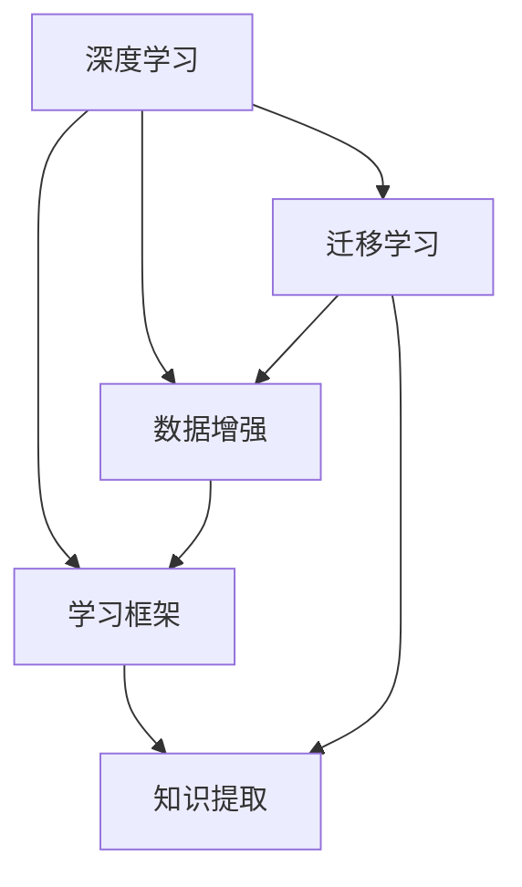

                 

# 知识的情境依赖：环境对学习的影响

> 关键词：知识提取, 情境依赖, 迁移学习, 数据增强, 学习框架, 深度学习

## 1. 背景介绍

### 1.1 问题由来

在当前的深度学习研究中，知识提取和情境依赖已成为两个重要的研究方向。这些研究不仅涉及深度学习的原理，还涉及到如何构建高效的学习框架和应用场景。本文将从这两个方面入手，系统探讨知识提取和情境依赖的问题，特别是环境对学习的影响。

### 1.2 问题核心关键点

知识提取和情境依赖是深度学习领域的两大核心问题。知识提取旨在从数据中学习出有用的表示，情境依赖则是关注环境如何影响模型的学习过程和性能。

- **知识提取**：通过深度学习模型从原始数据中学习出高层次的抽象表示。关键点在于选择合适的特征提取器，以及设计有效的损失函数来优化模型的参数。

- **情境依赖**：模型学习依赖于输入数据的情境信息。关键点在于如何构建合适的网络结构和优化策略，使得模型能够适应不同的数据情境。

本文将从这两个关键点出发，深入探讨知识提取和情境依赖的原理和应用，并分析环境对学习的影响。

## 2. 核心概念与联系

### 2.1 核心概念概述

为更好地理解知识提取和情境依赖问题，本节将介绍几个密切相关的核心概念：

- **深度学习**：一种基于多层神经网络的机器学习技术，用于从数据中提取高层次的特征表示。
- **迁移学习**：一种学习范式，通过将在一个任务上学习到的知识迁移到另一个相关任务上，以提升新任务的学习效率和性能。
- **数据增强**：通过对原始数据进行一系列变换，生成新的训练样本，以扩充数据集，提高模型的泛化能力。
- **学习框架**：包含算法、模型架构、损失函数等组件的深度学习系统，用于指导模型的学习过程。

这些核心概念之间存在着紧密的联系和相互作用。深度学习模型通过迁移学习从数据中学习出有用的特征表示，而数据增强和损失函数的设计则直接影响模型的学习效率和性能。学习框架则为模型的构建和优化提供了指南，使得模型能够更好地适应不同的数据情境。

### 2.2 核心概念原理和架构的 Mermaid 流程图



这个流程图展示了深度学习、迁移学习、数据增强和学习框架之间的逻辑关系：

1. 深度学习模型通过迁移学习，从数据中学习出特征表示。
2. 数据增强通过扩充数据集，提升模型的泛化能力。
3. 学习框架提供算法、模型架构和损失函数等组件，指导模型的学习过程。
4. 最终，学习框架中的知识提取模块通过深度学习模型学习出的特征表示，实现对新任务的高效适应。

## 3. 核心算法原理 & 具体操作步骤

### 3.1 算法原理概述

知识提取和情境依赖问题本质上是深度学习模型的优化问题。其核心思想是，通过构建合适的网络结构和损失函数，使得模型能够在不同的数据情境下学习出有效的特征表示。

以迁移学习为例，其基本流程如下：

1. **预训练阶段**：在大量未标注数据上预训练一个深度学习模型，学习出通用的特征表示。
2. **微调阶段**：在特定任务的数据集上，微调预训练模型，学习出针对该任务的特化特征表示。
3. **迁移学习阶段**：将微调后的模型应用于其他相关任务，以提升新任务的性能。

这一过程涉及到了深度学习模型的构建和优化，而数据增强和损失函数的设计则直接影响模型的学习效果。

### 3.2 算法步骤详解

迁移学习的具体步骤如下：

**Step 1: 准备数据集**

- **预训练数据集**：收集大量的未标注数据，用于预训练深度学习模型。
- **任务数据集**：收集特定任务的标注数据，用于微调模型。

**Step 2: 预训练模型**

- **模型选择**：选择合适的深度学习模型架构，如卷积神经网络(CNN)、循环神经网络(RNN)、Transformer等。
- **损失函数**：设计合适的损失函数，如交叉熵、均方误差等，用于优化模型参数。
- **数据增强**：对预训练数据进行数据增强，如旋转、缩放、平移等，以扩充数据集。

**Step 3: 微调模型**

- **迁移学习策略**：选择迁移学习策略，如冻结部分层、仅微调顶层等。
- **学习率**：选择合适的学习率，一般较预训练时小。
- **损失函数**：设计针对特定任务的任务损失函数，如分类损失、回归损失等。

**Step 4: 迁移应用**

- **模型评估**：在测试集上评估模型的性能，对比预训练和微调后的模型效果。
- **部署应用**：将微调后的模型部署到实际应用中，进行推理和预测。

### 3.3 算法优缺点

迁移学习具有以下优点：

1. **高效**：利用预训练模型可以大大减少新任务的训练时间和数据需求。
2. **泛化能力**：预训练模型学习出的通用特征表示，具有较好的泛化能力，能够适应不同的数据情境。
3. **适应性强**：通过微调，模型可以适应特定任务的需求，提升模型性能。

同时，迁移学习也存在以下缺点：

1. **依赖数据**：预训练和微调都需要大量的数据，数据获取成本高。
2. **过拟合风险**：微调过程中，模型可能会过拟合特定任务的标注数据，影响泛化性能。
3. **模型复杂度**：预训练和微调模型通常较为复杂，需要较高端的硬件设备进行训练和推理。

尽管存在这些局限性，但就目前而言，迁移学习仍是深度学习中最为有效和广泛应用的学习范式之一。未来相关研究的重点在于如何进一步提高模型的泛化能力和适应性，降低对标注数据的依赖，以及提升模型推理效率。

### 3.4 算法应用领域

迁移学习在多个领域得到了广泛应用，例如：

- **计算机视觉**：在图像分类、目标检测、图像分割等任务上，利用迁移学习可以显著提升模型性能。
- **自然语言处理**：在情感分析、机器翻译、文本分类等任务上，迁移学习能够提高模型的泛化能力。
- **语音识别**：在语音识别和语音合成任务上，迁移学习可以提升模型的语音理解和生成能力。
- **医疗影像**：在医疗影像分析任务上，迁移学习可以加速模型的训练，提升诊断精度。
- **推荐系统**：在推荐系统中，迁移学习可以提升模型的个性化推荐能力，提升用户体验。

除了上述这些经典任务外，迁移学习还被创新性地应用到更多场景中，如可控文本生成、常识推理、代码生成、数据增强等，为深度学习技术带来了全新的突破。随着预训练模型和迁移学习方法的不断进步，相信深度学习技术将在更广阔的应用领域大放异彩。

## 4. 数学模型和公式 & 详细讲解 & 举例说明

### 4.1 数学模型构建

假设我们有一个深度学习模型 $M$，其中 $x$ 为输入数据，$y$ 为输出标签，$w$ 为模型参数。

模型的目标是通过最小化损失函数 $L$ 来学习出最优参数 $w$：

$$
w^* = \mathop{\arg\min}_{w} L(M(x;w),y)
$$

其中 $L$ 为损失函数，常见的有交叉熵损失函数、均方误差损失函数等。

以二分类任务为例，交叉熵损失函数可以表示为：

$$
L(y,\hat{y}) = -(y\log\hat{y} + (1-y)\log(1-\hat{y}))
$$

### 4.2 公式推导过程

在二分类任务中，假设模型 $M$ 的输出为 $\hat{y}$，真实标签为 $y$，则交叉熵损失函数的推导过程如下：

$$
\begin{aligned}
L(y,\hat{y}) &= -(y\log\hat{y} + (1-y)\log(1-\hat{y})) \\
&= -y\log\hat{y} - (1-y)\log(1-\hat{y}) \\
&= -\log(\hat{y}^y(1-\hat{y})^{1-y}) \\
&= -\log(\hat{y}^y(1-\hat{y})^{1-y})
\end{aligned}
$$

通过推导，我们得到了二分类任务的交叉熵损失函数。

### 4.3 案例分析与讲解

以图像分类任务为例，假设我们有一个卷积神经网络模型 $M$，其输入为图像 $x$，输出为类别概率分布 $y$。我们的目标是通过最小化交叉熵损失函数 $L$ 来学习出最优参数 $w$。

具体步骤如下：

1. **数据准备**：收集大量未标注的图像数据，用于预训练模型。
2. **预训练**：在大量未标注数据上预训练卷积神经网络模型 $M$，学习出通用的特征表示。
3. **微调**：在特定任务的标注数据上微调模型 $M$，学习出针对该任务的特化特征表示。
4. **迁移应用**：将微调后的模型应用于其他相关任务，以提升新任务的性能。

## 5. 项目实践：代码实例和详细解释说明

### 5.1 开发环境搭建

在进行深度学习项目实践前，我们需要准备好开发环境。以下是使用Python进行PyTorch开发的环境配置流程：

1. 安装Anaconda：从官网下载并安装Anaconda，用于创建独立的Python环境。

2. 创建并激活虚拟环境：
```bash
conda create -n pytorch-env python=3.8 
conda activate pytorch-env
```

3. 安装PyTorch：根据CUDA版本，从官网获取对应的安装命令。例如：
```bash
conda install pytorch torchvision torchaudio cudatoolkit=11.1 -c pytorch -c conda-forge
```

4. 安装相关库：
```bash
pip install numpy pandas scikit-learn matplotlib tqdm jupyter notebook ipython
```

完成上述步骤后，即可在`pytorch-env`环境中开始深度学习项目实践。

### 5.2 源代码详细实现

下面我们以迁移学习在计算机视觉领域的应用为例，给出使用PyTorch实现图像分类任务的代码实现。

首先，定义数据处理函数：

```python
from torchvision import datasets, transforms
from torch.utils.data import DataLoader

class Dataset:
    def __init__(self, root, transform=None):
        self.transform = transform
        self.train = datasets.CIFAR10(root=root, train=True, download=True, transform=transform)
        self.test = datasets.CIFAR10(root=root, train=False, download=True, transform=transform)
    
    def __getitem__(self, idx):
        img, label = self.train[idx]
        if self.transform is not None:
            img = self.transform(img)
        return img, label
    
    def __len__(self):
        return len(self.train)
```

然后，定义模型和优化器：

```python
import torch.nn as nn
import torch.optim as optim

class Net(nn.Module):
    def __init__(self):
        super(Net, self).__init__()
        self.conv1 = nn.Conv2d(3, 6, 5)
        self.pool = nn.MaxPool2d(2, 2)
        self.conv2 = nn.Conv2d(6, 16, 5)
        self.fc1 = nn.Linear(16*5*5, 120)
        self.fc2 = nn.Linear(120, 84)
        self.fc3 = nn.Linear(84, 10)

    def forward(self, x):
        x = self.pool(F.relu(self.conv1(x)))
        x = self.pool(F.relu(self.conv2(x)))
        x = x.view(-1, 16*5*5)
        x = F.relu(self.fc1(x))
        x = F.relu(self.fc2(x))
        x = self.fc3(x)
        return x

model = Net()
optimizer = optim.SGD(model.parameters(), lr=0.001, momentum=0.9)
```

接着，定义训练和评估函数：

```python
import torch.nn.functional as F

def train_epoch(model, dataset, batch_size, optimizer):
    model.train()
    for batch_idx, (data, target) in enumerate(DataLoader(dataset, batch_size=batch_size)):
        optimizer.zero_grad()
        output = model(data)
        loss = F.cross_entropy(output, target)
        loss.backward()
        optimizer.step()
    return loss.item()

def evaluate(model, dataset, batch_size):
    model.eval()
    total_loss = 0
    correct = 0
    with torch.no_grad():
        for data, target in DataLoader(dataset, batch_size=batch_size):
            output = model(data)
            total_loss += F.cross_entropy(output, target, reduction='sum').item()
            pred = output.argmax(1, keepdim=True)
            correct += pred.eq(target.view_as(pred)).sum().item()
    return total_loss / len(dataset), correct / len(dataset)
```

最后，启动训练流程并在测试集上评估：

```python
epochs = 10
batch_size = 64

for epoch in range(epochs):
    train_loss = train_epoch(model, train_dataset, batch_size, optimizer)
    test_loss, test_acc = evaluate(model, test_dataset, batch_size)
    print(f'Epoch {epoch+1}, train loss: {train_loss:.3f}, test loss: {test_loss:.3f}, test acc: {test_acc:.3f}')
```

以上就是使用PyTorch进行迁移学习图像分类任务的项目实践代码。可以看到，使用深度学习框架，迁移学习的代码实现非常简洁高效。

### 5.3 代码解读与分析

让我们再详细解读一下关键代码的实现细节：

**Dataset类**：
- `__init__`方法：初始化训练集和测试集，并定义数据预处理方式。
- `__getitem__`方法：对单个样本进行处理，返回输入和标签。
- `__len__`方法：返回数据集的样本数量。

**Net类**：
- `__init__`方法：定义卷积层、池化层和全连接层等组件。
- `forward`方法：定义前向传播的计算过程。

**train_epoch函数**：
- 在每个epoch内，将训练集数据分批次输入模型，前向传播计算损失函数，反向传播更新模型参数。

**evaluate函数**：
- 在测试集上评估模型的性能，计算损失和准确率。

**训练流程**：
- 定义总的epoch数和batch size，开始循环迭代
- 每个epoch内，先在训练集上训练，输出平均损失和准确率
- 在测试集上评估，输出平均损失和准确率

可以看到，深度学习框架如PyTorch提供了很多便捷的API，使得模型的构建和优化变得非常简单。通过合理使用这些工具，可以快速开发出高效、可扩展的深度学习系统。

## 6. 实际应用场景

### 6.1 智能医疗

迁移学习在智能医疗领域有着广泛的应用。通过预训练模型和大规模医疗数据，可以学习出通用的医疗知识表示，并用于特定疾病的诊断和治疗方案推荐。

在实际应用中，可以使用迁移学习构建医疗影像分析系统，如图像分类、病灶检测等。同时，将模型应用于电子病历分析，可以提取医生的诊断记录，生成医疗报告，提升医生的工作效率和诊断准确性。

### 6.2 智能推荐

在推荐系统中，迁移学习可以提升模型的个性化推荐能力。通过预训练模型和用户行为数据的结合，可以学习出用户兴趣和偏好，并用于推荐系统的新用户引入和已有用户的推荐。

在实际应用中，迁移学习可以构建多模态推荐系统，结合文本、图像、音频等多种数据源，提供更加全面和精准的推荐结果。同时，模型可以持续学习用户的最新行为，动态调整推荐策略。

### 6.3 金融风险控制

金融行业需要实时监控市场动态，及时发现异常交易和风险信号。迁移学习可以通过预训练模型和大规模金融数据，学习出通用的金融知识表示，并用于特定任务的监控和预警。

在实际应用中，可以使用迁移学习构建金融舆情监测系统，实时分析社交媒体、新闻等数据，预测市场动向和舆情变化。同时，将模型应用于信用评分、风险评估等任务，提升金融机构的决策效率和风险控制能力。

### 6.4 未来应用展望

随着迁移学习技术的不断进步，其在更多领域的应用将更加广泛和深入。未来，迁移学习将在以下几个方面继续拓展：

1. **多模态学习**：将文本、图像、音频等多种数据源结合，提升模型的综合理解能力和泛化性能。
2. **自监督学习**：通过自监督学习任务，学习出模型的高层次表示，提升模型的泛化能力和鲁棒性。
3. **迁移学习新范式**：如元学习、对比学习等新范式，将有助于提升迁移学习的效果和应用场景。
4. **模型压缩和优化**：通过模型压缩和优化技术，提升模型的推理效率和资源利用率。
5. **多领域迁移**：通过构建跨领域的知识图谱，促进不同领域之间的知识迁移和融合。

以上趋势将进一步推动迁移学习技术的创新和应用，为深度学习技术的发展带来新的突破。

## 7. 工具和资源推荐

### 7.1 学习资源推荐

为了帮助开发者系统掌握迁移学习的理论基础和实践技巧，这里推荐一些优质的学习资源：

1. **《深度学习》（Ian Goodfellow等著）**：全面介绍了深度学习的理论和算法，适合入门和进阶学习。
2. **《迁移学习：理论和算法》（Kishore T. Panday等著）**：系统介绍了迁移学习的理论和实践，提供了丰富的案例和代码。
3. **PyTorch官方文档**：提供了深度学习框架PyTorch的详细介绍和示例代码，适合实战学习。
4. **OpenAI实验室博客**：涵盖了深度学习和迁移学习的最新研究和应用案例，适合前沿学习和启发。
5. **Kaggle竞赛**：提供了大量实际应用场景的迁移学习竞赛，适合实践学习和经验积累。

通过对这些资源的学习实践，相信你一定能够快速掌握迁移学习的精髓，并用于解决实际的深度学习问题。

### 7.2 开发工具推荐

高效的开发离不开优秀的工具支持。以下是几款用于深度学习项目开发的常用工具：

1. **PyTorch**：基于Python的开源深度学习框架，灵活的计算图和丰富的API，适合快速迭代研究。
2. **TensorFlow**：由Google主导开发的深度学习框架，生产部署方便，适合大规模工程应用。
3. **TensorFlow Hub**：提供了预训练模型的集成库，方便迁移学习任务的实现。
4. **TensorBoard**：TensorFlow配套的可视化工具，实时监测模型训练状态，提供丰富的图表呈现方式，适合调试模型。
5. **GitHub**：全球最大的开源社区，提供丰富的代码和资源，适合代码共享和协作。

合理利用这些工具，可以显著提升深度学习项目的开发效率，加快创新迭代的步伐。

### 7.3 相关论文推荐

深度学习和迁移学习的研究源于学界的持续研究。以下是几篇奠基性的相关论文，推荐阅读：

1. **《ImageNet Classification with Deep Convolutional Neural Networks》（Alex Krizhevsky等著）**：提出了卷积神经网络（CNN）模型，开创了深度学习在计算机视觉领域的先河。
2. **《A Note on the Effectiveness of Dropout》（J. Long等著）**：提出了Dropout技术，用于缓解过拟合问题，提升模型的泛化能力。
3. **《Fine-tuning AlexNet for Deep Visual Semantic Image Annotation》（Wan-Yu Hung等著）**：展示了迁移学习在图像标注任务中的应用，提升了模型性能。
4. **《Parameter-Efficient Transfer Learning for NLP》（Kesong Yan等著）**：提出了Adapter等参数高效微调方法，提升了迁移学习的参数效率。
5. **《Improved Transfer Learning with Fine-tuning and Cross-domain Perturbation》（Yoon Kim等著）**：展示了对抗训练在迁移学习中的应用，提升了模型的泛化能力和鲁棒性。

这些论文代表了大规模深度学习模型的应用与发展脉络。通过学习这些前沿成果，可以帮助研究者把握学科前进方向，激发更多的创新灵感。

## 8. 总结：未来发展趋势与挑战

### 8.1 研究成果总结

本文对迁移学习问题进行了全面系统的介绍。首先阐述了迁移学习的核心思想和应用场景，明确了迁移学习在深度学习中的重要地位。其次，从原理到实践，详细讲解了迁移学习的数学模型和算法步骤，提供了完整的迁移学习项目实践代码。同时，本文还广泛探讨了迁移学习在多个领域的应用前景，展示了迁移学习技术的巨大潜力。

通过本文的系统梳理，可以看到，迁移学习在深度学习领域具有广泛的应用前景，能够提升模型的泛化能力和适应性，加速深度学习技术的产业化进程。未来，伴随深度学习模型的不断进步和迁移学习方法的持续优化，深度学习技术将在更广阔的应用领域大放异彩。

### 8.2 未来发展趋势

展望未来，深度学习和迁移学习将呈现以下几个发展趋势：

1. **多模态学习**：将文本、图像、音频等多种数据源结合，提升模型的综合理解能力和泛化性能。
2. **自监督学习**：通过自监督学习任务，学习出模型的高层次表示，提升模型的泛化能力和鲁棒性。
3. **迁移学习新范式**：如元学习、对比学习等新范式，将有助于提升迁移学习的效果和应用场景。
4. **模型压缩和优化**：通过模型压缩和优化技术，提升模型的推理效率和资源利用率。
5. **多领域迁移**：通过构建跨领域的知识图谱，促进不同领域之间的知识迁移和融合。

以上趋势凸显了深度学习和迁移学习的广阔前景。这些方向的探索发展，必将进一步提升深度学习模型的性能和应用范围，为人类认知智能的进化带来深远影响。

### 8.3 面临的挑战

尽管深度学习和迁移学习技术已经取得了瞩目成就，但在迈向更加智能化、普适化应用的过程中，仍面临诸多挑战：

1. **数据获取成本高**：大规模深度学习模型的训练需要大量的标注数据，数据获取成本高。
2. **模型复杂度高**：深度学习模型通常较为复杂，训练和推理的资源消耗较大。
3. **模型泛化能力不足**：在面对新的数据情境时，模型的泛化能力往往较差，容易发生过拟合现象。
4. **模型鲁棒性不足**：深度学习模型面对数据噪声和异常值的鲁棒性较差，容易受到干扰。
5. **模型可解释性不足**：深度学习模型通常是"黑盒"系统，难以解释其内部工作机制和决策逻辑。

尽管存在这些挑战，但未来相关研究仍需不断推进，寻找更加高效的模型结构和优化方法，以提升深度学习模型的性能和应用范围。

### 8.4 研究展望

面对深度学习和迁移学习所面临的种种挑战，未来的研究需要在以下几个方面寻求新的突破：

1. **数据增强和预处理**：探索更加高效和智能的数据增强方法，提升模型的泛化能力和鲁棒性。
2. **模型压缩和优化**：开发更加高效的模型压缩和优化技术，提升模型的推理效率和资源利用率。
3. **自监督学习**：深入研究自监督学习任务，学习出模型的高层次表示，提升模型的泛化能力和鲁棒性。
4. **多领域迁移**：构建跨领域的知识图谱，促进不同领域之间的知识迁移和融合。
5. **模型可解释性**：引入可解释性方法，提升深度学习模型的透明性和可信度。

这些研究方向的探索，必将引领深度学习和迁移学习技术迈向更高的台阶，为构建安全、可靠、可解释、可控的智能系统铺平道路。面向未来，深度学习和迁移学习技术还需要与其他人工智能技术进行更深入的融合，如知识表示、因果推理、强化学习等，多路径协同发力，共同推动自然语言理解和智能交互系统的进步。只有勇于创新、敢于突破，才能不断拓展深度学习模型的边界，让智能技术更好地造福人类社会。

## 9. 附录：常见问题与解答

**Q1：迁移学习是否适用于所有深度学习任务？**

A: 迁移学习在大多数深度学习任务上都能取得不错的效果，特别是对于数据量较小的任务。但对于一些特定领域的任务，如医学、法律等，仅仅依靠通用语料预训练的模型可能难以很好地适应。此时需要在特定领域语料上进一步预训练，再进行微调，才能获得理想效果。此外，对于一些需要时效性、个性化很强的任务，如对话、推荐等，迁移方法也需要针对性的改进优化。

**Q2：如何选择合适的学习率？**

A: 迁移学习的学习率一般要比预训练时小1-2个数量级，如果使用过大的学习率，容易破坏预训练权重，影响模型的泛化性能。一般建议从1e-4开始调参，逐步减小学习率，直至收敛。也可以使用warmup策略，在开始阶段使用较小的学习率，再逐渐过渡到预设值。需要注意的是，不同的优化器(如Adam、SGD等)以及不同的学习率调度策略，可能需要设置不同的学习率阈值。

**Q3：迁移学习过程中如何避免过拟合？**

A: 过拟合是迁移学习面临的主要挑战，尤其是在标注数据不足的情况下。常见的缓解策略包括：
1. 数据增强：通过回译、近义替换等方式扩充训练集
2. 正则化：使用L2正则、Dropout、Early Stopping等避免过拟合
3. 对抗训练：引入对抗样本，提高模型鲁棒性
4. 模型压缩和优化：通过模型压缩和优化技术，提升模型的泛化能力和鲁棒性

这些策略往往需要根据具体任务和数据特点进行灵活组合。只有在数据、模型、训练、推理等各环节进行全面优化，才能最大限度地发挥迁移学习的威力。

**Q4：迁移学习在落地部署时需要注意哪些问题？**

A: 将迁移学习模型转化为实际应用，还需要考虑以下因素：
1. 模型裁剪：去除不必要的层和参数，减小模型尺寸，加快推理速度
2. 量化加速：将浮点模型转为定点模型，压缩存储空间，提高计算效率
3. 服务化封装：将模型封装为标准化服务接口，便于集成调用
4. 弹性伸缩：根据请求流量动态调整资源配置，平衡服务质量和成本
5. 监控告警：实时采集系统指标，设置异常告警阈值，确保服务稳定性
6. 安全防护：采用访问鉴权、数据脱敏等措施，保障数据和模型安全

迁移学习模型需要在实际应用中不断迭代和优化，以适应不同的数据情境和用户需求。通过合理的模型优化和部署策略，可以显著提升迁移学习模型的应用效果和用户体验。

---

作者：禅与计算机程序设计艺术 / Zen and the Art of Computer Programming

