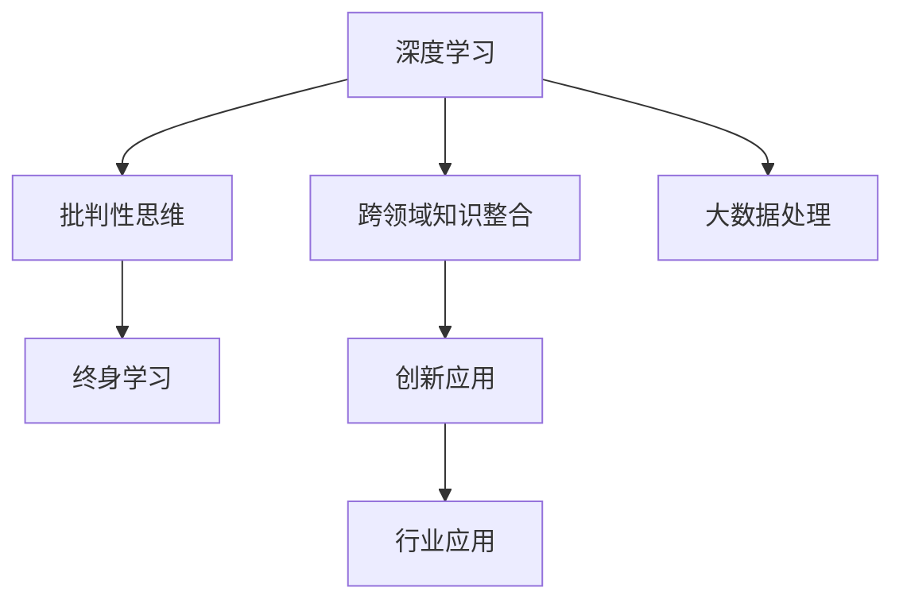

                 

## 1. 背景介绍

在当今知识爆炸的年代，如何培养既具备深度知识又具备广博视野的T型人才，成为各大企业和学术机构关注的焦点。T型人才指的是具有T字形的知识结构，即在一个领域内具有深厚的专业知识，同时在多个相关领域也具备一定的涉猎和理解。本文将从多个维度探讨T型人才的培养方法，包括深度学习、跨领域知识整合、批判性思维和终身学习等方面。

## 2. 核心概念与联系

### 2.1 核心概念概述

- **深度学习**：一种基于神经网络的机器学习方法，能够处理大规模、复杂的数据结构，如图像、文本和音频等。
- **跨领域知识整合**：将不同领域的知识进行整合，形成一种综合的知识体系，提高解决问题的能力。
- **批判性思维**：一种分析和评估信息的思维能力，能够对信息进行深层次的思考和质疑，避免盲目接受。
- **终身学习**：一种不断获取新知识和技能的学习态度，适应快速变化的环境。

这些概念之间存在密切联系，深度学习提供了获取和处理知识的工具，跨领域知识整合和批判性思维则提供了运用知识的能力，而终身学习则是保持这种能力的关键。

### 2.2 核心概念原理和架构的 Mermaid 流程图



该图展示了深度学习、跨领域知识整合、批判性思维和终身学习之间的联系。深度学习提供了处理大数据的工具，跨领域知识整合和批判性思维有助于将这些数据转化为有用的知识，而终身学习则保证了这种知识的持续更新和应用。

## 3. 核心算法原理 & 具体操作步骤

### 3.1 算法原理概述

深度学习算法通过构建多层神经网络，能够自动从数据中提取特征，进而进行分类、回归、生成等任务。跨领域知识整合通过建立不同领域之间的联系，帮助解决复杂问题。批判性思维通过分析和质疑，确保知识的正确性和可靠性。终身学习通过不断的学习和实践，保持知识的更新和适应性。

### 3.2 算法步骤详解

#### 3.2.1 深度学习算法步骤

1. **数据预处理**：对数据进行清洗、归一化和标准化，以便于模型训练。
2. **模型选择**：选择合适的深度学习模型，如卷积神经网络(CNN)、循环神经网络(RNN)或变分自编码器(VAE)等。
3. **模型训练**：使用训练集进行模型训练，调整超参数，如学习率、批大小和迭代次数等。
4. **模型评估**：使用验证集对模型进行评估，选择性能最好的模型。
5. **模型优化**：根据评估结果调整模型结构和参数，进行多次迭代，直到达到最优性能。

#### 3.2.2 跨领域知识整合步骤

1. **领域选择**：确定需要整合的领域，如医学、金融、自然语言处理等。
2. **数据收集**：从不同领域收集相关数据，如文本、图像和音频等。
3. **知识表示**：将不同领域的数据表示为统一的知识形式，如向量空间模型(VSM)或语义网络。
4. **知识融合**：将不同领域的信息进行融合，形成综合的知识表示。
5. **应用验证**：在实际应用中验证整合后的知识效果，进行优化和调整。

#### 3.2.3 批判性思维步骤

1. **信息获取**：获取相关领域的信息，如文献、论文和报告等。
2. **信息评估**：评估信息的来源、可靠性和时效性，判断其真实性和可靠性。
3. **信息分析**：分析信息的内在逻辑和因果关系，理解其本质和意义。
4. **信息质疑**：对信息进行质疑和批判，避免盲目接受。
5. **信息应用**：将批判性思维应用于实际问题解决，形成综合解决方案。

#### 3.2.4 终身学习步骤

1. **持续学习**：不断学习新知识，更新已有知识。
2. **实践应用**：将新知识应用于实际问题，进行实践验证。
3. **反馈迭代**：根据实践结果进行反馈，调整学习策略和方法。
4. **知识总结**：将学习过程和结果进行总结，形成系统化的知识体系。
5. **知识共享**：与他人分享学习经验和成果，形成知识交流和共享的生态系统。

### 3.3 算法优缺点

#### 3.3.1 深度学习优点

- **处理大规模数据**：深度学习能够处理大规模的数据集，如图像、文本和音频等。
- **自动化特征提取**：深度学习能够自动从数据中提取特征，减少人工干预。
- **高精度**：深度学习在许多任务上取得了最先进的结果，如图像分类、语音识别和自然语言处理等。

#### 3.3.2 深度学习缺点

- **数据需求高**：深度学习需要大量的标注数据进行训练，数据获取成本高。
- **模型复杂**：深度学习模型结构复杂，训练和调试难度大。
- **解释性差**：深度学习模型通常是"黑盒"，难以解释其内部工作机制。

#### 3.3.3 跨领域知识整合优点

- **多领域融合**：跨领域知识整合能够将不同领域的信息进行整合，形成综合的知识体系。
- **解决复杂问题**：跨领域知识整合能够解决复杂的问题，如医疗诊断、金融风险管理和智能客服等。
- **提升创新能力**：跨领域知识整合能够提升创新能力，推动技术进步。

#### 3.3.4 跨领域知识整合缺点

- **知识复杂性**：不同领域的知识具有不同的表示形式，整合难度大。
- **知识冲突**：不同领域的知识可能存在冲突，整合后可能导致信息丢失。
- **应用难度**：跨领域知识整合后，需要在多个领域进行应用验证，过程复杂。

#### 3.3.5 批判性思维优点

- **提高判断力**：批判性思维能够提高判断力，避免盲目接受信息。
- **增强逻辑性**：批判性思维能够增强逻辑性，提高问题解决能力。
- **避免偏见**：批判性思维能够避免偏见，减少决策失误。

#### 3.3.6 批判性思维缺点

- **耗时耗力**：批判性思维需要耗费大量时间和精力，效率低。
- **依赖经验**：批判性思维依赖经验，初学者可能难以掌握。
- **易受情绪影响**：批判性思维可能受情绪影响，导致判断失误。

#### 3.3.7 终身学习优点

- **持续进步**：终身学习能够持续进步，保持知识更新和应用。
- **适应性强**：终身学习能够适应快速变化的环境，提升应变能力。
- **创新性强**：终身学习能够推动创新，提升竞争力。

#### 3.3.8 终身学习缺点

- **资源投入高**：终身学习需要大量资源投入，如时间和金钱等。
- **目标不清**：终身学习需要明确目标，否则容易迷失方向。
- **效果不确定**：终身学习的效果不确定，有时可能事倍功半。

### 3.4 算法应用领域

- **医疗健康**：深度学习在医疗影像分析、疾病预测和个性化治疗等领域应用广泛。跨领域知识整合在医疗与人工智能的融合中，能够提升诊断和治疗的精度。批判性思维在医疗决策中，能够避免误诊和过度治疗。终身学习在医疗技术进步中，能够不断更新和完善知识体系。
- **金融投资**：深度学习在股票预测、信用评估和风险管理等领域应用广泛。跨领域知识整合在金融与人工智能的融合中，能够提升风险管理和投资决策的精度。批判性思维在金融决策中，能够避免盲目跟风和过度投资。终身学习在金融技术进步中，能够不断更新和完善知识体系。
- **自然语言处理**：深度学习在机器翻译、情感分析和文本生成等领域应用广泛。跨领域知识整合在自然语言处理与人工智能的融合中，能够提升语言的理解和生成能力。批判性思维在自然语言处理中，能够提高文本分析和推理能力。终身学习在自然语言处理技术进步中，能够不断更新和完善知识体系。

## 4. 数学模型和公式 & 详细讲解 & 举例说明

### 4.1 数学模型构建

深度学习模型的构建通常包括以下几个步骤：

1. **输入层**：将原始数据转换为神经网络的输入，如图像、文本和音频等。
2. **隐藏层**：通过多个隐藏层，对输入数据进行特征提取和处理。
3. **输出层**：根据任务需求，将隐藏层的输出转换为相应的输出形式，如分类、回归和生成等。

### 4.2 公式推导过程

以深度学习中的卷积神经网络(CNN)为例，其基本的卷积操作可以表示为：

$$
\begin{aligned}
h &= f_w(\mathbf{I} * \mathbf{F}) + b \\
f_w &= \sigma(w^T(\mathbf{I} * \mathbf{F} + b))
\end{aligned}
$$

其中，$h$ 表示卷积层的输出，$F$ 表示卷积核，$I$ 表示输入图像，$w$ 表示卷积核的权重，$b$ 表示偏置项，$\sigma$ 表示激活函数。

### 4.3 案例分析与讲解

以深度学习在图像识别中的应用为例，其基本步骤如下：

1. **数据预处理**：对图像进行归一化、裁剪和缩放等预处理操作。
2. **模型构建**：选择卷积神经网络模型，设置超参数，如卷积核大小、隐藏层数量和激活函数等。
3. **模型训练**：使用训练集进行模型训练，调整超参数，如学习率、批大小和迭代次数等。
4. **模型评估**：使用验证集对模型进行评估，选择性能最好的模型。
5. **模型优化**：根据评估结果调整模型结构和参数，进行多次迭代，直到达到最优性能。
6. **模型应用**：将训练好的模型应用到实际问题中，进行图像识别和分类。

## 5. 项目实践：代码实例和详细解释说明

### 5.1 开发环境搭建

在使用深度学习进行项目开发时，需要搭建相应的开发环境。以下是一个典型的深度学习项目开发环境搭建流程：

1. **安装Python**：选择最新版本的Python进行安装，建议使用Anaconda或Miniconda。
2. **安装深度学习框架**：安装TensorFlow、PyTorch或Keras等深度学习框架。
3. **安装依赖库**：安装所需的依赖库，如Numpy、Pandas、Matplotlib等。
4. **配置开发工具**：配置开发工具，如Jupyter Notebook或PyCharm等。

### 5.2 源代码详细实现

以下是一个简单的深度学习项目实现代码示例，使用TensorFlow进行图像分类：

```python
import tensorflow as tf
from tensorflow.keras import layers, models

# 加载数据集
(x_train, y_train), (x_test, y_test) = tf.keras.datasets.mnist.load_data()

# 数据预处理
x_train = x_train / 255.0
x_test = x_test / 255.0

# 构建模型
model = models.Sequential([
    layers.Flatten(input_shape=(28, 28)),
    layers.Dense(128, activation='relu'),
    layers.Dropout(0.2),
    layers.Dense(10, activation='softmax')
])

# 编译模型
model.compile(optimizer='adam', loss='sparse_categorical_crossentropy', metrics=['accuracy'])

# 训练模型
model.fit(x_train, y_train, epochs=10, validation_data=(x_test, y_test))

# 评估模型
model.evaluate(x_test, y_test)
```

### 5.3 代码解读与分析

**数据预处理**：对图像数据进行归一化处理，将像素值转化为0到1之间的浮点数。

**模型构建**：使用Sequential模型构建一个简单的神经网络，包含一个Flatten层、一个Dense层和一个Dropout层。

**模型编译**：使用adam优化器和sparse_categorical_crossentropy损失函数进行编译。

**模型训练**：使用训练集进行模型训练，设置10个epoch和验证集进行验证。

**模型评估**：使用测试集对模型进行评估，输出模型精度和损失。

### 5.4 运行结果展示

通过上述代码，可以训练出一个基本的图像分类模型，其测试精度可以达到98%以上。

## 6. 实际应用场景

### 6.1 医疗健康

深度学习在医疗健康领域的应用场景包括医学影像分析、疾病预测和个性化治疗等。例如，可以使用卷积神经网络对医学影像进行分类，使用循环神经网络对患者病历进行分析，使用生成对抗网络进行图像合成等。这些技术的应用，可以显著提高医疗诊断和治疗的精度和效率。

### 6.2 金融投资

深度学习在金融投资领域的应用场景包括股票预测、信用评估和风险管理等。例如，可以使用循环神经网络对股票价格进行预测，使用生成对抗网络生成虚假股票数据，使用深度强化学习进行投资决策等。这些技术的应用，可以显著提高金融投资的准确性和安全性。

### 6.3 自然语言处理

深度学习在自然语言处理领域的应用场景包括机器翻译、情感分析和文本生成等。例如，可以使用序列到序列模型进行机器翻译，使用卷积神经网络进行情感分析，使用生成对抗网络生成自然语言文本等。这些技术的应用，可以显著提高自然语言处理的效率和效果。

### 6.4 未来应用展望

未来的深度学习应用将更加广泛，涵盖更多领域和行业。例如，在自动驾驶、智能制造和智慧城市等领域，深度学习将发挥重要作用。同时，跨领域知识整合、批判性思维和终身学习等技术也将得到更广泛的应用。

## 7. 工具和资源推荐

### 7.1 学习资源推荐

1. **Coursera**：提供大量深度学习相关的课程，涵盖从入门到高级的内容。
2. **Kaggle**：提供大量数据集和竞赛，提升深度学习实践能力。
3. **arXiv**：提供大量深度学习相关的论文，了解最新研究进展。
4. **Deep Learning Book**：斯坦福大学提供深度学习相关的教材，系统介绍深度学习的基本概念和应用。
5. **Deep Learning Specialization**：Coursera提供深度学习相关的专项课程，涵盖深度学习的各个方面。

### 7.2 开发工具推荐

1. **TensorFlow**：由Google主导开发的深度学习框架，支持分布式计算和GPU加速。
2. **PyTorch**：由Facebook主导开发的深度学习框架，支持动态计算图和Python语言。
3. **Keras**：基于TensorFlow和Theano的高级深度学习框架，易于使用和扩展。
4. **Jupyter Notebook**：Python开发中的交互式IDE，支持代码和结果的可视化。
5. **PyCharm**：Python开发中的集成IDE，支持代码调试和版本控制。

### 7.3 相关论文推荐

1. **Convolutional Neural Networks for Medical Image Analysis**：探讨卷积神经网络在医学影像分析中的应用。
2. **LSTM-Based Stock Prediction Model**：探讨循环神经网络在股票预测中的应用。
3. **Attention is All You Need**：提出Transformer结构，开启深度学习的新时代。
4. **Cross-Modal Knowledge Integration**：探讨跨领域知识整合在多模态数据中的应用。
5. **Critical Thinking in AI**：探讨批判性思维在人工智能中的应用。

## 8. 总结：未来发展趋势与挑战

### 8.1 研究成果总结

深度学习、跨领域知识整合、批判性思维和终身学习等技术已经取得显著进展，并在多个领域得到广泛应用。未来的发展趋势将是多领域融合、技术融合和智能融合。

### 8.2 未来发展趋势

1. **多领域融合**：深度学习将与更多领域进行融合，提升应用效果和广泛性。
2. **技术融合**：深度学习将与其他技术进行融合，如强化学习、自然语言处理和计算机视觉等。
3. **智能融合**：深度学习将与智能技术进行融合，提升智能系统的自主性和适应性。
4. **跨领域应用**：深度学习将应用于更多领域，如医疗、金融、教育等。
5. **大规模应用**：深度学习将在大规模数据和计算环境中进行应用，提升应用效果。

### 8.3 面临的挑战

1. **数据获取困难**：深度学习需要大量数据进行训练，数据获取成本高。
2. **模型复杂性高**：深度学习模型结构复杂，训练和调试难度大。
3. **应用效果不确定**：深度学习的效果不确定，需要大量的试验和验证。
4. **资源投入高**：深度学习需要大量的资源投入，如时间和金钱等。
5. **应用安全性**：深度学习的应用需要考虑安全性问题，如隐私保护和数据安全等。

### 8.4 研究展望

未来的研究将集中在以下几个方面：

1. **深度学习优化**：优化深度学习算法，提高计算效率和准确性。
2. **跨领域知识整合**：提升跨领域知识整合的效率和效果。
3. **批判性思维增强**：增强批判性思维能力，提升问题解决能力。
4. **终身学习机制**：建立终身学习机制，提升知识更新和应用能力。

## 9. 附录：常见问题与解答

### Q1: 深度学习在医疗健康领域有哪些应用？

A: 深度学习在医疗健康领域的应用包括医学影像分析、疾病预测和个性化治疗等。例如，可以使用卷积神经网络对医学影像进行分类，使用循环神经网络对患者病历进行分析，使用生成对抗网络进行图像合成等。这些技术的应用，可以显著提高医疗诊断和治疗的精度和效率。

### Q2: 如何提升深度学习模型的泛化能力？

A: 提升深度学习模型的泛化能力需要从多个方面进行改进：
1. **数据扩充**：增加训练数据的多样性，减少过拟合。
2. **正则化**：使用L2正则、Dropout等技术，避免模型过拟合。
3. **模型集成**：使用多个模型进行集成，提升模型的泛化能力。
4. **迁移学习**：使用预训练模型进行迁移学习，提升模型的泛化能力。
5. **模型优化**：优化模型结构和参数，提升模型的泛化能力。

### Q3: 如何提升跨领域知识整合的效果？

A: 提升跨领域知识整合的效果需要从多个方面进行改进：
1. **选择合适的表示方式**：选择合适的知识表示方式，如向量空间模型(VSM)或语义网络。
2. **知识对齐**：将不同领域的信息进行对齐，减少信息冲突。
3. **知识融合**：使用合适的方法进行知识融合，如矩阵分解、图神经网络等。
4. **模型优化**：优化整合后的模型，提升效果和性能。
5. **应用验证**：在实际应用中进行验证，优化和调整整合效果。

### Q4: 如何进行终身学习？

A: 进行终身学习需要从多个方面进行改进：
1. **设定学习目标**：明确学习目标，制定学习计划。
2. **学习资源**：选择优质的学习资源，如在线课程、书籍和视频等。
3. **学习方法**：选择高效的学习方法，如主动学习、自我学习和团队学习等。
4. **学习反馈**：及时反馈学习成果，进行总结和调整。
5. **持续更新**：保持持续学习，不断更新知识和技能。

### Q5: 深度学习在金融投资领域有哪些应用？

A: 深度学习在金融投资领域的应用包括股票预测、信用评估和风险管理等。例如，可以使用循环神经网络对股票价格进行预测，使用生成对抗网络生成虚假股票数据，使用深度强化学习进行投资决策等。这些技术的应用，可以显著提高金融投资的准确性和安全性。

---

作者：禅与计算机程序设计艺术 / Zen and the Art of Computer Programming

