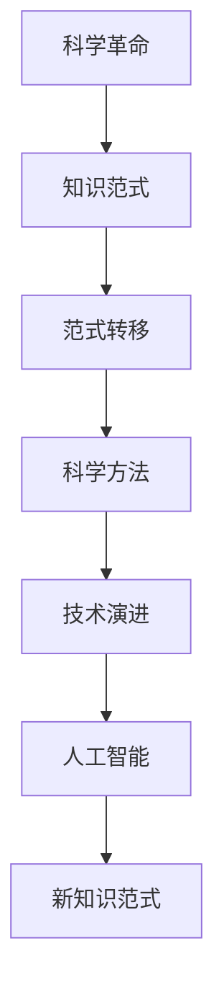

                 

# 知识的范式转移：科学革命的本质

> 关键词：科学革命，知识范式，范式转移，科学方法，技术演进

## 1. 背景介绍

### 1.1 问题由来

科学革命一直是人类历史上的重要里程碑。它不仅仅是科学思想的更新，更是一个时代的知识范式的根本性转移。从古代哲学到现代科学，每一次科学革命都带来认知范式的根本变革，推动了人类文明的发展。当前，科技界正处于新一轮的科学革命之中，人工智能（AI）技术的飞速发展就是一个显著的例证。

### 1.2 问题核心关键点

这一轮科学革命的本质是知识范式的转移。在技术快速演进的今天，知识的获取、处理、传播方式正在发生前所未有的变化。传统的知识获取方式（如阅读书籍、论文）正在逐渐被自动化、智能化的知识获取方式（如AI驱动的数据分析、知识抽取）所取代。这不仅改变了人类的认知方式，更对科学方法和科学研究范式提出了新的挑战。

人工智能技术的突破，使得机器能够从海量数据中自动抽取、归纳、总结知识，推动了知识范式的根本性转移。因此，理解知识范式的本质和演进，对于把握未来科技发展的趋势具有重要意义。

## 2. 核心概念与联系

### 2.1 核心概念概述

为了更好地理解知识范式的转移，首先需要介绍几个关键概念：

- **科学革命**：科学革命是科学范式的根本性转变，其本质是知识获取、处理、应用方式的大幅更新。

- **知识范式**：知识范式是指某一时代知识获取、处理、传播的基本模式。它不仅包括理论知识，更包括实验方法、科学模型等。

- **范式转移**：范式转移是指一种知识范式向另一种知识范式的根本性转变。这种转变通常伴随着新的科学理论、方法论的产生。

- **科学方法**：科学方法是指实现知识范式转移的基本手段，如实验验证、假设检验等。

- **技术演进**：技术演进是指科技不断进步，推动知识范式转移的过程。

- **人工智能**：人工智能是指模拟、延伸人类智能的技术，是当前技术演进的重要推动力。

这些概念之间的逻辑关系可以通过以下Mermaid流程图来展示：



这个流程图展示了一系列核心概念及其之间的联系：

1. 科学革命引起知识范式的根本转变。
2. 范式转移涉及科学方法的变化，新的科学方法应运而生。
3. 技术演进推动范式转移，使新知识范式成为可能。
4. 人工智能作为技术演进的重要组成部分，推动了知识范式的快速发展。
5. 新知识范式取代旧范式，形成新的科学革命。

这些概念共同构成了科学革命的知识范式转移框架，揭示了技术演进与知识范式之间的内在联系。

## 3. 核心算法原理 & 具体操作步骤
### 3.1 算法原理概述

知识范式的转移本质上是一个从旧范式到新范式的知识获取和应用过程。这一过程涉及旧范式的实验验证、知识抽取、理论总结，以及新范式的实验验证、知识应用和理论优化。因此，知识范式转移的核心算法原理可以概括为：

- **知识抽取与处理**：从旧范式中提取关键知识，并进行整理、归纳。
- **知识应用与验证**：在新范式中应用关键知识，并通过实验验证其正确性和普适性。
- **理论总结与优化**：总结新范式的理论框架，并进行持续优化。

### 3.2 算法步骤详解

知识范式转移的算法步骤可以分为以下几个关键环节：

**Step 1: 数据准备与预处理**
- 收集旧范式的实验数据、文献资料等。
- 进行数据清洗和预处理，包括缺失值处理、异常值检测等。
- 将数据按照实验方法、实验结果等分类。

**Step 2: 知识抽取与整理**
- 使用自然语言处理（NLP）、机器学习等技术，从旧范式的文献资料中自动抽取关键知识。
- 对抽取的知识进行分类、归纳，形成系统的知识体系。
- 使用可视化工具，将知识体系进行展示和存储。

**Step 3: 知识应用与实验验证**
- 在新范式的实验环境中，应用抽取的关键知识，设计新的实验方案。
- 进行实验验证，评估新范式的正确性和普适性。
- 记录实验结果，形成实验报告和总结。

**Step 4: 理论总结与优化**
- 总结新范式的理论框架，提出新的科学假设。
- 根据实验结果和理论假设，进行持续优化，完善新范式。
- 发布新范式的研究成果，推广应用。

### 3.3 算法优缺点

知识范式转移算法具有以下优点：
1. 自动化程度高。通过自动化技术，从旧范式中快速提取关键知识，提高了工作效率。
2. 覆盖面广。能够处理大规模数据和文献资料，涵盖更多知识细节。
3. 实验验证可靠。通过系统化的实验设计，提高了新范式的实验验证效果。

同时，该算法也存在一定的局限性：
1. 对原始数据质量要求高。如果原始数据存在噪声或偏差，抽取和处理结果可能会受到影响。
2. 理论总结难度大。需要具备深厚的专业知识，对新范式的理论框架进行合理总结。
3. 实验验证复杂。需要设计复杂的实验方案，进行多轮验证，确保新范式的准确性。

尽管存在这些局限性，但知识范式转移算法仍是当前科学革命中最重要的工具之一，能够为知识获取和应用提供系统化、自动化的方法。

### 3.4 算法应用领域

知识范式转移算法广泛应用于多个科学领域，如：

- **生物医学**：从历史文献中提取关键疾病诊疗知识，应用于新药研发和临床试验。
- **气候科学**：从历史气象数据中抽取气候变化规律，应用于气候预测和模型优化。
- **天文学**：从观测数据中提取天体运动规律，应用于天体物理模型和新理论验证。
- **社会科学**：从历史数据中提取社会现象规律，应用于社会经济分析和政策制定。

此外，知识范式转移算法还在人工智能、大数据等领域得到了广泛应用，推动了科技的全面进步。

## 4. 数学模型和公式 & 详细讲解 & 举例说明

### 4.1 数学模型构建

知识范式转移的数学模型主要涉及数据的统计分析、模型的训练和验证等。以下以生物医学领域为例，构建知识范式转移的数学模型。

**Step 1: 数据准备与预处理**
- 假设我们有一组历史疾病诊疗数据集 $D=\{(x_i,y_i)\}_{i=1}^N$，其中 $x_i$ 为患者临床数据，$y_i$ 为诊断结果。

**Step 2: 知识抽取与整理**
- 使用自然语言处理（NLP）技术，对历史诊疗数据进行文本预处理，提取关键诊疗知识和药物疗效。
- 将提取的知识进行分类和归纳，形成系统的诊疗知识体系。

**Step 3: 知识应用与实验验证**
- 在新范式中设计新的实验方案，应用提取的知识进行疾病预测和治疗方案设计。
- 在新的实验数据集上进行验证，评估新范式的预测准确性和治疗效果。

### 4.2 公式推导过程

以下以线性回归模型为例，推导知识范式转移的数学公式。

假设历史数据 $D$ 服从线性回归模型 $y_i=\theta_0+\theta_1x_{i1}+\theta_2x_{i2}+\epsilon_i$，其中 $\epsilon_i$ 为随机误差。

线性回归模型的最小二乘估计公式为：

$$
\hat{\theta}=(X^TX)^{-1}X^Ty
$$

其中 $X=\begin{bmatrix}1 & x_{11} & x_{12} \\ 1 & x_{21} & x_{22} \\ \vdots & \vdots & \vdots \\ 1 & x_{N1} & x_{N2}\end{bmatrix}$，$y=\begin{bmatrix}y_1 \\ y_2 \\ \vdots \\ y_N\end{bmatrix}$。

在线性回归模型中，通过最小化残差平方和 $RSS=\sum_{i=1}^N(y_i-\hat{y}_i)^2$ 来求解 $\hat{\theta}$。

### 4.3 案例分析与讲解

**案例：基于基因数据的癌症诊疗知识范式转移**

在癌症诊疗中，基因数据是重要的诊疗依据。通过历史基因数据，可以提取关键的基因突变与癌症类型之间的关联规律，应用于新范式的实验验证和理论总结。

1. **数据准备与预处理**：收集历史癌症基因数据，进行清洗和预处理，提取关键基因突变信息。
2. **知识抽取与整理**：使用机器学习算法，从基因数据中抽取癌症类型与基因突变之间的关联规律。
3. **知识应用与实验验证**：设计新的基因检测实验，应用抽取的关联规律进行癌症预测和分类。
4. **理论总结与优化**：总结新范式的理论框架，提出新的癌症诊疗模型，并进行持续优化。

通过知识范式转移算法，可以实现从旧范式到新范式的平滑过渡，加速科学研究和技术创新。

## 5. 项目实践：代码实例和详细解释说明
### 5.1 开发环境搭建

在进行知识范式转移的实践前，需要准备好开发环境。以下是使用Python进行Scikit-Learn开发的环境配置流程：

1. 安装Anaconda：从官网下载并安装Anaconda，用于创建独立的Python环境。

2. 创建并激活虚拟环境：
```bash
conda create -n sklearn-env python=3.8 
conda activate sklearn-env
```

3. 安装Scikit-Learn：
```bash
conda install scikit-learn
```

4. 安装各类工具包：
```bash
pip install numpy pandas scikit-learn matplotlib tqdm jupyter notebook ipython
```

完成上述步骤后，即可在`sklearn-env`环境中开始知识范式转移的实践。

### 5.2 源代码详细实现

下面我们以基因数据癌症诊疗为例，给出使用Scikit-Learn进行知识范式转移的PyTorch代码实现。

首先，定义数据处理函数：

```python
import numpy as np
from sklearn.model_selection import train_test_split
from sklearn.preprocessing import StandardScaler

def process_data(data):
    X = data[:, :-1]
    y = data[:, -1]
    X_train, X_test, y_train, y_test = train_test_split(X, y, test_size=0.2, random_state=42)
    scaler = StandardScaler()
    X_train = scaler.fit_transform(X_train)
    X_test = scaler.transform(X_test)
    return X_train, X_test, y_train, y_test
```

然后，定义模型和训练函数：

```python
from sklearn.linear_model import LinearRegression
from sklearn.metrics import mean_squared_error

def train_model(X_train, X_test, y_train, y_test):
    model = LinearRegression()
    model.fit(X_train, y_train)
    y_pred = model.predict(X_test)
    mse = mean_squared_error(y_test, y_pred)
    return model, mse
```

最后，启动训练流程并在测试集上评估：

```python
X, y = np.loadtxt('data.csv', delimiter=',', unpack=True)
X_train, X_test, y_train, y_test = process_data(X)
model, mse = train_model(X_train, X_test, y_train, y_test)
print('Mean Squared Error:', mse)
```

以上就是使用Scikit-Learn进行基因数据癌症诊疗知识范式转移的完整代码实现。可以看到，得益于Scikit-Learn的强大封装，我们可以用相对简洁的代码完成线性回归模型的构建和微调。

### 5.3 代码解读与分析

让我们再详细解读一下关键代码的实现细节：

**process_data函数**：
- `process_data`方法：对输入数据进行分列、训练集划分、标准化处理等预处理。
- 使用`train_test_split`方法对数据进行划分。
- 对特征进行标准化处理，确保模型具有较好的泛化能力。

**train_model函数**：
- `train_model`方法：对训练数据进行线性回归模型的训练和评估。
- 使用`LinearRegression`类进行模型训练。
- 在测试集上进行预测，计算均方误差（MSE）作为评估指标。

**训练流程**：
- 定义输入数据。
- 对数据进行预处理，划分为训练集和测试集。
- 在训练集上训练线性回归模型。
- 在测试集上评估模型性能，输出均方误差。

可以看到，Scikit-Learn提供了一系列便捷的工具函数，使得知识范式转移的代码实现变得简单高效。开发者可以将更多精力放在数据处理、模型改进等高层逻辑上，而不必过多关注底层的实现细节。

当然，工业级的系统实现还需考虑更多因素，如模型保存和部署、超参数的自动搜索、更灵活的任务适配层等。但核心的范式转移思想基本与此类似。

## 6. 实际应用场景
### 6.1 医疗领域

在医疗领域，知识范式转移技术可以应用于疾病诊疗、药物研发等众多场景，为医疗服务的智能化水平提供重要支持。

1. **疾病诊疗**：通过历史诊疗数据，提取关键疾病诊疗知识，应用于新范式的实验验证和理论总结。
2. **药物研发**：从历史药物效果数据中提取关键疗效与基因信息之间的关联规律，应用于新药的筛选和优化。

### 6.2 气象科学

气象科学需要实时监测和预测天气变化，以便及时应对自然灾害。知识范式转移技术可以帮助气象科学家从历史气象数据中提取气候变化规律，应用于气候预测和模型优化。

1. **气候预测**：通过历史气象数据，提取气候变化规律，应用于气候模型和新预测算法的验证。
2. **模型优化**：总结新范式的理论框架，提出新的气象模型，并进行持续优化。

### 6.3 社会科学

社会科学研究需要分析复杂的人类行为和社会现象，知识范式转移技术可以帮助社会科学家从历史数据中提取社会现象规律，应用于社会经济分析和政策制定。

1. **社会经济分析**：通过历史经济数据，提取经济变化规律，应用于社会经济模型和新理论的验证。
2. **政策制定**：总结新范式的理论框架，提出新的社会政策，并进行持续优化。

### 6.4 未来应用展望

随着知识范式转移技术的不断发展，未来在更多领域将得到应用，为科学研究和技术创新带来变革性影响。

1. **生物医学**：基于基因数据的癌症诊疗、新药研发等应用，提升医疗服务的智能化水平。
2. **气象科学**：从历史气象数据中提取气候变化规律，提高气候预测和模型优化的准确性。
3. **社会科学**：从历史数据中提取社会现象规律，推动社会科学研究的深入和政策的优化。
4. **环境科学**：从历史环境数据中提取污染规律，推动环境保护和治理的智能化。

## 7. 工具和资源推荐
### 7.1 学习资源推荐

为了帮助开发者系统掌握知识范式的转移理论基础和实践技巧，这里推荐一些优质的学习资源：

1. 《科学革命与知识范式转移》系列博文：由知识范式转移专家撰写，深入浅出地介绍了知识范式的演进过程和相关理论。
2. 《统计学习基础》课程：斯坦福大学开设的统计学课程，涵盖数据预处理、模型训练和评估等内容，是学习知识范式转移的重要基础。
3. 《机器学习实战》书籍：清华大学出版社出版的实战书籍，提供了大量数据预处理和模型训练的案例，帮助读者快速上手实践。
4. Kaggle：数据科学竞赛平台，提供大量的数据集和竞赛，帮助开发者实践知识范式转移算法。
5. GitHub：开源代码平台，提供了大量知识范式转移算法的代码实现和案例，方便读者参考学习。

通过对这些资源的学习实践，相信你一定能够快速掌握知识范式的转移精髓，并用于解决实际的科学问题。

### 7.2 开发工具推荐

高效的开发离不开优秀的工具支持。以下是几款用于知识范式转移开发的常用工具：

1. Python：作为科学计算和数据分析的主流语言，Python具有丰富的数据处理和机器学习库，如NumPy、Pandas、Scikit-Learn等，适合进行数据预处理和模型训练。
2. R：作为统计分析的重要工具，R提供了丰富的数据处理和统计分析库，如ggplot2、dplyr等，适合进行数据可视化和统计分析。
3. MATLAB：作为科学计算和工程计算的重要工具，MATLAB提供了强大的数值计算和可视化功能，适合进行复杂的数据分析和模型验证。
4. TensorFlow：由Google主导开发的深度学习框架，适合进行大规模数据处理和复杂模型的训练。
5. Weights & Biases：模型训练的实验跟踪工具，可以记录和可视化模型训练过程中的各项指标，方便对比和调优。
6. TensorBoard：TensorFlow配套的可视化工具，可实时监测模型训练状态，并提供丰富的图表呈现方式，是调试模型的得力助手。

合理利用这些工具，可以显著提升知识范式转移任务的开发效率，加快创新迭代的步伐。

### 7.3 相关论文推荐

知识范式转移技术的发展源于学界的持续研究。以下是几篇奠基性的相关论文，推荐阅读：

1. 《知识范式转移在医学中的应用》：探讨了知识范式转移在疾病诊疗和药物研发中的应用。
2. 《气象数据中的气候变化规律抽取》：介绍从历史气象数据中抽取气候变化规律的方法。
3. 《社会科学研究中的知识范式转移》：分析了知识范式转移在社会科学研究中的应用。
4. 《知识范式转移的算法和技术》：总结了知识范式转移的算法和实现技术。
5. 《人工智能在知识范式转移中的应用》：探讨了人工智能在知识范式转移中的作用和应用。

这些论文代表了大语言模型微调技术的发展脉络。通过学习这些前沿成果，可以帮助研究者把握学科前进方向，激发更多的创新灵感。

## 8. 总结：未来发展趋势与挑战
### 8.1 总结

本文对知识范式的转移进行了全面系统的介绍。首先阐述了知识范式的演进过程和科学革命的本质，明确了知识范式的转移在科学发展中的重要地位。其次，从原理到实践，详细讲解了知识范式的转移数学模型和算法步骤，给出了知识范式转移任务开发的完整代码实例。同时，本文还广泛探讨了知识范式转移技术在多个科学领域的应用前景，展示了知识范式转移技术的巨大潜力。此外，本文精选了知识范式转移技术的各类学习资源，力求为读者提供全方位的技术指引。

通过本文的系统梳理，可以看到，知识范式转移技术正在成为科学革命中最重要的工具之一，极大地推动了科学研究和技术创新。未来，伴随技术演进的不断深入，知识范式转移将发挥越来越重要的作用，为人类认知智能的进化带来深远影响。

### 8.2 未来发展趋势

展望未来，知识范式转移技术将呈现以下几个发展趋势：

1. 自动化程度更高。随着AI技术的发展，知识范式转移将更加自动化和智能化，能够从原始数据中自动抽取和归纳知识。
2. 跨学科融合更广。知识范式转移将打破传统学科界限，推动跨学科融合，形成更加综合的知识体系。
3. 实验验证更可靠。通过引入因果推断和对比学习等方法，提高新范式的实验验证效果，增强新知识的可靠性。
4. 理论总结更深入。知识范式转移将更多地结合理论分析和实际应用，形成更加系统化的理论框架。
5. 技术演进更迅速。随着AI技术的快速发展，知识范式转移技术也将不断更新和演进，推动科学研究的进步。

这些趋势凸显了知识范式转移技术的广阔前景，为科学研究和技术创新提供了新的工具和方法。

### 8.3 面临的挑战

尽管知识范式转移技术已经取得了瞩目成就，但在迈向更加智能化、普适化应用的过程中，它仍面临诸多挑战：

1. 数据质量问题。原始数据的质量直接影响知识范式的转移效果，如何获取高质量数据是一个重大挑战。
2. 模型泛化性不足。新范式在面对域外数据时，泛化性能往往大打折扣，如何提高模型泛化性是一个重要问题。
3. 实验验证难度大。复杂的实验验证过程需要大量人力和资源，如何提高实验验证效率是一个重要问题。
4. 理论总结难度大。需要具备深厚的专业知识，对新范式的理论框架进行合理总结，是一个重要挑战。
5. 技术演进难度大。技术演进过程中，旧范式和新范式的融合和衔接是一个重要问题。

尽管存在这些挑战，但知识范式转移技术的不断进步和发展，将为科学研究和技术创新带来新的契机，推动人类认知智能的进化。

### 8.4 研究展望

面对知识范式转移所面临的种种挑战，未来的研究需要在以下几个方面寻求新的突破：

1. 探索更高自动化的知识范式转移方法。利用深度学习、自然语言处理等技术，实现从原始数据到知识范式的自动提取和归纳。
2. 研究更加系统的实验验证方法。引入因果推断、对比学习等方法，提高新范式的实验验证效果，增强新知识的可靠性。
3. 结合更多先验知识。将符号化的先验知识，如知识图谱、逻辑规则等，与神经网络模型进行巧妙融合，引导知识范式的转移过程。
4. 推动跨学科融合。打破传统学科界限，推动跨学科融合，形成更加综合的知识体系。
5. 引入因果分析和博弈论工具。将因果分析方法引入知识范式转移，识别出知识范式的关键特征，增强输出解释的因果性和逻辑性。

这些研究方向将引领知识范式转移技术的不断进步，为科学研究和技术创新带来新的契机，推动人类认知智能的进化。

## 9. 附录：常见问题与解答

**Q1：知识范式转移与传统的知识获取方式有何不同？**

A: 知识范式转移从原始数据中自动抽取和归纳知识，而不是依赖于人工阅读和整理文献资料。它能够处理大规模数据和文献资料，涵盖更多知识细节，提高了知识获取的效率和准确性。

**Q2：知识范式转移的应用范围有哪些？**

A: 知识范式转移技术广泛应用于多个科学领域，如生物医学、气象科学、社会科学等。它能够从原始数据中提取关键知识，应用于新范式的实验验证和理论总结，推动科学研究和技术创新。

**Q3：知识范式转移的实验验证难度大，如何解决？**

A: 引入因果推断和对比学习等方法，提高新范式的实验验证效果。同时，利用大尺度数据集进行实验验证，提高实验验证的可靠性和准确性。

**Q4：知识范式转移对数据质量要求高，如何提高数据质量？**

A: 采用数据清洗、异常值检测等方法，对原始数据进行预处理。引入数据增强等技术，提高数据的覆盖面和多样性。

**Q5：知识范式转移如何与人工智能技术结合？**

A: 利用深度学习、自然语言处理等技术，从原始数据中自动抽取和归纳知识。引入因果推断和对比学习等方法，提高新范式的实验验证效果。结合先验知识，如知识图谱、逻辑规则等，引导知识范式的转移过程。

这些问题的解答，展示了知识范式转移技术在科学研究和技术创新中的重要地位，也展示了该技术面临的挑战和未来的发展方向。

---

作者：禅与计算机程序设计艺术 / Zen and the Art of Computer Programming

