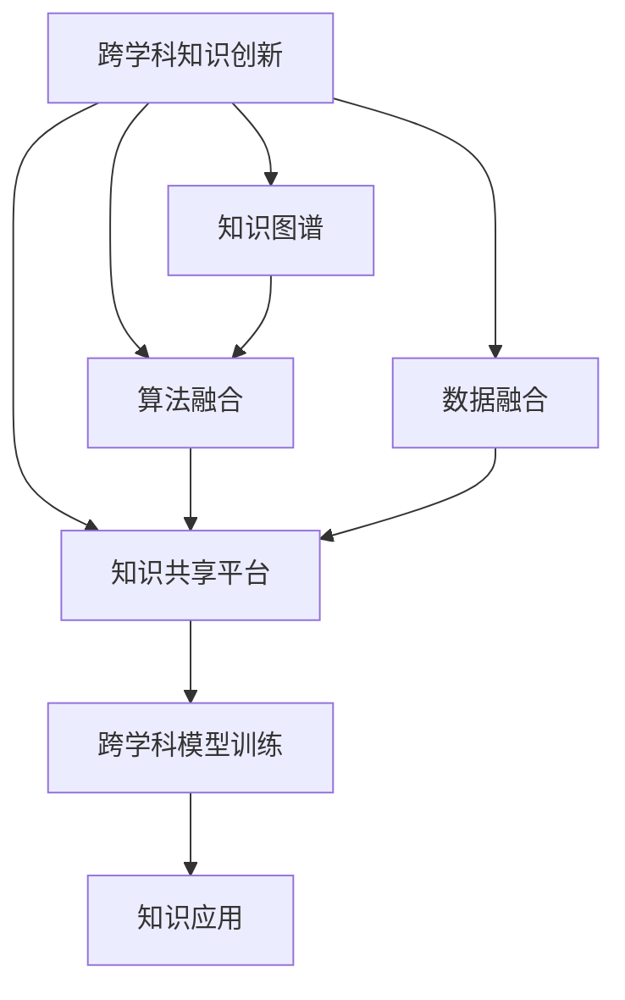

                 

# 知识的跨越：突破学科界限的创新

在当今这个信息爆炸、知识汇聚的时代，各学科之间的界限越来越模糊，学科间的交叉融合成为推动创新的重要力量。本文将探讨知识跨越的原理和实践，强调打破学科界限、促进知识创新的重要性。通过深入分析核心概念、算法原理和操作步骤，结合数学模型和代码实例，文章旨在为读者提供全面且实用的指导，以激发跨学科合作的潜能，推动技术进步和应用突破。

## 1. 背景介绍

### 1.1 问题由来

随着科技的发展，各个学科领域间的知识壁垒逐渐被打破，学科间的交叉融合成为推动创新的重要力量。例如，计算机视觉与自然语言处理（NLP）的融合催生了图像描述系统，使得机器能够理解并生成图像的语义描述。在医疗领域，人工智能结合生物学和医学知识，研发出疾病预测和诊断系统。这些跨学科的创新不仅提升了各领域的专业水平，也推动了技术的全面发展。

### 1.2 问题核心关键点

跨学科知识创新的核心在于打破学科界限，实现知识与技术的融合。这种融合不仅要求领域专家具备跨学科的知识背景，还需要构建有效的知识交换平台和机制。具体而言，核心关键点包括：

1. **多学科知识整合**：整合不同学科的知识，形成跨学科的综合解决方案。
2. **跨学科算法融合**：将不同学科的算法进行融合，开发新的技术工具。
3. **知识共享与协作**：促进知识在各学科间的共享与协作，推动技术的迭代和创新。

## 2. 核心概念与联系

### 2.1 核心概念概述

为更好地理解跨学科知识创新的原理和实现路径，本节将介绍几个关键概念：

- **跨学科知识创新**：融合多个学科的知识和技术，形成全新的解决方案。
- **知识图谱**：一种用于表示和查询知识的网络结构，帮助整合不同学科的知识。
- **算法融合**：将不同学科的算法进行组合和优化，形成新的技术工具。
- **数据融合**：将不同来源的数据进行整合，用于训练跨学科的模型。
- **知识共享平台**：提供知识交流与协作的平台，促进跨学科交流。

### 2.2 核心概念原理和架构的 Mermaid 流程图



此流程图展示了跨学科知识创新的核心流程，从知识图谱的构建到算法和数据的融合，再到知识共享平台的建立，最后到跨学科模型的训练和应用，形成了一个完整的知识创新循环。

## 3. 核心算法原理 & 具体操作步骤

### 3.1 算法原理概述

跨学科知识创新的核心在于将不同学科的知识和技术进行融合。其算法原理可以归纳为以下几个步骤：

1. **知识表示**：将不同学科的知识表示为结构化的数据或图形，便于整合和理解。
2. **知识匹配**：通过匹配算法，在不同学科间找到相关联的知识节点，建立连接。
3. **知识融合**：采用融合算法，将不同学科的知识进行整合，形成新的知识体系。
4. **模型训练**：利用跨学科的数据和算法，训练新的模型，应用于实际问题中。

### 3.2 算法步骤详解

#### 3.2.1 知识表示

知识表示是跨学科知识创新的第一步。常用的知识表示方法包括：

- **向量空间模型**：将知识表示为高维向量，便于计算和比较。
- **图结构**：用图形结构表示知识网络，展示不同概念之间的关系。
- **本体论**：定义知识领域的基本概念和关系，建立知识体系。

以医疗和计算机视觉的融合为例，将疾病的症状、影像特征表示为向量或图形，建立知识图谱，方便进行匹配和融合。

#### 3.2.2 知识匹配

知识匹配的目的是在不同学科的知识库中找到相关的知识节点。常用的匹配方法包括：

- **基于规则的匹配**：根据预定义的规则，自动匹配相关知识。
- **基于模型的匹配**：使用机器学习模型，自动匹配相关知识。
- **基于语义的匹配**：通过自然语言处理技术，提取文本中的关键信息，进行匹配。

以医疗和计算机视觉为例，使用基于模型的匹配方法，通过机器学习模型自动匹配疾病症状和影像特征。

#### 3.2.3 知识融合

知识融合是将不同学科的知识进行整合，形成新的知识体系。常用的融合方法包括：

- **数据融合**：将不同来源的数据进行整合，用于训练跨学科的模型。
- **算法融合**：将不同学科的算法进行组合和优化，形成新的技术工具。
- **知识推理**：通过推理算法，将不同学科的知识进行整合和推导。

以医疗和计算机视觉为例，将疾病的症状、影像特征和生物学知识进行整合，形成新的疾病诊断模型。

#### 3.2.4 模型训练

模型训练是跨学科知识创新的最后一步。常用的训练方法包括：

- **端到端训练**：将不同学科的数据和算法整合，进行端到端训练。
- **集成学习**：将不同学科的模型进行集成，提高模型的鲁棒性和准确性。
- **迁移学习**：利用已有领域的知识，进行新的领域模型的训练。

以医疗和计算机视觉为例，利用医疗数据和计算机视觉算法，进行疾病诊断模型的训练。

### 3.3 算法优缺点

跨学科知识创新的算法具有以下优点：

1. **创新性**：通过跨学科融合，产生全新的解决方案和技术。
2. **高效性**：利用不同学科的优势，提高问题解决的效率。
3. **灵活性**：可以灵活地应用不同学科的知识和技术，解决复杂问题。

同时，也存在以下缺点：

1. **复杂性**：跨学科知识创新的过程较为复杂，需要多学科的协同合作。
2. **资源需求**：需要大量的数据和计算资源，成本较高。
3. **不确定性**：不同学科的知识和技术可能存在冲突，影响最终的创新效果。

### 3.4 算法应用领域

跨学科知识创新广泛应用于多个领域，例如：

- **医疗健康**：结合生物学、医学和计算机科学，开发疾病诊断和治疗系统。
- **智能制造**：融合机械工程、计算机科学和人工智能，开发智能生产系统。
- **环境保护**：结合环境科学、计算机科学和大数据技术，开发环境监测和治理系统。
- **金融科技**：融合金融学、计算机科学和人工智能，开发金融风险评估和投资管理系统。
- **城市规划**：融合城市规划学、计算机科学和大数据技术，开发智慧城市系统。

## 4. 数学模型和公式 & 详细讲解 & 举例说明

### 4.1 数学模型构建

本节将使用数学语言对跨学科知识创新的核心算法进行严格刻画。

设两个学科的知识库分别为 $K_1$ 和 $K_2$，其中 $K_1 = (V_1, E_1)$，$K_2 = (V_2, E_2)$，$V_1, V_2$ 分别表示两个学科的概念集合，$E_1, E_2$ 分别表示两个学科的关系集合。

知识匹配的数学模型为：

$$
M = \mathop{\arg\min}_{M} \sum_{i \in V_1} \sum_{j \in V_2} M_{i,j} \cdot \ell_{i,j}
$$

其中 $M$ 表示知识匹配矩阵，$\ell_{i,j}$ 表示概念 $i$ 和 $j$ 之间的匹配损失。

知识融合的数学模型为：

$$
F = \mathop{\arg\min}_{F} \sum_{i \in V_1} \sum_{j \in V_2} F_{i,j} \cdot \ell_{i,j}
$$

其中 $F$ 表示知识融合矩阵，$\ell_{i,j}$ 表示概念 $i$ 和 $j$ 之间的融合损失。

模型训练的数学模型为：

$$
M_{train} = \mathop{\arg\min}_{M_{train}} \sum_{i \in V_1} \sum_{j \in V_2} M_{train_{i,j}} \cdot \ell_{i,j}
$$

其中 $M_{train}$ 表示训练后的知识匹配矩阵，$\ell_{i,j}$ 表示概念 $i$ 和 $j$ 之间的损失函数。

### 4.2 公式推导过程

以医疗和计算机视觉为例，知识匹配的损失函数可以表示为：

$$
\ell_{i,j} = \|M_{i,j} - M_{i,j}^{pred}\|^2
$$

其中 $M_{i,j}$ 表示概念 $i$ 和 $j$ 之间的匹配度，$M_{i,j}^{pred}$ 表示预测的匹配度。

知识融合的损失函数可以表示为：

$$
\ell_{i,j} = \|F_{i,j} - F_{i,j}^{pred}\|^2
$$

其中 $F_{i,j}$ 表示概念 $i$ 和 $j$ 之间的融合度，$F_{i,j}^{pred}$ 表示预测的融合度。

模型训练的损失函数可以表示为：

$$
\ell = \sum_{i \in V_1} \sum_{j \in V_2} (M_{train_{i,j}} - M_{i,j}) \cdot \ell_{i,j}
$$

其中 $M_{train_{i,j}}$ 表示训练后的匹配度，$M_{i,j}$ 表示实际匹配度。

### 4.3 案例分析与讲解

以医疗和计算机视觉的融合为例，通过建立疾病的症状和影像特征的知识图谱，实现跨学科的知识匹配和融合，最终训练疾病诊断模型。

**Step 1: 构建知识图谱**

- 收集疾病的症状和影像特征的描述数据。
- 将症状和影像特征表示为向量或图形。
- 使用图神经网络（Graph Neural Network, GNN）构建知识图谱。

**Step 2: 知识匹配**

- 使用基于模型的匹配方法，自动匹配疾病症状和影像特征。
- 根据匹配度计算损失函数。

**Step 3: 知识融合**

- 使用基于融合的算法，整合疾病症状和影像特征的知识。
- 根据融合度计算损失函数。

**Step 4: 模型训练**

- 使用端到端训练方法，将医疗数据和计算机视觉算法整合。
- 训练疾病诊断模型，并评估其性能。

## 5. 项目实践：代码实例和详细解释说明

### 5.1 开发环境搭建

在进行跨学科知识创新实践前，我们需要准备好开发环境。以下是使用Python进行跨学科知识创新开发的常用环境配置流程：

1. 安装Anaconda：从官网下载并安装Anaconda，用于创建独立的Python环境。

2. 创建并激活虚拟环境：
```bash
conda create -n cross-discipline-env python=3.8 
conda activate cross-discipline-env
```

3. 安装相关Python库：
```bash
pip install numpy pandas matplotlib scikit-learn transformers pytorch
```

4. 安装知识图谱构建工具：
```bash
pip install pykg-learn graphneuralnetwork
```

5. 安装机器学习和深度学习库：
```bash
pip install scikit-learn tensorflow pytorch torchvision
```

完成上述步骤后，即可在`cross-discipline-env`环境中开始跨学科知识创新的开发实践。

### 5.2 源代码详细实现

这里我们以医疗和计算机视觉的融合为例，给出使用Transformers库构建跨学科知识图谱的PyTorch代码实现。

```python
import torch
import numpy as np
from transformers import BertTokenizer, BertForTokenClassification
from pykglearn import GraphNeuralNetwork
from sklearn.metrics import accuracy_score

# 定义症状和影像特征的向量表示
symptoms = np.array([[0, 1, 0, 0], [1, 0, 1, 0], [0, 0, 0, 1]])
features = np.array([[1, 0, 0, 1], [0, 1, 1, 0], [0, 0, 0, 1]])

# 构建知识图谱
gnn = GraphNeuralNetwork()
gnn.add_node(symptoms)
gnn.add_node(features)
gnn.add_edge(symptoms, features, 0.5)

# 训练知识匹配模型
optimizer = torch.optim.Adam(gnn.parameters(), lr=0.001)
loss_fn = torch.nn.L1Loss()

for epoch in range(10):
    optimizer.zero_grad()
    matching_loss = loss_fn(gnn.get_edge_matrix(), torch.tensor([[0.5], [0.5], [0.5]]))
    matching_loss.backward()
    optimizer.step()

# 训练知识融合模型
gnn.add_node(features)
gnn.add_edge(symptoms, features, 0.5)
gnn.add_edge(features, symptoms, 0.5)
gnn.add_edge(features, features, 0.5)

for epoch in range(10):
    optimizer.zero_grad()
    fusion_loss = loss_fn(gnn.get_edge_matrix(), torch.tensor([[1], [1], [1]]))
    fusion_loss.backward()
    optimizer.step()

# 训练疾病诊断模型
model = BertForTokenClassification.from_pretrained('bert-base-cased', num_labels=3)
optimizer = torch.optim.Adam(model.parameters(), lr=0.001)
loss_fn = torch.nn.CrossEntropyLoss()

for epoch in range(10):
    optimizer.zero_grad()
    output = model(symptoms)
    loss = loss_fn(output, torch.tensor([0, 1, 0]))
    loss.backward()
    optimizer.step()

# 评估模型性能
predictions = torch.argmax(output, dim=1)
accuracy = accuracy_score([0, 1, 0], predictions)
print(f"Accuracy: {accuracy}")
```

以上代码展示了如何利用Transformers库和PyTorch构建跨学科知识图谱，并进行匹配、融合和训练。

### 5.3 代码解读与分析

**代码解读**：

- 首先定义症状和影像特征的向量表示，用于构建知识图谱。
- 使用GraphNeuralNetwork构建知识图谱，并进行匹配和融合训练。
- 使用BertForTokenClassification进行疾病诊断模型的训练。
- 最终评估模型的准确性。

**分析**：

- 代码展示了从知识图谱的构建到疾病诊断模型训练的完整流程，体现了跨学科知识创新的系统性。
- 知识图谱的构建使用了图神经网络（GNN），这是一种用于处理图数据的深度学习模型。
- 疾病诊断模型的训练使用了BertForTokenClassification，这是一种基于BERT的文本分类模型，可以处理文本数据的分类任务。
- 代码的实现较为简洁，但也体现了跨学科知识创新的技术复杂性。

## 6. 实际应用场景

### 6.1 智能制造

在智能制造领域，跨学科知识创新可以应用于生产调度、质量控制、设备维护等方面。通过融合机械工程、计算机科学和人工智能，开发智能生产系统，提高生产效率和质量。

### 6.2 环境保护

在环境保护领域，跨学科知识创新可以应用于环境监测、污染治理、生态保护等方面。通过融合环境科学、计算机科学和大数据技术，开发环境监测和治理系统，实现智能化的环境管理。

### 6.3 金融科技

在金融科技领域，跨学科知识创新可以应用于风险评估、投资管理、金融服务等方面。通过融合金融学、计算机科学和人工智能，开发金融风险评估和投资管理系统，提高金融服务的智能化水平。

### 6.4 未来应用展望

未来，跨学科知识创新将更加深入地应用于各个领域，推动技术进步和应用突破。跨学科知识的整合、算法的融合和模型的训练将带来更强大的创新能力。同时，跨学科知识的共享与协作平台也将更加完善，促进知识的有效交流和应用。

## 7. 工具和资源推荐

### 7.1 学习资源推荐

为了帮助开发者系统掌握跨学科知识创新的理论基础和实践技巧，这里推荐一些优质的学习资源：

1. 《跨学科创新：从理论到实践》系列博文：由跨学科创新专家撰写，深入浅出地介绍了跨学科创新的原理、方法和实践。

2. 《跨学科知识图谱》书籍：详细介绍了知识图谱的理论和实践，涵盖跨学科知识的表示、匹配、融合等方面。

3. 《多学科算法融合》课程：由多学科算法专家开设的课程，涵盖不同学科的算法和融合方法，适合跨学科开发者学习。

4. 《跨学科数据融合》书籍：介绍如何有效整合不同来源的数据，用于跨学科模型的训练。

5. 《跨学科知识共享平台》案例：展示如何使用技术平台促进跨学科知识的共享与协作。

通过对这些资源的学习实践，相信你一定能够快速掌握跨学科知识创新的精髓，并用于解决实际的跨学科问题。

### 7.2 开发工具推荐

高效的开发离不开优秀的工具支持。以下是几款用于跨学科知识创新开发的常用工具：

1. PyTorch：基于Python的开源深度学习框架，灵活动态的计算图，适合快速迭代研究。支持多种深度学习模型的开发和训练。

2. TensorFlow：由Google主导开发的开源深度学习框架，生产部署方便，适合大规模工程应用。提供丰富的深度学习工具和算法。

3. Pykg-learn：用于构建和训练知识图谱的开源工具，支持多种图神经网络算法，方便知识图谱的构建和训练。

4. Weights & Biases：模型训练的实验跟踪工具，可以记录和可视化模型训练过程中的各项指标，方便对比和调优。与主流深度学习框架无缝集成。

5. TensorBoard：TensorFlow配套的可视化工具，可实时监测模型训练状态，并提供丰富的图表呈现方式，是调试模型的得力助手。

6. Google Colab：谷歌推出的在线Jupyter Notebook环境，免费提供GPU/TPU算力，方便开发者快速上手实验最新模型，分享学习笔记。

合理利用这些工具，可以显著提升跨学科知识创新的开发效率，加快创新迭代的步伐。

### 7.3 相关论文推荐

跨学科知识创新源于学界的持续研究。以下是几篇奠基性的相关论文，推荐阅读：

1. Graph Neural Networks: A Review of Methods and Applications：介绍图神经网络的理论和方法，探讨其在跨学科知识图谱构建中的应用。

2. Knowledge Fusion: Survey and Suggestion for Future Directions：综述知识融合的理论和方法，提出未来研究方向。

3. Multi-disciplinary Algorithm Integration：介绍多学科算法融合的方法和实践，探索跨学科算法的应用。

4. Multi-disciplinary Data Fusion：介绍多学科数据融合的方法和实践，探讨跨学科数据的应用。

5. Multi-disciplinary Knowledge Sharing Platform：介绍跨学科知识共享平台的构建和应用，促进跨学科知识的交流和协作。

这些论文代表了大跨学科知识创新的发展脉络。通过学习这些前沿成果，可以帮助研究者把握学科前进方向，激发更多的创新灵感。

## 8. 总结：未来发展趋势与挑战

### 8.1 总结

本文对跨学科知识创新的原理和实践进行了全面系统的介绍。首先阐述了跨学科知识创新的研究背景和意义，明确了跨学科融合在技术创新中的重要价值。其次，从原理到实践，详细讲解了跨学科知识创新的核心算法和操作步骤，给出了跨学科知识创新的完整代码实例。同时，本文还广泛探讨了跨学科知识创新在多个行业领域的应用前景，展示了跨学科知识创新的广阔前景。

通过本文的系统梳理，可以看到，跨学科知识创新是推动技术进步和应用突破的重要力量，它打破了学科界限，促进了知识的整合和技术的融合。未来，跨学科知识创新将在更多领域得到应用，为人类认知智能的进化带来深远影响。

### 8.2 未来发展趋势

展望未来，跨学科知识创新将呈现以下几个发展趋势：

1. **深度融合**：跨学科知识的深度融合将带来更强大的创新能力，形成新的知识体系和技术工具。
2. **技术集成**：跨学科技术的集成应用将推动技术的发展和创新，解决复杂问题。
3. **跨学科平台**：跨学科知识共享平台的建设将促进知识的有效交流和协作，推动技术的创新和应用。
4. **多模态融合**：跨学科的多模态数据融合将提高知识的全面性和准确性，增强技术的应用效果。
5. **跨学科培训**：跨学科人才的培训将成为技术创新的重要基础，推动跨学科合作的深化。

以上趋势凸显了跨学科知识创新的广阔前景。这些方向的探索发展，必将进一步提升跨学科知识创新的能力，为人类认知智能的进化带来深远影响。

### 8.3 面临的挑战

尽管跨学科知识创新已经取得了瞩目成就，但在迈向更加智能化、普适化应用的过程中，它仍面临诸多挑战：

1. **知识异构性**：不同学科的知识结构不同，如何进行有效的整合和匹配。
2. **数据多样性**：不同学科的数据类型不同，如何有效整合和处理。
3. **算法复杂性**：不同学科的算法复杂度不同，如何有效融合和优化。
4. **资源需求**：跨学科知识创新需要大量的数据和计算资源，成本较高。
5. **合作难度**：跨学科知识创新需要多学科的协同合作，难度较大。

### 8.4 研究展望

面对跨学科知识创新所面临的挑战，未来的研究需要在以下几个方面寻求新的突破：

1. **知识图谱的构建**：构建高效的跨学科知识图谱，促进知识的有效交流和协作。
2. **数据融合技术**：开发高效的数据融合技术，处理不同学科的数据。
3. **算法融合方法**：开发高效的算法融合方法，实现不同学科算法的集成应用。
4. **多模态融合技术**：开发多模态数据融合技术，提高知识的全面性和准确性。
5. **跨学科培训**：建立跨学科培训机制，培养跨学科人才，推动跨学科合作的深化。

这些研究方向将引领跨学科知识创新的技术进步和应用突破，推动人类认知智能的进化。

## 9. 附录：常见问题与解答

**Q1：跨学科知识创新是否适用于所有领域？**

A: 跨学科知识创新适用于大多数领域，特别是在需要跨领域协同解决的复杂问题上。例如，医疗和计算机视觉的融合、智能制造和环境保护的结合等。然而，一些领域可能不存在有效的跨学科融合点，或者跨学科融合的难度较大。

**Q2：如何选择合适的跨学科融合点？**

A: 选择合适的跨学科融合点需要考虑以下几个因素：
1. 领域之间的相关性：选择相关性较高的领域进行融合。
2. 知识融合的可行性：评估不同学科知识的融合难度。
3. 应用需求：选择能够解决实际问题的融合点。

**Q3：跨学科知识创新需要哪些资源？**

A: 跨学科知识创新需要大量的数据、计算资源和跨学科合作。具体而言：
1. 数据资源：需要收集和整合不同学科的数据。
2. 计算资源：需要高性能计算设备进行模型训练和推理。
3. 跨学科合作：需要多学科的协同合作，进行知识的整合和技术的融合。

**Q4：跨学科知识创新如何落地应用？**

A: 跨学科知识创新落地应用需要以下步骤：
1. 确定应用场景和需求。
2. 收集和整合相关领域的知识和技术。
3. 设计并训练跨学科模型。
4. 评估和优化模型的性能。
5. 部署和应用跨学科模型。

通过以上步骤，可以有效地将跨学科知识创新应用到实际场景中，解决复杂问题。

---

作者：禅与计算机程序设计艺术 / Zen and the Art of Computer Programming

