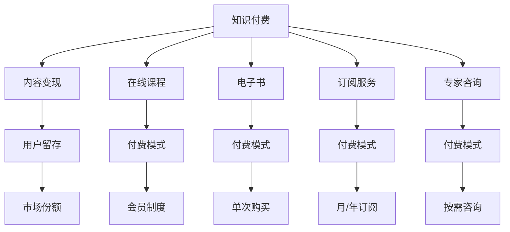

                 

# 知识经济时代下的知识付费创新商业模式衍生

## 1. 背景介绍

在知识经济时代，信息获取的门槛逐步降低，互联网为知识的传播和获取提供了便捷的渠道。与此同时，知识的价值日益凸显，从传统的教育培训到现代的在线课程、远程学习、技能提升，知识的付费需求和市场规模快速增长。这不仅改变了人们的消费习惯和学习方式，也催生了许多知识付费的创新商业模式。本文将深入探讨知识付费领域的商业创新，并分析这些模式对用户、企业和市场的潜在影响。

## 2. 核心概念与联系

### 2.1 核心概念概述

为理解知识付费商业模式的发展和创新，首先需要明确以下几个核心概念：

- **知识付费 (Knowledge Monetization)**：指将知识内容通过各种形式的付费手段传递给用户，从而获得经济收益的商业模式。包括在线课程、电子书、订阅服务、专家咨询等形式。
- **内容变现 (Content Monetization)**：将创作的内容通过广告、赞助、付费阅读等方式进行商业化，获取收入。
- **用户留存 (User Retention)**：提升用户的长期黏性，减少用户流失率，实现稳定收入流。
- **市场份额 (Market Share)**：知识付费产品在市场上的占比，衡量产品的竞争力和市场接受度。

### 2.2 核心概念原理和架构的 Mermaid 流程图



这个流程图展示了知识付费的运作过程：知识内容通过不同的付费模式传递给用户，从而实现内容变现。用户通过付费获取知识内容，平台则通过会员制度、单次购买、订阅服务、按需咨询等方式留住用户，增加市场份额。

## 3. 核心算法原理 & 具体操作步骤

### 3.1 算法原理概述

知识付费商业模式的创新，主要依赖于算法和数据驱动的用户行为分析。通过数据分析，可以了解用户的行为特征、偏好和需求，进而提供更加个性化和精准的内容推荐和服务。核心算法包括：

- **推荐算法**：利用协同过滤、内容推荐、混合推荐等算法，为用户推荐个性化的内容，提升用户体验。
- **用户行为分析**：通过用户的行为数据（如浏览记录、购买历史、互动情况等）分析用户需求和兴趣，优化内容和推荐策略。
- **定价策略**：通过算法分析用户对不同内容的支付意愿，制定合理的定价策略。

### 3.2 算法步骤详解

以下是知识付费创新商业模式的具体操作步骤：

**Step 1: 数据采集与清洗**
- 采集用户的浏览、购买、互动等行为数据。
- 清洗和整理数据，去除噪声和异常值，形成可用于分析的完整数据集。

**Step 2: 用户行为建模**
- 使用统计学方法和机器学习算法（如聚类分析、决策树、随机森林等）分析用户行为特征。
- 提取用户的行为模式，建立用户画像，以便更准确地预测用户需求和行为。

**Step 3: 内容推荐系统构建**
- 利用协同过滤算法，分析用户历史行为，推荐相似内容。
- 结合内容标签和用户画像，提供个性化内容推荐。
- 通过A/B测试等方法优化推荐算法，提升推荐效果。

**Step 4: 定价策略设计**
- 基于用户对不同内容的行为数据，分析支付意愿。
- 设计动态定价策略，对高价值用户提供优惠或增值服务。
- 引入定价算法，根据市场需求和竞争态势自动调整价格。

**Step 5: 市场推广与用户反馈**
- 利用数据分析，优化市场推广策略，吸引新用户。
- 收集用户反馈，调整内容和推荐策略。
- 利用用户行为数据，持续改进商业模型。

### 3.3 算法优缺点

知识付费商业模式中的算法驱动有以下优点：
1. **个性化推荐**：通过大数据分析和机器学习，提供个性化内容，提升用户体验。
2. **精准定价**：基于用户行为数据，制定更合理的定价策略，提高收益。
3. **市场洞察**：利用数据分析，洞察市场趋势和用户需求，优化商业决策。

同时，这些算法也存在以下缺点：
1. **数据隐私问题**：大量收集用户数据可能导致隐私泄露。
2. **模型复杂性**：算法模型复杂，对数据质量和特征提取要求较高。
3. **过度依赖数据**：算法的优化依赖于高质量的数据，数据缺失或不准确会影响效果。

### 3.4 算法应用领域

知识付费算法的应用领域广泛，主要包括：

- **在线教育**：通过推荐系统提升课程的曝光率和用户满意度。
- **职业培训**：分析学员行为，提供个性化培训课程。
- **企业培训**：利用员工学习数据，优化培训内容和效果。
- **科普传播**：通过算法推荐，扩大科学知识的传播范围。
- **个人学习**：为用户提供个性化的学习路径和资源。

## 4. 数学模型和公式 & 详细讲解 & 举例说明

### 4.1 数学模型构建

知识付费的算法模型通常包括以下几个部分：

- **用户画像建模**：基于用户的浏览、购买等行为数据，建立用户画像，描述用户的兴趣和需求。
- **内容特征提取**：将内容转化为可被算法处理的特征，如关键词、分类标签、用户评分等。
- **推荐算法设计**：设计协同过滤、内容推荐、混合推荐等算法，实现个性化推荐。
- **定价模型构建**：利用回归分析、机器学习等方法，构建定价模型。

### 4.2 公式推导过程

以协同过滤算法为例，推导用户推荐系统的核心公式。

假设用户集为 $U$，物品集为 $I$，用户 $u$ 对物品 $i$ 的评分记为 $r_{ui}$，则协同过滤算法的目标是最小化用户 $u$ 与物品 $i$ 的预测评分与实际评分的差异。假设使用基于用户的协同过滤算法，对于用户 $u$，其对物品 $i$ 的预测评分 $p_{ui}$ 可表示为：

$$
p_{ui} = \sum_{v \in N(u)} \frac{r_{vi}}{\sum_{k \in I} \frac{r_{vk}}{\sum_{k \in I} \frac{1}{\sigma(\hat{r}_{vk})}} \cdot \frac{1}{\sigma(\hat{r}_{ui})}
$$

其中 $N(u)$ 为与用户 $u$ 相似的其他用户集合，$\sigma$ 为平滑函数，$\hat{r}_{ui}$ 为预测评分。

对于物品 $i$，其预测评分 $p_{iu}$ 的计算方式类似。通过不断迭代优化，算法可以逐步逼近最优推荐结果。

### 4.3 案例分析与讲解

以下以**Coursera**平台的课程推荐系统为例，分析其算法和应用效果：

Coursera通过收集用户的历史浏览、购买和评分数据，构建用户画像。利用协同过滤算法，推荐相似课程。通过A/B测试优化推荐策略，提高用户满意度。此外，Coursera还利用数据分析优化定价策略，对不同课程设置动态价格，增加用户购买意愿。

## 5. 项目实践：代码实例和详细解释说明

### 5.1 开发环境搭建

为了实现知识付费算法的开发，需要搭建以下开发环境：

1. **Python环境**：安装Anaconda，创建虚拟环境，确保软件包稳定运行。
2. **数据处理库**：安装Pandas、NumPy、SciPy等数据处理和分析库。
3. **机器学习库**：安装Scikit-learn、XGBoost、TensorFlow等机器学习库。
4. **推荐系统库**：安装LightFM、Surprise等推荐系统库。
5. **可视化工具**：安装Matplotlib、Seaborn等数据可视化工具。

### 5.2 源代码详细实现

以下是一个基于协同过滤算法的课程推荐系统示例代码：

```python
import pandas as pd
import numpy as np
from sklearn.model_selection import train_test_split
from surprise import Dataset, Reader, KNNWithMeans
from surprise.model_selection import cross_validate
from surprise.prediction_algorithms.matrix_based import MatrixFactorization
from surprise.utils.validation import accuracy
from surprise.dataset import Dataset

# 加载数据
data = pd.read_csv('course_data.csv')

# 构建数据集
reader = Reader(rating_scale=(1, 5))
data = Dataset.load_from_df(data, reader)

# 划分训练集和测试集
trainset, testset = train_test_split(data, test_size=0.2, random_state=42)

# 构建协同过滤模型
algo = KNNWithMeans(k=20, sim_options={'name': 'pearson_baseline', 'user_based': True})
algo.fit(trainset)

# 预测并计算准确率
predictions = algo.test(testset)
accuracy(predictions, metrics=['RMSE'], verbose=True)
```

### 5.3 代码解读与分析

上述代码实现了基本的协同过滤算法，通过读取用户数据，构建数据集，划分训练集和测试集，然后训练模型并计算准确率。需要注意的是，实际应用中数据预处理和模型调参是关键步骤，需要根据具体需求进行调整。

## 6. 实际应用场景

### 6.1 在线教育平台

在线教育平台如Coursera、Udacity等，通过知识付费模式，提供大量高质量的课程内容，帮助用户掌握新知识和技能。通过算法优化推荐系统和定价策略，平台能够提升用户满意度，提高课程销量。

### 6.2 职业培训

职业培训课程通常针对特定行业需求设计，通过知识付费模式，帮助用户提升职业技能，满足就业需求。平台利用算法分析用户行为，提供个性化培训内容，提升培训效果。

### 6.3 企业培训

企业培训市场规模庞大，通过知识付费模式，企业能够快速提升员工技能，提高工作效率。平台通过数据分析，提供定制化培训方案，满足企业多样化培训需求。

### 6.4 科普传播

科普传播平台通过知识付费模式，普及科学知识，提高公众科学素养。平台利用算法推荐，扩大科学知识的传播范围，提升用户参与度。

### 6.5 个人学习

个人学习平台如Coursera、Udemy等，通过知识付费模式，提供海量的学习资源，帮助用户实现自我提升。平台利用算法推荐，提供个性化的学习路径和资源，满足不同用户的学习需求。

## 7. 工具和资源推荐

### 7.1 学习资源推荐

1. **《推荐系统实战》**：详细介绍了推荐系统算法和应用，涵盖协同过滤、内容推荐、混合推荐等方法。
2. **Coursera课程**：Coursera提供丰富的机器学习和数据科学课程，包括推荐系统、数据分析等。
3. **《机器学习》（周志华）**：经典机器学习教材，涵盖机器学习算法和应用，适合入门学习。
4. **Kaggle竞赛**：Kaggle提供丰富的数据集和竞赛平台，通过竞赛实践推荐系统算法。

### 7.2 开发工具推荐

1. **Python**：Python是数据科学和机器学习领域的主流编程语言，支持丰富的数据处理和分析库。
2. **R语言**：R语言在统计分析和数据可视化方面具有优势，适合数据分析和建模。
3. **TensorFlow**：Google开源的深度学习框架，支持大规模分布式训练，适用于复杂模型构建。
4. **PyTorch**：Facebook开源的深度学习框架，灵活性高，适合研究和实验。

### 7.3 相关论文推荐

1. **《推荐系统十大经典算法》**：详细介绍推荐系统的主要算法和技术，包括协同过滤、内容推荐、混合推荐等。
2. **《基于用户画像的推荐系统设计》**：探讨用户画像在推荐系统中的应用，提升推荐效果。
3. **《深度学习在推荐系统中的应用》**：介绍深度学习算法在推荐系统中的应用，提升推荐准确性。

## 8. 总结：未来发展趋势与挑战

### 8.1 研究成果总结

知识付费模式在教育、职业培训、企业培训、科普传播等领域得到了广泛应用，通过算法优化推荐系统和定价策略，提升了用户体验和平台收益。推荐算法、用户行为分析、定价策略等核心技术，成为知识付费创新的重要驱动力。

### 8.2 未来发展趋势

未来知识付费模式将呈现以下几个发展趋势：

1. **人工智能普及**：人工智能技术的应用将进一步提升推荐系统的准确性和个性化程度，带来更好的用户体验。
2. **用户隐私保护**：随着用户隐私保护意识的增强，推荐系统将更加注重数据隐私和安全，确保用户数据的安全。
3. **多模态融合**：通过融合多种数据模态（如文本、图像、视频等），提升推荐系统的全面性和多样性。
4. **跨平台协作**：平台间的数据共享和合作，将提升推荐系统的覆盖范围和效果。
5. **国际化推广**：随着全球化进程加快，国际化的知识付费平台将迅速发展，带来新的市场机遇。

### 8.3 面临的挑战

尽管知识付费模式在多个领域取得了成功，但仍面临以下挑战：

1. **数据隐私**：大量收集用户数据可能导致隐私泄露，如何保护用户隐私成为一大挑战。
2. **算法公平性**：推荐系统可能存在偏见和歧视，如何提高算法公平性是亟需解决的问题。
3. **用户留存**：如何提升用户长期黏性，减少用户流失率，保持平台稳定收入流。
4. **市场竞争**：知识付费市场竞争激烈，如何提升平台竞争力，扩大市场份额，仍需努力。
5. **内容质量**：如何提升内容质量，确保用户获得有价值的知识，是平台的核心任务。

### 8.4 研究展望

未来知识付费模式需要在以下几个方面进行创新和突破：

1. **个性化推荐**：进一步提升推荐系统的个性化程度，提升用户体验。
2. **用户行为分析**：通过更深入的用户行为分析，了解用户需求，提供更精准的内容。
3. **数据隐私保护**：通过数据匿名化和加密技术，确保用户数据的安全和隐私。
4. **算法公平性**：引入公平性算法，减少推荐系统的偏见和歧视。
5. **内容创新**：通过内容创新和多样化，吸引更多用户，提升平台价值。

总之，知识付费模式在知识经济时代具有广阔的发展前景。通过不断优化推荐算法、提升用户满意度、保护用户隐私，知识付费平台将能够实现可持续发展，为社会带来更多价值。

## 9. 附录：常见问题与解答

**Q1: 知识付费算法的核心是什么？**

A: 知识付费算法的核心是利用大数据和机器学习技术，构建推荐系统和定价策略，提升用户满意度和平台收益。

**Q2: 知识付费算法的缺点有哪些？**

A: 知识付费算法的缺点包括数据隐私问题、模型复杂性、过度依赖数据等。

**Q3: 如何提升知识付费算法的个性化推荐效果？**

A: 可以通过增加数据采集维度、优化推荐算法、引入个性化定制等方法提升个性化推荐效果。

**Q4: 知识付费模式在教育培训领域的应用有哪些？**

A: 在教育培训领域，知识付费模式可以用于在线课程、职业培训、企业培训等，帮助用户提升知识和技能。

**Q5: 知识付费平台如何保护用户隐私？**

A: 知识付费平台可以通过数据匿名化、加密存储、用户控制数据访问等方式，保护用户隐私。

