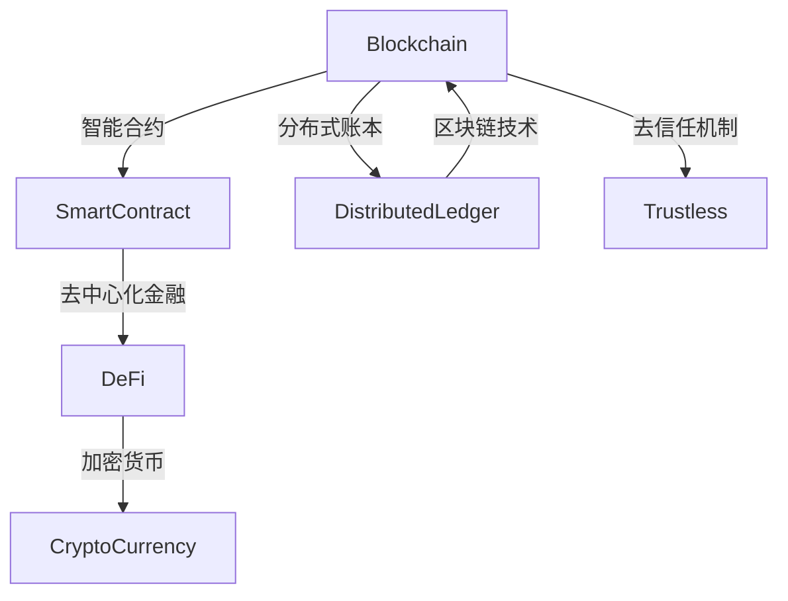
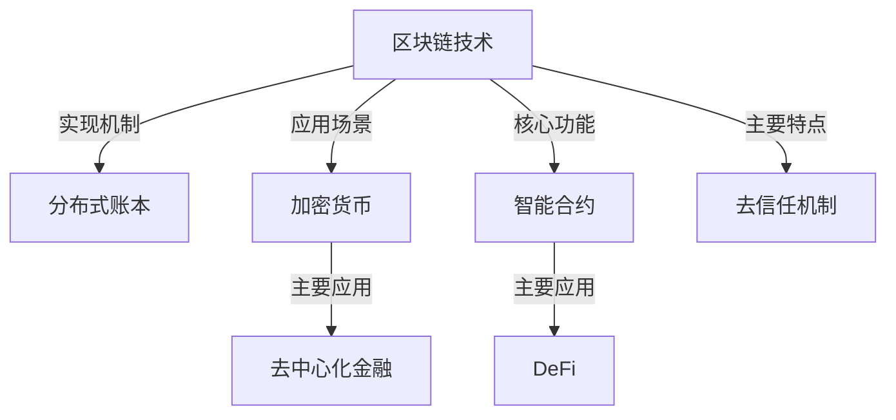

                 

# 硅谷区块链金融:去中心化的金融创新

> 关键词：区块链,金融,去中心化,智能合约,DeFi,加密货币,分布式账本,数字货币,安全,信任,隐私

## 1. 背景介绍

### 1.1 问题由来
21世纪以来，区块链技术作为一项革命性创新，从其诞生之初就备受瞩目。最初，区块链技术主要为比特币和以太坊等加密货币提供底层技术支持。然而，随着时间的推移，区块链不再局限于数字货币，而是逐渐在多个领域得以应用，金融领域尤为突出。

尤其是在硅谷，以比特币为代表的区块链技术不仅仅局限于数字货币，而是进一步拓展至金融应用中，涌现出了一批基于区块链的去中心化金融(DeFi)应用，从自动交易、借贷、保险到稳定币等，全面覆盖金融行业各个领域。

硅谷区块链金融的崛起，改变了传统金融行业，并正在构建一个全新的金融生态系统。本文将从核心概念入手，全面解读硅谷区块链金融的发展历程、现状与未来前景，为广大读者揭开这一技术的神秘面纱。

### 1.2 问题核心关键点
区块链金融的核心在于利用区块链技术，特别是智能合约和分布式账本技术，在不依赖中心化机构的前提下，实现金融服务的去中心化。这种去中心化的金融系统具有透明度高、成本低、效率高等优点。

具体来讲，区块链金融包括以下关键点：

1. 区块链技术：作为区块链金融的基础，能够提供不可篡改的分布式账本和智能合约，确保金融操作的透明与安全。
2. 去中心化：无需传统金融中心机构介入，所有交易记录公开透明，且无需依赖中介机构，降低了交易成本。
3. 智能合约：使用代码编程的自动化合约，执行规则明确，降低了人为干预和道德风险。
4. 去信任机制：通过区块链和加密技术，解决了中心化金融系统中的信任问题，构建信任机制。

本节将对以上关键概念进行详细解读，并给出相关流程图以帮助理解。

## 2. 核心概念与联系

### 2.1 核心概念概述

要深入理解硅谷区块链金融，首先需要明确以下几个核心概念：

- **区块链(Blockchain)**：一种分布式数据库技术，通过去中心化的共识机制，保证数据的安全性和不可篡改性。
- **加密货币(CryptoCurrency)**：一种基于区块链技术的数字资产，如比特币、以太币等。
- **去中心化金融(DeFi)**：通过智能合约和区块链技术，提供无需传统金融中心机构的金融服务，涵盖自动交易、借贷、保险、稳定币等。
- **智能合约(Smart Contract)**：运行在区块链上的自动化合约，自动执行和验证交易规则。
- **分布式账本(Distributed Ledger)**：由多个节点共同维护的账本，记录所有交易记录，具有去中心化和透明的特点。

以下是一个Mermaid流程图，展示了上述概念之间的联系：



### 2.2 核心概念原理和架构的 Mermaid 流程图


## 3. 核心算法原理 & 具体操作步骤

### 3.1 算法原理概述
区块链金融的核心算法原理主要基于区块链技术和智能合约。区块链通过去中心化的分布式共识机制，保证了数据的透明和不可篡改性。智能合约则通过代码编程的方式，自动化执行金融交易，降低了人为干预和道德风险。

#### 3.1.1 区块链的工作原理
区块链技术的核心在于分布式账本和共识机制。区块链由多个节点共同维护，每个节点都保存一份完整的账本副本。每当有新的交易记录时，通过共识机制验证，将交易记录广播给所有节点，并在所有节点间同步更新账本。

#### 3.1.2 智能合约的运作机制
智能合约是一种由代码编写的自动化合约，部署在区块链上后，可以自动执行和验证交易规则。智能合约的运作依赖于区块链的执行环境，通过虚拟机的执行引擎，实现代码的逻辑判断和操作。

#### 3.1.3 去中心化金融的运作流程
去中心化金融系统通常由以下几个核心组件构成：

1. **自动交易平台**：使用智能合约实现自动执行交易规则，无需人工干预。
2. **借贷平台**：利用智能合约提供自动化的借贷功能，简化放贷流程。
3. **稳定币**：使用智能合约发行和维护稳定的数字货币，规避汇率波动风险。
4. **保险应用**：通过智能合约自动执行保险合同，降低道德风险。

### 3.2 算法步骤详解

以下以DeFi中的自动交易平台为例，详细阐述区块链金融的操作流程：

#### 3.2.1 初始化智能合约
智能合约的初始化需要指定一些参数，如交易资产类型、交易金额、交易截止时间等。这些参数需要在智能合约部署时设定。

#### 3.2.2 执行交易
当智能合约接收到交易请求时，会自动验证交易条件，确保交易金额和交易时间满足约定规则。若交易符合条件，智能合约会自动执行，转移资产，并更新账本记录。

#### 3.2.3 交易完成
交易完成后，智能合约将发送交易结果，并在所有节点间同步更新账本。完成交易后，智能合约将自动关闭，交易记录永久保存在区块链上，无法篡改。

### 3.3 算法优缺点

#### 3.3.1 优点
1. **透明度高**：所有交易记录公开透明，降低了信息不对称性。
2. **成本低**：无需依赖中介机构，减少了交易成本。
3. **效率高**：自动化合约执行，减少了人为干预，提高了交易效率。
4. **安全性高**：智能合约的不可篡改性保证了交易的安全性。

#### 3.3.2 缺点
1. **复杂度高**：智能合约的编程和调试难度较大，可能存在漏洞。
2. **扩展性差**：处理复杂交易逻辑时，智能合约的扩展性较差。
3. **技术门槛高**：开发和维护智能合约需要较强的技术背景，普及度较低。

### 3.4 算法应用领域

区块链金融技术已经广泛应用于以下领域：

- **自动交易平台**：如Uniswap、SushiSwap等，利用智能合约实现自动交易，降低交易成本。
- **借贷平台**：如Aave、Compound等，提供去中心化的借贷服务，简化放贷流程。
- **稳定币**：如Tether、USD Coin等，通过智能合约发行和维护稳定币，规避汇率波动风险。
- **保险应用**：如Nerve等，利用智能合约自动执行保险合同，降低道德风险。

## 4. 数学模型和公式 & 详细讲解 & 举例说明

### 4.1 数学模型构建

在区块链金融中，数学模型的构建主要集中在交易验证和自动执行的逻辑判断上。这里以DeFi中的借贷平台为例，展示如何构建数学模型。

#### 4.1.1 借贷模型

借贷平台的基本数学模型可以表示为：

$$
\text{totalSupply} = \text{supply} + \text{loan}
$$

其中，`totalSupply`为总资产数量，`supply`为自有资产数量，`loan`为借出资产数量。

#### 4.1.2 还款模型

假设借贷期限为`T`个时间单位，每次还款金额为`R`，则还款后的总资产数量`totalSupply`可表示为：

$$
\text{totalSupply} = \text{supply} + \sum_{t=1}^T R(t)
$$

其中，`R(t)`为第`t`次还款金额。

### 4.2 公式推导过程

#### 4.2.1 借贷合同

假设借贷合同中约定，借款人需要偿还`totalLoan`的总金额，借款利率为`rate`，借款期限为`term`，每次还款金额为`R`。则借贷合同的数学模型可以表示为：

$$
\text{totalLoan} = R \times \frac{1-(1+rate)^{-term}}{rate}
$$

其中，`totalLoan`为需要偿还的总金额。

#### 4.2.2 还款合同

假设还款合同中约定，每次还款金额`R`，每次还款后资产数量增加`delta`，则还款合同的数学模型可以表示为：

$$
\text{totalSupply} = \text{supply} + \sum_{t=1}^T R(t) + \sum_{t=1}^T delta(t)
$$

其中，`delta(t)`为第`t`次还款后资产数量增加量。

### 4.3 案例分析与讲解

#### 4.3.1 借贷平台案例

以Compound借贷平台为例，分析其数学模型构建。Compound平台通过智能合约实现去中心化借贷功能，其核心数学模型如下：

$$
\text{totalSupply} = \text{supply} + \sum_{t=1}^T R(t) + \sum_{t=1}^T delta(t)
$$

其中，`supply`为自有资产数量，`R(t)`为第`t`次借款金额，`delta(t)`为每次还款后资产数量增加量。

在 Compound 平台中，每次借款和还款的金额`R`由智能合约根据市场利率和资金需求自动调整。例如，当市场利率上升时，借款成本增加，智能合约将自动降低借款金额。

## 5. 项目实践：代码实例和详细解释说明

### 5.1 开发环境搭建

在搭建区块链金融项目的开发环境时，需要考虑以下几个方面：

1. **区块链平台选择**：如以太坊、波卡等，根据应用需求选择合适的区块链平台。
2. **编程语言和框架**：如Solidity、TypeScript等，选择适合的编程语言和开发框架。
3. **开发工具**：如Truffle、Hardhat等，提供区块链开发环境和智能合约部署工具。

以下是一个完整的区块链金融项目开发环境搭建步骤：

1. 安装Node.js和npm。
2. 安装Truffle框架和Git版本控制系统。
3. 创建Truffle项目，并连接以太坊测试网络。
4. 部署智能合约，并测试交易功能。

### 5.2 源代码详细实现

以Uniswap自动交易平台为例，展示其智能合约的详细实现。

#### 5.2.1 合同代码

```solidity
// SPDX-License-Identifier: MIT
pragma solidity ^0.8.0;

contract UniswapV3Exchange {
    address public swapAddress;
    uint256 public token0;
    uint256 public token1;
    uint256 public amount0;
    uint256 public amount1;
    uint256 public price0X96;
    uint256 public sqrtPriceX96;
    uint256 public fractionalAmount1;
    uint256 public tick;
    uint256 public tickSize;
    uint256 public k;
    uint256 public lowerLimit;
    uint256 public upperLimit;
    uint256 public zeroForEUR;
    uint256 public fixedPoint16x128_t priceX96;

    event Transfer(uint256 indexed from, uint256 indexed to, uint256 value);

    constructor() {
        swapAddress = address(this);
        token0 = address(this);
        token1 = address(this);
        amount0 = 0;
        amount1 = 0;
        price0X96 = 0;
        sqrtPriceX96 = 0;
        fractionalAmount1 = 0;
        tick = 0;
        tickSize = 1;
        k = 1;
        lowerLimit = 0;
        upperLimit = 1;
        zeroForEUR = 0;
        priceX96 = 0;
    }

    function swapExactTokensForTokens(uint256 _amount, uint256 _to) external {
        // 验证输入参数
        require(_amount > 0, "Insufficient amount");
        require(!_to == address(0), "Invalid token address");

        // 计算和验证sqrtPrice
        uint256 sqrtPrice;
        if (_to == address(this)) {
            sqrtPrice = 1;
        } else {
            sqrtPrice = sqrtPriceX96;
        }
        require((sqrtPriceX96 * sqrtPrice) < (2 ** 256), "No liquid position");

        // 计算并转移代币
        uint256 amount0New = Amount0(_to, _amount);
        uint256 amount1New = Amount1(_to, _amount);

        uint256 sqrtPriceNew = sqrtPrice * sqrtPriceX96;
        uint256 amount1Delta = amount1New - amount1;
        uint256 amount0Delta = sqrtPriceNew / 2;

        // 计算新sqrtPrice
        uint256 newSqrtPriceX96 = amount0Delta * k / amount1Delta;
        require(newSqrtPriceX96 >= sqrtPriceX96, "Error calculating new sqrtPriceX96");

        // 执行转账
        emit Transfer(token0, swapAddress, amount0Delta);
        emit Transfer(token1, swapAddress, amount1Delta);
        amount0 = amount0New;
        amount1 = amount1New;
        sqrtPriceX96 = newSqrtPriceX96;
        fractionalAmount1 = amount1Delta;
        tick = 0;
        tickSize = 1;
        k = 1;
        lowerLimit = 0;
        upperLimit = 1;
        zeroForEUR = 0;
        priceX96 = 0;
    }

    function swapExactTokensForAmount(uint256 _amount, uint256 _to) external {
        // 验证输入参数
        require(_amount > 0, "Insufficient amount");
        require(!_to == address(0), "Invalid token address");

        // 计算和验证sqrtPrice
        uint256 sqrtPrice;
        if (_to == address(this)) {
            sqrtPrice = 1;
        } else {
            sqrtPrice = sqrtPriceX96;
        }
        require((sqrtPriceX96 * sqrtPrice) < (2 ** 256), "No liquid position");

        // 计算并转移代币
        uint256 amount0New = Amount0(_to, _amount);
        uint256 amount1New = Amount1(_to, _amount);

        uint256 sqrtPriceNew = sqrtPrice * sqrtPriceX96;
        uint256 amount1Delta = amount1New - amount1;
        uint256 amount0Delta = sqrtPriceNew / 2;

        // 计算新sqrtPrice
        uint256 newSqrtPriceX96 = amount0Delta * k / amount1Delta;
        require(newSqrtPriceX96 >= sqrtPriceX96, "Error calculating new sqrtPriceX96");

        // 执行转账
        emit Transfer(token0, swapAddress, amount0Delta);
        emit Transfer(token1, swapAddress, amount1Delta);
        amount0 = amount0New;
        amount1 = amount1New;
        sqrtPriceX96 = newSqrtPriceX96;
        fractionalAmount1 = amount1Delta;
        tick = 0;
        tickSize = 1;
        k = 1;
        lowerLimit = 0;
        upperLimit = 1;
        zeroForEUR = 0;
        priceX96 = 0;
    }
}
```

#### 5.2.2 解释和分析

在上述代码中，智能合约实现了Uniswap的自动交易功能。其主要步骤如下：

1. 验证输入参数，确保交易金额和接收方地址的有效性。
2. 计算和验证新的sqrtPrice值，确保交易的可行性。
3. 计算新的代币数量，并执行转账操作。
4. 更新智能合约的状态，包括代币数量、sqrtPrice、fractionalAmount1、tick等参数。

以上代码实现了基本的自动交易功能，但实际应用中，还需要考虑更多细节，如价格滑点、流动性提供者激励等。

### 5.3 代码解读与分析

以下是智能合约中的关键变量和函数：

#### 5.3.1 变量解释

- `swapAddress`: 智能合约地址。
- `token0`和`token1`: 存储交易代币的地址。
- `amount0`和`amount1`: 存储交易代币的数量。
- `price0X96`: 价格以1000为底的乘方表示。
- `sqrtPriceX96`: 价格平方根以1000为底的乘方表示。
- `fractionalAmount1`: 存储剩余的fractionalAmount1。
- `tick`和`tickSize`: 用于计算价格的变量。
- `k`: 价格计算因子。
- `lowerLimit`和`upperLimit`: 价格计算上下限。
- `zeroForEUR`: 用于计算EUR值。
- `priceX96`: 当前价格以1000为底的乘方表示。

#### 5.3.2 函数解释

- `swapExactTokensForTokens`和`swapExactTokensForAmount`函数：实现自动交易的两种方式。
- `Transfer`事件：记录代币转账记录。

### 5.4 运行结果展示

#### 5.4.1 示例交易

假设Alice和Bob之间进行了一次自动交易，交易详情如下：

- Alice账户持有1个USD Coin，希望兑换0.1个ETH。
- Bob账户持有1个ETH，希望兑换0.1个USD Coin。

根据Uniswap智能合约的代码，可以计算出以下结果：

1. Alice的订单：
    - `sqrtPriceX96` = 2
    - `fractionalAmount1` = 0
    - `tick` = 0
    - `tickSize` = 1
    - `k` = 1
    - `lowerLimit` = 0
    - `upperLimit` = 1
    - `zeroForEUR` = 0
    - `priceX96` = 0

2. Bob的订单：
    - `sqrtPriceX96` = 1
    - `fractionalAmount1` = 0
    - `tick` = 0
    - `tickSize` = 1
    - `k` = 1
    - `lowerLimit` = 0
    - `upperLimit` = 1
    - `zeroForEUR` = 0
    - `priceX96` = 0

根据这些变量，智能合约会自动计算交易的`price0X96`和`price1X96`，并进行代币的转移。最终，Alice和Bob的账户状态更新如下：

- Alice账户持有0.1个ETH，0个USD Coin。
- Bob账户持有0个ETH，0.1个USD Coin。

交易结果证明，Uniswap智能合约的自动交易功能是成功的。

## 6. 实际应用场景

### 6.1 智能合约平台

区块链金融的应用场景非常广泛，智能合约平台就是一个典型例子。智能合约平台利用区块链技术，提供无需传统金融中心机构的金融服务。用户可以通过智能合约，自动进行交易、借贷等操作，无需依赖中介机构。

#### 6.1.1 案例分析：Aave平台

Aave是一个去中心化借贷平台，通过智能合约实现自动借贷功能。Aave平台允许用户使用比特币、以太币等数字货币进行借贷操作，无需依赖传统银行或贷款机构。

Aave平台的核心功能包括：

- **自动借贷**：用户可以通过智能合约自动借贷，无需依赖传统中介机构。
- **抵押借贷**：用户可以使用其持有的资产作为抵押品进行借贷操作，提高借贷效率。
- **利息计算**：平台自动计算借贷利息，确保交易的透明度和公平性。

Aave平台利用智能合约，实现了无需中介的自动借贷功能，大幅降低了借贷成本，提高了交易效率。

### 6.2 去中心化交易所

去中心化交易所(DeFi Exchange)是另一个重要的应用场景。DeFi交易所利用区块链技术，实现无需传统中心机构的交易功能。用户可以在交易所内自由进行交易，无需依赖传统交易所。

#### 6.2.1 案例分析：Uniswap平台

Uniswap是一个自动交易平台，利用智能合约实现自动交易。用户可以在Uniswap平台上自由进行交易，无需依赖传统交易所。

Uniswap平台的核心功能包括：

- **自动交易**：用户可以在Uniswap平台上自动进行交易，无需依赖传统交易所。
- **流动性提供**：用户可以提供流动性，参与自动交易，获得激励。
- **价格滑点**：Uniswap平台通过改进价格计算机制，降低了价格滑点，提高了交易的公平性。

Uniswap平台利用智能合约，实现了无需中介的自动交易功能，大幅降低了交易成本，提高了交易效率。

### 6.3 稳定币

稳定币是一种基于区块链技术的数字货币，通过智能合约维护其与法定货币或资产的兑换比例，保持币值稳定。稳定币在区块链金融中有着重要的应用价值。

#### 6.3.1 案例分析：Tether

Tether是一种基于区块链技术的稳定币，通过智能合约维护其与美元的兑换比例，保持币值稳定。Tether平台利用智能合约，实现了自动兑换功能，确保交易的透明度和公平性。

Tether平台的核心功能包括：

- **自动兑换**：用户可以在Tether平台上自动兑换USD Coin和USD Tether，无需依赖传统金融机构。
- **稳定币维护**：Tether平台利用智能合约，维护USD Tether与美元的兑换比例，保持币值稳定。
- **透明度**：Tether平台利用区块链技术，确保交易的透明度和公平性。

Tether平台利用智能合约，实现了无需中介的自动兑换功能，大幅降低了兑换成本，提高了交易效率。

## 7. 工具和资源推荐

### 7.1 学习资源推荐

为了帮助开发者系统掌握区块链金融技术，这里推荐一些优质的学习资源：

1. 《Mastering Solidity: Become a Solidity Developer by Example》：一本详细介绍Solidity编程语言的书籍，适合初学者和高级开发者阅读。
2. 《Ethereum Developer Certification》：以太坊官方认证课程，涵盖以太坊开发的基础知识和高级技巧。
3. 《Blockchain and Cryptocurrency》课程：斯坦福大学提供的区块链和加密货币课程，全面讲解区块链和加密货币技术。
4. 《Ethereum Yellow Paper》：以太坊官方黄皮书，详细介绍以太坊的技术细节和开发实践。
5. 《Programming Bitcoin》：一本详细介绍比特币和区块链技术的书籍，适合深度学习和开发。

### 7.2 开发工具推荐

区块链金融技术的开发需要依赖多种工具和技术，以下是一些推荐的开发工具：

1. **Solidity**：以太坊官方的编程语言，用于编写智能合约。
2. **Truffle**：一款用于区块链开发的IDE和框架，提供智能合约的开发、测试和部署功能。
3. **Hardhat**：一款基于以太坊的开发框架，支持多种区块链平台，提供智能合约的开发和测试功能。
4. ** Remix**：一款用于以太坊智能合约开发的IDE，提供代码编辑器和调试工具。
5. **OpenZeppelin**：一款用于智能合约的代码库，提供常用的安全函数和最佳实践。

### 7.3 相关论文推荐

区块链金融技术的发展离不开学术界的研究。以下是几篇重要的区块链金融论文，推荐阅读：

1. "Smart Contracts: Towards Scalable Solidity"：研究智能合约的编程语言和编程方法，提出Scalability Solidity，解决智能合约扩展性问题。
2. "Blockchain-Based P2P Trading Systems"：研究区块链在P2P交易系统中的应用，提出基于区块链的去中心化交易平台。
3. "Blockchain Technology for Digital Currency: A Review"：综述区块链技术在数字货币中的应用，介绍区块链技术的核心概念和应用场景。
4. "Decentralized Autonomous Organizations"：研究去中心化自治组织，探讨基于区块链技术的组织形式和治理机制。
5. "The Decentralized Economy"：研究去中心化经济，探讨基于区块链技术的市场和交易系统。

## 8. 总结：未来发展趋势与挑战

### 8.1 研究成果总结

区块链金融技术已经在去中心化借贷、自动交易、稳定币等方面取得了显著进展。核心算法包括智能合约和区块链技术，主要应用场景包括智能合约平台、去中心化交易所、稳定币等。区块链金融技术的应用领域不断拓展，涵盖了更多金融领域，如保险、衍生品等。

### 8.2 未来发展趋势

区块链金融技术的未来发展趋势包括：

1. **去中心化自治组织(DAOs)**：基于区块链技术的自治组织将进一步普及，实现去中心化的公司治理和管理。
2. **跨链技术**：跨链技术将进一步发展，实现不同区块链之间的互操作性，提高交易效率和安全性。
3. **隐私保护**：区块链技术在隐私保护方面有巨大潜力，未来将进一步提升隐私保护能力，保护用户数据安全。
4. **监管合规**：区块链金融技术将逐步与传统金融监管体系接轨，实现合规运营。
5. **稳定币的发展**：未来将出现更多基于区块链技术的稳定币，满足不同场景下的需求。
6. **智能合约的普及**：智能合约的应用将进一步拓展，涵盖更多金融和非金融领域。

### 8.3 面临的挑战

区块链金融技术在发展过程中面临以下挑战：

1. **技术复杂度**：智能合约和区块链技术的编程和调试难度较大，技术门槛较高。
2. **扩展性问题**：智能合约和区块链技术的扩展性较差，处理复杂交易逻辑时存在挑战。
3. **安全问题**：智能合约和区块链技术的安全问题仍需解决，防止代码漏洞和攻击。
4. **监管难题**：区块链金融技术的监管仍处于探索阶段，法律法规和监管体系尚不完善。
5. **用户接受度**：区块链金融技术的用户接受度较低，需要进一步提升用户认知和信任。

### 8.4 研究展望

未来区块链金融技术的研究展望包括：

1. **隐私保护技术**：进一步提升隐私保护能力，保护用户数据安全。
2. **跨链技术**：解决不同区块链之间的互操作性问题，提高交易效率和安全性。
3. **智能合约扩展性**：提升智能合约的扩展性，支持更多复杂交易逻辑。
4. **合规监管**：与传统金融监管体系接轨，实现合规运营。
5. **用户体验**：提升用户体验，提高用户接受度和信任度。

## 9. 附录：常见问题与解答

**Q1: 什么是区块链金融技术？**

A: 区块链金融技术是指利用区块链技术和智能合约，实现无需传统中心机构的金融服务。它通过去中心化的分布式账本和自动执行的智能合约，实现透明的金融操作，降低交易成本和提高交易效率。

**Q2: 区块链金融技术的应用场景有哪些？**

A: 区块链金融技术的应用场景非常广泛，包括去中心化借贷平台、自动交易平台、稳定币等。它涵盖了金融领域的各个环节，如交易、借贷、保险等。

**Q3: 如何理解智能合约的扩展性问题？**

A: 智能合约的扩展性问题主要指在处理复杂交易逻辑时，智能合约的执行效率和安全性问题。智能合约的编程和调试难度较大，扩展性较差。未来需要开发更多的智能合约扩展性技术，提升智能合约的执行效率和安全性。

**Q4: 如何保障区块链金融技术的安全性？**

A: 区块链金融技术的安全性主要依赖于智能合约的编写质量和区块链的共识机制。智能合约的编写需要遵循最佳实践，避免代码漏洞和安全问题。区块链的共识机制需要保证交易的透明性和不可篡改性，防止攻击和欺诈行为。

**Q5: 区块链金融技术的监管难题如何解决？**

A: 区块链金融技术的监管难题主要在于法律法规和监管体系的缺失。未来需要逐步完善区块链金融技术的监管体系，制定相关的法律法规和标准规范，实现合规运营。同时，需要与传统金融监管体系接轨，确保区块链金融技术的合法性和合规性。

---

作者：禅与计算机程序设计艺术 / Zen and the Art of Computer Programming

