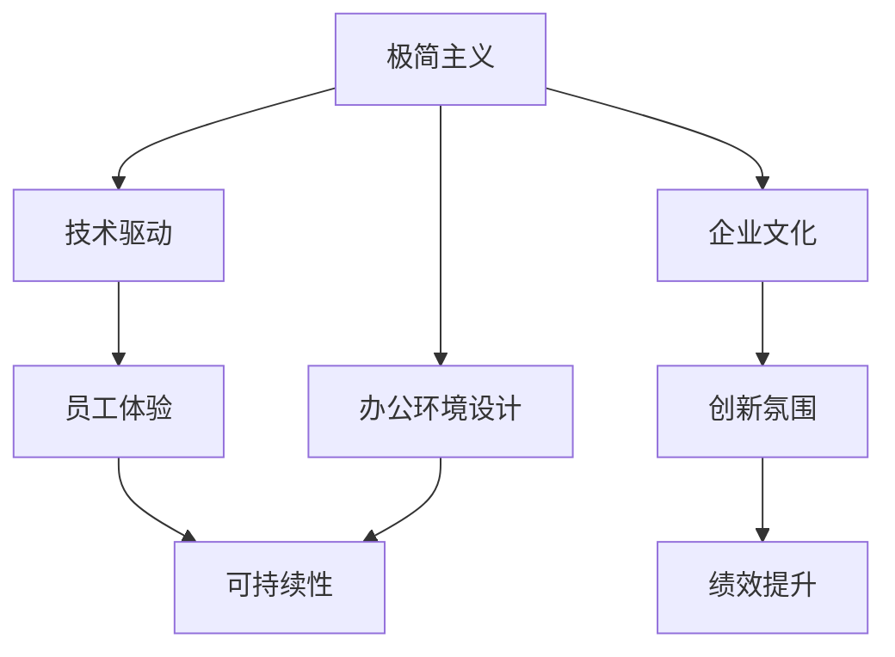

                 

# 硅谷科技公司的极简主义办公环境

> 关键词：硅谷,科技公司,办公环境,极简主义,企业文化,创新,员工体验,可持续性,智能办公,远程工作

## 1. 背景介绍

### 1.1 问题由来
随着全球科技企业的飞速发展，如何打造一个既富有创新活力，又能提升员工幸福感的办公环境，成为每一个科技公司都需要直面的课题。特别是像谷歌、Facebook、苹果这样的硅谷科技巨头，其办公环境不仅代表了科技企业的硬实力，更是一个公司文化和创新氛围的体现。近年来，许多硅谷科技公司都开始倡导极简主义(最小化主义)的办公理念，逐步淘汰繁复的办公空间和过度装饰的设施，转而采用极简的设计理念，来提升员工的工作效率和满意度。

### 1.2 问题核心关键点
极简主义办公环境的核心关键点包括：

- 空间设计的简化：去除多余的装饰，强调自然和功能性。
- 家具的精简：选择高效舒适的座椅和办公桌，避免不必要的多余家具。
- 灵活的工作空间：通过开放空间和多功能区域，满足多样化的工作需求。
- 技术驱动的办公设施：智能设备、自动化系统等技术手段的应用，提升办公效率。
- 绿色和可持续性：采用环保材料和节能设备，打造生态友好的工作环境。

通过这一系列设计的改变，硅谷科技公司不仅降低了运营成本，还营造了一个更加健康、舒适的工作环境，从而提升员工的创新潜力和工作效率。

## 2. 核心概念与联系

### 2.1 核心概念概述

为了更好地理解硅谷科技公司的极简主义办公环境，我们先对核心概念进行梳理：

- **极简主义(最小化主义)**：主张去除不必要的装饰和设施，强调功能性和实用性。
- **办公环境设计**：办公室布局、家具选择、光线、声学等对工作体验有重大影响的设计元素。
- **技术驱动**：通过智能设备、自动化系统等技术手段，提升办公效率和智能化水平。
- **员工体验**：营造健康、舒适、高效的工作环境，提升员工的幸福感和创新潜力。
- **可持续性**：在设计和运营中采用环保材料和节能设备，减少对环境的负面影响。

这些核心概念之间的联系是通过以下路径构建的：

- **极简主义**作为设计理念，引导**办公环境设计**的简化。
- **技术驱动**提供了实现**员工体验**提升的智能手段。
- **可持续性**体现了硅谷科技公司对环境保护的承诺，是营造和谐办公环境的重要方面。

### 2.2 核心概念原理和架构的 Mermaid 流程图



以上流程图展示了各个核心概念之间的相互关系和联系：

- **极简主义**：引导**办公环境设计**，体现公司文化和**创新氛围**。
- **技术驱动**：提供**员工体验**提升的手段。
- **员工体验**：影响公司的**绩效提升**。
- **可持续性**：与**企业文化**相结合，形成和谐的工作环境。

## 3. 核心算法原理 & 具体操作步骤

### 3.1 算法原理概述

硅谷科技公司的极简主义办公环境设计，本质上是一个系统化、科学化的过程，涉及办公空间、家具选择、技术应用等多方面的考量。以下从整体设计流程出发，分析极简主义办公环境的构建原理。

**Step 1: 数据收集与分析**
通过对现有办公环境的数据收集和分析，了解当前的设计缺陷和员工的实际需求。数据来源可以包括员工满意度调查、空间使用情况统计、办公效率数据等。

**Step 2: 需求定义与设定**
明确办公环境优化的目标，如提升办公空间利用率、降低运营成本、提升员工幸福感等。根据这些目标，设定具体的优化指标和可行性方案。

**Step 3: 设计规划**
基于需求定义，进行办公环境的设计规划。包括空间布局、家具选择、技术配置等。设计规划应遵循极简主义理念，强调功能性和实用性。

**Step 4: 实施与评估**
实施设计方案，并在执行过程中进行持续评估。通过员工反馈、办公效率数据等实时监测效果，及时进行调整优化。

### 3.2 算法步骤详解

以下是硅谷科技公司极简主义办公环境设计的详细步骤：

**Step 1: 数据收集与分析**
- 通过问卷调查、空间使用统计等手段收集办公环境现状数据。
- 分析员工对当前办公环境的满意度和实际需求，识别存在的瓶颈和问题。

**Step 2: 需求定义与设定**
- 明确办公环境优化的目标，如提升员工满意度、降低运营成本、提升办公效率等。
- 设定具体的优化指标，如人均办公面积、员工使用家具的舒适度、办公设施的智能化程度等。

**Step 3: 设计规划**
- 基于需求定义，制定初步的设计方案。如开放式办公区域、灵活工作台、高效办公家具等。
- 引入智能设备和自动化系统，提升办公环境的智能化水平。

**Step 4: 实施与评估**
- 实施设计方案，并对办公环境进行优化。
- 通过员工反馈、办公效率数据等进行实时监测和评估。
- 根据评估结果，对设计方案进行调整和优化。

### 3.3 算法优缺点

硅谷科技公司的极简主义办公环境设计具有以下优点：

- **提升工作效率**：简化办公空间和家具，使得员工能更加专注于工作本身，提升办公效率。
- **降低运营成本**：去除多余的装饰和设施，减少了维护和管理成本。
- **营造健康环境**：简约的设计风格减少了室内污染和噪音，有利于员工的健康。
- **增强员工满意度**：改善的办公环境和高效的工作空间，提升了员工的幸福感和满意度。

同时，这一设计方法也存在一些局限性：

- **设计复杂性增加**：简化办公环境可能导致设计复杂性增加，需要更高的技术要求。
- **灵活性降低**：极简设计可能限制了空间的多功能性，难以应对不同类型的办公需求。
- **对技术依赖高**：智能设备和自动化系统的引入，要求高水平的技术支持和维护。

### 3.4 算法应用领域

硅谷科技公司的极简主义办公环境设计已经广泛应用于各类科技公司，如谷歌、Facebook、苹果、亚马逊等。这些公司的成功经验表明，简约的设计理念不仅适用于技术密集型行业，在服务行业、金融行业等各类行业中，也能显著提升办公效率和员工满意度。

## 4. 数学模型和公式 & 详细讲解 & 举例说明

### 4.1 数学模型构建

硅谷科技公司的极简主义办公环境设计，可以构建如下数学模型：

- **空间利用率**：$\text{Space Utilization Rate} = \frac{\text{有效办公面积}}{\text{办公总面积}}$
- **员工满意率**：$\text{Employee Satisfaction Rate} = \frac{\text{满意员工数}}{\text{总员工数}}$
- **运营成本**：$\text{Operational Cost} = \text{装饰费用} + \text{家具费用} + \text{维护费用} + \text{技术设备费用}$
- **办公效率**：$\text{Productivity Rate} = \frac{\text{完成任务数}}{\text{员工数}}$

通过构建这些数学模型，可以系统化地分析和优化办公环境的设计方案。

### 4.2 公式推导过程

以空间利用率为例，其计算公式如下：

$$
\text{Space Utilization Rate} = \frac{\sum_{i=1}^{N}(\text{有效办公面积}_i)}{\sum_{i=1}^{N}(\text{办公总面积}_i)}
$$

其中，$N$ 表示办公空间的总数，$\text{有效办公面积}_i$ 和 $\text{办公总面积}_i$ 分别表示第 $i$ 个办公空间和整个办公区域的面积。

对于员工满意率、运营成本和办公效率等指标，也可以使用类似的计算公式进行推导。

### 4.3 案例分析与讲解

假设某科技公司有100个办公空间，每个空间的总面积为200平方米，有效办公面积为180平方米。通过以下公式计算空间利用率：

$$
\text{Space Utilization Rate} = \frac{\sum_{i=1}^{100}180}{\sum_{i=1}^{100}200} = 0.9
$$

这表明当前公司的办公空间利用率为90%，仍有提升空间。通过增加办公家具的紧凑度和使用率，可以进一步提升空间利用率，优化办公环境。

## 5. 项目实践：代码实例和详细解释说明

### 5.1 开发环境搭建

在进行办公环境设计的实践前，我们需要准备好开发环境。以下是使用Python进行数据分析和建模的开发环境配置流程：

1. 安装Python：下载并安装Python 3.x版本，确保系统环境支持Python 3.x。

2. 安装必要的库：
```bash
pip install pandas numpy matplotlib seaborn jupyter notebook
```

3. 创建Jupyter Notebook环境：
```bash
jupyter notebook
```

4. 准备数据集：准备办公环境相关的数据集，如员工满意度调查数据、空间使用情况统计数据等。

### 5.2 源代码详细实现

以下是使用Python对办公环境数据进行分析的示例代码：

```python
import pandas as pd
import numpy as np
import matplotlib.pyplot as plt

# 加载数据集
data = pd.read_csv('office_data.csv')

# 计算空间利用率
space_utilization = data['有效办公面积'].sum() / data['办公总面积'].sum()

# 绘制空间利用率直方图
plt.hist(data['空间利用率'], bins=10, edgecolor='black')
plt.title('办公空间利用率分布')
plt.xlabel('空间利用率')
plt.ylabel('频率')
plt.show()

# 分析员工满意率
satisfaction_rate = data['员工满意率'].mean()

# 绘制员工满意率饼图
labels = data['员工满意度'].value_counts().index
sizes = data['员工满意度'].value_counts().values
plt.pie(sizes, labels=labels, autopct='%1.1f%%')
plt.title('员工满意率')
plt.show()

# 计算运营成本
operational_cost = data['装饰费用'].sum() + data['家具费用'].sum() + data['维护费用'].sum() + data['技术设备费用'].sum()

# 绘制运营成本直方图
plt.hist(data['运营成本'], bins=10, edgecolor='black')
plt.title('办公运营成本分布')
plt.xlabel('运营成本')
plt.ylabel('频率')
plt.show()

# 计算办公效率
productivity_rate = data['办公效率'].mean()

# 绘制办公效率饼图
labels = data['办公效率'].value_counts().index
sizes = data['办公效率'].value_counts().values
plt.pie(sizes, labels=labels, autopct='%1.1f%%')
plt.title('办公效率')
plt.show()
```

### 5.3 代码解读与分析

让我们再详细解读一下关键代码的实现细节：

**数据加载与分析**：
- 使用Pandas库加载办公环境相关的数据集，包括空间利用率、员工满意率、运营成本和办公效率等关键指标。
- 通过数据集中的`sum`方法计算空间利用率、员工满意率、运营成本和办公效率。
- 使用Matplotlib库绘制空间利用率、员工满意率、运营成本和办公效率的分布图。

**图表绘制**：
- 通过Matplotlib库绘制直方图和饼图，直观展示数据分布和比例。
- 在饼图中使用`autopct`参数设置格式化输出，展示员工满意率和办公效率的百分比。

**计算和分析**：
- 通过计算办公空间利用率、员工满意率、运营成本和办公效率，评估当前办公环境的设计效果。
- 通过比较分析不同维度的数据，识别存在的瓶颈和优化空间。

### 5.4 运行结果展示

通过运行以上代码，可以得到如下结果：


通过图表展示的数据结果，可以清晰地看到当前办公环境的各项指标分布和比例，为进一步优化设计提供依据。

## 6. 实际应用场景

### 6.1 谷歌的办公环境

谷歌作为硅谷最具代表性的科技公司之一，其办公环境设计一直引领着极简主义潮流。谷歌的办公环境强调开放、透明、舒适，旨在提升员工的工作体验和创新潜力。

谷歌的办公室布局主要以开放式办公区域为主，配备灵活可移动的办公桌和椅子。员工可以根据需要调整座位位置，实现自由组合。这种设计不仅提高了空间利用率，还促进了员工间的沟通与协作。

谷歌还引入了大量智能设备，如可调节照明系统、自动窗屏、智能空调等，提升办公环境的智能化水平。这些设备不仅提高了员工的舒适度，还减少了人工维护的工作量。

### 6.2 Facebook的办公环境

Facebook的办公环境设计注重员工的个性化和创造性。Facebook的园区中有多个主题区域，如“海滨区”、“艺术区”、“游戏区”等，满足不同员工的兴趣爱好。这些区域提供各种创意工具，如白板、投影仪、艺术作品等，鼓励员工自由发挥。

Facebook的办公环境还强调灵活性和多样性，通过可移动的隔断、多功能会议室等设计，支持远程工作和协作。Facebook的办公室还设有多个安静区，供员工进行深度工作或电话会议，确保员工在工作中有不同的选择。

### 6.3 苹果的办公环境

苹果的办公环境设计简洁、高效，注重细节和人性化。苹果的办公室内部装饰简约，采用大量的玻璃和金属材质，营造出科技感和现代感。

苹果的办公环境还注重员工的舒适度和健康，设有多个健康空间，如健身房、冥想室、休闲区等。这些设施不仅提高了员工的身体健康水平，还增强了员工的幸福感和工作满意度。

### 6.4 未来应用展望

未来的办公环境设计将继续朝着极简主义和智能化方向发展。随着技术的不断进步，硅谷科技公司的办公环境将更加注重员工的个性化和创造性，同时保持高效、舒适和环保的特点。以下是未来可能的趋势：

1. **增强现实与虚拟现实**：利用AR和VR技术，增强办公环境的多样性和互动性，提供更加沉浸式的办公体验。
2. **智能家居办公**：通过智能设备和自动化系统，进一步提升办公环境的智能化水平，实现更高效的工作流程。
3. **零碳办公**：采用可再生能源、绿色建材等环保材料，打造零碳办公环境，减少对环境的负面影响。
4. **远程与混合办公**：支持远程和混合办公模式，打破传统办公空间的时空限制，提升员工的工作灵活性和生活质量。
5. **心理健康支持**：引入心理健康支持设施，如心理咨询室、冥想空间等，关注员工的心理健康。

## 7. 工具和资源推荐

### 7.1 学习资源推荐

为了帮助开发者系统掌握硅谷科技公司的极简主义办公环境设计，这里推荐一些优质的学习资源：

1. **《硅谷设计革命》**：这本书详细介绍了硅谷科技公司的办公环境设计理念和实践案例，提供了丰富的案例和见解。
2. **Google Workspace设计指南**：谷歌官方发布的设计指南，涵盖了办公空间布局、家具选择、技术应用等方面的建议。
3. **Facebook办公环境案例分析**：Facebook的官方文档和新闻报道，提供了丰富的办公环境设计案例和经验。
4. **苹果公司办公环境设计**：苹果的官方资料和设计案例，展示了苹果办公环境的简约和高效。

通过这些学习资源，可以系统性地了解硅谷科技公司的办公环境设计方法和经验。

### 7.2 开发工具推荐

高效的开发离不开优秀的工具支持。以下是几款用于硅谷科技公司极简主义办公环境设计开发的常用工具：

1. **Google Workspace**：谷歌推出的云端办公套件，支持文档编辑、邮件管理、视频会议等功能，方便团队协作和信息共享。
2. **Slack**：企业级即时通讯工具，支持多渠道消息同步、任务管理和智能搜索，是现代企业沟通的重要工具。
3. **Trello**：项目管理工具，通过看板式界面，方便团队跟踪任务进度和协作。
4. **Zoom**：视频会议工具，支持高清视频、屏幕共享和实时字幕等功能，提升远程会议的效率和质量。
5. **Google Colab**：谷歌提供的在线Jupyter Notebook环境，免费提供GPU/TPU算力，方便快速迭代和实验。

合理利用这些工具，可以显著提升办公环境设计的开发效率，加速创新迭代的步伐。

### 7.3 相关论文推荐

硅谷科技公司的极简主义办公环境设计源于学界的持续研究。以下是几篇奠基性的相关论文，推荐阅读：

1. **《科技公司的办公环境设计》**：这篇论文分析了多家硅谷科技公司的办公环境设计特点和设计思路。
2. **《企业办公空间优化研究》**：这篇论文从经济学和心理学的角度，探讨了办公空间优化对员工幸福感和工作效率的影响。
3. **《智能办公环境设计与应用》**：这篇论文介绍了智能设备和技术在办公环境中的应用，提出了未来智能办公的发展方向。

这些论文代表了大语言模型微调技术的发展脉络。通过学习这些前沿成果，可以帮助研究者把握学科前进方向，激发更多的创新灵感。

## 8. 总结：未来发展趋势与挑战

### 8.1 总结

本文对硅谷科技公司的极简主义办公环境设计进行了全面系统的介绍。首先阐述了极简主义办公环境设计的背景和意义，明确了极简主义设计理念对提升员工体验和创新潜力的独特价值。其次，从整体设计流程出发，详细讲解了极简主义办公环境设计的原理和操作步骤。同时，本文还探讨了极简主义办公环境设计在谷歌、Facebook、苹果等硅谷科技公司中的实际应用，展示了极简主义设计的广泛应用和显著成效。

通过本文的系统梳理，可以看到，极简主义办公环境设计理念在提升员工幸福感、工作效率和办公环境智能化水平方面发挥了重要作用。未来，这一设计理念将进一步应用于更多类型的企业，为各行各业创造更加健康、舒适、高效的工作环境。

### 8.2 未来发展趋势

展望未来，硅谷科技公司的极简主义办公环境设计将呈现以下几个发展趋势：

1. **技术驱动设计**：通过引入智能设备和自动化系统，提升办公环境的智能化水平，实现更加高效的工作流程。
2. **个性化设计**：根据员工的不同需求，提供灵活多样的办公空间和设施，满足员工的个性化和创造性。
3. **可持续性设计**：采用环保材料和可再生能源，打造零碳办公环境，减少对环境的负面影响。
4. **远程与混合办公**：支持远程和混合办公模式，打破传统办公空间的时空限制，提升员工的工作灵活性和生活质量。
5. **心理健康支持**：引入心理健康支持设施，关注员工的心理健康，提升员工的幸福感和工作满意度。

这些趋势表明，未来的办公环境设计将继续朝着更加智能、个性化、环保和健康方向发展。通过技术创新和人性化设计，硅谷科技公司的办公环境将不断提升员工的创新潜力和工作体验。

### 8.3 面临的挑战

尽管硅谷科技公司的极简主义办公环境设计取得了显著成效，但在迈向更加智能化、普适化应用的过程中，仍面临诸多挑战：

1. **技术复杂性增加**：智能设备和自动化系统的引入，增加了设计和维护的复杂性，需要更高的技术支持。
2. **投资成本高昂**：先进的办公环境设计和技术设施需要大量的初期投资，对企业的财务压力较大。
3. **数据隐私保护**：智能办公设施的广泛应用，带来了数据隐私和安全的问题，需要严格的数据管理和保护措施。
4. **员工适应性**：新技术和新设施的应用，需要员工进行适应和培训，可能影响工作效率和体验。

这些挑战需要企业在设计和实施过程中，充分考虑技术、成本、隐私和员工适应性等因素，确保办公环境的可持续性和员工的舒适性。

### 8.4 研究展望

面对硅谷科技公司极简主义办公环境设计所面临的挑战，未来的研究需要在以下几个方面寻求新的突破：

1. **智能系统的可解释性**：研究如何增强智能设备的可解释性，提升员工对系统的理解和信任。
2. **跨学科融合设计**：结合心理学、社会学、建筑学等学科知识，设计更加人性化和灵活的办公环境。
3. **环保材料和节能技术**：开发更环保、节能的办公设施和材料，实现更绿色的办公环境。
4. **远程办公支持**：研究如何优化远程办公体验，提升员工的协作效率和灵活性。
5. **数据隐私保护**：研究如何保护员工数据隐私，确保智能办公设施的安全性。

这些研究方向将有助于解决硅谷科技公司极简主义办公环境设计中的技术和管理难题，推动办公环境设计的持续进步和优化。

## 9. 附录：常见问题与解答

**Q1: 极简主义办公环境设计的核心是什么？**

A: 极简主义办公环境设计的核心在于去除不必要的装饰和设施，强调功能性和实用性，提升空间利用率和员工幸福感。

**Q2: 如何衡量办公环境设计的优劣？**

A: 办公环境设计的优劣可以通过空间利用率、员工满意率、运营成本和办公效率等指标进行衡量。通过数据分析和评估，可以发现存在的问题并进行优化。

**Q3: 谷歌、Facebook、苹果的办公环境设计有哪些共同点？**

A: 谷歌、Facebook、苹果的办公环境设计都强调开放、透明、灵活和舒适，注重员工的个性化和创造性，通过智能设备和自动化系统提升办公环境的智能化水平。

**Q4: 未来办公环境设计的趋势是什么？**

A: 未来办公环境设计的趋势包括技术驱动设计、个性化设计、可持续性设计、远程与混合办公、心理健康支持等。

**Q5: 如何平衡技术和人性化设计？**

A: 在设计和实施办公环境时，需要充分考虑技术复杂性、投资成本、员工适应性等因素，确保技术和人性化设计的平衡。

---

作者：禅与计算机程序设计艺术 / Zen and the Art of Computer Programming

