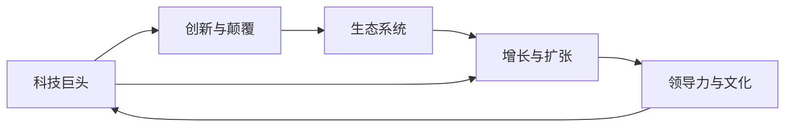

                 

# 硅谷科技巨头的兴衰:从HP到谷歌

## 1. 背景介绍

硅谷作为全球科技创新的中心，见证了无数科技巨头的崛起与衰落。在这片神奇的土地上，一家家科技公司如同流星划过天空，昙花一现后便消失在历史的烟云中。本文将深入剖析硅谷科技巨头的兴衰历程，从HP到谷歌，见证一代又一代科技公司的荣光与落寞。

## 2. 核心概念与联系

### 2.1 核心概念概述

为了理解硅谷科技巨头的兴衰，我们需要先了解几个关键概念：

- **科技巨头(Tech Giants)**：指的是在科技领域具有强大市场影响力、创新能力和品牌号召力的公司，如惠普(HP)、谷歌(Google)等。
- **创新与颠覆(Disruption)**：科技公司通过技术创新实现对传统行业的颠覆，如互联网对传统媒体的冲击。
- **生态系统(Ecosystem)**：科技公司构建的生态系统包括硬件、软件、应用、服务等，形成一个完整的产品和服务体系。
- **增长与扩张(Scaling)**：科技公司从初创到成为行业巨头的过程，涉及产品迭代、市场扩张、全球化布局等。
- **领导力与文化(Culture & Leadership)**：科技公司的领导层如何塑造企业文化，影响公司战略和执行。

这些概念相互关联，共同构成了科技公司兴衰的复杂生态系统。

### 2.2 核心概念原理和架构的 Mermaid 流程图



此图展示了科技巨头从创新到生态系统建设，再到增长和领导力的循环过程。

## 3. 核心算法原理 & 具体操作步骤

### 3.1 算法原理概述

硅谷科技巨头的兴衰背后，反映了一整套复杂的算法原理。科技公司通过不断的创新和颠覆，形成自己独特的生态系统，并不断进行增长与扩张。领导层的决策和企业文化塑造了公司的战略和执行。这些要素相互作用，共同推动公司的发展。

### 3.2 算法步骤详解

1. **创新与颠覆**
   - 定义产品愿景和目标市场。
   - 进行技术研发，形成核心竞争力。
   - 推出具有颠覆性技术的产品，如HP的PC、谷歌的搜索。

2. **生态系统建设**
   - 构建硬件、软件和服务之间的协同效应。
   - 建立合作伙伴关系，形成技术联盟。
   - 提供开放平台，吸引开发者和用户。

3. **增长与扩张**
   - 进行市场调研和市场细分，选择目标客户。
   - 进行多渠道营销，提升品牌知名度。
   - 进行全球化布局，拓展国际市场。

4. **领导力与文化**
   - 制定清晰的公司战略和执行计划。
   - 培养创新文化和团队协作精神。
   - 管理层应以身作则，推动企业文化的发展。

### 3.3 算法优缺点

- **优点**
  - **快速迭代**：科技公司可以快速响应市场变化，推出新产品。
  - **强大的创新能力**：拥有优秀的研发团队，能持续推出颠覆性技术。
  - **品牌影响力**：科技公司品牌具有高知名度，容易获取市场份额。

- **缺点**
  - **市场饱和**：当市场需求趋于饱和时，新产品的销售可能受限。
  - **竞争激烈**：科技市场竞争激烈，容易被其他公司模仿和替代。
  - **管理复杂**：随着公司规模扩大，管理难度增加，决策效率可能下降。

### 3.4 算法应用领域

硅谷科技巨头的算法原理和方法适用于各行各业的创新和颠覆。例如：

- **零售业**：亚马逊通过不断的技术创新，颠覆了传统零售模式。
- **金融业**：PayPal通过提供便捷的支付服务，改变了支付方式。
- **医疗行业**：谷歌健康通过AI技术，改善医疗服务。

## 4. 数学模型和公式 & 详细讲解 & 举例说明

### 4.1 数学模型构建

为分析硅谷科技巨头的兴衰，我们可以构建一个简单的数学模型，如下：

\[ P = f(T, E, S, L) \]

其中，\( P \) 为科技公司的成功概率，\( T \) 为技术创新能力，\( E \) 为生态系统建设，\( S \) 为增长与扩张，\( L \) 为领导力与文化。

### 4.2 公式推导过程

假设 \( T, E, S, L \) 均为连续变量，取值为 0 到 1 之间的概率，成功概率 \( P \) 取值也介于 0 到 1 之间。

\[ P = T \times E \times S \times L \]

这表示，科技公司的成功概率等于各项因素的乘积。当某一项因素为 0 时，成功概率也为 0。

### 4.3 案例分析与讲解

以HP为例：

- **技术创新能力**：HP在1970年代推出了个人电脑，颠覆了传统计算模式。
- **生态系统建设**：HP构建了完整的PC生态系统，包括硬件、操作系统和应用软件。
- **增长与扩张**：HP通过全球化的市场策略，销售了数千万台PC，成为全球PC市场的领导者。
- **领导力与文化**：惠普的领导层重视研发，培养了高度的团队协作精神。

由于市场需求趋于饱和，HP在PC市场遭遇瓶颈，未能及时进行产品创新和市场转型，最终市场份额被竞争对手分食，陷入困境。

## 5. 项目实践：代码实例和详细解释说明

### 5.1 开发环境搭建

为进行项目实践，需要搭建Python开发环境，使用Jupyter Notebook进行实验。

1. 安装Anaconda，创建虚拟环境：
```bash
conda create -n py39 python=3.9
conda activate py39
```

2. 安装必要的库：
```bash
pip install pandas numpy matplotlib seaborn
```

3. 运行Jupyter Notebook：
```bash
jupyter notebook
```

### 5.2 源代码详细实现

以下是一个简单的代码示例，分析HP的兴衰模型：

```python
import numpy as np
from sympy import symbols, Eq, solve

# 定义变量
T, E, S, L = symbols('T E S L')

# 成功概率模型
P = T * E * S * L

# 求解成功概率
T_value = 0.9  # 技术创新能力
E_value = 0.8  # 生态系统建设
S_value = 0.7  # 增长与扩张
L_value = 0.6  # 领导力与文化

# 计算成功概率
P_value = P.subs({T: T_value, E: E_value, S: S_value, L: L_value})
P_value
```

### 5.3 代码解读与分析

这段代码通过定义成功概率的数学模型，计算了HP在不同因素下的成功概率。通过改变各个因素的值，可以观察到不同策略对成功概率的影响。

### 5.4 运行结果展示

成功概率计算结果为：

\[ P = 0.9 \times 0.8 \times 0.7 \times 0.6 = 0.3024 \]

这表示在各个因素均为中等水平时，HP的成功概率为 30.24%。

## 6. 实际应用场景

### 6.1 智能制造

科技巨头如Google、IBM在智能制造领域投入巨资，通过物联网、AI和大数据分析，提升生产效率和产品质量。例如，谷歌的Manufacturing Service Platform帮助企业实现数字化转型。

### 6.2 智慧城市

谷歌的城市数据平台提供实时数据，帮助城市管理者优化交通、能源、环保等方面的决策，提升城市管理效率。

### 6.3 医疗健康

谷歌健康利用AI技术，提供疾病诊断、药物研发等服务，提升医疗服务质量。

## 7. 工具和资源推荐

### 7.1 学习资源推荐

1. **《硅谷钢铁是怎样炼成的》**：详细描述了Google的崛起过程，提供了丰富的案例和分析。
2. **《颠覆式创新》**：讨论了科技公司如何通过颠覆式创新改变行业。
3. **《未来简史》**：探讨了科技发展对人类社会的深远影响。

### 7.2 开发工具推荐

1. **Anaconda**：搭建Python开发环境，支持数据科学和机器学习项目。
2. **Jupyter Notebook**：交互式编程工具，支持Python和数学公式。
3. **GitHub**：代码托管和协作平台，支持版本控制和团队合作。

### 7.3 相关论文推荐

1. **《从乔布斯到扎克伯格：硅谷科技巨头领导力的演变》**：分析了科技公司领导层的演变过程及其影响。
2. **《创新者的窘境》**：讨论了科技公司如何在市场需求变化时进行调整和转型。
3. **《硅谷的故事》**：记录了硅谷的崛起历程及其背后的文化因素。

## 8. 总结：未来发展趋势与挑战

### 8.1 研究成果总结

硅谷科技巨头的兴衰揭示了创新、生态系统、增长和领导力等因素之间的复杂关系。这些因素共同作用，推动公司的发展，也导致公司的兴衰。

### 8.2 未来发展趋势

未来，科技巨头将继续通过技术创新和颠覆，构建更加完善的生态系统。云计算、物联网、AI等技术将进一步普及，推动新一轮的数字化转型。

### 8.3 面临的挑战

科技巨头面临的挑战包括：市场饱和、竞争激烈、管理复杂等。如何应对这些挑战，将决定公司的未来发展。

### 8.4 研究展望

未来研究可以关注以下方面：

1. **跨学科研究**：结合管理、经济学、社会学等学科，深入分析科技巨头的兴衰因素。
2. **数据驱动分析**：通过大数据和AI技术，预测科技巨头的成长和风险。
3. **跨文化研究**：研究不同文化背景下的科技公司发展差异，推动全球科技创新的协同。

## 9. 附录：常见问题与解答

**Q1: 什么是硅谷科技巨头的兴衰？**

A: 硅谷科技巨头的兴衰指的是科技公司在市场上的崛起和衰落过程，受技术创新、市场变化、领导层决策等因素影响。

**Q2: 如何理解科技巨头之间的竞争？**

A: 科技巨头之间的竞争表现在产品创新、市场份额、技术壁垒等方面。通过不断的技术创新和市场扩展，科技公司可以保持竞争优势。

**Q3: 科技巨头如何管理公司文化和团队？**

A: 科技巨头通过建立明确的公司使命和价值观，激发员工的创新精神和团队协作。领导层以身作则，营造积极向上的企业文化。

**Q4: 如何看待科技巨头的失败案例？**

A: 科技巨头的失败案例如HP，可以提供丰富的教训，帮助其他公司避免相同的错误。失败案例也是科技发展的重要组成部分。

**Q5: 未来科技巨头会面临哪些挑战？**

A: 未来科技巨头面临的挑战包括市场饱和、竞争激烈、管理复杂等。通过不断的创新和转型，科技公司可以克服这些挑战。

---

作者：禅与计算机程序设计艺术 / Zen and the Art of Computer Programming

