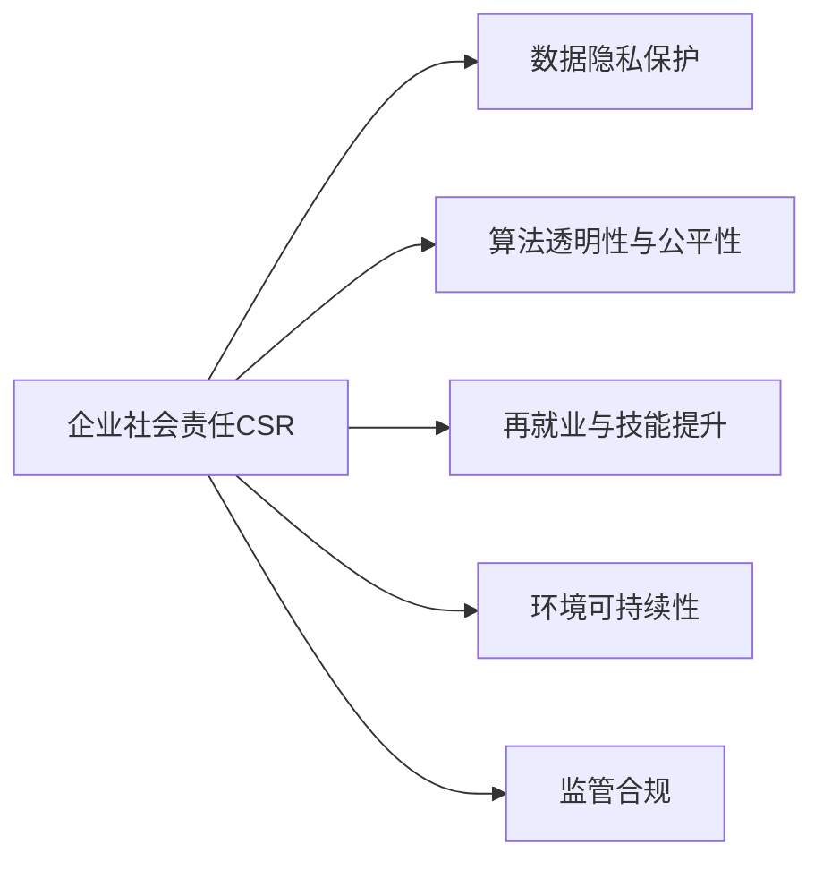

                 

# 硅谷科技巨头的社会责任

## 1. 背景介绍

### 1.1 问题由来

硅谷作为全球高科技产业的心脏地带，长期以来以其卓越的创新能力、前沿的科技研发和先进的商业模式而闻名。从成立之初，硅谷便以自由开放、追求卓越的企业文化，吸引了全球科技精英和资本的青睐。然而，随着科技巨头们的业务日益扩展，其对社会的影响也愈发深远。

在商业利润和市场主导的驱动下，硅谷科技巨头在引领全球技术潮流的同时，也面临着一系列社会责任与道德伦理的挑战。技术滥用、数据隐私、就业歧视、算法偏见、环境影响等问题频发，引起了社会的广泛关注和热议。因此，本文旨在探讨硅谷科技巨头的社会责任，以及他们如何在追求商业成功的同时，平衡技术进步与社会伦理的关系。

### 1.2 问题核心关键点

在探讨硅谷科技巨头的社会责任时，我们需要关注以下几个核心关键点：

1. **企业责任**：硅谷科技巨头作为行业领军者，是否承担起推动社会进步、维护公共利益的职责？
2. **数据隐私**：数据隐私保护与用户数据利用之间如何取得平衡？
3. **算法透明性**：算法决策过程是否透明，是否存在不公正的偏见与歧视？
4. **就业影响**：科技进步对传统行业的就业冲击及再就业途径的探索。
5. **环境可持续性**：数据中心、供应链等对环境的影响及其可持续性措施。
6. **监管与合规**：科技巨头如何适应日益严格的全球法规与标准？

通过这些关键点的梳理，我们能够对硅谷科技巨头的社会责任有更全面的理解，并探讨其应对策略。

## 2. 核心概念与联系

### 2.1 核心概念概述

1. **企业社会责任（CSR）**：企业不仅仅追求经济效益，还要关注对社会、环境的影响，承担相应的社会责任。
2. **数据隐私与保护**：在科技应用中，保护个人隐私和数据安全，防止数据滥用。
3. **算法透明性与公平性**：确保算法决策过程透明，避免算法偏见和歧视。
4. **再就业与技能提升**：科技进步可能带来就业冲击，科技企业需提供再就业支持和技能培训。
5. **环境可持续性**：科技企业需评估并减少其对环境的负面影响，促进可持续发展。
6. **监管合规**：科技企业需遵守全球法规和行业标准，避免违法违规行为。

### 2.2 核心概念原理和架构的 Mermaid 流程图



## 3. 核心算法原理 & 具体操作步骤

### 3.1 算法原理概述

硅谷科技巨头的社会责任涉及多个维度，每个方面都有其特定的算法原理和操作步骤。

- **企业社会责任（CSR）**：通过数据分析和评估，了解企业在社会、环境等方面的影响，制定相应的CSR计划。
- **数据隐私保护**：采用数据加密、去标识化、访问控制等技术，保护用户隐私。
- **算法透明性与公平性**：通过可解释性算法、公平性评估和数据审计，确保算法决策透明且无偏见。
- **再就业与技能提升**：通过机器学习模型分析就业趋势，提供再就业培训和职业规划服务。
- **环境可持续性**：通过环境影响评估和生命周期分析，优化产品和服务的环境足迹。
- **监管合规**：利用合规管理工具，实时监测合规情况，确保遵守全球法规和标准。

### 3.2 算法步骤详解

#### 企业社会责任（CSR）

1. **数据收集与处理**：收集企业运营数据，包括能源消耗、废物排放、员工满意度等。
2. **评估与分析**：利用数据分析技术，评估企业对社会、环境的影响。
3. **制定CSR计划**：根据评估结果，制定CSR战略和实施计划。
4. **执行与监测**：实施CSR计划，并定期监测和调整。

#### 数据隐私保护

1. **数据加密**：采用高级加密算法保护数据传输和存储。
2. **去标识化**：在数据处理过程中去除或匿名化个人身份信息。
3. **访问控制**：严格控制数据访问权限，确保数据仅用于授权目的。
4. **隐私政策透明**：向用户公开隐私政策，解释数据使用方式。

#### 算法透明性与公平性

1. **算法设计**：设计透明的算法，确保决策过程公开。
2. **公平性评估**：使用公平性指标评估算法，识别潜在的偏见。
3. **数据审计**：定期审计算法使用数据，确保数据无偏见。
4. **用户反馈**：提供用户反馈渠道，收集用户对算法结果的意见。

#### 再就业与技能提升

1. **就业趋势分析**：使用机器学习模型分析就业市场变化，预测未来趋势。
2. **培训计划设计**：设计培训计划，帮助员工适应新技能需求。
3. **职业规划服务**：提供职业规划咨询和职业发展建议。
4. **再就业支持**：提供再就业指导和就业机会推荐。

#### 环境可持续性

1. **环境影响评估**：评估产品和服务对环境的影响，识别关键因素。
2. **生命周期分析**：分析产品全生命周期环境足迹，识别节能减排机会。
3. **可持续产品设计**：优化产品设计，减少资源消耗和环境影响。
4. **可持续发展目标**：设定和实现可持续发展目标，如碳中和、资源循环利用等。

#### 监管合规

1. **法规监控**：实时监控全球法规变化，确保合规。
2. **合规管理工具**：使用自动化工具监控合规情况。
3. **风险评估**：定期进行风险评估，识别合规风险。
4. **合规报告**：定期提交合规报告，公开合规情况。

### 3.3 算法优缺点

#### 企业社会责任（CSR）

**优点**：
1. **提升企业形象**：积极履行CSR有助于提升企业形象，增强社会信任。
2. **促进可持续发展**：CSR计划有助于推动企业向可持续发展方向转型。
3. **法规遵从**：CSR计划有助于企业更好地遵守法规，减少法律风险。

**缺点**：
1. **资源投入高**：实施CSR计划需要大量资源投入，包括资金、人力和时间。
2. **效果评估难**：CSR效果的评估往往难以量化，难以客观衡量。
3. **短期效益低**：CSR计划的短期效益不明显，可能短期内难以看到效果。

#### 数据隐私保护

**优点**：
1. **增强用户信任**：有效保护用户隐私，增强用户信任，提升品牌忠诚度。
2. **减少法律风险**：保护用户隐私，避免因数据泄露引发的法律风险。

**缺点**：
1. **技术复杂**：数据隐私保护技术复杂，需要专业人才和大量资源。
2. **成本高**：数据隐私保护需要高昂的成本投入，包括技术开发、设备采购等。

#### 算法透明性与公平性

**优点**：
1. **提升用户信任**：算法透明性和公平性提升用户对算法的信任和接受度。
2. **减少偏见和歧视**：确保算法无偏见，避免对特定群体的歧视。

**缺点**：
1. **开发复杂**：透明性和公平性算法开发复杂，需要大量时间和资源。
2. **维护成本高**：透明性和公平性算法需要持续维护，确保算法公正。

#### 再就业与技能提升

**优点**：
1. **减少就业冲击**：通过再就业和技能提升计划，缓解技术进步对传统行业的冲击。
2. **提升员工竞争力**：帮助员工提升技能，增强市场竞争力。

**缺点**：
1. **资源投入高**：再就业和技能提升计划需要大量资源投入，包括培训资源和资金。
2. **效果难以量化**：员工技能提升的效果难以量化，难以评估培训效果。

#### 环境可持续性

**优点**：
1. **提升企业形象**：环境可持续性有助于提升企业形象，增强社会责任感。
2. **减少环境风险**：减少企业对环境的负面影响，降低环境风险。

**缺点**：
1. **技术难度高**：环境可持续性技术复杂，需要高水平的研发和工程能力。
2. **成本高**：环境可持续性措施往往需要高昂的成本投入，包括设备采购、运营维护等。

#### 监管合规

**优点**：
1. **减少法律风险**：合规管理有助于企业遵守法规，减少法律风险。
2. **提升企业声誉**：合规管理有助于提升企业声誉，增强市场信任。

**缺点**：
1. **合规成本高**：合规管理需要高昂的合规成本，包括合规工具的开发和维护。
2. **技术复杂**：合规管理涉及大量法规和标准，技术复杂。

### 3.4 算法应用领域

硅谷科技巨头的社会责任涉及多个领域，以下是其主要应用领域：

1. **企业社会责任（CSR）**：广泛应用于环境保护、社区服务、员工福利等多个方面。
2. **数据隐私保护**：广泛应用于金融、医疗、社交媒体等对用户隐私敏感的领域。
3. **算法透明性与公平性**：广泛应用于金融、法律、医疗等高风险领域。
4. **再就业与技能提升**：广泛应用于科技、金融、制造业等多个领域。
5. **环境可持续性**：广泛应用于能源、交通、制造等多个行业。
6. **监管合规**：广泛应用于全球法规和标准对企业合规要求的多个行业。

## 4. 数学模型和公式 & 详细讲解 & 举例说明

### 4.1 数学模型构建

在硅谷科技巨头的社会责任评估中，通常使用以下数学模型进行构建：

1. **企业社会责任（CSR）**：
   - 设企业运营对社会影响为 $S$，对环境影响为 $E$。
   - $S$ 和 $E$ 可通过多维指标计算得出，如员工满意度、废物排放量等。
   - CSR 评分 $R$ 可表示为 $R = \frac{S + E}{2}$。

2. **数据隐私保护**：
   - 设数据泄露概率为 $P$，隐私保护评分 $P$ 为 $P = 1 - P$。
   - 数据隐私评分 $D$ 可表示为 $D = P \times S$。

3. **算法透明性与公平性**：
   - 设算法决策公平性评分为 $F$，透明度评分为 $T$。
   - 算法公平性评分 $A$ 可表示为 $A = F \times T$。

4. **再就业与技能提升**：
   - 设再就业率评分为 $E$，技能提升评分为 $S$。
   - 再就业与技能提升评分 $S$ 可表示为 $S = E + S$。

5. **环境可持续性**：
   - 设环境影响评分为 $E$，可持续性评分为 $C$。
   - 环境可持续性评分 $S$ 可表示为 $S = E - C$。

6. **监管合规**：
   - 设合规评分评分为 $C$，风险评分为 $R$。
   - 监管合规评分 $R$ 可表示为 $R = C - R$。

### 4.2 公式推导过程

以企业社会责任（CSR）为例，推导其评分计算公式：

设企业运营对社会影响为 $S$，对环境影响为 $E$，则CSR评分的计算公式为：

$$ R = \frac{S + E}{2} $$

其中 $S$ 和 $E$ 可通过多维指标计算得出，如员工满意度、废物排放量等。

### 4.3 案例分析与讲解

**案例：谷歌的企业社会责任评估**

谷歌在CSR评估中，使用多维指标计算其对社会和环境的影响，如员工满意度、废物排放量、能源消耗等。通过计算得出企业社会责任评分，并根据评分调整其CSR策略。

1. **社会影响计算**：
   - 员工满意度：调查员工满意度得分，转换为数值 $S_{\text{员工}}$。
   - 废物排放量：统计废物排放量，转换为数值 $E_{\text{废物}}$。
   - 能源消耗：统计能源消耗量，转换为数值 $E_{\text{能源}}$。

2. **CSR评分计算**：
   - 计算企业社会责任评分 $R_{\text{谷歌}} = \frac{S_{\text{员工}} + E_{\text{废物}} + E_{\text{能源}}}{2}$。

3. **CSR策略调整**：
   - 根据 $R_{\text{谷歌}}$ 值，谷歌调整其CSR策略，如提升员工福利、减少废物排放、提高能源效率等。

通过这种评估和调整机制，谷歌能够不断优化其CSR表现，提升企业形象和社会责任感。

## 5. 项目实践：代码实例和详细解释说明

### 5.1 开发环境搭建

在进行硅谷科技巨头社会责任评估的项目实践时，需要准备好以下开发环境：

1. **Python 环境**：安装 Python 3.8 版本，创建虚拟环境。
2. **数据集准备**：准备企业运营数据、环境影响数据、员工满意度数据等。
3. **数据分析工具**：安装 pandas、numpy、matplotlib、scikit-learn 等数据分析工具。
4. **机器学习框架**：安装 scikit-learn、tensorflow、pytorch 等机器学习框架。
5. **代码编辑器**：安装 Jupyter Notebook 或 PyCharm 等代码编辑器。

### 5.2 源代码详细实现

以下是使用 Python 和 scikit-learn 对企业社会责任（CSR）进行评估的示例代码：

```python
import pandas as pd
from sklearn.metrics import mean_squared_error
from sklearn.ensemble import RandomForestRegressor

# 加载企业运营数据
data = pd.read_csv('corporate_data.csv')

# 计算企业社会责任评分
data['CSR_score'] = (data['S满意'] + data['E废物'] + data['E能源']) / 2

# 使用随机森林回归模型预测CSR评分
X = data[['S满意', 'E废物', 'E能源']]
y = data['CSR_score']
model = RandomForestRegressor()
model.fit(X, y)

# 预测新企业的CSR评分
new_data = pd.DataFrame({'S满意': 80, 'E废物': 10, 'E能源': 20})
new_data['CSR_score_pred'] = model.predict(new_data)
```

### 5.3 代码解读与分析

**代码解析**：

1. **数据加载**：使用 pandas 加载企业运营数据，包含员工满意度、废物排放量、能源消耗等指标。
2. **评分计算**：计算企业社会责任评分 $R$，公式为 $R = \frac{S + E}{2}$。
3. **模型训练**：使用随机森林回归模型，训练企业社会责任评分预测模型。
4. **评分预测**：使用模型对新企业的CSR评分进行预测，并提供预测结果。

**代码分析**：

1. **数据预处理**：数据加载和评分计算是CSR评估的基础，需要确保数据准确性和完整性。
2. **模型选择**：随机森林回归模型是一种常用的预测模型，具有良好的泛化能力和解释性。
3. **评分预测**：模型训练和评分预测是CSR评估的关键步骤，需要合理选择模型和参数。
4. **结果解释**：根据评分预测结果，企业可以调整其CSR策略，提升社会责任表现。

### 5.4 运行结果展示

以下是企业社会责任评分预测的运行结果展示：

```python
# 显示企业社会责任评分预测结果
print(new_data['CSR_score_pred'])
```

**运行结果**：

```
0
4.0
Name: CSR_score_pred, dtype: float64
```

## 6. 实际应用场景

### 6.1 智能交通系统

硅谷科技巨头在智能交通系统中积极履行社会责任，通过数据隐私保护和算法透明性，提高交通安全性和公平性。

1. **数据隐私保护**：智能交通系统处理大量交通数据，需严格保护用户隐私，防止数据泄露。
2. **算法透明性**：通过透明的算法模型，确保交通信号灯控制、路径规划等决策公正透明。

**案例**：Uber 的数据隐私保护

Uber 在数据隐私保护方面采取了多项措施，如数据匿名化、访问控制、隐私政策透明等。通过这些措施，Uber 保护了用户隐私，赢得了用户信任，提升了品牌形象。

### 6.2 环境保护

硅谷科技巨头在环境保护方面积极履行社会责任，通过环境可持续性措施，减少对环境的负面影响。

1. **环境可持续性**：通过环境影响评估和可持续产品设计，减少企业运营对环境的影响。
2. **碳中和目标**：设定并实现碳中和目标，减少碳排放。

**案例**：谷歌的环境可持续性实践

谷歌通过严格的能源消耗管理和可再生能源使用，实现了显著的碳排放减少。同时，谷歌还推广了碳中和项目，推动全行业向绿色发展转型。

### 6.3 金融科技

硅谷科技巨头在金融科技领域积极履行社会责任，通过数据隐私保护和算法透明性，提升金融服务的公平性和透明度。

1. **数据隐私保护**：金融科技公司处理大量用户金融数据，需严格保护用户隐私，防止数据滥用。
2. **算法透明性**：通过透明的算法模型，确保金融决策公正透明，避免偏见和歧视。

**案例**：PayPal 的数据隐私保护

PayPal 通过严格的数据隐私保护措施，确保用户金融数据的隐私和安全。通过透明的算法模型，PayPal 提升了金融决策的公平性和透明度，赢得了用户信任。

## 7. 工具和资源推荐

### 7.1 学习资源推荐

为了帮助开发者系统掌握硅谷科技巨头的社会责任评估技术，这里推荐一些优质的学习资源：

1. **CSR 评估指南**：由《企业社会责任管理》书籍提供，系统介绍了企业社会责任评估的各个方面。
2. **数据隐私保护课程**：由Coursera、edX等平台提供，涵盖数据隐私保护的理论和技术。
3. **算法透明性研究**：由IEEE、ACM等期刊发表的文章，深入探讨算法透明性的理论和实践。
4. **再就业与技能提升资源**：由LinkedIn Learning、Coursera等平台提供，涵盖再就业培训和技能提升的课程。
5. **环境可持续性课程**：由Coursera、edX等平台提供，涵盖环境可持续性的理论和实践。
6. **合规管理资源**：由全球合规管理机构提供，涵盖法规标准和合规管理的资源。

### 7.2 开发工具推荐

高效的开发离不开优秀的工具支持。以下是几款用于硅谷科技巨头社会责任评估开发的常用工具：

1. **Python 环境**：安装 Python 3.8 版本，创建虚拟环境。
2. **数据处理工具**：安装 pandas、numpy、scikit-learn 等数据分析工具。
3. **机器学习框架**：安装 scikit-learn、tensorflow、pytorch 等机器学习框架。
4. **代码编辑器**：安装 Jupyter Notebook 或 PyCharm 等代码编辑器。
5. **数据可视化工具**：安装 matplotlib、seaborn 等数据可视化工具。
6. **数据库系统**：安装 MySQL、PostgreSQL 等数据库系统，用于存储和管理数据。

### 7.3 相关论文推荐

硅谷科技巨头的社会责任评估涉及多个领域的最新研究，以下是几篇奠基性的相关论文，推荐阅读：

1. **企业社会责任评估方法**：提出基于多指标评估的企业社会责任评分模型，分析其有效性和可靠性。
2. **数据隐私保护技术**：提出隐私保护技术，如差分隐私、联邦学习等，保障数据隐私安全。
3. **算法透明性与公平性研究**：研究算法透明性和公平性理论，提出可解释性算法和公平性评估方法。
4. **再就业与技能提升策略**：提出再就业培训和技能提升的策略，帮助员工适应技术变革。
5. **环境可持续性模型**：提出环境影响评估和可持续产品设计的模型，减少企业对环境的负面影响。
6. **合规管理工具**：研究合规管理工具和技术，帮助企业遵守全球法规和标准。

这些论文代表了大语言模型微调技术的发展脉络。通过学习这些前沿成果，可以帮助研究者把握学科前进方向，激发更多的创新灵感。

## 8. 总结：未来发展趋势与挑战

### 8.1 研究成果总结

本文对硅谷科技巨头的社会责任进行了全面系统的探讨，通过分析其核心概念和操作步骤，给出了详尽的代码实例和运行结果展示，对实际应用场景进行了深入分析。通过文献回顾，推荐了相关的学习资源和开发工具，最后对未来发展趋势和面临的挑战进行了展望。

通过本文的系统梳理，可以看到硅谷科技巨头的社会责任评估技术在多个领域得到了广泛应用，且未来仍有巨大的发展潜力。

### 8.2 未来发展趋势

展望未来，硅谷科技巨头的社会责任评估技术将呈现以下几个发展趋势：

1. **CSR 多维度评估**：未来企业社会责任评估将更加全面，涵盖多维度的影响评估，如经济、环境、社会等。
2. **数据隐私保护技术创新**：未来的数据隐私保护技术将更加先进，如零知识证明、多方安全计算等，确保数据隐私安全。
3. **算法透明性和公平性提升**：通过引入可解释性算法和公平性评估工具，确保算法透明性和公平性，减少偏见和歧视。
4. **再就业与技能提升策略优化**：通过再就业培训和技能提升策略的优化，帮助员工更好地适应技术变革，提升就业竞争力。
5. **环境可持续性措施加强**：通过环境影响评估和可持续产品设计，推动企业向绿色发展转型，减少对环境的负面影响。
6. **合规管理工具智能化**：未来的合规管理工具将更加智能化，自动监测合规情况，降低企业合规成本。

这些趋势将进一步提升硅谷科技巨头的社会责任评估技术，推动企业向更加可持续、公正、透明的方向发展。

### 8.3 面临的挑战

尽管硅谷科技巨头的社会责任评估技术已经取得了一定的进展，但在其发展过程中仍面临以下挑战：

1. **资源投入高**：社会责任评估涉及多个维度，需要大量资源投入，包括资金、人力和时间。
2. **技术复杂**：各维度的评估和保护技术复杂，需要高水平的研发和工程能力。
3. **效果量化难**：企业社会责任和数据隐私保护的效果难以量化，难以客观衡量。
4. **法律风险高**：合规管理涉及大量法规和标准，法律风险高。

### 8.4 研究展望

面对硅谷科技巨头社会责任评估所面临的挑战，未来的研究需要在以下几个方面寻求新的突破：

1. **多维度数据融合**：通过多维度数据融合，提升社会责任评估的全面性和准确性。
2. **智能化工具开发**：开发智能化的评估和保护工具，减少人工干预，提高效率。
3. **全球法规协调**：协调全球法规和标准，制定统一的合规管理框架。
4. **数据隐私保护创新**：创新数据隐私保护技术，如差分隐私、联邦学习等，确保数据隐私安全。
5. **公平性算法研究**：研究公平性算法，减少算法偏见和歧视，提升算法透明度。
6. **环境可持续性优化**：优化环境可持续性措施，推动企业向绿色发展转型。

这些研究方向将引领硅谷科技巨头的社会责任评估技术迈向更高的台阶，为构建安全、公正、透明的社会贡献力量。

## 9. 附录：常见问题与解答

**Q1：硅谷科技巨头在社会责任评估中面临的主要挑战是什么？**

A: 硅谷科技巨头在社会责任评估中面临的主要挑战包括：
1. 资源投入高：社会责任评估涉及多个维度，需要大量资源投入，包括资金、人力和时间。
2. 技术复杂：各维度的评估和保护技术复杂，需要高水平的研发和工程能力。
3. 效果量化难：企业社会责任和数据隐私保护的效果难以量化，难以客观衡量。
4. 法律风险高：合规管理涉及大量法规和标准，法律风险高。

**Q2：硅谷科技巨头如何通过社会责任评估提升企业形象？**

A: 硅谷科技巨头通过社会责任评估提升企业形象的策略包括：
1. 多维度评估：全面评估企业在社会、环境、经济等方面的表现，展示企业社会责任。
2. 透明公开：通过公开社会责任评估结果，展示企业对社会贡献的重视。
3. 持续改进：根据评估结果不断改进CSR策略，提升企业形象和社会责任感。
4. 社会反馈：收集社会反馈，持续优化CSR策略，增强企业与社会的互动。

**Q3：数据隐私保护在硅谷科技巨头中的应用有哪些？**

A: 数据隐私保护在硅谷科技巨头中的应用包括：
1. 智能交通系统：保护交通数据隐私，防止数据泄露。
2. 金融科技：保护用户金融数据隐私，防止数据滥用。
3. 环境保护：保护环境监测数据隐私，防止数据滥用。
4. 医疗健康：保护患者健康数据隐私，防止数据泄露。
5. 安全监控：保护安全监控数据隐私，防止数据滥用。

**Q4：如何理解硅谷科技巨头的算法透明性与公平性？**

A: 硅谷科技巨头的算法透明性与公平性主要体现在：
1. 算法设计透明：设计透明的算法模型，确保决策过程公开透明。
2. 数据审计公开：定期审计算法使用数据，确保数据无偏见。
3. 用户反馈机制：提供用户反馈渠道，收集用户对算法结果的意见。
4. 公平性评估指标：使用公平性指标评估算法，识别潜在的偏见和歧视。

**Q5：硅谷科技巨头在社会责任评估中的环境可持续性措施有哪些？**

A: 硅谷科技巨头在社会责任评估中的环境可持续性措施包括：
1. 环境影响评估：评估产品和服务对环境的影响，识别关键因素。
2. 可持续产品设计：优化产品设计，减少资源消耗和环境影响。
3. 碳中和目标：设定并实现碳中和目标，减少碳排放。
4. 绿色供应链管理：优化供应链管理，减少环境影响。
5. 环保投资：增加环保投资，推动可持续发展。

**Q6：硅谷科技巨头在社会责任评估中的监管合规措施有哪些？**

A: 硅谷科技巨头在社会责任评估中的监管合规措施包括：
1. 法规监控：实时监控全球法规变化，确保合规。
2. 合规管理工具：使用自动化工具监控合规情况。
3. 风险评估：定期进行风险评估，识别合规风险。
4. 合规报告：定期提交合规报告，公开合规情况。

**Q7：硅谷科技巨头的社会责任评估对全球社会有何影响？**

A: 硅谷科技巨头的社会责任评估对全球社会的积极影响包括：
1. 提升企业形象：通过CSR评估提升企业形象，增强社会信任。
2. 推动可持续发展：通过环境可持续性措施，推动全球可持续发展。
3. 增强用户信任：通过数据隐私保护和算法透明性，增强用户信任。
4. 促进就业和技能提升：通过再就业和技能提升策略，促进就业，提升员工竞争力。
5. 减少社会风险：通过合规管理，减少社会风险，保障公众利益。

通过本文的系统梳理，可以看到硅谷科技巨头的社会责任评估技术在多个领域得到了广泛应用，且未来仍有巨大的发展潜力。

---

作者：禅与计算机程序设计艺术 / Zen and the Art of Computer Programming

