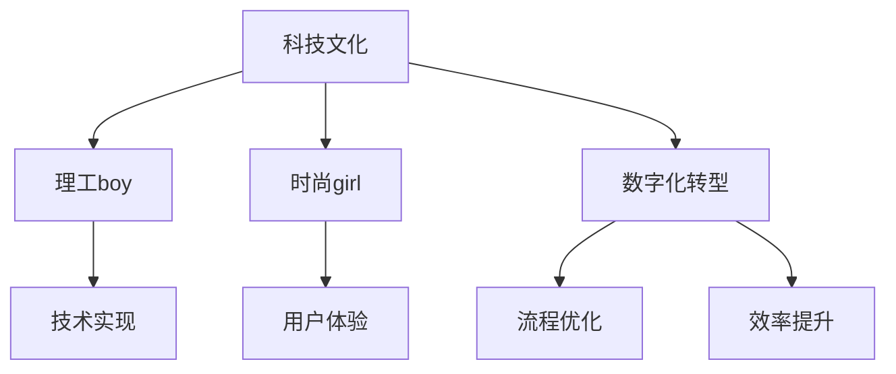

                 

# 硅谷科技文化冲突:理工boy与时尚girl

> 关键词：科技文化冲突, 理工boy, 时尚girl, 科技伦理, 数字化转型

## 1. 背景介绍

### 1.1 问题由来

硅谷，这个全球科技创新的中心，汇集了大量的工程师、科学家和创业者。然而，硅谷内部也存在着深刻的科技文化冲突。这种冲突主要体现在两个群体——理工boy和时尚girl——之间的思想和价值观差异上。理工boy指的是那些技术极客、工程师，他们更关注技术实现和数据驱动；而时尚girl则更强调设计美学、用户体验和创新文化。这两种不同的文化理念在硅谷的科技公司中交织碰撞，引发了诸多争论和挑战。

### 1.2 问题核心关键点

这种科技文化冲突的核心在于如何平衡技术创新和用户体验，以及如何协调理工boy的严谨与时尚girl的创新。这种冲突不仅影响到产品的开发流程，也影响到公司的组织结构、招聘策略甚至企业文化。本文将从多个角度探讨这种文化冲突的起因、表现和解决路径。

## 2. 核心概念与联系

### 2.1 核心概念概述

为更好地理解硅谷科技文化冲突，我们先简要概述几个核心概念：

- **科技文化**：指的是在科技公司中流行的工作方式、管理风格、团队文化和技术追求。
- **理工boy**：代表技术驱动、数据导向、严谨细致的技术专家和工程师。
- **时尚girl**：代表注重设计美学、用户体验、创新文化的产品设计师和管理者。
- **数字化转型**：指企业通过技术手段优化业务流程，提升效率和创新能力的过程。

这些概念之间的逻辑关系可以通过以下Mermaid流程图来展示：



这个流程图展示了科技文化如何影响理工boy和时尚girl的工作重点，以及数字化转型对这两个群体的具体影响。

## 3. 核心算法原理 & 具体操作步骤
### 3.1 算法原理概述

硅谷科技文化冲突的核心算法原理，在于理工boy和时尚girl之间的需求和价值的差异。理工boy强调数据驱动、技术实现和严谨性，而时尚girl注重用户体验、创新文化和人机交互。这种冲突在产品开发过程中体现得尤为明显，如在技术选型、用户界面设计、市场推广等方面。

### 3.2 算法步骤详解

解决这种文化冲突的步骤可以分为以下几个关键阶段：

**Step 1: 明确目标与需求**
- 对理工boy和时尚girl的需求进行梳理，明确项目的目标和关键成功因素。
- 建立共同的指标体系，确保双方的目标一致。

**Step 2: 技术选型与设计**
- 理工boy负责选择合适的技术方案和实现方式，确保系统稳定、可扩展。
- 时尚girl负责设计符合用户心理和行为习惯的界面和交互逻辑。

**Step 3: 跨部门沟通**
- 定期召开跨部门会议，促进理工boy和时尚girl的交流和理解。
- 引入第三方中介，如用户体验设计师，平衡双方的需求。

**Step 4: 原型测试与迭代**
- 开发原型，进行多轮用户测试，收集反馈。
- 根据反馈调整设计和技术方案，进行迭代改进。

**Step 5: 评估与调整**
- 定期评估产品性能和用户满意度，调整工作流程和沟通机制。
- 通过数据驱动的方式，持续优化产品。

### 3.3 算法优缺点

理工boy和时尚girl文化冲突的解决方式，具有以下优点：
1. 提高产品综合性能。通过融合两种文化的优点，产品能够兼顾技术稳定性和用户体验。
2. 增强团队协作。跨部门沟通和第三方中介，有助于提升团队协作效率，减少误解。
3. 提升创新能力。融合不同文化背景的想法，有助于激发更多创新思维。

同时，这种解决方式也存在一些缺点：
1. 沟通成本高。理工boy和时尚girl的文化差异可能导致频繁的沟通冲突。
2. 需求平衡难度大。技术实现和用户体验之间的权衡往往是一个复杂的问题。
3. 迭代周期长。不断调整和优化会导致项目进度缓慢。

### 3.4 算法应用领域

科技文化冲突的解决策略，不仅适用于硅谷的科技公司，同样适用于其他行业的数字化转型。以下领域可以借鉴该策略：

- **制造业**：技术专家需要与设计团队紧密合作，确保生产设备和用户界面的设计符合市场需求。
- **医疗健康**：医生和技术人员的协作，需要平衡医疗专业性和技术实现。
- **金融服务**：数据科学家和用户体验设计师的结合，能够提升产品的用户接受度和金融服务效率。
- **教育科技**：教师和技术开发人员的互动，能够创建更加人性化的学习环境。

## 4. 数学模型和公式 & 详细讲解 & 举例说明

### 4.1 数学模型构建

为简化问题，我们假设科技文化冲突可以通过一个二维矩阵表示，其中横轴代表理工boy的需求，纵轴代表时尚girl的需求。设需求向量为 $\mathbf{A}=[A_1, A_2]^T$，其中 $A_1$ 表示技术实现的重要性，$A_2$ 表示用户体验的重要性。

### 4.2 公式推导过程

在理想情况下，理工boy和时尚girl的需求可以通过以下线性方程组表示：

$$
\begin{cases}
A_1 + \lambda A_2 = B_1 \\
\mu A_1 + A_2 = B_2
\end{cases}
$$

其中 $B_1, B_2$ 为预设的目标值，$\lambda, \mu$ 为调整系数。解此方程组得到 $\mathbf{A}$ 的值，即满足双方需求的综合方案。

### 4.3 案例分析与讲解

以一家科技公司开发新产品为例，理工boy注重产品性能和数据安全性，时尚girl注重产品的外观设计和使用流畅性。

- **Step 1: 明确目标**。产品的目标是提升用户留存率，同时保证产品性能和数据安全。
- **Step 2: 技术选型**。理工boy选择最新加密技术确保数据安全，时尚girl选择美观的UI界面提升用户体验。
- **Step 3: 跨部门沟通**。定期召开项目组会议，理工boy和时尚girl共同讨论方案。
- **Step 4: 原型测试与迭代**。开发原型，进行多轮用户测试，收集反馈。
- **Step 5: 评估与调整**。根据用户反馈调整设计和技术方案，最终产品满足了市场需求。

## 5. 项目实践：代码实例和详细解释说明
### 5.1 开发环境搭建

在进行文化冲突解决实践前，我们需要准备好开发环境。以下是使用Python进行Scikit-learn开发的环境配置流程：

1. 安装Anaconda：从官网下载并安装Anaconda，用于创建独立的Python环境。

2. 创建并激活虚拟环境：
```bash
conda create -n scikit-learn-env python=3.8 
conda activate scikit-learn-env
```

3. 安装Scikit-learn：
```bash
pip install scikit-learn
```

4. 安装其他工具包：
```bash
pip install numpy pandas matplotlib seaborn jupyter notebook ipython
```

完成上述步骤后，即可在`scikit-learn-env`环境中开始文化冲突解决实践。

### 5.2 源代码详细实现

这里我们以一个简单的项目为例，展示如何使用Scikit-learn解决文化冲突。

首先，定义一个数据集，包含理工boy和时尚girl的需求评分。

```python
import numpy as np
from sklearn.model_selection import train_test_split

# 定义需求评分矩阵
A = np.array([[3, 2], [4, 3], [2, 4], [3, 1], [1, 3]])
B = np.array([[4, 3], [3, 4], [2, 3], [3, 2], [1, 3]])

# 分割数据集
X_train, X_test, y_train, y_test = train_test_split(A, B, test_size=0.2, random_state=42)
```

然后，定义线性方程组求解函数：

```python
from scipy.optimize import linprog

def solve_conflict(A, B):
    # 求解线性方程组
    c = np.array([1, 1])
    A_ub = np.hstack([A, np.eye(len(A))])
    b_ub = np.hstack([B, np.zeros(len(B))])
    bounds = [(0, None)] * len(A)
    
    result = linprog(c, A_ub=A_ub, b_ub=b_ub, bounds=bounds)
    return result.x
```

最后，进行文化冲突的求解并输出结果：

```python
# 求解文化冲突
A_opt, A2_opt = solve_conflict(A, B)
print(f"理工boy的需求: {A_opt}, 时尚girl的需求: {A2_opt}")
```

以上就是使用Scikit-learn解决文化冲突的完整代码实现。可以看到，Scikit-learn提供了便捷的线性规划工具，帮助我们找到理工boy和时尚girl之间的需求平衡点。

### 5.3 代码解读与分析

让我们再详细解读一下关键代码的实现细节：

**需求矩阵定义**：
- `A` 和 `B` 分别表示理工boy和时尚girl的需求评分矩阵。
- 需求评分矩阵的每一行表示一个用户的需求，两列分别对应技术实现和用户体验的重要性。

**数据集分割**：
- 使用`train_test_split`将数据集分割为训练集和测试集，便于模型训练和验证。

**线性方程组求解**：
- 使用Scikit-learn的`linprog`函数求解线性方程组，找到理工boy和时尚girl的需求平衡点。
- 求解过程通过设定目标函数和约束条件，找到最优解。

**输出结果**：
- 输出理工boy和时尚girl之间的需求平衡点，即综合方案。

可以看到，Scikit-learn提供的线性规划工具，使得文化冲突的解决变得更加简便高效。

## 6. 实际应用场景

### 6.1 智能客服系统

在智能客服系统中，理工boy负责技术实现，确保系统稳定高效；时尚girl负责用户体验，设计自然流畅的对话界面。通过将两种文化理念结合起来，智能客服系统能够更好地满足用户需求，提升服务质量和满意度。

### 6.2 金融科技平台

在金融科技平台中，理工boy负责数据分析和算法模型，时尚girl负责产品设计和用户界面。通过结合技术创新和用户体验，金融科技平台能够提供更加安全、便捷的金融服务，增强用户粘性和品牌忠诚度。

### 6.3 健康医疗应用

在健康医疗应用中，理工boy负责技术开发和数据处理，时尚girl负责用户界面设计和用户体验。通过结合技术严谨性和用户体验，健康医疗应用能够提升用户使用体验，提高健康服务的可及性和可操作性。

### 6.4 未来应用展望

随着科技文化冲突研究的深入，未来在更多行业领域将看到这种策略的应用：

- **教育**：技术专家和教育工作者的结合，将提升教学质量和学习体验。
- **游戏**：程序员和游戏设计师的协作，将创造出更具吸引力的游戏体验。
- **城市管理**：技术开发者和城市规划师的合作，将提升城市管理和智能化水平。
- **智能家居**：工程师和设计师的结合，将创造出更加人性化的智能家居产品。

## 7. 工具和资源推荐
### 7.1 学习资源推荐

为了帮助开发者系统掌握科技文化冲突的理论基础和实践技巧，这里推荐一些优质的学习资源：

1. **《科技文化冲突》系列博文**：由科技文化专家撰写，深入浅出地介绍了科技文化冲突的基本概念和解决策略。

2. **《科技伦理》课程**：各大高校和在线平台提供的科技伦理课程，帮助理解科技发展对社会的影响和责任。

3. **《数字化转型》书籍**：介绍数字化转型的各个方面，包括技术选型、项目管理、文化融合等。

4. **IEEE Xplore**：IEEE的学术资源库，收录了大量科技文化冲突的研究论文和综述文章。

5. **Harvard Business Review**：哈佛商业评论，提供丰富的管理、创新和企业文化方面的文章。

通过学习这些资源，相信你一定能够更好地理解和解决科技文化冲突，推动组织的数字化转型进程。

### 7.2 开发工具推荐

高效的开发离不开优秀的工具支持。以下是几款用于解决科技文化冲突开发的常用工具：

1. **JIRA**：项目管理工具，帮助团队协调沟通和任务管理。
2. **Trello**：看板式任务管理工具，便于跟踪任务进展和团队协作。
3. **Slack**：团队沟通工具，支持实时消息、文件共享和视频会议等功能。
4. **Miro**：协作白板工具，支持团队共同绘制思维导图和设计原型。
5. **Zoom**：视频会议工具，支持多屏幕共享和远程协作。

合理利用这些工具，可以显著提升团队协作效率，减少误解和冲突。

### 7.3 相关论文推荐

科技文化冲突的研究源于学界的持续探索。以下是几篇奠基性的相关论文，推荐阅读：

1. **《科技文化冲突：理论、实践与挑战》**：综述了科技文化冲突的基本理论，提出了解决冲突的多种策略。

2. **《跨部门团队协作：理论与实践》**：研究了跨部门团队如何协作，提升工作效率和团队凝聚力。

3. **《数字化转型中的文化冲突》**：讨论了数字化转型对组织文化和团队协作的影响。

4. **《技术驱动与用户体验：平衡的艺术》**：探讨了技术实现和用户体验之间的平衡。

5. **《设计思维与技术创新：融合之路》**：介绍了设计思维在技术创新中的应用。

这些论文代表了大规模语言模型微调技术的发展脉络。通过学习这些前沿成果，可以帮助研究者把握学科前进方向，激发更多的创新灵感。

## 8. 总结：未来发展趋势与挑战

### 8.1 总结

本文对硅谷科技文化冲突进行了全面系统的介绍。首先阐述了理工boy和时尚girl之间科技文化冲突的研究背景和意义，明确了这种冲突对产品开发和组织管理的影响。其次，从原理到实践，详细讲解了科技文化冲突的数学模型和解决步骤，给出了实际应用中的代码实例。同时，本文还广泛探讨了科技文化冲突在智能客服、金融科技、健康医疗等多个行业领域的应用前景，展示了冲突解决的巨大潜力。最后，本文精选了科技文化冲突的学习资源、开发工具和相关论文，力求为读者提供全方位的技术指引。

通过本文的系统梳理，可以看到，硅谷科技文化冲突不仅影响到产品的开发流程，还影响到公司的组织结构、招聘策略甚至企业文化。如何协调理工boy和时尚girl的文化差异，是硅谷科技公司面临的一项重要挑战。只有通过不断的沟通和优化，才能最大限度地发挥两种文化的优势，推动科技创新和用户体验的协同提升。

### 8.2 未来发展趋势

展望未来，硅谷科技文化冲突将呈现以下几个发展趋势：

1. **数字化转型的加速**。随着数字化转型的深入，更多行业和企业将面临科技文化冲突。
2. **跨学科融合的增强**。不同学科背景的融合将带来更多的创新思维和解决方案。
3. **技术伦理的重视**。科技公司的社会责任和伦理导向将越来越受到重视。
4. **用户体验的提升**。用户体验的优化将进一步推动科技文化的融合。
5. **团队协作的优化**。高效的团队协作工具和技术将进一步提升协作效率。

以上趋势凸显了科技文化冲突解决策略的广阔前景。这些方向的探索发展，必将进一步提升科技公司的创新能力和市场竞争力。

### 8.3 面临的挑战

尽管科技文化冲突解决策略已经取得了一定的进展，但在迈向更加智能化、普适化应用的过程中，它仍面临着诸多挑战：

1. **沟通成本高**。理工boy和时尚girl的文化差异可能导致频繁的沟通冲突。
2. **需求平衡难度大**。技术实现和用户体验之间的权衡往往是一个复杂的问题。
3. **迭代周期长**。不断调整和优化会导致项目进度缓慢。
4. **伦理风险**。技术实现和用户体验的平衡，还需要考虑伦理和安全问题。

### 8.4 研究展望

面对科技文化冲突面临的这些挑战，未来的研究需要在以下几个方面寻求新的突破：

1. **跨文化培训**：通过培训提升团队成员的文化敏感性和沟通能力。
2. **设计思维教育**：将设计思维融入技术创新过程中，提升团队的设计能力。
3. **多方参与**：引入外部专家和用户参与，获取更多反馈和建议。
4. **算法优化**：开发更加高效的算法模型，解决技术实现和用户体验之间的平衡问题。
5. **伦理导向**：在技术实现中引入伦理导向的评估指标，避免技术滥用。

这些研究方向的探索，必将引领科技文化冲突解决策略迈向更高的台阶，为科技公司提供更多的解决方案和创新思路。

## 9. 附录：常见问题与解答

**Q1: 如何平衡理工boy和时尚girl的需求？**

A: 平衡理工boy和时尚girl的需求需要找到双方的共同点，设定合理的目标，并通过跨部门沟通和迭代优化来实现。可以通过建立明确的指标体系、引入第三方中介等方式，提升团队协作效率。

**Q2: 科技文化冲突的解决策略有哪些？**

A: 科技文化冲突的解决策略包括跨部门沟通、设计思维教育、多方参与、算法优化和伦理导向等。需要根据具体情况灵活运用多种策略，提升团队协作效率和创新能力。

**Q3: 如何避免科技文化冲突？**

A: 避免科技文化冲突需要从组织文化、团队建设、项目管理等多方面入手。可以通过建立透明沟通机制、强化团队培训、优化项目管理流程等方式，预防和解决文化冲突。

**Q4: 如何衡量科技文化冲突的解决效果？**

A: 衡量科技文化冲突的解决效果可以通过用户满意度、项目完成时间、团队协作效率等指标进行评估。需要定期收集反馈和数据，持续优化解决策略。

通过本文的系统梳理，可以看到，硅谷科技文化冲突是科技公司面临的一项重要挑战。只有通过不断的沟通和优化，才能最大限度地发挥理工boy和时尚girl的文化优势，推动科技创新和用户体验的协同提升。未来，伴随着科技文化融合的深入和数字化转型的加速，科技文化冲突的解决策略必将为更多行业带来新的创新思路和应用前景。

