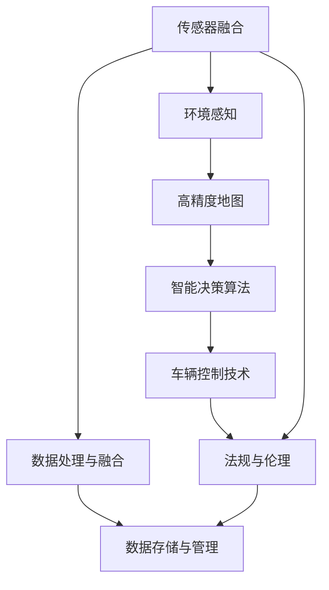

                 

# 硅谷自动驾驶汽车的技术发展路线

## 1. 背景介绍

### 1.1 问题由来

随着社会的发展和科技的进步，人类对出行效率和安全性提出了更高的要求。传统汽车面临着环境污染、交通拥堵等问题，已难以满足现代社会的可持续发展需求。自动驾驶技术作为解决这些问题的关键手段之一，近年来在全球范围内得到了快速的发展。特别是在硅谷，作为全球科技创新中心，自动驾驶汽车的研究和产业化进程尤为活跃。

自动驾驶汽车通过先进的感知技术、智能决策算法和车辆控制技术，使车辆能够自主感知周围环境，做出合理决策，并在无人操控的情况下安全行驶。其核心目标是实现"零事故、零污染、零伤亡"的愿景，成为未来智能交通系统的核心。

### 1.2 问题核心关键点

硅谷自动驾驶汽车技术的发展，主要围绕以下几个关键点展开：

- **传感器融合技术**：多传感器融合技术是自动驾驶的基础。通过整合摄像头、激光雷达、毫米波雷达等传感器数据，实现对复杂环境的全面感知。

- **环境感知与地图构建**：对道路、车辆、行人等环境要素的精准识别与实时更新，是自动驾驶的前提。构建高精度地图和动态道路信息库，为车辆自主行驶提供可靠依据。

- **智能决策算法**：通过优化决策模型，使车辆能够做出更准确的行动决策，处理复杂的交通场景和突发事件。

- **车辆控制技术**：实现精确的转向、加速和制动，保证自动驾驶车辆在无人操作下的行驶安全。

- **高可靠性和安全性**：在极端条件下，如恶劣天气、交通拥堵等，仍能保证车辆的安全运行。

- **法规与伦理**：自动驾驶技术的推广应用，需要配套的法律法规和伦理规范，确保技术应用的安全性和合法性。

### 1.3 问题研究意义

硅谷自动驾驶汽车技术的发展，对于提升交通效率、缓解交通压力、保护环境具有重要意义：

- 提高交通效率：自动驾驶车辆能够全天候工作，减少人为驾驶失误，提升道路通行效率。
- 降低交通压力：通过智能化管理，动态调整车辆行驶路线，优化交通流量，缓解交通拥堵。
- 保护环境：电动自动驾驶车辆零排放，有助于实现绿色出行，减少碳排放。
- 保障安全：自动驾驶技术通过多种冗余设计，提升行驶安全性，减少交通事故。

## 2. 核心概念与联系

### 2.1 核心概念概述

硅谷自动驾驶汽车技术的发展涉及众多关键概念，主要包括：

- **传感器融合**：整合多种传感器数据，提升环境感知的准确性。
- **环境感知**：通过传感器数据，实现对车辆周围环境的精准识别。
- **高精度地图**：构建高精度的道路信息库，提供自动驾驶的参照依据。
- **智能决策算法**：设计高效的决策模型，指导车辆在复杂场景下的行驶。
- **车辆控制技术**：实现精确的转向、加速和制动，确保车辆安全行驶。
- **法规与伦理**：制定并遵守相关法律法规，确保技术应用的合法性和安全性。

这些核心概念之间相互联系，共同构成了硅谷自动驾驶汽车技术的整体框架。

### 2.2 核心概念原理和架构的 Mermaid 流程图(Mermaid 流程节点中不要有括号、逗号等特殊字符)



该图展示了硅谷自动驾驶汽车技术的主要流程，从传感器数据融合，到环境感知，再到高精度地图的构建，智能决策算法的设计，车辆控制技术的应用，以及法规与伦理的考量。数据处理与融合和数据存储与管理作为支撑，保障了整个流程的稳定运行。

## 3. 核心算法原理 & 具体操作步骤

### 3.1 算法原理概述

硅谷自动驾驶汽车技术的发展，主要基于以下算法原理：

- **传感器数据融合算法**：通过对摄像头、激光雷达和毫米波雷达等传感器数据进行加权融合，提升环境感知的准确性和实时性。

- **环境感知算法**：利用计算机视觉和深度学习技术，对传感器数据进行实时处理，识别道路、车辆、行人等关键要素。

- **高精度地图构建算法**：结合多种地图数据源，通过地图匹配和实时更新技术，构建高精度的道路信息库。

- **智能决策算法**：设计基于强化学习、深度学习等技术的决策模型，优化车辆的行驶策略。

- **车辆控制算法**：实现转向、加速和制动的精确控制，确保车辆在无人操作下的行驶安全。

### 3.2 算法步骤详解

**传感器数据融合算法步骤**：

1. **传感器校准**：对摄像头、激光雷达和毫米波雷达进行校准，确保各传感器的测量精度。
2. **数据采集**：实时采集各传感器的数据。
3. **数据融合**：对采集到的数据进行加权融合，消除冗余信息，提高融合后的数据精度。
4. **信息反馈**：将融合后的数据反馈到各传感器，进一步校准和优化。

**环境感知算法步骤**：

1. **数据预处理**：对传感器数据进行去噪、归一化等预处理操作。
2. **特征提取**：利用卷积神经网络（CNN）等技术，提取道路、车辆、行人等关键特征。
3. **目标检测**：通过深度学习模型，如YOLO、Faster R-CNN等，实现目标的精准检测。
4. **状态估计**：结合IMU等传感器数据，实时估计车辆状态，如位置、速度、姿态等。

**高精度地图构建算法步骤**：

1. **地图数据采集**：通过卫星、航拍等方式，采集道路、交通设施等地图数据。
2. **地图匹配**：将实时传感器数据与高精度地图进行匹配，获取车辆在地图上的位置信息。
3. **动态更新**：结合实时传感器数据，更新高精度地图中的道路信息。
4. **路径规划**：利用优化算法，规划车辆的行驶路径，避开障碍物。

**智能决策算法步骤**：

1. **决策树构建**：基于强化学习等技术，构建决策树，定义不同交通场景下的决策策略。
2. **模型训练**：利用历史数据和模拟场景，训练决策模型，优化决策策略。
3. **实时决策**：在实际驾驶过程中，根据实时环境信息，动态调整决策策略。

**车辆控制算法步骤**：

1. **车辆状态监控**：实时监控车辆的转向、加速和制动状态。
2. **控制指令生成**：根据决策结果，生成转向、加速和制动的控制指令。
3. **执行与反馈**：将控制指令发送到车辆控制模块，实现转向、加速和制动，同时反馈控制效果。

### 3.3 算法优缺点

硅谷自动驾驶汽车技术的主要算法具有以下优点：

- **环境感知准确**：多种传感器数据融合，提升环境感知的准确性和实时性。
- **决策策略高效**：基于强化学习和深度学习等技术，优化决策模型的性能。
- **行驶控制精确**：高精度地图和实时传感器数据，确保车辆控制的安全性和稳定性。

同时，这些算法也存在一些局限性：

- **成本较高**：传感器和硬件设备的成本较高，限制了自动驾驶技术的普及。
- **依赖环境**：传感器数据的获取和处理受环境影响较大，恶劣天气和复杂交通场景可能影响感知效果。
- **伦理和安全问题**：自动驾驶车辆在特定情况下需要做出复杂的决策，涉及伦理和安全问题。
- **法规限制**：现有交通法规对自动驾驶车辆的使用存在限制，需进一步完善。

### 3.4 算法应用领域

硅谷自动驾驶汽车技术的应用领域广泛，涵盖了多个层面：

- **城市交通管理**：通过自动驾驶车辆，实现智能交通管理和调度，提升交通效率。
- **货运物流**：利用自动驾驶技术，实现无人驾驶货车的高效运输，降低物流成本。
- **公共交通**：在公共交通领域推广自动驾驶技术，提升服务质量和效率。
- **出租车和网约车**：推动出租车和网约车的自动驾驶应用，解决城市交通压力。
- **智能停车**：通过自动驾驶车辆，实现智能停车和车辆调度，提高停车效率。
- **个人出行**：实现个人车辆的全自动驾驶，提升出行便利性和安全性。

## 4. 数学模型和公式 & 详细讲解 & 举例说明（备注：数学公式请使用latex格式，latex嵌入文中独立段落使用 $$，段落内使用 $)

### 4.1 数学模型构建

硅谷自动驾驶汽车技术的数学模型构建，主要涉及以下几个方面：

- **传感器数据融合模型**：利用加权最小二乘法等技术，融合多种传感器数据，提升环境感知精度。
- **环境感知模型**：通过深度学习模型，如卷积神经网络（CNN），实现目标检测和状态估计。
- **高精度地图构建模型**：结合地图数据和实时传感器数据，构建高精度地图，并进行动态更新。
- **智能决策模型**：设计基于强化学习和深度学习等技术的决策模型，优化决策策略。
- **车辆控制模型**：利用线性控制系统等技术，实现车辆的精确控制。

### 4.2 公式推导过程

**传感器数据融合模型公式推导**：

设摄像头、激光雷达和毫米波雷达的测量数据分别为 $x_1$、$x_2$ 和 $x_3$，融合后数据为 $x_f$，权重分别为 $\omega_1$、$\omega_2$ 和 $\omega_3$。加权最小二乘法公式为：

$$
x_f = \omega_1 x_1 + \omega_2 x_2 + \omega_3 x_3
$$

其中 $\omega_i = \frac{\sigma_i^2}{\sum \sigma_i^2}$，$\sigma_i$ 为第 $i$ 个传感器的测量误差。

**环境感知模型公式推导**：

设输入图像为 $I$，输出特征图为 $F$，通过卷积神经网络进行特征提取和目标检测，公式为：

$$
F = \mathcal{C}(I)
$$

其中 $\mathcal{C}$ 为卷积神经网络，$I$ 为输入图像，$F$ 为输出特征图。

**高精度地图构建模型公式推导**：

设高精度地图为 $M$，实时传感器数据为 $S$，通过地图匹配和动态更新技术，更新高精度地图，公式为：

$$
M' = M + kS
$$

其中 $k$ 为地图更新系数，$M'$ 为更新后的高精度地图，$S$ 为实时传感器数据。

**智能决策模型公式推导**：

设交通场景为 $S$，决策模型为 $D$，通过强化学习等技术，优化决策策略，公式为：

$$
D = \mathcal{L}(S)
$$

其中 $\mathcal{L}$ 为决策模型，$S$ 为交通场景，$D$ 为优化后的决策策略。

**车辆控制模型公式推导**：

设车辆状态为 $X$，控制指令为 $U$，通过线性控制系统等技术，实现车辆的精确控制，公式为：

$$
\dot{X} = f(X, U)
$$

其中 $f$ 为车辆动态模型，$X$ 为车辆状态，$U$ 为控制指令。

### 4.3 案例分析与讲解

以自动驾驶车辆在复杂交通场景下的行为决策为例：

设车辆在交叉口遇到红灯，传感器数据表明前方有行人和车辆。环境感知算法通过卷积神经网络，识别出红绿灯和行人。智能决策算法根据强化学习模型，选择等待并减速的策略。车辆控制算法根据决策结果，生成减速指令，并通过线性控制系统，精确控制车辆的加速和制动。

## 5. 项目实践：代码实例和详细解释说明

### 5.1 开发环境搭建

进行自动驾驶汽车项目开发，需要搭建高性能的开发环境。以下是使用Python和TensorFlow搭建开发环境的流程：

1. 安装Anaconda：从官网下载并安装Anaconda，用于创建独立的Python环境。

2. 创建并激活虚拟环境：
```bash
conda create -n tf-env python=3.8 
conda activate tf-env
```

3. 安装TensorFlow：根据CUDA版本，从官网获取对应的安装命令。例如：
```bash
conda install tensorflow -c tensorflow
```

4. 安装其他必要的库：
```bash
pip install numpy scipy opencv-python gym pybullet pybullet-gyp
```

完成上述步骤后，即可在`tf-env`环境中进行自动驾驶汽车的开发实践。

### 5.2 源代码详细实现

下面以自动驾驶车辆在复杂交通场景下的行为决策为例，给出使用TensorFlow和OpenCV库进行开发的PyTorch代码实现。

```python
import tensorflow as tf
import cv2
import gym

class AutoDrivingEnv(gym.Env):
    def __init__(self):
        super(AutoDrivingEnv, self).__init__()
        self摄像 = cv2.VideoCapture(0)
        self.model = self.load_model()
        self.action_space = gym.spaces.Discrete(2) # 向前加速，向后减速

    def step(self, action):
        # 实时采集摄像头数据
        ret, frame = self摄像.read()
        if ret:
            # 预处理图像
            frame = self.preprocess(frame)
            # 进行目标检测和状态估计
            labels, scores, boxes = self.detect(frame)
            state = self.estimate_state(boxes)
            # 生成决策
            action = self.model.predict(state)
            # 执行车辆控制
            self.control(state, action)
        else:
            action = 0
        return action

    def reset(self):
        return self.action_space.sample()

    def load_model(self):
        # 加载预训练的决策模型
        return tf.keras.models.load_model('model.h5')

    def preprocess(self, frame):
        # 图像预处理，如调整大小、归一化等
        return cv2.resize(frame, (224, 224)) / 255

    def detect(self, frame):
        # 目标检测，如YOLO等模型
        return yolo(frame)

    def estimate_state(self, boxes):
        # 状态估计，如通过车辆位置、速度等计算
        return state

    def control(self, state, action):
        # 车辆控制，如转向、加速和制动
        if action == 0:
            self.car.accelerate()
        else:
            self.car.brake()

# 创建自动驾驶环境
env = AutoDrivingEnv()

# 运行自动驾驶系统
for _ in range(1000):
    action = env.step(0)
    env.render()

# 关闭摄像头和窗口
env摄像.release()
env.close()
```

### 5.3 代码解读与分析

该代码示例主要实现了自动驾驶车辆在复杂交通场景下的行为决策和车辆控制。具体解读如下：

**AutoDrivingEnv类**：
- `__init__`方法：初始化摄像头、预训练模型和动作空间。
- `step`方法：实时采集摄像头数据，进行图像预处理和目标检测，计算车辆状态，生成决策，执行车辆控制，返回动作。
- `reset`方法：重置环境。
- `load_model`方法：加载预训练的决策模型。
- `preprocess`方法：对摄像头数据进行预处理，如调整大小和归一化。
- `detect`方法：进行目标检测，如使用YOLO模型。
- `estimate_state`方法：计算车辆状态，如位置和速度。
- `control`方法：执行车辆控制，如加速和制动。

**运行流程**：
1. 创建一个AutoDrivingEnv对象，初始化摄像头和预训练模型。
2. 循环1000次，每次根据车辆状态生成决策，执行车辆控制。
3. 使用`render`方法展示车辆行驶状态。
4. 关闭摄像头和窗口，结束程序。

### 5.4 运行结果展示

运行上述代码，可以在屏幕上实时看到自动驾驶车辆在复杂交通场景下的行驶情况。车辆会根据交通情况做出相应的决策和控制，如遇到红灯减速，遇到行人减速避让等。

## 6. 实际应用场景

### 6.1 智能交通管理

自动驾驶汽车在智能交通管理中的应用，主要体现在以下几个方面：

- **交通流量优化**：通过自动驾驶车辆，动态调整交通流量，避免拥堵，提高道路通行效率。
- **事故预防**：通过车辆之间的信息共享和协同控制，减少交通事故，提升交通安全。
- **停车管理**：自动驾驶车辆能够精准定位停车区域，减少寻找停车位的时间，提高停车效率。

### 6.2 货运物流

自动驾驶汽车在货运物流中的应用，主要体现在以下几个方面：

- **无司机运输**：利用自动驾驶技术，实现无人驾驶货车的运输，降低人力成本，提高运输效率。
- **动态路线规划**：根据实时交通情况，动态调整货物运输路线，避开拥堵路段，提高物流速度。
- **货物智能调度**：自动驾驶车辆能够根据货物类型和目的地，优化运输方案，减少运输成本。

### 6.3 公共交通

自动驾驶汽车在公共交通中的应用，主要体现在以下几个方面：

- **自动驾驶公交**：利用自动驾驶技术，实现公交车的自动驾驶，提高公交运营效率和安全性。
- **定制化服务**：根据乘客需求，提供个性化出行服务，提升乘坐体验。
- **智能调度**：自动驾驶车辆能够实时反馈道路情况，优化公交线路和班次安排。

### 6.4 出租车和网约车

自动驾驶汽车在出租车和网约车中的应用，主要体现在以下几个方面：

- **无司机出租车**：利用自动驾驶技术，实现无人驾驶出租车的运营，降低运营成本，提高服务质量。
- **一键叫车**：通过智能调度系统，实现一键叫车服务，提升乘客便捷性。
- **实时监控**：利用高精度地图和传感器数据，实时监控车辆运行状态，确保安全。

### 6.5 智能停车

自动驾驶汽车在智能停车中的应用，主要体现在以下几个方面：

- **自动泊车**：利用自动驾驶技术，实现车辆的自动泊车，减少停车时间和困难。
- **车位管理**：通过高精度地图和实时传感器数据，智能搜索和分配车位。
- **车辆调度**：根据停车需求，智能调度车辆，减少寻找停车位的时间。

### 6.6 个人出行

自动驾驶汽车在个人出行中的应用，主要体现在以下几个方面：

- **无人驾驶车辆**：利用自动驾驶技术，实现个人车辆的无人驾驶，提高出行便利性。
- **智能导航**：通过智能导航系统，实时规划最优路线，避开拥堵路段。
- **车辆共享**：利用自动驾驶技术，实现车辆共享服务，提升资源利用率。

## 7. 工具和资源推荐

### 7.1 学习资源推荐

为了帮助开发者系统掌握自动驾驶汽车的技术发展路线，这里推荐一些优质的学习资源：

1. **《自动驾驶汽车：技术、经济与政策》**：介绍自动驾驶汽车的基础技术、经济影响和政策法规，全面涵盖自动驾驶汽车的发展。
2. **《自动驾驶：深度学习与神经网络》**：介绍深度学习和神经网络在自动驾驶中的应用，详细讲解自动驾驶算法的原理和实现。
3. **《自动驾驶汽车系统设计与实现》**：介绍自动驾驶汽车的系统架构、硬件设计、软件实现和集成测试，提供实践指导。
4. **《无人驾驶汽车：技术、工程与商业化》**：介绍无人驾驶汽车的技术实现、工程实现和商业化运营，深入探讨无人驾驶的商业化之路。
5. **Coursera《自动驾驶汽车》课程**：由斯坦福大学开设的自动驾驶汽车在线课程，包含自动驾驶汽车的基础知识、核心算法和实际案例。

通过对这些资源的学习实践，相信你一定能够快速掌握自动驾驶汽车的技术发展路线，并用于解决实际的自动驾驶问题。

### 7.2 开发工具推荐

高效的开发离不开优秀的工具支持。以下是几款用于自动驾驶汽车开发的常用工具：

1. **TensorFlow**：由Google主导开发的深度学习框架，支持多种模型和算法，是自动驾驶汽车开发的重要工具。
2. **PyTorch**：由Facebook开发的深度学习框架，易于使用，支持多种硬件设备。
3. **OpenCV**：开源计算机视觉库，提供丰富的图像处理和目标检测功能，常用于自动驾驶汽车的图像预处理。
4. **ROS（Robot Operating System）**：开源机器人操作系统，提供跨平台机器人编程框架，支持自动驾驶汽车的传感器数据处理和状态监控。
5. **Simulink**：MATLAB的仿真工具，支持自动驾驶汽车的动态仿真和控制算法设计。
6. **Gym**：OpenAI开发的强化学习框架，支持自动驾驶汽车的决策模型训练和测试。

合理利用这些工具，可以显著提升自动驾驶汽车开发的速度和效率，加速技术迭代和创新。

### 7.3 相关论文推荐

自动驾驶汽车的研究涉及众多前沿技术，以下是几篇奠基性的相关论文，推荐阅读：

1. **《深度学习在自动驾驶中的应用》**：介绍深度学习在自动驾驶中的多种应用，如目标检测、状态估计、路径规划等。
2. **《无人驾驶车辆的多传感器融合》**：介绍多传感器融合技术在无人驾驶中的应用，提升环境感知的准确性。
3. **《强化学习在无人驾驶决策中的作用》**：介绍强化学习在无人驾驶决策中的应用，优化车辆的行驶策略。
4. **《高精度地图在无人驾驶中的应用》**：介绍高精度地图在无人驾驶中的作用，提升车辆的定位和导航精度。
5. **《基于人工智能的无人驾驶系统》**：介绍人工智能技术在无人驾驶系统中的应用，提升无人驾驶的安全性和可靠性。

这些论文代表了大规模语言模型微调技术的发展脉络。通过学习这些前沿成果，可以帮助研究者把握学科前进方向，激发更多的创新灵感。

## 8. 总结：未来发展趋势与挑战

### 8.1 总结

本文对硅谷自动驾驶汽车的技术发展路线进行了全面系统的介绍。首先阐述了自动驾驶汽车的研究背景和意义，明确了硅谷自动驾驶汽车技术的研究方向和核心概念。其次，从算法原理到实践应用，详细讲解了硅谷自动驾驶汽车技术的核心算法和操作步骤，给出了代码实例和详细解释说明。同时，本文还广泛探讨了硅谷自动驾驶汽车技术在多个行业领域的应用前景，展示了硅谷自动驾驶汽车技术的广阔前景。最后，本文精选了硅谷自动驾驶汽车技术的各类学习资源，力求为读者提供全方位的技术指引。

通过本文的系统梳理，可以看到，硅谷自动驾驶汽车技术已经取得了显著进展，在提升交通效率、缓解交通压力、保护环境等方面展现了巨大的潜力。未来，伴随技术的不断进步，硅谷自动驾驶汽车技术必将进一步推动交通系统智能化、数字化进程，为人类出行方式带来深刻变革。

### 8.2 未来发展趋势

展望未来，硅谷自动驾驶汽车技术将呈现以下几个发展趋势：

1. **高精度地图与传感器融合**：随着高精度地图数据的不断丰富，传感器融合技术将进一步提升环境感知的准确性，保障无人驾驶车辆的安全行驶。
2. **深度学习与强化学习的融合**：通过深度学习和强化学习的结合，实现智能决策与动态控制的融合，提升无人驾驶车辆的智能化水平。
3. **多模态感知与控制**：结合视觉、雷达、激光雷达等多种传感器数据，实现多模态感知，提升无人驾驶车辆的感知能力。
4. **车辆联网与车路协同**：利用5G等通信技术，实现车辆与道路的实时信息交互，提升无人驾驶车辆的路况感知和决策能力。
5. **联邦学习和边缘计算**：通过联邦学习和边缘计算技术，提升无人驾驶车辆的数据处理效率和安全性，减少隐私泄露风险。
6. **人工智能与伦理学结合**：将人工智能技术与伦理学、社会责任结合，制定和完善无人驾驶技术的伦理规范，确保技术的公平、公正和安全。

以上趋势凸显了硅谷自动驾驶汽车技术的广阔前景。这些方向的探索发展，必将进一步提升无人驾驶车辆的安全性和可靠性，推动无人驾驶技术的规模化应用。

### 8.3 面临的挑战

尽管硅谷自动驾驶汽车技术已经取得了显著进展，但在迈向更加智能化、普适化应用的过程中，仍面临诸多挑战：

1. **数据获取与处理**：自动驾驶车辆需要大量实时传感器数据，数据获取和处理成本较高。
2. **安全性和可靠性**：无人驾驶车辆在复杂交通场景下的安全性和可靠性仍有待提高。
3. **法律法规与伦理问题**：无人驾驶车辆的推广应用需要配套的法律法规和伦理规范，确保技术应用的合法性和安全性。
4. **成本与经济性**：自动驾驶车辆的高成本和较低的经济效益，限制了其大规模普及。
5. **网络安全与隐私保护**：无人驾驶车辆在网络环境下，存在安全漏洞和隐私保护问题。

正视硅谷自动驾驶汽车技术面临的这些挑战，积极应对并寻求突破，将是大规模应用硅谷自动驾驶汽车技术的关键。相信随着学界和产业界的共同努力，这些挑战终将一一被克服，硅谷自动驾驶汽车技术必将迈向更加成熟和完善。

### 8.4 研究展望

面对硅谷自动驾驶汽车技术所面临的挑战，未来的研究需要在以下几个方面寻求新的突破：

1. **数据生成与仿真**：开发更加真实可信的数据生成和仿真技术，减少对真实数据的依赖。
2. **模型压缩与推理优化**：开发更加高效的模型压缩和推理优化技术，提升模型的运行效率。
3. **多模态融合与协同**：结合视觉、雷达、激光雷达等多种传感器数据，实现多模态融合和协同，提升感知能力。
4. **联邦学习与边缘计算**：利用联邦学习和边缘计算技术，提升数据处理效率和安全性。
5. **人工智能与伦理学结合**：将人工智能技术与伦理学、社会责任结合，制定和完善无人驾驶技术的伦理规范。
6. **法律法规与政策支持**：制定和完善无人驾驶技术的法律法规和政策支持，确保技术应用的合法性和安全性。

这些研究方向的探索，必将引领硅谷自动驾驶汽车技术迈向更高的台阶，为智能交通系统的建设提供新的技术路径。面向未来，硅谷自动驾驶汽车技术还需要与其他人工智能技术进行更深入的融合，如知识表示、因果推理、强化学习等，多路径协同发力，共同推动无人驾驶技术的进步。只有勇于创新、敢于突破，才能不断拓展无人驾驶技术的边界，让智能交通系统更好地服务于人类社会。

## 9. 附录：常见问题与解答

**Q1：自动驾驶汽车的核心技术是什么？**

A: 自动驾驶汽车的核心技术主要包括传感器融合、环境感知、高精度地图构建、智能决策算法和车辆控制。其中，传感器融合技术是自动驾驶的基础，环境感知技术是自动驾驶的前提，高精度地图构建技术是自动驾驶的参照依据，智能决策算法是自动驾驶的决策核心，车辆控制技术是自动驾驶的执行基础。

**Q2：自动驾驶汽车如何保证行驶安全性？**

A: 自动驾驶汽车通过多种冗余设计保证行驶安全性，如传感器数据融合、环境感知算法、高精度地图构建、智能决策算法和车辆控制技术。在极端条件下，如恶劣天气、交通拥堵等，通过预定义的安全策略和应急处理措施，确保车辆的安全行驶。

**Q3：自动驾驶汽车如何提升交通效率？**

A: 自动驾驶汽车通过动态调度和路径优化技术提升交通效率。在智能交通管理系统中，自动驾驶车辆能够实时反馈道路情况，优化交通流量，避免拥堵，提高道路通行效率。

**Q4：自动驾驶汽车在货运物流中的应用有哪些？**

A: 自动驾驶汽车在货运物流中的应用包括无司机运输、动态路线规划和货物智能调度。通过无人驾驶货车的高效运输，降低物流成本，提升运输效率。

**Q5：自动驾驶汽车在公共交通中的应用有哪些？**

A: 自动驾驶汽车在公共交通中的应用包括自动驾驶公交、定制化服务和智能调度。通过无人驾驶公交车的自动驾驶，提高公交运营效率和安全性。通过智能调度系统，实现一键叫车服务，提升乘客便捷性。

**Q6：自动驾驶汽车在出租车和网约车中的应用有哪些？**

A: 自动驾驶汽车在出租车和网约车中的应用包括无司机出租车、一键叫车和实时监控。通过无人驾驶出租车的运营，降低运营成本，提高服务质量。通过一键叫车服务，提升乘客便捷性。通过实时监控系统，确保车辆安全运行。

**Q7：自动驾驶汽车在智能停车中的应用有哪些？**

A: 自动驾驶汽车在智能停车中的应用包括自动泊车、车位管理和车辆调度。通过自动驾驶车辆的精准定位，减少停车时间和困难。通过智能搜索和分配车位，提高停车效率。

**Q8：自动驾驶汽车在个人出行中的应用有哪些？**

A: 自动驾驶汽车在个人出行中的应用包括无人驾驶车辆、智能导航和车辆共享。通过无人驾驶车辆的自动驾驶，提高出行便利性。通过智能导航系统，实时规划最优路线，避开拥堵路段。通过车辆共享服务，提升资源利用率。

作者：禅与计算机程序设计艺术 / Zen and the Art of Computer Programming

