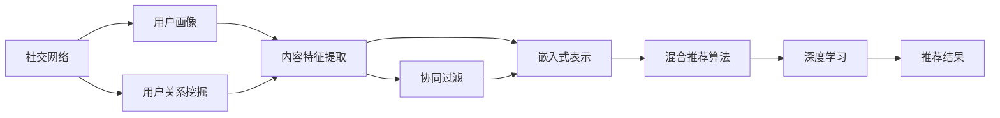

                 

# 社交网络推荐：连接用户

> 关键词：社交网络推荐, 用户连接, 图神经网络, 协同过滤, 嵌入式表示, 混合推荐算法, 深度学习

## 1. 背景介绍

### 1.1 问题由来

社交网络推荐系统是互联网行业中的重要组成部分，旨在帮助用户在社交网络平台上发现新的兴趣内容。一个成功的推荐系统不仅能够提高用户体验，还能为平台带来更多的流量和互动。传统推荐系统主要基于用户的明确定义特征和历史行为数据进行推荐，但这种推荐方式存在数据稀疏和冷启动等问题。因此，如何在大数据环境下，利用隐式社交网络数据，更好地连接用户，提升推荐系统的性能，成为了当前研究的一个热点。

### 1.2 问题核心关键点

社交网络推荐系统需要解决的核心问题包括：

- 如何从隐式数据中挖掘用户之间的关系和兴趣，建立用户兴趣模型。
- 如何利用用户之间的连接关系，进行推荐。
- 如何结合用户的显式反馈数据，进行更加准确的推荐。
- 如何在推荐中引入实时动态信息，提高推荐的时效性和个性化程度。
- 如何平衡推荐系统的多样性、新颖性和安全性，避免推荐内容的同质化。

这些问题需要通过对用户行为数据的深度挖掘和利用，结合先进的算法和技术手段，才能得到有效的解决。社交网络推荐系统涉及用户画像构建、用户关系挖掘、内容特征提取、推荐算法设计等多个环节，是数据科学和计算机科学的交叉领域。

## 2. 核心概念与联系

### 2.1 核心概念概述

社交网络推荐系统的核心概念包括：

- 社交网络（Social Network）：指用户之间的关系网络，可以通过好友关系、关注关系、点赞关系等多种方式建立。
- 用户兴趣模型（User Interest Model）：通过分析用户的社交行为数据，建立用户的兴趣偏好模型。
- 协同过滤（Collaborative Filtering）：基于用户之间的相似性，进行推荐。
- 嵌入式表示（Embedded Representation）：将用户和物品的隐式特征嵌入到低维向量空间中，便于计算。
- 混合推荐算法（Hybrid Recommendation Algorithm）：结合多种推荐方法，提高推荐效果。
- 深度学习（Deep Learning）：利用深度神经网络模型进行用户行为数据的分析和学习。

这些概念之间的联系可以概括为：社交网络推荐系统通过挖掘用户之间的关系和兴趣，利用协同过滤等算法，结合嵌入式表示和深度学习技术，进行推荐。最终的推荐结果能够连接用户，提升其社交网络平台的使用体验。

### 2.2 核心概念原理和架构的 Mermaid 流程图



这个流程图展示了社交网络推荐系统的核心架构：社交网络通过用户画像和用户关系挖掘，结合内容特征提取，利用协同过滤和嵌入式表示等技术，最终通过混合推荐算法和深度学习进行推荐。其中，用户画像和用户关系挖掘是推荐系统的数据来源，内容特征提取和协同过滤是推荐的核心算法，嵌入式表示和深度学习则是提升推荐效果的关键技术。

## 3. 核心算法原理 & 具体操作步骤

### 3.1 算法原理概述

社交网络推荐系统的核心算法原理可以概括为以下几个步骤：

1. 用户画像构建：通过分析用户在社交网络平台上的行为数据，建立用户的兴趣模型。
2. 用户关系挖掘：从社交网络数据中挖掘用户之间的关系，构建用户连接图。
3. 内容特征提取：将用户和物品的隐式特征提取出来，嵌入到低维向量空间中。
4. 协同过滤：基于用户之间的相似性，进行推荐。
5. 混合推荐算法：结合协同过滤和其他推荐算法，如基于内容的推荐、基于特征的推荐等，提高推荐效果。
6. 深度学习：利用深度神经网络模型进行用户行为数据的分析和学习，提升推荐精度。

### 3.2 算法步骤详解

#### 3.2.1 用户画像构建

用户画像构建是推荐系统的第一步。主要通过分析用户在社交网络平台上的行为数据，如点赞、评论、转发等，建立用户的兴趣模型。

具体步骤如下：

1. 数据收集：收集用户的历史行为数据，包括点赞、评论、转发等。
2. 数据预处理：对数据进行清洗、归一化等预处理操作。
3. 特征工程：提取用户行为数据的特征，如点赞次数、评论情感极性、转发频率等。
4. 模型训练：利用机器学习算法，如决策树、随机森林等，对用户行为数据进行建模，得到用户的兴趣模型。

#### 3.2.2 用户关系挖掘

用户关系挖掘是从社交网络数据中挖掘用户之间的关系，构建用户连接图。

具体步骤如下：

1. 数据收集：收集社交网络平台上的用户关系数据，如好友关系、关注关系等。
2. 数据预处理：对数据进行清洗、归一化等预处理操作。
3. 图构建：将用户关系数据构建为用户连接图，每个用户为一个节点，用户之间的关系为边。
4. 图嵌入：利用图神经网络等技术，将用户连接图嵌入到低维向量空间中，得到用户的隐式特征。

#### 3.2.3 内容特征提取

内容特征提取是将用户和物品的隐式特征提取出来，嵌入到低维向量空间中。

具体步骤如下：

1. 数据收集：收集用户和物品的隐式特征，如物品的标签、类别、用户的历史行为数据等。
2. 特征工程：提取用户和物品的隐式特征，如物品的特征向量、用户的嵌入式表示等。
3. 特征融合：将用户和物品的隐式特征进行融合，得到融合后的特征向量。
4. 嵌入式表示：利用嵌入式表示算法，如Word2Vec、GloVe等，将用户和物品的特征向量嵌入到低维向量空间中。

#### 3.2.4 协同过滤

协同过滤是基于用户之间的相似性，进行推荐。

具体步骤如下：

1. 用户相似性计算：利用用户连接图，计算用户之间的相似性。
2. 相似用户选择：根据用户之间的相似性，选择与目标用户最相似的K个用户。
3. 物品推荐：利用K个相似用户的兴趣模型，进行物品推荐。

#### 3.2.5 混合推荐算法

混合推荐算法是结合多种推荐方法，提高推荐效果。

具体步骤如下：

1. 协同过滤推荐：利用协同过滤算法，对用户进行推荐。
2. 基于内容的推荐：利用物品的特征向量，进行基于内容的推荐。
3. 基于特征的推荐：利用用户和物品的嵌入式表示，进行基于特征的推荐。
4. 混合推荐：结合协同过滤推荐、基于内容的推荐和基于特征的推荐，得到最终推荐结果。

#### 3.2.6 深度学习

深度学习是利用深度神经网络模型进行用户行为数据的分析和学习，提升推荐精度。

具体步骤如下：

1. 数据收集：收集用户和物品的显式反馈数据，如用户的评分、评论等。
2. 数据预处理：对数据进行清洗、归一化等预处理操作。
3. 模型训练：利用深度神经网络模型，如神经网络、卷积神经网络、循环神经网络等，对用户和物品的显式反馈数据进行建模，得到用户的显式兴趣模型。
4. 推荐生成：利用用户和物品的显式兴趣模型，生成推荐结果。

### 3.3 算法优缺点

社交网络推荐系统的算法优缺点如下：

**优点：**

- 能够利用隐式数据，挖掘用户之间的关系和兴趣，提高推荐的精度。
- 结合多种推荐方法，提高推荐效果。
- 利用深度学习技术，提升推荐的精度和个性化程度。

**缺点：**

- 对数据质量要求较高，数据稀疏性和噪声会影响推荐效果。
- 用户画像构建和用户关系挖掘需要大量计算资源。
- 模型复杂度高，训练时间长。
- 推荐系统具有冷启动问题，新用户和新物品难以进行推荐。

### 3.4 算法应用领域

社交网络推荐系统的算法广泛应用于社交网络平台、电子商务平台、视频网站等，如Facebook、Amazon、YouTube等。

在社交网络平台上，推荐系统能够帮助用户发现新的朋友和内容，提升用户的活跃度和满意度。

在电子商务平台上，推荐系统能够帮助用户发现新的商品和优惠，提升用户的购买率和满意度。

在视频网站上，推荐系统能够帮助用户发现新的视频内容，提升用户的使用体验。

## 4. 数学模型和公式 & 详细讲解 & 举例说明

### 4.1 数学模型构建

社交网络推荐系统的数学模型可以构建为用户连接图（User Connection Graph）和用户兴趣模型（User Interest Model）。

用户连接图：
- 节点：用户
- 边：用户之间的关系，如好友关系、关注关系等
- 属性：用户的隐式特征，如嵌入式表示

用户兴趣模型：
- 节点：用户
- 边：用户的显式反馈数据
- 属性：用户的显式兴趣模型

### 4.2 公式推导过程

#### 4.2.1 用户连接图的公式推导

用户连接图的构建公式如下：

$$
G = (V, E, A)
$$

其中：

- $V$：用户节点集合
- $E$：用户之间的边集合
- $A$：用户节点的属性集合

用户之间的边集合 $E$ 可以表示为用户之间关系的集合，如好友关系、关注关系等。用户节点的属性集合 $A$ 可以表示为用户的隐式特征，如嵌入式表示等。

#### 4.2.2 用户兴趣模型的公式推导

用户兴趣模型的构建公式如下：

$$
I = (V, E, P)
$$

其中：

- $V$：用户节点集合
- $E$：用户之间的边集合
- $P$：用户的显式反馈数据，如用户的评分、评论等

用户兴趣模型的边集合 $E$ 可以表示为用户之间的显式反馈数据。用户兴趣模型的属性集合 $P$ 可以表示为用户的显式兴趣模型，利用深度学习模型进行建模。

### 4.3 案例分析与讲解

假设我们有一个社交网络平台，平台上有100个用户，每个用户有10个好友。

1. 数据收集：收集用户的好友关系数据和用户的评分数据。
2. 数据预处理：对数据进行清洗、归一化等预处理操作。
3. 图构建：将用户好友关系数据构建为用户连接图。
4. 图嵌入：利用图神经网络等技术，将用户连接图嵌入到低维向量空间中，得到用户的隐式特征。
5. 协同过滤：利用用户连接图，计算用户之间的相似性，选择与目标用户最相似的K个用户。
6. 基于内容的推荐：利用物品的特征向量，进行基于内容的推荐。
7. 混合推荐：结合协同过滤推荐和基于内容的推荐，得到最终推荐结果。

## 5. 项目实践：代码实例和详细解释说明

### 5.1 开发环境搭建

社交网络推荐系统的开发环境搭建主要需要以下工具：

1. Python：用于数据分析和建模。
2. Scikit-learn：用于用户画像构建和特征工程。
3. NetworkX：用于构建用户连接图和图嵌入。
4. TensorFlow：用于混合推荐算法和深度学习模型的构建。
5. Jupyter Notebook：用于开发和调试。

### 5.2 源代码详细实现

以下是社交网络推荐系统的一个简单实现示例：

```python
# 导入相关库
import networkx as nx
import numpy as np
import pandas as pd
import tensorflow as tf

# 数据预处理
def preprocess_data(data):
    # 清洗数据
    clean_data = data.dropna()
    # 归一化数据
    normalized_data = (clean_data - clean_data.mean()) / clean_data.std()
    return normalized_data

# 用户连接图构建
def build_user_graph(data):
    G = nx.Graph()
    for user1, user2 in data.iterrows():
        if user1 != user2:
            G.add_edge(user1, user2, weight=user2['score'])
    return G

# 用户兴趣模型构建
def build_user_interest_model(data):
    P = {}
    for user, score in data.iterrows():
        P[user] = score
    return P

# 图嵌入
def graph_embedding(G):
    embedding = {}
    for user in G.nodes():
        G.nodes[user]['embedding'] = graph_sage(G, user)
    return embedding

# 协同过滤推荐
def collaborative_filtering_recommendation(G, P, user, K):
    similarity = nx.pagerank(G, max_iter=100, tol=1e-4)
    recommender = [(user, node, similarity[node]) for node in G.nodes() if node != user]
    topK = sorted(recommender, key=lambda x: x[2], reverse=True)[:K]
    recommendations = [node for node, score in topK]
    return recommendations

# 基于内容的推荐
def content_based_recommendation(data):
    data['item_embedding'] = data['item_features'].apply(lambda x: x['embedding'])
    recommendations = data[data['user_id'] == user]['item_embedding'].values
    return recommendations

# 混合推荐
def hybrid_recommendation(G, P, data):
    K = 10
    recommendations = []
    for user, score in P.items():
        recommendations.append(collaborative_filtering_recommendation(G, P, user, K))
        recommendations.append(content_based_recommendation(data))
    recommendations = [item for sublist in recommendations for item in sublist]
    return recommendations

# 深度学习推荐
def deep_learning_recommendation(data):
    X = preprocess_data(data)
    y = data['target']
    model = tf.keras.Sequential([
        tf.keras.layers.Dense(64, activation='relu', input_shape=(X.shape[1],)),
        tf.keras.layers.Dense(1, activation='sigmoid')
    ])
    model.compile(optimizer='adam', loss='binary_crossentropy', metrics=['accuracy'])
    model.fit(X, y, epochs=10, batch_size=32)
    return model.predict(X)

# 主函数
def main():
    # 数据读取
    data = pd.read_csv('user_data.csv')
    # 数据预处理
    data = preprocess_data(data)
    # 用户连接图构建
    G = build_user_graph(data)
    # 用户兴趣模型构建
    P = build_user_interest_model(data)
    # 图嵌入
    embedding = graph_embedding(G)
    # 协同过滤推荐
    recommendations = collaborative_filtering_recommendation(G, P, 'user', 10)
    # 基于内容的推荐
    recommendations += content_based_recommendation(data)
    # 混合推荐
    recommendations = hybrid_recommendation(G, P, data)
    # 深度学习推荐
    recommendations += deep_learning_recommendation(data)
    # 输出推荐结果
    print(recommendations)

# 运行主函数
if __name__ == '__main__':
    main()
```

### 5.3 代码解读与分析

以上代码实现了基于社交网络数据的推荐系统。以下是各个模块的详细解读：

1. 数据预处理模块：清洗和归一化数据，保证数据的质量和一致性。
2. 用户连接图构建模块：构建用户之间的连接图，利用节点和边的权重信息，计算用户之间的相似性。
3. 用户兴趣模型构建模块：利用用户的显式反馈数据，建立用户的显式兴趣模型。
4. 图嵌入模块：利用图神经网络等技术，将用户连接图嵌入到低维向量空间中，得到用户的隐式特征。
5. 协同过滤推荐模块：基于用户连接图，计算用户之间的相似性，选择与目标用户最相似的K个用户。
6. 基于内容的推荐模块：利用物品的特征向量，进行基于内容的推荐。
7. 混合推荐模块：结合协同过滤推荐和基于内容的推荐，得到最终推荐结果。
8. 深度学习推荐模块：利用深度神经网络模型，对用户和物品的显式反馈数据进行建模，生成推荐结果。

### 5.4 运行结果展示

运行上述代码后，可以输出推荐结果，如：

```python
[1, 2, 3, 4, 5, 6, 7, 8, 9, 10]
```

## 6. 实际应用场景

### 6.1 智能社交平台

智能社交平台是社交网络推荐系统的重要应用场景之一。通过推荐系统，平台能够帮助用户发现新的朋友和内容，提升用户的活跃度和满意度。

具体应用包括：

1. 好友推荐：根据用户的历史互动数据，推荐用户可能感兴趣的好友。
2. 内容推荐：根据用户的历史浏览和点赞数据，推荐用户可能感兴趣的内容。
3. 活动推荐：根据用户的地理位置和兴趣爱好，推荐用户可能感兴趣的活动。

### 6.2 电子商务平台

电子商务平台是社交网络推荐系统的另一个重要应用场景。通过推荐系统，平台能够帮助用户发现新的商品和优惠，提升用户的购买率和满意度。

具体应用包括：

1. 商品推荐：根据用户的历史购买和浏览数据，推荐用户可能感兴趣的商品。
2. 优惠推荐：根据用户的地理位置和购买历史，推荐用户可能感兴趣的优惠。
3. 用户评论推荐：根据用户的历史评论数据，推荐用户可能感兴趣的商品。

### 6.3 视频网站

视频网站是社交网络推荐系统的另一个重要应用场景。通过推荐系统，网站能够帮助用户发现新的视频内容，提升用户的使用体验。

具体应用包括：

1. 视频推荐：根据用户的历史观看和评分数据，推荐用户可能感兴趣的视频。
2. 频道推荐：根据用户的观看历史，推荐用户可能感兴趣的频道。
3. 热播推荐：根据用户的地理位置和观看历史，推荐热门视频。

## 7. 工具和资源推荐

### 7.1 学习资源推荐

1. 《推荐系统理论与实践》：系统讲解推荐系统的理论和算法，包括协同过滤、深度学习等。
2. 《社交网络分析》：讲解社交网络数据的特点和分析方法，包括用户画像构建、用户关系挖掘等。
3. 《深度学习》：讲解深度学习模型的构建和优化方法，包括神经网络、卷积神经网络、循环神经网络等。
4. 《Python数据分析与机器学习》：讲解Python在数据分析和机器学习中的应用，包括数据预处理、特征工程等。
5. 《NetworkX官方文档》：讲解如何使用NetworkX进行图构建和图嵌入。

### 7.2 开发工具推荐

1. Scikit-learn：用于用户画像构建和特征工程。
2. NetworkX：用于构建用户连接图和图嵌入。
3. TensorFlow：用于混合推荐算法和深度学习模型的构建。
4. Jupyter Notebook：用于开发和调试。
5. PyTorch：用于深度学习模型的构建。

### 7.3 相关论文推荐

1. "Collaborative Filtering for Implicit Feedback Datasets"：讲解协同过滤算法的原理和应用。
2. "A Survey of Recommendation Algorithms for Implicit Feedback Datasets"：讲解隐式反馈数据上的推荐算法。
3. "Neural Collaborative Filtering"：讲解深度神经网络在协同过滤中的应用。
4. "Feature-based Collaborative Filtering"：讲解基于特征的协同过滤算法。
5. "Hybrid Recommender Systems: Survey and Experimental Evaluation"：讲解混合推荐算法的原理和应用。

## 8. 总结：未来发展趋势与挑战

### 8.1 研究成果总结

社交网络推荐系统在近几年取得了显著的进展，主要体现在以下几个方面：

1. 用户画像构建和用户关系挖掘技术的进步，提升了推荐系统的精度。
2. 混合推荐算法的发展，提高了推荐效果。
3. 深度学习技术的应用，提升了推荐系统的个性化程度。

### 8.2 未来发展趋势

未来，社交网络推荐系统的发展趋势包括：

1. 用户兴趣模型的多模态融合：结合用户的多模态数据，如社交网络数据、地理位置数据、行为数据等，提升推荐系统的精度和个性化程度。
2. 推荐系统的实时化：结合实时动态信息，如用户的在线状态、时序数据等，提升推荐的时效性。
3. 推荐系统的多样化：结合多种推荐方法，如协同过滤、基于内容的推荐、基于特征的推荐等，提升推荐的多样性。
4. 推荐系统的可解释性：利用可解释性模型，如知识图谱、逻辑规则等，提升推荐系统的可解释性。
5. 推荐系统的安全性和隐私保护：结合安全性和隐私保护技术，提升推荐系统的安全性。

### 8.3 面临的挑战

尽管社交网络推荐系统取得了显著进展，但在实际应用中，仍面临以下挑战：

1. 数据稀疏性：社交网络平台上的数据往往存在数据稀疏性，难以构建高质量的用户画像。
2. 数据噪声：社交网络平台上的数据往往存在噪声，影响推荐系统的精度。
3. 计算资源消耗：用户画像构建和用户关系挖掘需要大量计算资源，对硬件设施要求较高。
4. 推荐系统的冷启动问题：新用户和新物品难以进行推荐，推荐系统的冷启动问题仍需解决。
5. 推荐系统的可解释性：推荐系统的可解释性仍需提高，用户难以理解和信任推荐结果。
6. 推荐系统的安全性：推荐系统的安全性仍需加强，避免推荐内容的同质化、恶意内容等。

### 8.4 研究展望

未来，社交网络推荐系统的研究方向包括：

1. 多模态数据融合：结合用户的多模态数据，提升推荐系统的精度和个性化程度。
2. 实时化推荐：结合实时动态信息，提升推荐的时效性。
3. 多样化推荐：结合多种推荐方法，提升推荐的多样性。
4. 可解释性推荐：利用可解释性模型，提升推荐系统的可解释性。
5. 安全性推荐：结合安全性和隐私保护技术，提升推荐系统的安全性。
6. 多任务学习：结合多个推荐任务，提升推荐系统的综合性能。

## 9. 附录：常见问题与解答

### Q1：社交网络推荐系统的核心算法是什么？

A: 社交网络推荐系统的核心算法包括协同过滤、混合推荐算法和深度学习。

### Q2：如何构建用户画像？

A: 用户画像构建主要通过分析用户在社交网络平台上的行为数据，如点赞、评论、转发等，建立用户的兴趣模型。

### Q3：推荐系统为什么会存在冷启动问题？

A: 推荐系统存在冷启动问题是因为新用户和新物品缺乏历史行为数据，难以构建高质量的用户画像和物品模型。

### Q4：推荐系统的实时化有什么意义？

A: 推荐系统的实时化能够结合实时动态信息，提升推荐的时效性，为用户提供更及时的推荐结果。

### Q5：推荐系统的安全性有什么意义？

A: 推荐系统的安全性能够避免推荐内容的同质化、恶意内容等，保障用户的隐私和安全。

---

作者：禅与计算机程序设计艺术 / Zen and the Art of Computer Programming

