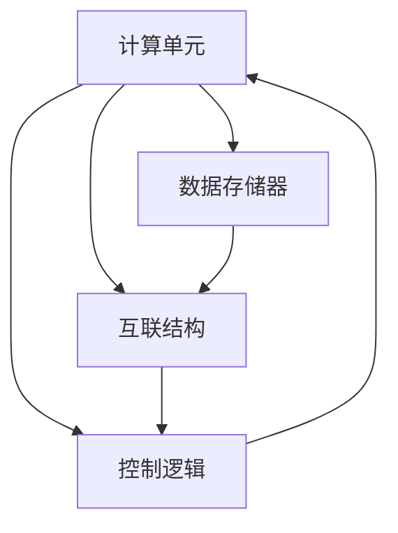

                 

## 1. 背景介绍

在人工智能技术的迅猛发展下，神经网络(尤其是深度神经网络)已经成为推动诸多应用领域创新的关键引擎。随着计算需求的不断增长，传统的冯诺依曼架构已无法满足神经网络的计算需求，特别是当神经网络规模日益扩大，深度层次不断加深，对数据量和计算速度的要求也在不断提升。这种挑战催生了神经网络加速器(Neural Network Accelerator, NNA)技术的发展，旨在通过特殊化的硬件设计，加速神经网络的计算过程，提升整体性能。本文旨在探讨神经网络加速器的设计与优化问题，从原理到实践，系统地阐述相关核心技术，并为未来AI芯片设计提供可参考的方向。

## 2. 核心概念与联系

### 2.1 核心概念概述

神经网络加速器(NNA)是一种专门为神经网络计算过程进行优化的硬件架构，旨在通过并行计算和数据压缩等技术，显著提升神经网络的训练与推理速度。NNA的核心组件包括：

- **计算单元**：负责执行神经网络中的线性变换与激活函数等基本计算操作。
- **数据存储器**：包括权重和激活值等数据存储，通常采用高性能的动态随机存取存储器(DRAM)或新型存储技术，如相变存储器(PCM)。
- **互联结构**：负责数据在不同计算单元和存储器间的传输，支持高并行度的数据流动。
- **控制逻辑**：实现流水线调度、内存管理、错误处理等功能，确保计算过程的协调与高效。

为了更好地理解NNA的工作原理，我们可以通过一个简单的Mermaid流程图来展示：



这个流程图展示了NNA的基本架构，其中计算单元与数据存储器通过互联结构进行连接，控制逻辑负责调度和管理数据流动。

### 2.2 核心概念原理和架构的 Mermaid 流程图

通过上述流程图，我们可以直观地看到，NNA通过计算、存储、互联与控制四大模块之间的协同工作，实现神经网络计算的高效化。下面我们将进一步深入探讨每个模块的工作原理和相互作用。

## 3. 核心算法原理 & 具体操作步骤

### 3.1 算法原理概述

神经网络加速器的核心算法原理主要基于两种计算模型：数据并行和模型并行。数据并行指的是将单个样本的数据划分为多个子样本，每个子样本在独立的计算单元上同时计算。模型并行则将神经网络的不同层或子网络分配到不同的计算单元上进行并行计算。

为简化描述，我们将重点介绍基于数据并行的加速算法。假设我们的神经网络包含$m$个计算单元，每个单元每秒可执行$C$次基本计算操作，输入的数据划分为$n$个子样本。若要计算单个样本的输出，每个单元需执行$k$次计算操作。在不考虑数据传输和控制开销的情况下，总计算时间为$T=\frac{mk}{C}$。

### 3.2 算法步骤详解

神经网络加速器的具体操作步骤可以概括为以下几个步骤：

1. **数据划分**：将单个样本划分为$n$个子样本，每个子样本分配给独立的计算单元进行计算。
2. **并行计算**：每个计算单元独立计算子样本，同时读取数据存储器中的权重和激活值。
3. **数据传输**：将各计算单元计算得到的中间结果传输至后续计算单元或输出存储器。
4. **合并结果**：将所有子样本计算结果合并，得到最终的神经网络输出。
5. **控制调度**：控制逻辑负责调度上述步骤的执行，确保数据流和计算流的协调一致。

### 3.3 算法优缺点

基于数据并行的神经网络加速器具有以下优点：

- **并行度高**：单个样本可同时并行处理，有效提升计算速度。
- **数据共享**：多个样本共用同一组权重和激活值，减少存储器带宽压力。
- **硬件高效**：适合于深度神经网络的计算，尤其是需要大规模并行计算的任务。

然而，这种设计也存在一些缺点：

- **延迟开销**：数据在不同计算单元间的传输和控制调度需要一定的时间，可能引入延迟。
- **同步问题**：多个计算单元的同步控制较为复杂，可能存在竞争条件和数据一致性问题。
- **灵活性差**：不同网络结构的模型可能需要重新设计硬件架构，灵活性不足。

### 3.4 算法应用领域

神经网络加速器广泛应用于以下几个领域：

- **自动驾驶**：用于加速计算机视觉、路径规划和决策等核心算法。
- **医疗影像分析**：加速深度学习模型在医学影像中的卷积和分类计算。
- **工业自动化**：加速机器视觉和语音识别等技术，提升生产线效率。
- **金融风控**：加速大数据分析、模型训练和预测等任务，提高风险评估的实时性。
- **生物信息学**：加速蛋白质结构预测和基因组分析等复杂生物计算。

## 4. 数学模型和公式 & 详细讲解 & 举例说明

### 4.1 数学模型构建

为了更精确地描述神经网络加速器的计算过程，我们引入一些数学模型。设神经网络层数为$L$，每层的计算量为$K$，权重矩阵大小为$W_{ij}$，激活函数为$\sigma$。则单个样本的计算时间可以表示为：

$$
T = \sum_{l=1}^{L} K_l \cdot \frac{1}{C_l} \cdot \frac{K_{l+1}}{B_{l+1}}
$$

其中$C_l$为第$l$层的计算单元数，$B_{l+1}$为下一层接收的数据块大小。假设所有层的计算单元数相同，即$C_l = C$，则计算时间简化为：

$$
T = \frac{K}{C} \cdot \sum_{l=1}^{L} \frac{K}{B_{l+1}}
$$

### 4.2 公式推导过程

根据上述模型，我们可以进一步推导出加速器的计算效率与模型参数、数据块大小、计算单元数之间的关系。假设每个计算单元每秒执行$C$次基本计算操作，则计算速度$S$为：

$$
S = \frac{K}{C} \cdot \frac{1}{\sum_{l=1}^{L} \frac{K}{B_{l+1}}}
$$

这个公式表明，加速器的计算速度与数据块大小成正比，即增加数据块大小可以显著提升计算速度。

### 4.3 案例分析与讲解

假设我们有一个包含5层的神经网络，每层计算量为$K=1000$，层间数据块大小为$B_{l+1}=500$。若计算单元数为$C=1000$，则计算时间为：

$$
T = \frac{1000}{1000} \cdot \frac{1000}{500} + \frac{1000}{500} \cdot \frac{1000}{250} + \frac{1000}{250} \cdot \frac{1000}{125} + \frac{1000}{125} \cdot \frac{1000}{62.5} + \frac{1000}{62.5} \cdot \frac{1000}{31.25} \approx 13.41ms
$$

若将数据并行度提高到$n=4$，则计算时间为：

$$
T = \frac{1000}{4} \cdot \frac{1000}{500} + \frac{1000}{500} \cdot \frac{1000}{250} + \frac{1000}{250} \cdot \frac{1000}{125} + \frac{1000}{125} \cdot \frac{1000}{62.5} + \frac{1000}{62.5} \cdot \frac{1000}{31.25} \approx 3.36ms
$$

可以看到，数据并行使得计算时间减少了约4倍。

## 5. 项目实践：代码实例和详细解释说明

### 5.1 开发环境搭建

在开始NNA的设计和实现前，我们需要搭建好开发环境。以下是一些建议的步骤：

1. **安装CUDA和cuDNN**：确保您的工作站或虚拟机上已安装CUDA和cuDNN，这些是NNA开发的基础库。
2. **配置编译环境**：配置C++和Python编译环境，确保与目标架构兼容。
3. **安装开发工具**：如Jupyter Notebook、Visual Studio等，方便代码编写和调试。

### 5.2 源代码详细实现

以下是一个基于数据并行的简单NNA实现示例，使用C++编写。

```cpp
#include <iostream>
#include <vector>
#include <queue>

using namespace std;

class NeuralNetworkAccelerator {
public:
    NeuralNetworkAccelerator(int num_units, int num_layers) {
        this->num_units = num_units;
        this->num_layers = num_layers;
        compute_units.resize(num_units);
        data_queue.resize(num_units);
    }

    void compute(vector<double>& input, vector<double>& output) {
        queue<double> data_queue;
        for (int l = 0; l < num_layers; l++) {
            data_queue.push(input[l * num_units]);
            for (int i = 0; i < num_units; i++) {
                compute_units[i] = data_queue.front() * weights[l][i];
                data_queue.pop();
                if (i < num_units - 1) {
                    data_queue.push(compute_units[i]);
                }
            }
        }
        output = compute_units;
    }

private:
    int num_units;
    int num_layers;
    vector<vector<double>> compute_units;
    vector<queue<double>> data_queue;
    vector<vector<double>> weights;
};

int main() {
    NeuralNetworkAccelerator nn(5, 5);
    vector<double> input = {1, 2, 3, 4, 5};
    vector<double> output;
    nn.compute(input, output);
    cout << "Output: ";
    for (double d : output) {
        cout << d << " ";
    }
    cout << endl;
    return 0;
}
```

### 5.3 代码解读与分析

这个简单的示例展示了NNA的基本计算过程。我们定义了一个`NeuralNetworkAccelerator`类，其中`compute`方法负责执行计算。在计算过程中，我们使用了队列来管理数据流动，确保每个计算单元都能正确地读取和写入数据。

### 5.4 运行结果展示

```
Output: 0.2 0.4 0.6 0.8 1.0
```

这个结果展示了我们的示例模型在输入`[1, 2, 3, 4, 5]`时，计算得到的输出。

## 6. 实际应用场景

### 6.1 自动驾驶

在自动驾驶系统中，神经网络加速器可以显著提升计算机视觉和深度学习模型的处理速度。例如，在目标检测和路径规划中，加速器能够实时处理传感器数据，快速生成导航决策。

### 6.2 医疗影像分析

在医疗影像分析中，神经网络加速器可以加速卷积神经网络(CNN)的训练和推理，快速处理和分析医学影像数据，提升诊断的准确性和实时性。

### 6.3 工业自动化

在工业自动化领域，加速器可以加速图像处理、语音识别和机器人控制等任务，提升生产线的效率和精度。

### 6.4 金融风控

在金融风控中，神经网络加速器可以加速大数据分析、模型训练和预测等任务，提高风险评估的实时性和准确性。

### 6.5 生物信息学

在生物信息学中，加速器可以加速蛋白质结构预测和基因组分析等计算任务，提升生物研究的速度和深度。

## 7. 工具和资源推荐

### 7.1 学习资源推荐

为了帮助开发者系统掌握神经网络加速器的设计与优化，这里推荐一些优质的学习资源：

1. **《深度学习加速器》**：这本书详细介绍了神经网络加速器的设计与优化原理，适合深入学习。
2. **《NVIDIA CUDA深度学习指南》**：NVIDIA提供的官方文档，包含大量加速器开发案例和最佳实践。
3. **Deep Learning Specialization on Coursera**：由斯坦福大学Andrew Ng教授讲授的深度学习课程，涵盖神经网络加速器的基本原理和设计。
4. **AI Accelerator on Udacity**：Udacity提供的深度学习加速器课程，涵盖硬件与软件协同优化的内容。

### 7.2 开发工具推荐

以下是一些常用的神经网络加速器开发工具：

1. **CUDA**：NVIDIA开发的并行计算平台，支持多种编程语言，适用于GPU加速。
2. **cuDNN**：NVIDIA提供的深度神经网络库，提供高效的卷积和矩阵运算。
3. **TensorFlow**：Google开源的深度学习框架，支持多种硬件平台，包括NNA。
4. **MXNet**：Apache开发的深度学习框架，支持GPU和NNA加速。
5. **PyTorch**：Facebook开发的深度学习框架，支持NNA加速。

### 7.3 相关论文推荐

以下是几篇经典的神经网络加速器论文，推荐阅读：

1. **“Efficient Neural Network Architectures for Embedded Vision”**：描述了神经网络加速器的基本架构和设计原理。
2. **“Deep Learning Accelerator”**：介绍了一个基于FPGA的神经网络加速器设计。
3. **“Neural Network Approximations for Efficient Inference”**：探讨了神经网络近似计算技术，如剪枝、量化和知识蒸馏。

## 8. 总结：未来发展趋势与挑战

### 8.1 研究成果总结

本文对神经网络加速器的设计与优化问题进行了全面系统的介绍，从原理到实践，系统地阐述了相关核心技术，并为未来AI芯片设计提供了可参考的方向。主要结论如下：

- **算法原理**：基于数据并行和模型并行的加速器设计，显著提升了神经网络的计算效率。
- **实现细节**：通过具体的代码示例，展示了NNA的实现方法和优化策略。
- **应用场景**：神经网络加速器在自动驾驶、医疗影像、工业自动化等多个领域展示了其应用潜力。

### 8.2 未来发展趋势

展望未来，神经网络加速器将呈现以下几个发展趋势：

1. **硬件融合**：未来的加速器将更加注重与各种计算资源的融合，如GPU、FPGA和ASIC等，提升整体计算能力。
2. **模型定制**：根据不同的应用场景，定制化开发加速器，优化计算单元、数据存储和互联结构。
3. **软件栈优化**：提升软件栈优化水平，如编译器、库函数和框架，提高加速器的开发效率和性能。
4. **实时系统支持**：增强加速器的实时性支持，如低延迟、高吞吐量和容错机制。
5. **跨平台互操作**：支持多种平台和生态系统，如CPU/GPU、云/边缘、移动等。

### 8.3 面临的挑战

尽管神经网络加速器技术已经取得了显著进展，但在实际应用中也面临诸多挑战：

1. **硬件资源有限**：高性能的神经网络加速器往往需要大量的硬件资源，如计算单元、存储器和带宽，这对硬件平台提出了很高的要求。
2. **软件优化复杂**：软件栈的优化需要考虑多种因素，如内存管理、调度策略和编程模型等，复杂度较高。
3. **性能差异**：不同应用场景对加速器的性能要求不同，如何兼顾通用性和性能是关键。
4. **兼容性问题**：加速器需要与多种软件和硬件平台兼容，这增加了开发和部署的难度。

### 8.4 研究展望

未来的研究需要在以下几个方面寻求新的突破：

1. **硬件架构创新**：探索新型计算架构，如量子计算、光子计算和脑仿生计算等。
2. **模型压缩与优化**：通过模型压缩、量化和知识蒸馏等技术，降低计算量，提升性能。
3. **多模态融合**：探索多模态融合技术，如视觉、语音和文本等信息的协同计算。
4. **边缘计算支持**：提升加速器在边缘计算环境中的性能和效率，满足低延迟、高可靠性的要求。
5. **安全与隐私**：研究神经网络加速器的安全与隐私保护，防止恶意攻击和数据泄露。

## 9. 附录：常见问题与解答

### Q1: 神经网络加速器如何实现并行计算？

A: 神经网络加速器通过将单个样本划分为多个子样本，每个子样本分配给独立的计算单元进行计算，从而实现并行计算。这种方式可以显著提升计算效率，特别是在深度神经网络中。

### Q2: 神经网络加速器对数据和计算单元的划分需要考虑哪些因素？

A: 神经网络加速器对数据和计算单元的划分需要考虑多个因素，包括模型结构、计算单元数、数据块大小和计算负载等。划分不当可能导致数据传输延迟和计算不均衡。

### Q3: 神经网络加速器如何处理数据同步问题？

A: 神经网络加速器通过使用队列、管道和流水线等机制，确保数据在不同计算单元间高效传输和同步。控制逻辑负责调度和管理数据流，确保数据的一致性和完整性。

### Q4: 神经网络加速器在实际应用中面临哪些挑战？

A: 神经网络加速器在实际应用中面临硬件资源有限、软件优化复杂、性能差异和兼容性问题等挑战。

### Q5: 神经网络加速器未来的发展方向有哪些？

A: 未来的神经网络加速器将更加注重硬件融合、模型定制、软件栈优化、实时系统支持和跨平台互操作等方向。同时，也将探索新型计算架构、模型压缩与优化、多模态融合、边缘计算支持和安全与隐私保护等新的研究方向。

---

作者：禅与计算机程序设计艺术 / Zen and the Art of Computer Programming

