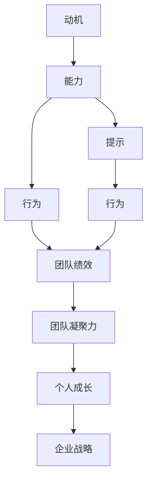

                 

# 福格行为模型在团队建设中的应用

## 1. 背景介绍

### 1.1 问题由来

在当今快速变化和高度竞争的商业环境中，团队建设变得尤为重要。一个高效的团队不仅能够提高企业的生产力，还能够增强员工的幸福感和企业的整体韧性。然而，团队建设是一个复杂且多变的过程，涉及多种因素，包括但不限于目标设定、团队动力、沟通方式和成员之间的信任等。

福格行为模型（Fogg's Model），或称“Fogg行为模型”，由行为设计师B.J.福格提出，旨在帮助人们理解行为改变背后的机制，并设计出有效的方法来促进行为改变。这个模型在团队建设中的应用，可以提供一种系统性的方式来理解团队成员的行为，从而设计出更加有效的团队发展策略。

### 1.2 问题核心关键点

福格行为模型将行为改变分解为三个关键要素：动机（Motivation）、能力（Ability）和提示（Prompts）。这三个要素的交互作用，能够促使人们进行特定的行为。

- **动机**：是指人们进行某一行为的愿望或驱动力，可以是内在的（如成就感、归属感）也可以是外在的（如奖励、惩罚）。
- **能力**：是指执行某一行为所需的技能和资源，包括时间、金钱、知识等。
- **提示**：是指能够触发行为的外部或内部信号，包括物理环境、心理状态、社会环境等。

团队建设中，这三个要素的优化和协调，能够帮助团队成员更好地完成目标，提升团队的绩效和凝聚力。

### 1.3 问题研究意义

研究福格行为模型在团队建设中的应用，对于提升团队的效率和凝聚力具有重要意义：

1. **提升团队绩效**：通过理解并优化团队的动机、能力和提示，可以显著提升团队成员的参与度和执行力度，从而提高团队的整体绩效。
2. **增强团队凝聚力**：设计合适的动机和能力支持机制，以及有针对性的提示，能够增强团队成员的归属感和合作意愿，提升团队凝聚力。
3. **促进个人成长**：行为模型不仅关注团队的集体目标，还关注个体成员的个人成长和职业发展，有助于培养团队成员的技能和能力。
4. **支持企业战略**：团队建设的成功是企业战略落地的关键，行为模型提供了一种系统化的框架，帮助企业实现战略目标。

## 2. 核心概念与联系

### 2.1 核心概念概述

为更好地理解福格行为模型在团队建设中的应用，本节将介绍几个密切相关的核心概念：

- **行为设计**：行为设计是一种系统化的方法，旨在理解和设计出促进行为改变的各种策略。福格行为模型是行为设计的重要理论基础之一。
- **动机**：动机是指驱动人们进行某一行为的内在和外在因素。在团队建设中，了解团队成员的动机，有助于设计出有吸引力的激励机制。
- **能力**：能力是指执行某一行为所需的技能和资源。在团队建设中，通过培训和资源分配，提升团队成员的能力，有助于提高团队的执行力。
- **提示**：提示是指能够触发行为的外部或内部信号。在团队建设中，通过优化工作流程和沟通方式，提供有效的提示，能够促进团队成员之间的合作和沟通。
- **持续改变**：行为改变不仅仅是短期的，还需要通过持续的努力和反馈，实现长期的改进和优化。在团队建设中，持续改进和优化是保持团队高效运作的关键。

这些核心概念之间的逻辑关系可以通过以下Mermaid流程图来展示：



这个流程图展示了大语言模型的核心概念及其之间的关系：

1. 动机和能力共同驱动行为，产生团队绩效。
2. 提示可以促进行为，增强团队凝聚力。
3. 行为模型的应用促进个人成长和支持企业战略。

这些概念共同构成了福格行为模型的基本框架，为其在团队建设中的应用提供了理论依据。

## 3. 核心算法原理 & 具体操作步骤
### 3.1 算法原理概述

福格行为模型在团队建设中的应用，主要集中在如何通过动机、能力和提示三个要素的优化，来促进行为改变，从而提升团队绩效和凝聚力。其核心思想是：

- **动机激发**：通过设定具有挑战性的目标，利用奖励和认可机制，激发团队成员的内在和外在动机。
- **能力增强**：通过培训、资源分配和团队合作，提升团队成员的能力和资源，降低行为执行的难度。
- **提示优化**：通过优化工作流程、沟通方式和环境设计，提供有效的提示，促使团队成员采取期望的行为。

### 3.2 算法步骤详解

福格行为模型在团队建设中的应用可以分为以下几个关键步骤：

**Step 1: 动机分析**

- **目标设定**：设定具有挑战性和可达性的团队目标，激发团队成员的内在动机（如成就感、责任感）和外在动机（如奖励、晋升）。
- **动机评估**：通过问卷调查、面谈等方式，评估团队成员的动机水平，了解其行为改变的动机来源。

**Step 2: 能力评估**

- **技能和资源评估**：识别团队成员所需的技能和资源，包括时间、金钱、知识等，评估当前团队在执行任务时的能力。
- **能力提升计划**：制定培训和资源分配计划，提升团队成员的能力，尤其是那些对实现团队目标至关重要的技能。

**Step 3: 提示设计**

- **工作流程优化**：设计高效的工作流程，减少不必要的步骤，提高任务执行的效率。
- **沟通方式优化**：采用有效的沟通方式，如定期会议、团队讨论、即时消息等，确保信息流通顺畅。
- **环境设计**：优化物理环境和心理状态，提供必要的工具和资源，减少执行任务时的阻力。

**Step 4: 实施与反馈**

- **行为实施**：根据动机、能力和提示的设计，实施具体的行为改变策略。
- **持续反馈**：通过定期的评估和反馈，调整和优化策略，确保行为改变的持续性和有效性。

**Step 5: 持续改进**

- **持续学习**：鼓励团队成员进行持续学习，提升个人和团队的能力。
- **反馈循环**：建立正向的反馈循环，奖励行为改变的积极成果，鼓励团队成员不断改进。

### 3.3 算法优缺点

福格行为模型在团队建设中的应用，具有以下优点：

- **系统化**：模型提供了一个系统化的框架，帮助团队管理者全面理解团队行为背后的机制，设计出全面的改进策略。
- **可操作性强**：模型的三个要素（动机、能力和提示）都是具体可操作的，易于实施和评估。
- **灵活性高**：模型可以根据不同的团队和任务需求进行定制化设计，灵活性高。

同时，该模型也存在一定的局限性：

- **复杂性高**：模型涉及到多个要素的交互，实施和评估过程相对复杂。
- **个性化不足**：模型的设计需要考虑到团队整体的需求，可能无法充分考虑到个体成员的个性化需求。
- **依赖数据**：模型的有效应用需要依赖大量的数据进行分析和评估，数据获取和处理成本较高。

尽管存在这些局限性，但就目前而言，福格行为模型在团队建设中的应用仍然是一种有效的方法。未来相关研究的重点在于如何进一步简化模型应用过程，提升其个性化和自动化程度。

### 3.4 算法应用领域

福格行为模型在团队建设中的应用广泛，可以应用于以下几个主要领域：

- **企业团队建设**：在企业内部，通过优化工作流程、提升员工能力和提供有效的提示，促进团队的高效运作和绩效提升。
- **项目团队管理**：在项目团队中，通过设定明确的目标、提供必要的资源和优化沟通方式，确保项目的顺利进行和高质量交付。
- **创新团队建设**：在创新团队中，通过激发成员的创造力和探索精神，提升团队的创新能力和问题解决能力。
- **跨职能团队管理**：在跨职能团队中，通过增强团队成员的协作能力和资源共享，促进不同职能部门之间的有效沟通和合作。
- **虚拟团队建设**：在虚拟团队中，通过优化远程协作工具和沟通方式，确保团队成员之间的有效连接和信息流通。

福格行为模型在上述领域的广泛应用，展示了其在团队建设中的强大潜力和广泛价值。

## 4. 数学模型和公式 & 详细讲解 & 举例说明

### 4.1 数学模型构建

福格行为模型在团队建设中的应用，可以抽象为一个数学模型。假设团队的目标为 $T$，团队成员的动机为 $M$，能力为 $C$，提示为 $P$。团队绩效为 $F$，团队凝聚力为 $I$。则福格行为模型的数学模型可以表示为：

$$
F = \phi(M, C, P)
$$

其中，$\phi$ 表示一个函数，映射动机、能力和提示三要素到团队绩效。

### 4.2 公式推导过程

假设 $M_i$ 表示第 $i$ 个团队成员的动机强度，$C_i$ 表示其执行任务所需的能力，$P_i$ 表示第 $i$ 个团队成员接收到提示的数量和强度。则团队绩效 $F$ 可以表示为：

$$
F = \sum_{i=1}^n M_i \cdot C_i \cdot P_i
$$

其中 $n$ 表示团队成员的数量。

通过上述公式，我们可以看出，团队绩效是动机、能力和提示三要素的乘积。动机越强，能力越高，提示越有效，团队绩效越好。

### 4.3 案例分析与讲解

假设一个团队负责开发一个新产品。团队目标 $T$ 是按时高质量完成产品的开发和交付。团队成员 $M_1, M_2, ..., M_n$ 的动机强度不同，能力水平也不同，但他们共同收到来自经理的定期进展汇报和团队合作的提示。

1. **动机分析**：通过问卷调查和面谈，评估团队成员的动机强度。例如，某成员对产品开发充满热情，希望通过成功实现职业晋升。

2. **能力评估**：识别开发新产品所需的技能，包括编程、测试、设计等。评估团队成员在这些技能上的能力，确定哪些成员需要额外的培训。

3. **提示设计**：设计定期进展汇报和团队合作提示，确保信息流通顺畅。例如，每周一次的团队会议，以及每日的即时沟通工具。

通过上述步骤，团队能够有效地进行新产品开发，最终按时高质量完成产品，并增强了团队成员的合作意愿和凝聚力。

## 5. 项目实践：代码实例和详细解释说明

### 5.1 开发环境搭建

在进行团队建设的行为设计时，需要准备相关的开发环境。以下是使用Python进行行为模型应用的环境配置流程：

1. 安装Anaconda：从官网下载并安装Anaconda，用于创建独立的Python环境。

2. 创建并激活虚拟环境：
```bash
conda create -n behavior-design-env python=3.8 
conda activate behavior-design-env
```

3. 安装Python相关包：
```bash
pip install pandas numpy matplotlib seaborn plotly
```

4. 安装行为模型相关工具：
```bash
pip install behavioral-design-toolkit
```

完成上述步骤后，即可在`behavior-design-env`环境中开始行为模型应用的开发。

### 5.2 源代码详细实现

以下是一个简单的行为模型应用示例，用于评估团队成员的动机、能力和提示，并设计出改进策略。

```python
import pandas as pd
import matplotlib.pyplot as plt

# 准备动机数据
motivation_data = pd.read_csv('motivation_data.csv')
motivation_data.head()

# 准备能力数据
ability_data = pd.read_csv('ability_data.csv')
ability_data.head()

# 准备提示数据
prompt_data = pd.read_csv('prompt_data.csv')
prompt_data.head()

# 动机分析
motivation_analysis = motivation_data.groupby('employee')['motivation'].mean()
plt.bar(motivation_analysis.index, motivation_analysis.values)
plt.xlabel('Employee')
plt.ylabel('Motivation')
plt.title('Motivation Analysis')
plt.show()

# 能力评估
ability_analysis = ability_data.groupby('employee')['ability'].mean()
plt.bar(ability_analysis.index, ability_analysis.values)
plt.xlabel('Employee')
plt.ylabel('Ability')
plt.title('Ability Analysis')
plt.show()

# 提示优化
prompt_analysis = prompt_data.groupby('employee')['prompt'].mean()
plt.bar(prompt_analysis.index, prompt_analysis.values)
plt.xlabel('Employee')
plt.ylabel('Prompt')
plt.title('Prompt Analysis')
plt.show()

# 行为设计
behavior_design = pd.merge(motivation_data, ability_data, on='employee')
behavior_design = pd.merge(behavior_design, prompt_data, on='employee')
behavior_design.head()

# 分析团队绩效
team_performance = behavior_design.groupby('team')['performance'].mean()
plt.bar(team_performance.index, team_performance.values)
plt.xlabel('Team')
plt.ylabel('Performance')
plt.title('Team Performance')
plt.show()
```

在这个示例中，我们使用了Python的Pandas库来处理和分析动机、能力和提示的数据，并使用Matplotlib库来绘制相关分析结果。通过简单的数据分析，我们能够识别出团队成员的动机水平、能力和收到提示的情况，并设计出相应的改进策略。

### 5.3 代码解读与分析

让我们再详细解读一下关键代码的实现细节：

**动机分析**：
- 通过读取动机数据，使用`groupby`方法按员工分组，计算动机平均分，并绘制柱状图。

**能力评估**：
- 类似动机分析，使用`groupby`方法按员工分组，计算能力平均分，并绘制柱状图。

**提示优化**：
- 使用`groupby`方法按员工分组，计算提示平均数，并绘制柱状图。

**行为设计**：
- 将动机、能力和提示的数据合并，使用`merge`方法按员工分组，得到团队成员的综合信息。

**团队绩效分析**：
- 使用`groupby`方法按团队分组，计算绩效平均分，并绘制柱状图。

这些步骤展示了如何利用Python和Pandas库，进行行为数据的收集、分析和可视化，从而设计出有效的团队建设策略。

### 5.4 运行结果展示

通过上述代码的运行，我们得到了动机、能力、提示和团队绩效的分布情况。这些数据可以帮助我们识别出团队中的优势和弱点，从而设计出针对性的改进策略。

## 6. 实际应用场景

### 6.1 企业团队建设

在企业团队建设中，福格行为模型可以帮助优化团队的整体绩效和凝聚力。例如，通过识别团队成员的动机和能力，设计出激励机制和培训计划，同时优化工作流程和沟通方式，提升团队的执行力和合作意愿。

### 6.2 项目团队管理

在项目团队管理中，福格行为模型可以帮助确保项目的高效运作和高质量交付。通过设定明确的目标、提升团队成员的能力和提供有效的提示，确保项目的顺利进行。

### 6.3 创新团队建设

在创新团队建设中，福格行为模型可以帮助激发成员的创造力和探索精神。通过识别和激励创新动机，提供必要的资源和工具，同时优化工作流程和沟通方式，促进团队成员的创新行为。

### 6.4 跨职能团队管理

在跨职能团队管理中，福格行为模型可以帮助增强团队成员的协作能力和资源共享。通过优化沟通方式和提供有效的提示，促进不同职能部门之间的有效合作。

### 6.5 虚拟团队建设

在虚拟团队建设中，福格行为模型可以帮助确保团队成员之间的有效连接和信息流通。通过优化远程协作工具和沟通方式，确保虚拟团队的顺畅运作。

## 7. 工具和资源推荐

### 7.1 学习资源推荐

为了帮助开发者系统掌握福格行为模型在团队建设中的应用，这里推荐一些优质的学习资源：

1. 《行为设计》书籍：由B.J.福格所著，详细介绍了行为设计的理论和实践，包括动机、能力和提示三个要素的应用。

2. Coursera《行为设计》课程：由斯坦福大学开设的行为设计课程，通过视频讲解和作业练习，系统学习行为设计的原理和方法。

3. TEDx演讲《如何设计一个能够改变世界的产品》：由B.J.福格在TEDx上进行的演讲，展示了行为设计的力量和应用案例。

4. 《行为设计工具箱》：B.J.福格设计的行为设计工具，帮助用户系统化地设计行为改变策略。

5. GitHub行为设计项目：由行为设计师维护的GitHub项目，提供丰富的行为设计案例和代码实现。

通过对这些资源的学习实践，相信你一定能够快速掌握福格行为模型在团队建设中的应用方法，并用于解决实际的团队问题。

### 7.2 开发工具推荐

高效的开发离不开优秀的工具支持。以下是几款用于行为模型应用开发的常用工具：

1. Python：基于Python的开源编程语言，灵活性强，广泛应用于数据处理和分析。

2. Jupyter Notebook：交互式编程环境，便于编写和测试代码，支持多种编程语言。

3. GitHub：代码托管平台，提供版本控制和协作功能，方便团队协作开发。

4. Plotly：数据可视化工具，支持多种图表类型，便于数据分析和展示。

5. Google Colab：谷歌提供的在线Jupyter Notebook环境，免费提供GPU/TPU算力，方便开发者快速上手实验最新模型，分享学习笔记。

合理利用这些工具，可以显著提升行为模型应用的开发效率，加快创新迭代的步伐。

### 7.3 相关论文推荐

福格行为模型在团队建设中的应用源于学界的持续研究。以下是几篇奠基性的相关论文，推荐阅读：

1. Motivational Resonance: A Case for Personalization in Behavior Change：提出动机个性化的方法，帮助设计出有针对性的激励机制。

2. The Science of Habit-Forming Interventions: Lessons from Behavioral Economics and Behavioral Medicine：研究习惯形成的科学原理，为行为设计提供理论支持。

3. The Engineering of Emotion: From Heart to High-Tech：探讨情感工程的方法，帮助设计出有情感共鸣的行为改变策略。

4. How to Create Great Rewards：研究奖励机制的设计，帮助激励团队成员的内在和外在动机。

5. Building Better Behavior Change Systems for Programmatic Activities：提出程序化行为设计的方法，帮助设计出可重复的行为改变策略。

这些论文代表了大行为模型在团队建设中的应用研究的发展脉络。通过学习这些前沿成果，可以帮助研究者把握学科前进方向，激发更多的创新灵感。

## 8. 总结：未来发展趋势与挑战

### 8.1 总结

本文对福格行为模型在团队建设中的应用进行了全面系统的介绍。首先阐述了福格行为模型的背景和动机，明确了模型在团队建设中的重要性和应用潜力。其次，从原理到实践，详细讲解了行为模型的关键步骤，给出了行为模型应用开发的具体代码实现。同时，本文还探讨了行为模型在团队建设中的广泛应用场景，展示了其在不同领域中的强大潜力。

通过本文的系统梳理，可以看到，福格行为模型为团队建设提供了一种系统化的框架，能够帮助团队管理者全面理解团队行为背后的机制，设计出全面的改进策略。福格行为模型的应用，不仅可以提升团队的绩效和凝聚力，还能促进个人成长和企业战略的实现。

### 8.2 未来发展趋势

展望未来，福格行为模型在团队建设中的应用将呈现以下几个发展趋势：

1. **数据驱动**：随着大数据和人工智能技术的发展，行为模型将更加依赖数据驱动的设计和优化，通过大数据分析和机器学习，提供更加个性化和精准的行为改变策略。

2. **自动化**：行为模型将逐步走向自动化，通过人工智能技术，自动分析团队成员的动机、能力和提示，设计出最佳的行为改变方案。

3. **跨领域应用**：行为模型将不再局限于传统的团队管理，而是拓展到更多领域，如教育、医疗、环保等，帮助不同领域的组织和团队实现高效运作。

4. **持续学习**：行为模型将具备持续学习的能力，根据团队成员的变化和任务的调整，动态优化行为改变策略，确保团队的持续改进。

5. **社会化设计**：行为模型将更加注重社会化的设计，考虑到团队成员的社交关系和团队文化，提供更加符合组织文化和价值观的行为改变策略。

6. **交互式设计**：行为模型将提供更加交互式的界面，让用户参与到行为改变的设计和优化过程中，增强其参与感和满意度。

以上趋势展示了福格行为模型在团队建设中的广阔前景。这些方向的探索发展，将进一步提升行为模型的应用范围和效果，为组织和团队带来更大的价值。

### 8.3 面临的挑战

尽管福格行为模型在团队建设中的应用已经取得了显著成果，但在迈向更加智能化、普适化应用的过程中，它仍面临诸多挑战：

1. **数据获取**：行为模型依赖大量的行为数据进行分析和优化，数据获取和处理成本较高，且数据质量对模型的效果有重要影响。

2. **个性化不足**：行为模型在设计和实施过程中，可能无法充分考虑到团队成员的个性化需求，导致行为改变策略的效果不佳。

3. **技术复杂性**：行为模型的应用涉及到数据处理、机器学习和模型优化等技术，对团队管理者的技术要求较高，需要较长时间的学习和实践。

4. **模型评估**：行为模型的效果评估需要考虑多个维度的指标，如动机变化、能力提升和团队绩效等，评估过程复杂且难以量化。

5. **持续性**：行为模型的设计和实施需要持续投入时间和资源，如何确保其持续性和有效性，是一大挑战。

6. **伦理问题**：行为模型在设计过程中，需要考虑到伦理和隐私问题，如何保护团队成员的隐私和权益，也是一大挑战。

7. **跨文化适应**：行为模型在不同文化和背景下的应用，可能面临适应性和可操作性的问题，需要进一步研究和优化。

正视行为模型面临的这些挑战，积极应对并寻求突破，将是大语言模型微调走向成熟的必由之路。相信随着学界和产业界的共同努力，这些挑战终将一一被克服，行为模型必将在构建高效团队中扮演越来越重要的角色。

### 8.4 研究展望

面对福格行为模型在团队建设中所面临的挑战，未来的研究需要在以下几个方面寻求新的突破：

1. **大数据驱动的行为设计**：通过利用大数据和人工智能技术，设计出更加个性化和精准的行为改变策略，提高行为设计的效率和效果。

2. **自动化行为设计工具**：开发更加智能和自动化的行为设计工具，减少人工干预，提高行为设计的可操作性和可扩展性。

3. **多学科融合**：结合心理学、社会学、人工智能等学科的知识，设计出更加全面和科学的团队建设策略，提升行为设计的科学性和可解释性。

4. **跨文化适应研究**：针对不同文化和背景下的团队建设需求，进行跨文化适应研究，设计出具有普遍适用性的行为设计策略。

5. **伦理和隐私保护**：在行为设计过程中，注重伦理和隐私保护，确保行为设计的合法性和合规性。

6. **持续学习机制**：设计出具有持续学习能力的行为设计系统，根据团队成员的变化和任务的调整，动态优化行为改变策略，确保团队的持续改进。

这些研究方向的探索，将引领福格行为模型在团队建设中的进一步发展，为构建高效、灵活、适应性强的团队提供新的思路和方法。

## 9. 附录：常见问题与解答

**Q1：如何评估行为模型的有效性？**

A: 行为模型的有效性评估可以通过以下几个维度进行：
1. **动机变化**：评估团队成员的动机强度是否有所提升，可以通过问卷调查、面谈等方式进行。
2. **能力提升**：评估团队成员在关键技能和资源方面的提升，可以通过测试和培训效果评估进行。
3. **团队绩效**：评估团队在目标任务上的绩效提升情况，可以通过KPI指标和任务完成率进行。
4. **团队凝聚力**：评估团队成员的合作意愿和信任关系，可以通过团队合作指标和员工满意度调查进行。

**Q2：如何设计有效的团队提示？**

A: 设计有效的团队提示需要考虑以下几个因素：
1. **及时性**：提示需要在合适的时间点发送，以避免干扰正常工作。
2. **明确性**：提示需要清晰明确，避免歧义和误解。
3. **多样性**：提示可以多样化，包括邮件、即时消息、视频会议等，根据团队成员的偏好选择。
4. **灵活性**：提示可以根据团队成员的变化和任务的调整进行动态优化。
5. **互动性**：提示可以设计为互动式，促进团队成员之间的互动和沟通。

**Q3：行为模型在团队建设中的作用是什么？**

A: 行为模型在团队建设中的作用主要体现在以下几个方面：
1. **动机激发**：通过设定具有挑战性的目标，利用奖励和认可机制，激发团队成员的内在和外在动机。
2. **能力增强**：通过培训、资源分配和团队合作，提升团队成员的能力和资源，降低行为执行的难度。
3. **提示优化**：通过优化工作流程、沟通方式和环境设计，提供有效的提示，促使团队成员采取期望的行为。

**Q4：行为模型在虚拟团队中的应用有哪些挑战？**

A: 行为模型在虚拟团队中的应用面临以下挑战：
1. **时区差异**：虚拟团队成员分布在不同的时区，提示和互动的及时性可能受到影响。
2. **网络延迟**：网络延迟可能导致信息传递不及时，影响团队协作效率。
3. **沟通障碍**：虚拟团队成员可能面临沟通障碍，需要额外的工具和策略来促进有效沟通。
4. **文化和语言差异**：虚拟团队成员可能来自不同的文化和语言背景，需要特别关注文化敏感性和语言适应性。

**Q5：行为模型在跨职能团队中的应用有哪些策略？**

A: 行为模型在跨职能团队中的应用可以采用以下策略：
1. **明确目标**：设定明确的跨职能团队目标，确保所有成员了解团队的任务和期望。
2. **跨职能培训**：提供跨职能培训，提升团队成员在多个领域的能力和知识。
3. **跨职能合作**：设计跨职能合作的机制，促进不同职能部门之间的有效沟通和合作。
4. **跨职能奖励**：设计跨职能奖励机制，激励团队成员在不同职能领域中的表现。
5. **跨职能反馈**：建立跨职能反馈机制，及时收集和处理团队成员的反馈和建议，持续优化跨职能合作过程。

这些策略展示了行为模型在跨职能团队中的应用潜力，通过优化动机、能力和提示三个要素，提升跨职能团队的协作和绩效。

---

作者：禅与计算机程序设计艺术 / Zen and the Art of Computer Programming

