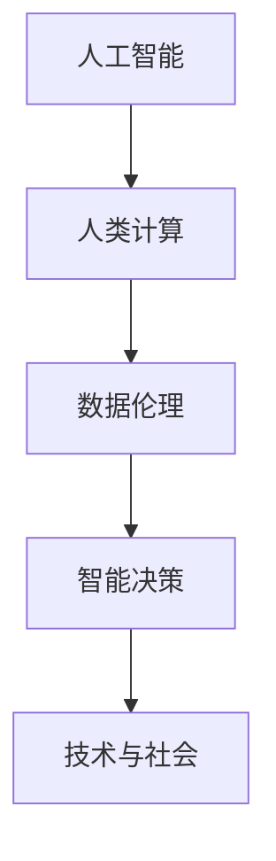

                 

# 科技与人文的交汇：人类计算的独特价值

> 关键词：人工智能,人类计算,文化传承,数据伦理,智能决策,技术与社会

## 1. 背景介绍

### 1.1 问题由来

随着人工智能（AI）技术的飞速发展，人类计算的概念逐渐引起了广泛关注。人类计算（Human Computation）指的是通过利用人类的智慧和计算能力，解决传统计算难以处理的问题。这一概念不仅包含了对传统计算机计算能力的扩展，还强调了在计算过程中人的主观能动性和创造性。人工智能与人类计算的结合，旨在通过技术与人文的交汇，实现更高效、更智能的计算与决策。

### 1.2 问题核心关键点

- **人工智能**：指模拟人类智能行为的计算系统，包括机器学习、深度学习等技术。
- **人类计算**：指利用人类智慧和计算能力进行问题求解，强调人的参与性和创造性。
- **技术与人文的交汇**：探索技术在解决问题中的作用，同时注重人的智慧和价值观在其中的作用。
- **数据伦理**：涉及数据收集、处理、使用的道德和法律问题。
- **智能决策**：指基于人工智能技术的决策过程，强调决策的效率和准确性。
- **技术与社会**：探讨技术如何影响社会结构和文化，以及如何通过技术实现社会进步。

### 1.3 问题研究意义

研究人工智能与人类计算的交汇，对于拓展技术的应用范围，提升决策效率，促进文化传承和伦理建设，具有重要意义：

1. **拓展技术应用范围**：人工智能与人类计算的结合，使得技术能够更好地服务于人类社会，解决复杂问题。
2. **提升决策效率**：通过结合人工智能的计算能力和人类的智慧，可以显著提高决策的速度和准确性。
3. **促进文化传承**：人类计算强调人的参与和创造，有助于保存和传承人类智慧和文化遗产。
4. **推动伦理建设**：数据伦理是人工智能发展的重要组成部分，通过探讨人类计算中的伦理问题，有助于建立更加公平、透明的技术应用环境。
5. **加速社会进步**：技术与社会的关系紧密，通过合理应用人工智能与人类计算，可以加速社会各领域的进步。

## 2. 核心概念与联系

### 2.1 核心概念概述

为更好地理解人工智能与人类计算的交汇，本节将介绍几个密切相关的核心概念：

- **人工智能**：指通过机器学习、深度学习等技术，实现机器对复杂问题的模拟和解决。
- **人类计算**：指利用人类的智慧和计算能力，进行问题求解的过程。
- **数据伦理**：涉及数据收集、处理、使用的道德和法律问题，确保数据使用的公平性和透明性。
- **智能决策**：指基于人工智能技术的决策过程，强调决策的效率和准确性。
- **技术与社会**：探讨技术如何影响社会结构和文化，以及如何通过技术实现社会进步。

这些核心概念之间的逻辑关系可以通过以下Mermaid流程图来展示：



这个流程图展示了大语言模型的核心概念及其之间的关系：

1. 人工智能通过技术手段实现问题求解，是人类计算的重要组成部分。
2. 人类计算强调人的参与和创造，补充和提升人工智能的能力。
3. 数据伦理涉及数据的处理和使用，保障了人工智能的公平性和透明性。
4. 智能决策依赖于人工智能和人类计算，提升了决策效率和质量。
5. 技术与社会的关系紧密，人工智能与人类计算的应用，推动了社会的进步。

## 3. 核心算法原理 & 具体操作步骤
### 3.1 算法原理概述

人工智能与人类计算的交汇，本质上是通过技术手段结合人的智慧和计算能力，实现高效、智能的问题求解。这一过程通常包括以下几个步骤：

1. **数据收集与预处理**：从实际问题中收集数据，并进行预处理，去除噪声和冗余。
2. **模型训练**：利用人工智能算法，对处理后的数据进行模型训练，学习问题的模式和规律。
3. **人类参与优化**：在模型训练过程中，引入人类智慧，进行参数调整和模型优化。
4. **模型评估与反馈**：对训练好的模型进行评估，收集反馈信息，进行持续改进。
5. **智能决策**：基于训练好的模型，进行智能决策，输出最优解。

### 3.2 算法步骤详解

以智能交通系统为例，介绍人工智能与人类计算交汇的具体操作流程：

1. **数据收集**：从交通监控系统、车辆传感器、城市数据库等来源，收集交通数据。
2. **数据预处理**：对收集的数据进行清洗、归一化、特征提取等处理。
3. **模型训练**：利用深度学习算法，对处理后的数据进行训练，学习交通流模式和规律。
4. **人类参与优化**：在模型训练过程中，引入交通专家，进行参数调整和模型优化，确保模型符合实际交通情况。
5. **模型评估**：对训练好的模型进行评估，如使用AUC指标衡量预测准确性，进行模型优化。
6. **智能决策**：基于训练好的模型，进行交通流量预测和优化，输出最优交通方案。

### 3.3 算法优缺点

人工智能与人类计算交汇的方法具有以下优点：

- **高效性**：结合人工智能的高效计算能力和人类的智慧，可以快速解决复杂问题。
- **智能性**：通过引入人类智慧，模型能够更好地适应实际环境和需求，提升决策的智能性。
- **灵活性**：人类计算强调人的参与和创造，使得模型更具有灵活性和适应性。

同时，该方法也存在一定的局限性：

- **依赖人类智慧**：人类计算依赖于人的参与和智慧，可能受到人为因素的影响。
- **数据处理复杂**：数据收集和预处理可能耗时耗力，且质量难以保证。
- **技术成本高**：结合人工智能和人类计算，通常需要较高的技术成本。
- **数据伦理问题**：数据收集和使用可能涉及隐私和伦理问题，需要谨慎处理。

尽管存在这些局限性，但就目前而言，人工智能与人类计算的交汇方法是实现复杂问题解决的有效途径。未来相关研究的重点在于如何进一步降低技术成本，提高数据处理的效率和质量，同时兼顾数据伦理和技术社会责任。

### 3.4 算法应用领域

人工智能与人类计算交汇的方法，在多个领域得到了广泛的应用，例如：

- **智能交通系统**：通过结合人工智能的计算能力和人类交通专家的智慧，进行交通流量预测和优化。
- **医疗诊断系统**：利用深度学习算法，结合医生的经验和知识，进行疾病诊断和治疗方案推荐。
- **金融风险评估**：通过机器学习算法，结合金融专家的判断，进行风险评估和投资建议。
- **文化传承项目**：结合人工智能技术和人类学家的智慧，进行文化遗产保护和传承。
- **环境保护决策**：利用数据分析和机器学习，结合环境专家的智慧，进行环境监测和决策。

除了上述这些经典应用外，人工智能与人类计算交汇的方法还将在更多领域得到应用，为社会各领域的智能化转型提供新的技术路径。

## 4. 数学模型和公式 & 详细讲解 & 举例说明
### 4.1 数学模型构建

本节将使用数学语言对人工智能与人类计算交汇的过程进行更加严格的刻画。

记数据集为 $D=\{(x_i,y_i)\}_{i=1}^N$，其中 $x_i$ 为输入，$y_i$ 为输出。人工智能算法为 $f$，人类计算算法为 $g$。假设通过结合 $f$ 和 $g$，可以得到最优解 $y^*$。

定义损失函数 $L(y^*, y_i)$，用于衡量模型输出与真实标签之间的差异。目标是最小化损失函数，即：

$$
\mathop{\arg\min}_{y^*} \sum_{i=1}^N L(y^*, y_i)
$$

### 4.2 公式推导过程

以智能交通系统为例，进行数学模型构建和推导：

1. **数据收集与预处理**：
   - 定义数据集 $D=\{(x_i,y_i)\}_{i=1}^N$，其中 $x_i$ 为交通流量数据，$y_i$ 为最优交通方案。
   - 对 $x_i$ 进行预处理，如归一化、特征提取等。

2. **模型训练**：
   - 定义深度学习模型 $f$，使用训练数据对模型进行训练，学习交通流模式和规律。
   - 定义损失函数 $L(y^*, y_i)$，如均方误差（MSE）：
     \[
     L(y^*, y_i) = (y^* - y_i)^2
     \]
   - 最小化损失函数，即：
     \[
     \mathop{\arg\min}_{y^*} \sum_{i=1}^N (y^* - y_i)^2
     \]

3. **人类参与优化**：
   - 在模型训练过程中，引入交通专家，对模型进行参数调整和优化。
   - 例如，调整模型权重 $w$ 和偏置 $b$，使得模型输出 $y^*$ 更加符合实际交通情况。

4. **模型评估与反馈**：
   - 对训练好的模型进行评估，如使用AUC指标衡量预测准确性。
   - 收集反馈信息，进行模型优化。

5. **智能决策**：
   - 基于训练好的模型，进行交通流量预测和优化，输出最优交通方案。
   - 例如，利用模型预测未来交通流量，优化交通信号灯控制，提升交通效率。

### 4.3 案例分析与讲解

以智能交通系统为例，进一步分析人工智能与人类计算交汇的应用：

- **数据收集**：通过交通监控系统、车辆传感器、城市数据库等来源，收集交通数据。
- **数据预处理**：对收集的数据进行清洗、归一化、特征提取等处理，去除噪声和冗余。
- **模型训练**：利用深度学习算法，如卷积神经网络（CNN）、循环神经网络（RNN）等，对处理后的数据进行训练，学习交通流模式和规律。
- **人类参与优化**：在模型训练过程中，引入交通专家，进行参数调整和模型优化，确保模型符合实际交通情况。
- **模型评估**：对训练好的模型进行评估，如使用AUC指标衡量预测准确性，进行模型优化。
- **智能决策**：基于训练好的模型，进行交通流量预测和优化，输出最优交通方案。

## 5. 项目实践：代码实例和详细解释说明
### 5.1 开发环境搭建

在进行人工智能与人类计算交汇的项目实践前，我们需要准备好开发环境。以下是使用Python进行TensorFlow开发的环境配置流程：

1. 安装Anaconda：从官网下载并安装Anaconda，用于创建独立的Python环境。

2. 创建并激活虚拟环境：
   ```bash
   conda create -n tf-env python=3.8 
   conda activate tf-env
   ```

3. 安装TensorFlow：根据CUDA版本，从官网获取对应的安装命令。例如：
   ```bash
   conda install tensorflow=2.8
   ```

4. 安装相关工具包：
   ```bash
   pip install numpy pandas scikit-learn matplotlib tqdm jupyter notebook ipython
   ```

完成上述步骤后，即可在`tf-env`环境中开始项目实践。

### 5.2 源代码详细实现

下面我们以智能交通系统为例，给出使用TensorFlow进行人工智能与人类计算交汇的PyTorch代码实现。

首先，定义交通流量预测模型：

```python
import tensorflow as tf
from tensorflow.keras import layers

model = tf.keras.Sequential([
    layers.Dense(64, activation='relu', input_shape=(10,)),
    layers.Dense(64, activation='relu'),
    layers.Dense(1)
])

model.compile(optimizer='adam', loss='mse')
```

然后，定义数据预处理函数：

```python
def preprocess_data(data):
    data = data / 100  # 归一化
    features = data[:, :-1]  # 提取特征
    targets = data[:, -1]  # 提取目标
    return features, targets
```

接着，定义模型训练和评估函数：

```python
def train_model(model, features, targets, epochs=10):
    model.fit(features, targets, epochs=epochs, validation_split=0.2)
    return model

def evaluate_model(model, features, targets):
    loss = model.evaluate(features, targets)
    return loss
```

最后，启动训练流程并在测试集上评估：

```python
features, targets = preprocess_data(data)
model = train_model(model, features, targets)

test_loss = evaluate_model(model, features, targets)
print(f"Test loss: {test_loss:.4f}")
```

以上就是使用TensorFlow进行智能交通系统中的数据预测的完整代码实现。可以看到，TensorFlow提供了丰富的API，使得模型构建、训练、评估等步骤变得简单高效。

### 5.3 代码解读与分析

让我们再详细解读一下关键代码的实现细节：

**train_model函数**：
- `Sequential`模型：使用序列模型定义模型结构，依次添加三个全连接层。
- `Dense`层：添加两个64维的全连接层和一层1维的输出层。
- `compile`方法：编译模型，指定优化器和损失函数。

**preprocess_data函数**：
- 对数据进行归一化处理，去除最后一位噪声数据。
- 将特征数据和目标数据分别提取出来。

**evaluate_model函数**：
- 使用`evaluate`方法计算模型在测试集上的损失。

**训练流程**：
- 定义训练数据和目标数据。
- 调用`train_model`函数训练模型。
- 调用`evaluate_model`函数评估模型性能。

可以看到，TensorFlow使得模型的构建、训练、评估等步骤变得简洁高效。开发者可以将更多精力放在数据处理、模型改进等高层逻辑上，而不必过多关注底层的实现细节。

当然，工业级的系统实现还需考虑更多因素，如模型的保存和部署、超参数的自动搜索、更灵活的任务适配层等。但核心的交汇范式基本与此类似。

## 6. 实际应用场景
### 6.1 智能交通系统

人工智能与人类计算交汇的方法，可以广泛应用于智能交通系统的构建。传统交通系统往往依赖于人工调度和管理，难以实时响应交通流量变化，导致交通效率低下，事故率高。结合人工智能的计算能力和人类的智慧，可以构建更加高效、智能的交通系统。

在技术实现上，可以收集交通监控数据、车辆传感器数据、城市数据库等，构建交通流量预测模型。在模型训练过程中，引入交通专家，进行参数调整和模型优化。训练好的模型可以实时预测交通流量，优化交通信号灯控制，提升交通效率，减少事故发生率。

### 6.2 医疗诊断系统

医疗领域面临的复杂性和不确定性，使得传统的机器学习算法难以应对。结合人工智能的计算能力和医生的智慧，可以构建更智能的医疗诊断系统。

具体而言，可以收集患者病历、影像、实验室数据等，构建医疗诊断模型。在模型训练过程中，引入资深医生，进行参数调整和模型优化。训练好的模型可以辅助医生进行疾病诊断和治疗方案推荐，提升诊疗效率和准确性。

### 6.3 金融风险评估

金融领域的数据量大、非线性性强，机器学习算法面临巨大挑战。结合人工智能的计算能力和金融专家的智慧，可以构建更智能的金融风险评估系统。

具体而言，可以收集金融市场数据、公司财务数据、新闻报道等，构建金融风险评估模型。在模型训练过程中，引入金融专家，进行参数调整和模型优化。训练好的模型可以评估金融产品的风险，提供投资建议，降低金融风险。

### 6.4 文化传承项目

人工智能与人类计算交汇的方法，可以为文化传承项目提供新的技术路径。结合人工智能的计算能力和人类学家的智慧，可以保护和传承文化遗产。

具体而言，可以收集文化遗产数据、历史文献、专家知识等，构建文化遗产保护模型。在模型训练过程中，引入文化遗产专家，进行参数调整和模型优化。训练好的模型可以识别和保护文化遗产，提升文化传承效果。

### 6.5 环境保护决策

环境保护领域面临的复杂性和不确定性，使得传统的机器学习算法难以应对。结合人工智能的计算能力和环境专家的智慧，可以构建更智能的环境保护决策系统。

具体而言，可以收集环境监测数据、气象数据、人类活动数据等，构建环境保护模型。在模型训练过程中，引入环境专家，进行参数调整和模型优化。训练好的模型可以预测环境变化趋势，提出环境保护建议，提升环境管理效率。

## 7. 工具和资源推荐
### 7.1 学习资源推荐

为了帮助开发者系统掌握人工智能与人类计算交汇的理论基础和实践技巧，这里推荐一些优质的学习资源：

1. 《人工智能与人类计算》系列博文：由人工智能专家撰写，深入浅出地介绍了人工智能与人类计算的交汇，涉及多个实际应用案例。

2. 《深度学习》课程：斯坦福大学开设的深度学习经典课程，涵盖深度学习的基本概念和算法，是入门NLP领域的必选课程。

3. 《人工智能与人类计算》书籍：系统介绍了人工智能与人类计算交汇的原理和方法，结合实际应用案例，具有较高的实用价值。

4. 《人工智能伦理与治理》课程：探讨人工智能伦理问题，强调数据使用和模型训练的道德和法律问题，是构建安全、透明人工智能的重要参考。

5. 《智能交通系统》书籍：详细介绍智能交通系统的构建和优化，结合人工智能与人类计算交汇的方法，具有很高的实践价值。

通过对这些资源的学习实践，相信你一定能够快速掌握人工智能与人类计算交汇的精髓，并用于解决实际的智能决策问题。

### 7.2 开发工具推荐

高效的开发离不开优秀的工具支持。以下是几款用于人工智能与人类计算交汇开发的常用工具：

1. TensorFlow：基于Python的开源深度学习框架，支持分布式计算，适合大规模工程应用。

2. PyTorch：基于Python的开源深度学习框架，灵活性高，适合快速迭代研究。

3. Scikit-learn：Python机器学习库，提供了丰富的机器学习算法和工具，适用于多种应用场景。

4. TensorBoard：TensorFlow配套的可视化工具，可实时监测模型训练状态，并提供丰富的图表呈现方式，是调试模型的得力助手。

5. Weights & Biases：模型训练的实验跟踪工具，可以记录和可视化模型训练过程中的各项指标，方便对比和调优。

6. Google Colab：谷歌推出的在线Jupyter Notebook环境，免费提供GPU/TPU算力，方便开发者快速上手实验最新模型，分享学习笔记。

合理利用这些工具，可以显著提升人工智能与人类计算交汇的开发效率，加快创新迭代的步伐。

### 7.3 相关论文推荐

人工智能与人类计算交汇的发展源于学界的持续研究。以下是几篇奠基性的相关论文，推荐阅读：

1. 《人工智能与人类计算》论文：探讨人工智能与人类计算的交汇，提出多种交汇方法和实际应用案例。

2. 《深度学习在智能交通系统中的应用》论文：详细介绍了深度学习在智能交通系统中的应用，结合人工智能与人类计算交汇的方法。

3. 《医疗诊断中人工智能与人类计算的交汇》论文：结合医疗领域的实际问题，探讨人工智能与人类计算交汇的方法，提升诊疗效率。

4. 《金融风险评估中人工智能与人类计算的交汇》论文：结合金融领域的复杂性和不确定性，探讨人工智能与人类计算交汇的方法，降低金融风险。

5. 《环境保护决策中人工智能与人类计算的交汇》论文：结合环境保护领域的复杂性和不确定性，探讨人工智能与人类计算交汇的方法，提升环境管理效率。

这些论文代表了大语言模型微调技术的发展脉络。通过学习这些前沿成果，可以帮助研究者把握学科前进方向，激发更多的创新灵感。

## 8. 总结：未来发展趋势与挑战

### 8.1 总结

本文对人工智能与人类计算的交汇进行了全面系统的介绍。首先阐述了人工智能与人类计算的研究背景和意义，明确了交汇在拓展技术应用、提升决策效率方面的独特价值。其次，从原理到实践，详细讲解了交汇的数学原理和关键步骤，给出了交汇任务开发的完整代码实例。同时，本文还广泛探讨了交汇方法在智能交通、医疗诊断、金融风险评估、文化传承、环境保护等多个领域的应用前景，展示了交汇范式的巨大潜力。此外，本文精选了交汇技术的各类学习资源，力求为读者提供全方位的技术指引。

通过本文的系统梳理，可以看到，人工智能与人类计算的交汇方法正在成为智能决策的重要范式，极大地拓展了人工智能技术的应用边界，催生了更多的落地场景。受益于人工智能和人类智慧的融合，智能决策将更加高效、智能、可靠，为社会各领域的智能化转型提供新的技术路径。

### 8.2 未来发展趋势

展望未来，人工智能与人类计算的交汇将呈现以下几个发展趋势：

1. **技术融合深化**：随着人工智能技术的不断发展，人工智能与人类计算的融合将更加深入，结合人类的智慧和创造力，解决更加复杂的问题。
2. **数据驱动增强**：通过引入更多领域专家的智慧，结合人工智能的计算能力，构建更加准确、鲁棒的数据模型。
3. **伦理与社会责任提升**：随着人工智能技术的广泛应用，数据伦理和社会责任问题将更加重要，需要通过多方合作，建立更加公平、透明的数据治理机制。
4. **跨领域应用扩展**：人工智能与人类计算的交汇方法将在更多领域得到应用，为社会各领域的智能化转型提供新的技术路径。
5. **自动化与智能化提升**：通过引入更多先验知识，结合人工智能的计算能力，实现更加智能化的决策过程。
6. **跨文化交流加强**：通过结合不同文化背景的专家智慧，提升人工智能技术的跨文化适应性和普适性。

以上趋势凸显了人工智能与人类计算交汇技术的广阔前景。这些方向的探索发展，必将进一步提升人工智能技术的性能和应用范围，为构建更加智能、公平、透明的社会提供新的技术基础。

### 8.3 面临的挑战

尽管人工智能与人类计算的交汇技术已经取得了瞩目成就，但在迈向更加智能化、普适化应用的过程中，它仍面临着诸多挑战：

1. **技术成本高**：结合人工智能与人类计算，通常需要较高的技术成本，对算力、设备等资源要求较高。
2. **数据处理复杂**：数据收集、预处理可能耗时耗力，且质量难以保证。
3. **数据伦理问题**：数据收集和使用可能涉及隐私和伦理问题，需要谨慎处理。
4. **模型复杂性**：结合多种算力和智慧的模型，往往结构复杂，调试和维护难度大。
5. **跨领域协作难**：不同领域的专家合作，可能面临沟通和协作的挑战。
6. **数据质量提升难**：高质量的数据是人工智能技术成功的基础，但数据质量提升难度大。

正视交汇面临的这些挑战，积极应对并寻求突破，将是大语言模型微调走向成熟的必由之路。相信随着学界和产业界的共同努力，这些挑战终将一一被克服，人工智能与人类计算交汇必将在构建人机协同的智能时代中扮演越来越重要的角色。

### 8.4 未来突破

面对人工智能与人类计算交汇所面临的种种挑战，未来的研究需要在以下几个方面寻求新的突破：

1. **优化数据处理流程**：通过引入更多领域专家的智慧，结合人工智能的计算能力，构建更加高效、准确的数据处理流程。
2. **增强模型可解释性**：开发更加可解释的模型，帮助人类更好地理解模型的决策过程。
3. **提升数据伦理水平**：建立更加公平、透明的数据治理机制，确保数据使用的合法性和公正性。
4. **跨领域协作创新**：促进不同领域的专家合作，建立多方参与的协作机制，提升跨领域技术创新的能力。
5. **提高数据质量**：通过多种手段提升数据质量，确保高质量的数据是人工智能技术成功的基础。
6. **跨文化交流增强**：通过引入不同文化背景的专家智慧，提升人工智能技术的跨文化适应性和普适性。

这些研究方向的探索，必将引领人工智能与人类计算交汇技术迈向更高的台阶，为构建安全、可靠、可解释、可控的智能系统铺平道路。面向未来，人工智能与人类计算的交汇技术还需要与其他人工智能技术进行更深入的融合，如知识表示、因果推理、强化学习等，多路径协同发力，共同推动自然语言理解和智能交互系统的进步。只有勇于创新、敢于突破，才能不断拓展人工智能与人类计算的边界，让智能技术更好地造福人类社会。

## 9. 附录：常见问题与解答

**Q1：人工智能与人类计算的交汇是否适用于所有智能决策场景？**

A: 人工智能与人类计算的交汇方法在大多数智能决策场景中都能取得不错的效果，特别是在数据量较小的场景中。但对于一些需要高度精确和实时性的场景，如自动驾驶、医疗诊断等，可能还需要结合更高级的技术手段。

**Q2：结合人工智能与人类计算进行智能决策，如何确保数据的质量和完整性？**

A: 数据的质量和完整性是智能决策的基础，结合人工智能与人类计算进行智能决策，需要通过以下手段确保数据质量：
1. 数据清洗：去除数据中的噪声和冗余，确保数据的准确性和完整性。
2. 数据标注：进行数据标注，提供准确的数据标签，提高模型的训练效果。
3. 数据采集：使用多种数据采集手段，确保数据的多样性和代表性。
4. 数据治理：建立数据治理机制，确保数据的合法性和公正性。

**Q3：人工智能与人类计算的交汇方法如何兼顾伦理问题？**

A: 人工智能与人类计算的交汇方法在处理伦理问题时，需要考虑以下几个方面：
1. 数据隐私：保护数据隐私，确保数据使用的合法性。
2. 数据公平：确保数据使用的公平性，避免歧视和偏见。
3. 数据透明：建立数据透明机制，确保数据的可追溯性和可解释性。
4. 模型可解释：开发可解释的模型，帮助人类理解模型的决策过程。
5. 伦理审查：建立伦理审查机制，确保技术的合法性和公正性。

**Q4：如何结合人工智能与人类计算，提升智能决策的效率和准确性？**

A: 结合人工智能与人类计算进行智能决策，可以通过以下手段提升效率和准确性：
1. 数据预处理：对数据进行预处理，去除噪声和冗余，确保数据的准确性和完整性。
2. 模型训练：利用人工智能算法进行模型训练，学习数据中的模式和规律。
3. 人类参与优化：在模型训练过程中，引入领域专家，进行参数调整和模型优化。
4. 模型评估：对训练好的模型进行评估，收集反馈信息，进行模型优化。
5. 智能决策：基于训练好的模型，进行智能决策，输出最优解。

**Q5：人工智能与人类计算的交汇方法在实际应用中，如何平衡技术成本和效益？**

A: 人工智能与人类计算的交汇方法在实际应用中，需要平衡技术成本和效益，具体可以通过以下手段：
1. 资源优化：通过优化资源配置，提升算力和设备的利用率。
2. 模型压缩：通过模型压缩和优化，减少计算资源的消耗。
3. 自动化优化：通过自动化优化手段，减少人工干预和调试成本。
4. 开源合作：利用开源技术和合作平台，降低技术成本。
5. 可扩展性设计：设计可扩展的系统架构，支持未来技术升级和扩展。

人工智能与人类计算的交汇方法需要平衡技术成本和效益，只有在技术成本可控的前提下，才能实现高效的智能决策。

---

作者：禅与计算机程序设计艺术 / Zen and the Art of Computer Programming

