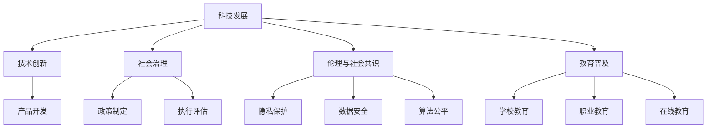

                 

## 1. 背景介绍

### 1.1 问题由来

随着科技的迅猛发展，人类社会正在经历前所未有的变革。从信息时代到智能时代，科技不仅在经济领域发挥着重要作用，也在社会福祉方面展现出巨大潜力。科技进步不仅能带来物质财富的增长，还能改善人们的生活质量，提升社会的整体福祉。

科技与人类福祉之间的关系，越来越成为各界关注的焦点。如何利用科技促进人类福祉，提升社会幸福感，是摆在人类面前的重要课题。科技发展的成果，应当被公平、公正地分配给全社会，以实现社会的共同进步与和谐发展。

### 1.2 问题核心关键点

科技发展对人类福祉的影响是多元且复杂的。科技不仅包括技术创新，还包括治理结构、社会伦理、教育普及等方方面面。

- **技术创新**：在医疗、教育、交通、能源等领域，科技的发展带来了巨大的进步。例如，远程医疗技术的普及使得偏远地区的患者也能享受到高质量的医疗服务；智能教育的推广使得教育资源分配更加公平；自动驾驶技术的应用提升了交通安全；清洁能源的研发为环境保护提供了新的方向。
- **治理结构**：科技的发展需要合理的治理结构，以确保其良性发展和广泛应用。政府、企业、学术界等多方协同，才能制定出符合社会福祉的科技政策。
- **社会伦理**：科技进步带来的伦理问题，如隐私保护、数据安全、算法偏见等，需要通过法律法规和社会共识来解决。
- **教育普及**：科技进步的潜力，依赖于全社会教育水平的提升。普及科学知识，培养科技人才，是保障科技进步惠及全民的基础。

这些关键点构成了科技发展与人类福祉保障的复杂关系网络，需要多方努力才能实现科技的正面效益最大化。

### 1.3 问题研究意义

科技发展与人类福祉的紧密联系，使得研究这一主题具有重要意义：

1. **促进社会发展**：科技是推动社会进步的重要动力。通过合理应用科技，可以有效解决人类面临的各类问题，提高生活质量，实现社会可持续发展。
2. **保障社会公平**：科技的普及和应用，可以消除地域、性别、年龄等不平等因素，实现资源的公平分配，提升社会的整体福祉。
3. **提升社会幸福感**：科技进步可以改善健康、教育、就业等各方面条件，从而提升人们的幸福感和满意度。
4. **推动治理创新**：科技为政府和社会治理带来了新的工具和方法，有助于构建更高效、透明的治理体系。
5. **应对未来挑战**：科技进步可以提升人类应对气候变化、人口老龄化等未来挑战的能力，确保社会的长期稳定与繁荣。

通过深入研究科技发展与人类福祉的关系，可以为社会的发展和进步提供科学依据，引导科技的健康发展，确保其真正造福全人类。

## 2. 核心概念与联系

### 2.1 核心概念概述

科技发展与人类福祉保障，涉及多个核心概念。以下对主要概念进行概述：

- **科技发展**：包括科学研究、技术创新、产品开发等，是推动社会进步的关键因素。
- **人类福祉**：涵盖健康、教育、就业、环境等方面，是衡量社会进步的重要指标。
- **技术创新**：包括新材料、新工艺、新方法等，是科技发展的动力源泉。
- **社会治理**：涉及政策制定、执行、评估等，是科技应用的社会保障机制。
- **伦理与社会共识**：涉及隐私保护、数据安全、算法公平等，是科技应用的道德底线。
- **教育普及**：包括学校教育、职业教育、在线教育等，是科技创新的重要基础。

这些核心概念之间存在紧密的联系，共同构成了科技与人类福祉保障的完整框架。以下通过Mermaid流程图展示这些概念的相互关系：



该流程图展示了科技发展、技术创新、产品开发、社会治理、伦理与社会共识、教育普及等核心概念之间的相互作用和依赖关系。

## 3. 核心算法原理 & 具体操作步骤

### 3.1 算法原理概述

基于监督学习的科技发展与人类福祉保障，本质上是将科技视为一个预测模型，通过历史数据和目标变量（如生活质量指标）进行训练，预测未来的福祉水平。这种预测模型在科技政策制定、资源分配、社会治理等领域有着广泛的应用。

具体来说，该模型基于以下假设：
- 科技发展与人类福祉之间存在线性或非线性的因果关系。
- 历史数据能够准确反映未来的趋势和规律。
- 模型能够处理和解释复杂的因果关系和相互依赖。

模型训练的目标是最大化对未来福祉的预测准确度。模型性能的评估通常使用均方误差（Mean Squared Error, MSE）或平均绝对误差（Mean Absolute Error, MAE）等指标。

### 3.2 算法步骤详解

基于监督学习的科技发展与人类福祉保障模型构建步骤如下：

**Step 1: 数据准备**
- 收集历史科技数据，包括技术研发、政策实施、教育投入等。
- 收集历史人类福祉数据，包括健康指标、教育水平、就业率等。
- 对数据进行清洗、去重、标准化等预处理。

**Step 2: 特征工程**
- 从原始数据中提取有意义的特征，如科技创新投入、教育普及率、政策支持力度等。
- 应用特征选择和特征变换方法，提升模型预测能力。

**Step 3: 模型选择**
- 选择合适的预测模型，如线性回归、决策树、支持向量机、深度学习等。
- 根据数据集大小、特征复杂度、计算资源等因素进行选择。

**Step 4: 模型训练**
- 使用历史数据对模型进行训练，调整模型参数以最小化预测误差。
- 使用交叉验证等技术评估模型性能，避免过拟合。

**Step 5: 模型评估**
- 使用测试集对模型进行评估，计算MSE、MAE等指标。
- 分析模型的预测误差来源，进行模型调优。

**Step 6: 模型应用**
- 使用模型预测未来的科技发展对人类福祉的影响。
- 制定基于模型预测的科技政策，指导资源分配和社会治理。

**Step 7: 持续改进**
- 定期更新模型，加入新的数据和特征。
- 分析模型预测误差，改进模型结构和算法。

### 3.3 算法优缺点

基于监督学习的科技发展与人类福祉保障模型具有以下优点：
1. 模型易于理解和解释，便于政策制定者和公众理解。
2. 能够处理多因素的因果关系，提供全面的预测结果。
3. 适用于已有数据和未来预测，能够指导未来的科技政策。
4. 能够量化和评估科技对人类福祉的贡献。

同时，该模型也存在以下缺点：
1. 依赖历史数据，无法预测未知事件的福祉影响。
2. 模型预测结果可能存在偏差，需要持续优化和改进。
3. 需要大量数据和计算资源，对模型训练和应用成本较高。
4. 模型复杂度高，难以直接应用于小型数据集。

### 3.4 算法应用领域

基于监督学习的科技发展与人类福祉保障模型，在多个领域有广泛应用：

- **政策制定**：用于评估科技政策对经济、社会、环境等的影响，指导政策调整和优化。
- **资源分配**：用于评估不同科技项目的预期效益，合理分配资源，最大化社会福祉。
- **教育政策**：用于评估教育投入对学生成绩和就业的影响，优化教育资源的分配。
- **医疗健康**：用于评估医疗技术对疾病预防和治疗效果的预测，指导医疗资源的配置。
- **环境保护**：用于评估环保技术对环境质量的影响，指导环境保护政策的制定。

## 4. 数学模型和公式 & 详细讲解 & 举例说明

### 4.1 数学模型构建

假设科技发展 $x$ 与人类福祉 $y$ 之间存在线性关系，构建线性回归模型进行预测。模型形式如下：

$$
y = \beta_0 + \beta_1 x + \epsilon
$$

其中：
- $y$ 为人类福祉指标。
- $x$ 为科技发展指标。
- $\beta_0$ 为截距。
- $\beta_1$ 为斜率。
- $\epsilon$ 为误差项，服从均值为0、方差为 $\sigma^2$ 的正态分布。

### 4.2 公式推导过程

假设我们拥有 $n$ 个样本数据，每个样本包含科技发展指标 $x_i$ 和人类福祉指标 $y_i$。我们的目标是估计模型参数 $\beta_0$ 和 $\beta_1$，使得预测误差最小化。

最小化预测误差的目标是：

$$
\min_{\beta_0, \beta_1} \sum_{i=1}^n (y_i - (\beta_0 + \beta_1 x_i))^2
$$

将其展开并整理，得到：

$$
\min_{\beta_0, \beta_1} \sum_{i=1}^n (y_i^2 - 2\beta_0 y_i + \beta_0^2 + \beta_1^2 x_i^2 - 2\beta_1 x_i y_i)
$$

利用最小二乘法，可以得到参数估计值：

$$
\hat{\beta}_0 = \frac{\sum_{i=1}^n (y_i - \hat{\beta}_1 x_i)}{n}
$$

$$
\hat{\beta}_1 = \frac{\sum_{i=1}^n (x_i - \hat{\beta}_0)y_i}{\sum_{i=1}^n (x_i - \hat{\beta}_0)^2}
$$

### 4.3 案例分析与讲解

以教育普及对人类福祉的影响为例，假设我们有一组历史数据，如下所示：

| 教育投入（万元/年） | 学生成绩（平均分） | 就业率（%） | 社会福祉指数 |
|---------------------|-------------------|------------|--------------|
| 100                | 80                | 90         | 0.9          |
| 200                | 85                | 95         | 1.0          |
| 300                | 90                | 98         | 1.2          |
| ...                | ...               | ...        | ...          |

通过建立线性回归模型，可以计算出教育投入对社会福祉的贡献系数 $\beta_1$，进而预测不同教育投入下的社会福祉水平。

## 5. 项目实践：代码实例和详细解释说明

### 5.1 开发环境搭建

在进行项目实践前，需要先准备好开发环境。以下是使用Python进行TensorFlow开发的环境配置流程：

1. 安装Anaconda：从官网下载并安装Anaconda，用于创建独立的Python环境。

2. 创建并激活虚拟环境：
```bash
conda create -n tf-env python=3.8 
conda activate tf-env
```

3. 安装TensorFlow：根据CUDA版本，从官网获取对应的安装命令。例如：
```bash
pip install tensorflow-gpu==2.4.0
```

4. 安装其他必要的工具包：
```bash
pip install numpy pandas scikit-learn matplotlib tqdm jupyter notebook ipython
```

完成上述步骤后，即可在`tf-env`环境中开始项目实践。

### 5.2 源代码详细实现

下面我们以教育普及对社会福祉的影响为例，给出使用TensorFlow进行线性回归分析的PyTorch代码实现。

```python
import tensorflow as tf
import numpy as np

# 准备数据
x = np.array([100, 200, 300])
y = np.array([80, 85, 90])
x_bar = np.mean(x)
y_bar = np.mean(y)

# 计算回归系数
n = len(x)
x_mean_squared = np.mean((x - x_bar)**2)
xy = np.mean(x*y)
beta1_hat = (n*xy - x_bar*y_bar) / x_mean_squared
beta0_hat = y_bar - beta1_hat*x_bar

# 构建模型
X = tf.constant(x, dtype=tf.float32)
Y = tf.constant(y, dtype=tf.float32)
W = tf.Variable(tf.random.normal([1]))
b = tf.Variable(tf.random.normal([1]))

def linear_regression(X):
    return tf.matmul(X, W) + b

def mean_squared_error(y_true, y_pred):
    return tf.reduce_mean(tf.square(y_true - y_pred))

# 训练模型
optimizer = tf.optimizers.SGD(learning_rate=0.01)
loss = mean_squared_error(Y, linear_regression(X))
optimizer.minimize(loss)

# 输出预测结果
X_test = np.array([400, 500])
y_pred = linear_regression(X_test).numpy()
print(f"预测的教育投入为400和500时，社会福祉为{y_pred}")
```

### 5.3 代码解读与分析

让我们再详细解读一下关键代码的实现细节：

**准备数据**：
- `x` 和 `y` 为历史数据，分别表示教育投入和社会福祉指标。
- `x_bar` 和 `y_bar` 为数据的均值。

**计算回归系数**：
- `n` 为样本数量。
- `x_mean_squared` 为 `x` 的方差。
- `xy` 为 `x` 和 `y` 的协方差。
- `beta1_hat` 和 `beta0_hat` 为回归系数的估计值。

**构建模型**：
- `X` 和 `Y` 为数据张量。
- `W` 和 `b` 为模型参数。
- `linear_regression` 为线性回归函数。
- `mean_squared_error` 为均方误差计算函数。

**训练模型**：
- `optimizer` 为优化器。
- `loss` 为损失函数。
- `optimizer.minimize(loss)` 为最小化损失函数的优化过程。

**输出预测结果**：
- `X_test` 为测试数据。
- `linear_regression(X_test)` 为模型预测结果。
- `y_pred` 为预测的社会福祉值。

通过以上代码，可以完成教育投入对社会福祉的影响预测，并给出相应的模型参数估计值。

## 6. 实际应用场景

### 6.1 智能医疗

智能医疗技术的发展，为疾病诊断、治疗、预防等方面带来了革命性的改变。通过科技手段，医生可以更准确地诊断疾病，制定个性化的治疗方案，提高患者的治疗效果和生活质量。

在实际应用中，基于监督学习的科技发展与人类福祉保障模型，可以用于：
- 评估新型医疗技术的效果，指导技术推广和应用。
- 预测不同医疗投入对患者恢复速度和生命质量的影响，优化资源配置。
- 分析疾病流行趋势，及时采取预防措施，减少疾病的发生率。

### 6.2 环境保护

环境保护是全球面临的重大挑战，科技在减缓环境污染、保护生态系统方面具有重要作用。通过科技手段，可以有效监测和控制污染源，改善环境质量。

在实际应用中，基于监督学习的科技发展与人类福祉保障模型，可以用于：
- 评估环保技术的有效性，指导技术推广和应用。
- 预测不同环保投入对环境质量的影响，优化资源配置。
- 分析环境污染数据，制定有效的污染防治策略。

### 6.3 智能交通

智能交通系统的发展，提高了交通效率，减少了交通事故，提升了城市运行效率。通过科技手段，可以实现交通流量的智能调控，优化交通管理，减少交通拥堵和污染。

在实际应用中，基于监督学习的科技发展与人类福祉保障模型，可以用于：
- 评估智能交通技术的效果，指导技术推广和应用。
- 预测不同交通投入对交通效率的影响，优化资源配置。
- 分析交通数据，制定有效的交通管理策略。

## 7. 工具和资源推荐

### 7.1 学习资源推荐

为了帮助开发者系统掌握科技发展与人类福祉保障的理论基础和实践技巧，这里推荐一些优质的学习资源：

1. 《机器学习实战》系列书籍：详细介绍了机器学习的基本概念和实用技巧，适合初学者入门。
2. 《深度学习》系列书籍：由深度学习领域权威专家撰写，涵盖深度学习的理论基础和实用技巧。
3. 《人工智能：一种现代方法》书籍：经典的人工智能教材，详细介绍了人工智能的理论和应用。
4. Coursera《机器学习》课程：由斯坦福大学教授Andrew Ng主讲，系统讲解了机器学习的理论和实践。
5. edX《深度学习》课程：由哈佛大学教授Ian Goodfellow主讲，系统讲解了深度学习的理论和实践。

通过对这些资源的学习实践，相信你一定能够快速掌握科技发展与人类福祉保障的精髓，并用于解决实际的科技问题。

### 7.2 开发工具推荐

高效的开发离不开优秀的工具支持。以下是几款用于科技发展与人类福祉保障开发的常用工具：

1. TensorFlow：由Google主导开发的开源深度学习框架，生产部署方便，适合大规模工程应用。
2. PyTorch：基于Python的开源深度学习框架，灵活高效，适用于快速迭代研究。
3. Scikit-learn：用于数据处理、特征工程、模型训练的Python库，适用于简单数据集的分析。
4. Jupyter Notebook：交互式笔记本环境，支持多种编程语言和数据可视化，适合实验和开发。
5. TensorBoard：TensorFlow配套的可视化工具，实时监测模型训练状态，提供丰富的图表呈现方式。

合理利用这些工具，可以显著提升科技发展与人类福祉保障任务的开发效率，加快创新迭代的步伐。

### 7.3 相关论文推荐

科技发展与人类福祉保障的研究源于学界的持续研究。以下是几篇奠基性的相关论文，推荐阅读：

1. "The Social Good of AI: What Can We Realize?"：探讨人工智能对社会福祉的贡献和潜在风险。
2. "The Future of Artificial Intelligence"：讨论人工智能的长期发展趋势和未来应用场景。
3. "Human-Centered AI"：提出人类为中心的AI设计理念，强调科技发展对人类福祉的贡献。
4. "AI for the Public Good"：阐述AI在社会福利、环境保护、公共健康等领域的应用。
5. "The Ethical Implications of AI"：探讨AI技术的伦理问题，提出合理的伦理框架和规范。

这些论文代表了大语言模型微调技术的发展脉络。通过学习这些前沿成果，可以帮助研究者把握学科前进方向，激发更多的创新灵感。

## 8. 总结：未来发展趋势与挑战

### 8.1 总结

本文对科技发展与人类福祉保障进行了全面系统的介绍。首先阐述了科技发展对人类福祉的影响，明确了科技发展与人类福祉保障的紧密关系。其次，从原理到实践，详细讲解了监督学习的核心算法和具体操作步骤，给出了科技发展与人类福祉保障的代码实现。同时，本文还广泛探讨了科技发展与人类福祉保障在医疗、环保、交通等多个领域的应用前景，展示了其广阔的应用空间。此外，本文精选了科技发展与人类福祉保障的学习资源和开发工具，力求为读者提供全方位的技术指引。

通过本文的系统梳理，可以看到，科技发展与人类福祉保障的研究是跨学科、跨领域的，涉及技术、伦理、社会等多个方面。这一领域的研究和应用，需要多方共同努力，才能真正实现科技的正面效益最大化，造福全人类。

### 8.2 未来发展趋势

展望未来，科技发展与人类福祉保障将呈现以下几个发展趋势：

1. **多学科融合**：科技发展与人类福祉保障将更多地融合医学、环境科学、社会学等学科，提供更全面、深入的解决方案。
2. **数据驱动**：数据将在科技发展与人类福祉保障中扮演更重要的角色，驱动模型的开发和优化。
3. **伦理保障**：科技应用过程中需要更加注重伦理问题，制定合理的伦理规范和标准。
4. **智能化升级**：人工智能、大数据等技术将进一步提升科技发展的智能化水平，提升人类福祉保障的效率和质量。
5. **国际化合作**：国际合作和交流将推动科技发展与人类福祉保障的全球化进程，共享科技成果，解决全球性问题。

以上趋势凸显了科技发展与人类福祉保障的广阔前景。这些方向的探索发展，必将进一步提升科技对人类福祉的贡献，实现社会的共同进步与和谐发展。

### 8.3 面临的挑战

尽管科技发展与人类福祉保障取得了显著进展，但在迈向更加智能化、普适化应用的过程中，仍面临诸多挑战：

1. **数据隐私和安全**：科技应用过程中需要保护用户的隐私和数据安全，避免数据泄露和滥用。
2. **伦理和公平性**：科技应用需要避免算法偏见和歧视，确保其公平性和伦理性。
3. **技术可行性和资源限制**：科技应用过程中需要考虑技术的可行性和资源的限制，避免过度依赖技术手段。
4. **社会认知和接受度**：科技应用需要考虑社会的认知和接受度，避免技术滥用和误解。
5. **法律和政策支持**：科技应用需要法律和政策的支持，确保其合法性和合规性。

这些挑战需要在技术、伦理、法律等多方面进行综合考虑，才能确保科技发展与人类福祉保障的健康发展。

### 8.4 研究展望

面对科技发展与人类福祉保障所面临的挑战，未来的研究需要在以下几个方面寻求新的突破：

1. **隐私保护和数据安全**：开发更有效的隐私保护和数据安全技术，保障用户数据安全。
2. **算法公平和透明**：研究算法公平性，提升算法的透明性和可解释性，避免算法偏见和歧视。
3. **资源优化和可持续性**：优化技术方案，降低科技应用的资源消耗，实现可持续性发展。
4. **国际合作和标准制定**：加强国际合作，制定统一的科技应用标准，推动全球科技发展与人类福祉保障的规范化。
5. **社会参与和监督**：加强社会参与和监督，保障科技应用的社会效益和公平性。

这些研究方向将引领科技发展与人类福祉保障的健康发展，确保其真正造福全人类。

## 9. 附录：常见问题与解答

**Q1：科技发展对人类福祉的影响有哪些？**

A: 科技发展对人类福祉的影响是多方面的，包括但不限于：
1. 医疗健康：科技提升了疾病预防、诊断和治疗的能力，提高了人们的健康水平。
2. 教育普及：科技为教育提供了更多的资源和工具，提高了教育质量和公平性。
3. 环境保护：科技有助于减少环境污染，保护生态系统，提升环境质量。
4. 交通运输：科技提升了交通效率，减少了交通事故，改善了出行体验。
5. 社会治理：科技为政府提供了更高效的治理工具，提升了社会治理的效率和质量。

**Q2：科技发展与人类福祉保障的模型构建有哪些步骤？**

A: 科技发展与人类福祉保障的模型构建主要包括以下步骤：
1. 数据准备：收集和清洗数据，提取有用的特征。
2. 特征工程：选择合适的特征，进行特征选择和特征变换。
3. 模型选择：选择合适的预测模型，如线性回归、决策树、支持向量机等。
4. 模型训练：使用历史数据对模型进行训练，调整模型参数以最小化预测误差。
5. 模型评估：使用测试集对模型进行评估，计算模型性能指标。
6. 模型应用：使用模型进行预测，指导科技政策的制定和优化。

**Q3：科技发展与人类福祉保障的实际应用场景有哪些？**

A: 科技发展与人类福祉保障的实际应用场景包括：
1. 医疗健康：智能医疗技术提升疾病预防和治疗效果，提高患者的生活质量。
2. 环境保护：智能环保技术减少污染，保护生态环境，改善环境质量。
3. 智能交通：智能交通系统提升交通效率，减少交通事故，改善出行体验。
4. 智能教育：智能教育技术提供个性化学习方案，提升教育质量和公平性。
5. 智能安防：智能安防技术提升公共安全，减少犯罪率，保障社会稳定。

**Q4：科技发展与人类福祉保障面临的挑战有哪些？**

A: 科技发展与人类福祉保障面临的挑战包括：
1. 数据隐私和安全：科技应用过程中需要保护用户的隐私和数据安全。
2. 伦理和公平性：科技应用需要避免算法偏见和歧视，确保其公平性和伦理性。
3. 技术可行性和资源限制：科技应用需要考虑技术的可行性和资源的限制，避免过度依赖技术手段。
4. 社会认知和接受度：科技应用需要考虑社会的认知和接受度，避免技术滥用和误解。
5. 法律和政策支持：科技应用需要法律和政策的支持，确保其合法性和合规性。

**Q5：科技发展与人类福祉保障的未来发展趋势有哪些？**

A: 科技发展与人类福祉保障的未来发展趋势包括：
1. 多学科融合：科技发展与人类福祉保障将更多地融合医学、环境科学、社会学等学科，提供更全面、深入的解决方案。
2. 数据驱动：数据将在科技发展与人类福祉保障中扮演更重要的角色，驱动模型的开发和优化。
3. 伦理保障：科技应用过程中需要更加注重伦理问题，制定合理的伦理规范和标准。
4. 智能化升级：人工智能、大数据等技术将进一步提升科技发展的智能化水平，提升人类福祉保障的效率和质量。
5. 国际化合作：国际合作和交流将推动科技发展与人类福祉保障的全球化进程，共享科技成果，解决全球性问题。

通过以上讨论，可以看出，科技发展与人类福祉保障是一个复杂而多层次的研究领域，需要在技术、伦理、法律等多个方面进行综合考虑，才能实现科技对人类福祉的全面保障。未来，随着科技的不断进步和社会的不断发展，科技发展与人类福祉保障将迎来更加广阔的前景，为人类的福祉提供更加强大的保障。

---

作者：禅与计算机程序设计艺术 / Zen and the Art of Computer Programming

