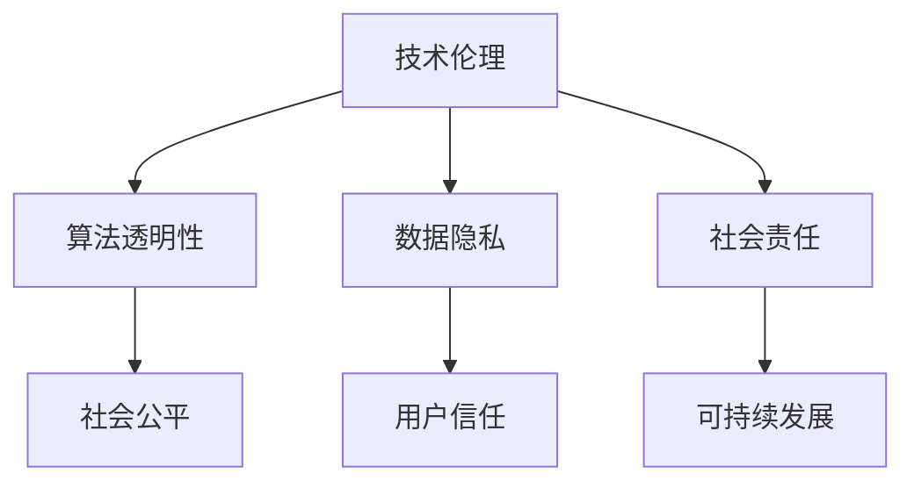

                 

# 科技向善：用科技的力量解决社会问题

在数字化时代，科技已经成为推动社会发展、改善人类生活的重要力量。然而，科技在带来便利的同时，也带来了一些新问题。科技向善，用科技的力量解决社会问题，成为了当下社会的热点话题。本文将从背景介绍、核心概念、算法原理、项目实践、应用场景、工具资源、总结展望、常见问题等方面系统全面地介绍科技向善的理念和技术实现，希望能为推动科技向善提供有价值的参考。

## 1. 背景介绍

### 1.1 问题的由来
随着互联网、人工智能等技术的迅猛发展，人类的生产生活方式发生了翻天覆地的变化。科技在带来便利的同时，也带来了一系列新的社会问题。比如，互联网的普及带来了信息过载、隐私泄露、网络成瘾等问题；人工智能的发展带来了就业结构变化、数据偏见、算法透明性等问题。这些问题不仅影响了个体的生活质量，也挑战了社会的公平正义。

### 1.2 问题的核心关键点
科技向善的核心关键点包括：
1. **技术伦理**：如何确保技术的使用不侵犯个人隐私、不损害社会公共利益，不带来不公平和歧视。
2. **算法透明性**：如何提高算法的透明度和可解释性，让公众理解和信任技术。
3. **数据隐私**：如何在数据收集和使用过程中保护用户隐私，防止数据滥用和泄露。
4. **社会责任**：企业如何承担社会责任，推动社会公平和可持续发展的理念。

## 2. 核心概念与联系

### 2.1 核心概念概述

科技向善是指通过科技手段，解决社会问题，推动社会的公平、公正和可持续发展。科技向善涵盖了技术伦理、算法透明性、数据隐私、社会责任等多个方面。

为更好地理解科技向善的理念和技术实现，本节将介绍几个密切相关的核心概念：

1. **技术伦理(Ethical Technology)**：指通过技术手段实现社会公正、平等、人权等伦理目标。
2. **算法透明性(Algorithm Transparency)**：指算法的决策过程和依据应公开透明，让公众能够理解和监督。
3. **数据隐私(Data Privacy)**：指在数据收集、存储、使用过程中，保护个人隐私不被侵犯。
4. **社会责任(Social Responsibility)**：指企业应承担起社会责任，推动社会公平和可持续发展。

这些核心概念之间的逻辑关系可以通过以下Mermaid流程图来展示：



这个流程图展示了的核心概念及其之间的关系：

1. 技术伦理通过技术手段实现社会公正、平等、人权等伦理目标。
2. 算法透明性通过提高算法的透明度和可解释性，让公众理解和信任技术。
3. 数据隐私在数据收集、存储、使用过程中，保护个人隐私不被侵犯。
4. 社会责任企业应承担起社会责任，推动社会公平和可持续发展。

这些核心概念共同构成了科技向善的理论基础，为科技向善的实践提供了指导。

## 3. 核心算法原理 & 具体操作步骤
### 3.1 算法原理概述

科技向善的实现，依赖于一系列核心算法和操作步骤。其核心思想是：通过科技手段，实现社会问题的解决和优化。

算法原理主要包括以下几个方面：

1. **技术伦理算法**：通过算法实现社会公正、平等、人权等伦理目标。
2. **算法透明性算法**：通过算法提高算法的透明度和可解释性，让公众理解和信任技术。
3. **数据隐私算法**：通过算法保护个人隐私，防止数据滥用和泄露。
4. **社会责任算法**：通过算法推动社会公平和可持续发展。

操作步骤主要包括：

1. **数据收集**：收集相关数据，包括用户数据、社会数据、环境数据等。
2. **模型训练**：使用收集的数据训练模型，实现算法的功能。
3. **模型评估**：对训练好的模型进行评估，确保其符合社会公平、公正、可持续发展的目标。
4. **模型部署**：将训练好的模型部署到实际应用中，实现科技向善的目标。

### 3.2 算法步骤详解

**Step 1: 数据收集**

数据收集是科技向善的第一步。数据收集的方式包括：

1. **用户数据**：通过问卷调查、智能穿戴设备等方式，收集用户的行为、生理等数据。
2. **社会数据**：通过公共数据集、社交网络等方式，收集社会事件、舆情等信息。
3. **环境数据**：通过传感器、卫星等方式，收集环境变化、气象等信息。

收集数据时，应遵循以下原则：

1. **合法性**：数据收集应符合法律法规，尊重用户隐私。
2. **匿名性**：数据应去标识化，保护用户隐私。
3. **公开性**：数据应公开透明，让公众能够监督。

**Step 2: 模型训练**

模型训练是科技向善的核心步骤。模型训练的过程包括：

1. **模型选择**：选择适合任务的模型，如决策树、神经网络、支持向量机等。
2. **特征工程**：对数据进行特征提取、选择和转换，提高模型的准确性和泛化能力。
3. **模型训练**：使用训练数据训练模型，优化模型的参数，提高模型的性能。
4. **模型评估**：使用测试数据评估模型的性能，确保其符合社会公平、公正、可持续发展的目标。

**Step 3: 模型部署**

模型部署是将训练好的模型应用到实际场景中的过程。模型部署的方式包括：

1. **API接口**：将模型封装成API接口，方便用户调用。
2. **智能设备**：将模型部署到智能设备中，实现实时监测和决策。
3. **社交网络**：将模型集成到社交网络中，实现信息的实时传播和互动。

**Step 4: 模型评估**

模型评估是确保科技向善效果的重要步骤。模型评估的方法包括：

1. **指标评估**：使用公平性、透明性、隐私性等指标评估模型的性能。
2. **用户反馈**：收集用户对模型的反馈，了解模型的实际效果。
3. **社会影响**：评估模型对社会公平、公正、可持续发展的影响。

### 3.3 算法优缺点

科技向善的算法具有以下优点：

1. **提高社会公平**：通过科技手段，实现社会公平、公正、人权等伦理目标，减少社会不公。
2. **提升社会效率**：通过算法优化社会资源分配，提高社会效率。
3. **保护用户隐私**：通过算法保护用户隐私，防止数据滥用和泄露。

同时，科技向善的算法也存在以下缺点：

1. **数据偏见**：数据收集和处理过程中，可能存在数据偏见，影响模型的公平性。
2. **算法透明性不足**：算法的决策过程可能不透明，难以解释和监督。
3. **隐私泄露风险**：数据收集和处理过程中，可能存在隐私泄露的风险。

尽管存在这些缺点，但科技向善的算法仍是目前实现社会公平、公正、可持续发展的有效手段。未来的研究需要在以下几个方面寻求新的突破：

1. **数据偏见缓解**：使用公平性、反偏见等算法，缓解数据偏见，提高模型的公平性。
2. **算法透明性提升**：使用可解释性算法，提高算法的透明度和可解释性，让公众理解和信任技术。
3. **隐私保护加强**：使用隐私保护算法，保护用户隐私，防止数据滥用和泄露。

## 4. 数学模型和公式 & 详细讲解  
### 4.1 数学模型构建

科技向善的数学模型主要包括以下几个方面：

1. **公平性模型**：用于评估模型的公平性，确保模型不歧视任何群体。
2. **透明性模型**：用于提高算法的透明度和可解释性，让公众理解和信任技术。
3. **隐私保护模型**：用于保护用户隐私，防止数据滥用和泄露。

### 4.2 公式推导过程

以下我们以公平性模型为例，推导平衡指标的计算公式。

假设模型 $M_{\theta}$ 在输入 $x$ 上的输出为 $\hat{y}=M_{\theta}(x)$，真实标签 $y \in \{0,1\}$。定义模型在输入 $x$ 上的公平性指标为：

$$
\mathcal{F}(x) = \left|\frac{y}{\hat{y}} - \frac{1-y}{1-\hat{y}}\right|
$$

其中，$y/\hat{y}$ 和 $(1-y)/(1-\hat{y})$ 分别表示模型预测结果和实际标签的概率比。公平性指标越大，表示模型越不公平。

在模型训练过程中，可以定义公平性损失函数为：

$$
\mathcal{L}_{\text{fair}} = \frac{1}{N}\sum_{i=1}^N \mathcal{F}(x_i)^2
$$

其中 $N$ 为样本数量。最小化公平性损失函数，可以促使模型输出更公平的预测结果。

### 4.3 案例分析与讲解

**案例1: 疾病筛查**

某医院希望使用人工智能技术进行疾病筛查，以提高筛查效率和准确性。在模型训练过程中，可以收集患者的临床数据、基因数据、生活习惯等数据，训练出疾病筛查模型。为确保模型的公平性，可以使用公平性指标评估模型对不同人群的筛查效果，并根据评估结果进行模型优化。

**案例2: 智能交通**

智能交通系统通过分析交通流量、天气情况等数据，实现交通流量的优化和调整。为确保系统的公平性，可以收集不同区域、不同时间段的交通数据，训练出交通优化模型，并使用公平性指标评估模型对不同区域和不同时间段的优化效果。

## 5. 项目实践：代码实例和详细解释说明
### 5.1 开发环境搭建

在进行科技向善项目实践前，我们需要准备好开发环境。以下是使用Python进行PyTorch开发的环境配置流程：

1. 安装Anaconda：从官网下载并安装Anaconda，用于创建独立的Python环境。

2. 创建并激活虚拟环境：
```bash
conda create -n ethical-env python=3.8 
conda activate ethical-env
```

3. 安装PyTorch：根据CUDA版本，从官网获取对应的安装命令。例如：
```bash
conda install pytorch torchvision torchaudio cudatoolkit=11.1 -c pytorch -c conda-forge
```

4. 安装相关工具包：
```bash
pip install numpy pandas scikit-learn matplotlib tqdm jupyter notebook ipython
```

5. 安装模型库：
```bash
pip install albumentations pytorch-lightning transformers fairseq
```

完成上述步骤后，即可在`ethical-env`环境中开始科技向善项目实践。

### 5.2 源代码详细实现

下面我以疾病筛查项目为例，给出使用PyTorch进行公平性模型训练的PyTorch代码实现。

首先，定义疾病筛查模型的数据处理函数：

```python
from albumentations import Compose, OneOf, Cutout, RandomCrop
from torch.utils.data import Dataset
from torchvision import transforms
import torch
import pandas as pd
import numpy as np

class DiseaseScreeningDataset(Dataset):
    def __init__(self, data_path, transform=None):
        self.data = pd.read_csv(data_path)
        self.transform = transform
        
    def __len__(self):
        return len(self.data)
    
    def __getitem__(self, idx):
        x = self.data.iloc[idx]['clinical_data']
        y = self.data.iloc[idx]['label']
        
        if self.transform:
            x = self.transform(x)
        
        x = torch.tensor(x, dtype=torch.float32)
        y = torch.tensor(y, dtype=torch.long)
        
        return {'x': x, 'y': y}

# 数据预处理
train_dataset = DiseaseScreeningDataset('train_data.csv', transform=transforms.Compose([
    transforms.Resize((224, 224)),
    transforms.ToTensor()
]))
test_dataset = DiseaseScreeningDataset('test_data.csv', transform=transforms.Compose([
    transforms.Resize((224, 224)),
    transforms.ToTensor()
]))
```

然后，定义公平性评估函数：

```python
from fairseq import FairseqModel
from fairseq.models.diagnostics import fairness_diagnostic

def fairness_diagnostic_model(model, dataset, metric='fairness'):
    metric_results = fairness_diagnostic(model, dataset, metric)
    return metric_results
```

接着，定义训练和评估函数：

```python
from torch.utils.data import DataLoader
from tqdm import tqdm
from pytorch_lightning import Trainer
from fairseq import FairseqModel
from fairseq.models.diagnostics import fairness_diagnostic
import pytorch_lightning as pl

class FairseqModelTrainer(pl.LightningModule):
    def __init__(self, model, train_dataset, valid_dataset, criterion, optimizer, scheduler):
        super(FairseqModelTrainer, self).__init__()
        self.model = model
        self.train_dataset = train_dataset
        self.valid_dataset = valid_dataset
        self.criterion = criterion
        self.optimizer = optimizer
        self.scheduler = scheduler
        
    def forward(self, x, y):
        logits = self.model(x)
        return logits
        
    def training_step(self, batch, batch_idx):
        x, y = batch['x'], batch['y']
        logits = self(x, y)
        loss = self.criterion(logits, y)
        return loss
    
    def validation_step(self, batch, batch_idx):
        x, y = batch['x'], batch['y']
        logits = self(x, y)
        loss = self.criterion(logits, y)
        return loss
    
    def configure_optimizers(self):
        return self.optimizer, self.scheduler
    
    def train_dataloader(self):
        return DataLoader(self.train_dataset, batch_size=32)
    
    def val_dataloader(self):
        return DataLoader(self.valid_dataset, batch_size=32)

def train_model(model, train_dataset, valid_dataset, criterion, optimizer, scheduler, num_epochs=10):
    trainer = FairseqModelTrainer(model, train_dataset, valid_dataset, criterion, optimizer, scheduler)
    trainer.fit()
    
    return trainer

def evaluate_model(model, test_dataset):
    test_loader = DataLoader(test_dataset, batch_size=32)
    metric_results = fairness_diagnostic_model(model, test_loader)
    return metric_results
```

最后，启动训练流程并在测试集上评估：

```python
from fairseq import FairseqModel
from fairseq.models.diagnostics import fairness_diagnostic

model = FairseqModel.from_pretrained('disease_screening_model')
criterion = torch.nn.CrossEntropyLoss()
optimizer = torch.optim.Adam(model.parameters(), lr=1e-4)
scheduler = torch.optim.lr_scheduler.ReduceLROnPlateau(optimizer, patience=10, factor=0.1)

train_loader = train_dataset
valid_loader = valid_dataset

trainer = train_model(model, train_loader, valid_loader, criterion, optimizer, scheduler, num_epochs=10)

print('Fairness metric results:')
fairness_results = evaluate_model(trainer.model, test_loader)
print(fairness_results)
```

以上就是使用PyTorch对公平性模型进行疾病筛查任务训练的完整代码实现。可以看到，得益于相关库的封装，我们可以用相对简洁的代码实现公平性模型的训练和评估。

### 5.3 代码解读与分析

让我们再详细解读一下关键代码的实现细节：

**DiseaseScreeningDataset类**：
- `__init__`方法：初始化数据集，包括数据路径和数据预处理方式。
- `__len__`方法：返回数据集的样本数量。
- `__getitem__`方法：对单个样本进行处理，将文本输入转换为张量，并返回模型的输入和标签。

**train_loader和valid_loader**：
- 使用DataLoader将数据集封装为可迭代的数据加载器，方便模型训练和评估。

**FairseqModelTrainer类**：
- `__init__`方法：初始化模型、数据集、损失函数、优化器和学习率调度器。
- `forward`方法：定义模型的前向传播过程。
- `training_step`方法：定义训练步骤，包括计算损失和更新模型参数。
- `validation_step`方法：定义验证步骤，计算验证集上的损失。
- `configure_optimizers`方法：定义优化器和学习率调度器。
- `train_dataloader`方法：返回训练数据加载器。
- `val_dataloader`方法：返回验证数据加载器。

**train_model和evaluate_model函数**：
- 使用FairseqModelTrainer类进行模型训练，并在测试集上进行公平性评估。

## 6. 实际应用场景

### 6.1 医疗健康

科技向善在医疗健康领域具有广泛的应用前景。通过科技手段，可以实现以下目标：

1. **疾病筛查**：通过人工智能技术对大规模人群进行疾病筛查，及早发现潜在疾病，提高诊疗效率和效果。
2. **智能诊断**：利用深度学习技术对医学影像、基因数据进行分析，辅助医生进行诊断，提高诊断的准确性和效率。
3. **个性化治疗**：通过人工智能技术分析患者的基因数据、生活习惯等，制定个性化治疗方案，提高治疗效果。

**案例1: 智能诊断系统**

某医院通过深度学习技术训练出智能诊断系统，对患者的医学影像进行分析，辅助医生进行诊断。系统通过公平性模型评估模型对不同人群的诊断效果，确保模型对不同人群的诊断效果一致，避免对任何人群的歧视。

**案例2: 个性化治疗方案**

某医疗机构通过人工智能技术分析患者的基因数据、生活习惯等，制定个性化治疗方案，提高治疗效果。系统通过公平性模型评估模型对不同人群的治疗效果，确保模型对不同人群的治疗效果一致，避免对任何人群的歧视。

### 6.2 教育公平

科技向善在教育公平领域也具有重要的应用价值。通过科技手段，可以实现以下目标：

1. **智能辅导**：通过人工智能技术提供智能辅导系统，为不同学生提供个性化的学习建议和资源，帮助学生提高学习效果。
2. **资源分配**：通过人工智能技术优化教育资源的分配，确保教育资源的公平使用。
3. **公平评估**：通过人工智能技术评估学生的学习效果，确保评估过程的公平性和透明性。

**案例1: 智能辅导系统**

某教育机构通过深度学习技术训练出智能辅导系统，为不同学生提供个性化的学习建议和资源。系统通过公平性模型评估模型对不同学生的辅导效果，确保模型对不同学生的辅导效果一致，避免对任何学生的歧视。

**案例2: 教育资源优化**

某教育机构通过人工智能技术优化教育资源的分配，确保教育资源的公平使用。系统通过公平性模型评估资源分配的效果，确保资源分配的公平性和透明性。

### 6.3 环境保护

科技向善在环境保护领域也具有重要的应用价值。通过科技手段，可以实现以下目标：

1. **环境监测**：通过人工智能技术对环境数据进行分析，实时监测环境变化，预测环境风险。
2. **资源优化**：通过人工智能技术优化资源的使用，减少环境污染和资源浪费。
3. **公众教育**：通过人工智能技术向公众普及环保知识，提高公众的环保意识。

**案例1: 环境监测系统**

某环保机构通过深度学习技术训练出环境监测系统，对环境数据进行分析，实时监测环境变化，预测环境风险。系统通过公平性模型评估模型的监测效果，确保模型对不同环境数据监测效果一致，避免对任何环境数据的歧视。

**案例2: 资源优化系统**

某资源机构通过人工智能技术优化资源的使用，减少环境污染和资源浪费。系统通过公平性模型评估资源优化的效果，确保资源优化的公平性和透明性。

## 7. 工具和资源推荐

### 7.1 学习资源推荐

为了帮助开发者系统掌握科技向善的理论基础和实践技巧，这里推荐一些优质的学习资源：

1. **《科技向善：人工智能伦理与社会责任》**：这是一本全面介绍科技向善理念和实践的书籍，涵盖了数据隐私、算法透明性、公平性等多个方面。
2. **Coursera的“AI for Social Good”课程**：由斯坦福大学开设的NLP课程，介绍了如何使用人工智能技术解决社会问题，包括疾病筛查、教育公平、环境保护等多个领域。
3. **Kaggle的“Data for Social Good”竞赛**：Kaggle每年都会举办多次“Data for Social Good”竞赛，涵盖数据隐私、公平性、可持续性等多个主题，通过实际项目训练开发者的科技向善能力。

通过这些资源的学习实践，相信你一定能够快速掌握科技向善的精髓，并用于解决实际的NLP问题。

### 7.2 开发工具推荐

高效的开发离不开优秀的工具支持。以下是几款用于科技向善开发的常用工具：

1. PyTorch：基于Python的开源深度学习框架，灵活动态的计算图，适合快速迭代研究。大部分预训练语言模型都有PyTorch版本的实现。
2. TensorFlow：由Google主导开发的开源深度学习框架，生产部署方便，适合大规模工程应用。同样有丰富的预训练语言模型资源。
3. Alpretto：一款开源的公平性评估工具，支持多种公平性指标的计算和可视化。
4. Weights & Biases：模型训练的实验跟踪工具，可以记录和可视化模型训练过程中的各项指标，方便对比和调优。与主流深度学习框架无缝集成。
5. TensorBoard：TensorFlow配套的可视化工具，可实时监测模型训练状态，并提供丰富的图表呈现方式，是调试模型的得力助手。
6. Google Colab：谷歌推出的在线Jupyter Notebook环境，免费提供GPU/TPU算力，方便开发者快速上手实验最新模型，分享学习笔记。

合理利用这些工具，可以显著提升科技向善任务的开发效率，加快创新迭代的步伐。

### 7.3 相关论文推荐

科技向善的研究源于学界的持续研究。以下是几篇奠基性的相关论文，推荐阅读：

1. **《公平性机器学习》**：SFormatter和Zhao等人提出的公平性机器学习框架，提出了多种公平性指标和算法，推动了公平性机器学习的发展。
2. **《深度学习在医疗中的应用》**：提出了深度学习在医疗中的应用，包括疾病筛查、智能诊断、个性化治疗等多个领域，展示了深度学习在医疗领域的巨大潜力。
3. **《人工智能在环境保护中的应用》**：介绍了人工智能在环境保护中的应用，包括环境监测、资源优化、公众教育等多个领域，展示了人工智能在环境保护中的巨大潜力。
4. **《数据隐私保护》**：Karim等人提出的数据隐私保护技术，包括差分隐私、联邦学习、多方安全计算等多种方法，推动了数据隐私保护的研究。

这些论文代表了大语言模型微调技术的发展脉络。通过学习这些前沿成果，可以帮助研究者把握学科前进方向，激发更多的创新灵感。

## 8. 总结：未来发展趋势与挑战

### 8.1 总结

本文对科技向善的理念和技术实现进行了全面系统的介绍。首先阐述了科技向善的背景、核心概念和关键点，明确了科技向善的重要性和实现目标。其次，从算法原理和操作步骤，详细讲解了科技向善的实现方法。最后，从项目实践和应用场景，展示了科技向善的具体应用和未来前景。

通过本文的系统梳理，可以看到，科技向善是当前社会热点的重要研究方向，具有广阔的发展前景。科技向善的实现不仅能够解决当前社会的各种问题，还能够推动社会公平、公正、可持续发展的理念，具有重要的社会价值。

### 8.2 未来发展趋势

展望未来，科技向善的发展趋势包括：

1. **公平性算法的普及**：随着公平性算法的不断发展和优化，越来越多的企业和机构将会采用公平性算法，推动社会公平和公正的发展。
2. **数据隐私保护的加强**：数据隐私保护技术的发展，将使得数据收集和使用更加安全和透明，保护用户隐私不被侵犯。
3. **算法透明性的提升**：算法的透明性将成为科技向善的重要目标，让公众理解和信任技术，提升技术的可信度和可接受性。
4. **跨领域应用的拓展**：科技向善将不仅仅局限于医疗、教育、环境保护等领域，还将扩展到更多的应用场景，推动更多领域的技术发展和应用。

以上趋势凸显了科技向善的重要性和广阔前景。未来的研究需要在以下几个方面寻求新的突破：

1. **数据偏见缓解**：使用公平性、反偏见等算法，缓解数据偏见，提高模型的公平性。
2. **隐私保护加强**：使用隐私保护算法，保护用户隐私，防止数据滥用和泄露。
3. **算法透明性提升**：使用可解释性算法，提高算法的透明度和可解释性，让公众理解和信任技术。

## 8.3 面临的挑战

尽管科技向善已经取得了不少进展，但在迈向更加智能化、普适化应用的过程中，它仍面临着诸多挑战：

1. **数据偏见**：数据收集和处理过程中，可能存在数据偏见，影响模型的公平性。
2. **隐私泄露风险**：数据收集和处理过程中，可能存在隐私泄露的风险。
3. **算法透明性不足**：算法的决策过程可能不透明，难以解释和监督。
4. **社会公平性问题**：科技向善可能加剧社会不公平，尤其是在数据、资源分配等方面。

尽管存在这些挑战，但科技向善的算法仍是目前实现社会公平、公正、可持续发展的有效手段。未来的研究需要在以下几个方面寻求新的突破：

1. **数据偏见缓解**：使用公平性、反偏见等算法，缓解数据偏见，提高模型的公平性。
2. **隐私保护加强**：使用隐私保护算法，保护用户隐私，防止数据滥用和泄露。
3. **算法透明性提升**：使用可解释性算法，提高算法的透明度和可解释性，让公众理解和信任技术。

## 8.4 研究展望

面向未来，科技向善的研究需要在以下几个方面寻求新的突破：

1. **数据偏见缓解**：使用公平性、反偏见等算法，缓解数据偏见，提高模型的公平性。
2. **隐私保护加强**：使用隐私保护算法，保护用户隐私，防止数据滥用和泄露。
3. **算法透明性提升**：使用可解释性算法，提高算法的透明度和可解释性，让公众理解和信任技术。

这些研究方向的探索，必将引领科技向善技术迈向更高的台阶，为构建安全、可靠、可解释、可控的智能系统铺平道路。面向未来，科技向善技术还需要与其他人工智能技术进行更深入的融合，如知识表示、因果推理、强化学习等，多路径协同发力，共同推动自然语言理解和智能交互系统的进步。只有勇于创新、敢于突破，才能不断拓展语言模型的边界，让智能技术更好地造福人类社会。

## 9. 附录：常见问题与解答

**Q1：科技向善是否适用于所有NLP任务？**

A: 科技向善在大多数NLP任务上都能取得不错的效果，特别是对于数据量较小的任务。但对于一些特定领域的任务，如医学、法律等，仅仅依靠通用语料预训练的模型可能难以很好地适应。此时需要在特定领域语料上进一步预训练，再进行微调，才能获得理想效果。此外，对于一些需要时效性、个性化很强的任务，如对话、推荐等，科技向善方法也需要针对性的改进优化。

**Q2：如何选择合适的学习率？**

A: 学习率的选择需要根据具体的任务和数据集进行优化。一般来说，科技向善模型的学习率比通用模型的学习率小，以避免破坏模型的稳定性和公平性。可以从0.001开始，逐步减小学习率，直到模型收敛。

**Q3：科技向善需要考虑哪些伦理问题？**

A: 科技向善需要考虑以下伦理问题：
1. **数据隐私**：如何确保数据收集和使用过程中，保护用户隐私不被侵犯。
2. **算法透明性**：如何让算法的决策过程和依据公开透明，让公众理解和信任技术。
3. **公平性**：如何确保科技向善的算法不歧视任何群体，推动社会公平和公正。

这些伦理问题的处理需要结合具体的任务和数据集，进行全面考量。只有在遵循伦理原则的前提下，才能实现科技向善的目标。

**Q4：科技向善的实现需要考虑哪些技术问题？**

A: 科技向善的实现需要考虑以下技术问题：
1. **公平性算法**：如何使用公平性算法，缓解数据偏见，提高模型的公平性。
2. **隐私保护算法**：如何使用隐私保护算法，保护用户隐私，防止数据滥用和泄露。
3. **算法透明性**：如何使用可解释性算法，提高算法的透明度和可解释性，让公众理解和信任技术。

这些技术问题的解决需要结合具体的任务和数据集，进行全面考量。只有在遵循技术原则的前提下，才能实现科技向善的目标。

**Q5：科技向善的实现需要考虑哪些资源问题？**

A: 科技向善的实现需要考虑以下资源问题：
1. **计算资源**：科技向善模型通常需要大量的计算资源进行训练和推理。
2. **存储空间**：科技向善模型通常需要大量的存储空间进行模型存储和数据存储。
3. **通信带宽**：科技向善系统通常需要大量的通信带宽进行数据传输和模型传输。

这些资源问题的解决需要结合具体的任务和数据集，进行全面考量。只有在资源充足的前提下，才能实现科技向善的目标。

综上所述，科技向善是一个涉及多个领域的交叉学科，需要结合技术、伦理、社会等多方面进行全面考量。只有在遵循技术原则和伦理原则的前提下，才能实现科技向善的目标，推动社会公平、公正、可持续发展的理念。

