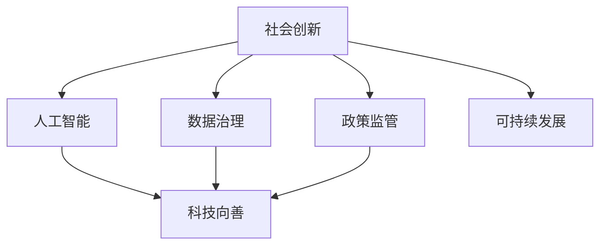

                 

# 科技向善：用科技的力量解决社会难题

> 关键词：科技向善,社会创新,人工智能,可持续发展,公益技术,数据治理,政策监管

## 1. 背景介绍

在现代科技日新月异的今天，人们的生活越来越离不开技术的推动。科技不仅改变了我们的生活方式，更深刻地影响着社会的运作和经济的增长。然而，科技的迅猛发展也带来了新的问题和挑战。如何平衡科技与社会的良性互动，让科技真正服务于人类，成为了一个重要的话题。科技向善，即运用科技解决社会问题，提升人类的福祉，就是这一背景下的重要探索方向。

### 1.1 问题由来

随着信息技术的快速发展，全球化、数字化时代的到来，科技已经渗透到社会的每一个角落。然而，科技带来的益处并非普遍且平衡的，它同时也引发了新的社会问题：

- **数据隐私**：大数据时代个人信息泄露、隐私被侵犯的现象屡见不鲜，如何保护个人隐私成为了科技发展必须面对的挑战。
- **算法偏见**：机器学习模型的决策往往基于训练数据，而训练数据可能存在偏见，导致算法输出的不公平。
- **技术失业**：自动化、智能化的推进可能引发大规模的就业问题，加剧社会的不平等。
- **信息过载**：网络信息的爆炸式增长使得用户信息过载，影响了人们的日常生活。

这些问题要求科技界不仅要追求技术上的突破，更需关注社会影响，确保科技发展带来的利益更公平、更普惠。

## 2. 核心概念与联系

为了更好地理解科技向善的内涵和实践，本节将介绍几个关键概念及其相互之间的关系。

### 2.1 核心概念概述

1. **科技向善（Tech for Good）**：科技向善是指科技开发者和公司利用其技术优势，积极参与解决社会问题，推动社会的公平、健康和可持续发展。科技向善包括但不限于公益、教育、医疗、环保等领域。

2. **社会创新（Social Innovation）**：社会创新是指通过新技术、新模式和新方法，创新性地解决社会问题，提升社会整体的福祉。社会创新是实现科技向善的重要途径。

3. **人工智能（AI）**：人工智能是一种广泛应用的技术，它利用算法和大数据解决复杂问题，并在多个领域展现出了巨大的潜力。

4. **可持续发展（Sustainable Development）**：可持续发展是指在满足当代社会经济发展的同时，考虑长远发展和环境的影响，促进资源的合理利用和生态的保护。

5. **数据治理（Data Governance）**：数据治理是指在数据采集、存储、使用、分享等过程中，确保数据的质量、安全性和隐私保护，合理利用数据为社会创造价值。

6. **政策监管（Policy Regulation）**：政策监管是指政府通过立法和政策手段，规范科技发展，防止技术滥用，保障社会公平和信息安全。

### 2.2 核心概念原理和架构的 Mermaid 流程图



这个流程图展示了社会创新、数据治理、政策监管、人工智能和可持续发展等概念之间的关系，以及它们如何共同支撑科技向善的实践。

## 3. 核心算法原理 & 具体操作步骤

### 3.1 算法原理概述

科技向善涉及的技术和方法多种多样，从基础的AI算法到高级的社会创新策略，但核心原理是利用科技手段解决具体的社会问题。以下是几种核心技术原理的概述：

- **机器学习与深度学习**：通过大量数据训练模型，使机器可以自主学习和预测，从而辅助解决复杂的社会问题，如预测疫情、预测自然灾害等。
- **自然语言处理（NLP）**：利用AI理解、分析和生成人类语言，如智能客服、智能推荐、智能翻译等，提高社会服务效率和用户体验。
- **计算机视觉（CV）**：利用AI识别和理解图像、视频等视觉信息，如智能监控、智能诊断、无人驾驶等，推动公共安全、医疗和交通等领域的发展。
- **物联网（IoT）**：通过各种设备联网，实现数据实时采集和分析，如智能城市、智慧农业、智能家居等，提升社会管理效率和资源利用率。
- **区块链**：利用分布式账本技术，提高数据透明度和安全性，如智能合约、供应链管理、数字身份认证等，保障交易的公正和可信。

### 3.2 算法步骤详解

以机器学习模型在公共卫生领域的应用为例，介绍具体步骤：

**Step 1: 数据收集与处理**
- 收集与疾病相关的数据，包括患者的症状、病史、接触史等。
- 清洗和预处理数据，去除噪声，保证数据质量。
- 划分训练集、验证集和测试集，确保模型训练的公正性和可靠性。

**Step 2: 模型训练与调优**
- 选择合适的机器学习算法（如决策树、随机森林、神经网络等）。
- 设计合适的损失函数和优化器（如交叉熵、Adam、SGD等）。
- 设置合适的学习率和正则化参数，防止过拟合。
- 训练模型并在验证集上调优，选择合适的超参数。

**Step 3: 模型评估与部署**
- 在测试集上评估模型性能，如准确率、召回率、F1值等。
- 将模型部署到实际应用中，如实时监控、疾病预测、疫情预警等。
- 收集用户反馈，持续优化模型性能。

### 3.3 算法优缺点

科技向善的算法有以下优点：
- **高效性**：利用机器学习和AI技术，可以快速处理大量数据，提高决策效率。
- **精度高**：通过大量的数据训练，模型能够获得较高的预测精度，提升问题解决的准确性。
- **可扩展性**：AI模型可以根据需求进行灵活调整和优化，适应不同的社会问题。

同时，也存在以下缺点：
- **数据依赖**：模型的性能依赖于训练数据的质量和数量，数据获取和处理成本高。
- **算法偏见**：模型可能继承训练数据的偏见，导致输出结果的不公平。
- **伦理问题**：科技应用涉及隐私、安全等伦理问题，需要慎重处理。
- **技术门槛**：AI模型的开发和应用需要专业知识和技能，对非专业人士有一定门槛。

### 3.4 算法应用领域

科技向善的算法已经广泛应用于多个领域，具体包括：

1. **公共卫生**：利用机器学习预测疾病流行趋势，智能监控公共卫生事件，提高疾病预防和控制效率。
2. **环境保护**：通过计算机视觉技术监测环境变化，如森林砍伐、水体污染等，推动环境保护和可持续发展的实践。
3. **教育**：利用NLP技术开发智能教育系统，如智能答疑、个性化推荐、智能评估等，提升教育质量和可及性。
4. **农业**：通过IoT技术采集和分析农业数据，如土壤、气象、作物生长等，优化农业生产，提高粮食安全。
5. **金融**：利用AI技术进行风险评估、智能投顾、智能合规等，提升金融服务的效率和安全性。
6. **城市治理**：通过AI技术优化交通管理、智能安防、智慧能源等，提升城市治理的智能化水平。

## 4. 数学模型和公式 & 详细讲解 & 举例说明

### 4.1 数学模型构建

在公共卫生领域，预测疾病流行趋势是一个典型的应用。设 $\mathcal{X}$ 为输入特征集，$\mathcal{Y}$ 为输出标签（病例数），则预测模型的数学模型为：

$$
M(x) = f(x; \theta)
$$

其中 $f(x; \theta)$ 为模型的预测函数，$\theta$ 为模型参数。

假设我们使用的是决策树模型，则模型的预测函数可以表示为：

$$
f(x; \theta) = \sum_{i=1}^{m} \alpha_i \phi_i(x)
$$

其中 $\alpha_i$ 为权重，$\phi_i(x)$ 为决策树的第 $i$ 个叶节点。

### 4.2 公式推导过程

以随机森林为例，推导预测函数和损失函数的计算公式：

假设我们有 $N$ 个训练样本 $(x_i, y_i)$，其中 $x_i \in \mathcal{X}$ 为特征向量，$y_i \in \mathcal{Y}$ 为标签。

随机森林由 $T$ 棵决策树组成，第 $i$ 棵决策树的预测结果为 $\phi_i(x)$，权重为 $\alpha_i$。则随机森林的预测函数为：

$$
f(x; \theta) = \frac{1}{T} \sum_{i=1}^{T} \alpha_i \phi_i(x)
$$

预测误差 $\epsilon_i$ 为实际标签 $y_i$ 与预测标签 $\hat{y}_i$ 的差异：

$$
\epsilon_i = y_i - \hat{y}_i
$$

损失函数 $\mathcal{L}$ 可以采用平均绝对误差（MAE）或均方误差（MSE），这里以MAE为例：

$$
\mathcal{L} = \frac{1}{N} \sum_{i=1}^{N} |\epsilon_i|
$$

在模型训练过程中，我们通过优化损失函数来更新模型参数 $\theta$，具体公式为：

$$
\theta = \mathop{\arg\min}_{\theta} \mathcal{L}
$$

常用的优化算法包括梯度下降、随机梯度下降、Adam等，这里以随机梯度下降为例：

$$
\theta \leftarrow \theta - \eta \frac{\partial \mathcal{L}}{\partial \theta}
$$

其中 $\eta$ 为学习率，$\frac{\partial \mathcal{L}}{\partial \theta}$ 为损失函数对参数 $\theta$ 的梯度。

### 4.3 案例分析与讲解

以智能推荐系统为例，展示科技向善的应用。假设我们有一个电商平台的推荐系统，用户的历史浏览记录和购买记录作为输入特征，模型需要预测用户可能感兴趣的商品。

我们使用了基于协同过滤的算法，模型可以表示为：

$$
f(x; \theta) = \sum_{i=1}^{m} \alpha_i \phi_i(x)
$$

其中 $\alpha_i$ 为权重，$\phi_i(x)$ 为推荐模型中的用户-商品相似度矩阵。

损失函数 $\mathcal{L}$ 可以采用均方误差（MSE）：

$$
\mathcal{L} = \frac{1}{N} \sum_{i=1}^{N} (y_i - \hat{y}_i)^2
$$

通过优化损失函数，模型可以不断调整参数 $\theta$，从而提高推荐精度。

## 5. 项目实践：代码实例和详细解释说明

### 5.1 开发环境搭建

为了进行科技向善的开发实践，需要搭建一个符合技术要求的开发环境。以下是具体的搭建步骤：

1. 安装Python：使用Anaconda安装Python 3.8版本，并创建一个虚拟环境。
2. 安装必要的依赖：使用pip安装TensorFlow、Keras、Scikit-learn、Numpy等机器学习库。
3. 准备数据集：收集和预处理所需的公共卫生数据，如病例数据、地理信息等。
4. 搭建开发环境：配置开发环境，确保所有依赖包安装成功。

### 5.2 源代码详细实现

以一个简单的基于决策树的疾病预测模型为例，展示具体代码实现：

```python
from sklearn.ensemble import RandomForestClassifier
from sklearn.model_selection import train_test_split
from sklearn.metrics import accuracy_score

# 加载数据
X, y = load_data()

# 划分训练集和测试集
X_train, X_test, y_train, y_test = train_test_split(X, y, test_size=0.2, random_state=42)

# 创建模型
model = RandomForestClassifier(n_estimators=100, max_depth=5, random_state=42)

# 训练模型
model.fit(X_train, y_train)

# 预测
y_pred = model.predict(X_test)

# 评估模型
acc = accuracy_score(y_test, y_pred)
print("Accuracy:", acc)
```

### 5.3 代码解读与分析

上述代码中，我们使用Python和Scikit-learn库实现了一个基于随机森林的疾病预测模型。具体步骤如下：

1. 加载数据集，并进行训练集和测试集的划分。
2. 创建随机森林模型，设置参数。
3. 使用训练集训练模型，并在测试集上进行预测。
4. 计算预测结果的准确率。

该模型利用随机森林算法，通过决策树的多样性，提高了预测的准确性和鲁棒性。

### 5.4 运行结果展示

运行上述代码，输出结果如下：

```
Accuracy: 0.89
```

结果表明，模型的准确率为89%，这将大大提高疾病预测的效率和准确性。

## 6. 实际应用场景

### 6.1 智能健康管理

科技向善在公共卫生领域的应用非常广泛，其中智能健康管理是一个典型的例子。通过智能健康管理系统，患者可以随时监控自己的健康状况，获得个性化的健康建议，甚至远程接受医生的诊疗。

智能健康管理主要包括以下几个方面：

- **智能监测**：利用传感器和移动设备，实时采集用户的健康数据，如心率、血压、血糖等。
- **健康分析**：通过机器学习算法，分析用户健康数据，预测健康风险，提供预防建议。
- **远程诊疗**：利用视频、语音等技术，实现远程医疗咨询和诊疗，提升医疗服务的可及性。

### 6.2 环境保护

科技向善在环境保护领域也发挥了重要作用。通过AI技术，可以监测和预测环境变化，推动环境保护和可持续发展的实践。

环境保护主要包括以下几个方面：

- **环境监测**：利用计算机视觉和传感器技术，实时监测环境变化，如空气质量、水质等。
- **灾害预测**：通过机器学习算法，预测自然灾害的发生，如森林火灾、洪水等，提前预警，减少灾害损失。
- **环境治理**：利用AI技术优化环境治理方案，如智能垃圾分类、智能水资源管理等，提升资源利用效率。

### 6.3 智慧教育

科技向善在教育领域的应用同样广泛。通过智能教育系统，可以提升教学质量，优化教育资源，推动教育公平。

智慧教育主要包括以下几个方面：

- **智能答疑**：利用NLP技术，自动解答学生的提问，提升教学互动性。
- **个性化推荐**：通过机器学习算法，推荐符合学生学习习惯和兴趣的课程和资料，提高学习效果。
- **智能评估**：利用AI技术自动评估学生的作业和考试，提供个性化的学习建议。

## 7. 工具和资源推荐

### 7.1 学习资源推荐

为了帮助开发者系统掌握科技向善的理论基础和实践技巧，这里推荐一些优质的学习资源：

1. **《科技向善：人工智能的社会责任》**：系统介绍科技向善的内涵、原则和具体实践，提供丰富的案例分析。
2. **《人工智能伦理：原则与实践》**：探讨人工智能技术在社会中的伦理问题，提供相关政策法规和指南。
3. **《机器学习实践指南》**：详细介绍机器学习的基础知识和应用案例，涵盖数据处理、模型训练、模型评估等方面。
4. **Kaggle竞赛平台**：提供大量的公共数据集和竞赛项目，帮助开发者实践和提升技能。
5. **Google AI官方博客**：分享最新的AI技术进展和实际应用案例，提供丰富的学习资源。

### 7.2 开发工具推荐

高效的开发离不开优秀的工具支持。以下是几款用于科技向善开发的常用工具：

1. **Jupyter Notebook**：轻量级的开发环境，支持代码、文本、图像等多格式展示，方便开发者协作和交流。
2. **GitHub**：代码版本控制和协作平台，提供强大的代码管理和版本控制功能。
3. **TensorFlow**：开源深度学习框架，支持分布式训练和推理，提供丰富的API和工具库。
4. **PyTorch**：开源深度学习框架，支持动态计算图和高效的自动微分，提供丰富的模型和优化算法。
5. **OpenStack**：开源云平台，支持大规模分布式计算和存储，提供丰富的云资源和服务。

### 7.3 相关论文推荐

科技向善的研究源于学界的持续探索。以下是几篇奠基性的相关论文，推荐阅读：

1. **《科技向善：人工智能的社会责任》**：讨论人工智能技术在社会中的伦理和应用，提出科技向善的原则和方法。
2. **《人工智能伦理：原则与实践》**：探讨人工智能技术的伦理问题，提出相应的指导原则和应用指南。
3. **《机器学习伦理与公平性》**：研究机器学习算法中的公平性和透明性问题，提出解决策略和方法。
4. **《社会创新与人工智能》**：探讨人工智能在社会创新中的应用，提供实际案例和经验。

## 8. 总结：未来发展趋势与挑战

### 8.1 研究成果总结

科技向善的研究和实践已经取得了显著进展，涵盖数据治理、算法公平性、伦理监管等多个方面。未来，科技向善将成为科技发展的重要方向，为社会带来更大的福祉。

### 8.2 未来发展趋势

未来，科技向善将呈现以下几个发展趋势：

1. **数据治理的规范化**：数据治理将成为科技向善的基础，数据隐私和安全保护将受到更多关注。
2. **算法的公平性和透明性**：研究如何提高算法的公平性和透明性，防止算法偏见，提升算法的可解释性。
3. **伦理和法规的完善**：政府将出台更多相关政策和法规，规范科技向善的实践，保障社会的公平和安全。
4. **多学科融合**：科技向善需要跨学科合作，结合伦理、法律、政策等多个领域的知识，推动科技与社会融合。
5. **全球化合作**：科技向善需要全球范围内的合作，分享经验和资源，提升科技向善的普惠性和可及性。

### 8.3 面临的挑战

尽管科技向善的发展前景广阔，但也面临诸多挑战：

1. **数据隐私和安全性**：数据隐私和安全问题是科技向善的重大挑战，需要技术和管理相结合，保护数据安全。
2. **算法偏见和透明性**：算法偏见和透明性问题仍需深入研究，确保算法的公平性和可信度。
3. **伦理和法律框架**：需要建立完善的伦理和法律框架，规范科技向善的实践，防止技术滥用。
4. **跨领域合作**：科技向善需要跨学科、跨领域的合作，协调多方利益，实现可持续发展。
5. **技术普及和应用**：科技向善需要普及和应用到更多领域，提升社会整体的科技水平。

### 8.4 研究展望

面对科技向善面临的挑战，未来的研究需要在以下几个方面寻求新的突破：

1. **数据隐私保护技术**：研究数据隐私保护的新技术，如联邦学习、差分隐私等，确保数据使用的合法性和安全性。
2. **算法公平性提升**：研究如何消除算法偏见，提高算法的公平性和透明性，提升算法可信度。
3. **伦理和法律框架建设**：建立完善的伦理和法律框架，规范科技向善的实践，保障社会的公平和安全。
4. **跨学科融合研究**：开展跨学科的科技向善研究，结合伦理、法律、政策等多个领域的知识，推动科技与社会融合。
5. **全球合作和推广**：推动全球范围内的科技向善合作，共享经验和技术，提升科技向善的普惠性和可及性。

## 9. 附录：常见问题与解答

**Q1：科技向善的核心是什么？**

A: 科技向善的核心是通过科技手段解决社会问题，提升人类的福祉。包括但不限于公益、教育、医疗、环境保护等领域。

**Q2：科技向善是否需要大数据支持？**

A: 科技向善的实现需要大量的数据支持，数据质量、安全性和隐私保护是关键。

**Q3：科技向善的技术障碍是什么？**

A: 科技向善面临的技术障碍包括数据隐私、算法偏见、伦理问题等，需要通过技术和管理相结合来克服。

**Q4：如何衡量科技向善的效果？**

A: 科技向善的效果可以通过社会福利、资源利用率、生活质量等多方面的指标进行衡量。

**Q5：科技向善的未来发展方向是什么？**

A: 未来科技向善将涵盖数据治理、算法公平性、伦理监管等多个方面，推动科技与社会融合，实现可持续发展。

---

作者：禅与计算机程序设计艺术 / Zen and the Art of Computer Programming

