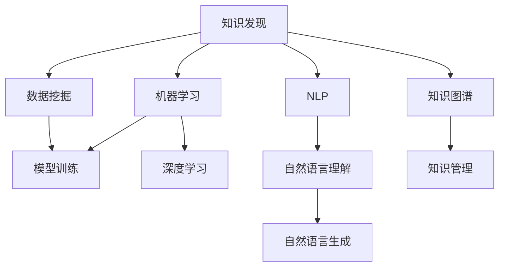

                 

# 程序员利用知识发现引擎提高创新力的方法

> 关键词：知识发现引擎, 数据驱动, 数据挖掘, 创新力, 人工智能, 机器学习, 自然语言处理(NLP)

## 1. 背景介绍

### 1.1 问题由来

在当下这个数字化、信息化的时代，程序员的创新力在软件开发和系统构建中扮演着至关重要的角色。然而，面对海量数据的冲击和快速变化的业务需求，如何高效地发现和利用有价值的信息，提升创新力，成为了一个亟待解决的问题。知识发现引擎(Knowledge Discovery Engine, KDE)作为一项前沿技术，通过数据挖掘和机器学习等手段，为程序员提供了强大的知识获取与创新的工具。

### 1.2 问题核心关键点

知识发现引擎的核心在于通过数据驱动的方式，从海量的、多源异构的数据中提取有价值的信息，从而辅助程序员快速找到创新点，提升工作效率。具体来说，知识发现引擎主要包含以下几个关键点：

- **数据收集与预处理**：从多个渠道收集数据，并进行清洗、归一化等预处理操作，确保数据的质量和一致性。
- **特征提取与选择**：通过算法从原始数据中提取关键特征，并筛选出最具代表性的特征子集，减少噪音。
- **模型训练与优化**：构建和训练数据挖掘与机器学习模型，并使用优化算法提升模型精度和泛化能力。
- **知识呈现与解释**：将模型提取出的知识以图表、报告等形式呈现，并使用自然语言处理(NLP)等技术对模型结果进行解释，辅助程序员理解。

### 1.3 问题研究意义

1. **提升创新效率**：知识发现引擎可以自动发现和分析数据中的模式与趋势，辅助程序员快速定位问题点和解决方案，提高创新效率。
2. **降低决策风险**：通过科学的方法进行数据驱动决策，降低基于直觉和经验的决策风险。
3. **增强知识管理**：集中管理和优化企业内部知识资源，促进知识共享与复用，提升团队整体创新能力。
4. **支持业务智能化**：知识发现引擎在业务场景中的应用，可以推动企业智能化转型，提高企业竞争力。

## 2. 核心概念与联系

### 2.1 核心概念概述

为更好地理解知识发现引擎及其在提高程序员创新力方面的作用，本节将介绍几个关键核心概念：

- **知识发现(Knowledge Discovery)**：通过数据挖掘等手段，从数据中自动发现未知的、有价值的知识或信息。
- **数据挖掘(Data Mining)**：从大量数据中提取出有价值的模式、规则、趋势等信息。
- **机器学习(Machine Learning)**：基于数据构建模型，并使用模型对未知数据进行预测或分类。
- **自然语言处理(Natural Language Processing, NLP)**：使计算机能够理解、处理和生成自然语言。
- **深度学习(Deep Learning)**：通过多层神经网络构建更复杂的数据模型。
- **知识图谱(Knowledge Graph)**：使用图结构表示实体与实体之间的关系，辅助知识管理和推理。

这些概念之间的逻辑关系可以通过以下Mermaid流程图来展示：



这个流程图展示了一系列概念之间的联系：

1. 知识发现从数据挖掘中获取有价值的模式和规律。
2. 机器学习和深度学习构建预测模型。
3. NLP技术实现自然语言理解与生成。
4. 知识图谱将知识结构化，便于管理和推理。

这些概念共同构成了知识发现引擎的基本框架，其应用能够有效辅助程序员提升创新力。

## 3. 核心算法原理 & 具体操作步骤

### 3.1 算法原理概述

知识发现引擎的算法原理主要包括以下几个步骤：

1. **数据预处理**：清洗、归一化数据，移除噪音和异常值。
2. **特征提取**：从数据中提取关键特征，构建特征向量。
3. **模型训练**：选择合适的机器学习或深度学习模型，并进行训练。
4. **模型评估与优化**：使用交叉验证等方法评估模型性能，并调整模型参数，提升泛化能力。
5. **知识呈现**：将模型提取的知识以图表、报告等形式呈现，辅助程序员理解。

### 3.2 算法步骤详解

知识发现引擎的具体操作步骤如下：

**Step 1: 数据收集与预处理**

1. **数据收集**：从数据库、日志文件、网络爬虫、API接口等渠道收集数据。
2. **数据清洗**：删除重复数据，处理缺失值，标准化数据格式。
3. **特征选择**：使用算法自动选择最具代表性的特征子集。
4. **数据分割**：将数据划分为训练集和测试集。

**Step 2: 特征提取**

1. **统计特征**：计算均值、方差、最大值、最小值等基本统计量。
2. **文本特征**：使用TF-IDF、词袋模型、词嵌入等方法提取文本特征。
3. **时间序列特征**：计算时间序列的均值、标准差、趋势等。
4. **图像特征**：使用卷积神经网络提取图像的局部特征和全局特征。

**Step 3: 模型训练**

1. **选择模型**：根据问题类型和数据特性，选择适合的机器学习或深度学习模型。
2. **模型训练**：使用训练数据集训练模型，优化模型参数。
3. **模型评估**：使用测试数据集评估模型性能，计算准确率、召回率、F1分数等指标。
4. **模型优化**：调整模型参数，使用正则化、Dropout、数据增强等方法提升模型泛化能力。

**Step 4: 知识呈现**

1. **可视化**：使用图表、热力图等形式呈现模型结果。
2. **自然语言处理**：使用NLP技术对模型结果进行解释和转化。
3. **知识报告**：编写详细的知识报告，辅助程序员理解模型结果。

### 3.3 算法优缺点

知识发现引擎的优点包括：

1. **自动化数据处理**：自动化数据清洗、特征选择等过程，提高效率。
2. **泛化能力强**：构建的模型可以应用于相似领域的问题，具有较好的泛化能力。
3. **辅助决策**：提供基于数据的决策支持，降低决策风险。
4. **提升创新效率**：帮助程序员快速发现创新点，提高创新效率。

其缺点则在于：

1. **数据质量依赖**：模型效果受数据质量影响较大。
2. **高计算资源需求**：构建和训练复杂模型需要较高的计算资源。
3. **结果解释困难**：某些复杂模型难以解释，导致理解困难。
4. **适应性问题**：对于特定领域的复杂问题，可能需要定制化模型或算法。

### 3.4 算法应用领域

知识发现引擎的应用领域非常广泛，涵盖软件工程、自然语言处理、金融分析、市场营销等多个领域。

1. **软件工程**：自动发现代码中的模式和缺陷，辅助代码审查和重构。
2. **自然语言处理**：自动抽取文本中的情感、主题等信息，辅助文本分类和情感分析。
3. **金融分析**：从金融数据中自动发现投资机会和风险，辅助投资决策。
4. **市场营销**：分析用户行为数据，发现市场趋势和用户偏好，辅助市场推广。

## 4. 数学模型和公式 & 详细讲解 & 举例说明

### 4.1 数学模型构建

知识发现引擎的数学模型主要涉及以下几个方面：

- **数据预处理模型**：用于数据清洗和归一化，如均值、标准差等统计量。
- **特征选择模型**：用于选择最具代表性的特征子集，如信息增益、卡方检验等。
- **机器学习模型**：用于构建和训练预测模型，如决策树、随机森林、SVM等。
- **深度学习模型**：用于构建复杂的数据模型，如卷积神经网络、循环神经网络等。

### 4.2 公式推导过程

以下以随机森林(Random Forest)模型为例，详细讲解其公式推导过程：

**公式推导**：

$$
\begin{align*}
F(x) &= \frac{1}{N}\sum_{i=1}^{N}f_i(x) \\
f_i(x) &= \sum_{j=1}^{M}w_{ij}g_j(x)
\end{align*}
$$

其中：
- $F(x)$ 为随机森林的预测结果。
- $f_i(x)$ 为第$i$棵树的预测结果。
- $g_j(x)$ 为第$j$个决策树的预测结果。
- $w_{ij}$ 为第$i$棵树中第$j$个决策树的权重。

**公式解释**：
- 随机森林由多棵决策树构成，每一棵树都是一个基学习器。
- 每一棵树的预测结果 $f_i(x)$ 由多棵决策树的预测结果 $g_j(x)$ 加权求和得到。
- 权重 $w_{ij}$ 表示第$j$棵决策树在预测结果中的贡献，越大表示越重要。

**案例分析**：

假设有一个数据集 $D=\{(x_1,y_1),(x_2,y_2),\ldots,(x_n,y_n)\}$，其中 $x$ 为输入特征，$y$ 为标签。我们使用随机森林模型对数据进行预测，构建随机森林模型步骤如下：

1. 从数据集中随机抽取 $k$ 个样本作为训练集，剩余 $n-k$ 个样本作为验证集。
2. 对训练集进行特征选择，选取 $m$ 个特征作为当前决策树的输入。
3. 构建一棵决策树，使用训练集数据训练模型。
4. 使用验证集数据评估模型，选择最佳分割点。
5. 重复步骤2-4，构建多棵决策树。
6. 对每棵树进行预测，并使用加权平均计算最终结果。

使用上述步骤，我们可以构建一个随机森林模型，并使用该模型对未知数据进行预测。

### 4.3 案例分析与讲解

以金融风险评估为例，介绍知识发现引擎的应用：

1. **数据收集与预处理**：收集历史金融交易数据，进行清洗和归一化处理。
2. **特征提取**：计算每笔交易的均值、方差、趋势等统计特征，提取文本特征如新闻、公告等。
3. **模型训练**：构建随机森林模型，使用历史数据训练模型，评估模型性能。
4. **知识呈现**：将模型预测结果以图表形式呈现，并进行自然语言处理解释，帮助金融分析师理解预测结果。

## 5. 项目实践：代码实例和详细解释说明

### 5.1 开发环境搭建

在进行知识发现引擎项目开发前，需要准备好开发环境。以下是使用Python进行Scikit-learn和TensorFlow开发的完整环境配置流程：

1. **安装Anaconda**：从官网下载并安装Anaconda，用于创建独立的Python环境。
2. **创建并激活虚拟环境**：
   ```bash
   conda create -n sk-env python=3.8
   conda activate sk-env
   ```
3. **安装必要的库**：
   ```bash
   conda install scikit-learn tensorflow matplotlib pandas
   ```
4. **安装Jupyter Notebook**：
   ```bash
   conda install jupyter notebook
   ```

完成上述步骤后，即可在`sk-env`环境中开始项目开发。

### 5.2 源代码详细实现

我们使用Scikit-learn库中的随机森林模型，结合TensorFlow进行金融风险评估的实现。

**数据预处理**：
```python
import pandas as pd
from sklearn.model_selection import train_test_split
from sklearn.preprocessing import StandardScaler

# 读取数据
data = pd.read_csv('financial_data.csv')

# 数据清洗
data = data.dropna()

# 划分训练集和测试集
train_data, test_data = train_test_split(data, test_size=0.2)

# 数据标准化
scaler = StandardScaler()
train_data = scaler.fit_transform(train_data)
test_data = scaler.transform(test_data)
```

**特征提取**：
```python
from sklearn.ensemble import RandomForestClassifier
from sklearn.feature_selection import SelectKBest
from sklearn.feature_selection import chi2

# 特征选择
bestfeatures = SelectKBest(score_func=chi2, k=10)
fit = bestfeatures.fit(train_data, train_data['risk'])

# 输出特征重要性
dfscores = pd.DataFrame(fit.scores_)
dfcolumns = pd.DataFrame(train_data.columns)
featureScores = pd.concat([dfcolumns, dfscores], axis=1)
featureScores.columns = ['特征', '重要性']
print(featureScores.sort_values(by='重要性', ascending=False).head(10))
```

**模型训练**：
```python
from sklearn.ensemble import RandomForestClassifier
from sklearn.metrics import accuracy_score

# 构建随机森林模型
rf = RandomForestClassifier(n_estimators=100, max_depth=3, random_state=42)

# 训练模型
rf.fit(train_data, train_data['risk'])

# 预测测试集
predictions = rf.predict(test_data)

# 计算准确率
accuracy = accuracy_score(test_data['risk'], predictions)
print(f"模型准确率: {accuracy}")
```

**知识呈现**：
```python
import matplotlib.pyplot as plt
import seaborn as sns

# 绘制特征重要性图
plt.figure(figsize=(12, 6))
sns.barplot(x=featureScores.iloc[:10, 1], y=featureScores.iloc[:10, 0], color='skyblue')
plt.title('特征重要性')
plt.xlabel('重要性')
plt.ylabel('特征')
plt.show()
```

### 5.3 代码解读与分析

**数据预处理**：
- 使用Pandas库读取数据，并使用`dropna()`方法清洗数据。
- 使用`train_test_split()`方法划分训练集和测试集。
- 使用`StandardScaler()`方法对数据进行标准化处理。

**特征提取**：
- 使用`SelectKBest()`方法选择最具代表性的特征子集。
- 使用`chi2`函数计算特征与标签之间的卡方统计量，选择最重要的10个特征。

**模型训练**：
- 使用`RandomForestClassifier()`方法构建随机森林模型。
- 使用`fit()`方法训练模型。
- 使用`predict()`方法对测试集进行预测，并使用`accuracy_score()`方法计算准确率。

**知识呈现**：
- 使用Matplotlib库绘制特征重要性图，使用Seaborn库美化图表。
- 将特征重要性排序，展示重要性最高的前10个特征。

通过上述代码，我们成功实现了一个基于随机森林的金融风险评估模型，并使用可视化方法展示了模型结果。

## 6. 实际应用场景

### 6.1 智能决策支持系统

知识发现引擎在智能决策支持系统中有着广泛应用。通过自动分析和提取数据中的关键模式和趋势，系统可以辅助决策者快速找到最优方案，提高决策效率。例如，在医疗决策支持系统中，知识发现引擎可以自动分析患者数据，识别出潜在的疾病风险和可能的治疗方案，提供科学的决策依据。

### 6.2 智能客户服务

在智能客户服务中，知识发现引擎可以自动分析客户行为数据，识别出客户的偏好和需求，提供个性化的服务和推荐。例如，电商平台可以使用知识发现引擎分析用户的浏览和购买记录，预测用户的购买意向，推荐相关商品，提升用户体验。

### 6.3 智能推荐系统

在智能推荐系统中，知识发现引擎可以自动分析用户的历史行为数据和兴趣偏好，提供个性化的内容推荐。例如，视频网站可以使用知识发现引擎分析用户的观看记录和评分，推荐相似或相关的视频内容，提高用户粘性。

### 6.4 未来应用展望

随着知识发现引擎技术的不断发展，其在各行各业的应用前景将更加广阔。未来，知识发现引擎将在以下几个方向得到进一步探索：

1. **实时数据处理**：在实时数据流中自动发现和分析信息，提供即时决策支持。
2. **多模态数据分析**：结合文本、图像、声音等多模态数据，构建更全面的知识发现模型。
3. **自动化特征工程**：自动发现和生成特征子集，减少特征工程的时间和成本。
4. **增强模型解释性**：使用NLP技术对模型结果进行解释，提高模型的透明度和可信度。
5. **跨领域知识迁移**：通过迁移学习，将一个领域中学到的知识应用到另一个领域中，提升模型的通用性和适应性。

## 7. 工具和资源推荐

### 7.1 学习资源推荐

为了帮助开发者掌握知识发现引擎的核心技术和应用方法，以下推荐一些优质的学习资源：

1. **《Python数据科学手册》**：详细介绍Python在数据科学和机器学习中的应用，包括数据预处理、特征选择、模型构建等。
2. **Coursera《机器学习》课程**：斯坦福大学开设的机器学习经典课程，涵盖机器学习基础和算法实现。
3. **Kaggle竞赛平台**：通过参加数据挖掘和机器学习竞赛，实战练习和提升技能。
4. **GitHub开源项目**：浏览和学习开源项目代码，了解前沿技术和应用实践。
5. **TensorFlow官方文档**：详细介绍了TensorFlow的使用方法和API接口，适合开发者学习和参考。

### 7.2 开发工具推荐

高效的工具是知识发现引擎项目开发的基础。以下是几款推荐的开发工具：

1. **Jupyter Notebook**：交互式的数据分析和机器学习开发环境，支持Python、R等多种语言。
2. **PyCharm**：Python开发的首选IDE，提供了强大的代码调试和自动补全功能。
3. **Scikit-learn**：Python机器学习库，提供了丰富的机器学习算法和工具函数。
4. **TensorFlow**：深度学习框架，提供了强大的GPU/TPU支持。
5. **NLTK**：自然语言处理工具包，提供了文本处理和语言模型等功能。

### 7.3 相关论文推荐

知识发现引擎领域的研究进展快速，以下是几篇具有代表性的论文，推荐阅读：

1. **Knowledge Discovery in Databases**：综述了知识发现的基本概念、技术和应用，是领域内的经典教材。
2. **PAC-MAN: A Statistical Sampling Framework for Clustering**：介绍了一种基于统计抽样的知识发现方法，适用于大规模数据集。
3. **Feature Selection as Feature Subset Selection**：探讨了特征选择的几种算法，如信息增益、卡方检验等。
4. **An Introduction to Random Forests**：详细介绍了随机森林算法的基本原理和实现方法。
5. **Deep Learning for NLP**：探讨了深度学习在自然语言处理中的应用，如文本分类、情感分析等。

## 8. 总结：未来发展趋势与挑战

### 8.1 总结

本文对知识发现引擎及其在提高程序员创新力方面的应用进行了全面系统的介绍。首先阐述了知识发现引擎的核心概念和应用意义，明确了其在数据驱动和知识发现方面的独特价值。其次，从原理到实践，详细讲解了知识发现引擎的数学模型和操作步骤，给出了具体的代码实例和分析。最后，我们探讨了知识发现引擎在实际应用中的几个典型场景，展示了其在提升创新效率方面的潜力。

通过本文的系统梳理，可以看到，知识发现引擎正在成为数据驱动决策的重要工具，极大地提升了程序员的工作效率和创新能力。未来，伴随数据质量的提升和计算资源的丰富，知识发现引擎的应用范围将更加广泛，成为各行各业不可或缺的创新利器。

### 8.2 未来发展趋势

展望未来，知识发现引擎将呈现以下几个发展趋势：

1. **数据融合与协同分析**：通过多源异构数据的融合和协同分析，构建更加全面和准确的知识模型。
2. **实时数据处理**：在实时数据流中自动发现和分析信息，提供即时决策支持。
3. **自适应算法**：开发自适应学习算法，根据数据分布和特征变化自动调整模型参数，提高模型的鲁棒性和适应性。
4. **跨领域知识迁移**：通过迁移学习，将一个领域中学到的知识应用到另一个领域中，提升模型的通用性和适应性。
5. **增强模型解释性**：使用NLP技术对模型结果进行解释，提高模型的透明度和可信度。

### 8.3 面临的挑战

尽管知识发现引擎已经取得了显著进展，但在迈向更加智能化、普适化应用的过程中，仍面临以下挑战：

1. **数据质量问题**：数据质量和数据噪声对知识发现引擎的效果有较大影响。
2. **计算资源需求**：构建和训练复杂模型需要较高的计算资源。
3. **模型解释性**：某些复杂模型难以解释，导致理解困难。
4. **跨领域应用**：不同领域的数据和问题具有特殊性，通用模型可能效果不佳。
5. **隐私和安全**：数据隐私和安全问题，需要开发保护用户隐私的算法和机制。

### 8.4 研究展望

面对知识发现引擎所面临的挑战，未来的研究需要在以下几个方面寻求新的突破：

1. **提升数据质量**：开发自动数据清洗和特征选择算法，提高数据质量和特征代表性。
2. **优化模型性能**：开发高效、轻量级的算法和模型，提升模型的计算效率和泛化能力。
3. **增强模型解释性**：使用NLP技术对模型结果进行解释，提高模型的透明度和可信度。
4. **跨领域应用**：针对不同领域的特点，开发定制化知识发现引擎，提升模型的适应性。
5. **保护隐私安全**：开发保护数据隐私和安全的算法和机制，确保知识发现引擎的可靠性和可信赖性。

总之，知识发现引擎作为数据驱动决策的重要工具，将在未来的智能决策支持系统中发挥越来越重要的作用。伴随着技术的不断进步，知识发现引擎必将在更多的行业和领域中得到广泛应用，推动人工智能技术的发展和普及。

## 9. 附录：常见问题与解答

**Q1: 知识发现引擎如何提升程序员的创新效率？**

A: 知识发现引擎通过自动分析和发现数据中的模式和趋势，辅助程序员快速定位问题点和解决方案，提高创新效率。例如，知识发现引擎可以自动分析代码中的潜在缺陷，提供改进建议，加速代码重构和优化。

**Q2: 知识发现引擎的计算资源需求如何？**

A: 知识发现引擎需要较高的计算资源，特别是构建和训练复杂模型时。可以使用GPU/TPU等高性能设备加速计算过程。同时，可以使用模型压缩和优化技术，减少内存占用和计算时间。

**Q3: 知识发现引擎的解释性问题如何解决？**

A: 知识发现引擎的解释性问题可以通过使用自然语言处理(NLP)技术解决。将模型结果转换为自然语言描述，并提供详细的解释报告，帮助程序员理解模型的决策过程和结果。

**Q4: 知识发现引擎如何应对跨领域问题？**

A: 知识发现引擎可以通过迁移学习和自适应算法应对跨领域问题。针对不同领域的特点，开发定制化模型和算法，提升模型的适应性和泛化能力。

**Q5: 知识发现引擎在保护数据隐私方面的措施有哪些？**

A: 知识发现引擎可以通过数据匿名化、差分隐私等技术保护数据隐私。同时，可以使用模型水印技术，确保模型在应用中的安全性，防止模型被恶意篡改或盗用。

