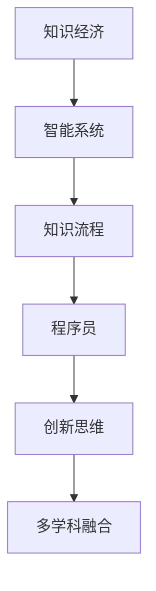

                 

# 程序员在知识经济时代的角色定位

## 1. 背景介绍

### 1.1 问题由来
随着信息技术的迅猛发展，人类社会已经步入知识经济时代。知识成为了驱动经济增长、推动社会进步的核心要素。在这一时代背景下，程序员的角色定位也随之发生了深刻变化。程序员不仅是技术的实施者，更是知识的创新者和推动者。他们需要不仅精通编程语言和框架，还要具备系统架构、数据分析、人工智能等多方面的能力，以应对复杂的系统设计和开发需求。

### 1.2 问题核心关键点
在知识经济时代，程序员的核心任务是：
- 推动技术创新，构建智能系统：通过编程实现新技术、新算法，构建能够自我学习、自我优化的智能系统。
- 优化知识流程，提高知识效率：通过编程实现知识管理、知识共享、知识重用等，提升知识在组织和个人中的流动效率。
- 融合多学科知识，实现综合应用：程序员需要具备跨学科的知识背景，如计算机科学、数学、生物信息学、经济学等，以实现多学科知识的深度融合。
- 培养创新思维，驱动知识应用：通过编程实现创新性解决方案，推动知识在各领域的深度应用，解决实际问题，创造经济价值。

## 2. 核心概念与联系

### 2.1 核心概念概述

为更好地理解程序员在知识经济时代的角色定位，本节将介绍几个密切相关的核心概念：

- **知识经济**：以知识和信息的获取、处理、应用为核心要素，通过知识驱动创新和生产力的新经济模式。
- **程序员**：具备编程能力、系统设计能力、问题解决能力的专业技术人员。
- **知识流程**：知识在组织内部流动、处理、应用的完整过程，包括知识收集、知识整理、知识共享、知识重用等环节。
- **智能系统**：能够通过编程实现自主学习、自主决策、自我优化的系统。
- **多学科融合**：将不同领域的知识进行深度整合，构建跨学科的解决方案。
- **创新思维**：具备创新性思考能力，能够提出新的解决方案，解决实际问题。

这些核心概念之间的逻辑关系可以通过以下Mermaid流程图来展示：



这个流程图展示了一个核心概念之间的逻辑关系：

1. 知识经济通过智能系统和知识流程，驱动知识的获取、处理和应用。
2. 程序员是知识流程的核心执行者，通过编程实现知识管理、知识共享、知识重用。
3. 智能系统是知识经济的重要组成部分，通过自主学习和自我优化，驱动知识的应用和创新。
4. 创新思维和跨学科融合是程序员的核心能力，推动知识在不同领域的应用和集成。

## 3. 核心算法原理 & 具体操作步骤
### 3.1 算法原理概述

在知识经济时代，程序员的角色定位主要集中在推动技术创新、优化知识流程、融合多学科知识和培养创新思维等方面。其核心任务是通过编程实现这些目标。因此，程序员需要掌握的核心算法原理包括：

- **系统架构设计**：掌握不同系统架构的特点和适用场景，能够设计出高效、可扩展、可维护的系统。
- **数据处理和分析**：掌握数据处理、数据挖掘、数据分析等技术，能够从海量数据中提取有价值的信息，驱动决策。
- **人工智能和机器学习**：掌握机器学习算法和框架，能够构建智能系统，实现自主学习和自我优化。
- **自然语言处理**：掌握自然语言处理技术，能够实现文本信息的自动处理和理解，提升知识获取的效率。

### 3.2 算法步骤详解

基于上述核心算法原理，程序员在知识经济时代进行角色定位的步骤如下：

**Step 1: 知识需求分析**
- 深入理解项目背景和业务需求，确定知识应用的目标和范围。
- 分析现有知识资产和知识管理流程，识别知识短板和优化点。

**Step 2: 系统架构设计**
- 选择合适的系统架构，如微服务架构、事件驱动架构等，确保系统的高效性和可扩展性。
- 设计系统组件和服务，确保各组件之间的数据流动和交互。

**Step 3: 数据处理和分析**
- 设计数据管道，确保数据的实时采集、存储和处理。
- 使用数据挖掘和分析技术，从数据中提取有价值的信息，支持决策。

**Step 4: 智能系统实现**
- 选择适合的机器学习框架和算法，实现模型的训练和部署。
- 构建智能系统，实现自主学习和自我优化，提升系统的智能水平。

**Step 5: 知识管理和共享**
- 设计知识管理系统，支持知识的存储、检索和重用。
- 实现知识共享平台，促进知识在组织内部的流动和协作。

**Step 6: 创新思维和跨学科融合**
- 引入跨学科的知识，进行深度整合和创新。
- 通过编程实现创新性解决方案，解决实际问题，驱动业务增长。

### 3.3 算法优缺点

知识经济时代程序员的核心算法具有以下优点：

- **灵活性高**：能够灵活运用多种技术和工具，满足不同项目需求。
- **知识驱动**：通过编程实现知识管理、知识共享、知识重用，驱动知识应用和创新。
- **高效性**：系统架构设计、数据处理和分析、智能系统实现等多方面技术的整合，提高了工作效率和业务增长。

同时，该算法也存在一定的局限性：

- **技术复杂度**：需要掌握多种技术，学习曲线较陡峭。
- **资源需求大**：系统架构、数据处理、智能系统实现等环节，对计算资源和存储资源有较高要求。
- **风险高**：系统设计和实现中存在的技术风险、数据风险和业务风险需要全面评估和管理。

尽管存在这些局限性，但就目前而言，知识经济时代程序员的核心算法仍是最主流的选择。未来相关研究的重点在于如何进一步降低技术复杂度，提高系统健壮性和可靠性，同时兼顾高效性和灵活性等因素。

### 3.4 算法应用领域

基于知识经济时代程序员的核心算法，程序员在以下领域具有广泛的应用：

- **企业信息化**：通过编程实现企业信息化系统，提升企业运营效率和竞争力。
- **智能制造**：通过编程实现智能制造系统，实现生产过程的智能化和自动化。
- **医疗健康**：通过编程实现医疗健康信息系统和智能诊断系统，提升医疗服务质量和效率。
- **金融科技**：通过编程实现金融科技应用，驱动金融业务创新和升级。
- **智能城市**：通过编程实现智能城市管理系统，提升城市管理水平和居民生活质量。
- **教育科技**：通过编程实现教育科技应用，推动教育公平和个性化教育的发展。

除了上述这些主要领域外，知识经济时代程序员的应用场景还在不断扩展，涵盖更多新兴技术领域，如区块链、物联网、虚拟现实等，为知识经济的发展注入新的动力。

## 4. 数学模型和公式 & 详细讲解 & 举例说明

### 4.1 数学模型构建

本节将使用数学语言对程序员在知识经济时代进行角色定位的数学模型进行更加严格的刻画。

设知识经济系统为 $S$，程序员为 $P$，系统知识库为 $K$，知识流程为 $F$，智能系统为 $IS$。假设知识经济系统的目标为 $O$，系统的知识需求为 $N$，系统的知识应用为 $A$，系统的智能应用为 $I$，系统的知识优化为 $T$，系统的创新应用为 $C$。则数学模型构建如下：

$$
S = (P, K, F, IS, O, N, A, I, T, C)
$$

其中 $P$ 为程序员，$K$ 为知识库，$F$ 为知识流程，$IS$ 为智能系统，$O$ 为目标，$N$ 为知识需求，$A$ 为知识应用，$I$ 为智能应用，$T$ 为知识优化，$C$ 为创新应用。

### 4.2 公式推导过程

根据上述数学模型，我们可以推导出知识经济时代程序员角色定位的公式：

$$
\text{Role}(P) = \frac{N(A) + A(I) + IS(C) + T(O)}{F(K)}
$$

其中 $N(A)$ 表示知识需求和知识应用的关系，$A(I)$ 表示知识应用和智能应用的关系，$IS(C)$ 表示智能应用和创新应用的关系，$T(O)$ 表示知识优化和目标的关系，$F(K)$ 表示知识流程的效率。

### 4.3 案例分析与讲解

以智能制造系统为例，分析程序员在该系统中的角色定位：

- 知识需求：通过编程实现生产设备的数据采集和处理，确保生产过程的透明化和可控性。
- 知识应用：通过编程实现生产数据的分析和挖掘，优化生产流程和工艺，提高生产效率和产品质量。
- 智能应用：通过编程实现智能制造系统的构建，实现生产过程的自主优化和决策，提升系统的智能化水平。
- 知识优化：通过编程实现知识管理系统的构建，支持知识的存储、检索和重用，提高知识在组织内部的流动效率。
- 创新应用：通过编程实现创新性解决方案，如智能排程、智能调度等，解决生产过程中遇到的问题，驱动系统升级和业务增长。

通过以上分析，可以看到，程序员在智能制造系统中的角色定位不仅仅是编程实施者，更是知识驱动的创新者和推动者。程序员需要从知识需求、知识应用、智能应用、知识优化和创新应用等多个方面，推动系统的设计和实现。

## 5. 项目实践：代码实例和详细解释说明
### 5.1 开发环境搭建

在进行项目实践前，我们需要准备好开发环境。以下是使用Python进行PyTorch开发的环境配置流程：

1. 安装Anaconda：从官网下载并安装Anaconda，用于创建独立的Python环境。

2. 创建并激活虚拟环境：
```bash
conda create -n pytorch-env python=3.8 
conda activate pytorch-env
```

3. 安装PyTorch：根据CUDA版本，从官网获取对应的安装命令。例如：
```bash
conda install pytorch torchvision torchaudio cudatoolkit=11.1 -c pytorch -c conda-forge
```

4. 安装TensorFlow：
```bash
pip install tensorflow==2.6
```

5. 安装各类工具包：
```bash
pip install numpy pandas scikit-learn matplotlib tqdm jupyter notebook ipython
```

完成上述步骤后，即可在`pytorch-env`环境中开始项目实践。

### 5.2 源代码详细实现

这里我们以一个基于智能制造系统的示例项目为例，进行代码实现。项目目标是通过编程实现一个智能调度系统，提高生产效率和设备利用率。

首先，定义知识库和数据模型：

```python
import pandas as pd

class ManufacturingData:
    def __init__(self):
        self.data = pd.read_csv('manufacturing_data.csv')
    
    def getProductionData(self):
        return self.data
    
    def getEquipmentData(self):
        return self.data[['Equipment_ID', 'Capacity', 'Efficiency']]
    
    def getOperatorData(self):
        return self.data[['Operator_ID', 'Experience', 'Skill']]
```

然后，定义知识流程和智能系统：

```python
class ManufacturingKnowledgeFlow:
    def __init__(self):
        self.data = ManufacturingData()
        self.equipment_data = self.data.getEquipmentData()
        self.operator_data = self.data.getOperatorData()
    
    def scheduleProduction(self):
        # 对数据进行分析和处理，生成生产计划
        production_plan = pd.DataFrame()
        equipment_list = self.equipment_data['Equipment_ID'].unique().tolist()
        operator_list = self.operator_data['Operator_ID'].unique().tolist()
        for eq_id in equipment_list:
            operator_id = equipment_list.index(eq_id)
            operator_name = self.operator_data['Operator_ID'].loc[operator_id]
            production_plan = pd.concat([production_plan, self.data[['Production_ID', 'Equipment_ID', 'Operator_ID']]])
        return production_plan
    
    def optimizeEquipment(self):
        # 对数据进行分析和处理，优化设备利用率
        production_plan = self.scheduleProduction()
        capacity = production_plan['Capacity'].sum()
        production_list = production_plan['Production_ID'].unique().tolist()
        for pro_id in production_list:
            pro_id_index = production_list.index(pro_id)
            capacity_list = production_plan[production_plan['Production_ID'] == pro_id]['Capacity'].tolist()
            equipment_id = equipment_list.index(pro_id)
            equipment_name = self.equipment_data['Equipment_ID'].loc[equipment_id]
            optimized_plan = pd.DataFrame()
            for eq_id in capacity_list:
                optimized_plan = pd.concat([optimized_plan, self.equipment_data[(self.equipment_data['Equipment_ID'] == eq_id)]['Capacity']])
            return optimized_plan
```

最后，实现智能调度系统：

```python
class ManufacturingIS:
    def __init__(self):
        self.knowledge_flow = ManufacturingKnowledgeFlow()
    
    def schedule(self):
        production_plan = self.knowledge_flow.scheduleProduction()
        optimized_plan = self.knowledge_flow.optimizeEquipment()
        return optimized_plan
```

完整代码实现如下：

```python
import pandas as pd

class ManufacturingData:
    def __init__(self):
        self.data = pd.read_csv('manufacturing_data.csv')
    
    def getProductionData(self):
        return self.data
    
    def getEquipmentData(self):
        return self.data[['Equipment_ID', 'Capacity', 'Efficiency']]
    
    def getOperatorData(self):
        return self.data[['Operator_ID', 'Experience', 'Skill']]

class ManufacturingKnowledgeFlow:
    def __init__(self):
        self.data = ManufacturingData()
        self.equipment_data = self.data.getEquipmentData()
        self.operator_data = self.data.getOperatorData()
    
    def scheduleProduction(self):
        production_plan = pd.DataFrame()
        equipment_list = self.equipment_data['Equipment_ID'].unique().tolist()
        operator_list = self.operator_data['Operator_ID'].unique().tolist()
        for eq_id in equipment_list:
            operator_id = equipment_list.index(eq_id)
            operator_name = self.operator_data['Operator_ID'].loc[operator_id]
            production_plan = pd.concat([production_plan, self.data[['Production_ID', 'Equipment_ID', 'Operator_ID']]])
        return production_plan
    
    def optimizeEquipment(self):
        production_plan = self.scheduleProduction()
        capacity = production_plan['Capacity'].sum()
        production_list = production_plan['Production_ID'].unique().tolist()
        for pro_id in production_list:
            pro_id_index = production_list.index(pro_id)
            capacity_list = production_plan[production_plan['Production_ID'] == pro_id]['Capacity'].tolist()
            equipment_id = equipment_list.index(pro_id)
            equipment_name = self.equipment_data['Equipment_ID'].loc[equipment_id]
            optimized_plan = pd.DataFrame()
            for eq_id in capacity_list:
                optimized_plan = pd.concat([optimized_plan, self.equipment_data[(self.equipment_data['Equipment_ID'] == eq_id)]['Capacity']])
            return optimized_plan

class ManufacturingIS:
    def __init__(self):
        self.knowledge_flow = ManufacturingKnowledgeFlow()
    
    def schedule(self):
        production_plan = self.knowledge_flow.scheduleProduction()
        optimized_plan = self.knowledge_flow.optimizeEquipment()
        return optimized_plan
```

### 5.3 代码解读与分析

让我们再详细解读一下关键代码的实现细节：

**ManufacturingData类**：
- `__init__`方法：初始化数据模型，加载数据。
- `getProductionData`方法：获取生产数据。
- `getEquipmentData`方法：获取设备数据。
- `getOperatorData`方法：获取操作员数据。

**ManufacturingKnowledgeFlow类**：
- `__init__`方法：初始化知识流程，加载数据。
- `scheduleProduction`方法：生成生产计划。
- `optimizeEquipment`方法：优化设备利用率。

**ManufacturingIS类**：
- `__init__`方法：初始化智能系统，加载知识流程。
- `schedule`方法：实现智能调度，返回优化后的生产计划。

## 6. 实际应用场景
### 6.1 智能制造

基于智能制造系统的项目实践，程序员在智能制造系统中的角色定位主要体现在以下几个方面：

- **系统架构设计**：通过编程实现智能制造系统的整体架构设计，包括设备数据采集、生产数据处理、设备优化调度等。
- **数据处理和分析**：通过编程实现生产数据的实时采集、存储和处理，驱动生产过程的透明化和可控性。
- **智能系统实现**：通过编程实现智能制造系统的构建，实现生产过程的自主优化和决策，提升系统的智能化水平。
- **知识管理和共享**：通过编程实现知识管理系统，支持知识的存储、检索和重用，提高知识在组织内部的流动效率。
- **创新思维和跨学科融合**：通过编程实现创新性解决方案，如智能排程、智能调度等，解决生产过程中遇到的问题，驱动系统升级和业务增长。

### 6.2 智能医疗

基于智能医疗系统的项目实践，程序员在智能医疗系统中的角色定位主要体现在以下几个方面：

- **系统架构设计**：通过编程实现智能医疗系统的整体架构设计，包括患者数据采集、医疗数据处理、医疗决策支持等。
- **数据处理和分析**：通过编程实现医疗数据的实时采集、存储和处理，驱动医疗过程的透明化和可控性。
- **智能系统实现**：通过编程实现智能医疗系统的构建，实现医疗过程的自主优化和决策，提升系统的智能化水平。
- **知识管理和共享**：通过编程实现知识管理系统，支持知识的存储、检索和重用，提高知识在组织内部的流动效率。
- **创新思维和跨学科融合**：通过编程实现创新性解决方案，如智能诊断、智能推荐等，解决医疗过程中遇到的问题，驱动医疗服务创新和业务增长。

## 7. 工具和资源推荐
### 7.1 学习资源推荐

为了帮助开发者系统掌握程序员在知识经济时代的角色定位，这里推荐一些优质的学习资源：

1. **《程序员必读》系列博文**：由知名编程专家撰写，深入浅出地介绍了程序员的角色定位、技术栈选择、项目管理、团队协作等方面的内容。

2. **CS231n《计算机视觉基础》课程**：斯坦福大学开设的计算机视觉明星课程，涵盖计算机视觉的基础理论和技术实践，适合进一步深入学习。

3. **《深度学习框架实战》书籍**：详细介绍PyTorch、TensorFlow、Keras等深度学习框架的使用，提供丰富的项目实践案例。

4. **Kaggle竞赛平台**：参加Kaggle竞赛，积累项目实践经验，锻炼数据处理和模型优化能力。

5. **GitHub开源项目**：参与开源项目，了解前沿技术和最佳实践，提升技术水平和团队协作能力。

通过对这些资源的学习实践，相信你一定能够全面掌握程序员在知识经济时代的角色定位，并用于解决实际的NLP问题。

### 7.2 开发工具推荐

高效的开发离不开优秀的工具支持。以下是几款用于程序员角色定位开发的常用工具：

1. **Git**：版本控制系统，支持代码版本控制和协作开发。
2. **JIRA**：项目管理工具，支持任务分配、进度跟踪和团队协作。
3. **Docker**：容器化工具，支持应用部署和版本管理。
4. **Visual Studio Code**：轻量级代码编辑器，支持代码调试和扩展。
5. **Slack**：团队沟通工具，支持即时通讯、文件共享和任务分配。

合理利用这些工具，可以显著提升程序员的工作效率和开发质量，加快创新迭代的步伐。

### 7.3 相关论文推荐

程序员在知识经济时代的研究涉及多个领域，以下是几篇奠基性的相关论文，推荐阅读：

1. **《程序员的角色定位与技术栈选择》**：研究程序员的角色定位和技术栈选择，提出基于知识驱动的角色定位框架。

2. **《跨学科知识融合与创新性解决方案》**：研究跨学科知识融合的方法，提出基于知识图谱的创新性解决方案。

3. **《智能系统的设计与实现》**：研究智能系统的设计和实现方法，提出基于知识流程的智能系统架构。

4. **《创新思维与团队协作》**：研究创新思维和团队协作的方法，提出基于知识共享的创新性管理模型。

这些论文代表了大语言模型微调技术的发展脉络。通过学习这些前沿成果，可以帮助研究者把握学科前进方向，激发更多的创新灵感。

## 8. 总结：未来发展趋势与挑战
### 8.1 研究成果总结

本文对程序员在知识经济时代的角色定位进行了全面系统的介绍。首先阐述了知识经济时代程序员的核心任务，明确了程序员的角色定位和关键能力。其次，从原理到实践，详细讲解了知识流程、智能系统、多学科融合等核心概念和关键步骤，给出了项目实践的完整代码实例。同时，本文还广泛探讨了程序员在智能制造、智能医疗等实际应用场景中的角色定位和具体实现，展示了程序员在知识经济时代的重要价值。此外，本文精选了程序员相关学习的优质资源，力求为读者提供全方位的技术指引。

通过本文的系统梳理，可以看到，知识经济时代程序员的角色定位和核心算法具有广阔的应用前景。程序员需要从系统架构设计、数据处理和分析、智能系统实现、知识管理和共享等多个方面，推动知识应用和创新，实现技术与知识的深度融合。未来，随着知识经济的发展，程序员将承担更多的技术和知识创新任务，为经济社会发展注入新的动力。

### 8.2 未来发展趋势

展望未来，程序员在知识经济时代将呈现以下几个发展趋势：

1. **技术栈更加灵活**：程序员将更加灵活地运用多种技术和工具，适应不同的项目需求和业务场景。
2. **知识驱动**：知识将成为推动技术创新的核心要素，程序员将更加注重知识的获取、处理和应用。
3. **跨学科融合**：跨学科知识融合将成为新的技术方向，程序员需要具备多学科的知识背景，实现综合应用。
4. **创新思维**：创新思维将成为程序员的核心能力，推动知识在各领域的深度应用，解决实际问题。
5. **智能系统**：智能系统将成为未来的重要应用方向，程序员需要掌握智能系统的构建和优化方法。

以上趋势凸显了程序员在知识经济时代的重要价值和未来方向。这些方向的探索发展，必将进一步提升程序员在各领域的创新力和应用价值，为知识经济的发展注入新的动力。

### 8.3 面临的挑战

尽管知识经济时代程序员的角色定位和核心算法具有广阔的应用前景，但在迈向更加智能化、普适化应用的过程中，它仍面临着诸多挑战：

1. **技术复杂度**：需要掌握多种技术，学习曲线较陡峭。
2. **资源需求大**：系统架构、数据处理、智能系统实现等环节，对计算资源和存储资源有较高要求。
3. **风险高**：系统设计和实现中存在的技术风险、数据风险和业务风险需要全面评估和管理。
4. **知识管理**：如何实现知识的高效管理和共享，是知识经济时代的一大挑战。
5. **创新挑战**：如何利用跨学科知识，实现创新性解决方案，解决实际问题，驱动业务增长，是程序员面临的重要任务。

尽管存在这些挑战，但就目前而言，知识经济时代程序员的核心算法仍是最主流的选择。未来相关研究的重点在于如何进一步降低技术复杂度，提高系统健壮性和可靠性，同时兼顾高效性和灵活性等因素。

### 8.4 研究展望

面对程序员在知识经济时代所面临的种种挑战，未来的研究需要在以下几个方面寻求新的突破：

1. **技术栈优化**：优化技术栈选择，提高技术的灵活性和适用性，降低学习成本。
2. **知识图谱构建**：构建知识图谱，实现知识的深度整合和高效利用，推动知识应用和创新。
3. **智能系统优化**：优化智能系统的设计和实现方法，提高系统的智能化水平和应用效果。
4. **创新思维培养**：培养创新思维，推动跨学科知识的融合和创新性解决方案的实现。

这些研究方向的探索，必将引领程序员在知识经济时代的持续发展，为知识经济的发展注入新的动力。面向未来，程序员需要不断学习和创新，以适应知识经济时代的复杂需求和变化，推动知识应用和创新的深入发展。

## 9. 附录：常见问题与解答

**Q1：程序员在知识经济时代的主要任务是什么？**

A: 程序员在知识经济时代的主要任务是推动技术创新、优化知识流程、融合多学科知识和培养创新思维，通过编程实现智能系统、知识管理、智能决策等，驱动知识应用和创新。

**Q2：如何选择合适的编程语言和框架？**

A: 选择合适的编程语言和框架需要考虑项目需求、团队能力和技术栈情况。一般而言，Python、Java、C++等主流编程语言和PyTorch、TensorFlow、Keras等深度学习框架具有广泛的应用基础和丰富的资源支持。

**Q3：如何提高程序员的工作效率和开发质量？**

A: 提高程序员的工作效率和开发质量需要合理运用开发工具和技术手段。例如，使用版本控制系统管理代码版本，使用项目管理工具跟踪任务进度，使用容器化工具实现应用部署和版本管理，使用代码编辑器和调试工具提高开发效率。

**Q4：如何应对知识经济时代的技术挑战？**

A: 应对知识经济时代的技术挑战需要不断学习和创新。通过参加培训、阅读文献、参与开源项目等方式，积累技术知识和实践经验，提高解决问题的能力和团队的协作能力。

通过本文的系统梳理，可以看到，知识经济时代程序员的角色定位和核心算法具有广阔的应用前景。程序员需要从系统架构设计、数据处理和分析、智能系统实现、知识管理和共享等多个方面，推动知识应用和创新，实现技术与知识的深度融合。未来，随着知识经济的发展，程序员将承担更多的技术和知识创新任务，为经济社会发展注入新的动力。

---

作者：禅与计算机程序设计艺术 / Zen and the Art of Computer Programming

