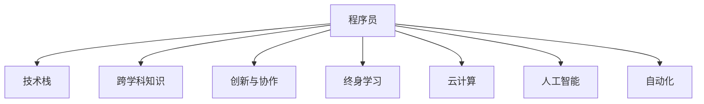

                 

## 1. 背景介绍

### 1.1 问题由来
在过去几十年里，计算机和互联网技术的迅猛发展，极大地推动了知识经济时代的到来。这一时代中，程序员作为技术创新的核心力量，扮演了至关重要的角色。程序员不仅是软件产品的开发者，更是新思想的引领者、新技术的创造者。他们在信息技术革新、智能化转型等方面起到了无可替代的作用。

### 1.2 问题核心关键点
随着知识经济的发展，程序员的角色和职责也在不断演变。他们不仅需要掌握最新的编程技术，还需要具备跨学科的知识整合能力，以及对业务需求的深度理解和设计能力。同时，在全球化、数字化、智能化的浪潮中，程序员还需要不断适应新的技术发展趋势，提升自身的竞争力。

### 1.3 问题研究意义
本文将从程序员在知识经济时代面临的挑战、角色转变以及应对策略等方面进行探讨。通过深入分析当前行业现状和未来发展趋势，为程序员的职业成长和职业发展提供理论和实践指导。同时，本文还将展示程序员如何利用新技术、新工具，实现自身价值的最大化。

## 2. 核心概念与联系

### 2.1 核心概念概述

在知识经济时代，程序员的角色变得更加多元化。以下列出了几个核心概念及其之间的关系，通过这些概念的解析，有助于我们更好地理解程序员在当前环境中的定位和作用。

- **程序员(Programmer)**：指从事软件开发、系统维护、数据分析等技术工作的专业人员。
- **技术栈(Technology Stack)**：程序员在工作中需掌握的各种技术和工具，包括编程语言、框架、数据库、版本控制等。
- **跨学科知识(Cross-disciplinary Knowledge)**：程序员需具备与业务领域相关的知识，如市场分析、用户心理学、项目管理等。
- **创新与协作(Creativity and Collaboration)**：在知识经济时代，程序员需具备创造性思维，以及与团队成员、利益相关者进行有效协作的能力。
- **终身学习(Lifelong Learning)**：技术不断进步，程序员需持续学习新知识，以保持竞争力。
- **云计算(Cloud Computing)**：程序员需掌握云计算技术，以便构建可扩展、高可靠性的应用系统。
- **人工智能(Artificial Intelligence)**：程序员需了解并应用人工智能技术，以增强系统的智能性和自动化程度。
- **自动化(Automation)**：通过自动化工具和流程，提高开发效率，减少重复性工作。

这些核心概念构成了程序员在知识经济时代的工作框架，理解并掌握这些概念，有助于程序员在复杂多变的工作环境中更好地发挥作用。

### 2.2 核心概念原理和架构的 Mermaid 流程图



以上流程图展示了程序员的核心概念及其之间的联系。程序员需掌握多样化的技能，并结合不同领域的知识，运用技术创新和团队协作，实现自身的最大价值。

## 3. 核心算法原理 & 具体操作步骤

### 3.1 算法原理概述

在知识经济时代，程序员需不断更新和优化其技能集。以下是对这一过程的算法原理概述。

**3.1.1 技术栈更新**
技术栈更新是程序员不断提升自身技术水平的重要手段。程序员需定期关注行业最新技术动态，掌握新编程语言、框架和工具。例如，JavaScript的ES6和ESNext，Python的PyTorch和TensorFlow，以及云计算平台如AWS和Azure等，都是当前的热门技术。

**3.1.2 跨学科知识融合**
跨学科知识融合要求程序员具备多领域知识。例如，在开发电商平台时，程序员需了解电子商务的业务流程和市场分析；在开发医疗应用时，需了解医疗领域的专业知识。这有助于开发出更加贴合业务需求的解决方案。

**3.1.3 创新与协作**
创新与协作是推动技术进步的关键。程序员需具备创造性思维，能提出新点子并实现；同时，需与团队成员有效沟通协作，共同解决问题。

**3.1.4 终身学习**
终身学习是程序员不断提升自身竞争力的基础。在技术快速发展的背景下，程序员需持续学习新知识，如新编程语言、算法、数据结构等。

**3.1.5 云计算**
云计算是现代软件开发的重要基础。程序员需掌握云平台的使用，以便构建可扩展、高可靠性的应用系统。例如，AWS的EC2和S3，Azure的VM和Blob Storage等。

**3.1.6 人工智能**
人工智能技术正在改变软件开发的方式。程序员需了解并应用人工智能技术，以增强系统的智能性和自动化程度。例如，自然语言处理、机器学习和计算机视觉等。

**3.1.7 自动化**
自动化技术可以显著提高开发效率。程序员需掌握各种自动化工具和流程，如自动化测试、CI/CD等。

### 3.2 算法步骤详解

**3.2.1 技术栈更新**
1. **关注行业动态**：定期浏览技术博客、参加技术会议、阅读行业报告等，了解最新技术动态。
2. **学习新技能**：通过在线课程、技术书籍、开源项目等途径，学习新编程语言、框架和工具。
3. **实践与实验**：通过个人项目或企业项目，将新技能应用到实际开发中，验证其效果。

**3.2.2 跨学科知识融合**
1. **业务需求调研**：与业务团队沟通，了解业务需求和技术难点。
2. **知识整合**：将业务知识与技术知识结合，设计合理的技术方案。
3. **持续学习**：在项目过程中，不断学习业务领域的知识，提升自身跨学科能力。

**3.2.3 创新与协作**
1. **头脑风暴**：定期组织团队头脑风暴会议，提出新点子和改进方案。
2. **项目规划**：制定详细的项目规划，明确各阶段任务和责任分工。
3. **代码审查**：实施代码审查机制，提高代码质量和团队协作效率。

**3.2.4 终身学习**
1. **在线学习**：利用Coursera、Udacity等在线平台，持续学习新技能。
2. **技术社区**：加入技术社区，如Stack Overflow、GitHub等，与同行交流学习。
3. **专业书籍**：阅读最新的专业书籍和技术文献，保持对新技术的敏感性。

**3.2.5 云计算**
1. **云平台学习**：掌握主流云平台的API和SDK，了解其服务特性和限制。
2. **云架构设计**：设计基于云平台的架构，合理规划资源使用。
3. **云安全性**：了解云平台的安全策略，实施相应的安全措施。

**3.2.6 人工智能**
1. **数据准备**：收集和处理数据，准备用于训练和测试模型。
2. **模型训练**：选择合适的算法和框架，训练模型并验证效果。
3. **模型部署**：将模型部署到生产环境，并监控其性能。

**3.2.7 自动化**
1. **工具选择**：选择适合的自动化工具和框架，如Jenkins、Travis CI等。
2. **流程设计**：设计自动化流程，包括代码提交、测试、构建、部署等。
3. **持续集成**：实施持续集成和持续部署(CI/CD)，提高开发效率和系统可靠性。

### 3.3 算法优缺点

**3.3.1 技术栈更新**
**优点**：
- 保持技术前沿，提升竞争力。
- 应用最新技术，开发高效、高质量的系统。

**缺点**：
- 需要持续学习，可能短期内无法适应新技术。
- 新技能的学习和验证成本较高。

**3.3.2 跨学科知识融合**
**优点**：
- 增强系统适用性，满足多样化业务需求。
- 提升团队协作效率，减少误解和冲突。

**缺点**：
- 业务领域知识复杂，学习成本高。
- 需要与业务团队频繁沟通，协调难度大。

**3.3.3 创新与协作**
**优点**：
- 激发团队创造力，推动技术创新。
- 提高决策效率，快速响应市场需求。

**缺点**：
- 依赖团队协作，单打独斗效率低下。
- 创新的成功率和成本难以控制。

**3.3.4 终身学习**
**优点**：
- 保持知识更新，适应技术变化。
- 提高个人技术水平，增强竞争力。

**缺点**：
- 需要持续投入时间和精力，成本较高。
- 可能难以兼顾工作和家庭生活。

**3.3.5 云计算**
**优点**：
- 提供可扩展、高可靠性的基础设施。
- 降低硬件和维护成本，提高开发效率。

**缺点**：**
- 云平台使用复杂，需具备一定的技术基础。
- 云服务成本较高，需严格控制资源使用。

**3.3.6 人工智能**
**优点**：
- 增强系统的智能性和自动化程度。
- 处理海量数据，提升系统性能。

**缺点**：
- 技术复杂，需大量数据和计算资源。
- 模型训练和部署成本较高。

**3.3.7 自动化**
**优点**：
- 提高开发效率，减少重复性工作。
- 提升系统稳定性，减少人为错误。

**缺点**：
- 需要学习自动化工具和流程。
- 自动化系统的调试和维护成本较高。

### 3.4 算法应用领域

在知识经济时代，程序员的角色在各个领域都有广泛的应用。以下是几个典型的应用领域及其具体描述：

**3.4.1 软件开发**
- 提供高效、可靠的软件解决方案，如Web应用、移动应用、桌面应用等。
- 需掌握多种编程语言和框架，如Java、Python、React、Vue等。

**3.4.2 数据分析**
- 收集、处理和分析大量数据，提取有价值的信息。
- 需掌握SQL、大数据技术、机器学习算法等。

**3.4.3 人工智能**
- 开发和部署人工智能模型，提升系统智能化水平。
- 需掌握深度学习框架、自然语言处理、计算机视觉等技术。

**3.4.4 云计算**
- 构建和管理云应用系统，提供可扩展、高可靠的服务。
- 需掌握云平台API、容器技术、DevOps流程等。

**3.4.5 自动化**
- 设计和实施自动化流程，提升开发和运维效率。
- 需掌握CI/CD工具、测试框架、脚本编写等技能。

## 4. 数学模型和公式 & 详细讲解 & 举例说明

### 4.1 数学模型构建

在知识经济时代，程序员需掌握多种数学和算法模型，以下是一个简化的数学模型构建过程。

**4.1.1 模型设计**
假设程序员需开发一个电商平台的推荐系统，基于用户历史行为数据，为用户推荐商品。

**4.1.2 数据准备**
收集用户历史浏览、购买和评分数据，清洗并预处理数据。

**4.1.3 特征提取**
对用户行为数据进行特征提取，如浏览时间、浏览次数、评分等。

**4.1.4 模型训练**
选择协同过滤算法或深度学习模型，如矩阵分解或协同训练，训练推荐模型。

### 4.2 公式推导过程

**4.2.1 协同过滤算法**
协同过滤算法基于用户历史行为数据，推荐相似用户喜欢的商品。其基本公式为：

$$
\text{Recommendation} = \text{User-Item} \times \text{Item-Item}
$$

其中，$\text{User-Item}$为用户对商品的评分矩阵，$\text{Item-Item}$为商品之间的相似度矩阵。

**4.2.2 深度学习模型**
深度学习模型通过多层神经网络，学习用户行为数据的表示，并进行推荐。其基本公式为：

$$
\text{Recommendation} = \text{Embedding} \times \text{Vector}
$$

其中，$\text{Embedding}$为用户行为数据的嵌入表示，$\text{Vector}$为推荐结果的向量表示。

### 4.3 案例分析与讲解

**案例分析**：电商平台推荐系统

**讲解**：
- **数据准备**：收集用户历史浏览、购买和评分数据，清洗并预处理数据。
- **特征提取**：对用户行为数据进行特征提取，如浏览时间、浏览次数、评分等。
- **模型训练**：选择协同过滤算法或深度学习模型，如矩阵分解或协同训练，训练推荐模型。
- **评估和优化**：使用A/B测试等方法，评估模型效果，并根据反馈进行优化。

## 5. 项目实践：代码实例和详细解释说明

### 5.1 开发环境搭建

**5.1.1 开发工具选择**
- **IDE**：如Visual Studio Code、PyCharm等，支持多种编程语言和框架。
- **版本控制**：如Git，管理代码版本和团队协作。
- **数据库**：如MySQL、PostgreSQL，存储和管理数据。
- **云平台**：如AWS、Azure，提供云计算服务。
- **自动化工具**：如Jenkins、Travis CI，实施持续集成和持续部署。

### 5.2 源代码详细实现

**5.2.1 电商推荐系统**

**代码实现**：

```python
import pandas as pd
import numpy as np
from sklearn.model_selection import train_test_split
from scipy.sparse import csr_matrix
from scipy.sparse.linalg import svds

# 读取用户历史数据
df = pd.read_csv('user_data.csv')

# 数据清洗和预处理
# ...

# 特征提取
# ...

# 协同过滤算法
# ...

# 深度学习模型
# ...

# 模型评估
# ...

# 推荐系统优化
# ...
```

**代码解读与分析**：
- **数据准备**：使用Pandas库读取用户历史数据，并进行清洗和预处理。
- **特征提取**：使用Scikit-learn库进行特征提取，生成用户行为数据的特征向量。
- **协同过滤算法**：使用Scipy库进行矩阵分解，计算商品之间的相似度矩阵。
- **深度学习模型**：使用TensorFlow或PyTorch库实现深度学习模型，进行推荐预测。
- **模型评估**：使用A/B测试等方法，评估推荐系统的效果。
- **推荐系统优化**：根据评估结果，调整模型参数和优化算法。

### 5.3 运行结果展示

**运行结果展示**：
- **协同过滤算法**：生成推荐商品列表，评估推荐效果。
- **深度学习模型**：输出推荐商品的概率分布，评估推荐效果。

## 6. 实际应用场景

**6.1 智慧城市**
在智慧城市建设中，程序员需开发智能交通管理系统、公共安全监控系统等应用。这些系统需具备高可靠性和实时性，需掌握云计算、物联网和大数据分析技术。

**6.2 金融科技**
在金融科技领域，程序员需开发智能投顾系统、风控系统等应用。这些系统需具备高度的准确性和安全性，需掌握机器学习、自然语言处理和数据加密技术。

**6.3 智能制造**
在智能制造领域，程序员需开发工业物联网系统、智能仓储系统等应用。这些系统需具备高效和灵活性，需掌握工业控制技术、数据可视化技术等。

## 7. 工具和资源推荐

### 7.1 学习资源推荐

**7.1.1 在线课程**
- **Coursera**：提供多种编程语言和技术的课程，如Python、Java、数据科学等。
- **Udacity**：提供技术和职业发展的课程，如人工智能、云计算等。
- **edX**：提供多种学术和职业发展课程，如计算机科学、数据科学等。

**7.1.2 技术博客和社区**
- **Stack Overflow**：程序员交流技术问题和学习资源的社区。
- **GitHub**：开源项目和代码托管平台，提供丰富的代码库和示例。
- **Medium**：技术博客和文章分享平台，提供最新的技术动态和趋势。

**7.1.3 书籍**
- **《深入浅出Python》**：讲解Python语言的核心概念和应用场景。
- **《Java核心技术》**：讲解Java语言的核心概念和开发技巧。
- **《深度学习》**：讲解深度学习的基本概念和应用实例。

### 7.2 开发工具推荐

**7.2.1 IDE**
- **Visual Studio Code**：轻量级的代码编辑器，支持多种编程语言和插件扩展。
- **PyCharm**：Python开发工具，提供调试、版本控制和测试等功能。
- **IntelliJ IDEA**：Java开发工具，提供强大的代码分析和自动补全功能。

**7.2.2 版本控制**
- **Git**：版本控制系统，支持多人协作和代码版本管理。
- **GitHub**：代码托管平台，提供代码仓库和项目管理功能。
- **SVN**：版本控制系统，提供集中式代码管理。

**7.2.3 数据库**
- **MySQL**：关系型数据库，支持结构化数据的存储和管理。
- **PostgreSQL**：高级关系型数据库，支持复杂的查询和事务处理。
- **MongoDB**：非关系型数据库，支持无结构数据的存储和管理。

**7.2.4 云平台**
- **AWS**：全球领先的云计算平台，提供丰富的云服务和资源。
- **Azure**：微软推出的云计算平台，提供强大的云服务和资源。
- **Google Cloud**：谷歌推出的云计算平台，提供高效和可靠的云服务。

**7.2.5 自动化工具**
- **Jenkins**：持续集成和持续部署工具，支持多种开发环境。
- **Travis CI**：持续集成和持续部署工具，支持多种编程语言和框架。
- **CircleCI**：持续集成和持续部署工具，支持多种开发环境。

### 7.3 相关论文推荐

**7.3.1 云计算**
- **《云计算：概念、技术与应用》**：详细介绍云计算的基本概念和技术。
- **《云计算安全与隐私保护》**：探讨云计算中的安全与隐私问题。

**7.3.2 人工智能**
- **《深度学习》**：讲解深度学习的基本概念和应用实例。
- **《自然语言处理综述》**：讲解自然语言处理的基本概念和技术。
- **《计算机视觉基础》**：讲解计算机视觉的基本概念和技术。

**7.3.3 自动化**
- **《持续集成与持续部署实践》**：详细介绍持续集成和持续部署的最佳实践。
- **《自动化测试：策略、技术和工具》**：讲解自动化测试的基本概念和工具。
- **《DevOps基础》**：讲解DevOps的基本概念和最佳实践。

## 8. 总结：未来发展趋势与挑战

### 8.1 研究成果总结

**8.1.1 技术栈更新**
- **最新编程语言**：如JavaScript、Python、Go等。
- **最新框架**：如React、Vue、Flask等。
- **最新工具**：如Docker、Kubernetes、Django等。

**8.1.2 跨学科知识融合**
- **数据科学**：如数据挖掘、数据可视化等。
- **业务知识**：如市场分析、项目管理等。

**8.1.3 创新与协作**
- **敏捷开发**：如Scrum、Kanban等。
- **设计思维**：如用户体验设计、系统架构设计等。

**8.1.4 终身学习**
- **在线学习平台**：如Coursera、Udacity等。
- **技术博客和社区**：如Stack Overflow、Medium等。

**8.1.5 云计算**
- **云平台服务**：如AWS、Azure等。
- **云架构设计**：如微服务架构、容器化等。

**8.1.6 人工智能**
- **深度学习框架**：如TensorFlow、PyTorch等。
- **自然语言处理**：如BERT、GPT等。

**8.1.7 自动化**
- **持续集成工具**：如Jenkins、Travis CI等。
- **自动化测试框架**：如Selenium、JUnit等。

### 8.2 未来发展趋势

**8.2.1 技术栈更新**
- **全栈开发**：掌握多种编程语言和框架，提升开发效率。
- **技术预见**：关注未来技术趋势，提前掌握新兴技术。

**8.2.2 跨学科知识融合**
- **多领域融合**：掌握多领域知识，提升综合素质。
- **行业应用**：深入理解业务需求，提供更有价值的技术方案。

**8.2.3 创新与协作**
- **创造性思维**：培养创新思维，提出新点子。
- **团队协作**：增强团队协作效率，实现目标共享。

**8.2.4 终身学习**
- **持续学习**：保持学习热情，提升个人技术水平。
- **知识分享**：参与技术社区，分享学习心得。

**8.2.5 云计算**
- **云服务集成**：集成多种云平台服务，提供高效解决方案。
- **云架构优化**：优化云架构设计，提升系统性能和可靠性。

**8.2.6 人工智能**
- **智能系统**：开发智能系统和应用，提升系统智能化水平。
- **自动化学习**：利用人工智能技术，自动学习和优化。

**8.2.7 自动化**
- **自动化流程**：设计和实施自动化流程，提升开发和运维效率。
- **自动化测试**：提高自动化测试覆盖率，减少人为错误。

### 8.3 面临的挑战

**8.3.1 技术栈更新**
- **学习成本高**：新技术学习难度大，需投入大量时间和精力。
- **技术栈复杂**：需掌握多种技术栈，增加开发复杂度。

**8.3.2 跨学科知识融合**
- **跨领域知识**：业务领域知识复杂，学习成本高。
- **团队沟通**：需与业务团队频繁沟通，协调难度大。

**8.3.3 创新与协作**
- **团队协作**：单打独斗效率低下，需依赖团队协作。
- **创新风险**：创新的成功率和成本难以控制。

**8.3.4 终身学习**
- **时间成本**：需持续投入时间和精力，成本较高。
- **生活平衡**：难以兼顾工作和家庭生活。

**8.3.5 云计算**
- **技术门槛高**：云平台使用复杂，需具备一定的技术基础。
- **成本控制**：云服务成本较高，需严格控制资源使用。

**8.3.6 人工智能**
- **数据需求高**：需大量数据和计算资源，成本较高。
- **模型复杂**：模型训练和部署成本较高。

**8.3.7 自动化**
- **工具学习**：需要学习自动化工具和流程，增加学习成本。
- **系统维护**：自动化系统的调试和维护成本较高。

### 8.4 研究展望

**8.4.1 技术栈更新**
- **技术预见**：关注未来技术趋势，提前掌握新兴技术。
- **快速迭代**：采用敏捷开发模式，快速迭代和优化。

**8.4.2 跨学科知识融合**
- **多领域融合**：掌握多领域知识，提升综合素质。
- **行业应用**：深入理解业务需求，提供更有价值的技术方案。

**8.4.3 创新与协作**
- **创造性思维**：培养创新思维，提出新点子。
- **团队协作**：增强团队协作效率，实现目标共享。

**8.4.4 终身学习**
- **持续学习**：保持学习热情，提升个人技术水平。
- **知识分享**：参与技术社区，分享学习心得。

**8.4.5 云计算**
- **云服务集成**：集成多种云平台服务，提供高效解决方案。
- **云架构优化**：优化云架构设计，提升系统性能和可靠性。

**8.4.6 人工智能**
- **智能系统**：开发智能系统和应用，提升系统智能化水平。
- **自动化学习**：利用人工智能技术，自动学习和优化。

**8.4.7 自动化**
- **自动化流程**：设计和实施自动化流程，提升开发和运维效率。
- **自动化测试**：提高自动化测试覆盖率，减少人为错误。

---

作者：禅与计算机程序设计艺术 / Zen and the Art of Computer Programming

