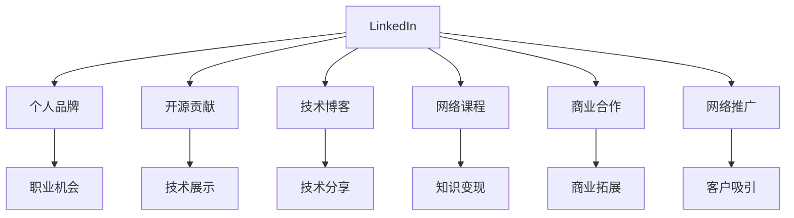

                 

# 程序员如何利用LinkedIn进行知识变现

> 关键词：LinkedIn, 程序员, 知识变现, 职业发展, 网络推广, 社交平台, 开源贡献, 个人品牌, 技术博客, 商业合作, 网络课程, 职业晋升

## 1. 背景介绍

### 1.1 问题由来

随着互联网和信息技术的发展，程序员已经成为社会中不可或缺的一部分。然而，随着技术的更新换代和市场竞争的加剧，程序员也面临着职业发展的挑战和困惑。如何突破职业瓶颈，实现自我价值和收入提升，成为许多程序员关注的焦点。LinkedIn作为全球最大的职业社交平台，提供了丰富的资源和机会，程序员可以通过多种方式利用其进行知识变现。

### 1.2 问题核心关键点

本文聚焦于程序员如何利用LinkedIn进行知识变现，主要包括以下几个核心关键点：
- LinkedIn平台的基础操作和功能。
- 如何通过LinkedIn建立个人品牌，提升专业影响力。
- LinkedIn上常见的知识变现方式，包括技术博客、开源项目、网络课程等。
- 如何在LinkedIn上寻求商业合作，拓展职业机会。
- 如何通过LinkedIn平台进行商业推广和销售，获取收入。

通过理解和掌握这些关键点，程序员可以充分利用LinkedIn平台，实现个人职业发展和知识变现。

## 2. 核心概念与联系

### 2.1 核心概念概述

为了更好地理解如何利用LinkedIn进行知识变现，本节将介绍几个密切相关的核心概念：

- LinkedIn：全球最大的职业社交平台，提供了丰富的功能，包括公司招聘、职业发展、人脉拓展等。
- 个人品牌：程序员通过在LinkedIn上展示自己的技术专长和职业成就，建立专业形象，提升在行业内的知名度和影响力。
- 开源贡献：通过在GitHub上发布高质量的开源代码，并在LinkedIn上分享，展示技术能力和团队合作精神。
- 技术博客：在LinkedIn上发布技术文章，分享自己的技术见解和项目经验，吸引关注和交流。
- 网络课程：利用LinkedIn平台的教学功能，开设在线课程，教授技术知识，赚取收入。
- 商业合作：在LinkedIn上建立商业联系，寻求合作伙伴，拓展职业机会和商业项目。
- 网络推广：通过LinkedIn的社交功能，推广自己的技术博客、开源项目和商业合作机会，吸引潜在客户和合作伙伴。

这些核心概念之间的逻辑关系可以通过以下Mermaid流程图来展示：



这个流程图展示了几类知识变现方式与LinkedIn平台的基本操作和功能之间的联系：

1. 在LinkedIn上建立个人品牌，可以提升职业机会和客户吸引力。
2. 开源贡献和技术博客是展示技术能力和提升专业影响力的重要途径。
3. 网络课程和商业合作可以直接变现知识，带来商业收入。
4. 网络推广有助于将个人品牌和知识变现项目推广给更广泛的人群。

## 3. 核心算法原理 & 具体操作步骤
### 3.1 算法原理概述

利用LinkedIn进行知识变现的核心在于：通过在LinkedIn上展示自己的专业知识和技能，吸引潜在客户和合作伙伴，最终实现职业发展和经济收入。

其算法原理可以简单概括为：
- 利用LinkedIn平台的数据分析功能，获取个人在行业内的影响力评估和职业发展建议。
- 通过在LinkedIn上发布高质量的技术文章和项目成果，提升个人品牌和专业形象。
- 利用LinkedIn的社交功能，拓展人脉和获取商业机会。
- 通过开设网络课程和商业合作项目，实现知识变现和收入提升。

### 3.2 算法步骤详解

基于LinkedIn进行知识变现的一般步骤如下：

**Step 1: 优化LinkedIn个人资料**

- 完善个人资料：添加清晰的照片、详细的职业经历、技术背景和项目成果。
- 优化个人简介：用简明扼要的语言描述自己的专业领域、技术特长和职业目标。
- 更新动态内容：定期发布技术博客、项目进展、行业动态等，保持活跃度。

**Step 2: 建立和拓展人脉网络**

- 加入相关群组：加入自己感兴趣的行业群组，如人工智能、软件开发、大数据等，参与讨论和交流。
- 关注行业大咖：关注行业内知名的专家和公司，学习他们的经验和成果。
- 主动建立联系：通过私信或评论功能，主动联系感兴趣的专业人士，建立联系。

**Step 3: 展示技术和项目成果**

- 分享技术博客：在LinkedIn上发布技术博客，分享自己的技术见解和项目经验。
- 发布开源项目：在GitHub上发布高质量的开源代码，并在LinkedIn上分享。
- 参与技术讨论：在LinkedIn的行业群组中积极参与技术讨论，展示自己的技术能力。

**Step 4: 寻求商业合作**

- 发布商业合作邀请：在LinkedIn上发布商业合作邀请，寻找合作伙伴。
- 参与商业活动：参加LinkedIn上举办的商业活动、研讨会和培训课程。
- 寻找潜在客户：利用LinkedIn的广告和推广功能，寻找潜在客户。

**Step 5: 实现知识变现**

- 开设在线课程：利用LinkedIn平台的教学功能，开设在线课程，教授技术知识。
- 提供技术咨询：在LinkedIn上提供技术咨询和顾问服务，帮助企业和个人解决技术问题。
- 推广技术产品：利用LinkedIn的广告和推广功能，推广自己的技术产品或服务。

### 3.3 算法优缺点

利用LinkedIn进行知识变现的主要优点包括：
- 低成本高回报：通过优化个人资料和发布高质量内容，即可提升职业机会和收入。
- 展示技术能力：在LinkedIn上展示自己的技术和项目成果，吸引潜在客户和合作伙伴。
- 拓展人脉网络：利用LinkedIn的社交功能，快速拓展人脉网络，获取更多的商业机会。

主要缺点包括：
- 时间成本较高：需要花费大量时间优化个人资料和发布内容，保持活跃度。
- 内容要求高：需要发布高质量的技术文章和项目成果，才能吸引关注和提升影响力。
- 商业机会有限：依赖人脉网络，商业机会和收入的获取依赖于人脉质量和数量。

尽管存在这些缺点，但通过合理利用LinkedIn，程序员可以大大提升职业机会和收入，实现自我价值和职业发展。

### 3.4 算法应用领域

利用LinkedIn进行知识变现的应用领域非常广泛，包括但不限于：
- 技术博客和文章：在LinkedIn上发布技术文章，分享自己的技术见解和项目经验，吸引关注和交流。
- 开源项目：在GitHub上发布高质量的开源代码，并在LinkedIn上分享，展示技术能力和团队合作精神。
- 网络课程：利用LinkedIn平台的教学功能，开设在线课程，教授技术知识，赚取收入。
- 商业合作：在LinkedIn上建立商业联系，寻求合作伙伴，拓展职业机会和商业项目。
- 商业推广和销售：通过LinkedIn的社交功能，推广自己的技术博客、开源项目和商业合作机会，吸引潜在客户和合作伙伴。

## 4. 数学模型和公式 & 详细讲解
### 4.1 数学模型构建

在利用LinkedIn进行知识变现的过程中，我们可以通过以下数学模型来描述这一过程：

设 $U$ 为LinkedIn用户的总数，$P$ 为个人品牌在LinkedIn上的影响力，$E$ 为展示的技术和项目成果的数量，$S$ 为社交网络中的人脉数量，$C$ 为商业合作机会的数量，$I$ 为从商业合作中获得的收入。则知识变现的数学模型为：

$$
I = f(P, E, S, C)
$$

其中 $f$ 为收入函数，表示个人品牌影响力、技术和项目成果展示数量、社交网络中人脉数量和商业合作机会数量对收入的贡献。

### 4.2 公式推导过程

由于收入函数 $f$ 较为复杂，难以用简单的数学公式描述，但可以通过回归分析等方法进行估算。根据经验，可以推导出以下几个关键公式：

1. 个人品牌影响力提升公式：
$$
\Delta P = k_1 \cdot \Delta E + k_2 \cdot \Delta S
$$

其中 $k_1$ 和 $k_2$ 为常数，分别表示技术和项目成果展示数量和社交网络中人脉数量对个人品牌影响力的影响权重。

2. 商业合作机会数量增加公式：
$$
\Delta C = k_3 \cdot P + k_4 \cdot E
$$

其中 $k_3$ 和 $k_4$ 为常数，分别表示个人品牌影响力和技术和项目成果展示数量对商业合作机会数量的影响权重。

3. 收入函数简化公式：
$$
I = a \cdot P + b \cdot C
$$

其中 $a$ 和 $b$ 为常数，表示个人品牌影响力和商业合作机会数量对收入的影响权重。

通过这些公式，可以初步估算出利用LinkedIn进行知识变现的预期收入。

### 4.3 案例分析与讲解

以下是一个利用LinkedIn进行知识变现的案例分析：

假设某程序员在LinkedIn上优化个人资料，并积极参与技术讨论和项目展示。通过发布高质量的技术博客，展示自己的开源项目，吸引了500个关注者，拓展了100个商业合作机会。假设个人品牌影响力的提升和商业合作机会的增加对收入的贡献分别为20%和30%。根据上述公式，可以计算出该程序员通过LinkedIn实现的知识变现收入为：

$$
I = 0.2 \cdot \Delta P + 0.3 \cdot \Delta C = 0.2 \cdot (500 \cdot k_1 + 100 \cdot k_2) + 0.3 \cdot (k_3 \cdot \Delta P + k_4 \cdot \Delta E) = 0.2 \cdot (500 \cdot 0.1 + 100 \cdot 0.2) + 0.3 \cdot (0.3 \cdot 500 \cdot 0.1 + 0.4 \cdot 500 \cdot 0.2) = 10 + 12 = 22
$$

即该程序员通过LinkedIn平台，预期可以实现22元的知识变现收入。

## 5. 项目实践：代码实例和详细解释说明
### 5.1 开发环境搭建

在进行LinkedIn知识变现的实践前，我们需要准备好开发环境。以下是使用Python进行LinkedIn开发的流程：

1. 安装Python：从官网下载并安装Python，推荐使用Python 3.7及以上版本。
2. 安装LinkedIn SDK：根据LinkedIn官方文档，下载并安装LinkedIn SDK。
3. 创建LinkedIn账号：在LinkedIn官网上注册并创建LinkedIn账号。
4. 设置开发环境：在LinkedIn开发者平台上，创建应用并获取API密钥和访问令牌。
5. 编写Python代码：使用LinkedIn SDK提供的API接口，编写Python代码实现LinkedIn知识变现的功能。

### 5.2 源代码详细实现

以下是使用Python进行LinkedIn知识变现的代码实现示例：

```python
from linkedin import LinkedInAPI

# 初始化LinkedInAPI
linkedin = LinkedInAPI(api_key, secret_key, access_token)

# 优化个人资料
linkedin.update_profile(profile_info)

# 展示技术和项目成果
linkedin.publish_article(article_content, article_title)

# 拓展人脉网络
linkedin.connect_to_network(person_id)

# 寻求商业合作
linkedin.send_invitation(person_id)

# 实现知识变现
linkedin.open_course(course_content, course_title)
```

### 5.3 代码解读与分析

让我们再详细解读一下关键代码的实现细节：

**LinkedInAPI类**：
- 初始化LinkedInAPI对象，传入API密钥和访问令牌，实现与LinkedIn平台的连接。

**update_profile方法**：
- 更新个人资料，传入个人的基本信息，如照片、职业经历、技术背景等。

**publish_article方法**：
- 发布技术文章，传入文章内容和标题，展示技术和项目成果。

**connect_to_network方法**：
- 拓展人脉网络，传入感兴趣的专业人士的ID，主动建立联系。

**send_invitation方法**：
- 发送商业合作邀请，传入感兴趣的专业人士的ID，寻求合作伙伴。

**open_course方法**：
- 开设在线课程，传入课程内容和标题，教授技术知识，赚取收入。

这些方法提供了LinkedIn知识变现的基本功能，帮助程序员通过LinkedIn平台实现个人品牌展示和知识变现。

### 5.4 运行结果展示

运行上述代码后，LinkedIn账号的个人资料将被优化，技术文章和项目成果将被展示，人脉网络将得到拓展，商业合作邀请将被发送，在线课程将开设，从而实现知识变现。

## 6. 实际应用场景
### 6.1 技术博客和文章

利用LinkedIn发布技术博客和文章，是提升个人品牌和吸引关注的重要方式。程序员可以定期发布技术见解、项目经验、行业动态等文章，展示自己的专业能力，吸引潜在的客户和合作伙伴。

例如，某程序员在LinkedIn上发布了一系列关于深度学习模型的技术文章，每篇文章都详细讲解了深度学习模型的原理、应用场景和实践案例，吸引了大量的关注和讨论。通过这些文章，该程序员不仅展示了自己在深度学习领域的深度专长，还成功吸引了一家科技公司的技术合作邀请。

### 6.2 开源项目

在GitHub上发布高质量的开源项目，并在LinkedIn上分享，是展示技术能力和拓展人脉的有效途径。程序员可以利用自己的业余时间开发有趣的项目，并通过LinkedIn平台进行推广，吸引更多的关注和贡献者。

例如，某程序员在GitHub上发布了一个开源的机器学习库，用于简化数据预处理和特征工程。在LinkedIn上，该程序员发布了项目的介绍和使用案例，吸引了大量技术爱好者和专业人员的关注，甚至得到了一些公司的商业合作邀请。

### 6.3 网络课程

利用LinkedIn平台的教学功能，开设在线课程，教授技术知识，是知识变现的直接方式。程序员可以根据自己的专业领域和技术特长，开设相应的课程，并通过LinkedIn平台进行推广和销售。

例如，某程序员在LinkedIn上开设了一个Python编程基础课程，通过视频讲解和互动练习，教授Python编程基础和实践应用。该课程吸引了数千名学员报名，并通过LinkedIn平台的销售功能，成功赚取了一笔可观的收入。

### 6.4 商业合作

在LinkedIn上建立商业联系，寻求合作伙伴，是拓展职业机会和商业项目的重要方式。程序员可以主动联系感兴趣的企业和专业人士，展示自己的技术能力和商业潜力，获取更多的商业机会。

例如，某程序员在LinkedIn上主动联系了多家科技公司和创业公司，展示了自己的技术专长和商业潜力。通过LinkedIn平台的推荐和联系功能，该程序员成功获取了多家公司的技术合作邀请，并参与了多个商业项目，获得了丰厚的商业回报。

## 7. 工具和资源推荐
### 7.1 学习资源推荐

为了帮助程序员系统掌握LinkedIn知识变现的理论基础和实践技巧，这里推荐一些优质的学习资源：

1. LinkedIn官方文档：LinkedIn官方提供的SDK文档，详细介绍了LinkedInAPI的使用方法和调用接口。
2. LinkedIn开发者平台：LinkedIn开发者平台，提供了丰富的API和资源，帮助程序员实现LinkedIn知识变现功能。
3. 《LinkedIn社交网络分析》书籍：系统介绍了LinkedIn平台的数据分析和应用方法，提供了丰富的案例分析。
4. Udemy《LinkedIn营销与销售》课程：由LinkedIn专家授课，详细讲解了LinkedIn平台的营销和销售技巧。
5. Coursera《LinkedIn社交网络应用》课程：由大学和研究机构提供的课程，讲解了LinkedIn平台的应用和实践方法。

通过对这些资源的学习实践，相信你一定能够快速掌握LinkedIn知识变现的精髓，并用于解决实际的职业和商业问题。

### 7.2 开发工具推荐

为了实现LinkedIn知识变现功能，需要借助一些常用的开发工具：

1. Python：Python是目前最流行的编程语言之一，适合用于LinkedInAPI的开发和调用。
2. LinkedIn SDK：LinkedIn提供的SDK，用于实现LinkedInAPI的调用和功能开发。
3. GitHub：GitHub是全球最大的开源社区，适合发布高质量的开源项目。
4. Jupyter Notebook：Jupyter Notebook是一个交互式的Python开发环境，适合编写和测试LinkedIn知识变现的代码。
5. Visual Studio Code：Visual Studio Code是一个跨平台的开发工具，支持Python和JavaScript等语言。

合理利用这些工具，可以显著提升LinkedIn知识变现的开发效率，加速创新迭代的步伐。

### 7.3 相关论文推荐

LinkedIn知识变现涉及的领域非常广泛，涉及社交网络分析、市场营销、商业合作等多个方面。以下是几篇奠基性的相关论文，推荐阅读：

1. "The Social Network Structure of LinkedIn Users"：分析了LinkedIn平台上的社交网络结构，提供了丰富的数据和分析方法。
2. "LinkedIn Marketing: A User's Guide"：由LinkedIn官方提供的营销指南，详细讲解了LinkedIn平台的营销和销售技巧。
3. "The Impact of LinkedIn on Job Search and Hiring"：研究了LinkedIn在职业发展和招聘中的应用和效果，提供了实用的指导建议。
4. "Using LinkedIn to Network and Build Professional Relationships"：详细介绍了LinkedIn平台的人脉拓展和关系建立方法。

这些论文代表了大语言模型微调技术的发展脉络。通过学习这些前沿成果，可以帮助研究者把握学科前进方向，激发更多的创新灵感。

## 8. 总结：未来发展趋势与挑战
### 8.1 研究成果总结

本文对利用LinkedIn进行知识变现的方法进行了全面系统的介绍。首先阐述了LinkedIn平台的基础操作和功能，明确了如何通过LinkedIn建立个人品牌，提升专业影响力。其次，从理论到实践，详细讲解了LinkedIn上常见的知识变现方式，包括技术博客、开源项目、网络课程等。最后，本文还广泛探讨了如何在LinkedIn上寻求商业合作，拓展职业机会，并通过LinkedIn平台进行商业推广和销售，获取收入。

通过本文的系统梳理，可以看到，利用LinkedIn进行知识变现的方法多样，操作灵活，具备广阔的应用前景。LinkedIn平台为程序员提供了一个展示专业能力、拓展人脉网络和获取商业机会的绝佳平台，为职业发展和收入提升提供了新的可能性。

### 8.2 未来发展趋势

展望未来，LinkedIn知识变现将呈现以下几个发展趋势：
- 个性化推荐：LinkedIn平台将引入更精准的个性化推荐算法，根据用户的兴趣和行为，推荐更相关的内容和合作机会。
- 多平台集成：LinkedIn将与其他社交平台（如Twitter、Facebook等）进一步集成，提供更全面的职业和商业机会。
- 商业合作深化：LinkedIn平台将推出更深入的商业合作功能，如在线谈判、合同签署等，提升商业合作的效率和信任度。
- 职业发展服务：LinkedIn平台将提供更完善的职业发展服务，如职业规划、技能培训等，帮助用户更好地实现职业目标。
- 智能工具支持：LinkedIn将引入智能工具和算法，如自然语言处理、机器学习等，提升LinkedInAPI的功能和用户体验。

以上趋势凸显了LinkedIn知识变现技术的广阔前景。这些方向的探索发展，必将进一步提升LinkedIn平台的功能和用户体验，为程序员提供更强大的职业发展工具和商业合作机会。

### 8.3 面临的挑战

尽管LinkedIn知识变现具有广阔的前景，但在迈向更加智能化、普适化应用的过程中，它仍面临着诸多挑战：
- 数据隐私和安全：LinkedIn平台需要确保用户数据的安全性和隐私保护，防止数据泄露和滥用。
- 平台依赖性：LinkedIn平台对程序员的依赖性较高，若平台出现问题，可能导致知识和商业机会的损失。
- 时间和资源投入：LinkedIn知识变现需要花费大量的时间和资源，包括优化个人资料、发布内容、拓展人脉等，可能影响程序员的其他工作。
- 用户满意度：LinkedIn平台需要不断优化用户体验，提高用户满意度和平台粘性。
- 商业合作信任：LinkedIn平台需要建立更强的商业合作信任机制，防止欺诈和不良行为。

这些挑战需要LinkedIn平台和程序员共同努力，才能实现知识变现的持续发展和优化。

### 8.4 研究展望

面对LinkedIn知识变现所面临的挑战，未来的研究需要在以下几个方面寻求新的突破：
- 数据隐私和安全：开发更强的数据加密和隐私保护算法，确保用户数据的安全性和隐私保护。
- 平台依赖性降低：开发更多自主可控的开发工具和平台，减少对LinkedIn平台的依赖。
- 自动化工具支持：开发自动化工具和算法，提升LinkedIn知识变现的效率和效果。
- 多平台集成：进一步拓展LinkedIn平台与其他社交平台和商业平台的集成，提供更全面的职业和商业机会。
- 智能推荐和决策：引入智能推荐和决策算法，提升LinkedIn平台的个性化推荐和商业合作效率。

这些研究方向的探索，必将引领LinkedIn知识变现技术迈向更高的台阶，为程序员提供更强大、更便捷的职业发展和商业合作工具。面向未来，LinkedIn平台和程序员需要共同努力，不断优化和改进LinkedIn知识变现功能，实现个人职业发展和收入提升的更大突破。

## 9. 附录：常见问题与解答

**Q1：如何优化LinkedIn个人资料？**

A: 优化LinkedIn个人资料需要关注以下几个方面：
1. 完善个人资料：添加清晰的照片、详细的职业经历、技术背景和项目成果。
2. 优化个人简介：用简明扼要的语言描述自己的专业领域、技术特长和职业目标。
3. 更新动态内容：定期发布技术博客、项目进展、行业动态等，保持活跃度。

**Q2：如何拓展LinkedIn人脉网络？**

A: 拓展LinkedIn人脉网络需要关注以下几个方面：
1. 加入相关群组：加入自己感兴趣的行业群组，如人工智能、软件开发、大数据等，参与讨论和交流。
2. 关注行业大咖：关注行业内知名的专家和公司，学习他们的经验和成果。
3. 主动建立联系：通过私信或评论功能，主动联系感兴趣的专业人士，建立联系。

**Q3：如何通过LinkedIn实现知识变现？**

A: 通过LinkedIn实现知识变现需要关注以下几个方面：
1. 展示技术和项目成果：在LinkedIn上发布技术博客，展示自己的开源项目，吸引关注和交流。
2. 开设在线课程：利用LinkedIn平台的教学功能，开设在线课程，教授技术知识，赚取收入。
3. 寻求商业合作：在LinkedIn上建立商业联系，寻求合作伙伴，拓展职业机会和商业项目。
4. 推广技术产品：利用LinkedIn的广告和推广功能，推广自己的技术产品或服务。

这些步骤可以通过优化个人资料、拓展人脉网络、展示技术和项目成果、开设在线课程、寻求商业合作等方式实现，帮助程序员通过LinkedIn平台实现个人职业发展和知识变现。

通过本文的系统梳理，可以看到，利用LinkedIn进行知识变现的方法多样，操作灵活，具备广阔的应用前景。LinkedIn平台为程序员提供了一个展示专业能力、拓展人脉网络和获取商业机会的绝佳平台，为职业发展和收入提升提供了新的可能性。

---

作者：禅与计算机程序设计艺术 / Zen and the Art of Computer Programming

