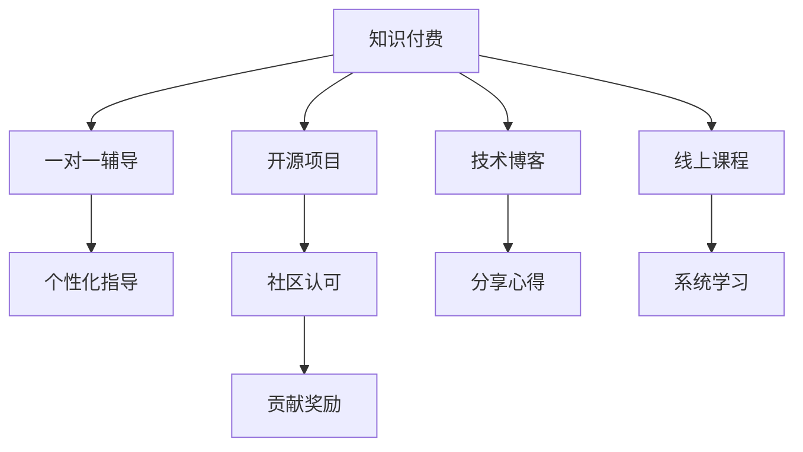

                 

## 1. 背景介绍

### 1.1 问题由来
随着信息技术的发展，程序员在社会中的地位日益提高，薪资水平也随之增长。然而，技术更新换代迅速，学习成本高昂，使得程序员的职业发展面临挑战。如何实现长期稳定的收入增长，逐步积累财富，成为了程序员面临的重要课题。知识付费作为一种新兴的学习方式，为程序员提供了一个全新的解决思路。

### 1.2 问题核心关键点
本文将探讨程序员如何利用知识付费实现财富自由，重点关注以下几个关键问题：

1. **知识付费的内涵与价值**：
   - 知识付费的核心是知识的变现，即通过知识共享和交流，为他人创造价值，同时获取回报。
   - 知识付费的优势在于，它能够提供系统化的学习资源，使程序员能够高效提升技能，适应新技术，把握职业发展的机遇。

2. **知识付费的实现路径**：
   - 程序员可以通过多种方式参与知识付费，包括线上课程、一对一辅导、技术博客、开源项目等。
   - 选择合适的方式，结合自身特长和兴趣，可以帮助程序员高效实现知识变现。

3. **知识付费与职业发展**：
   - 知识付费不仅有助于提升技能，还能够扩大人脉，拓展职业机会。
   - 持续学习和知识更新，使得程序员能够不断提升市场价值，实现财富积累。

## 2. 核心概念与联系

### 2.1 核心概念概述

为更好地理解程序员如何利用知识付费实现财富自由，本节将介绍几个密切相关的核心概念：

- **知识付费**：指通过支付一定费用，获取系统化、专业化的知识和服务，以达到快速提升技能、获取职业发展机遇的目的。
- **程序员职业发展**：指程序员通过持续学习和技能提升，逐步提升市场价值，实现职业晋升和收入增长的过程。
- **知识变现**：指通过知识共享和交流，为他人创造价值，同时获取回报的过程。
- **线上课程**：指通过互联网平台提供的视频、音频、文字等形式的知识学习资源。
- **一对一辅导**：指针对个体的个性化指导和辅导，帮助解决具体问题。
- **技术博客**：指程序员将自己的技术心得、项目经验等内容分享给社区，获得反馈和收益。
- **开源项目**：指通过参与开源社区的贡献，提升技能，同时获得社区认可和贡献奖励。

这些核心概念之间的逻辑关系可以通过以下Mermaid流程图来展示：



这个流程图展示知识付费的核心概念及其之间的关系：

1. 知识付费提供多样化的学习资源，如线上课程、一对一辅导等。
2. 线上课程和一对一辅导是获取系统化知识的主要途径。
3. 技术博客和开源项目是提升个人品牌和获得社区认可的有效方式。
4. 个性化指导和社区认可进一步提升技能和市场价值。

这些概念共同构成了知识付费的学习和职业发展框架，使得程序员能够高效实现知识变现和财富积累。

## 3. 核心算法原理 & 具体操作步骤
### 3.1 算法原理概述

利用知识付费实现财富自由，本质上是一个知识与技能提升的迭代过程。其核心思想是：通过持续学习和知识积累，提升自身技能和市场价值，进而通过知识变现获取回报，逐步实现财富自由。

形式化地，设知识付费的投入为 $I$，学习过程中的技能提升为 $S$，市场价值提升为 $V$，知识变现的回报为 $R$，财富自由的目标为 $F$。则财富自由的公式可以表示为：

$$
F = S \times V \times R / I
$$

其中，$S$ 和 $V$ 是随着学习时间 $T$ 增长而增长的变量，$R$ 是随着市场需求的变化而变化的变量。因此，通过合理投入 $I$，最大化 $S$、$V$ 和 $R$，才能实现 $F$ 的最大化。

### 3.2 算法步骤详解

利用知识付费实现财富自由的算法步骤主要包括以下几个关键步骤：

**Step 1: 确定学习目标**
- 明确自己的职业发展方向和目标。
- 根据目标选择合适的学习资源和技能。

**Step 2: 选择合适的学习方式**
- 根据自身情况和学习目标，选择线上课程、一对一辅导、技术博客或开源项目等合适的学习方式。
- 结合自身特点，选择高效的学习路径，提升技能水平。

**Step 3: 系统学习与实践**
- 制定详细的学习计划，持续投入时间和精力。
- 在实际项目中应用所学知识，积累经验，提升实战能力。

**Step 4: 建立个人品牌和网络**
- 通过技术博客、开源项目等方式，展示自己的技术能力和项目成果。
- 参与社区交流，扩大人脉，获取反馈和认可。

**Step 5: 知识变现**
- 通过线上课程、一对一辅导、技术咨询等方式，将自身知识转化为收益。
- 不断优化课程和咨询内容，提升市场价值和回报。

**Step 6: 持续学习和反馈**
- 定期评估自己的技能和市场价值，调整学习策略和职业规划。
- 获取用户反馈，不断改进和优化，提升市场竞争力。

### 3.3 算法优缺点

知识付费的实现方法具有以下优点：

1. **高效学习**：系统化的学习资源能够帮助程序员高效提升技能，适应新技术和市场变化。
2. **市场认可**：通过技术博客和开源项目等途径，提升个人品牌和市场认可度，增加职业机会。
3. **持续发展**：持续学习和知识更新，使得程序员能够不断提升市场价值，实现财富积累。

同时，该方法也存在一定的局限性：

1. **成本投入**：知识付费需要一定的经济投入，初学者可能面临财务压力。
2. **时间限制**：系统学习需要较长时间，对工作和学习时间管理要求较高。
3. **质量差异**：不同的知识付费资源质量参差不齐，需仔细筛选和评估。

尽管存在这些局限性，但就目前而言，知识付费仍然是最主流的程序员学习和职业发展路径。未来相关研究的方向和重点在于如何进一步降低学习成本，提高学习效率，扩大知识付费的应用场景，以及如何更好地评估和筛选知识付费资源。

### 3.4 算法应用领域

知识付费作为一种学习和职业发展手段，已经在多个领域得到了广泛应用，例如：

1. **软件开发**：通过在线课程、技术博客等方式，学习最新的编程语言和技术框架。
2. **数据科学与人工智能**：参与开源项目，学习数据分析和机器学习技术。
3. **网络安全**：通过课程和实践，提升网络安全知识和实战能力。
4. **云计算与大数据**：学习云计算平台和数据处理技术，提升技能和市场竞争力。
5. **移动开发**：通过课程和实战项目，学习移动应用开发技能。

除了上述这些经典领域外，知识付费还在更多新兴领域，如区块链、物联网、自然语言处理等，为程序员提供了更多的学习和成长机会。

## 4. 数学模型和公式 & 详细讲解  
### 4.1 数学模型构建

本节将使用数学语言对程序员利用知识付费实现财富自由的过程进行更加严格的刻画。

设 $T$ 为知识付费的学习时间，$S(T)$ 为 $T$ 时刻的技能水平，$V(T)$ 为 $T$ 时刻的市场价值，$R(T)$ 为 $T$ 时刻的知识变现收益，则知识付费的目标可以表示为：

$$
F(T) = S(T) \times V(T) \times R(T) / I
$$

其中 $I$ 为知识付费的初始投入。

### 4.2 公式推导过程

以下我们以软件开发领域为例，推导知识付费的收益模型。

假设程序员通过线上课程、实践项目等形式学习新技能，技能的提升速度与学习时间成正比，即 $S(T) = kT$，其中 $k$ 为技能提升速率。市场价值随技能提升而增长，假设市场价值与技能成正比，即 $V(T) = aS(T)$，其中 $a$ 为市场价值放大系数。知识变现收益随市场价值和技能提升而增长，假设知识变现收益与技能和市场价值成正比，即 $R(T) = bS(T)V(T)$，其中 $b$ 为知识变现系数。则知识付费的目标收益公式为：

$$
F(T) = kT \times aS(T) \times bS(T)V(T) / I = kT \times a^2b \times S^2(T)V(T) / I
$$

通过求解 $F(T)$ 的最大值，可以确定最优的学习时间 $T$ 和投入 $I$。

### 4.3 案例分析与讲解

假设某程序员通过在线课程学习新技术，学习时间为 $T=100$ 天，投入 $I=1000$ 元。已知技能提升速率 $k=0.02$，市场价值放大系数 $a=2$，知识变现系数 $b=0.1$。则知识付费的目标收益公式为：

$$
F(T) = 100 \times 2^2 \times 0.1 \times (0.02T)^2 \times 2 \times 2^0.02T / 1000
$$

通过求解 $F(T)$ 的最大值，可以得到最优的学习时间和投入。

## 5. 项目实践：代码实例和详细解释说明
### 5.1 开发环境搭建

在进行知识付费实践前，我们需要准备好开发环境。以下是使用Python进行知识付费实践的环境配置流程：

1. 安装Anaconda：从官网下载并安装Anaconda，用于创建独立的Python环境。

2. 创建并激活虚拟环境：
```bash
conda create -n learning-env python=3.8 
conda activate learning-env
```

3. 安装相关库：
```bash
conda install pandas numpy scikit-learn matplotlib seaborn
```

完成上述步骤后，即可在`learning-env`环境中开始知识付费实践。

### 5.2 源代码详细实现

这里我们以技术博客为例，展示如何使用Python进行技术博客的发布和管理。

首先，我们需要创建一个博客网站，可以选择WordPress、GitHub Pages等平台。这里我们选择使用GitHub Pages，通过Jekyll框架来搭建网站。

```bash
git clone https://github.com/username/blog.git
cd blog
bundle install
bundle exec jekyll serve
```

接着，我们可以撰写博客文章，发布到GitHub Pages上。

```bash
bundle exec jekyll new blog-post.md
nano blog-post.md
```

在代码中，我们可以使用Python库如pandas、numpy等进行数据分析和可视化，使用scikit-learn进行机器学习模型训练等。

```python
import pandas as pd
import numpy as np
from sklearn.linear_model import LinearRegression

# 读取数据
data = pd.read_csv('data.csv')

# 特征工程
X = data.drop('target', axis=1)
y = data['target']

# 模型训练
model = LinearRegression()
model.fit(X, y)

# 预测
predictions = model.predict(X)

# 可视化
import matplotlib.pyplot as plt
plt.scatter(X['feature1'], predictions)
plt.xlabel('Feature 1')
plt.ylabel('Prediction')
plt.show()
```

最后，我们将博客文章发布到GitHub Pages上，可以通过GitHub Pages的URL访问。

### 5.3 代码解读与分析

让我们再详细解读一下关键代码的实现细节：

**代码1: 读取数据**
```python
import pandas as pd

data = pd.read_csv('data.csv')
```

**代码2: 特征工程**
```python
X = data.drop('target', axis=1)
y = data['target']
```

**代码3: 模型训练**
```python
from sklearn.linear_model import LinearRegression

model = LinearRegression()
model.fit(X, y)
```

**代码4: 预测**
```python
predictions = model.predict(X)
```

**代码5: 可视化**
```python
import matplotlib.pyplot as plt

plt.scatter(X['feature1'], predictions)
plt.xlabel('Feature 1')
plt.ylabel('Prediction')
plt.show()
```

通过这些代码实现，我们可以完成一个简单的技术博客文章发布过程，展示技术博客的实现和应用。

## 6. 实际应用场景
### 6.1 在线教育平台

知识付费的核心应用场景之一是在线教育平台。在线教育平台通过系统化的课程内容，帮助学员快速提升技能，获取职业发展机遇。

具体而言，程序员可以通过在线教育平台学习最新的编程语言和技术框架，掌握最新的技术趋势。平台提供的课程内容包括视频讲解、实践项目、编程练习等，帮助学员系统学习。同时，平台还提供一对一辅导和社区交流功能，帮助学员解决具体问题，扩大人脉。

### 6.2 技术咨询公司

知识付费的另一个应用场景是技术咨询公司。技术咨询公司通过提供定制化的技术咨询和解决方案，帮助企业提升技术能力，解决技术难题。

程序员可以参与技术咨询公司的项目，通过项目实战，提升技能和市场价值。同时，通过技术博客、开源项目等方式，展示技术成果，吸引更多客户。知识付费的回报形式包括项目咨询费、技术顾问费等。

### 6.3 自由职业平台

知识付费的第三个应用场景是自由职业平台。自由职业平台通过提供在线课程、技术博客、开源项目等，帮助程序员快速提升技能，获取职业机会。

程序员可以在自由职业平台上发布自己的技术博客和开源项目，展示技术能力和项目成果。通过平台提供的项目接单功能，获取实际项目需求，提升实战能力。知识付费的回报形式包括项目接单费、技术咨询服务费等。

### 6.4 未来应用展望

随着知识付费技术的发展，未来将有更多的应用场景涌现，为程序员提供更多的学习和职业发展机会。

在智慧城市治理中，知识付费可以为城市管理提供技术支持和解决方案，帮助提升城市智能化水平。

在金融科技领域，知识付费可以帮助企业提升金融科技能力，解决金融问题。

在工业互联网领域，知识付费可以为制造业提供技术支持和解决方案，提升工业智能化水平。

总之，知识付费技术的发展将为程序员提供更多学习和职业发展机会，推动程序员实现财富自由。

## 7. 工具和资源推荐
### 7.1 学习资源推荐

为了帮助程序员系统掌握知识付费的理论基础和实践技巧，这里推荐一些优质的学习资源：

1. **Coursera**：提供系统化的在线课程，涵盖编程、数据科学、人工智能等多个领域。
2. **Udemy**：提供高质量的技术课程，涵盖编程语言、Web开发、移动开发等多个方向。
3. **edX**：提供系统化的在线课程，涵盖计算机科学、数据科学等多个领域。
4. **Codecademy**：提供互动式的编程课程，帮助初学者快速入门。
5. **GitHub**：提供丰富的开源项目，帮助程序员提升实战能力。

通过这些资源的学习实践，相信你一定能够快速掌握知识付费的精髓，并用于解决实际的职业发展问题。

### 7.2 开发工具推荐

高效的开发离不开优秀的工具支持。以下是几款用于知识付费开发的常用工具：

1. **Jekyll**：开源博客框架，支持静态网站生成。
2. **GitHub Pages**：基于GitHub的静态网站托管服务，简单易用。
3. **Markdown**：轻量级标记语言，支持文本格式排版。
4. **Git**：版本控制系统，支持远程协作和版本控制。
5. **Jupyter Notebook**：交互式编程环境，支持Python、R等多种编程语言。

合理利用这些工具，可以显著提升知识付费实践的开发效率，加快创新迭代的步伐。

### 7.3 相关论文推荐

知识付费作为一种学习和职业发展手段，已经引起了学术界的广泛关注。以下是几篇奠基性的相关论文，推荐阅读：

1. **The Learning Curve of Software Developers**：研究软件开发人员的职业发展和学习曲线。
2. **Knowledge Sharing and Collaboration in Software Development**：研究知识共享和协作在软件开发中的应用。
3. **The Impact of Open Source on Software Development**：研究开源项目对软件开发的影响。
4. **Machine Learning for Personalized Learning**：研究基于机器学习的个性化学习系统。

这些论文代表了大语言模型微调技术的发展脉络。通过学习这些前沿成果，可以帮助研究者把握学科前进方向，激发更多的创新灵感。

## 8. 总结：未来发展趋势与挑战
### 8.1 总结

本文对程序员如何利用知识付费实现财富自由进行了全面系统的介绍。首先阐述了知识付费的内涵与价值，明确了知识付费在程序员职业发展中的重要作用。其次，从原理到实践，详细讲解了知识付费的数学模型和操作步骤，给出了知识付费任务开发的完整代码实例。同时，本文还广泛探讨了知识付费方法在在线教育、技术咨询、自由职业等多个行业领域的应用前景，展示了知识付费范式的巨大潜力。此外，本文精选了知识付费技术的各类学习资源，力求为读者提供全方位的技术指引。

通过本文的系统梳理，可以看到，知识付费技术为程序员提供了全新的学习和职业发展路径，极大地提升了程序员的技能水平和市场价值。未来，伴随知识付费技术的持续演进，相信程序员能够更好地实现职业发展和财富积累。

### 8.2 未来发展趋势

展望未来，知识付费技术将呈现以下几个发展趋势：

1. **智能化学习**：通过AI技术，智能推荐个性化课程和学习路径，提升学习效率。
2. **自动化辅导**：通过智能辅导机器人，提供实时解答和学习指导，提升学习体验。
3. **泛在学习**：通过移动设备和智能家居等设备，提供随时随地的学习体验。
4. **虚拟现实**：通过虚拟现实技术，提供沉浸式的学习体验，提升学习效果。
5. **社区化学习**：通过知识社区和社交网络，促进知识交流和协作，扩大人脉。

这些趋势将进一步推动知识付费技术的发展，提升学习体验和效率，为程序员提供更多的学习和职业发展机会。

### 8.3 面临的挑战

尽管知识付费技术已经取得了瞩目成就，但在迈向更加智能化、普适化应用的过程中，它仍面临着诸多挑战：

1. **学习效果评估**：如何科学评估学习效果，确保学习目标的达成。
2. **资源质量控制**：如何筛选高质量的知识付费资源，避免学习误导。
3. **个性化推荐**：如何提供个性化的课程和学习路径，提升学习效率。
4. **学习成本控制**：如何降低学习成本，提升知识付费的可访问性。
5. **学习动力保持**：如何保持学习者的动力，避免半途而废。

这些挑战需要在技术、教育、社区等多个层面协同解决，才能实现知识付费技术的持续发展和优化。

### 8.4 研究展望

面对知识付费技术所面临的种种挑战，未来的研究需要在以下几个方面寻求新的突破：

1. **科学评估学习效果**：开发科学的学习效果评估模型，确保学习目标的达成。
2. **高质量资源筛选**：建立高质量知识付费资源筛选机制，确保资源可靠性和适用性。
3. **个性化推荐系统**：开发高效个性化的推荐系统，提供个性化的学习路径。
4. **学习成本优化**：通过技术手段降低学习成本，提升知识付费的可访问性。
5. **学习动力激励**：设计科学的学习激励机制，保持学习者的动力。

这些研究方向的探索，必将引领知识付费技术迈向更高的台阶，为程序员提供更多学习和职业发展机会。

## 9. 附录：常见问题与解答
----------------------------------------------------------------

**Q1：知识付费是否适用于所有职业？**

A: 知识付费主要适用于技术和知识密集型职业，如软件开发、数据科学、人工智能等。然而，对于低技能劳动密集型职业，知识付费可能效果有限。

**Q2：如何选择合适的知识付费平台？**

A: 选择知识付费平台时，需要考虑平台的资源质量、学习体验、课程内容等多个因素。可以通过用户评价、课程试听等方式进行评估和筛选。

**Q3：如何平衡工作和学习？**

A: 平衡工作和学习的关键在于合理安排时间，制定详细的学习计划。可以利用零散时间进行学习，同时避免过度疲劳。

**Q4：如何进行高效学习？**

A: 高效学习需要系统化的学习路径和科学的学习方法。可以选择优质平台和课程，结合实践项目进行学习，不断总结和反思。

**Q5：如何避免学习误区？**

A: 避免学习误区的关键是选择合适的学习路径和资源，保持持续学习和反馈。同时，多参与社区交流，获取他人建议和反馈。

---

作者：禅与计算机程序设计艺术 / Zen and the Art of Computer Programming

