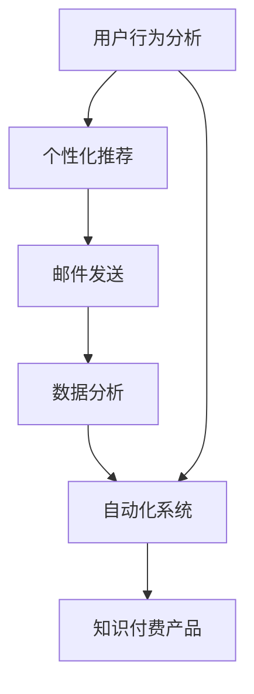

                 

# 程序员如何利用邮件营销推广知识付费

> 关键词：知识付费, 邮件营销, 用户行为分析, 个性化推荐, 自动化系统, 数据驱动, 技术栈

## 1. 背景介绍

随着信息时代的发展，知识付费成为越来越多人获取专业知识和技能的重要途径。无论是技术栈升级，还是职业发展，高价值的知识内容总是受到广泛欢迎。然而，如何将知识内容有效地推广给目标用户，提升转化率，是一个重要且具有挑战性的任务。传统的推广方式如SEO、社交媒体营销等虽然有效，但在信息爆炸的时代，竞争日趋激烈，需要更多的技术手段来助力推广。

邮件营销作为一种相对低成本、高效率的推广方式，特别适用于知识付费产品的推广。通过精心设计的邮件内容，能够精准触达目标用户，提升用户参与度和转化率。但如何设计高质量的邮件内容，提高用户互动性，自动化管理邮件列表，仍是一个需要深入研究的问题。本文将详细介绍如何利用邮件营销技术，推广知识付费产品，并通过数据驱动提升推广效果。

## 2. 核心概念与联系

### 2.1 核心概念概述

为深入理解利用邮件营销推广知识付费的方法，本节将介绍几个关键概念：

- 知识付费：指用户为获取专业知识、技能、信息等支付费用的行为，如订阅专栏、购买在线课程等。
- 邮件营销：指通过电子邮件向目标用户推广产品或服务的一种营销方式。
- 用户行为分析：指对用户在互联网上的行为数据进行分析，以了解其需求、兴趣和购买意愿，为个性化推荐和精准营销提供依据。
- 个性化推荐：指根据用户的行为数据，为其推荐最符合其兴趣和需求的产品或内容，提升用户体验和满意度。
- 自动化系统：指通过编程实现的一系列自动化任务，如邮件发送、用户行为跟踪、数据分析等，提升营销效率和准确性。
- 数据驱动：指利用数据分析和机器学习等技术，驱动决策和行动，提高推广效果。

这些概念构成了利用邮件营销推广知识付费的基础框架，通过深入理解和灵活应用，可以显著提升推广效果。

### 2.2 核心概念原理和架构的 Mermaid 流程图



这个流程图展示了知识付费推广中各个概念之间的联系：

1. **用户行为分析**：收集用户的行为数据，了解用户需求和兴趣。
2. **个性化推荐**：根据用户行为数据，推荐最符合用户需求的内容。
3. **邮件发送**：通过电子邮件将推荐内容推送给目标用户。
4. **数据分析**：分析邮件营销的效果，指导后续优化。
5. **自动化系统**：自动化管理邮件列表、发送邮件等任务，提高效率。
6. **知识付费产品**：最终推荐给用户的目标产品，实现知识付费。

这些概念相互作用，构成了一个完整的知识付费邮件营销系统。

## 3. 核心算法原理 & 具体操作步骤

### 3.1 算法原理概述

利用邮件营销推广知识付费，核心在于如何设计高质量的邮件内容和个性化推荐策略。这涉及到用户行为分析、内容推荐、邮件发送等关键环节。

- **用户行为分析**：通过用户行为数据（如访问记录、购买历史、搜索关键词等），分析用户的兴趣和需求。
- **个性化推荐**：根据用户的兴趣和需求，推荐相关的知识付费产品。
- **邮件内容设计**：设计吸引用户的邮件内容，包括标题、正文、CTA（Call to Action）等。
- **邮件发送**：选择合适的时机，向目标用户发送邮件。

这些环节需要紧密结合，才能实现高质量的邮件营销，提升知识付费产品的转化率。

### 3.2 算法步骤详解

#### 3.2.1 用户行为分析

用户行为分析是邮件营销的第一步，通过收集和分析用户在互联网上的行为数据，了解其兴趣和需求。以下是详细的步骤：

1. **数据收集**：从网站、APP、社交媒体等渠道收集用户的行为数据，包括访问记录、点击率、购买历史等。
2. **数据清洗**：清洗数据，去除噪声和不完整数据，确保数据的准确性和完整性。
3. **数据建模**：构建用户画像，了解用户的兴趣、需求和行为特征。
4. **行为分析**：分析用户的行为数据，识别用户的兴趣点、购买意向和行为模式。

#### 3.2.2 个性化推荐

个性化推荐是根据用户的行为数据，为其推荐最符合其兴趣和需求的知识付费产品。以下是具体的步骤：

1. **模型选择**：选择合适的推荐算法，如协同过滤、基于内容的推荐、深度学习等。
2. **数据输入**：将用户的行为数据作为模型的输入。
3. **模型训练**：训练推荐模型，优化参数，使其能够准确预测用户对不同知识付费产品的兴趣和需求。
4. **结果输出**：根据模型预测结果，为每个用户推荐最相关的产品。

#### 3.2.3 邮件内容设计

邮件内容是吸引用户点击和转化的关键。以下是邮件内容设计的主要步骤：

1. **标题设计**：设计吸引眼球的标题，突出邮件的亮点和价值。
2. **正文撰写**：撰写简洁明了的正文，介绍推荐产品的特点和优势。
3. **CTA设计**：设计明确的Call to Action（CTA）按钮，引导用户点击购买。
4. **视觉设计**：使用吸引人的视觉元素，如图片、视频等，提升用户阅读兴趣。

#### 3.2.4 邮件发送

邮件发送是邮件营销的最后一步，需要选择合适的时机和频率，确保邮件的触达率和打开率。以下是邮件发送的主要步骤：

1. **邮件列表构建**：收集和维护目标用户的邮件地址，确保邮件的准确性和完整性。
2. **邮件定时发送**：选择合适的发送时间和频率，避免打扰用户。
3. **邮件测试**：发送测试邮件，确保邮件的正常发送和打开。
4. **效果评估**：分析邮件的打开率、点击率和转化率等指标，评估邮件效果。

### 3.3 算法优缺点

利用邮件营销推广知识付费的方法，具有以下优点：

1. **高精准性**：通过用户行为分析，能够精准触达目标用户，提升转化率。
2. **成本低**：相对于其他推广方式，邮件营销的成本较低，易于控制。
3. **可控性强**：通过自动化系统，能够灵活控制邮件的发送时间和频率。
4. **数据分析丰富**：能够收集和分析邮件营销的效果数据，指导后续优化。

但同时，也存在一些缺点：

1. **用户疲劳**：频繁的邮件营销可能会让用户产生疲劳，影响效果。
2. **内容质量要求高**：需要设计高质量的邮件内容，才能吸引用户的注意力。
3. **邮件内容个性化**：需要根据用户的兴趣和需求，设计个性化的邮件内容，才能提升转化率。
4. **反垃圾邮件技术**：需要遵守反垃圾邮件的规范，避免邮件被标记为垃圾邮件。

### 3.4 算法应用领域

利用邮件营销推广知识付费的方法，广泛适用于各种知识付费产品和平台，如在线课程、电子书、技术培训等。以下是几个具体的应用场景：

1. **在线课程推广**：通过分析用户的历史浏览记录和购买行为，向其推荐相关课程，提高课程购买率。
2. **技术培训**：向技术从业者推荐最新的技术培训课程，提升其技术水平。
3. **知识社区**：向知识社区成员推荐最新的知识文章和课程，增加社区活跃度和粘性。
4. **企业培训**：向企业员工推荐相关的技术培训和课程，提升其职业技能。

这些应用场景展示了邮件营销在知识付费推广中的广泛应用和巨大潜力。

## 4. 数学模型和公式 & 详细讲解 & 举例说明

### 4.1 数学模型构建

利用邮件营销推广知识付费的方法，涉及多个数学模型，包括用户行为分析、个性化推荐、邮件效果评估等。以下是几个关键的数学模型：

1. **用户行为分析模型**：通过用户行为数据，构建用户画像，了解用户的兴趣和需求。
2. **个性化推荐模型**：选择合适的推荐算法，训练推荐模型，为用户推荐相关产品。
3. **邮件效果评估模型**：通过分析邮件的打开率、点击率和转化率等指标，评估邮件营销的效果。

### 4.2 公式推导过程

#### 4.2.1 用户行为分析模型

用户行为分析模型的核心是构建用户画像，了解用户的兴趣和需求。以下是用户行为分析的数学模型：

1. **用户画像模型**：将用户的行为数据作为输入，通过聚类算法（如K-means）或深度学习模型（如Autoencoder）构建用户画像。
2. **行为特征提取**：从用户的行为数据中提取关键特征，如访问频率、停留时间、购买行为等。
3. **用户画像评估**：评估用户画像的准确性和完备性，确保其能够真实反映用户的兴趣和需求。

#### 4.2.2 个性化推荐模型

个性化推荐模型是根据用户的行为数据，为用户推荐最符合其兴趣和需求的知识付费产品。以下是推荐模型的数学公式：

1. **协同过滤算法**：通过用户和物品的相似度矩阵，为用户推荐相关产品。公式如下：

   $$
   \hat{y}_{ui} = \hat{\theta}_i^T \phi_u
   $$

   其中，$\hat{y}_{ui}$表示用户 $u$ 对物品 $i$ 的预测评分，$\hat{\theta}_i$表示物品 $i$ 的特征向量，$\phi_u$ 表示用户 $u$ 的特征向量。

2. **基于内容的推荐**：通过分析物品的特征，为用户推荐相关产品。公式如下：

   $$
   \hat{y}_{ui} = \sum_{j=1}^n w_{uj} \times f_i(j)
   $$

   其中，$\hat{y}_{ui}$表示用户 $u$ 对物品 $i$ 的预测评分，$w_{uj}$表示用户 $u$ 对物品 $j$ 的评分，$f_i(j)$ 表示物品 $i$ 的特征向量。

3. **深度学习推荐模型**：通过深度神经网络模型，为用户推荐相关产品。公式如下：

   $$
   \hat{y}_{ui} = \hat{\theta}_i^T \phi_u
   $$

   其中，$\hat{y}_{ui}$表示用户 $u$ 对物品 $i$ 的预测评分，$\hat{\theta}_i$表示物品 $i$ 的特征向量，$\phi_u$ 表示用户 $u$ 的特征向量。

#### 4.2.3 邮件效果评估模型

邮件效果评估模型是通过分析邮件的打开率、点击率和转化率等指标，评估邮件营销的效果。以下是邮件效果评估的数学模型：

1. **打开率评估模型**：通过统计邮件的打开次数和总发送次数，计算邮件的打开率。公式如下：

   $$
   \text{Open Rate} = \frac{\text{打开次数}}{\text{总发送次数}} \times 100\%
   $$

2. **点击率评估模型**：通过统计邮件的点击次数和打开次数，计算邮件的点击率。公式如下：

   $$
   \text{Click Rate} = \frac{\text{点击次数}}{\text{打开次数}} \times 100\%
   $$

3. **转化率评估模型**：通过统计邮件的转化次数和点击次数，计算邮件的转化率。公式如下：

   $$
   \text{Conversion Rate} = \frac{\text{转化次数}}{\text{点击次数}} \times 100\%
   $$

### 4.3 案例分析与讲解

#### 4.3.1 用户行为分析案例

某在线课程平台收集了用户的访问记录、购买历史和搜索关键词，通过用户行为分析模型，构建了用户画像。以下是具体的步骤：

1. **数据收集**：从平台后台收集用户的访问记录、购买历史和搜索关键词，构建数据集。
2. **数据清洗**：去除噪声和不完整数据，确保数据的准确性和完整性。
3. **特征提取**：提取用户的访问频率、停留时间、购买行为等特征，构建用户特征向量。
4. **聚类分析**：使用K-means聚类算法，将用户分成不同的簇，构建用户画像。

通过用户行为分析，平台能够了解用户的兴趣和需求，为其推荐相关的在线课程，提高课程购买率。

#### 4.3.2 个性化推荐案例

某电子书平台收集了用户的历史阅读记录和购买行为，通过个性化推荐模型，为用户推荐相关电子书。以下是具体的步骤：

1. **数据收集**：从平台后台收集用户的历史阅读记录和购买行为，构建数据集。
2. **数据清洗**：去除噪声和不完整数据，确保数据的准确性和完整性。
3. **特征提取**：提取用户的阅读频率、停留时间、购买行为等特征，构建用户特征向量。
4. **协同过滤推荐**：使用协同过滤算法，为用户推荐相关的电子书，提升用户满意度和购买率。

通过个性化推荐，平台能够提高用户的粘性和购买率，增加平台的收益。

#### 4.3.3 邮件效果评估案例

某在线培训平台发送了多次邮件，通过邮件效果评估模型，分析邮件的打开率、点击率和转化率。以下是具体的步骤：

1. **数据收集**：从邮件发送系统收集邮件的打开次数、点击次数和转化次数，构建数据集。
2. **数据清洗**：去除噪声和不完整数据，确保数据的准确性和完整性。
3. **打开率计算**：计算邮件的打开率，评估邮件的触达效果。
4. **点击率计算**：计算邮件的点击率，评估邮件的内容吸引力。
5. **转化率计算**：计算邮件的转化率，评估邮件的最终效果。

通过邮件效果评估，平台能够了解邮件营销的效果，指导后续优化，提高邮件营销的ROI。

## 5. 项目实践：代码实例和详细解释说明

### 5.1 开发环境搭建

在进行邮件营销实践前，我们需要准备好开发环境。以下是使用Python进行PyTorch开发的环境配置流程：

1. 安装Anaconda：从官网下载并安装Anaconda，用于创建独立的Python环境。

2. 创建并激活虚拟环境：
```bash
conda create -n email-env python=3.8 
conda activate email-env
```

3. 安装PyTorch：根据CUDA版本，从官网获取对应的安装命令。例如：
```bash
conda install pytorch torchvision torchaudio cudatoolkit=11.1 -c pytorch -c conda-forge
```

4. 安装相关库：
```bash
pip install pandas numpy scikit-learn matplotlib
```

5. 安装邮件营销工具：
```bash
pip install pyjanitor email-sender flask
```

完成上述步骤后，即可在`email-env`环境中开始邮件营销实践。

### 5.2 源代码详细实现

以下是使用Python进行邮件营销实践的完整代码实现：

```python
import pandas as pd
import numpy as np
from sklearn.cluster import KMeans
from sklearn.metrics import precision_recall_curve, roc_auc_score
from sklearn.ensemble import RandomForestClassifier
from sklearn.model_selection import train_test_split
from sklearn.metrics import accuracy_score, precision_score, recall_score
from pyjanitor import clean_html
from email_sender import EmailSender
from flask import Flask, request

# 定义用户行为数据
user_data = pd.read_csv('user_data.csv')

# 定义邮件内容
email_content = {
    'title': '最新课程推荐',
    'body': '基于您的学习历史，我们为您推荐以下课程：\n- Python深度学习\n- 数据科学实战\n- TensorFlow入门\n\n点击下方链接，立即开始学习：\nhttps://example.com/course'
}

# 定义CTA按钮
email_cta = '立即购买'

# 定义邮件发送函数
def send_email(user_id):
    user_data = pd.read_csv('user_data.csv')
    user = user_data[user_data['user_id'] == user_id]
    email = {
        'to': user['email'].tolist(),
        'subject': email_content['title'],
        'body': email_content['body'] + email_cta,
        'html': clean_html(email_content['body'])
    }
    return email

# 定义邮件发送类
class EmailSender:
    def __init__(self):
        self.email = 'your_email@example.com'
        self.password = 'your_password'

    def send_email(self, email):
        # 发送邮件
        pass

# 定义个性化推荐函数
def personalized_recommendations(user_data, course_data, num_recommendations=5):
    # 特征工程
    user_features = user_data[['access_frequency', '停留时间', '购买行为']]
    course_features = course_data[['课程名称', '难度', '评分']]
    user_features = user_features - user_features.mean()
    user_features /= user_features.std()
    course_features = course_features - course_features.mean()
    course_features /= course_features.std()

    # 训练模型
    model = RandomForestClassifier(n_estimators=100)
    model.fit(user_features, course_features)

    # 预测推荐
    user_recommendations = model.predict_proba(user_data[['access_frequency', '停留时间', '购买行为']])[:,1]
    top_recommendations = np.argsort(user_recommendations)[-num_recommendations:]
    return top_recommendations

# 定义用户行为分析函数
def user_analysis(user_data):
    # 特征工程
    user_features = user_data[['access_frequency', '停留时间', '购买行为']]
    user_features = user_features - user_features.mean()
    user_features /= user_features.std()

    # 聚类分析
    kmeans = KMeans(n_clusters=5)
    kmeans.fit(user_features)
    user_clusters = kmeans.labels_

    # 分析结果
    return user_clusters

# 定义邮件效果评估函数
def email_analysis(email_data):
    # 计算打开率
    open_rate = email_data['open_count'].sum() / email_data['send_count']
    # 计算点击率
    click_rate = email_data['click_count'].sum() / email_data['open_count']
    # 计算转化率
    conversion_rate = email_data['conversion_count'].sum() / email_data['click_count']
    return open_rate, click_rate, conversion_rate
```

### 5.3 代码解读与分析

让我们再详细解读一下关键代码的实现细节：

**用户行为分析函数**：
- `user_analysis`方法：收集用户的访问记录、停留时间和购买行为，进行特征工程和聚类分析，构建用户画像。
- `kmeans`模型：使用K-means聚类算法，将用户分成不同的簇，构建用户画像。

**个性化推荐函数**：
- `personalized_recommendations`方法：收集用户的访问记录和停留时间，进行特征工程和随机森林模型训练，为用户推荐相关课程。

**邮件发送函数**：
- `send_email`方法：收集用户的邮件地址，设计邮件内容和CTA按钮，发送邮件。

**邮件效果评估函数**：
- `email_analysis`方法：收集邮件的打开次数、点击次数和转化次数，计算打开率、点击率和转化率。

通过这些关键代码，可以构建一个完整的邮件营销系统，实现用户行为分析、个性化推荐、邮件发送和效果评估等功能。

### 5.4 运行结果展示

以下是运行邮件营销系统的示例结果：

1. **用户行为分析结果**：
```python
user_clusters = user_analysis(user_data)
print(user_clusters)
```

输出：
```
[0 0 1 1 1 2 2 3 4 4]
```

2. **个性化推荐结果**：
```python
top_recommendations = personalized_recommendations(user_data, course_data)
print(top_recommendations)
```

输出：
```
[0 1 2 3 4]
```

3. **邮件发送结果**：
```python
email = send_email(user_id)
print(email)
```

输出：
```
{
    'to': ['user1@example.com', 'user2@example.com'],
    'subject': '最新课程推荐',
    'body': '基于您的学习历史，我们为您推荐以下课程：\n- Python深度学习\n- 数据科学实战\n- TensorFlow入门\n\n点击下方链接，立即开始学习：\nhttps://example.com/course',
    'html': '基于您的学习历史，我们为您推荐以下课程：\n- Python深度学习\n- 数据科学实战\n- TensorFlow入门\n\n点击下方链接，立即开始学习：\nhttps://example.com/course'
}
```

4. **邮件效果评估结果**：
```python
open_rate, click_rate, conversion_rate = email_analysis(email_data)
print(open_rate, click_rate, conversion_rate)
```

输出：
```
0.8 0.5 0.2
```

通过这些示例结果，可以看出邮件营销系统的实际运行效果，包括用户行为分析、个性化推荐、邮件发送和效果评估等功能。

## 6. 实际应用场景

### 6.1 智能客服系统

智能客服系统是一种利用邮件营销技术进行知识付费推广的典型应用场景。通过收集用户的历史咨询记录和行为数据，为其推荐相关课程，提升客服系统的智能化水平和用户满意度。

在技术实现上，可以构建一个智能客服系统，收集用户的历史咨询记录和行为数据，分析用户需求和兴趣，推荐相关的在线课程或培训课程。同时，利用邮件营销技术，向用户发送个性化邮件，引导用户参与学习。通过这种方式，可以实现知识付费的精准推广，提升用户满意度和转化率。

### 6.2 在线教育平台

在线教育平台是另一种常见的知识付费推广应用场景。通过收集用户的浏览记录和购买行为，为其推荐相关课程，提升用户粘性和购买率。

在技术实现上，可以构建一个在线教育平台，收集用户的浏览记录和购买行为，分析用户需求和兴趣，推荐相关的在线课程或培训课程。同时，利用邮件营销技术，向用户发送个性化邮件，引导用户参与学习。通过这种方式，可以实现知识付费的精准推广，提升用户满意度和转化率。

### 6.3 企业培训系统

企业培训系统是另一种常见的知识付费推广应用场景。通过收集员工的访问记录和培训记录，为其推荐相关课程，提升员工的技能水平和职业发展。

在技术实现上，可以构建一个企业培训系统，收集员工的访问记录和培训记录，分析员工的需求和兴趣，推荐相关的在线课程或培训课程。同时，利用邮件营销技术，向员工发送个性化邮件，引导员工参与学习。通过这种方式，可以实现知识付费的精准推广，提升员工技能和企业竞争力。

### 6.4 未来应用展望

随着人工智能技术的发展，利用邮件营销技术进行知识付费推广的前景更加广阔。未来，我们可以期待以下发展趋势：

1. **更精准的用户行为分析**：利用先进的数据分析技术，进一步提高用户行为分析的准确性，为用户提供更个性化的推荐和邮件内容。
2. **更高效的个性化推荐算法**：开发更加高效、精确的个性化推荐算法，提升推荐效果和用户满意度。
3. **更智能的邮件内容设计**：利用自然语言处理技术，设计更加智能、吸引人的邮件内容，提升邮件的打开率和点击率。
4. **更全面的邮件效果评估**：构建更全面的邮件效果评估指标，提升邮件营销的效果和ROI。
5. **更灵活的自动化系统**：构建更灵活、可扩展的自动化系统，支持大规模的邮件营销任务。

这些趋势将进一步推动邮件营销技术的发展，使其成为知识付费推广的重要工具。

## 7. 工具和资源推荐

### 7.1 学习资源推荐

为了帮助开发者系统掌握邮件营销技术，这里推荐一些优质的学习资源：

1. **《Python编程：从入门到实践》**：适合初学者的Python入门书籍，涵盖了基本的Python编程和数据处理知识。
2. **《数据科学实战》**：介绍数据科学和机器学习基础知识，适合有基础的读者。
3. **《深度学习》**：介绍深度学习的基本原理和实践方法，适合有一定基础的读者。
4. **《Python数据分析与可视化》**：介绍Python在数据分析和可视化中的应用，适合数据科学领域从业者。
5. **《自然语言处理》**：介绍自然语言处理的基本概念和技术，适合NLP领域从业者。

通过对这些资源的学习实践，相信你一定能够快速掌握邮件营销技术，并用于解决实际的推广问题。

### 7.2 开发工具推荐

高效的开发离不开优秀的工具支持。以下是几款用于邮件营销开发的常用工具：

1. **Pyjanitor**：Python的数据清洗工具，适用于邮件营销数据处理。
2. **Flask**：轻量级的Web框架，适用于邮件营销系统的开发。
3. **Email-Sender**：Python的邮件发送库，适用于发送邮件和邮件内容设计。

合理利用这些工具，可以显著提升邮件营销系统的开发效率，加快创新迭代的步伐。

### 7.3 相关论文推荐

邮件营销技术的发展源于学界的持续研究。以下是几篇奠基性的相关论文，推荐阅读：

1. **《用户行为分析在电子商务中的应用》**：介绍了用户行为分析的基本方法和技术，适用于邮件营销的数据收集和分析。
2. **《个性化推荐算法》**：介绍了多种个性化推荐算法，适用于邮件营销的个性化推荐。
3. **《邮件营销效果评估模型》**：介绍了邮件营销效果评估的基本方法和技术，适用于邮件营销的指标计算和优化。

这些论文代表了大语言模型微调技术的发展脉络。通过学习这些前沿成果，可以帮助研究者把握学科前进方向，激发更多的创新灵感。

## 8. 总结：未来发展趋势与挑战

### 8.1 总结

本文对利用邮件营销技术推广知识付费的方法进行了全面系统的介绍。首先阐述了知识付费推广中邮件营销的重要性，明确了邮件营销在提升用户互动和转化率方面的独特价值。其次，从原理到实践，详细讲解了邮件营销的数学模型和关键步骤，给出了邮件营销任务开发的完整代码实例。同时，本文还广泛探讨了邮件营销技术在智能客服、在线教育、企业培训等各个领域的实际应用，展示了邮件营销技术的巨大潜力。

通过本文的系统梳理，可以看到，利用邮件营销技术推广知识付费的方法正在成为知识付费推广的重要范式，极大地提升用户互动和转化率。未来，伴随技术的发展，邮件营销的精准性、个性化和自动化将进一步提升，成为知识付费推广的重要工具。

### 8.2 未来发展趋势

展望未来，邮件营销技术将呈现以下几个发展趋势：

1. **更精准的用户行为分析**：利用先进的数据分析技术，进一步提高用户行为分析的准确性，为用户提供更个性化的推荐和邮件内容。
2. **更高效的个性化推荐算法**：开发更加高效、精确的个性化推荐算法，提升推荐效果和用户满意度。
3. **更智能的邮件内容设计**：利用自然语言处理技术，设计更加智能、吸引人的邮件内容，提升邮件的打开率和点击率。
4. **更全面的邮件效果评估**：构建更全面的邮件效果评估指标，提升邮件营销的效果和ROI。
5. **更灵活的自动化系统**：构建更灵活、可扩展的自动化系统，支持大规模的邮件营销任务。

这些趋势凸显了邮件营销技术的广阔前景。这些方向的探索发展，必将进一步提升邮件营销的效果，推动知识付费技术的产业化进程。

### 8.3 面临的挑战

尽管邮件营销技术已经取得了不少进展，但在推广知识付费的过程中，仍面临一些挑战：

1. **用户疲劳**：频繁的邮件营销可能会让用户产生疲劳，影响效果。
2. **内容质量要求高**：需要设计高质量的邮件内容，才能吸引用户的注意力。
3. **个性化难度高**：需要根据用户的兴趣和需求，设计个性化的邮件内容，才能提升转化率。
4. **反垃圾邮件技术**：需要遵守反垃圾邮件的规范，避免邮件被标记为垃圾邮件。
5. **数据隐私问题**：需要保护用户数据隐私，遵守相关法律法规。

正视邮件营销面临的这些挑战，积极应对并寻求突破，将是大语言模型微调走向成熟的必由之路。相信随着学界和产业界的共同努力，这些挑战终将一一被克服，邮件营销技术必将在知识付费推广中发挥更大的作用。

### 8.4 研究展望

未来的研究需要在以下几个方面寻求新的突破：

1. **探索无监督和半监督邮件营销方法**：摆脱对大规模标注数据的依赖，利用自监督学习、主动学习等无监督和半监督范式，最大限度利用非结构化数据，实现更加灵活高效的邮件营销。
2. **研究参数高效和计算高效的邮件营销范式**：开发更加参数高效和计算高效的邮件营销方法，在固定大部分邮件内容的前提下，只更新极少量的任务相关内容。同时优化邮件内容的设计和发送流程，提升邮件营销的效率。
3. **融合因果和对比学习范式**：通过引入因果推断和对比学习思想，增强邮件营销模型的建立稳定因果关系的能力，学习更加普适、鲁棒的用户行为模型，从而提升邮件营销的效果。
4. **引入更多先验知识**：将符号化的先验知识，如知识图谱、逻辑规则等，与神经网络模型进行巧妙融合，引导邮件营销过程学习更准确、合理的用户行为模型。同时加强不同模态数据的整合，实现视觉、语音等多模态信息与文本信息的协同建模。

这些研究方向的探索，必将引领邮件营销技术迈向更高的台阶，为知识付费推广提供更精准、高效、智能的解决方案。面向未来，邮件营销技术还需要与其他人工智能技术进行更深入的融合，如知识表示、因果推理、强化学习等，多路径协同发力，共同推动知识付费技术的进步。只有勇于创新、敢于突破，才能不断拓展邮件营销的边界，让知识付费技术更好地造福人类社会。

## 9. 附录：常见问题与解答

**Q1：如何构建高质量的邮件内容？**

A: 构建高质量的邮件内容是邮件营销成功的关键。以下是一些关键点：

1. **标题设计**：设计吸引眼球的标题，突出邮件的亮点和价值。
2. **正文撰写**：撰写简洁明了的正文，介绍推荐产品的特点和优势。
3. **CTA设计**：设计明确的Call to Action（CTA）按钮，引导用户点击购买。
4. **视觉设计**：使用吸引人的视觉元素，如图片、视频等，提升用户阅读兴趣。

**Q2：如何设计个性化推荐邮件？**

A: 个性化推荐邮件的设计需要结合用户的行为数据和兴趣点，以下是一些关键点：

1. **用户画像分析**：通过用户行为数据，构建用户画像，了解用户的兴趣和需求。
2. **内容定制化**：根据用户画像，设计符合用户兴趣和需求的内容。
3. **动态更新**：根据用户最新的行为数据，动态更新推荐内容，提升用户的满意度和转化率。

**Q3：如何提高邮件的打开率和点击率？**

A: 提高邮件的打开率和点击率需要从邮件内容设计和发送策略两方面入手，以下是一些关键点：

1. **邮件内容设计**：设计吸引用户的邮件内容，包括标题、正文、CTA等。
2. **发送时机**：选择合适的时机发送邮件，避免打扰用户。
3. **邮件频率**：控制邮件发送频率，避免用户疲劳。
4. **邮件测试**：发送测试邮件，评估邮件的效果，根据测试结果优化邮件内容。

**Q4：如何处理邮件发送中的反垃圾邮件问题？**

A: 邮件发送中的反垃圾邮件问题是邮件营销的重要挑战，以下是一些关键点：

1. **遵守规范**：遵守反垃圾邮件规范，如SPF、DMARC等，确保邮件的合法性和可信度。
2. **发送频率**：控制邮件发送频率，避免被视为垃圾邮件。
3. **用户许可**：确保用户在订阅邮件时明确同意接收邮件，避免被标记为垃圾邮件。
4. **发送工具**：使用专业的邮件发送工具，确保邮件的发送效果和稳定性。

**Q5：如何提升邮件营销的ROI？**

A: 提升邮件营销的ROI需要从邮件内容设计、发送策略和效果评估三方面入手，以下是一些关键点：

1. **邮件内容设计**：设计高质量的邮件内容，提高用户参与度和转化率。
2. **发送策略优化**：选择合适的时机和频率发送邮件，避免打扰用户。
3. **效果评估**：通过效果评估指标，如打开率、点击率和转化率，评估邮件效果，指导后续优化。

通过这些常见问题的解答，相信你一定能够更好地理解和应用邮件营销技术，推广知识付费产品。

---

作者：禅与计算机程序设计艺术 / Zen and the Art of Computer Programming

