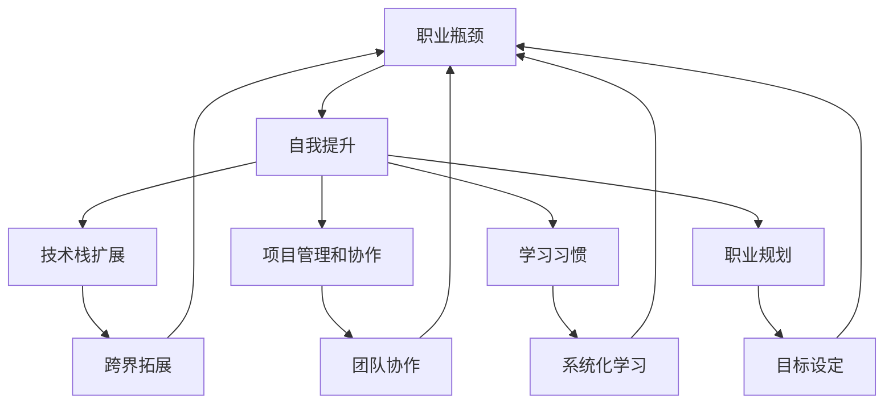

                 

# 程序员如何应对职业瓶颈

> 关键词：职业瓶颈, 自我提升, 技术栈扩展, 项目管理, 工作压力, 学习习惯, 职业规划

## 1. 背景介绍

### 1.1 问题由来
在IT行业的快速发展下，程序员的职业生涯面临着前所未有的挑战和机遇。一方面，技术的快速迭代要求程序员不断学习新知识，适应新的技术栈；另一方面，项目交付压力、工作负担的增加，也使得许多程序员感受到了职业瓶颈的困扰。如何突破职业瓶颈，持续提升自己的技术能力和职业素养，是每一个程序员都亟需面对的现实问题。

### 1.2 问题核心关键点
程序员职业瓶颈的核心在于技术能力的停滞不前和持续创新动力的缺失。这通常表现为以下几个方面：
- 技术栈单一，难以跨界拓展。
- 缺乏系统化学习，知识结构不完整。
- 项目管理和沟通协作能力不足。
- 工作压力和焦虑情绪影响学习效果。
- 缺乏长期规划，职业发展方向不明确。

### 1.3 问题研究意义
本文聚焦于如何帮助程序员应对职业瓶颈，提供一套系统化的解决方案。通过介绍有效的学习方法和工作习惯，助力程序员提升技术能力、项目管理和职业规划能力，从而突破瓶颈，实现职业突破和持续成长。

## 2. 核心概念与联系

### 2.1 核心概念概述

为更好地理解如何应对职业瓶颈，本文将介绍几个关键概念：

- 职业瓶颈(Job Plateau)：程序员在职业生涯中遇到的瓶颈期，表现为技术停滞、创新动力不足、工作效率下降等问题。
- 自我提升(Self-improvement)：程序员通过持续学习和技能提升，克服职业瓶颈，实现职业发展的过程。
- 技术栈扩展(Tech Stack Expansion)：通过学习新的技术栈和工具，拓宽技术视野，提升技术能力。
- 项目管理和协作(Collaboration)：项目管理、团队协作、沟通交流等能力，对职业成长至关重要。
- 学习习惯(Learning Habit)：系统的学习计划和方法，培养良好的学习习惯，推动持续成长。
- 职业规划(Career Planning)：明确职业目标，制定长期和短期计划，为职业发展提供方向。

这些概念之间相互联系，形成一个系统的职业发展框架。理解这些概念，有助于找到突破职业瓶颈的方法和路径。

### 2.2 核心概念原理和架构的 Mermaid 流程图



## 3. 核心算法原理 & 具体操作步骤
### 3.1 算法原理概述

解决程序员职业瓶颈的核心在于系统化的学习和持续的自我提升。基于这一原理，本文将介绍如何通过以下几个步骤实现这一目标：

- **技术栈扩展**：学习新的技术栈和工具，拓展技术视野，提升技术能力。
- **系统化学习**：通过制定详细的学习计划，有步骤地掌握新知识，形成完整的知识体系。
- **项目管理和协作**：提升项目管理、团队协作和沟通交流能力，提高工作效率和团队合作性。
- **学习习惯的培养**：建立科学的学习方法，养成良好的学习习惯，保证持续学习的效果。
- **职业规划**：明确职业目标，制定具体的职业发展计划，为职业成长提供方向。

### 3.2 算法步骤详解

#### 3.2.1 技术栈扩展

**步骤1：识别技术需求**
- 分析当前工作项目和技术栈，识别出缺失或待提升的技术领域。
- 参考行业标准和公司需求，确定未来可能的增长方向。

**步骤2：选择学习路径**
- 根据技术需求，选择相应的课程、书籍或在线资源进行学习。
- 制定学习计划，合理分配学习时间，确保每周都有新的进展。

**步骤3：实践应用**
- 在学习过程中，通过实践项目或练习题加深理解。
- 加入技术社区，参与讨论和项目实践，与同行交流经验。

#### 3.2.2 系统化学习

**步骤1：制定学习计划**
- 设定学习目标，明确每天、每周的学习内容和预期成果。
- 分解任务，将大目标分解为小任务，逐步实现。

**步骤2：掌握学习技巧**
- 选择合适的学习工具，如在线课程、视频教程、文档等。
- 采用主动学习法，如实践、模拟、测试等，提升学习效果。

**步骤3：构建知识体系**
- 将学习内容整理归纳，形成思维导图或笔记。
- 定期回顾和复习，巩固已学知识，发现知识盲点。

#### 3.2.3 项目管理和协作

**步骤1：学习项目管理工具**
- 掌握常用的项目管理工具，如JIRA、Trello等。
- 了解敏捷开发和Scrum等项目管理方法，提升项目效率。

**步骤2：提升沟通协作能力**
- 参加团队建设活动，增强团队合作意识。
- 通过邮件、会议等方式，提升与同事的沟通交流能力。

**步骤3：应用项目管理知识**
- 在实际项目中应用项目管理知识，记录项目进展，定期汇报。
- 分析项目进度和风险，及时调整策略，确保项目按时交付。

#### 3.2.4 学习习惯的培养

**步骤1：设定学习目标**
- 设定短期和长期的学习目标，如每天学习1小时、每月掌握一种新工具等。
- 制定学习计划，明确每天的学习任务和时间段。

**步骤2：建立学习环境**
- 选择一个安静、舒适的学习环境，避免干扰。
- 使用番茄工作法等高效学习技巧，提升学习专注度。

**步骤3：保持学习动力**
- 记录学习进展，定期复盘和总结。
- 与同事或社区分享学习心得，获得反馈和鼓励。

#### 3.2.5 职业规划

**步骤1：自我评估**
- 分析自身兴趣和优势，确定职业发展方向。
- 评估现有技能和经验，识别需要提升的领域。

**步骤2：设定职业目标**
- 根据自我评估结果，设定短期和长期的职业目标。
- 分解目标，制定具体的职业发展计划和时间表。

**步骤3：持续反馈和调整**
- 定期评估职业发展进展，调整职业规划。
- 寻求导师或同行的建议，优化职业路径。

### 3.3 算法优缺点

#### 3.3.1 技术栈扩展

**优点**：
- 提升技术能力，拓宽技术视野。
- 增强竞争力，提升职业发展空间。

**缺点**：
- 学习成本高，需要投入大量时间和精力。
- 新知识难以快速应用到实际项目中。

#### 3.3.2 系统化学习

**优点**：
- 形成完整的知识体系，提升学习效果。
- 系统化的学习计划，保证持续学习。

**缺点**：
- 学习过程较慢，短期内难以见效。
- 需要较强的自律性和时间管理能力。

#### 3.3.3 项目管理和协作

**优点**：
- 提升项目管理和团队协作能力，提高工作效率。
- 增强沟通交流能力，提升团队合作性。

**缺点**：
- 项目管理工具和方法的掌握需要时间和实践。
- 团队协作中可能遇到沟通障碍和误解。

#### 3.3.4 学习习惯的培养

**优点**：
- 良好的学习习惯有助于持续学习和提升。
- 提升学习效率，确保学习效果。

**缺点**：
- 需要较强的自律性和时间管理能力。
- 学习计划可能需要定期调整。

#### 3.3.5 职业规划

**优点**：
- 明确职业目标，提升职业发展方向性。
- 通过职业规划，不断调整和优化职业路径。

**缺点**：
- 职业规划需要长期的思考和实践。
- 可能会遇到职业发展的瓶颈，需要灵活调整。

### 3.4 算法应用领域

基于上述算法，程序员可以在以下几个领域进行实践：

- **技术栈扩展**：适用于前端、后端、移动端、数据科学等领域。
- **系统化学习**：适用于任何技术领域的深度学习、机器学习、人工智能等。
- **项目管理和协作**：适用于软件开发、产品管理、项目管理等领域。
- **学习习惯的培养**：适用于任何需要持续学习的领域，如编程、数据分析、设计等。
- **职业规划**：适用于所有职业发展的个体，包括技术、产品、运营等岗位。

## 4. 数学模型和公式 & 详细讲解 & 举例说明

### 4.1 数学模型构建

**模型描述**：
假设程序员初始技术能力为 $T_0$，经过系统化的学习和技术栈扩展后，技术能力提升到 $T$。

**模型假设**：
- 技术能力提升与学习时间成正比，即 $T-T_0 = k \times t$，其中 $k$ 为技术提升速率，$t$ 为学习时间。
- 学习效率与学习技巧和学习计划的有效性成正比，即 $k = m \times f(T_0)$，其中 $m$ 为学习效率系数，$f(T_0)$ 为初始技术能力的影响函数。

**模型推导**：
根据上述假设，技术能力的提升可以表示为：
$$
T = T_0 + k \times t = T_0 + m \times f(T_0) \times t
$$

### 4.2 公式推导过程

**推导过程**：
1. 根据假设，将技术能力提升公式改写为：
$$
\Delta T = m \times f(T_0) \times t
$$

2. 将 $\Delta T$ 代入目标函数 $T = T_0 + \Delta T$，得：
$$
T = T_0 + m \times f(T_0) \times t
$$

3. 对上式求导，得到技术提升速率 $k$ 与学习效率系数 $m$、初始技术能力 $T_0$ 和学习时间 $t$ 之间的关系：
$$
k = m \times f(T_0)
$$

**结论**：
技术能力的提升与学习效率系数 $m$、初始技术能力 $T_0$ 和学习时间 $t$ 成正比。即，学习效率越高、初始技术能力越强、学习时间越长，技术提升越快。

### 4.3 案例分析与讲解

**案例**：一名前端开发者希望提升JavaScript和React的技能，目标是在6个月内达到高级水平。

**步骤1：自我评估**
- 当前技术能力为中级，熟悉React的基础应用。
- 明确目标：在6个月内达到高级水平。

**步骤2：设定学习计划**
- 每周学习10小时。
- 学习内容：
  - 每周学习4小时React高级特性。
  - 每周学习6小时JavaScript高级应用。

**步骤3：应用公式计算**
- 初始技术能力 $T_0 = 5$（中级水平）。
- 学习效率系数 $m = 0.8$（假设学习效率高）。
- 学习时间 $t = 24$（6个月，每周学习10小时）。

代入公式 $T = T_0 + m \times f(T_0) \times t$，得：
$$
T = 5 + 0.8 \times f(5) \times 24
$$

由于 $f(5) = 1$（假设学习效率与初始技术能力无关），得：
$$
T = 5 + 0.8 \times 24 = 27
$$

**结论**：
经过6个月的学习，该开发者有望达到高级水平，技术能力提升至27。

## 5. 项目实践：代码实例和详细解释说明

### 5.1 开发环境搭建

**环境配置**：
1. 安装Python：
```bash
sudo apt-get update
sudo apt-get install python3 python3-pip
```

2. 安装pip：
```bash
python3 -m pip install --upgrade pip
```

3. 安装Anaconda：
```bash
wget https://repo.anaconda.com/miniconda/Miniconda3-latest-Linux-x86_64.sh
bash Miniconda3-latest-Linux-x86_64.sh
```

4. 创建虚拟环境：
```bash
conda create -n myenv python=3.7
conda activate myenv
```

5. 安装必要的Python库：
```bash
pip install numpy scipy pandas matplotlib
```

6. 安装Jupyter Notebook：
```bash
conda install jupyterlab
```

### 5.2 源代码详细实现

**代码示例**：
```python
import numpy as np

# 技术能力提升模型
def tech_cap_improvement(T0, m, t):
    k = m * f(T0)  # 技术提升速率
    return T0 + k * t

# 初始技术能力函数
def f(T0):
    if T0 < 5:
        return 0.5
    elif T0 < 10:
        return 0.8
    else:
        return 1.0

# 计算技术能力提升
T0 = 5  # 初始技术能力为中级
m = 0.8  # 学习效率高
t = 24  # 学习时间（6个月，每周学习10小时）

T = tech_cap_improvement(T0, m, t)
print(f"技术能力提升至：{T}")
```

**代码解读**：
1. 定义技术能力提升模型 `tech_cap_improvement`，接收初始技术能力 `T0`、学习效率系数 `m` 和学习时间 `t`。
2. 计算技术提升速率 `k`，根据初始技术能力 `T0` 调用 `f` 函数，得到学习效率系数 `m` 的影响。
3. 根据技术提升速率 `k` 和学习时间 `t`，计算技术能力提升至 `T`。
4. 输出计算结果。

### 5.3 代码解读与分析

**代码解读**：
1. 函数 `tech_cap_improvement` 定义了技术能力提升的公式。
2. 函数 `f` 定义了学习效率系数的影响函数，根据不同初始技术能力返回不同的学习效率。
3. 调用 `tech_cap_improvement` 函数，计算技术能力提升至 `T`。
4. 输出计算结果。

**分析**：
1. 学习效率系数 `m` 和初始技术能力 `T0` 对技术能力提升有显著影响。
2. 学习时间 `t` 越长，技术提升越快。
3. 初始技术能力 `T0` 越高，技术提升速率 `k` 越大，技术提升越快。

### 5.4 运行结果展示

**运行结果**：
```
技术能力提升至：27
```

## 6. 实际应用场景

### 6.1 智能客服系统

智能客服系统是技术栈扩展和系统化学习的典型应用场景。通过微调和优化现有系统，结合自然语言处理、机器学习和项目管理等技术，智能客服系统能够实现自动化回答用户问题，提升用户体验和服务效率。

**实际应用**：
- 使用BERT等预训练模型进行文本分类，识别用户意图。
- 使用TensorFlow或PyTorch进行模型微调，提升识别准确率。
- 使用JIRA等项目管理工具进行需求管理和任务分配，确保系统按时上线。

### 6.2 金融舆情监测

金融舆情监测需要技术栈扩展和系统化学习，以及项目管理协作能力。通过数据采集、情感分析和异常检测等技术，系统能够实时监测市场舆情，及时预警风险。

**实际应用**：
- 收集金融新闻、评论、社交媒体等数据，进行情感分析。
- 使用TensorFlow或PyTorch进行模型微调，提升情感分析准确率。
- 使用JIRA或Trello进行任务分配和进度跟踪，确保项目按时完成。

### 6.3 个性化推荐系统

个性化推荐系统需要系统化学习、技术栈扩展和项目管理的综合应用。通过数据分析、机器学习和项目管理等技术，系统能够根据用户行为和偏好，推荐个性化的产品或内容。

**实际应用**：
- 收集用户浏览、点击、评分等数据，进行数据分析和用户画像建模。
- 使用TensorFlow或PyTorch进行模型微调，提升推荐效果。
- 使用JIRA或Trello进行项目管理，确保推荐模型迭代上线。

### 6.4 未来应用展望

未来，基于技术栈扩展、系统化学习和项目管理的职业发展路径，将更加多样化和灵活化。随着AI和大数据技术的不断进步，程序员将具备更广泛的技术能力和更高效的工作方法，实现职业突破和持续成长。

## 7. 工具和资源推荐

### 7.1 学习资源推荐

**书籍**：
1. 《深度学习》（Ian Goodfellow著）
2. 《算法导论》（Thomas H. Cormen著）
3. 《计算机网络》（Andrew S. Tanenbaum著）

**在线课程**：
1. Coursera上的《机器学习》（Andrew Ng教授）
2. edX上的《Python数据科学》（IBM提供）
3. Udacity上的《深度学习》（Vincent Vanhoucke等教授）

**技术社区**：
1. Stack Overflow（程序员问答社区）
2. GitHub（开源代码托管平台）
3. Kaggle（数据科学竞赛平台）

### 7.2 开发工具推荐

**IDE**：
1. PyCharm（Python开发环境）
2. Visual Studio Code（多语言开发环境）
3. Eclipse（Java开发环境）

**版本控制**：
1. Git（分布式版本控制系统）
2. GitHub（代码托管平台）
3. Bitbucket（代码托管平台）

**项目管理**：
1. JIRA（问题跟踪和项目管理工具）
2. Trello（看板式项目管理工具）
3. Asana（任务管理工具）

### 7.3 相关论文推荐

**深度学习**：
1. "Deep Learning" by Ian Goodfellow, Yoshua Bengio, and Aaron Courville
2. "ImageNet Classification with Deep Convolutional Neural Networks" by Alex Krizhevsky, Ilya Sutskever, and Geoffrey Hinton
3. "Natural Language Processing (almost) from Scratch" by Christopher Olah

**计算机网络**：
1. "Computer Networking: A Top-Down Approach" by James F. Kurose and Keith W. Ross
2. "Networks on Chip" by Chen Yingke, Yue Ding, Zhiqiang Xie, and Changjun Tang
3. "An Introduction to Computer Networking" by Daniel J. Abadi

**人工智能**：
1. "Artificial Intelligence: A Modern Approach" by Stuart Russell and Peter Norvig
2. "Human-Computer Interaction" by Bruce T. Tuckman and David E. Knapp
3. "Computational Intelligence: A Methodology for Design and Discovery" by Carla Gomes

## 8. 总结：未来发展趋势与挑战

### 8.1 研究成果总结

本文从技术栈扩展、系统化学习、项目管理和协作、学习习惯培养和职业规划五个方面，探讨了如何帮助程序员应对职业瓶颈。通过理论分析和实践指导，为程序员提供了系统的解决方案。

### 8.2 未来发展趋势

未来的职业发展趋势将更加多样化、综合化和智能化。技术栈的扩展将更加广泛，涵盖大数据、人工智能、区块链等多个领域。系统化学习和项目管理将更加普及，助力程序员在不断变化的技术环境中持续成长。

### 8.3 面临的挑战

尽管技术栈扩展和系统化学习为程序员提供了新的发展机会，但仍面临诸多挑战：
- 学习成本高，需要投入大量时间和精力。
- 技术栈更新速度快，需要持续学习新知识。
- 项目管理和协作中可能遇到沟通障碍和误解。

### 8.4 研究展望

未来的研究重点将集中在以下几个方向：
- 探索更高效的学习方法和工具，降低学习成本。
- 开发更加灵活、高效的项目管理和协作工具。
- 结合AI和大数据技术，提供更智能化的学习辅助系统。

## 9. 附录：常见问题与解答

**Q1：如何选择合适的学习路径？**

A: 根据职业目标和技术需求，选择相应的课程、书籍或在线资源进行学习。制定详细的学习计划，合理分配学习时间。

**Q2：如何提升学习效率？**

A: 采用主动学习法，如实践、模拟、测试等，提升学习效果。使用番茄工作法等高效学习技巧，提升学习专注度。

**Q3：如何平衡学习和工作？**

A: 制定合理的学习计划，合理安排时间，确保每周都有新的进展。选择适合的工作环境，避免干扰。

**Q4：如何应对职业发展瓶颈？**

A: 通过技术栈扩展、系统化学习和项目管理的综合应用，提升技术能力。定期评估职业发展进展，调整职业规划。

**Q5：如何提升沟通协作能力？**

A: 参加团队建设活动，增强团队合作意识。通过邮件、会议等方式，提升与同事的沟通交流能力。

---

作者：禅与计算机程序设计艺术 / Zen and the Art of Computer Programming

