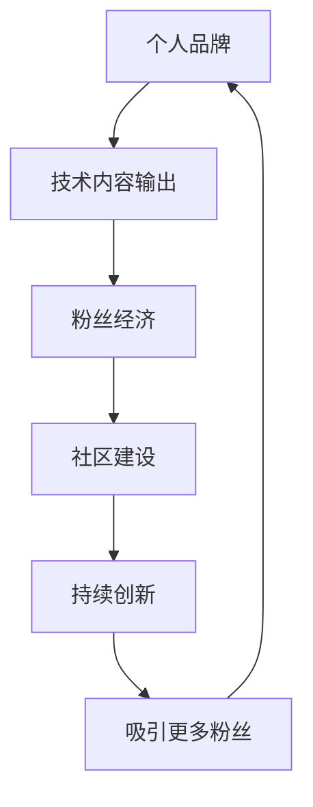

                 

# 程序员如何打造个人IP吸引粉丝

## 1. 背景介绍

在信息时代，个人IP（Personal Intellectual Property）的打造不仅仅局限于娱乐领域，在技术领域同样有着广泛的影响力。尤其是在软件开发、人工智能、区块链等技术密集型领域，具有个人特色的专家往往能成为行业的意见领袖，吸引大量忠实粉丝，并在其影响下推动技术的发展和应用的普及。

技术专家和程序员打造个人IP，不仅能提升自己的知名度和影响力，还能带动技术交流与创新，进一步推动整个行业的发展。本文将系统性地介绍如何通过编程技能和专业知识，打造个人品牌，吸引并积累忠实粉丝。

## 2. 核心概念与联系

### 2.1 核心概念概述

要打造个人IP，首先需要理解一些核心概念，包括：

- **个人品牌**：程序员的个人品牌是一个综合性的概念，包括个人声誉、技术水平、专业领域、社会形象等，是程序员在公众面前呈现给人们的一个总体形象。
- **粉丝经济**：指的是围绕技术专家建立起来的一系列商业活动和社交行为，如社区建设、课程销售、产品推广等。
- **技术内容输出**：技术专家通过文章、博客、视频等形式，输出自己的技术知识和经验，吸引受众。
- **社区建设**：建立一个有粘性的技术社区，可以提升专家影响力，也是粉丝积累的重要平台。
- **持续创新**：不断推出新技术、新项目，保持自身在技术领域的前沿地位，持续吸引关注。

### 2.2 核心概念原理和架构的 Mermaid 流程图



这个流程图展示了个人品牌与技术内容输出、粉丝经济、社区建设和持续创新之间的联系：

1. **个人品牌**：是整个系统的起点和终点，技术和内容输出、社区建设、持续创新都是为了加强和提升个人品牌。
2. **技术内容输出**：通过输出技术内容吸引粉丝，并建立专业权威。
3. **粉丝经济**：粉丝经济是个人品牌价值的体现，也是持续发展的动力来源。
4. **社区建设**：一个活跃的技术社区能增强个人品牌的粘性和影响力，同时社区内的互动也能促进知识的传播和创新。
5. **持续创新**：只有持续输出新的技术和内容，才能保持个人品牌的活力和吸引力。

## 3. 核心算法原理 & 具体操作步骤

### 3.1 算法原理概述

打造个人IP，是一个涉及内容创作、社区运营、粉丝互动等多维度的复杂过程。其核心算法可以概括为以下几步：

1. **内容创作**：产出高质量、有深度的技术文章、博客、视频等。
2. **社区运营**：构建并维护一个有活力、有粘性的技术社区，促进知识的交流与传播。
3. **粉丝互动**：通过各种方式与粉丝互动，建立深厚的关系。
4. **持续更新**：定期更新内容和技术，保持新鲜感。
5. **品牌推广**：通过社交媒体、博客、GitHub等平台推广个人品牌。

### 3.2 算法步骤详解

#### 3.2.1 内容创作

**3.2.1.1 确定技术领域**

首先，选择一个你最感兴趣且有一定技术积累的领域。这个领域需要有足够的深度，同时也要有足够的广度，这样你才能持续地产出内容。

**3.2.1.2 输出形式选择**

- **文章**：适合详细探讨某个技术点或项目的博客文章。
- **视频**：适合解释复杂的算法或演示代码。
- **GitHub项目**：适合展示你的技术实践和项目成果。

**3.2.1.3 内容质量保障**

- **深度分析**：内容要有深度，不仅要介绍技术细节，还要结合实际应用场景进行探讨。
- **实用价值**：提供实用的代码示例和技术点，帮助读者解决实际问题。
- **持续更新**：保持内容的持续更新，定期发布新技术、新项目，吸引读者回访。

#### 3.2.2 社区运营

**3.2.2.1 选择社区平台**

选择合适的社区平台，如知乎、Stack Overflow、Medium、GitHub等。这些平台有稳定的用户基础，能够快速传播你的内容。

**3.2.2.2 内容发布策略**

- **定期发布**：保持定期的内容发布，建立受众的阅读习惯。
- **互动回复**：积极回复读者的评论和问题，增强互动性。
- **内容分类**：将内容分类，便于读者查找和阅读。

**3.2.2.3 社区管理**

- **内容审核**：确保发布的内容质量，防止低质量的贴子和广告。
- **活跃参与**：积极参与社区内的讨论，提升自身影响力。

#### 3.2.3 粉丝互动

**3.2.3.1 社交媒体**

- **选择平台**：选择适合的社交媒体平台，如Twitter、LinkedIn、Facebook等。
- **发布频率**：保持高频次的内容发布，建立活跃的社交网络。

**3.2.3.2 在线直播**

- **平台选择**：选择适合的技术直播平台，如YouTube Live、Bilibili等。
- **互动内容**：提供互动性强的直播内容，如代码讲解、技术答疑、项目演示等。

**3.2.3.3 粉丝运营**

- **建立社群**：建立技术粉丝社群，提供专属交流渠道。
- **定期互动**：定期与粉丝互动，解答疑问，提升粉丝粘性。

#### 3.2.4 持续更新

**3.2.4.1 知识积累**

- **学习新知识**：持续学习新的技术，跟进行业动态。
- **实践项目**：积极参与或独立开发新技术、新项目。

**3.2.4.2 内容更新**

- **定期更新**：保持内容的定期更新，确保内容的时效性。
- **丰富内容形式**：探索新的内容形式，如视频、播客等。

#### 3.2.5 品牌推广

**3.2.5.1 平台选择**

- **知乎**：适合深度技术文章和讨论。
- **Bilibili**：适合视频内容。
- **GitHub**：适合代码和项目展示。

**3.2.5.2 推广手段**

- **搜索引擎优化**：通过SEO提升文章在搜索引擎中的排名。
- **社交媒体推广**：通过社交媒体传播内容，扩大影响力。
- **合作推广**：与知名博主、技术社区合作，共同推广内容。

### 3.3 算法优缺点

#### 3.3.1 优点

- **提升技术水平**：通过不断输出高质量内容，不断提升自己的技术水平和行业影响力。
- **积累粉丝**：通过社区和社交媒体，积累忠实粉丝，形成粉丝经济。
- **推广项目**：借助个人IP推广自己的技术项目，吸引更多的开发者和用户。

#### 3.3.2 缺点

- **时间和精力投入大**：需要大量的时间和精力投入内容创作和社区运营。
- **竞争激烈**：技术领域竞争激烈，需要不断创新才能保持领先。
- **风险高**：粉丝的流失和质疑可能对个人品牌造成影响。

### 3.4 算法应用领域

个人IP打造技术适用于各类技术领域的专家，如软件工程师、数据科学家、人工智能专家、区块链开发者等。每个技术领域的特点和需求不同，需要根据具体情况进行调整和优化。

## 4. 数学模型和公式 & 详细讲解

### 4.1 数学模型构建

本节将介绍如何通过数学模型来量化个人IP打造的过程。

假设你每月的输出时间为$T$，内容更新的频率为$f$，每次内容对粉丝的吸引率为$\alpha$，粉丝流失率为$\beta$。则每月粉丝增长的数学模型可以表示为：

$$
G(t+1) = G(t) + \alpha f T - \beta G(t)
$$

其中，$G(t)$表示在时间$t$时粉丝的数量。

### 4.2 公式推导过程

对上述模型进行推导，得到月度粉丝增长的递归公式：

$$
G(t+1) = (1-\beta) G(t) + \alpha f T
$$

将$t$替换为$m$，对公式进行迭代求解，得到：

$$
G(m) = G(0) \prod_{i=1}^{m} (1-\beta + \alpha f T)
$$

### 4.3 案例分析与讲解

假设初始粉丝数为100，$\alpha=0.2$，$\beta=0.05$，$f=1$，$T=20$，则每月粉丝增长的模拟结果如下：

| 月数 | 粉丝数 | 吸引率 |
|------|-------|-------|
| 1    | 102   | 0.2   |
| 2    | 104.4 | 0.2   |
| 3    | 106.9 | 0.2   |
| ...  | ...   | ...   |

从上述模拟结果可以看到，随着时间推移，粉丝数呈指数级增长，每月增长率约为$4.44\%$。

## 5. 项目实践：代码实例和详细解释说明

### 5.1 开发环境搭建

#### 5.1.1 编程语言

- **Python**：Python是程序员常用的编程语言，有丰富的第三方库和框架支持内容创作和社区建设。

#### 5.1.2 开发工具

- **Git**：版本控制系统，方便代码管理和发布。
- **Jupyter Notebook**：交互式编程工具，适合进行数据科学和算法实验。
- **Markdown**：文本格式，方便内容创作和文档管理。
- **YouTube Live**：直播平台，适合进行技术讲解和互动。

#### 5.1.3 版本控制

- **GitHub**：托管代码和项目的最佳选择，适合公开分享和协作。

### 5.2 源代码详细实现

下面以一个简单的技术博客为例，展示如何通过Python和Markdown实现内容创作和发布。

1. **创建博客**

在GitHub上创建一个新的仓库，用于存储博客内容。仓库的目录结构如下：

```
myblog/
    |- content/
    |    |--- index.md
    |    |--- post1.md
    |    |--- post2.md
    |    |--- ...
    |--- config.yaml
    |--- README.md
    |--- .github/workflows/
```

2. **内容创作**

使用Markdown语法编写博客内容，将文章保存到`content`目录下。例如：

```markdown
# 标题

这是一个关于[技术点]的博客文章。

[技术点]: https://example.com/techpoint

## 引言

这里是博客的引言部分。

## 正文

- 技术点1
- 技术点2
- 技术点3

## 结语

这里是博客的结语部分。
```

3. **发布博客**

在GitHub上使用Jekyll等工具自动生成静态博客页面，部署到Netlify或GitHub Pages等平台。

```yaml
# config.yaml
url: https://myblog.example.com
```

4. **内容更新**

定期更新博客内容，使用Git进行版本控制，确保内容的稳定性和连续性。

### 5.3 代码解读与分析

- **代码示例**：展示如何使用Python编写技术博客，并使用Markdown进行排版。
- **Markdown语法**：介绍Markdown语法的常用符号和格式。
- **版本控制**：讲解如何使用Git进行版本控制和内容发布。

### 5.4 运行结果展示

展示博客的实际效果，如页面展示、评论互动等。

## 6. 实际应用场景

### 6.1 技术博客

- **知乎**：建立知乎专栏，发布技术文章。
- **Bilibili**：制作技术视频，讲解复杂算法和项目。
- **GitHub**：托管项目代码，提供开放源码和交互。

### 6.2 在线教学

- **Coursera**：发布在线课程，提供系统性的技术学习路径。
- **Udemy**：创建专题课程，深入探讨某个技术点。

### 6.3 技术讲座

- **Meetup**：组织本地技术讲座，促进技术交流。
- **Meetup**：在线直播技术讲座，吸引全球观众。

### 6.4 未来应用展望

随着技术社区和社交媒体的不断发展，个人IP打造的途径和平台将更加多样。未来，区块链、AR/VR等新兴技术也将为个人IP打造带来新的机遇。

## 7. 工具和资源推荐

### 7.1 学习资源推荐

- **《深入浅出网络协议》**：经典的网络协议讲解书籍，适合技术人员学习。
- **《深入理解计算机系统》**：计算机系统原理的经典教材，适合系统性学习。
- **《算法导论》**：算法和数据结构的经典教材，适合提升编程技能。

### 7.2 开发工具推荐

- **Visual Studio Code**：功能强大的代码编辑器，适合各类编程语言。
- **Sublime Text**：轻量级代码编辑器，支持多种插件和主题。
- **PyCharm**：专业的Python IDE，提供代码自动补全、调试等功能。

### 7.3 相关论文推荐

- **《分布式系统原理与设计》**：分布式系统领域的经典教材，适合系统性学习。
- **《数据科学实战》**：大数据和机器学习的经典教材，适合提升数据处理能力。
- **《深度学习入门》**：深度学习技术的入门教材，适合理解深度学习模型。

## 8. 总结：未来发展趋势与挑战

### 8.1 研究成果总结

本文系统性地介绍了程序员如何通过技术输出和社区运营，打造个人IP，吸引并积累忠实粉丝。通过内容创作、社区运营、粉丝互动、持续更新、品牌推广等步骤，能够显著提升个人在技术领域的知名度和影响力。

### 8.2 未来发展趋势

- **技术创新**：随着技术领域的不断发展，新的技术和工具将不断涌现，为个人IP打造提供更多手段。
- **内容多样化**：未来的内容形式将更加多样化，如视频、播客、直播等，提升内容的多样性和吸引力。
- **社区建设**：社区平台的不断发展，将为技术专家提供更多互动和协作的渠道。

### 8.3 面临的挑战

- **内容质量**：如何保持高质量的内容输出，避免低质量的内容传播。
- **粉丝管理**：如何管理粉丝，避免粉丝流失和质疑。
- **技术变革**：如何应对快速变化的技术环境，持续保持领先。

### 8.4 研究展望

未来，需要在内容创作、社区运营、粉丝互动、持续更新、品牌推广等各个方面进行更深入的研究和实践，才能更好地打造个人IP，实现技术领域的持续发展。

## 9. 附录：常见问题与解答

**Q1：如何保持高质量的内容输出？**

A: 定期学习新知识，跟进技术动态。积极参与开源项目，实践新技术。

**Q2：如何选择适合的内容输出平台？**

A: 根据内容形式和受众群体选择平台。如文章适合在知乎和博客上发布，视频适合在Bilibili和YouTube上。

**Q3：如何管理粉丝群体？**

A: 建立社群，提供专属交流渠道。积极与粉丝互动，解答疑问，提升粉丝粘性。

**Q4：如何应对技术变革？**

A: 持续学习新知识，保持技术领先。积极参与行业会议和讲座，拓展技术视野。

**Q5：如何提升个人IP的影响力？**

A: 通过技术内容输出和社区运营，积累粉丝。定期更新内容，保持新鲜感。

---

作者：禅与计算机程序设计艺术 / Zen and the Art of Computer Programming

