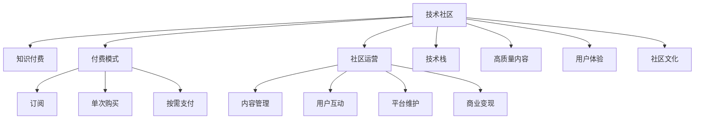

                 

## 1. 背景介绍

### 1.1 问题由来
随着互联网技术的飞速发展和社交网络的普及，越来越多的人开始转向网络寻求知识和信息。技术社区和论坛成为程序员、开发者和技术人员交流知识、分享经验、解决技术难题的重要平台。然而，传统的技术社区往往存在信息过载、高质量内容稀缺、低质量内容泛滥、用户粘性差等问题，用户体验和社区价值难以得到保障。如何打造一个高质量、有吸引力、可持续发展的技术付费社区，成为了摆在程序员面前的巨大挑战。

### 1.2 问题核心关键点
高质量技术付费社区的打造需要解决以下几个核心关键点：
- **内容质量**：社区中必须有高质量、深度、原创的技术内容，才能吸引并留住用户。
- **用户粘性**：社区需要提供互动性、趣味性、个性化服务，增强用户粘性。
- **商业模式**：社区需要具备清晰的商业模式，既能维持运营又能获取收益。
- **社区文化**：社区需要建立良好的社区文化和运营规范，鼓励正向交流和分享。
- **技术栈支持**：社区需要覆盖主流技术栈，满足不同技术背景用户的需求。

### 1.3 问题研究意义
高质量技术付费社区的打造不仅能提升技术交流效率，还能加速技术创新和人才培养，促进技术行业发展。具有代表性的技术社区如Stack Overflow、Medium、掘金、博客园等，都已成为行业内知名平台，积累了大量高质量内容和技术精英。因此，从这些社区的成功案例中吸取经验和教训，对于打造属于自己的高质量技术付费社区至关重要。

## 2. 核心概念与联系

### 2.1 核心概念概述

为了更好地理解如何打造高质量技术付费社区，本文将介绍以下几个密切相关的核心概念：

- **技术社区**：聚集了技术人员，进行技术交流、知识共享、问题解答的平台，如Stack Overflow、Medium等。
- **知识付费**：通过收费方式，提供专业化、深度化的知识内容，如书籍、课程、文章等，提升用户获取知识的效率和质量。
- **付费模式**：通过订阅、单次购买、按需支付等形式，获取社区提供的服务和内容。
- **社区运营**：涉及内容管理、用户互动、平台维护、商业变现等环节，是社区持续发展的关键。
- **技术栈**：指某个领域内的主流技术、工具、框架、库等，如前端、后端、数据科学等。
- **高质量内容**：包括原创、深度、专业、有价值的技术文章、教程、案例分析、项目经验分享等。
- **用户体验**：涉及社区的界面设计、交互体验、功能实现等，直接影响用户的使用感受和满意度。
- **社区文化**：社区成员的交流方式、讨论规范、文化氛围等，影响社区的健康发展和用户粘性。

这些核心概念之间的逻辑关系可以通过以下Mermaid流程图来展示：



这个流程图展示了技术社区的核心概念及其之间的联系：

1. 技术社区通过知识付费提供专业化、深度化的知识内容。
2. 社区运营包含内容管理、用户互动、平台维护、商业变现等环节，确保社区的持续发展。
3. 社区运营和技术栈是高质量内容生产的基础。
4. 用户体验和社区文化直接影响用户粘性和社区氛围。
5. 高质量内容和技术栈覆盖是社区价值的核心。

## 3. 核心算法原理 & 具体操作步骤

### 3.1 算法原理概述

高质量技术付费社区的打造，本质上是一个多目标优化的过程，涉及内容质量、用户粘性、商业变现等多个维度的优化。算法原理主要包括以下几个方面：

1. **内容推荐算法**：通过算法推荐高质量、相关性高的内容，提升用户满意度和粘性。
2. **用户行为分析**：利用数据挖掘和机器学习算法，分析用户行为，优化社区运营策略。
3. **广告推荐算法**：根据用户行为和兴趣，精准推荐相关广告，提升社区收益。
4. **定价策略**：通过动态定价算法，根据市场需求和内容价值，调整订阅价格，最大化收益。
5. **内容审核机制**：建立严格的审核机制，保证内容质量和社区文化。

### 3.2 算法步骤详解

以下详细介绍如何通过算法和数据驱动，打造高质量技术付费社区的具体步骤：

**Step 1: 内容质量控制**
- **内容审核机制**：建立内容审核团队，采用机器学习算法辅助审核，确保内容的原创性、深度和专业性。
- **优质内容激励**：通过点赞、评论、分享等方式，激励优质内容创作和分享，提升社区整体内容质量。
- **质量监控系统**：建立内容质量监控系统，对内容进行打分和评价，定期发布优质内容排行榜，鼓励高质量内容生产。

**Step 2: 用户粘性提升**
- **互动平台设计**：设计用户互动平台，支持实时评论、问答、讨论、投票等功能，增强用户互动性。
- **个性化推荐**：根据用户历史行为和兴趣，推荐相关内容和技术栈，提升用户粘性。
- **社区活动策划**：定期策划社区活动和技术沙龙，吸引用户参与，增强社区活跃度。

**Step 3: 商业变现策略**
- **订阅模式设计**：设计多种订阅模式，如个人订阅、企业订阅、按月订阅等，满足不同用户的需求。
- **广告投放优化**：利用算法精准推荐相关广告，提升广告效果和点击率，最大化广告收益。
- **商业合作开发**：与厂商和技术公司合作，推出定制化课程和技术培训，拓展商业变现渠道。

**Step 4: 技术栈覆盖和更新**
- **技术栈调研**：定期调研热门技术栈和新兴技术，更新社区内容和技术支持。
- **技术专家引入**：引入技术专家和行业大咖，提供深度技术分享和指导，提升社区技术水平。
- **技术沙龙和讲座**：举办技术沙龙和在线讲座，分享前沿技术和发展趋势，吸引更多用户加入。

**Step 5: 社区文化和运营规范**
- **社区文化塑造**：建立正向、友好的社区文化，鼓励技术交流和创新，抵制低质量内容和行为。
- **运营规范制定**：制定严格的社区运营规范，确保社区的良性发展和用户利益。
- **用户反馈机制**：建立用户反馈机制，及时处理用户投诉和建议，持续优化社区服务。

### 3.3 算法优缺点

高质量技术付费社区的打造算法，具有以下优点：
- **数据驱动优化**：通过数据分析和算法优化，提升内容质量和用户粘性，实现商业变现。
- **个性化服务**：利用个性化推荐算法，提升用户体验，增强社区粘性。
- **高效运营**：通过自动化和算法优化，减少人力成本，提升运营效率。

同时，该算法也存在一些局限性：
- **技术门槛高**：需要较强的数据科学和机器学习基础，对算法优化和数据处理有较高要求。
- **数据隐私风险**：用户行为和内容数据隐私保护问题，需要严格的数据安全和隐私保护措施。
- **内容审核难度大**：高质量内容的审核和质量监控需要投入大量人力和资源，可能面临审核成本高的问题。

尽管存在这些局限性，但就目前而言，数据驱动的高质量技术付费社区打造算法，仍是最主流和高效的方式。未来相关研究的重点在于如何进一步降低算法复杂度，优化资源利用，同时兼顾数据隐私和安全，以更好地实现社区目标。

### 3.4 算法应用领域

高质量技术付费社区的打造算法，已经在各类技术社区和论坛中得到了广泛应用，涵盖了以下领域：

- **Stack Overflow**：利用算法推荐和社区管理，成为全球最大的程序员社区。
- **Medium**：通过订阅模式和广告变现，积累了大量高质量技术文章。
- **掘金**：覆盖全栈技术栈，提供深度技术分享和交流平台。
- **博客园**：提供开发者社区和在线编程支持，吸引了大量技术爱好者。

除了上述这些主流社区，高质量技术付费社区打造算法还被创新性地应用到更多场景中，如技术培训平台、企业内部技术社区、开源项目协作平台等，为技术交流和协作带来了全新的突破。随着算法和技术的不断进步，相信高质量技术付费社区将会在更多领域得到应用，为技术社区的发展注入新的动力。

## 4. 数学模型和公式 & 详细讲解 & 举例说明

### 4.1 数学模型构建

本节将使用数学语言对高质量技术付费社区的打造过程进行更加严格的刻画。

设社区内容集合为 $\mathcal{C}$，用户集合为 $\mathcal{U}$，内容与用户之间的互动关系为 $\mathcal{I}$，社区收益为 $\mathcal{R}$。则高质量技术付费社区的优化目标为：

$$
\min_{\mathcal{C},\mathcal{U},\mathcal{I},\mathcal{R}} \underbrace{L_{content}(\mathcal{C}) + L_{interaction}(\mathcal{U},\mathcal{C}) + L_{revenue}(\mathcal{U},\mathcal{R})}_{总损失} + \underbrace{L_{security}(\mathcal{U},\mathcal{C})}_{安全损失}
$$

其中 $L_{content}$ 为内容质量损失，$L_{interaction}$ 为互动质量损失，$L_{revenue}$ 为商业变现损失，$L_{security}$ 为数据隐私和安全损失。优化目标最小化总损失，最大化社区收益。

### 4.2 公式推导过程

以下是内容推荐算法和用户行为分析的详细公式推导。

**内容推荐算法**：
设用户 $u$ 对内容 $c$ 的兴趣权重为 $w_{uc}$，内容 $c$ 的优质程度为 $q_c$，用户行为 $a_u$ 为阅读、点赞、评论等行为。则内容推荐算法可表示为：

$$
R_{uc} = w_{uc} \times q_c \times a_u
$$

其中 $R_{uc}$ 为内容 $c$ 对用户 $u$ 的推荐权重，$w_{uc}$ 为用户对内容的兴趣权重，$q_c$ 为内容的优质程度，$a_u$ 为用户的互动行为。

**用户行为分析**：
设用户 $u$ 的历史行为为 $H_u$，行为序列为 $T_{u}$。则用户行为分析算法可表示为：

$$
T_{u} = f(H_u)
$$

其中 $f$ 为用户行为生成函数，将用户历史行为映射为用户行为序列。通过分析用户行为序列，可以优化用户推荐策略，提升用户粘性和满意度。

## 5. 项目实践：代码实例和详细解释说明

### 5.1 开发环境搭建

在进行技术付费社区打造实践前，我们需要准备好开发环境。以下是使用Python进行PyTorch开发的环境配置流程：

1. 安装Anaconda：从官网下载并安装Anaconda，用于创建独立的Python环境。

2. 创建并激活虚拟环境：
```bash
conda create -n tech-env python=3.8 
conda activate tech-env
```

3. 安装PyTorch：根据CUDA版本，从官网获取对应的安装命令。例如：
```bash
conda install pytorch torchvision torchaudio cudatoolkit=11.1 -c pytorch -c conda-forge
```

4. 安装TensorFlow：
```bash
pip install tensorflow
```

5. 安装Flask：用于构建社区后端服务，提供API接口。
```bash
pip install flask
```

6. 安装SQLite3：用于存储用户数据和内容数据。
```bash
pip install sqlite3
```

完成上述步骤后，即可在`tech-env`环境中开始社区打造实践。

### 5.2 源代码详细实现

下面我们以技术文章推荐系统为例，给出使用PyTorch和TensorFlow进行内容推荐和用户行为分析的代码实现。

首先，定义内容推荐模型：

```python
import torch
from torch import nn
from torch.nn import Linear

class ContentRecommender(nn.Module):
    def __init__(self, input_size, hidden_size, output_size):
        super(ContentRecommender, self).__init__()
        self.hidden = nn.Linear(input_size, hidden_size)
        self.out = nn.Linear(hidden_size, output_size)

    def forward(self, x):
        x = self.hidden(x)
        x = torch.tanh(x)
        x = self.out(x)
        return x
```

然后，定义用户行为分析模型：

```python
from tensorflow.keras.models import Sequential
from tensorflow.keras.layers import Dense, LSTM

class BehaviorAnalyser(Sequential):
    def __init__(self, input_size, hidden_size, output_size):
        super(BehaviorAnalyser, self).__init__()
        self.add(LSTM(hidden_size, input_shape=(input_size, 1)))
        self.add(Dense(output_size, activation='sigmoid'))

    def fit(self, x, y, batch_size=32, epochs=10):
        self.compile(loss='binary_crossentropy', optimizer='adam', metrics=['accuracy'])
        self.fit(x, y, batch_size=batch_size, epochs=epochs)
```

接着，定义推荐和分析函数：

```python
from flask import Flask, request, jsonify

app = Flask(__name__)

@app.route('/recommend', methods=['POST'])
def recommend_content():
    user_id = request.json['user_id']
    user_behaviors = request.json['user_behaviors']
    content_quality = request.json['content_quality']
    user_interest_weights = request.json['user_interest_weights']
    
    # 计算推荐权重
    recommender = ContentRecommender(len(user_behaviors), 10, 1)
    recommender_weights = recommender(torch.tensor(user_behaviors).float())
    content_recommends = (recommender_weights * content_quality).sum().tolist()

    # 预测用户行为
    behavior_analyser = BehaviorAnalyser(len(user_behaviors), 10, 1)
    behavior_analyser.fit(user_behaviors, user_interest_weights)
    user_behavior_predict = behavior_analyser.predict(user_behaviors)

    return jsonify({'content_recommends': content_recommends, 'user_behavior_predict': user_behavior_predict})

if __name__ == '__main__':
    app.run(debug=True)
```

在运行代码前，需要先构建一个包含用户行为和内容质量的数据集，用于训练推荐和行为分析模型。

### 5.3 代码解读与分析

让我们再详细解读一下关键代码的实现细节：

**ContentRecommender类**：
- `__init__`方法：定义内容推荐模型的隐藏层和输出层。
- `forward`方法：实现前向传播，计算推荐权重。

**BehaviorAnalyser类**：
- `__init__`方法：定义用户行为分析模型的LSTM和输出层。
- `fit`方法：实现模型训练，根据用户行为和兴趣权重预测用户行为。

**推荐和分析函数**：
- `/recommend`接口：接收用户ID、用户行为、内容质量和兴趣权重，计算推荐权重和用户行为预测，返回推荐结果。

**数据构建**：
- 用户行为数据：包括用户阅读、点赞、评论等行为。
- 内容质量数据：根据内容深度、原创性等指标对内容进行打分。
- 兴趣权重数据：根据用户历史行为和兴趣偏好生成用户对内容的兴趣权重。

合理利用这些工具和资源，可以显著提升技术付费社区的内容推荐和用户行为分析能力，从而更好地满足用户需求，提升社区价值。

## 6. 实际应用场景

### 6.1 技术培训平台

高质量技术付费社区可以为技术培训平台提供强有力的支持，帮助学习者高效获取知识，加速技能提升。平台可以邀请行业专家、技术大咖进行在线课程和讲座，并通过社区推荐系统，向用户推荐相关课程和文章，提升学习效果。

在技术培训平台中，高质量技术付费社区不仅能提供课程推荐，还能进行学习进度跟踪和问题解答，实现个性化学习路径。平台可以引入排行榜、学习社区等功能，增强用户粘性和社区活跃度。

### 6.2 企业内部技术社区

企业内部技术社区需要打造一个高水平、高效能、高粘性的技术交流平台，高质量技术付费社区能够帮助企业实现这一目标。通过社区内容推荐和用户行为分析，企业可以精准定位员工的技术需求，提供个性化技术支持。

在企业内部技术社区中，高质量技术付费社区可以提供技术分享、项目协作、问题讨论等功能，促进跨部门技术交流和协作，加速技术创新和项目开发。社区还可以引入绩效评估、技术认证等机制，激励员工持续学习和技术提升。

### 6.3 开源项目协作平台

高质量技术付费社区可以为开源项目协作平台提供丰富的技术支持和社区氛围。通过社区内容推荐和用户行为分析，平台可以吸引更多技术贡献者，提升开源项目的活跃度和影响力。

在开源项目协作平台中，高质量技术付费社区可以提供技术讨论、代码审核、文档更新等功能，促进项目的发展和优化。平台还可以引入项目贡献者激励机制，提升社区成员的参与感和满意度。

### 6.4 未来应用展望

随着技术付费社区的不断发展和完善，未来的应用场景将更加广泛，涉及更多行业和领域。以下是几个未来应用展望：

1. **医疗健康**：高质量技术付费社区可以为医疗健康领域提供患者在线咨询、健康管理、疾病预防等服务，提升医疗服务的智能化和可及性。

2. **金融理财**：社区可以提供金融市场分析、投资策略、风险管理等内容，帮助用户进行科学的金融理财。

3. **教育培训**：社区可以提供K-12在线教育、职业培训、技能认证等服务，帮助学生和从业者提升知识和技能。

4. **法律咨询**：社区可以提供法律咨询、案例分析、法律文书生成等服务，提升法律服务的智能化和便利性。

5. **政府服务**：社区可以提供在线政务服务、公共信息查询、电子化服务等，提升政府服务效率和透明度。

6. **旅游文化**：社区可以提供旅游攻略、文化历史、语言学习等服务，促进旅游文化交流和传播。

## 7. 工具和资源推荐

### 7.1 学习资源推荐

为了帮助开发者系统掌握技术付费社区的理论基础和实践技巧，这里推荐一些优质的学习资源：

1. **《编程珠玑》系列书籍**：深入探讨编程语言的精髓和编程技巧，适合提升技术社区的编程水平。
2. **《算法导论》书籍**：涵盖数据结构、算法设计和分析等多个方面的基础知识，适合社区开发者学习。
3. **Coursera、Udacity等在线课程平台**：提供大量高质量的编程、数据科学、机器学习等课程，适合社区开发者持续学习。
4. **GitHub开源项目**：参与和贡献开源项目，提升社区成员的编程能力和技术素养。
5. **Stack Overflow、知乎等问答社区**：学习和分享技术问题，提升社区成员的编程水平和问题解决能力。

通过对这些资源的学习实践，相信你一定能够快速掌握技术付费社区的开发和运营技巧，从而打造属于自己的高质量技术社区。

### 7.2 开发工具推荐

高效的开发离不开优秀的工具支持。以下是几款用于技术付费社区开发的常用工具：

1. **Jupyter Notebook**：支持数据科学和机器学习研究，提供丰富的代码编辑和可视化功能，适合社区内容推荐和用户行为分析。
2. **Flask**：轻量级的Web框架，适合构建社区后端API接口，提供简单易用的API接口开发功能。
3. **Django**：全功能的Web框架，适合构建复杂的社区应用，提供丰富的模型和视图开发功能。
4. **SQLite3**：轻量级数据库，适合存储和处理社区数据，提供简单的数据存储和查询功能。
5. **JupyterLab**：基于Jupyter Notebook的Web界面开发工具，提供丰富的代码编辑和数据可视化功能，适合社区开发者和数据科学家使用。

合理利用这些工具，可以显著提升技术付费社区的开发效率，加快创新迭代的步伐。

### 7.3 相关论文推荐

技术付费社区的打造涉及数据科学、机器学习、自然语言处理等多个领域的知识，以下是几篇奠基性的相关论文，推荐阅读：

1. **《高效社区推荐系统》论文**：介绍社区推荐系统的高效算法和优化方法，适合提升社区内容推荐的质量和效率。
2. **《社区行为分析与预测》论文**：利用机器学习算法分析用户行为，预测用户兴趣和行为，适合提升用户粘性和社区活跃度。
3. **《在线学习平台的个性化推荐》论文**：探讨在线学习平台的个性化推荐算法，提升学习者的学习效果和满意度。
4. **《内容分发与推荐系统》论文**：分析内容分发和推荐系统的算法原理和应用实践，适合提升社区内容推荐的效果。
5. **《社区运营管理与用户粘性分析》论文**：探讨社区运营管理和用户粘性分析的算法和技术，适合提升社区运营水平和用户满意度。

这些论文代表了大规模技术付费社区的发展方向，通过学习这些前沿成果，可以帮助研究者把握学科前进方向，激发更多的创新灵感。

## 8. 总结：未来发展趋势与挑战

### 8.1 总结

本文对如何打造高质量技术付费社区进行了全面系统的介绍。首先阐述了技术社区和知识付费的现状及问题，明确了社区内容质量、用户粘性、商业变现等多个核心关键点。接着从算法原理和操作步骤，详细讲解了如何通过数据驱动和算法优化，打造高质量技术付费社区。最后，展望了未来技术付费社区的发展趋势和面临的挑战，为社区开发者提供了全面深入的指导。

通过本文的系统梳理，可以看到，高质量技术付费社区的打造不仅能提升技术交流效率，还能加速技术创新和人才培养，促进技术行业发展。具有代表性的技术社区如Stack Overflow、Medium、掘金、博客园等，都已成为行业内知名平台，积累了大量高质量内容和技术精英。因此，从这些社区的成功案例中吸取经验和教训，对于打造属于自己的高质量技术社区至关重要。

### 8.2 未来发展趋势

展望未来，高质量技术付费社区的打造将呈现以下几个发展趋势：

1. **内容质量提升**：通过深度学习和知识图谱技术，实现内容质量和知识关联的自动提升。
2. **用户粘性增强**：通过社交网络和互动推荐技术，增强用户粘性和社区活跃度。
3. **商业变现多样化**：通过数据挖掘和算法优化，实现更加多样化和高效的商业变现模式。
4. **技术栈覆盖全面**：通过技术栈调研和内容更新，覆盖更多领域和技术栈，满足用户多样化的技术需求。
5. **个性化服务精细化**：通过智能推荐和用户行为分析，提供更加精细化和个性化的服务。
6. **社区文化健康化**：通过社区管理与文化建设，营造正向、友好的社区氛围，提升社区的健康度和稳定性。

以上趋势凸显了高质量技术付费社区的广阔前景。这些方向的探索发展，必将进一步提升社区的服务质量和用户满意度，为技术社区的长期健康发展奠定坚实基础。

### 8.3 面临的挑战

尽管高质量技术付费社区的打造取得了显著成就，但在迈向更加智能化、普适化应用的过程中，仍面临诸多挑战：

1. **内容审核难度大**：高质量内容的审核和质量监控需要投入大量人力和资源，可能面临审核成本高的问题。
2. **用户行为分析复杂**：用户行为分析需要综合多维度数据，实现精准预测和个性化推荐，需要较强的数据科学和机器学习基础。
3. **商业变现模式单一**：目前大多数社区依赖广告和订阅收入，单一的变现模式难以满足多样化的市场需求。
4. **数据隐私和安全风险**：用户数据和行为数据隐私保护问题，需要严格的数据安全和隐私保护措施。
5. **技术栈覆盖不全**：技术社区需要覆盖更多领域和技术栈，才能满足用户多样化的技术需求，但全面覆盖的技术栈难度较大。

尽管存在这些挑战，但高质量技术付费社区的打造仍是大势所趋，需要社区开发者和运营者不断创新和突破。相信随着技术的发展和研究的深入，这些挑战终将一一被克服，高质量技术付费社区必将在构建人机协同的智能时代中扮演越来越重要的角色。

### 8.4 研究展望

面对高质量技术付费社区的挑战和未来趋势，未来的研究需要在以下几个方面寻求新的突破：

1. **智能推荐系统优化**：通过深度学习和强化学习技术，优化内容推荐算法，提升推荐效果和用户体验。
2. **用户行为分析深化**：利用多模态数据和深度学习技术，提升用户行为分析的准确性和精细度。
3. **商业变现模式多样化**：通过众筹、知识付费、广告合作等方式，实现更加多样化和高效的商业变现模式。
4. **内容审核自动化**：利用自然语言处理和计算机视觉技术，实现内容审核的自动化和智能化，降低人力成本。
5. **隐私保护技术发展**：引入区块链和隐私计算技术，实现用户数据和行为数据的加密和安全保护。
6. **技术栈覆盖广泛**：通过社区调研和内容更新，覆盖更多领域和技术栈，提升社区的技术覆盖面和用户满意度。

这些研究方向的探索，必将引领高质量技术付费社区的持续发展，为社区用户提供更加丰富、便捷、可靠的技术服务。面向未来，高质量技术付费社区需要不断创新和优化，才能在激烈的市场竞争中脱颖而出，成为技术社区的标杆和典范。

## 9. 附录：常见问题与解答

**Q1：如何保证社区内容的原创性和高质量？**

A: 内容审核是保证社区内容原创性和高质量的关键。可以通过以下几个方法实现：
- **人工审核**：建立内容审核团队，对所有发布内容进行审核，确保内容的原创性和深度。
- **算法辅助**：利用自然语言处理和机器学习技术，对内容进行自动审核和打分，筛选高质量内容。
- **用户反馈**：建立用户反馈机制，用户可以对不认可的内容进行举报和反馈，提升审核效果。

**Q2：如何提升用户粘性和社区活跃度？**

A: 通过以下方法可以提升用户粘性和社区活跃度：
- **互动平台设计**：设计实时评论、问答、讨论、投票等功能，增强用户互动性。
- **个性化推荐**：根据用户历史行为和兴趣，推荐相关内容和技术栈，提升用户粘性。
- **社区活动策划**：定期策划社区活动和技术沙龙，吸引用户参与，增强社区活跃度。
- **激励机制设计**：设计点赞、评论、分享等激励机制，鼓励用户积极参与社区互动。

**Q3：如何平衡社区商业化和用户隐私？**

A: 平衡社区商业化和用户隐私是高质量技术付费社区的核心挑战之一。可以通过以下几个方法实现：
- **数据匿名化**：对用户数据进行匿名化处理，保护用户隐私。
- **隐私保护技术**：引入区块链和隐私计算技术，实现数据加密和安全保护。
- **透明透明运营**：公开社区数据使用和商业变现策略，增强用户信任。
- **用户知情同意**：在收集用户数据和行为数据前，获取用户的知情同意，确保数据使用的合法性。

这些方法可以有效地平衡社区商业化和用户隐私，确保高质量技术付费社区的健康发展。

---

作者：禅与计算机程序设计艺术 / Zen and the Art of Computer Programming

