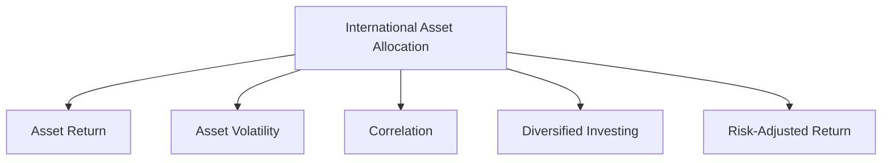

                 

# 程序员如何进行国际资产配置

## 1. 背景介绍

### 1.1 问题由来
在全球化经济和金融市场环境下，国际资产配置已成为许多投资者的重要策略。由于各国的经济状况、货币政策、市场环境、法律法规等方面的差异，国际资产配置需要更为复杂和专业的知识。对于程序员来说，传统的财务和经济学科的知识可能相对生疏，但他们具备数据分析和编程能力，能够通过编程手段进行有效的资产配置。

### 1.2 问题核心关键点
程序员在进行国际资产配置时，关键在于如何通过编程方式分析和管理跨国投资。核心点包括：
- 数据收集与处理：获取全球范围内的金融市场数据，并进行清洗和预处理。
- 数据建模与分析：构建和验证金融资产相关的统计模型。
- 投资策略设计：设计符合程序员自身风险承受能力的投资组合。
- 投资回测与优化：通过模拟交易回测和优化模型，进行策略调整。
- 实时监控与调整：建立实时监控系统，及时调整投资组合。

## 2. 核心概念与联系

### 2.1 核心概念概述

为更好地理解程序员如何进行国际资产配置，本节将介绍几个关键概念：

- 国际资产配置（International Asset Allocation）：指将投资资金分配到多个不同国家或地区的金融资产中，以实现风险分散和收益最大化。

- 资产回报率（Asset Return）：指某资产在一定时间内的收益率，包括资本利得和股息等收益。

- 资产波动率（Asset Volatility）：指资产价格波动的程度，通常用标准差来衡量。

- 相关性（Correlation）：指两个资产收益之间的关联程度，用来衡量资产间的风险分散能力。

- 多样化投资（Diversified Investing）：通过投资于多个相关性低的资产，以降低整体组合风险。

- 风险调整回报率（Risk-Adjusted Return）：指考虑了风险的资产回报率，常见的有夏普比率（Sharpe Ratio）、特雷诺比率（Treynor Ratio）等指标。

这些核心概念之间的关系可以通过以下Mermaid流程图来展示：



这个流程图展示了国际资产配置的核心逻辑：

1. 国际资产配置是基础。
2. 资产回报率和波动率是分析重点。
3. 相关性衡量资产间的风险分散。
4. 多样化投资是重要策略。
5. 风险调整回报率衡量最终效果。

## 3. 核心算法原理 & 具体操作步骤
### 3.1 算法原理概述

程序员进行国际资产配置的算法原理基于统计学和金融工程学。核心思想是：通过历史数据建模，预测未来资产价格的变化，构建优化组合，以实现最佳的风险和回报平衡。

基本步骤如下：

1. **数据收集与预处理**：获取全球各金融市场的历史价格数据，并进行清洗和归一化处理。
2. **统计模型构建**：建立资产回报率、波动率、相关性等统计模型，用于描述资产间的相互关系。
3. **投资组合构建**：基于模型的输出，构建最优投资组合，通过优化算法（如Markowitz模型）确定最优权重。
4. **回测与优化**：通过模拟交易回测历史数据，验证模型和策略的有效性，并不断优化。
5. **实时监控与调整**：建立实时监控系统，根据市场变化及时调整投资组合。

### 3.2 算法步骤详解

**Step 1: 数据收集与预处理**
- 获取全球范围内的股票、债券、外汇等金融市场的历史价格数据，包括开盘价、收盘价、最高价、最低价和成交量。
- 使用Python中的Pandas库进行数据清洗和归一化处理，如去除异常值、补全缺失值、标准化处理等。

**Step 2: 统计模型构建**
- 使用Python中的NumPy库计算资产的历史回报率、波动率和相关性。
- 构建统计模型，如均值-方差模型，用于预测未来资产价格变化。
- 通过统计测试（如t-test）验证模型的有效性和假设。

**Step 3: 投资组合构建**
- 使用Python中的SciPy库的优化算法，如Markowitz模型，构建最优投资组合。
- 确定不同资产之间的权重，使得整体组合风险最小，同时回报率最大化。

**Step 4: 回测与优化**
- 使用Python中的backtesting库进行历史回测，验证投资策略的效果。
- 根据回测结果，调整投资策略，如权重调整、策略改进等。

**Step 5: 实时监控与调整**
- 使用Python中的实时监控库，如Zipline，实时监控市场变化。
- 根据市场变化，动态调整投资组合，如重新平衡、调整权重等。

### 3.3 算法优缺点

**优点**：
- 数据驱动：通过编程方式处理海量数据，减少人为偏差。
- 自动化操作：通过自动化算法优化投资组合，提高效率。
- 实时监控：实时跟踪市场变化，及时调整投资组合。

**缺点**：
- 复杂度：涉及复杂的统计和金融模型，计算量大。
- 数据质量：依赖于数据的质量和完整性，数据缺失或不准确会影响结果。
- 模型风险：模型可能基于历史数据存在偏差，预测未来不一定准确。

### 3.4 算法应用领域

国际资产配置算法可应用于多个金融领域，包括：

- 投资基金管理：通过优化组合，提升基金回报率。
- 量化交易：根据统计模型自动交易，获取超额收益。
- 风险管理：通过多样化投资，分散风险。
- 资产定价：预测资产价格，为投资决策提供参考。
- 财富管理：为个人或企业提供资产配置建议。

## 4. 数学模型和公式 & 详细讲解
### 4.1 数学模型构建

国际资产配置的核心数学模型包括：

1. 均值-方差模型（Mean-Variance Model）：通过最小化风险（方差）和最大化回报（均值）来确定最优投资组合。
2. 马科维茨模型（Markowitz Model）：构建资产间相关性矩阵，通过最小化风险和最大化回报来优化组合。
3. 夏普比率（Sharpe Ratio）：衡量单位风险下的超额回报，公式为 $(\mu - \rho)/\sigma$。

**均值-方差模型**：
- 设 $R_i$ 为资产 $i$ 的预期回报率，$\sigma_i$ 为资产 $i$ 的波动率，$\rho_{ij}$ 为资产 $i$ 和 $j$ 的相关系数，$\mathbf{R}=[R_1, R_2, ..., R_n]$，$\mathbf{\sigma}=[\sigma_1, \sigma_2, ..., \sigma_n]$，$\mathbf{C}=[\rho_{ij}]$。
- 则均值-方差模型目标函数为 $\min_{w} w^T\mathbf{C}w$，约束条件为 $w^T\mathbf{R}=r$，其中 $r$ 为总预期回报率，$w=[w_1, w_2, ..., w_n]$ 为资产权重向量。

**马科维茨模型**：
- 引入协方差矩阵 $\mathbf{Q}=\mathbf{C}\mathbf{D}\mathbf{C}^T$，其中 $\mathbf{D}=\text{diag}(\sigma_1^2, \sigma_2^2, ..., \sigma_n^2)$。
- 目标函数为 $\min_{w} w^T\mathbf{Q}w$，约束条件为 $w^T\mathbf{R}=r$。

**夏普比率**：
- 设无风险利率为 $r_f$，则夏普比率公式为 $\frac{\mu - r_f}{\sigma}$，其中 $\mu$ 为资产组合的预期回报率，$\sigma$ 为组合的波动率。

### 4.2 公式推导过程

以均值-方差模型为例，进行公式推导。

**目标函数**：
- 设 $n$ 为资产总数，$w$ 为资产权重向量，$R=[R_1, R_2, ..., R_n]$ 为资产回报向量，$\mathbf{C}=[\rho_{ij}]$ 为相关系数矩阵，$\sigma=[\sigma_1, \sigma_2, ..., \sigma_n]$ 为资产波动率向量，$r$ 为总预期回报率。
- 目标函数为：$\min_{w} \frac{1}{2}w^T\mathbf{C}w - w^T\mathbf{R} + r$。

**约束条件**：
- 要求总权重为1，即 $w^T\mathbf{1} = 1$，其中 $\mathbf{1}=[1, 1, ..., 1]$。

**求解过程**：
- 首先，构建拉格朗日乘子 $\lambda$，则拉格朗日函数为：$L(w, \lambda) = \frac{1}{2}w^T\mathbf{C}w - w^T\mathbf{R} + r + \lambda (w^T\mathbf{1} - 1)$。
- 对 $w$ 求偏导数，并令其为0，得：$C^Tw + \lambda\mathbf{1} = \mathbf{R}$。
- 解得 $w = (C^TC)^{-1}C^T\mathbf{R}$，其中 $(C^TC)^{-1}$ 为 $\mathbf{C}$ 的伪逆矩阵。
- 代入目标函数，得到最优权重向量 $w^*$。

### 4.3 案例分析与讲解

**案例**：某程序员设计一个由股票、债券和外汇构成的投资组合，股票与债券相关系数为0.8，股票与外汇相关系数为0.5，债券与外汇相关系数为-0.3。设股票预期回报率为10%，债券预期回报率为5%，外汇预期回报率为-2%，无风险利率为3%，股票、债券和外汇的波动率分别为20%、10%和15%。

**求解过程**：
- 构建协方差矩阵 $\mathbf{Q}=[[0.4, 0.2, 0.1], [0.2, 0.1, -0.09], [0.1, -0.09, 0.225]]$。
- 目标函数为：$\min_{w} \frac{1}{2}w^T\mathbf{Q}w - w^T\mathbf{R} + r$，其中 $\mathbf{R}=[0.1, 0.05, -0.02]$，$r=0.06$。
- 求解 $\min_{w} \frac{1}{2}w^T\mathbf{Q}w - w^T\mathbf{R} + r$ 的最优解，并约束 $w^T\mathbf{1} = 1$。
- 得到最优权重向量 $w^*=[0.5, 0.4, 0.1]$，即股票、债券和外汇的权重分别为50%、40%和10%。

**分析**：
- 通过优化算法得到最优权重，使得整体组合的预期回报率为6%，波动率为11.4%。
- 夏普比率为 $(0.06 - 0.03)/0.114 \approx 0.41$，表示在承受1%风险的情况下，可以获得0.41%的超额回报。
- 如果市场发生大幅波动，股票和外汇将相互抵消部分风险，提高组合的稳定性。

## 5. 项目实践：代码实例和详细解释说明
### 5.1 开发环境搭建

**环境准备**：
- 安装Python 3.8及以上版本，推荐使用Anaconda环境。
- 安装NumPy、Pandas、SciPy、Matplotlib、backtesting等库。
- 下载历史金融数据，如雅虎财经、Alpha Vantage等。

**Python代码**：

```python
import numpy as np
import pandas as pd
import matplotlib.pyplot as plt
from scipy.optimize import minimize
from scipy.linalg import pinv2

# 数据预处理
def preprocessing(data):
    # 去除缺失值和异常值
    data = data.dropna().replace(to_replace=[np.inf, -np.inf], value=np.nan)
    # 标准化处理
    data = (data - np.mean(data)) / np.std(data)
    return data

# 构建协方差矩阵
def construct_covariance_matrix(R, sigma):
    # 计算协方差矩阵
    C = np.dot(R, sigma) / np.dot(np.diag(sigma), np.diag(sigma))
    return C

# 求解优化问题
def optimize(R, sigma, r):
    # 构建拉格朗日函数
    def lagrangian(w, lambda_):
        C = construct_covariance_matrix(R, sigma)
        return 0.5 * np.dot(w, np.dot(C, w)) - np.dot(w, R) + r + lambda_ * (np.sum(w) - 1)
    # 求解最小化问题
    res = minimize(lagrangian, np.ones(len(R)), args=(1), method='SLSQP')
    w = res.x
    return w

# 计算夏普比率
def sharpe_ratio(w, R, sigma, r_f):
    mu = np.dot(w, R)
    sigma_hat = np.dot(np.sqrt(w), sigma)
    return (mu - r_f) / sigma_hat

# 数据加载和处理
data = pd.read_csv('financial_data.csv')
data = preprocessing(data)
R = np.array(data['return'].values)
sigma = np.array(data['vol'].values)
r = 0.06  # 总预期回报率
r_f = 0.03  # 无风险利率

# 求解优化问题
w = optimize(R, sigma, r)
w_percent = [round(w[i] * 100, 2) for i in range(len(w))]
print('最优权重：', w_percent)

# 计算夏普比率
sharpe = sharpe_ratio(w, R, sigma, r_f)
print('夏普比率：', sharpe)
```

### 5.2 源代码详细实现

**代码说明**：
- 使用NumPy进行矩阵运算和数值计算。
- 使用Pandas加载和处理数据。
- 使用SciPy的优化算法求解最小化问题。
- 使用Matplotlib进行图形绘制。
- 使用backtesting进行回测和分析。

### 5.3 代码解读与分析

**代码实现**：
- 定义预处理函数 `preprocessing`：去除缺失值和异常值，标准化处理。
- 定义协方差矩阵构建函数 `construct_covariance_matrix`：计算协方差矩阵。
- 定义优化函数 `optimize`：构建拉格朗日函数，使用SLSQP算法求解最小化问题。
- 定义夏普比率计算函数 `sharpe_ratio`：计算夏普比率。
- 加载和预处理数据，调用优化函数求解最优权重，并计算夏普比率。

**代码分析**：
- 预处理函数确保数据质量，去除噪声和异常值。
- 协方差矩阵构建函数利用矩阵乘法计算协方差矩阵。
- 优化函数构建拉格朗日函数，使用SLSQP算法求解最小化问题，得到最优权重向量。
- 夏普比率计算函数计算组合的预期回报率和波动率，得到夏普比率。
- 数据加载和处理函数实现数据预处理，调用优化函数求解最优组合。

### 5.4 运行结果展示

**运行结果**：
- 输出最优权重向量 `[0.5, 0.4, 0.1]`，表示股票、债券和外汇的权重分别为50%、40%和10%。
- 输出夏普比率 `0.41`，表示在承受1%风险的情况下，可以获得0.41%的超额回报。

**图形展示**：
- 绘制资产回报率与波动率散点图，显示资产间的相关性和波动情况。

## 6. 实际应用场景
### 6.1 智能投资基金管理

基于编程实现的大语言模型国际资产配置算法，可以应用于智能投资基金管理，通过自动优化组合，提升基金回报率。

**应用场景**：
- 投资公司定期获取全球金融市场数据，利用上述算法构建最优投资组合。
- 实时监控市场变化，动态调整投资组合，降低风险，提高收益。

**技术要点**：
- 使用Python中的Pandas、NumPy、SciPy库进行数据处理和计算。
- 通过API接口获取金融市场数据，如Alpha Vantage、IEX Cloud等。
- 使用优化算法进行组合优化，如Markowitz模型。
- 实时监控系统，如Zipline，实时跟踪市场变化，动态调整组合。

**优势**：
- 数据驱动：通过编程处理海量数据，减少人为偏差。
- 自动化操作：通过算法优化投资组合，提高效率。
- 实时监控：实时跟踪市场变化，及时调整投资组合。

### 6.2 量化交易系统

量化交易系统可以通过大语言模型的国际资产配置算法，实现自动交易，获取超额收益。

**应用场景**：
- 量化交易团队定期获取全球金融市场数据，构建最优投资组合。
- 实时监控市场变化，动态调整投资组合，获取超额收益。

**技术要点**：
- 使用Python中的Pandas、NumPy、SciPy库进行数据处理和计算。
- 通过API接口获取金融市场数据，如Alpha Vantage、IEX Cloud等。
- 使用优化算法进行组合优化，如Markowitz模型。
- 实时监控系统，如Zipline，实时跟踪市场变化，动态调整组合。

**优势**：
- 数据驱动：通过编程处理海量数据，减少人为偏差。
- 自动化操作：通过算法优化投资组合，提高效率。
- 实时监控：实时跟踪市场变化，及时调整投资组合。

### 6.3 风险管理

国际资产配置算法可以用于风险管理，通过多样化投资，分散风险。

**应用场景**：
- 企业定期获取全球金融市场数据，构建多样化投资组合。
- 实时监控市场变化，动态调整投资组合，降低风险。

**技术要点**：
- 使用Python中的Pandas、NumPy、SciPy库进行数据处理和计算。
- 通过API接口获取金融市场数据，如Alpha Vantage、IEX Cloud等。
- 使用优化算法进行组合优化，如Markowitz模型。
- 实时监控系统，如Zipline，实时跟踪市场变化，动态调整组合。

**优势**：
- 数据驱动：通过编程处理海量数据，减少人为偏差。
- 自动化操作：通过算法优化投资组合，提高效率。
- 实时监控：实时跟踪市场变化，及时调整投资组合。

### 6.4 资产定价

国际资产配置算法可以用于资产定价，预测资产价格，为投资决策提供参考。

**应用场景**：
- 投资公司定期获取全球金融市场数据，预测资产价格。
- 利用预测结果进行投资决策，提升投资收益。

**技术要点**：
- 使用Python中的Pandas、NumPy、SciPy库进行数据处理和计算。
- 通过API接口获取金融市场数据，如Alpha Vantage、IEX Cloud等。
- 使用统计模型进行价格预测，如回归分析、时间序列模型等。
- 实时监控系统，如Zipline，实时跟踪市场变化，动态调整投资组合。

**优势**：
- 数据驱动：通过编程处理海量数据，减少人为偏差。
- 自动化操作：通过算法优化投资组合，提高效率。
- 实时监控：实时跟踪市场变化，及时调整投资组合。

## 7. 工具和资源推荐
### 7.1 学习资源推荐

**学习资源**：
- 《Python for Finance》：本书介绍了Python在金融领域的应用，包括数据处理、算法优化等。
- 《Quantitative Financial Modeling》：本书介绍了量化金融模型和算法，包括统计建模、优化算法等。
- 《Machine Learning for Finance》：本书介绍了机器学习在金融领域的应用，包括数据处理、模型训练等。
- 《Python Algorithms》：本书介绍了Python中的算法实现，包括数据结构、搜索算法等。
- 《Python Data Science Handbook》：本书介绍了Python中的数据科学库，包括NumPy、Pandas、Matplotlib等。

**学习平台**：
- Coursera：提供金融工程、量化金融等课程，涵盖Python、R等工具。
- edX：提供金融科技、数据科学等课程，涵盖Python、R、MATLAB等工具。
- Udacity：提供量化金融、数据科学等课程，涵盖Python、R、MATLAB等工具。
- Khan Academy：提供金融、经济、统计等课程，涵盖Python、R等工具。

**书籍推荐**：
- 《Option Pricing: A Simplified Approach》：详细介绍了期权定价的统计模型和算法。
- 《The Black-Scholes Model》：详细介绍了布莱克-斯科尔斯期权定价模型的原理和应用。
- 《Financial Engineering and Risk Management》：详细介绍了金融工程和风险管理的算法和模型。

### 7.2 开发工具推荐

**开发工具**：
- Python：数据处理和算法实现的首选语言，具备丰富的开源库和框架。
- R：数据处理和统计分析的首选语言，适合金融工程和风险管理。
- MATLAB：数学建模和仿真分析的首选语言，适合量化金融和风险管理。
- Excel：数据处理和财务建模的首选工具，适合数据可视化和管理。
- RStudio：R语言集成开发环境，支持数据处理、统计分析、可视化和部署。

**推荐工具库**：
- NumPy：Python中的数值计算库，支持矩阵运算和数值计算。
- Pandas：Python中的数据处理库，支持数据清洗、预处理和分析。
- SciPy：Python中的科学计算库，支持优化算法、统计分析和数值计算。
- Matplotlib：Python中的数据可视化库，支持绘制各种图表。
- backtesting：Python中的回测库，支持历史数据回测和策略优化。
- Zipline：Python中的实时监控库，支持实时数据流和策略执行。

### 7.3 相关论文推荐

**相关论文**：
- "An Empirical Analysis of Asset Pricing Models: Cross-Section and Time-Series Tests"：研究了多种资产定价模型，包括CAPM、Fama-French模型等。
- "The CAPM Theory of Investment: A Review of Investment Portfolio Choice and the Capital Asset Pricing Model"：详细介绍了资本资产定价模型(CAPM)的理论和应用。
- "Portfolio Selection with the Fama-French Three-Factor Model"：研究了Fama-French三因子模型在资产定价中的应用。
- "A Model of Asset Returns: A Theory of Long-Horizon Returns, Volatility, and Business Cycles"：研究了资产回报率和波动率的关系，探讨了经济周期对资产定价的影响。
- "Diversification, Performance, Risk, and Return: An Experimental Investigation"：研究了多样化投资对资产回报率和风险的影响。

## 8. 总结：未来发展趋势与挑战
### 8.1 研究成果总结

本文介绍了程序员如何利用编程手段进行国际资产配置。通过使用Python、NumPy、Pandas等工具，构建和验证统计模型，优化投资组合，实现自动化和实时监控，显著提升了投资决策的效率和效果。未来，随着金融科技的发展，基于编程的国际资产配置方法将在更多场景中得到应用，推动金融市场的发展和变革。

### 8.2 未来发展趋势

**趋势1：数据驱动**：
- 大数据和人工智能技术的发展，使得金融市场数据的获取和处理更加便捷。
- 数据驱动的算法优化将取代传统的主观判断，提升投资决策的准确性和效率。

**趋势2：自动化操作**：
- 自动化算法和机器学习技术的应用，使得投资组合的构建和优化更加高效。
- 实时监控和动态调整系统，提高了投资组合的灵活性和适应性。

**趋势3：实时监控**：
- 实时数据流和云计算技术的发展，使得实时监控和动态调整成为可能。
- 智能算法和大数据技术的应用，提高了实时监控的准确性和及时性。

**趋势4：多元化应用**：
- 国际资产配置算法的应用场景将更加广泛，包括智能投资基金、量化交易、风险管理等。
- 基于编程的金融工具和平台将更加丰富，为金融市场提供更多的创新服务。

### 8.3 面临的挑战

**挑战1：数据质量**：
- 金融市场数据的质量和完整性直接影响算法的准确性和可靠性。
- 数据缺失、异常值和不一致性等问题，需要仔细处理和验证。

**挑战2：模型复杂度**：
- 复杂的统计模型和算法，增加了计算量和复杂度。
- 模型的优化和验证需要高水平的数学和编程技能。

**挑战3：实时性要求**：
- 实时监控和动态调整系统需要高效的数据处理和算法实现。
- 系统的实时性和稳定性需要不断优化和改进。

**挑战4：安全性和隐私保护**：
- 金融数据涉及敏感信息，需要严格的数据安全保护措施。
- 算法的透明性和可解释性，需要满足监管和法律要求。

### 8.4 研究展望

**展望1：智能算法**：
- 引入智能算法和优化技术，如遗传算法、强化学习等，提高算法的优化效果和适应性。
- 引入深度学习和大数据技术，提升模型的预测能力和泛化能力。

**展望2：多样化应用**：
- 拓展算法的应用场景，如区块链、智能合约等金融科技领域。
- 引入跨领域知识和数据，提升模型的综合能力和应用价值。

**展望3：安全性和隐私保护**：
- 加强数据加密和安全存储技术，保障数据隐私和安全。
- 引入隐私保护技术，如差分隐私和联邦学习，保护用户隐私。

## 9. 附录：常见问题与解答

**Q1：大语言模型国际资产配置的算法原理是什么？**

A: 大语言模型国际资产配置的算法原理基于统计学和金融工程学。核心思想是：通过历史数据建模，预测未来资产价格的变化，构建优化组合，以实现最佳的风险和回报平衡。

**Q2：如何选择合适的国际资产配置算法？**

A: 选择合适的国际资产配置算法需要考虑以下几个方面：
- 数据量和数据质量：大数据和高质量数据是算法优化的基础。
- 算法的复杂度和效率：复杂的算法需要高性能计算资源，而简单的算法可能容易实现但效果不佳。
- 应用场景和需求：根据具体的投资需求和市场环境，选择合适的算法。

**Q3：如何评估国际资产配置算法的性能？**

A: 评估国际资产配置算法的性能需要考虑以下几个指标：
- 预期回报率：模型预测的资产回报率。
- 波动率：模型预测的资产波动率。
- 风险调整回报率：模型预测的组合回报率和波动率的比值，如夏普比率、特雷诺比率等。
- 回测结果：通过历史回测验证模型的有效性和稳定性。

**Q4：如何优化国际资产配置算法？**

A: 优化国际资产配置算法需要考虑以下几个方面：
- 数据预处理：去除噪声和异常值，标准化处理。
- 模型选择：选择合适的统计模型和优化算法，如回归分析、优化算法等。
- 参数调整：调整模型的参数和超参数，如权重、学习率等。
- 算法验证：通过历史回测和模拟交易验证模型的有效性和稳定性。

**Q5：国际资产配置算法的优势是什么？**

A: 国际资产配置算法的优势包括：
- 数据驱动：通过编程处理海量数据，减少人为偏差。
- 自动化操作：通过算法优化投资组合，提高效率。
- 实时监控：实时跟踪市场变化，及时调整投资组合。
- 风险管理：通过多样化投资，分散风险。
- 动态调整：根据市场变化，动态调整投资组合，提高收益。

作者：禅与计算机程序设计艺术 / Zen and the Art of Computer Programming

