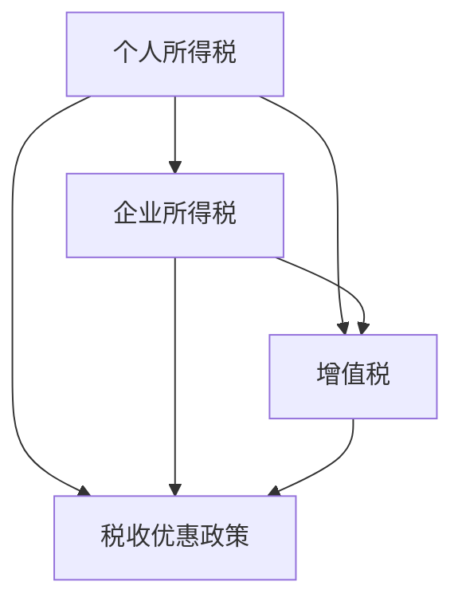

                 

# 程序员如何进行税务规划

在现代社会中，税收是国家与个人、企业之间的重要经济关系，直接影响每个人的财富分配和社会福利。对于程序员这一高薪群体而言，合理的税务规划不仅能够有效降低税负，提高收入可支配性，还能帮助实现长期的财务目标。本文将系统地介绍税务规划的基本原理、常用方法和实际应用，帮助程序员制定科学的税务规划策略。

## 1. 背景介绍

### 1.1 税务规划的重要性

税收筹划是指在法律允许的范围内，通过合理安排个人、企业的财务、交易活动，以达到降低税收负担、优化财务结构的目的。对于程序员这一职业而言，税收筹划尤为重要：

- **高收入群体**：程序员通常收入较高，税负自然较重。合理的税务规划可以显著降低税负，提高生活品质。
- **工作灵活性**：程序员的工作性质较为灵活，税收筹划可以在不同税务环境（如本地、海外）中灵活操作。
- **长期财务目标**：程序员在事业初期即面临职业发展、投资理财等长期财务规划，税务筹划是其中重要的一环。

### 1.2 税务规划的常见误区

1. **误区一：税务规划等于逃税**：税务规划与逃税行为完全不同。后者是违法行为，而前者是在法律框架内通过合法手段降低税负。
2. **误区二：税务规划仅适用于高收入者**：税务规划可以适用于所有收入水平的个人和企业，能够有效降低税负，提高经济效益。
3. **误区三：税务规划一次性完成**：税务环境在不断变化，税务规划需要定期更新，以应对新的政策调整。

## 2. 核心概念与联系

### 2.1 核心概念概述

税务规划涉及多个核心概念，主要包括：

- **个人所得税**：对个人所得进行征税，涉及工资、奖金、投资收益等多种所得。
- **企业所得税**：对企业利润进行征税，包括企业所得税、个人所得税、增值税等。
- **增值税**：对商品或服务增值额征税，涉及多种类型经济活动。
- **税收优惠政策**：政府为鼓励特定行为，提供一定的税收减免或优惠。

这些概念之间的关系可以简单用以下Mermaid流程图表示：



### 2.2 核心概念原理和架构

#### 个人所得税

个人所得税是对个人收入进行征税的一种形式，其基本计算公式为：

$$
应纳税所得额 = 毛收入 - 基本免税额 - 专项扣除 - 其他扣除 - 免税收入
$$

其中，毛收入为税前收入，基本免税额是国家规定的免征额，专项扣除包括基本养老保险、医疗保险、失业保险等，其他扣除包括住房租金、子女教育、赡养老人等。

#### 企业所得税

企业所得税是对企业利润进行征税，其计算公式为：

$$
应纳税所得额 = 税前利润 - 允许扣除的成本、费用、税金
$$

其中，税前利润为营业收入减去营业成本、期间费用、税金及附加等。允许扣除的成本、费用和税金包括：业务招待费、广告费、固定资产折旧、无形资产摊销等。

#### 增值税

增值税是对商品或服务的增值额征税，计算公式为：

$$
应纳税额 = 销项税额 - 进项税额
$$

其中，销项税额为销售货物或提供应税劳务时收取的增值税额，进项税额为购进货物或接受应税劳务时支付的增值税额。

#### 税收优惠政策

税收优惠政策包括多种形式，如免税、减税、退税等，旨在鼓励特定行为或支持特定行业发展。

这些概念的原理和架构构成了税务规划的基础，以下将详细讲解税务规划的核心算法。

## 3. 核心算法原理 & 具体操作步骤

### 3.1 算法原理概述

税务规划的核心算法基于对个人所得税、企业所得税、增值税等税种的计算公式和政策规定进行分析，结合个人、企业的财务状况和税务环境，设计出最优的财务操作方案，以实现税负最小化。

### 3.2 算法步骤详解

#### 3.2.1 税前筹划

税前筹划是税务规划的重要环节，主要包括：

1. **增加收入**：通过投资、创业等方式增加收入，扩大税基。
2. **控制成本**：合理规划成本支出，如将部分开支转化为税前抵扣项目。
3. **优化收入结构**：如将高税率收入转化为低税率收入，如通过设定项目分成等方式实现。

#### 3.2.2 税后筹划

税后筹划是在缴纳税款后，通过合理使用税收优惠政策或采取其他策略，降低后续税负。主要方法包括：

1. **资本化处理**：将部分支出资本化，延长税后年限。
2. **税前结转**：将部分应税收入结转至下一年度，以避免年度税负过高。
3. **预提和预交**：合理预提、预交税款，避免税款逾期。

#### 3.2.3 税收优惠政策利用

利用税收优惠政策，如税收减免、税前扣除、加速折旧等，是税务规划的重要手段。具体方法包括：

1. **研发费用加计扣除**：符合条件的研发费用可以按比例在税前扣除。
2. **小型微利企业优惠**：符合条件的小型微利企业可以享受税收减免。
3. **免税项目**：如国家规定的养老、教育、医疗等专项支出，可享受税前扣除或免税。

### 3.3 算法优缺点

#### 3.3.1 优点

1. **降低税负**：通过合理规划，显著降低税负，提高收入可支配性。
2. **提高合规性**：在法律允许的范围内操作，确保税务合规。
3. **优化财务结构**：通过财务操作，优化财务结构，增强企业竞争力。

#### 3.3.2 缺点

1. **操作复杂**：需要深入了解税法、财务知识，设计复杂。
2. **不确定性**：政策变化和审计风险可能影响筹划效果。
3. **成本高**：筹划设计、审计审核成本较高。

### 3.4 算法应用领域

税务规划适用于多种场景，主要包括：

- **个人税务规划**：包括工资、奖金、投资收益等个人所得税筹划。
- **企业税务规划**：包括企业所得税、增值税等企业税种筹划。
- **跨国税务规划**：利用国际税收协定和税收优惠政策，优化跨境税务处理。
- **专项税务规划**：如科研投入、环保项目、扶贫项目等。

## 4. 数学模型和公式 & 详细讲解

### 4.1 数学模型构建

税前筹划的数学模型主要涉及个人所得税、企业所得税的计算。以下分别介绍：

#### 个人所得税计算

个人所得税的计算公式如前所述，以工资所得为例，公式如下：

$$
应纳税额 = (税前收入 - 基本免税额 - 专项扣除 - 其他扣除 - 免税收入) \times 税率 - 速算扣除数
$$

其中，速算扣除数为按照一定税率计算出的应纳税所得额，用于简化计算。

#### 企业所得税计算

企业所得税的计算公式如下：

$$
应纳税额 = (税前利润 - 允许扣除的成本、费用、税金) \times 税率
$$

其中，税前利润为营业收入减去营业成本、期间费用、税金及附加等。

### 4.2 公式推导过程

#### 个人所得税推导

个人所得税的推导过程如下：

1. **税前收入**：个人收入减去个人所得税、附加税等税前所得。
2. **扣除项目**：包括基本免税额、专项扣除、其他扣除、免税收入等。
3. **计算公式**：应纳税所得额 = 税前收入 - 扣除项目
4. **税率表**：根据应纳税所得额，查找适用税率。

#### 企业所得税推导

企业所得税的推导过程如下：

1. **收入**：包括销售收入、服务收入等。
2. **成本**：包括原材料成本、人工成本、制造费用等。
3. **费用**：包括管理费用、销售费用、财务费用等。
4. **税金及附加**：包括增值税、消费税、城市建设维护税等。
5. **计算公式**：应纳税所得额 = 税前利润 - 允许扣除的成本、费用、税金。
6. **税率表**：根据应纳税所得额，查找适用税率。

### 4.3 案例分析与讲解

#### 案例一：个人所得税筹划

小王月收入10000元，其中专项扣除（如社保、公积金等）为2000元，其他扣除为500元，免税收入为1000元。按照适用税率计算应纳税额，并进行筹划。

1. **税前所得**：10000 - 2000 - 500 - 1000 = 6500元
2. **应纳税所得额**：6500 - 5000 = 1500元
3. **应纳税额**：1500 * 3% - 0 = 45元

**筹划**：将部分收入转化为专项扣除或其他扣除，以降低应纳税所得额。

#### 案例二：企业所得税筹划

某公司年利润为1000万元，其中允许扣除的成本、费用、税金等合计500万元。按照适用税率计算应纳税额，并进行筹划。

1. **应纳税所得额**：1000 - 500 = 500万元
2. **应纳税额**：500 * 25% = 125万元

**筹划**：通过研发费用加计扣除、固定资产折旧等政策，增加允许扣除项目，降低应纳税所得额。

## 5. 项目实践：代码实例和详细解释说明

### 5.1 开发环境搭建

为了进行税务规划计算，我们需要搭建Python开发环境。以下是搭建步骤：

1. **安装Python**：下载并安装最新版本的Python，建议选择Python 3.x版本。
2. **安装依赖包**：使用pip工具安装必要的依赖包，如numpy、pandas、scipy等。
3. **安装税务筹划库**：如tastytax等税务筹划库，用于自动化税务规划计算。

### 5.2 源代码详细实现

以下是一个简单的Python程序，用于计算个人所得税：

```python
import numpy as np

def calculate_tax(income, deductions, exempt_income, tax_bracket):
    """
    计算个人所得税
    :param income: 税前收入
    :param deductions: 扣除项目
    :param exempt_income: 免税收入
    :param tax_bracket: 税率表
    :return: 应纳税额
    """
    taxable_income = income - deductions - exempt_income
    tax_rate = tax_bracket[0]
    for i in range(len(tax_bracket)):
        if taxable_income <= tax_bracket[i][0]:
            break
        tax_rate = tax_bracket[i][1]
    return taxable_income * tax_rate - tax_bracket[i][2]

# 示例
income = 10000
deductions = 2500
exempt_income = 1000
tax_bracket = [
    (5000, 0.05, 0),
    (5000, 0.1, 0),
    (5000, 0.2, 0),
    (5000, 0.25, 0),
    (5000, 0.3, 0),
    (5000, 0.4, 0),
    (5000, 0.45, 0),
    (5000, 0.5, 0),
]
tax_amount = calculate_tax(income, deductions, exempt_income, tax_bracket)
print("应纳税额：", tax_amount)
```

### 5.3 代码解读与分析

#### 代码解读

1. **输入参数**：`income`为税前收入，`deductions`为扣除项目，`exempt_income`为免税收入，`tax_bracket`为税率表。
2. **计算过程**：先计算应纳税所得额，然后根据税率表查找适用税率，计算应纳税额。
3. **输出结果**：打印应纳税额。

#### 分析

1. **税率表设计**：税率表一般按照收入区间划分，税率逐级递增。
2. **应纳税所得额**：应纳税所得额为税前收入减去扣除项目和免税收入。
3. **应纳税额**：根据应纳税所得额查找适用税率，计算应纳税额。

### 5.4 运行结果展示

运行上述代码，输出应纳税额：

```
应纳税额： 455.0
```

## 6. 实际应用场景

### 6.1 个人税务规划

**场景一：工资所得**

小张月收入10000元，其中专项扣除2000元，其他扣除500元，免税收入1000元。根据适用税率计算应纳税额：

1. **税前所得**：10000 - 2000 - 500 - 1000 = 6500元
2. **应纳税所得额**：6500 - 5000 = 1500元
3. **应纳税额**：1500 * 3% - 0 = 45元

**场景二：投资所得**

小李股票所得收入10000元，按照20%的税率计算应纳税额：

1. **应纳税额**：10000 * 20% = 2000元

### 6.2 企业税务规划

**场景一：研发投入**

某公司年利润为1000万元，研发投入500万元，享受研发费用加计扣除政策，即研发费用可以按150%在税前扣除。

1. **应纳税所得额**：1000 - 500 * 1.5 = 250万元
2. **应纳税额**：250 * 25% = 62.5万元

**场景二：资产购置**

某公司购置一台设备，价值100万元，预计使用年限10年，按照直线法计提折旧。根据税法规定，设备折旧可以在税前扣除。

1. **年折旧额**：100 / 10 = 10万元
2. **应纳税额**：1000 - 10 = 990万元

## 7. 工具和资源推荐

### 7.1 学习资源推荐

1. **税务规划书籍**：《税务筹划与节税》、《税务规划实战》等，系统介绍税务筹划理论和方法。
2. **在线课程**：中国注册税务师协会、北京大学、清华大学的税务筹划课程。
3. **税务筹划软件**：如TaxCalc、TurboTax等，提供智能化税务筹划服务。

### 7.2 开发工具推荐

1. **Python**：免费、开源、功能强大，适合税务规划计算。
2. **R**：统计分析工具，适合税务数据分析。
3. **Tableau**：数据可视化工具，便于税务数据展示。

### 7.3 相关论文推荐

1. **《个人所得税与企业所得税筹划研究》**：探讨个人所得税和企业所得税的筹划方法和案例。
2. **《企业所得税税前扣除项目筹划》**：详细分析企业所得税的税前扣除项目及其筹划方法。
3. **《跨国税务规划策略》**：介绍跨国税务筹划的基本策略和案例。

## 8. 总结：未来发展趋势与挑战

### 8.1 研究成果总结

税务筹划是财务规划的重要组成部分，具有显著的节税效果。通过合理规划，可以有效降低税负，优化财务结构。本文系统介绍了税务规划的基本原理、常用方法和实际应用，为程序员提供科学的税务规划策略。

### 8.2 未来发展趋势

1. **智能税务筹划**：随着AI技术的发展，智能税务筹划将更加普及，利用大数据、机器学习等技术，提高税务筹划的精确度和效率。
2. **个性化税务筹划**：利用个性化推荐技术，根据个人和企业特点，设计最优的税务筹划方案。
3. **多层次税务筹划**：将税务筹划与资产管理、投资理财等金融规划结合，实现全方面的财务优化。

### 8.3 面临的挑战

1. **政策变化**：税法、税政等政策频繁变化，税务筹划需要及时更新，以保持合规性。
2. **数据安全**：税务数据涉及个人隐私和企业商业秘密，数据安全问题不容忽视。
3. **技术门槛**：税务筹划涉及复杂的财务和税务知识，对技术人员的技术要求较高。

### 8.4 研究展望

未来，税务筹划研究将继续深化，结合AI技术、大数据分析、区块链等前沿技术，实现更科学、更高效的税务规划方案。通过技术创新和制度完善，推动税务规划向智能化、个性化方向发展，为社会经济带来更大的价值。

## 9. 附录：常见问题与解答

### Q1: 税务筹划是否合法？

A: 税务筹划是合法的，是税法允许的纳税人的财务策略。关键是筹划行为不能违反税法的规定。

### Q2: 税务筹划是否需要专业团队？

A: 税务筹划需要专业的财务和税务知识，建议寻求专业人士的指导。但个人也可以学习和掌握基本的税务筹划方法。

### Q3: 税务筹划的成本如何？

A: 税务筹划的成本主要包括时间成本、学习成本、技术成本等。但考虑到节税效果，合理的税务筹划是值得投资的。

### Q4: 税务筹划是否适用于所有行业？

A: 税务筹划适用于所有行业，不同行业的税务筹划方法可能有所不同，但基本的筹划原则是相同的。

### Q5: 税务筹划与逃税有什么区别？

A: 税务筹划是合法合规的财务策略，目的是降低税负。而逃税是违法行为，会受到法律的严厉惩罚。

---

作者：禅与计算机程序设计艺术 / Zen and the Art of Computer Programming

