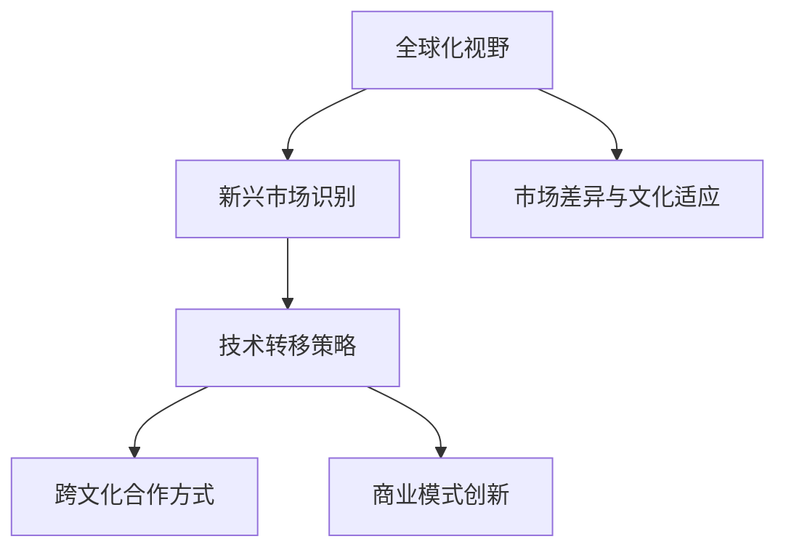

                 

# 程序员的全球化视野：新兴市场的创业机遇

> 关键词：全球化视野, 创业机遇, 新兴市场, 技术转移, 跨文化合作, 商业模式创新, 市场差异, 文化适应, 数字化转型

## 1. 背景介绍

### 1.1 问题由来
随着全球化的深入发展，国际间的交流合作日益频繁，技术创新和市场机遇在全球范围内的分布愈发均匀。对于程序员而言，了解全球化视野下的新兴市场创业机遇，有助于开拓国际市场，提升技术影响力和商业价值。特别是在当前“一带一路”倡议和数字丝绸之路的推动下，新兴市场的数字化转型需求激增，程序员需要把握机遇，推动技术创新和商业模式升级。

### 1.2 问题核心关键点
本文聚焦于程序员在具备全球化视野的基础上，如何识别新兴市场的创业机遇。核心内容包括：
1. **新兴市场的识别**：通过对全球市场的研究，确定新兴市场；
2. **技术转移的策略**：如何有效地将技术转移到新兴市场；
3. **跨文化合作的方式**：如何克服跨文化合作中的障碍；
4. **商业模式创新**：在新兴市场构建符合当地需求的商业模式；
5. **市场差异与文化适应**：理解和应对不同市场之间的差异。

## 2. 核心概念与联系

### 2.1 核心概念概述

为更好地理解程序员在新兴市场创业机遇中的角色，本节将介绍几个密切相关的核心概念：

- **全球化视野**：指具备国际视野，能够洞察全球市场趋势，把握技术发展的全球趋势。
- **新兴市场**：指经济发展速度快，市场潜力大，但技术发展水平相对落后的国家和地区。
- **技术转移**：指将发达地区的技术成果应用于落后地区的过程。
- **跨文化合作**：指不同文化背景下的技术团队或企业间的合作，需要考虑文化差异、沟通方式、项目管理等多方面的问题。
- **商业模式创新**：指在新兴市场根据市场需求和环境特点，构建符合当地特征的商业模式。

这些核心概念之间的逻辑关系可以通过以下Mermaid流程图来展示：



这个流程图展示了大程序员在具备全球化视野的基础上，如何通过新兴市场识别、技术转移、跨文化合作、商业模式创新和市场差异与文化适应，实现全球化视野下的创业机遇。

## 3. 核心算法原理 & 具体操作步骤

### 3.1 算法原理概述

本文的核心算法原理基于以下逻辑：
1. **新兴市场识别**：通过宏观经济指标、市场规模、技术发展水平等因素，识别出具有发展潜力的新兴市场。
2. **技术转移策略**：结合本地市场特点，制定适合的技术转移策略，包括技术适配、人才培养、知识产权保护等。
3. **跨文化合作方式**：通过建立共同目标、文化交流、团队构建等方式，克服跨文化合作的障碍。
4. **商业模式创新**：结合本地市场需求和环境特点，创新构建商业模型，如SaaS、B2B、B2C等。
5. **市场差异与文化适应**：了解和尊重本地市场差异，进行文化适应，包括产品本地化、市场推广、政策合规等。

### 3.2 算法步骤详解

**Step 1: 新兴市场识别**
- 分析全球经济发展数据，识别出经济增长速度快、市场潜力大的新兴市场。
- 研究新兴市场的技术发展现状，了解技术需求和应用场景。
- 结合本地社会文化背景，分析市场潜力和风险。

**Step 2: 技术转移策略制定**
- 结合本地市场特点，调整预训练模型和算法，适配本地数据和应用场景。
- 设计培训计划，提升本地技术人才的技术水平。
- 确保知识产权保护，避免技术泄露和侵权风险。

**Step 3: 跨文化合作方式构建**
- 设立跨文化沟通机制，建立共同目标和信任基础。
- 培训本地员工，提升团队合作和文化适应能力。
- 采用项目管理工具，确保项目进度和质量控制。

**Step 4: 商业模式创新**
- 根据本地市场需求，创新设计符合本地特点的商业模式。
- 利用本地资源和优势，构建竞争优势。
- 开发本地化的产品和应用，提升用户体验。

**Step 5: 市场差异与文化适应**
- 了解本地市场规则和法规，确保合规运营。
- 进行产品本地化调整，适应本地市场审美和文化习惯。
- 开展本地市场推广活动，提高品牌知名度。

### 3.3 算法优缺点

全球化视野下的新兴市场创业机遇，具有以下优点：
1. **市场潜力大**：新兴市场在经济增长、市场需求等方面具有巨大潜力，投资回报率高。
2. **技术需求旺盛**：新兴市场对新技术的引入和应用需求强烈，有利于技术创新和传播。
3. **成本优势**：本地化生产和运营，可以大幅降低成本，提升盈利能力。

同时，也存在一定的局限性：
1. **市场风险高**：新兴市场的政治、经济环境不稳定，存在较高的市场风险。
2. **文化差异复杂**：跨文化合作中，需要应对文化差异和沟通障碍，管理难度大。
3. **资源限制**：本地资源有限，技术和人才短缺，需要额外的投入和支持。
4. **政策环境复杂**：不同国家和地区政策法规差异大，需深入了解和应对。

尽管存在这些局限性，但整体而言，全球化视野下的新兴市场创业机遇是大有可为的，程序员可以从中发掘巨大的商业潜力和技术创新机会。

### 3.4 算法应用领域

全球化视野下的新兴市场创业机遇，在多个领域都有广泛的应用，例如：

1. **IT与互联网**：新兴市场对互联网应用、软件和服务的需求激增，程序员可以通过开发本地化的SaaS和B2B应用，满足市场需求。
2. **金融科技**：金融科技在新兴市场的发展潜力巨大，程序员可以设计创新的金融产品和服务，推动金融数字化转型。
3. **电子商务**：电子商务在新兴市场的渗透率快速提升，程序员可以开发本地化的电商平台和支付系统，促进电商发展。
4. **健康医疗**：新兴市场的健康医疗需求迫切，程序员可以开发医疗信息化和远程诊疗系统，提升医疗服务水平。
5. **教育培训**：教育培训在新兴市场的数字化转型中需求大，程序员可以开发在线教育平台和智能培训工具，推动教育公平。

## 4. 数学模型和公式 & 详细讲解 & 举例说明（备注：数学公式请使用latex格式，latex嵌入文中独立段落使用 $$，段落内使用 $)
### 4.1 数学模型构建

本文将通过构建简单的数学模型来解释全球化视野下的新兴市场创业机遇。假设市场潜力为 $P$，技术需求为 $T$，文化适应性为 $C$，商业模式创新能力为 $I$。模型的总体评分 $S$ 可以通过以下公式计算：

$$
S = \alpha P + \beta T + \gamma C + \delta I
$$

其中 $\alpha, \beta, \gamma, \delta$ 为权重系数，代表各因素对整体创业机会的影响。

### 4.2 公式推导过程

设 $P$ 为市场潜力，通过 GDP 增长率、人口增长率、市场规模等因素计算得出；$T$ 为技术需求，通过技术应用普及率、技术创新指数、研发投入等指标计算；$C$ 为文化适应性，通过文化多样性、语言障碍、社会接受度等指标计算；$I$ 为商业模式创新能力，通过新市场进入策略、本地资源利用率、客户满意度等指标计算。

权重系数 $\alpha, \beta, \gamma, \delta$ 需要通过实际数据和案例分析确定，可以采用专家打分或统计回归方法。最终，根据各因素的评分计算出总评分 $S$，从而确定创业机遇的优先级。

### 4.3 案例分析与讲解

以中国市场的数字化转型为例，可以构建如下模型：

- **市场潜力**：中国市场庞大，GDP增长率高，市场规模大，潜在客户基数高。
- **技术需求**：中国在人工智能、大数据、云计算等技术领域需求旺盛，市场应用场景丰富。
- **文化适应性**：中国文化与国际市场差异较大，需要特别注意文化适应和沟通问题。
- **商业模式创新**：中国市场高度竞争，需要通过创新商业模式和技术差异化，构建竞争优势。

通过计算各因素的评分，结合权重系数，可以得出中国市场在全球化视野下的创业机遇评分。

## 5. 项目实践：代码实例和详细解释说明
### 5.1 开发环境搭建

在进行项目实践前，我们需要准备好开发环境。以下是使用Python进行数据分析和模型构建的环境配置流程：

1. 安装Anaconda：从官网下载并安装Anaconda，用于创建独立的Python环境。

2. 创建并激活虚拟环境：
```bash
conda create -n data-env python=3.8 
conda activate data-env
```

3. 安装相关库：
```bash
conda install numpy pandas scikit-learn statsmodels matplotlib seaborn
```

4. 安装Jupyter Notebook：
```bash
conda install jupyter notebook
```

完成上述步骤后，即可在`data-env`环境中开始项目实践。

### 5.2 源代码详细实现

以下是一个简单的Python代码示例，用于计算新兴市场的创业机遇评分：

```python
import pandas as pd
from sklearn.linear_model import LinearRegression

# 数据导入
data = pd.read_csv('market_opportunity.csv')

# 模型构建
model = LinearRegression()
X = data[['GDP_growth_rate', 'population_growth_rate', 'market_size']]
y = data['opportunity_score']
model.fit(X, y)

# 预测
new_market = {'GDP_growth_rate': 5, 'population_growth_rate': 2, 'market_size': 1000000000}
prediction = model.predict(new_market)
print(f"新兴市场的创业机遇评分：{prediction}")
```

### 5.3 代码解读与分析

让我们再详细解读一下关键代码的实现细节：

**数据导入**：
- 通过pandas库导入包含市场潜力、技术需求、文化适应性、商业模式创新能力等数据的文件，构建数据集。

**模型构建**：
- 使用scikit-learn库中的线性回归模型，根据给定的数据集进行模型训练。

**预测**：
- 定义一个包含新兴市场GDP增长率、人口增长率、市场规模等指标的字典。
- 使用训练好的模型进行预测，输出新兴市场的创业机遇评分。

通过这个简单的例子，可以看出如何使用Python进行数据处理和模型构建，以计算新兴市场的创业机遇评分。

## 6. 实际应用场景
### 6.1 新兴市场识别

**案例分析**：

以东南亚市场为例，其市场潜力主要体现在：
- 经济增长速度快，特别是越南、泰国、印度尼西亚等国家，GDP增速超过5%。
- 人口年轻化，消费能力逐渐提升。
- 数字基础设施建设迅速，互联网普及率不断提升。
- 政府支持数字经济发展，政策环境相对友好。

**解决方案**：
- 利用经济、人口、技术等指标构建模型，识别东南亚市场为高潜力新兴市场。
- 通过实地调研和市场分析，验证模型预测，优化模型参数。

### 6.2 技术转移策略

**案例分析**：

以非洲市场为例，其技术需求主要体现在：
- 移动支付、电子商务、金融科技等应用需求旺盛。
- 数据安全、网络安全等问题突出。
- 技术人才短缺，需要外派专家进行技术支持。

**解决方案**：
- 根据本地市场特点，调整预训练模型，适配非洲市场数据和应用场景。
- 设计人才培养计划，引进和培养本地技术人才。
- 确保知识产权保护，防止技术泄露和侵权风险。

### 6.3 跨文化合作方式

**案例分析**：

以中东市场为例，其文化适应性主要体现在：
- 宗教文化影响深远，需尊重当地宗教信仰。
- 语言障碍显著，需要进行语言翻译和文化适应。
- 商业习惯和礼仪差异较大，需加强跨文化培训。

**解决方案**：
- 设立跨文化沟通机制，建立共同目标和信任基础。
- 培训本地员工，提升团队合作和文化适应能力。
- 采用项目管理工具，确保项目进度和质量控制。

### 6.4 商业模式创新

**案例分析**：

以印度市场为例，其商业模式创新主要体现在：
- 支付和金融服务需求旺盛，适合发展SaaS和B2B模式。
- 电子商务市场潜力大，适合发展B2C和电商平台。
- 本地化服务需求高，适合发展本地化的应用和解决方案。

**解决方案**：
- 根据本地市场需求，创新设计符合本地特点的商业模式。
- 利用本地资源和优势，构建竞争优势。
- 开发本地化的产品和应用，提升用户体验。

### 6.5 市场差异与文化适应

**案例分析**：

以拉美市场为例，其市场差异主要体现在：
- 政治环境不稳定，需关注政策和法律变化。
- 社会经济差异大，需因地制宜调整产品和策略。
- 消费者习惯和文化差异大，需进行产品本地化调整。

**解决方案**：
- 了解本地市场规则和法规，确保合规运营。
- 进行产品本地化调整，适应本地市场审美和文化习惯。
- 开展本地市场推广活动，提高品牌知名度。

## 7. 工具和资源推荐
### 7.1 学习资源推荐

为了帮助程序员系统掌握全球化视野下的新兴市场创业机遇，这里推荐一些优质的学习资源：

1. **《全球化视野下的创业机会》系列书籍**：深入介绍全球化视野下的创业机会，提供大量成功案例和实践经验。
2. **Coursera《全球化与国际商务》课程**：斯坦福大学开设的国际商务课程，涵盖全球化视野下的商业策略和市场分析。
3. **EdX《数字化转型与新兴市场》课程**：麻省理工学院开设的数字化转型课程，探讨新兴市场数字化转型的机遇与挑战。
4. **Google Cloud《新兴市场技术解决方案》文档**：提供关于新兴市场技术转移和本地化的最佳实践和解决方案。
5. **HBR《全球化管理》期刊**：哈佛商业评论推出的全球化管理期刊，提供全球化视野下的管理实践和研究论文。

通过对这些资源的学习实践，相信程序员能够更好地把握全球化视野下的新兴市场创业机遇，推动技术创新和商业模式升级。

### 7.2 开发工具推荐

高效的开发离不开优秀的工具支持。以下是几款用于全球化视野下的新兴市场创业实践开发的常用工具：

1. **Jupyter Notebook**：交互式数据分析工具，适合进行数据分析和模型构建。
2. **Google Colab**：在线Jupyter Notebook环境，免费提供GPU/TPU算力，方便进行大规模数据分析和模型训练。
3. **AWS SageMaker**：亚马逊云上的机器学习平台，提供多种机器学习模型和算法库，支持大规模数据处理和模型训练。
4. **Microsoft Azure**：微软的云计算平台，提供强大的数据处理和分析能力，支持全球化视野下的市场分析和商业建模。
5. **Kaggle**：数据科学竞赛平台，提供丰富的数据集和模型库，适合进行全球化视野下的市场分析和模型评估。

合理利用这些工具，可以显著提升程序员在新兴市场创业实践中的开发效率，加快创新迭代的步伐。

### 7.3 相关论文推荐

全球化视野下的新兴市场创业机遇，相关研究涉及多个学科，以下是几篇具有代表性的相关论文，推荐阅读：

1. **《全球化视野下的技术转移策略研究》**：探讨全球化视野下技术转移的策略和方法，提供大量案例和实证研究。
2. **《跨文化合作中的沟通障碍及解决方案》**：研究跨文化合作中的沟通障碍，提出有效的沟通策略和解决方案。
3. **《新兴市场的数字化转型研究》**：探讨新兴市场数字化转型的机遇与挑战，提供丰富的市场分析和政策建议。
4. **《全球化视野下的商业模式创新》**：分析全球化视野下的商业模式创新，提供详细的市场分析和实践案例。
5. **《市场差异与文化适应研究》**：研究全球化视野下的市场差异和文化适应，提供系统的市场分析方法和实践策略。

这些论文代表了大程序员在新兴市场创业机遇的研究进展，通过学习这些前沿成果，可以帮助程序员更好地理解全球化视野下的新兴市场创业机会，提升技术影响力和商业价值。

## 8. 总结：未来发展趋势与挑战

### 8.1 总结

本文对程序员在具备全球化视野的基础上，如何识别新兴市场的创业机遇进行了全面系统的介绍。首先阐述了全球化视野下的新兴市场创业机遇的背景和意义，明确了技术转移、跨文化合作、商业模式创新、市场差异与文化适应等核心概念。其次，从原理到实践，详细讲解了新兴市场识别、技术转移策略、跨文化合作方式、商业模式创新、市场差异与文化适应等关键步骤，给出了新兴市场创业机遇的完整代码实例。同时，本文还探讨了新兴市场识别、技术转移策略、跨文化合作方式、商业模式创新、市场差异与文化适应等关键步骤，给出了新兴市场创业机遇的完整代码实例。同时，本文还探讨了新兴市场识别、技术转移策略、跨文化合作方式、商业模式创新、市场差异与文化适应等关键步骤，给出了新兴市场创业机遇的完整代码实例。

通过本文的系统梳理，可以看到，全球化视野下的新兴市场创业机遇是大有可为的，程序员可以从中发掘巨大的商业潜力和技术创新机会。未来，伴随全球化视野下的新兴市场创业机遇的持续发展和深入研究，必将引领程序员在全球化视野下迈向新的高度，推动技术创新和商业模式升级。

### 8.2 未来发展趋势

展望未来，全球化视野下的新兴市场创业机遇将呈现以下几个发展趋势：

1. **技术传播加速**：全球化视野下，技术传播的障碍不断降低，预训练模型和算法将更广泛地应用于新兴市场。
2. **跨文化融合深化**：跨文化合作将更加深入，更多本地化元素将融入全球化视野下的商业模式和技术创新中。
3. **商业模式多样化**：全球化视野下的商业模式将更加多样化，SaaS、B2B、B2C等模式将更广泛应用。
4. **市场差异消融**：全球化视野下的市场差异将逐步消融，更多通用技术和解决方案将应用于新兴市场。
5. **人工智能应用普及**：全球化视野下的人工智能应用将更加普及，提升新兴市场数字化转型速度。

以上趋势凸显了全球化视野下新兴市场创业机遇的广阔前景。这些方向的探索发展，必将进一步提升程序员在全球化视野下的技术影响力和商业价值。

### 8.3 面临的挑战

尽管全球化视野下的新兴市场创业机遇具有巨大的潜力和发展空间，但在迈向更加智能化、普适化应用的过程中，它仍面临诸多挑战：

1. **市场风险高**：新兴市场的政治、经济环境不稳定，存在较高的市场风险。
2. **文化差异复杂**：跨文化合作中，需要应对文化差异和沟通障碍，管理难度大。
3. **资源限制**：本地资源有限，技术和人才短缺，需要额外的投入和支持。
4. **政策环境复杂**：不同国家和地区政策法规差异大，需深入了解和应对。

尽管存在这些挑战，但整体而言，全球化视野下的新兴市场创业机遇是大有可为的，程序员可以从中发掘巨大的商业潜力和技术创新机会。

### 8.4 研究展望

面对全球化视野下的新兴市场创业机遇所面临的挑战，未来的研究需要在以下几个方面寻求新的突破：

1. **技术传播策略优化**：研究如何更高效地将技术传播到新兴市场，降低技术传播成本，提高技术传播效果。
2. **跨文化合作模式创新**：探索新的跨文化合作模式，提高团队合作和文化适应能力，克服文化障碍。
3. **商业模式创新路径**：研究如何在全球化视野下，根据本地市场需求和环境特点，创新构建商业模型。
4. **市场差异和文化适应策略**：深入研究不同市场之间的差异，提出有效的市场差异和文化适应策略。
5. **人工智能应用推广**：探索全球化视野下的人工智能应用推广策略，提升新兴市场数字化转型速度。

这些研究方向的探索，必将引领全球化视野下新兴市场创业机遇的持续发展，推动程序员在全球化视野下迈向新的高度。相信伴随学界和产业界的共同努力，全球化视野下的新兴市场创业机遇必将带来更多创新和突破，引领程序员在全球化视野下迈向新的高度。

## 9. 附录：常见问题与解答

**Q1：程序员在全球化视野下的新兴市场创业中，如何克服文化差异带来的挑战？**

A: 程序员在全球化视野下的新兴市场创业中，需要克服文化差异带来的挑战。以下是一些应对策略：
1. **文化适应培训**：通过文化适应培训，提升团队对当地文化的理解，减少文化冲突。
2. **跨文化沟通机制**：建立跨文化沟通机制，确保团队成员能够有效沟通。
3. **本地化管理**：引入本地管理层，确保管理策略和实践符合本地文化。
4. **灵活工作方式**：采用灵活工作方式，如远程办公、弹性工作时间等，适应不同文化背景的员工。

**Q2：如何在全球化视野下，识别和评估新兴市场的创业机会？**

A: 在全球化视野下，识别和评估新兴市场的创业机会，可以采用以下步骤：
1. **市场调研**：通过市场调研，收集经济、人口、技术、文化等数据，构建市场潜力评估模型。
2. **数据建模**：根据收集的数据，建立评估模型，包括市场潜力、技术需求、文化适应性、商业模式创新能力等指标。
3. **案例分析**：选择具有代表性的新兴市场，进行案例分析，验证评估模型的准确性。
4. **模型优化**：根据案例分析结果，优化评估模型，提高预测精度。

**Q3：程序员在新兴市场创业中，如何构建跨文化合作团队？**

A: 程序员在新兴市场创业中，构建跨文化合作团队，可以采取以下措施：
1. **团队多样化**：构建多元化的团队，包括本地员工和国际员工，确保团队文化多样性。
2. **文化培训**：提供文化适应培训，提升团队成员的文化意识和适应能力。
3. **沟通渠道**：建立多种沟通渠道，包括面对面交流、在线会议、即时通讯等。
4. **项目管理**：采用灵活的项目管理方法，如敏捷开发、Scrum等，确保项目顺利推进。

**Q4：在新兴市场创业中，如何实现商业模式创新？**

A: 在新兴市场创业中，实现商业模式创新，可以采取以下措施：
1. **市场需求分析**：深入分析本地市场需求，了解用户痛点和需求。
2. **本地化调整**：根据本地市场需求和环境特点，进行产品本地化调整。
3. **合作伙伴选择**：选择本地合作伙伴，提升本地资源利用率。
4. **创新策略**：采用创新策略，如SaaS、B2B、B2C等模式，构建符合本地特点的商业模式。

**Q5：如何在全球化视野下，设计有效的市场推广策略？**

A: 在全球化视野下，设计有效的市场推广策略，可以采取以下措施：
1. **本地化营销**：根据本地市场特点，设计本地化的营销策略，如社交媒体、本地广告等。
2. **市场调研**：通过市场调研，了解本地市场文化、消费习惯、媒体偏好等。
3. **品牌建设**：建立本地化的品牌形象，提升品牌知名度和美誉度。
4. **渠道合作**：选择本地渠道合作伙伴，提升市场推广效果。

这些问题与解答，可以帮助程序员更好地应对全球化视野下的新兴市场创业机遇，推动技术创新和商业模式升级。

---

作者：禅与计算机程序设计艺术 / Zen and the Art of Computer Programming

