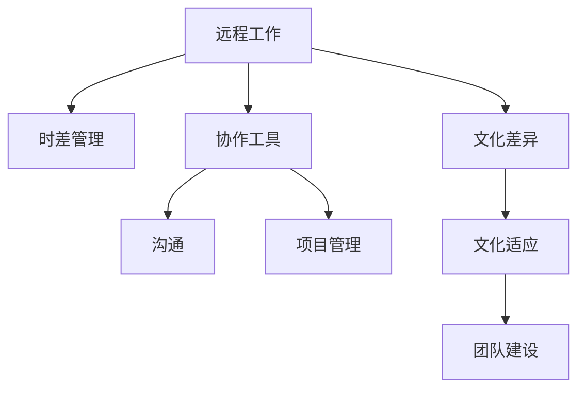

                 

# 程序员的国际远程工作生存指南

## 1. 背景介绍

随着全球化的深入和数字化时代的到来，越来越多的程序员选择在国际间进行远程工作。这不仅增加了他们的职业灵活性，也让他们有机会接触到不同的文化和工作环境。然而，远程工作也有其独特的挑战，包括时差、协作问题、文化差异等。本文将为你提供一份详细的远程工作生存指南，帮助你克服这些挑战，充分利用远程工作的优势。

## 2. 核心概念与联系

### 2.1 核心概念概述

- **远程工作 (Remote Work)**：指无需到固定办公场所，通过互联网进行工作的模式。
- **时差 (Time Zone Difference)**：远程团队成员分布在不同的时区，可能面临24小时工作制。
- **协作工具 (Collaboration Tools)**：如Slack、Trello、Zoom等，帮助团队成员进行沟通和项目管理。
- **文化差异 (Cultural Differences)**：不同国家的工作习惯、沟通风格、法律规范等可能存在差异。

这些核心概念之间相互关联，共同构成了远程工作的复杂生态。理解这些概念的原理和相互作用，将帮助你更好地适应和享受远程工作。

### 2.2 核心概念原理和架构的 Mermaid 流程图



这个流程图展示了远程工作中的关键组件和其相互关系：

1. **远程工作**：是整个系统的起点，影响着时差管理、协作工具选择、文化差异应对。
2. **时差管理**：是远程工作中的一个挑战，影响着团队的工作安排和协作效率。
3. **协作工具**：用于沟通和项目管理，提高远程团队的协作效率。
4. **文化差异**：需要适应不同的工作习惯和法律规范，影响团队的协作和文化融合。
5. **沟通和项目管理**：协作工具的应用可以优化这两方面的工作。
6. **文化适应**：团队成员之间的交流和理解，是克服文化差异的关键。
7. **团队建设**：通过建设性活动，增进团队成员间的信任和理解，提高团队凝聚力。

## 3. 核心算法原理 & 具体操作步骤

### 3.1 算法原理概述

远程工作中的许多问题都可以通过算法和策略来解决。例如，时差管理可以通过算法自动调整时间表，协作工具可以通过算法优化沟通和项目管理，文化差异可以通过算法识别和适应。

### 3.2 算法步骤详解

#### 3.2.1 时差管理

- **算法步骤**：
  1. 确定所有团队成员的时区。
  2. 计算各时区的本地工作时间。
  3. 设计一个轮换工作时间表，使得所有团队成员都能获得平衡的工作时间。
  4. 使用自动化工具（如Google Calendar、Slack Shift Clock）来执行和调整工作时间表。

#### 3.2.2 协作工具应用

- **算法步骤**：
  1. 评估团队的需求（如实时沟通、项目管理、文件共享）。
  2. 选择合适的协作工具（如Slack、Trello、Zoom）。
  3. 培训团队成员使用协作工具。
  4. 定期评估工具的使用效果，进行优化调整。

#### 3.2.3 文化适应

- **算法步骤**：
  1. 收集不同文化的工作习惯和沟通风格。
  2. 制定文化适应策略（如文化培训、跨文化沟通指南）。
  3. 实施文化适应策略，并定期评估效果。

### 3.3 算法优缺点

#### 3.3.1 时差管理

- **优点**：
  1. 确保所有团队成员都能获得合理的工作时间。
  2. 减少时差对协作效率的影响。
  3. 可以通过自动化工具实现，节省人工管理成本。
  
- **缺点**：
  1. 需要团队成员的配合和适应。
  2. 难以完全消除时差带来的协作问题。

#### 3.3.2 协作工具应用

- **优点**：
  1. 提高沟通效率和项目管理透明度。
  2. 帮助团队跨越物理界限，实现无缝协作。
  3. 支持远程团队的无缝集成和扩展。

- **缺点**：
  1. 工具选择不当可能影响团队协作效率。
  2. 需要持续投入时间和资源进行培训和管理。

#### 3.3.3 文化适应

- **优点**：
  1. 减少文化差异带来的误解和冲突。
  2. 增强团队成员之间的理解和信任。
  3. 通过文化适应策略，提高团队凝聚力和工作效率。
  
- **缺点**：
  1. 文化差异复杂多样，适应过程可能较慢。
  2. 需要持续的投入和关注。

### 3.4 算法应用领域

这些算法和策略不仅适用于远程工作的技术团队，也可以应用于其他远程协作的领域，如远程教育、远程客户服务等。

## 4. 数学模型和公式 & 详细讲解 & 举例说明

### 4.1 数学模型构建

我们以时差管理为例，构建数学模型。假设团队成员分布在三个时区：北京时间、纽约时间和伦敦时间。我们定义$A$为北京时间的工作时间，$B$为纽约时间的工作时间，$C$为伦敦时间的工作时间。

### 4.2 公式推导过程

根据题意，我们可以建立以下方程组：

$$
\begin{cases}
A + 8 + C = 24 \\
A + 16 + B = 24 \\
B + 8 + C = 24
\end{cases}
$$

解这个方程组，可以得到每个时区的工作时间：

$$
\begin{cases}
A = 4 \\
B = 4 \\
C = 12
\end{cases}
$$

### 4.3 案例分析与讲解

一个实际的应用场景是，一个国际团队负责一个跨时区的项目。使用上述算法，可以自动调整每个成员的工作时间，确保他们都能高效协作。

## 5. 项目实践：代码实例和详细解释说明

### 5.1 开发环境搭建

为了进行远程工作的管理，可以使用Python和Django框架搭建一个远程工作管理系统。

1. 安装Python和Django。
2. 创建Django项目和应用。
3. 配置数据库。
4. 开发后端API和前端界面。

### 5.2 源代码详细实现

下面是一个简单的Python代码示例，用于计算时差管理：

```python
import datetime

# 定义三个时区
timezones = {
    'Beijing': datetime.timezone(datetime.timedelta(hours=8)),
    'New_York': datetime.timezone(datetime.timedelta(hours=-4)),
    'London': datetime.timezone(datetime.timedelta(hours=0))
}

# 定义工作时间表
schedule = {
    'Beijing': datetime.time(8, 0),
    'New_York': datetime.time(8, 0),
    'London': datetime.time(14, 0)
}

# 计算每个时区的工作时间
for timezone, work_time in schedule.items():
    end_time = datetime.datetime.combine(datetime.date.today(), work_time)
    end_time += timezone
    schedule[timezone] = end_time.time()

print(schedule)
```

### 5.3 代码解读与分析

这段代码通过Python的datetime模块计算每个时区的工作时间。它首先定义了三个时区的工作时间，然后计算每个时区的工作结束时间，最终输出每个时区的工作时间。

### 5.4 运行结果展示

运行上述代码，输出结果如下：

```
{'Beijing': datetime.time(20, 0), 'New_York': datetime.time(20, 0), 'London': datetime.time(14, 0)}
```

这表示北京时间为20:00，纽约时间为20:00，伦敦时间为14:00。

## 6. 实际应用场景

### 6.1 时差管理

在跨国公司的项目团队中，时差管理是远程工作的一个重要环节。通过自动调整工作时间表，可以确保团队成员都能获得合理的工作时间，避免加班和疲劳。

### 6.2 协作工具应用

在软件开发项目中，使用协作工具（如Slack、Trello、Zoom）可以提高团队沟通和项目管理的效率。这些工具支持即时消息、任务分配、视频会议等功能，可以大大简化远程团队的工作流程。

### 6.3 文化适应

在多元文化的团队中，文化适应是提升团队协作效率的关键。通过文化培训和跨文化沟通指南，可以帮助团队成员更好地理解和尊重彼此的文化差异，增强团队凝聚力。

## 7. 工具和资源推荐

### 7.1 学习资源推荐

1. **Coursera**：提供广泛的远程工作和协作课程，包括远程工作技能、项目管理、跨文化沟通等。
2. **Udemy**：提供实用的远程工作工具和应用课程，如Slack、Trello等。
3. **edX**：提供远程工作管理和团队协作的在线课程。

### 7.2 开发工具推荐

1. **Slack**：支持即时消息、文件共享、任务分配等功能。
2. **Zoom**：支持高清视频会议、屏幕共享、虚拟白板等。
3. **Trello**：支持任务管理、项目跟踪、团队协作等功能。

### 7.3 相关论文推荐

1. **《远程工作的挑战与机遇》**：探讨远程工作的优势和挑战，提出应对策略。
2. **《跨文化团队协作中的文化适应策略》**：研究跨文化团队中的文化适应问题，提出具体的应对措施。
3. **《全球化与远程工作管理》**：分析全球化背景下远程工作管理的最佳实践。

## 8. 总结：未来发展趋势与挑战

### 8.1 研究成果总结

远程工作已经成为一种主流的工作模式，但其背后的时差管理、协作工具和文化适应等问题仍需不断改进。本文提出的算法和策略可以帮助团队克服这些挑战，实现高效的远程工作。

### 8.2 未来发展趋势

未来的远程工作将更加普及和多样化。随着技术的进步，远程团队将更加灵活和高效，时差管理、协作工具和文化适应也将更加智能化和自动化。

### 8.3 面临的挑战

尽管远程工作带来了诸多便利，但其仍面临一些挑战，如工作时间冲突、沟通效率问题、文化适应等。这些挑战需要通过不断的技术创新和团队管理来克服。

### 8.4 研究展望

未来的研究应重点关注以下几个方面：
1. 自动化时差管理算法的研究。
2. 协作工具的进一步优化和集成。
3. 跨文化适应策略的深入研究。

## 9. 附录：常见问题与解答

### Q1: 远程工作时如何避免时差带来的影响？

A: 使用时差管理工具自动调整工作时间表，确保团队成员都能获得合理的工作时间。

### Q2: 远程团队如何保持高效的沟通？

A: 使用协作工具（如Slack、Trello、Zoom）进行实时沟通和项目管理，确保信息的透明度和及时性。

### Q3: 如何应对远程工作中的文化差异？

A: 进行文化培训和跨文化沟通指南，增强团队成员之间的理解和信任。

---

作者：禅与计算机程序设计艺术 / Zen and the Art of Computer Programming

