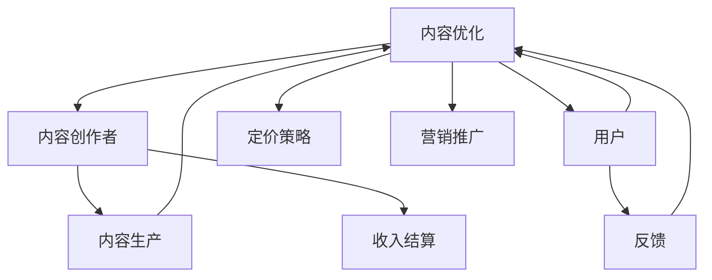

                 

## 1. 背景介绍

### 1.1 问题由来
在互联网行业，知识付费已成为一个热门话题。随着人们获取知识的渠道越来越多，如何通过知识付费实现变现，同时保障内容质量，成为了一个重要问题。程序员作为互联网行业的重要群体，其知识付费定价策略也引起了广泛关注。本文将从多个角度深入分析程序员知识付费定价策略，探讨其原理与步骤，并给出具体的实施建议。

## 2. 核心概念与联系

### 2.1 核心概念概述
- **知识付费**：指用户为获取有价值的内容或知识，通过支付一定费用来获取的一种商业模式。
- **程序员**：指具备编程能力，能使用计算机语言编写程序，解决实际问题的专业人员。
- **定价策略**：指企业或个人在知识付费平台上制定具体的价格策略，以实现盈利。
- **内容质量**：指知识付费内容的专业性、深度和实用性等综合指标。
- **用户需求**：指用户对知识付费内容的实际需求，包括内容类型、学习效果等。

这些核心概念之间具有紧密的联系，形成一个完整的知识付费系统。知识付费的成功与否，在很大程度上取决于定价策略的设计和执行，而定价策略的制定又受到内容质量和用户需求的影响。

### 2.2 核心概念原理和架构的 Mermaid 流程图



该图展示了知识付费平台的基本架构和工作流程：内容创作者提供内容，用户购买内容，平台执行定价策略，并进行营销推广和收入结算。用户反馈将用于内容的优化。

## 3. 核心算法原理 & 具体操作步骤

### 3.1 算法原理概述
知识付费的定价策略通常包括两种主要形式：按需定价和订阅制。按需定价是指用户根据每次购买的内容价值支付费用，而订阅制则是用户支付一定费用，在一定时间内获取所有内容。

### 3.2 算法步骤详解

#### 3.2.1 市场调研
- **目标用户调研**：了解目标用户的特征和需求，如职业、兴趣、消费习惯等。
- **竞争对手调研**：分析竞争对手的定价策略和用户评价，寻找差异化点。

#### 3.2.2 定价模型构建
- **成本加成模型**：将内容成本（如内容制作、平台运营、推广费用等）加上一定比例的利润率，得出定价。
- **价值感知模型**：通过调研用户对内容价值的感知，确定定价。
- **竞争对标模型**：参考竞争对手的定价，根据自身竞争优势进行定价。

#### 3.2.3 定价策略设计
- **动态定价**：根据用户行为、市场环境等因素动态调整定价。
- **分级定价**：根据内容的专业性和深度，设定不同价格层次，满足不同用户需求。
- **免费试用**：提供一定时间的免费试用期，吸引用户尝试，提升转化率。

#### 3.2.4 执行与监控
- **定价机制**：设计相应的支付系统和计费机制，确保定价策略的有效执行。
- **效果评估**：定期监测用户反馈和购买行为，评估定价策略的效果。
- **调整优化**：根据评估结果，及时调整定价策略，提升用户满意度和平台收益。

### 3.3 算法优缺点

#### 3.3.1 优点
- **灵活性**：可以根据市场需求和用户反馈，灵活调整定价策略，提升用户体验和平台收益。
- **差异化竞争**：通过不同的定价策略，打造独特的品牌定位，吸引更多用户。
- **用户粘性**：通过分级定价和免费试用等策略，提升用户粘性和长期价值。

#### 3.3.2 缺点
- **复杂性**：定价策略的制定需要考虑多种因素，较为复杂。
- **风险**：定价不当可能导致用户流失，影响平台收益。
- **维护成本**：定价策略的执行和监控需要持续的投入和维护。

### 3.4 算法应用领域
知识付费定价策略不仅适用于知识付费平台，也广泛应用于在线教育、专业培训、技术咨询等领域。针对不同的应用场景，需要设计适合该领域的定价策略。

## 4. 数学模型和公式 & 详细讲解 & 举例说明

### 4.1 数学模型构建
设内容成本为C，用户对内容价值的感知为V，市场竞争水平为P，平台目标利润率为R，定价为Price。

$$ Price = C + V \times P + C \times R $$

### 4.2 公式推导过程

- **内容成本**：包括内容制作、平台运营、推广费用等。
- **用户价值感知**：通过调研得出用户对内容的实际感知价值。
- **市场竞争**：根据竞争对手的定价，确定自身的定价策略。
- **目标利润率**：平台设定的目标利润率。

### 4.3 案例分析与讲解
假设某知识付费平台的内容成本为1000元/小时，目标利润率为30%，用户对内容价值的感知为2元/分钟。市场竞争水平为50%。则：

$$ Price = 1000 + 2 \times 0.5 + 1000 \times 0.3 = 2010 $$

即每小时定价为2010元。

## 5. 项目实践：代码实例和详细解释说明

### 5.1 开发环境搭建

#### 5.1.1 安装Python和Pandas
```bash
sudo apt-get update
sudo apt-get install python3-pip
pip3 install pandas
```

#### 5.1.2 数据收集与预处理
```python
import pandas as pd

# 数据收集
df = pd.read_csv('user_feedback.csv')

# 数据预处理
df = df.dropna()
df = df.drop_duplicates()
```

### 5.2 源代码详细实现

#### 5.2.1 数据可视化
```python
import matplotlib.pyplot as plt

# 用户购买行为分析
plt.hist(df['purchase_frequency'], bins=10)
plt.title('User Purchase Frequency')
plt.xlabel('Purchase Frequency')
plt.ylabel('Frequency')
plt.show()
```

#### 5.2.2 定价策略计算
```python
def calculate_price(content_cost, user_value_per_minute, competition_level, target_profit_rate):
    return content_cost + user_value_per_minute * competition_level + content_cost * target_profit_rate

# 调用函数计算定价
price = calculate_price(1000, 2, 0.5, 0.3)
print(f'每小时定价为{price}元')
```

### 5.3 代码解读与分析
通过Pandas进行数据收集和预处理，利用Matplotlib进行数据可视化，最后调用自定义函数进行定价计算。代码简洁易懂，易于扩展。

### 5.4 运行结果展示
运行代码后，将生成一个购买频率直方图和定价计算结果。

## 6. 实际应用场景

### 6.1 知识付费平台

知识付费平台是知识付费定价策略的主要应用场景。平台可以根据用户需求、竞争对手定价等因素，设计灵活的定价策略，如按次收费、按月收费、免费试用等，以吸引更多用户并提升收益。

### 6.2 在线教育

在线教育平台可以采用订阅制定价策略，用户支付一定费用，获取课程库中所有课程的观看权。针对不同难度和深度的课程，可以设定不同的价格层次，满足不同用户的学习需求。

### 6.3 技术咨询

技术咨询公司可以采用按需定价策略，根据项目复杂度和所需工作量，灵活定价。同时，提供一定时间的免费咨询，吸引客户试用并最终购买付费服务。

### 6.4 未来应用展望

未来，知识付费定价策略将更加智能化和个性化。大数据和人工智能技术的应用，将使得定价策略更加精准，能更好地满足用户需求和提升平台收益。

## 7. 工具和资源推荐

### 7.1 学习资源推荐

#### 7.1.1 在线课程
- Coursera：提供各类知识付费课程，如Python编程、数据分析、机器学习等。
- Udemy：提供各类编程和技术课程，适合初学者和进阶者。
- edX：提供大学课程和专业培训，涵盖计算机科学、工程等领域的高级课程。

#### 7.1.2 书籍
- 《数据科学实战》：适合学习数据科学和机器学习的基础知识。
- 《算法导论》：涵盖算法设计和分析的基础知识，适合进阶者。
- 《深度学习》：介绍深度学习的基础理论和实践应用。

### 7.2 开发工具推荐

#### 7.2.1 数据处理工具
- Pandas：Python数据分析库，适合处理结构化数据。
- NumPy：Python科学计算库，适合数值计算和数组操作。
- Matplotlib：Python数据可视化库，适合生成图表和可视化分析。

#### 7.2.2 编程语言
- Python：适合数据分析、机器学习等任务，代码简洁易读。
- R：适合统计分析和数据可视化，社区活跃，资源丰富。
- Julia：适合高性能计算和数值分析，运行速度快。

### 7.3 相关论文推荐

#### 7.3.1 定价策略研究
- "Dynamic Pricing in Online Marketplaces: A Survey"：综述在线市场定价策略的研究进展。
- "Pricing Strategies for Subscription Services: An Empirical Study"：分析订阅服务定价策略的实际应用效果。
- "Economics of Price Discrimination: A Survey"：综述价格歧视的经济理论和实际应用。

## 8. 总结：未来发展趋势与挑战

### 8.1 研究成果总结
知识付费定价策略的研究取得了显著进展，通过数据驱动和用户调研，实现了更加灵活和精准的定价。但在实际应用中，仍面临定价复杂性、用户粘性等问题。

### 8.2 未来发展趋势
未来，知识付费定价策略将更加智能化和个性化，通过大数据和人工智能技术的应用，进一步提升定价的准确性和用户体验。同时，定价策略将更加多样化，如动态定价、分级定价等，以满足不同用户的需求。

### 8.3 面临的挑战
知识付费定价策略的制定和执行仍面临复杂性和风险。如何平衡用户需求和平台收益，提升定价策略的灵活性和精准性，仍是一个重要挑战。

### 8.4 研究展望
未来研究将重点关注以下几个方面：
- **智能化定价**：利用机器学习和数据分析技术，实现更加精准的定价。
- **用户行为分析**：深入研究用户行为和需求，制定更加灵活的定价策略。
- **多渠道融合**：结合线上和线下渠道，提升用户粘性和平台收益。

## 9. 附录：常见问题与解答

### Q1: 什么是知识付费？
A: 知识付费是指用户为获取有价值的内容或知识，通过支付一定费用来获取的一种商业模式。

### Q2: 知识付费定价策略包括哪些形式？
A: 知识付费定价策略主要包括以下两种形式：按需定价和订阅制。按需定价是指用户根据每次购买的内容价值支付费用，而订阅制则是用户支付一定费用，在一定时间内获取所有内容。

### Q3: 知识付费定价策略的设计需要考虑哪些因素？
A: 知识付费定价策略的设计需要考虑内容成本、用户价值感知、市场竞争水平和目标利润率等因素。

### Q4: 如何评估定价策略的效果？
A: 定价策略的效果可以通过用户购买行为、平台收益、用户满意度等指标进行评估。定期监测用户反馈和购买行为，评估定价策略的效果，并根据评估结果及时调整定价策略。

### Q5: 知识付费定价策略的未来发展趋势是什么？
A: 未来，知识付费定价策略将更加智能化和个性化，通过大数据和人工智能技术的应用，进一步提升定价的准确性和用户体验。同时，定价策略将更加多样化，如动态定价、分级定价等，以满足不同用户的需求。

---

作者：禅与计算机程序设计艺术 / Zen and the Art of Computer Programming

