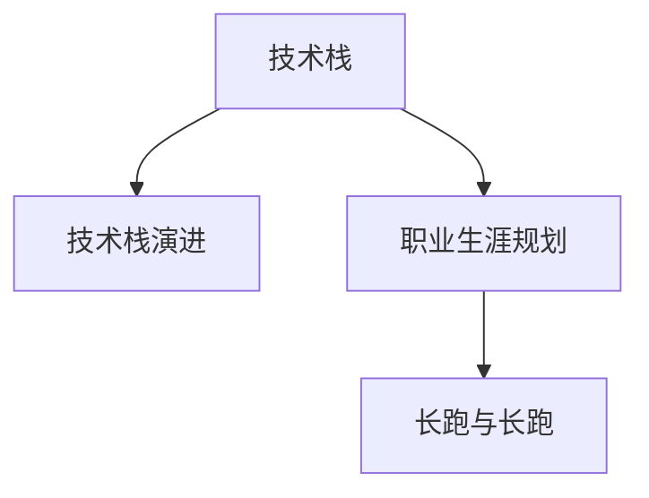

                 

## 1. 背景介绍

在信息技术的快速发展与变革浪潮中，程序员的角色已从传统的代码编写者转变为系统的构建者与创新者。随着云计算、人工智能、大数据、区块链等技术的兴起，程序员的职业生涯呈现出多维度的发展方向。本文将从宏观与微观角度深入探讨程序员的职业生涯规划，提出基于“长跑与长跑”理念的职业生涯发展策略，旨在帮助程序员在快速变化的技术环境中，持续提升自身价值与竞争力。

## 2. 核心概念与联系

### 2.1 核心概念概述

在程序员的职业生涯规划中，涉及的关键概念有：

- **技术栈**：程序员需掌握的不同编程语言、框架与工具的集合。
- **技术栈演进**：随着技术领域的发展，程序员需不断学习新技能，以适应技术变化。
- **职业生涯规划**：基于个人兴趣与职业目标，合理安排学习与工作计划。
- **长跑与长跑**：持续追求技术精进与职业发展的长期策略，而非短期得失。

这些概念之间的逻辑关系可以通过以下Mermaid流程图来展示：



这个流程图展示了程序员职业生涯规划的核心流程：首先，建立起广泛的技术栈，然后随着技术演进不断学习新的技能，并在规划中明确长期发展方向。

## 3. 核心算法原理 & 具体操作步骤
### 3.1 算法原理概述

程序员的职业生涯规划，本质上是将长期技术演进与职业发展相结合的动态过程。其核心思想是通过合理的学习与工作安排，不断提升技术水平与职业能力，最终实现个人职业目标。

假设有程序员 $P$，当前技术栈为 $\mathcal{T}$，未来 $n$ 期的职业目标为 $\mathcal{T}'$。职业生涯规划的过程可描述为：

$$
\mathcal{T} \rightarrow \mathcal{T}_1 \rightarrow \mathcal{T}_2 \rightarrow \ldots \rightarrow \mathcal{T}_n = \mathcal{T}'
$$

其中，每个 $\mathcal{T}_i$ 表示 $P$ 在规划期间第 $i$ 期的技术栈。目标是通过不断调整与学习，使得 $P$ 在 $n$ 期后达到 $\mathcal{T}'$。

### 3.2 算法步骤详解

基于“长跑与长跑”理念的职业生涯规划步骤如下：

**Step 1: 确定职业目标**
- 明确长期职业愿景，例如成为技术专家、项目经理、创业等。
- 细化中期目标，例如在某一技术栈达到专家水平，参与关键项目等。

**Step 2: 评估当前技术栈**
- 列出当前掌握的编程语言、框架与工具。
- 分析技术与技能缺口，确定需补充的知识。

**Step 3: 制定学习计划**
- 基于职业目标与技能缺口，制定详细的学习计划，包括学习资源、时间安排等。
- 考虑学习资源的可行性，如在线课程、书籍、实践项目等。

**Step 4: 实施技术栈演进**
- 按照学习计划逐步掌握新技能，并应用于实际项目中。
- 定期评估学习进度与项目需求，动态调整学习计划。

**Step 5: 持续优化与反思**
- 定期回顾职业规划的进展，评估目标达成情况。
- 分析存在的问题与挑战，调整规划策略，确保长期目标的实现。

### 3.3 算法优缺点

“长跑与长跑”理念的职业生涯规划具有以下优点：

1. **系统性**：通过科学规划，全面覆盖技术栈的演进与职业目标的实现。
2. **持续性**：强调长期学习与实践，避免因短期目标而忽略长期发展。
3. **灵活性**：在实施过程中，可根据实际情况灵活调整学习计划，以应对变化。

同时，也存在以下缺点：

1. **时间成本高**：学习与项目实践需要大量时间投入，可能与生活其他方面产生冲突。
2. **动力维持**：长期学习需要持续的动力与热情，一旦中途放弃，职业生涯规划效果将大打折扣。
3. **风险因素**：技术演进迅速，新技能的学习可能被新技术取代，需时刻保持对市场动态的敏感。

### 3.4 算法应用领域

“长跑与长跑”理念适用于各类职业领域中的技术岗位，包括但不限于：

- **软件开发工程师**：不断掌握新的编程语言与框架，提升编码能力。
- **数据科学家**：学习数据分析、机器学习等新技能，提升数据处理与建模能力。
- **云计算架构师**：掌握云平台、容器化、微服务等新技术，提升系统架构能力。
- **人工智能工程师**：学习深度学习、自然语言处理等前沿技术，提升AI开发与应用能力。

## 4. 数学模型和公式 & 详细讲解 & 举例说明
### 4.1 数学模型构建

程序员职业生涯规划的数学模型可描述为：

设 $t$ 为时间，$T(t)$ 为 $t$ 时刻程序员的技术栈状态，$\Delta T(t)$ 为 $t$ 时刻至 $t+\Delta t$ 时刻技术栈的演化。模型为：

$$
T(t+\Delta t) = f(T(t), \Delta t, E(t))
$$

其中，$f$ 为演化函数，$E(t)$ 为 $t$ 时刻的学习与工作环境。

### 4.2 公式推导过程

假设有两个阶段 $t_1$ 与 $t_2$，技术栈的演化过程可简化为：

$$
T(t_2) = f(T(t_1), \Delta t_1, E(t_1)) = f(f(T(t_0), \Delta t_0, E(t_0)), \Delta t_1, E(t_1))
$$

即 $T(t_2)$ 是 $T(t_0)$ 通过两次演化得到的。

假设每次演化为一个单位时间，则有：

$$
T(t_1) = f(T(t_0), \Delta t_0, E(t_0))
$$

$$
T(t_2) = f(T(t_1), \Delta t_1, E(t_1))
$$

### 4.3 案例分析与讲解

以云计算架构师的职业规划为例，假设目标技术栈为 Kubernetes、IaC、SRE 等。当前技术栈为 Docker、ECS、AWS 等。

**Step 1: 确定职业目标**
- 成为 Kubernetes 专家，参与关键云平台项目。

**Step 2: 评估当前技术栈**
- 当前掌握 Docker、ECS，缺乏 Kubernetes、IaC、SRE 等技能。

**Step 3: 制定学习计划**
- 学习 Kubernetes、IaC，掌握容器编排、CI/CD 等技能。
- 应用于实际项目，提升实战经验。

**Step 4: 实施技术栈演进**
- 每周投入 10 小时学习 Kubernetes、IaC，并应用于项目中。

**Step 5: 持续优化与反思**
- 每季度回顾学习与工作进展，评估目标达成情况。
- 调整学习计划，确保技能提升。

## 5. 项目实践：代码实例和详细解释说明
### 5.1 开发环境搭建

**环境配置**

1. 安装 Anaconda：
```bash
wget https://repo.anaconda.com/miniconda/Miniconda3-latest-Linux-x86_64.sh
bash Miniconda3-latest-Linux-x86_64.sh
source ~/.bashrc
conda init
```

2. 创建虚拟环境：
```bash
conda create -n mypyt python=3.8
conda activate mypyt
```

3. 安装 Python 环境依赖：
```bash
pip install numpy pandas scikit-learn torch torchvision transformers transformers-timm
```

**开发工具**

1. VS Code：配置 Python 插件，进行代码编辑与调试。
2. Jupyter Notebook：使用 Notebook 进行数据处理与代码测试。
3. Git 与 GitHub：使用 Git 进行版本控制，在 GitHub 上托管代码与项目。

### 5.2 源代码详细实现

以下是一个简单的 Python 代码示例，展示如何使用 Transformers 库进行自然语言处理任务微调：

```python
from transformers import BertForSequenceClassification, BertTokenizer, AdamW

# 加载预训练模型与分词器
model_name = 'bert-base-uncased'
tokenizer = BertTokenizer.from_pretrained(model_name)
model = BertForSequenceClassification.from_pretrained(model_name, num_labels=2)

# 准备训练数据
train_data = # 加载训练数据
train_labels = # 加载训练标签

# 设置优化器与超参数
optimizer = AdamW(model.parameters(), lr=2e-5)
epochs = 3

# 进行微调
for epoch in range(epochs):
    for idx, (inputs, labels) in enumerate(train_dataloader):
        inputs = tokenizer(inputs, padding=True, truncation=True, return_tensors='pt')
        outputs = model(**inputs)
        loss = outputs.loss
        loss.backward()
        optimizer.step()

        if (idx+1) % 10 == 0:
            print(f"Epoch {epoch+1}/{epochs}, Step {idx+1}/{len(train_dataloader)}")

# 评估模型性能
test_data = # 加载测试数据
test_labels = # 加载测试标签
test_results = model.predict(test_data)
print(f"Test Accuracy: {test_results['accuracy']:.4f}")
```

### 5.3 代码解读与分析

上述代码展示了一个基于 BERT 模型的二分类任务微调过程。通过代码，可以理解 BERT 微调的基本流程：

1. 加载预训练模型与分词器。
2. 准备训练数据与标签。
3. 设置优化器与超参数。
4. 进行微调。
5. 评估模型性能。

代码中使用了 Transformers 库提供的高级 API，使得微调过程变得简洁高效。

## 6. 实际应用场景
### 6.1 软件工程师

软件工程师需不断学习新技术与框架，提升编码能力。例如：

- **JavaScript**：学习 TypeScript、React、Angular 等框架。
- **Python**：掌握 Django、Flask、TensorFlow 等技术栈。
- **DevOps**：学习容器化、CI/CD、监控工具等。

### 6.2 数据科学家

数据科学家需不断学习数据分析与机器学习的新方法，提升数据处理与建模能力。例如：

- **Python**：掌握 Pandas、NumPy、Scikit-learn 等库。
- **机器学习**：学习深度学习、强化学习等技术。
- **大数据**：掌握 Hadoop、Spark、Hive 等大数据处理技术。

### 6.3 人工智能工程师

人工智能工程师需不断学习深度学习与自然语言处理等前沿技术，提升 AI 开发与应用能力。例如：

- **深度学习**：学习 TensorFlow、PyTorch、Keras 等框架。
- **NLP**：掌握 BERT、GPT、Transformers 等大模型。
- **计算机视觉**：学习 OpenCV、TensorFlow Object Detection API 等技术。

### 6.4 未来应用展望

未来的技术发展将带来更多挑战与机遇，程序员需具备更强的技术适应能力与学习意愿。

**AI 与自动化**：随着 AI 技术的发展，自动编程工具、智能助手将逐渐普及，需不断学习新兴技术以保持竞争力。

**跨领域融合**：AI、区块链、物联网等技术的发展，推动了各领域的融合创新，需学习多种技术以应对跨领域挑战。

**开源与社区**：开源技术与社区合作已成为技术发展的重要驱动力，需积极参与开源项目，提升影响力。

## 7. 工具和资源推荐
### 7.1 学习资源推荐

1. **LeetCode**：提供大量算法与数据结构练习题，提升编程能力。
2. **Kaggle**：提供数据科学竞赛与数据集，提升数据处理与建模能力。
3. **Coursera**：提供高质量的在线课程，涵盖多种技术栈。
4. **Stack Overflow**：解决编程问题与学习新技能。
5. **GitHub**：托管代码与项目，参与开源社区。

### 7.2 开发工具推荐

1. **VS Code**：配置 Python 插件，进行代码编辑与调试。
2. **Jupyter Notebook**：使用 Notebook 进行数据处理与代码测试。
3. **Git**：使用 Git 进行版本控制，在 GitHub 上托管代码与项目。

### 7.3 相关论文推荐

1. **Deep Learning**：Ian Goodfellow 等著，深度学习领域的经典教材。
2. **Programming: Principles and Practice Using Python**：John C. Zelle 著，Python 编程入门的经典教材。
3. **Human-Computer Interaction: Stories, Systems, Culture**：Shoshana Zuboff 著，人机交互领域的经典教材。

## 8. 总结：未来发展趋势与挑战
### 8.1 研究成果总结

本文通过分析“长跑与长跑”理念，探讨了程序员职业生涯规划的核心策略。提出基于技术栈演进与职业目标的长期规划，强调持续学习与适应能力。

### 8.2 未来发展趋势

未来的技术发展将呈现以下几个趋势：

1. **技术栈多元化**：技术栈将更加多样，跨领域融合将更加普遍。
2. **AI 与自动化**：AI 技术将加速自动化工具的发展，提升工作效率。
3. **开源与社区**：开源技术与社区合作将更紧密，推动技术发展。

### 8.3 面临的挑战

程序员在职业生涯规划过程中可能面临以下挑战：

1. **技术更新迅速**：新技术层出不穷，需不断学习以跟上变化。
2. **时间与精力管理**：平衡学习与工作，避免过度投入。
3. **团队协作**：团队合作与沟通能力需不断提升。

### 8.4 研究展望

未来的研究应重点关注以下方向：

1. **学习与工作平衡**：研究如何更高效地平衡学习与工作，提升生产力。
2. **团队协作**：研究团队协作模式与沟通方法，提升团队效能。
3. **技术普及**：研究如何普及新技能与技术，降低学习门槛。

## 9. 附录：常见问题与解答

**Q1: 如何平衡学习与工作？**

A: 可以采取以下策略：
- **时间管理**：每日安排固定学习时间，避免工作和学习冲突。
- **高效学习**：利用番茄工作法、深度工作法等提升学习效率。
- **知识应用**：将所学知识应用于实际项目，提高学习动力。

**Q2: 新技术层出不穷，如何跟上变化？**

A: 可以采取以下策略：
- **持续学习**：定期学习新技术，保持知识更新。
- **关注社区**：关注开源社区与技术博客，及时获取最新信息。
- **实践应用**：通过实践项目，掌握新技术与框架。

**Q3: 如何提高团队协作效率？**

A: 可以采取以下策略：
- **明确目标**：明确团队目标与分工，提高协作效率。
- **沟通协调**：定期召开团队会议，沟通项目进展与问题。
- **工具应用**：使用协作工具（如 Slack、JIRA）提高沟通效率。

**Q4: 如何普及新技术与技能？**

A: 可以采取以下策略：
- **培训与讲座**：定期举办培训与讲座，分享技术经验。
- **文档与教程**：编写详细文档与教程，方便他人学习。
- **社区参与**：参与开源项目与技术社区，推广新技术与技能。

---

作者：禅与计算机程序设计艺术 / Zen and the Art of Computer Programming

