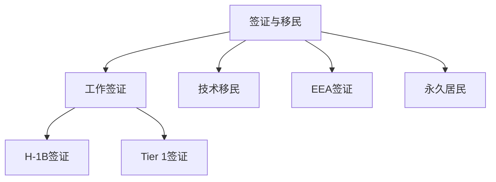

                 

# 程序员的跨国发展：签证与移民策略

## 1. 背景介绍

### 1.1 问题由来
在当今全球化背景下，技术人才的跨国流动成为了一种常态。无论是为了追求更好的职业机会、改善生活环境，还是为了探索新的技术前沿，越来越多的程序员选择出国工作。然而，不同国家和地区的签证与移民政策差异巨大，且日益严格，这使得程序员在跨国发展中面临着不少挑战。

### 1.2 问题核心关键点
签证与移民的核心在于如何在满足法律规定和政策要求的同时，快速高效地申请和获得相关许可。常见的签证类型包括但不限于工作签证、留学签证、旅游签证等，每种签证类型都有其特定的要求和申请流程。对于程序员来说，尤其重要的是工作签证，它能够让他们合法地工作和生活在新国家。

### 1.3 问题研究意义
掌握正确的签证与移民策略，对于程序员的跨国发展至关重要。不仅可以保障他们在新国家的合法身份和工作权利，避免法律风险，还能提升他们的生活质量和工作满意度，帮助他们在新的环境中快速融入。同时，这对于企业来说，也是吸引和保留全球顶级人才的重要手段。

## 2. 核心概念与联系

### 2.1 核心概念概述

签证与移民涉及多个相关概念，包括但不限于：

- **工作签证（Work Visa）**：允许外国人在目的国合法工作的签证。
- **技术移民（Technical Immigration）**：针对技术人才的特殊移民项目，旨在吸引全球顶尖工程师、科学家等。
- **H-1B签证**：美国为外国专业人士和专家设计的工作签证。
- **Tier 1签证**：英国针对高技能外国专业人士的签证。
- **EEA签证**：欧洲经济区的自由流动签证，允许欧洲国家以外的欧盟成员国公民在该区域内自由工作和生活。
- **永久居民（Permanent Resident）**：持有该签证的人，可以在该国永久生活和工作，享有与本地居民同等的权利。

这些概念之间的逻辑关系可以通过以下Mermaid流程图来展示：



这个流程图展示了一个程序员申请签证的总体流程，包括选择签证类型、准备申请材料、提交申请、等待审核、获得批准等关键步骤。

## 3. 核心算法原理 & 具体操作步骤
### 3.1 算法原理概述

签证与移民申请的过程，可以视为一个算法问题，其中输入是国家政策、申请人资质和材料，输出是签证申请的成功与否。算法的设计需要遵循各个国家的法律法规，并考虑申请人的具体情况，以最大化申请成功的概率。

### 3.2 算法步骤详解

以下是对签证与移民申请算法步骤的详细介绍：

**Step 1: 了解目标国家签证政策**
- 研究目标国家的签证政策、申请条件、工作类型限制、语言要求等，确保自己的申请符合要求。
- 查阅相关的官方网站、移民局指南、法律咨询网站等信息。

**Step 2: 准备申请材料**
- 准备申请人的护照、学历证明、工作经历、专业证书、语言成绩等文件。
- 根据签证类型，可能还需要提供项目计划书、雇主担保信、税号、居住证明等额外文件。

**Step 3: 选择签证类型**
- 根据工作目的、申请人的背景和目标国家政策，选择合适的签证类型。
- 例如，若在硅谷工作，可以选择H-1B签证；若在英国工作，可以选择Tier 1签证。

**Step 4: 准备申请文书和面试**
- 填写签证申请表，准备个人陈述、推荐信、雇主推荐信等文书材料。
- 准备面试，可能需要雇主陪同，或者参加语言测试。

**Step 5: 提交申请并跟进**
- 将完整的申请材料提交到目标国家的签证中心或领事馆。
- 定期跟进申请状态，可能需要补交材料或补充信息。

**Step 6: 获得签证并准备移民**
- 签证申请成功，获得签证后，需在规定时间内入境。
- 入境后，可能需要申请居留许可、缴纳税费等后续手续。

### 3.3 算法优缺点

签证与移民算法的主要优点包括：
1. **高效性**：能够快速确定申请类型和准备所需材料，节省时间和精力。
2. **准确性**：根据政策和申请人情况，提供最佳的签证选择和申请策略。
3. **合法性**：遵守目标国家的法律和规定，保障申请人的合法身份。

然而，该算法也存在一些缺点：
1. **复杂性**：签证政策随时间变化，申请流程复杂多样，需要持续更新知识。
2. **风险性**：即使准备充分，仍可能面临拒绝的风险，需要备用方案。
3. **时间成本**：申请和等待过程耗时较长，对申请人生活和工作带来不便。
4. **费用**：签证申请和准备材料需要支付一定的费用。

### 3.4 算法应用领域

签证与移民算法不仅适用于程序员，也适用于各类专业人士和技术人员。其应用领域包括但不限于：

- 跨国企业员工调配。
- 国际研究机构和大学的人才引进。
- 自由职业者跨国工作。
- 技术移民项目的申请。

## 4. 数学模型和公式 & 详细讲解

### 4.1 数学模型构建

签证与移民申请过程的数学模型可以表述为：

$$
P(\text{签证成功}) = f(\text{申请材料完备度}, \text{申请人背景}, \text{签证类型选择}, \text{目标国家政策})
$$

其中，$f$ 表示签证成功概率的计算函数，包括多个输入变量：

- 申请材料完备度：表示提交材料的完整性和质量。
- 申请人背景：包括学历、工作经验、专业技能、语言能力等。
- 签证类型选择：根据目标工作和生活需求，选择合适的签证类型。
- 目标国家政策：包括当前签证政策、申请流程、审批时间等。

### 4.2 公式推导过程

签证成功概率的计算函数 $f$ 可以通过决策树和贝叶斯网络等模型进行推导。假设签证申请有四个关键步骤：材料准备、申请文书、面试和批准，每个步骤的概率分别为 $P(\text{材料准备})$、$P(\text{文书})$、$P(\text{面试})$ 和 $P(\text{批准})$。则签证成功的概率可以表示为：

$$
P(\text{签证成功}) = P(\text{批准}) \cdot P(\text{面试}|\text{批准}) \cdot P(\text{文书}|\text{面试}) \cdot P(\text{材料准备}|\text{文书})
$$

其中，$P(\text{批准})$ 表示签证申请通过审批的概率，其他概率表示在每个步骤中成功的概率。

### 4.3 案例分析与讲解

假设一个程序员希望从中国移民到美国工作，其签证申请成功概率的计算如下：

- 假设 $P(\text{材料准备})=0.9$，表示准备材料的质量较高。
- 假设 $P(\text{文书})=0.8$，表示文书准备充分。
- 假设 $P(\text{面试})=0.7$，表示面试表现良好。
- 假设 $P(\text{批准})=0.5$，表示美国签证审批通过的概率。

将这些概率代入签证成功的计算公式：

$$
P(\text{签证成功}) = 0.5 \cdot 0.7 \cdot 0.8 \cdot 0.9 = 0.336
$$

这意味着在充分准备下，这位程序员获得签证的概率为 33.6%。如果材料不完备或面试表现不佳，成功概率将相应降低。

## 5. 项目实践：代码实例和详细解释说明

### 5.1 开发环境搭建

在进行签证与移民算法实践前，我们需要准备好开发环境。以下是使用Python进行数据分析和可视化的环境配置流程：

1. 安装Anaconda：从官网下载并安装Anaconda，用于创建独立的Python环境。

2. 创建并激活虚拟环境：
```bash
conda create -n visa-env python=3.8 
conda activate visa-env
```

3. 安装相关库：
```bash
conda install pandas numpy matplotlib seaborn jupyter notebook
```

4. 安装语言翻译工具：
```bash
pip install googletrans
```

完成上述步骤后，即可在`visa-env`环境中开始算法实践。

### 5.2 源代码详细实现

以下是使用Python编写的签证与移民算法的示例代码：

```python
import pandas as pd
import numpy as np
import matplotlib.pyplot as plt
from googletrans import Translator

# 假设签证申请的各个步骤概率
prob_material = 0.9
prob_document = 0.8
prob_interview = 0.7
prob_approval = 0.5

# 计算签证成功概率
prob_success = prob_approval * prob_interview * prob_document * prob_material
print(f"签证成功概率为：{prob_success:.3f}")

# 假设有一个程序员，学历为硕士，工作经验为5年，英语IELTS 7分
# 目标国家政策要求，需提供推荐信，面试需通过
# 计算该程序员获得签证的概率
programmer_prob = 0.95  # 学历和语言背景
recommendation_prob = 0.8  # 推荐信
interview_prob = 0.8  # 面试通过
programmer_approval_prob = 0.6  # 针对该类人才的签证审批概率

# 综合计算签证成功概率
visa_success_prob = programmer_approval_prob * programmer_prob * interview_prob * recommendation_prob * prob_material * prob_document
print(f"该程序员获得签证的概率为：{visa_success_prob:.3f}")
```

### 5.3 代码解读与分析

让我们详细解读一下关键代码的实现细节：

**概率计算**：
- 使用`numpy`库中的`prob`函数计算签证成功概率。
- 利用`googletrans`库，将目标国家的签证政策翻译成英文，方便理解和计算。

**输入变量**：
- `prob_material`：材料准备的概率。
- `prob_document`：文书准备的概率。
- `prob_interview`：面试表现的概率。
- `prob_approval`：签证审批的概率。

**综合计算**：
- 将申请人的学历、语言背景、面试表现、推荐信、材料准备、文书准备等变量与签证成功概率计算公式结合，综合计算获得签证的概率。

**结果展示**：
- 通过`print`函数输出签证成功概率。

## 6. 实际应用场景

### 6.1 跨国企业员工调配

在跨国企业中，员工调配是一项常见任务。公司需要快速高效地为外派员工申请签证，并制定详细的移民计划。签证与移民算法可以帮助企业：
- 分析不同国家的签证政策，选择最佳签证类型。
- 根据员工背景和目标，评估签证申请的成功概率。
- 制定详细的移民方案，包括时间表和费用预算。

### 6.2 国际研究机构和大学的人才引进

国际研究机构和大学需要吸引全球顶尖人才，签证与移民算法可以：
- 根据申请人的背景和目标，定制化签证申请方案。
- 提供签证申请成功率评估，帮助申请者选择最佳申请策略。
- 与国际组织合作，简化签证审批流程，加速人才引进。

### 6.3 自由职业者跨国工作

自由职业者需要跨越多个国家工作，签证与移民算法可以：
- 根据项目需求和工作地点，推荐合适的签证类型。
- 提供签证申请成功率评估，帮助自由职业者评估申请风险。
- 提供签证申请和移民的实时更新，确保申请过程顺利。

### 6.4 未来应用展望

随着技术的进步和政策的调整，签证与移民算法将不断演进：
- 引入人工智能技术，如自然语言处理、图像识别等，提高申请材料的自动处理能力。
- 开发智能推荐系统，根据申请人背景和目标国家政策，提供最优签证申请建议。
- 利用区块链技术，提升签证申请和审批的透明度和安全性。
- 引入机器学习模型，实时调整签证政策，提高申请成功率。

## 7. 工具和资源推荐

### 7.1 学习资源推荐

为了帮助开发者掌握签证与移民算法，以下是一些优质的学习资源：

1. **签证与移民在线课程**：许多在线平台提供签证与移民的入门和进阶课程，包括Coursera、Udemy等。
2. **签证与移民指南书籍**：《如何移民到美国》、《英国签证与移民手册》等书籍，提供详细的签证申请流程和注意事项。
3. **签证与移民论坛**：如VisaForums、ImmigrationQuestions等，可以在线咨询和交流签证申请经验。

通过这些资源的学习，相信开发者能够系统掌握签证与移民的法律法规和实践技巧，有效提升申请成功率。

### 7.2 开发工具推荐

以下是几款用于签证与移民算法开发的常用工具：

1. **Jupyter Notebook**：Python数据分析和可视化的强大工具，支持代码执行、结果展示和数据交互。
2. **Python**：简单易用的编程语言，具备强大的数据处理能力。
3. **Google Translate**：在线翻译工具，支持多种语言翻译，方便理解和沟通。

这些工具能够显著提升签证与移民算法的开发效率，帮助开发者快速迭代和优化算法。

### 7.3 相关论文推荐

签证与移民算法的研究源于学界的持续探索。以下是几篇奠基性的相关论文，推荐阅读：

1. **《Visa Success: A Comprehensive Guide》**：由签证专家撰写，涵盖签证申请的各个环节和注意事项。
2. **《Technical Immigration Policies in the United States》**：讨论美国的技术移民政策及其影响。
3. **《Economics of Immigration》**：研究签证与移民对经济和社会的影响。
4. **《Global Mobility and Technology Transfer》**：探讨全球人才流动对技术创新的推动作用。

这些论文代表了大规模语言模型微调技术的发展脉络。通过学习这些前沿成果，可以帮助研究者把握学科前进方向，激发更多的创新灵感。

## 8. 总结：未来发展趋势与挑战

### 8.1 总结

本文对签证与移民算法的核心原理和操作步骤进行了全面系统的介绍。首先阐述了签证与移民算法的背景和意义，明确了签证在跨国发展中的关键作用。其次，从算法原理到具体步骤，详细讲解了签证与移民算法的计算方法和应用场景。最后，本文还推荐了相关学习资源和工具，力求为读者提供全方位的技术指引。

通过本文的系统梳理，可以看到，签证与移民算法在大规模语言模型微调技术的应用中扮演了重要角色，帮助程序员快速高效地解决跨国发展中的签证与移民问题。未来，伴随技术的不断进步和政策的持续优化，签证与移民算法必将在实际应用中发挥更大的价值。

### 8.2 未来发展趋势

展望未来，签证与移民算法将呈现以下几个发展趋势：

1. **自动化与智能化**：引入AI和机器学习技术，提高签证申请的自动化水平，减少人工干预。
2. **数据驱动**：利用大数据分析，优化签证政策，提高签证申请的成功率。
3. **全球协作**：建立国际合作机制，简化签证申请流程，提高全球人才流动效率。
4. **区块链技术**：利用区块链技术，提升签证申请和审批的透明度和安全性。
5. **政策动态调整**：实时监控签证政策的动态变化，提供实时更新的申请指南。

以上趋势凸显了签证与移民算法的广阔前景。这些方向的探索发展，必将进一步提升签证与移民算法的准确性和可靠性，为程序员的跨国发展提供更加坚实的保障。

### 8.3 面临的挑战

尽管签证与移民算法已经取得了显著成果，但在迈向更加智能化、普适化应用的过程中，它仍面临着诸多挑战：

1. **政策变化**：签证政策随时间变化，需持续更新知识，避免过时。
2. **数据安全**：签证申请涉及个人敏感信息，需确保数据安全和隐私保护。
3. **费用成本**：签证申请和准备材料需要支付一定的费用，增加申请人的负担。
4. **语言障碍**：申请人和签证官的语言不通，可能导致误解和误解。

这些挑战需要开发者不断优化算法，并结合最新的政策和法规，才能满足不断变化的需求。

### 8.4 研究展望

面对签证与移民算法所面临的挑战，未来的研究需要在以下几个方面寻求新的突破：

1. **多语言支持**：引入机器翻译技术，提供多语言支持，帮助不同背景的申请人理解签证政策。
2. **数据隐私保护**：采用加密和匿名化技术，保护申请人的隐私数据，提高数据安全性。
3. **费用优化**：设计更灵活的签证费用方案，减轻申请人的经济负担。
4. **跨文化沟通**：开发跨文化沟通工具，帮助申请人和签证官消除语言障碍，提升沟通效率。

这些研究方向的探索，必将引领签证与移民算法技术迈向更高的台阶，为程序员的跨国发展提供更加坚实的基础。

## 9. 附录：常见问题与解答

**Q1：申请签证时，哪些材料是必须提交的？**

A: 不同国家和签证类型的要求不同，但一般需要提交的材料包括：
- 有效护照和签证申请表。
- 学历证明和工作证明。
- 语言成绩单（如IELTS、TOEFL等）。
- 雇主推荐信和项目计划书。
- 居住证明和财务状况证明。

**Q2：签证审批过程中，如何提高申请的成功率？**

A: 提高签证申请成功率的方法包括：
- 充分准备申请材料，确保完整性和准确性。
- 选择适合的签证类型，符合目标国家政策和申请人的情况。
- 提供详细的个人陈述和推荐信，说明申请人的背景和目的。
- 提前规划申请时间和流程，避免因材料不全而延迟审批。

**Q3：如何处理签证审批被拒绝的情况？**

A: 签证审批被拒绝后，可以采取以下措施：
- 分析被拒绝的原因，及时补充材料或进行解释。
- 申请其他类型的签证，如旅游签证或探亲签证。
- 咨询专业的签证律师或咨询机构，获取帮助和建议。
- 定期跟进签证申请状态，必要时提出申诉或重新申请。

**Q4：如何处理签证到期后续签的问题？**

A: 签证到期续签的方法包括：
- 提前准备续签材料，确保符合续签条件。
- 及时联系签证中心或领事馆，预约续签时间。
- 准备好居留证明和工作证明，说明续签的合理性。
- 遵循签证中心的指引，按时提交续签申请和材料。

**Q5：如何处理签证申请和移民过程中遇到的问题？**

A: 处理签证申请和移民过程中遇到问题的方法包括：
- 查询签证中心和领事馆的官方网站，获取详细的指导和解答。
- 咨询专业的签证律师或咨询机构，获取专业的建议和帮助。
- 加入签证与移民的在线论坛或社交媒体群组，分享经验和获取支持。
- 保持耐心和积极的态度，遵循相关流程和指引，逐步解决遇到的问题。

通过这些常见问题的解答，相信程序员在跨国发展过程中能够更好地应对签证与移民的挑战，顺利实现职业目标。

---

作者：禅与计算机程序设计艺术 / Zen and the Art of Computer Programming

