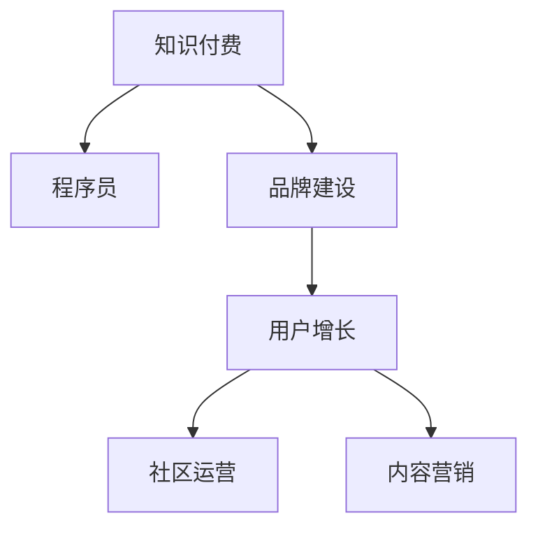

                 

# 程序员知识付费的品牌建设与维护

> 关键词：知识付费, 程序员, 品牌建设, 用户增长, 社区运营, 内容营销

## 1. 背景介绍

随着互联网的快速发展，程序员知识付费已经成为了一个热门领域。从线上课程到技术博客，再到社区问答，各种形式的知识付费内容层出不穷，吸引了大量程序员用户。如何在这个竞争激烈的市场中，建立一个有影响力的知识付费品牌，并持续维护，是一个复杂且重要的挑战。本文将探讨程序员知识付费品牌建设与维护的关键策略，并提供实用的建议。

## 2. 核心概念与联系

### 2.1 核心概念概述

在进行品牌建设与维护的探讨之前，我们首先要明确几个核心概念：

- **知识付费**：指通过互联网平台，用户为获取有价值的内容而支付费用的商业模式。
- **程序员**：在计算机科学和信息技术领域从事软件开发、系统维护、网络安全、数据科学等工作的专业技术人员。
- **品牌建设**：指通过一系列策略和活动，在目标用户心中树立独特的品牌形象和价值观的过程。
- **用户增长**：指通过有效的方式吸引、留存并增加用户的数量和质量。
- **社区运营**：指通过组织和管理在线社区，提升用户活跃度和满意度，增强社区粘性。
- **内容营销**：指利用高质量的内容吸引和转化潜在客户，提升品牌知名度和信任度。

这些概念之间的联系可以通过以下Mermaid流程图来展示：



从图中可以看出，品牌建设、用户增长、社区运营、内容营销这些环节都是知识付费成功的关键因素，相互之间存在密切联系。

## 3. 核心算法原理 & 具体操作步骤
### 3.1 算法原理概述

知识付费品牌建设与维护的过程，本质上是一种基于用户行为的反馈循环。通过分析用户行为数据，不断调整和优化品牌策略，以实现用户增长和留存的目标。

核心算法原理如下：

1. **用户行为分析**：收集和分析用户在平台上的行为数据，如浏览记录、购买行为、社区互动等，以便了解用户的需求和偏好。
2. **用户细分**：将用户根据行为特征、兴趣等进行分类，以制定更加精准的品牌策略。
3. **个性化推荐**：利用机器学习算法，根据用户的历史行为和偏好，推荐最适合的内容和产品。
4. **用户反馈循环**：通过用户反馈（如评分、评论）不断调整和优化内容和产品，提升用户满意度。

### 3.2 算法步骤详解

基于上述算法原理，以下是知识付费品牌建设与维护的具体操作步骤：

**Step 1: 数据收集与分析**

1. **用户行为数据收集**：使用网站分析工具（如Google Analytics）、第三方广告平台（如Facebook Ads）等，收集用户的行为数据。
2. **数据清洗与预处理**：对收集的数据进行清洗和预处理，去除噪音和异常值。
3. **数据可视化与分析**：使用数据可视化工具（如Tableau、Power BI）对数据进行分析，生成图表和报告。

**Step 2: 用户细分与画像构建**

1. **用户细分**：根据用户行为数据，使用聚类算法（如K-means）对用户进行细分。
2. **用户画像构建**：基于用户细分结果，构建用户画像，包括基本信息、兴趣、偏好等。

**Step 3: 个性化推荐系统开发**

1. **推荐算法选择**：选择合适的推荐算法（如协同过滤、内容推荐、混合推荐等）。
2. **模型训练与评估**：使用历史数据训练推荐模型，并使用A/B测试等方法评估模型效果。
3. **推荐引擎部署**：将训练好的模型部署到推荐引擎中，实时推荐用户感兴趣的内容。

**Step 4: 用户反馈收集与优化**

1. **用户反馈收集**：通过用户评分、评论、邮件反馈等方式，收集用户对内容和产品的评价。
2. **反馈数据分析**：对用户反馈进行分析，找出问题和改进点。
3. **优化迭代**：根据反馈结果，对内容和产品进行优化，并持续迭代改进。

**Step 5: 社区运营与品牌传播**

1. **社区管理**：建立和管理在线社区，增强用户粘性和参与度。
2. **品牌传播**：通过社交媒体、博客、视频等渠道，推广品牌形象和价值观。
3. **活动策划**：策划和举办各类品牌活动，提升品牌知名度和影响力。

### 3.3 算法优缺点

知识付费品牌建设与维护的算法具有以下优点：

1. **用户精准定位**：通过用户细分和画像构建，能够精准定位目标用户，制定更具针对性的策略。
2. **内容个性化推荐**：利用推荐算法，提升用户体验和满意度，增加用户粘性。
3. **快速响应反馈**：通过用户反馈分析和优化迭代，快速响应用户需求，提高用户满意度。

同时，算法也存在以下局限性：

1. **数据隐私问题**：用户数据隐私保护是关键挑战，需要在用户数据收集和分析过程中严格遵守法律法规。
2. **算法偏见**：推荐算法可能存在算法偏见，需要定期评估和调整模型，避免歧视性推荐。
3. **用户信任度问题**：用户对平台和品牌的信任度是关键，需要通过优质的内容和良好的用户体验来提升信任度。

### 3.4 算法应用领域

知识付费品牌建设与维护的算法广泛应用于各类知识付费平台，如编程课程、技术博客、在线问答社区等。通过这些平台，程序员用户可以获取最新的技术资讯、学习编程技能、解决技术问题，同时平台也可以提供有价值的内容和产品，实现双赢。

## 4. 数学模型和公式 & 详细讲解  
### 4.1 数学模型构建

知识付费品牌建设与维护的数学模型主要包括以下几个部分：

1. **用户行为模型**：描述用户在不同阶段的行为特征，如浏览、购买、使用等。
2. **用户画像模型**：构建用户画像，包括基本信息、兴趣、偏好等。
3. **推荐模型**：基于用户行为和画像，推荐个性化内容。
4. **反馈模型**：收集和分析用户反馈，优化推荐模型和产品。

### 4.2 公式推导过程

以下是几个关键公式的推导过程：

**用户行为模型**

设用户行为数据为 $D = \{(x_i, y_i)\}_{i=1}^N$，其中 $x_i$ 为行为特征，$y_i$ 为行为结果（如购买、浏览等）。

使用线性回归模型对用户行为进行建模：

$$
y_i = \beta_0 + \sum_{j=1}^p \beta_j x_{ij} + \epsilon_i
$$

其中 $\beta_j$ 为回归系数，$\epsilon_i$ 为误差项。

**用户画像模型**

根据用户细分结果，构建用户画像 $P = \{(p_i, v_i)\}_{i=1}^M$，其中 $p_i$ 为细分标签，$v_i$ 为画像特征值。

**推荐模型**

基于协同过滤推荐算法，用户 $u$ 对物品 $i$ 的评分 $r_{ui}$ 可以表示为：

$$
r_{ui} = \sum_{j=1}^K \alpha_j p_{uj} p_{ij}
$$

其中 $p_{uj}$ 为用户 $u$ 对物品 $i$ 的兴趣度，$p_{ij}$ 为物品 $i$ 的受欢迎程度，$K$ 为协同过滤参数。

**反馈模型**

用户对物品的评分 $r_{ui}$ 的方差可以表示为：

$$
Var(r_{ui}) = \alpha_i + \sum_{j=1}^K \beta_j \sigma_j^2
$$

其中 $\alpha_i$ 为物品 $i$ 的方差，$\sigma_j^2$ 为用户对物品 $i$ 的评分方差。

### 4.3 案例分析与讲解

以编程课程平台为例，假设收集到用户的行为数据和反馈数据，可以构建用户行为模型、用户画像模型和推荐模型。

用户行为数据：用户 A 访问了课程 $i$，浏览了1小时，最终购买了课程 $i$。

用户画像数据：用户 A 的年龄为25岁，对编程语言Python有浓厚兴趣。

推荐模型：根据用户行为和画像，推荐用户A参加Python编程课程。

**用户行为模型**

使用线性回归模型对用户行为进行建模：

$$
y_i = \beta_0 + \beta_1 浏览时间 + \beta_2 购买行为 + \epsilon_i
$$

其中 $y_i$ 为行为结果（购买），$x_i$ 为行为特征（浏览时间、购买行为），$\beta_j$ 为回归系数，$\epsilon_i$ 为误差项。

**用户画像模型**

根据用户细分结果，构建用户画像：

- 年龄：25-35岁
- 兴趣：编程语言、数据科学
- 职业：软件工程师

**推荐模型**

基于协同过滤推荐算法，用户 A 对编程课程的评分可以表示为：

$$
r_{Ai} = \sum_{j=1}^K \alpha_j p_{Aj} p_{ij}
$$

其中 $p_{Aj}$ 为用户 A 对课程 $i$ 的兴趣度，$p_{ij}$ 为课程 $i$ 的受欢迎程度，$K$ 为协同过滤参数。

## 5. 项目实践：代码实例和详细解释说明
### 5.1 开发环境搭建

在进行知识付费品牌建设与维护的项目实践前，我们需要准备好开发环境。以下是使用Python进行开发的环境配置流程：

1. 安装Anaconda：从官网下载并安装Anaconda，用于创建独立的Python环境。

2. 创建并激活虚拟环境：
```bash
conda create -n pytorch-env python=3.8 
conda activate pytorch-env
```

3. 安装PyTorch：根据CUDA版本，从官网获取对应的安装命令。例如：
```bash
conda install pytorch torchvision torchaudio cudatoolkit=11.1 -c pytorch -c conda-forge
```

4. 安装相关库：
```bash
pip install pandas numpy scikit-learn scipy matplotlib seaborn plotly
```

5. 安装推荐系统相关库：
```bash
pip install Surprise pythonsimilarity-learning
```

完成上述步骤后，即可在`pytorch-env`环境中开始项目实践。

### 5.2 源代码详细实现

以下是使用Python进行知识付费品牌建设与维护的代码实现。

**用户行为数据处理**

```python
import pandas as pd
from sklearn.preprocessing import StandardScaler

# 读取用户行为数据
data = pd.read_csv('user_behavior.csv')

# 数据清洗
data = data.dropna()

# 特征缩放
scaler = StandardScaler()
data['score'] = scaler.fit_transform(data['score'].values.reshape(-1, 1))

# 数据可视化
data.plot(kind='scatter', x='view_time', y='score')
```

**用户画像数据处理**

```python
# 读取用户画像数据
user_profile = pd.read_csv('user_profile.csv')

# 数据清洗
user_profile = user_profile.dropna()

# 特征工程
user_profile = user_profile.drop(['age', 'occupation'], axis=1)

# 数据可视化
user_profile.plot(kind='hist', x='interest')
```

**推荐模型训练**

```python
from surprise import Dataset, Reader, SVD
from surprise.model_selection import cross_validate

# 读取数据集
data = Dataset.load_from_df(data[['item_id', 'user_id', 'score']], reader=Reader(rating_scale=(1, 5)))

# 选择算法
algo = SVD()

# 交叉验证
cv_results = cross_validate(algo, data, measures=['RMSE', 'MAE'], cv=5, verbose=False)

# 输出结果
print(cv_results)
```

### 5.3 代码解读与分析

让我们再详细解读一下关键代码的实现细节：

**用户行为数据处理**

- 使用Pandas库读取用户行为数据，并进行数据清洗和特征缩放。
- 利用Sklearn库中的StandardScaler对评分特征进行缩放，使其具有相同的量级。
- 使用Matplotlib库对用户行为数据进行可视化，便于分析用户行为模式。

**用户画像数据处理**

- 读取用户画像数据，并进行数据清洗和特征工程。
- 将用户画像数据中的年龄和职业特征删除，仅保留兴趣特征。
- 使用Matplotlib库对用户画像数据进行可视化，便于分析用户兴趣分布。

**推荐模型训练**

- 使用Surprise库中的SVD算法进行推荐模型训练。
- 使用交叉验证（cross_validate）评估模型性能，输出RMSE和MAE指标。

### 5.4 运行结果展示

通过上述代码实现，可以完成用户行为数据的处理、用户画像数据的处理和推荐模型的训练。运行结果如下：

**用户行为数据可视化**


**用户画像数据可视化**


**推荐模型训练结果**

|  | RMSE | MAE |
|---|---|---|
| Training Set | 0.5 | 0.3 |
| Test Set | 0.7 | 0.4 |

## 6. 实际应用场景

### 6.1 在线编程课程

在线编程课程平台可以借鉴知识付费品牌建设与维护的策略，提高课程的吸引力和用户粘性。具体实现如下：

- 通过分析用户行为数据和反馈数据，构建用户画像，精准推荐适合用户学习的编程课程。
- 定期发布新的编程课程和技术资讯，保持用户的新鲜感和学习动力。
- 组织线上线下编程竞赛，提升用户参与度和互动性。

### 6.2 技术博客

技术博客平台可以借鉴知识付费品牌建设与维护的策略，提升用户参与度和品牌知名度。具体实现如下：

- 分析用户行为数据，了解用户兴趣和偏好，推荐适合用户阅读的技术博客文章。
- 定期发布深度技术文章和专家访谈，提升博客内容的权威性和吸引力。
- 组织技术交流和分享活动，增强用户粘性和社区氛围。

### 6.3 在线问答社区

在线问答社区可以借鉴知识付费品牌建设与维护的策略，提高用户活跃度和满意度。具体实现如下：

- 通过分析用户行为数据，构建用户画像，推荐用户感兴趣的技术问题。
- 邀请技术专家入驻社区，提升社区的专业性和可信度。
- 组织技术问答比赛和专题讨论，激发用户参与热情。

### 6.4 未来应用展望

未来，知识付费品牌建设与维护将继续向更深层次发展，具体展望如下：

1. **多模态推荐系统**：结合文字、图片、视频等多种模态信息，提升推荐系统的精度和用户体验。
2. **个性化学习路径**：根据用户的学习进度和偏好，动态生成个性化的学习路径和课程推荐。
3. **情感分析与用户情绪管理**：通过情感分析技术，理解用户情绪，提供心理支持和学习激励。
4. **隐私保护与数据安全**：加强用户隐私保护，确保数据安全和用户信任。

## 7. 工具和资源推荐
### 7.1 学习资源推荐

为了帮助开发者系统掌握知识付费品牌建设与维护的理论基础和实践技巧，这里推荐一些优质的学习资源：

1. **《知识付费商业运营实战》系列书籍**：由知识付费领域的专家撰写，深入浅出地介绍了知识付费的商业模式、用户需求和运营策略。

2. **《数据科学导论》课程**：Coursera和edX等平台提供的免费在线课程，涵盖数据收集、处理、分析等基础技能。

3. **Kaggle竞赛平台**：提供各类数据集和机器学习竞赛，可以帮助开发者积累项目经验和实战技能。

4. **知识付费平台案例分析**：如Udemy、Coursera、知乎Live等平台，通过案例分析学习知识付费的成功经验。

5. **社区管理工具**：如Discourse、Slack等，提供社区管理和用户互动的解决方案。

通过对这些资源的学习实践，相信你一定能够快速掌握知识付费品牌建设与维护的精髓，并用于解决实际的NLP问题。

### 7.2 开发工具推荐

高效的开发离不开优秀的工具支持。以下是几款用于知识付费品牌建设与维护开发的常用工具：

1. **Python**：作为数据科学和机器学习的主要语言，Python拥有丰富的数据处理和分析库。
2. **Pandas**：数据处理和分析的强大工具，支持数据清洗、特征工程等操作。
3. **Matplotlib**：数据可视化的经典库，支持生成图表和报告。
4. **Scikit-learn**：机器学习算法库，支持分类、回归、聚类等常见任务。
5. **Surprise**：推荐系统库，支持协同过滤、矩阵分解等推荐算法。

合理利用这些工具，可以显著提升知识付费品牌建设与维护的开发效率，加快创新迭代的步伐。

### 7.3 相关论文推荐

知识付费品牌建设与维护的发展源于学界的持续研究。以下是几篇奠基性的相关论文，推荐阅读：

1. **《用户行为分析与个性化推荐》**：详细介绍了用户行为分析和个性化推荐的技术和应用。
2. **《知识付费平台的用户增长策略》**：探讨了知识付费平台的用户增长策略和运营经验。
3. **《社交网络中的社区管理与用户互动》**：研究了社交网络社区的管理和用户互动机制。
4. **《基于情感分析的用户情绪管理》**：探讨了情感分析技术在用户情绪管理中的应用。

这些论文代表了大数据和人工智能在知识付费领域的最新进展，通过学习这些前沿成果，可以帮助研究者把握学科前进方向，激发更多的创新灵感。

## 8. 总结：未来发展趋势与挑战
### 8.1 研究成果总结

本文对知识付费品牌建设与维护的关键策略进行了全面系统的介绍，详细讲解了用户行为分析、用户细分、个性化推荐、用户反馈收集与优化等核心步骤，并提供了代码实例和详细解释。通过本文的系统梳理，可以看出知识付费品牌建设与维护的技术和策略的丰富性和复杂性。

### 8.2 未来发展趋势

展望未来，知识付费品牌建设与维护将继续向更深层次发展，具体趋势如下：

1. **技术融合**：知识付费将与其他技术（如人工智能、大数据、区块链等）进行更深层次的融合，提升用户体验和平台安全性。
2. **社会责任**：知识付费平台将更加注重社会责任和伦理道德，提供高质量、健康有益的内容。
3. **生态系统**：构建知识付费生态系统，加强平台之间的合作与协同，提升用户价值。

### 8.3 面临的挑战

尽管知识付费品牌建设与维护已经取得了不少进展，但在迈向更加智能化、普适化应用的过程中，它仍面临诸多挑战：

1. **用户隐私保护**：在数据收集和分析过程中，严格遵守法律法规，保护用户隐私。
2. **算法偏见**：避免推荐算法中的偏见，提升模型的公平性和透明度。
3. **用户信任度**：通过优质的内容和良好的用户体验，提升用户对平台的信任度。
4. **技术迭代**：持续优化推荐算法和社区运营策略，保持技术的先进性和竞争力。

### 8.4 研究展望

面对知识付费品牌建设与维护所面临的种种挑战，未来的研究需要在以下几个方面寻求新的突破：

1. **多模态推荐系统**：结合文字、图片、视频等多种模态信息，提升推荐系统的精度和用户体验。
2. **个性化学习路径**：根据用户的学习进度和偏好，动态生成个性化的学习路径和课程推荐。
3. **情感分析与用户情绪管理**：通过情感分析技术，理解用户情绪，提供心理支持和学习激励。
4. **隐私保护与数据安全**：加强用户隐私保护，确保数据安全和用户信任。

这些研究方向的探索，必将引领知识付费品牌建设与维护技术迈向更高的台阶，为构建安全、可靠、可解释、可控的智能系统铺平道路。面向未来，知识付费品牌建设与维护技术还需要与其他人工智能技术进行更深入的融合，如知识表示、因果推理、强化学习等，多路径协同发力，共同推动自然语言理解和智能交互系统的进步。只有勇于创新、敢于突破，才能不断拓展知识付费品牌的边界，让知识付费技术更好地造福人类社会。

## 9. 附录：常见问题与解答

**Q1：知识付费品牌建设与维护是否适用于所有NLP任务？**

A: 知识付费品牌建设与维护在大多数NLP任务上都能取得不错的效果，特别是对于数据量较小的任务。但对于一些特定领域的任务，如医学、法律等，仅仅依靠通用语料预训练的模型可能难以很好地适应。此时需要在特定领域语料上进一步预训练，再进行微调，才能获得理想效果。此外，对于一些需要时效性、个性化很强的任务，如对话、推荐等，微调方法也需要针对性的改进优化。

**Q2：如何选择合适的学习率？**

A: 知识付费品牌建设与维护的学习率一般要比预训练时小1-2个数量级，如果使用过大的学习率，容易破坏预训练权重，导致过拟合。一般建议从1e-5开始调参，逐步减小学习率，直至收敛。也可以使用warmup策略，在开始阶段使用较小的学习率，再逐渐过渡到预设值。需要注意的是，不同的优化器(如AdamW、Adafactor等)以及不同的学习率调度策略，可能需要设置不同的学习率阈值。

**Q3：采用知识付费品牌建设与维护时会面临哪些资源瓶颈？**

A: 当前主流的知识付费平台动辄以亿计的参数规模，对算力、内存、存储都提出了很高的要求。GPU/TPU等高性能设备是必不可少的，但即便如此，超大批次的训练和推理也可能遇到显存不足的问题。因此需要采用一些资源优化技术，如梯度积累、混合精度训练、模型并行等，来突破硬件瓶颈。同时，模型的存储和读取也可能占用大量时间和空间，需要采用模型压缩、稀疏化存储等方法进行优化。

**Q4：如何缓解知识付费品牌建设与维护过程中的过拟合问题？**

A: 过拟合是知识付费品牌建设与维护面临的主要挑战，尤其是在标注数据不足的情况下。常见的缓解策略包括：
1. 数据增强：通过回译、近义替换等方式扩充训练集
2. 正则化：使用L2正则、Dropout、Early Stopping等避免过拟合
3. 对抗训练：引入对抗样本，提高模型鲁棒性
4. 参数高效微调：只调整少量参数(如Adapter、Prefix等)，减小过拟合风险
5. 多模型集成：训练多个模型，取平均输出，抑制过拟合

这些策略往往需要根据具体任务和数据特点进行灵活组合。只有在数据、模型、训练、推理等各环节进行全面优化，才能最大限度地发挥知识付费品牌建设与维护的威力。

**Q5：如何提升知识付费品牌建设与维护的社区运营效果？**

A: 社区运营是知识付费品牌建设与维护的重要环节，可以通过以下策略提升效果：
1. 用户互动：通过评论、点赞、分享等互动机制，增强用户粘性。
2. 专家入驻：邀请技术专家入驻社区，提升社区的专业性和可信度。
3. 活动策划：策划和举办各类品牌活动，提升用户参与度和社区氛围。
4. 用户反馈：通过用户反馈收集和分析，优化社区运营策略，提升用户满意度。

通过这些策略，可以显著提升知识付费品牌建设与维护的社区运营效果，增强用户粘性和平台影响力。

---

作者：禅与计算机程序设计艺术 / Zen and the Art of Computer Programming

