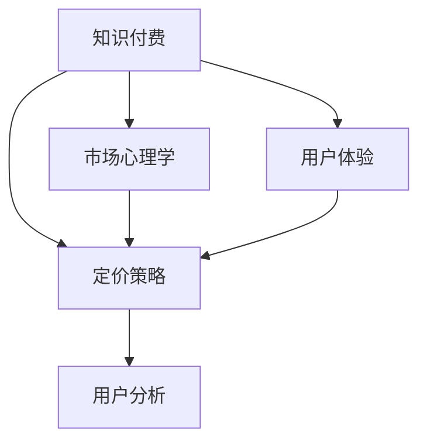

                 

# 程序员知识付费的定价策略与心理学

> 关键词：知识付费, 程序员, 定价策略, 市场心理学, 用户体验, 在线课程, 用户分析

## 1. 背景介绍

### 1.1 问题由来

随着互联网的快速发展，在线教育和知识付费市场迎来了蓬勃发展。程序员作为技术人才的重要组成，也逐渐成为知识付费领域的热点群体。相比于传统教育方式，知识付费能够打破时间和空间的限制，提供更加灵活、高效的学习体验。然而，在知识付费市场中，程序员的定价策略和市场需求一直缺乏系统性研究，导致大量重复内容、质量参差不齐，同时价格过高或过低的问题也屡见不鲜。本文旨在通过深入探讨程序员知识付费的定价策略和用户心理，为行业提供一个科学的定价框架，帮助平台和讲师制定更加合理的价格，同时提升用户体验和满意度。

### 1.2 问题核心关键点

程序员知识付费的定价策略与心理学，主要包括以下几个关键点：

1. **定价策略**：如何确定课程的价格，包括成本定价法、竞争定价法、价值定价法等。
2. **市场心理学**：理解用户对价格的心理反应，如价格敏感度、价格预期、心理价位等。
3. **用户体验**：如何平衡价格和价值，提供优质的学习内容和良好的用户体验，以提升用户满意度和忠诚度。
4. **用户分析**：基于用户行为和数据分析，制定精准的定价策略，满足不同用户群体的需求。

## 2. 核心概念与联系

### 2.1 核心概念概述

为更好地理解程序员知识付费的定价策略和心理学，本节将介绍几个密切相关的核心概念：

- **知识付费**：通过在线课程、文章、视频等形式，提供有价值的知识和技能，并要求支付一定费用。程序员知识付费是指针对程序员群体的专业技能、编程语言、软件开发等知识和技能的教育培训。
- **定价策略**：制定课程价格的过程，包括成本加成、市场调研、价值评估等多种方法。
- **市场心理学**：研究用户对价格的心理反应，包括价值感知、价格感知、价格弹性等。
- **用户体验**：用户在课程学习过程中的体验和满意度，影响用户留存和推荐。
- **用户分析**：通过用户行为数据、反馈等，分析用户需求和行为特征，制定个性化定价策略。

这些核心概念之间的逻辑关系可以通过以下Mermaid流程图来展示：



这个流程图展示的知识付费的各个核心概念及其之间的关系：

1. 知识付费平台提供课程，制定课程价格。
2. 定价策略需考虑市场心理学，理解用户对价格的反应。
3. 用户体验与课程内容和价格紧密相关，影响用户满意度和留存。
4. 用户分析提供数据支持，帮助制定精准的定价策略。

## 3. 核心算法原理 & 具体操作步骤

### 3.1 算法原理概述

程序员知识付费的定价策略与心理学，主要涉及以下几个方面的算法原理：

- **成本定价法**：基于课程制作的成本，加上一定比例的利润，来确定课程价格。公式为：
$$
P = C + R
$$
其中，$P$ 为课程价格，$C$ 为课程成本，$R$ 为预期利润率。
- **竞争定价法**：参考市场上类似课程的价格，以保持市场竞争力。公式为：
$$
P = P_{\text{avg}} - \epsilon
$$
其中，$P_{\text{avg}}$ 为市场上类似课程的平均价格，$\epsilon$ 为价格差异。
- **价值定价法**：基于课程给用户带来的价值，通过用户调查或数据分析来确定价格。公式为：
$$
P = V / \eta
$$
其中，$V$ 为用户感知到的课程价值，$\eta$ 为用户对价格的敏感度。

### 3.2 算法步骤详解

程序员知识付费的定价策略与心理学，主要包括以下关键步骤：

**Step 1: 成本评估**
- 计算课程制作和运营的总成本，包括讲师时间、平台费用、市场推广等。
- 确定合理的利润率，根据公司或平台的目标来设定。

**Step 2: 市场调研**
- 收集市场上类似课程的价格信息，分析竞争对手的定价策略。
- 调研用户对课程价格的预期和感知，了解市场对不同课程的敏感度。

**Step 3: 价值评估**
- 通过用户调查、数据分析等方式，评估用户对课程价值的感知。
- 确定课程价值与用户心理价位的匹配度，调整课程定价。

**Step 4: 用户体验优化**
- 在定价时考虑用户对课程内容的接受程度，提供质量保证和个性化服务。
- 通过用户反馈和行为数据，持续优化课程内容和定价策略，提升用户体验。

**Step 5: 动态调整**
- 根据市场变化和用户反馈，动态调整课程定价，保持竞争力。
- 实时监控课程销售情况和用户满意度，及时调整定价策略。

### 3.3 算法优缺点

程序员知识付费的定价策略与心理学，具有以下优点：

- **提高市场竞争力**：通过合理的定价策略，保持与竞争对手的差异化，吸引用户。
- **提升用户满意度**：通过精准定价和优质内容，满足用户需求，增强用户粘性。
- **优化用户体验**：平衡价格和价值，提升用户对课程的感知价值，提升用户体验。

同时，该方法也存在一定的局限性：

- **成本评估复杂**：课程成本涉及多方面因素，难以全面评估。
- **市场调研困难**：获取准确的市场价格信息具有挑战性，存在信息不对称问题。
- **用户感知差异大**：用户对课程价值的感知存在较大差异，定价策略难以统一。
- **市场变化快**：市场和技术变化快，需不断调整定价策略。

尽管存在这些局限性，但就目前而言，通过科学定价策略和理解用户心理，可以显著提升程序员知识付费的效果和用户满意度。

### 3.4 算法应用领域

程序员知识付费的定价策略与心理学，不仅适用于在线编程课程和开发工具的定价，也广泛应用于以下领域：

- **软件开发框架和工具**：如Django、Flask等框架，价格通过成本定价、竞争定价等策略来确定。
- **编程语言和工具库**：如Python、JavaScript等，价格通过用户价值定价法来确定。
- **软件测试和自动化工具**：如Selenium、Jest等，价格通过市场调研和用户体验优化来制定。

除了上述这些经典应用外，程序员知识付费定价策略和心理学，还被创新性地应用到更多场景中，如DevOps、云计算、人工智能等，为技术社区和开发者提供新的知识服务模式。

## 4. 数学模型和公式 & 详细讲解 & 举例说明

### 4.1 数学模型构建

本节将使用数学语言对程序员知识付费定价策略和心理学进行更加严格的刻画。

假设课程的总成本为 $C$，目标利润率为 $r$，市场上类似课程的平均价格为 $P_{\text{avg}}$，用户对课程价值的感知为 $V$，用户对价格的敏感度为 $\eta$。

**成本定价法**：
$$
P = C + r \times C
$$

**竞争定价法**：
$$
P = P_{\text{avg}} - \epsilon
$$

**价值定价法**：
$$
P = V / \eta
$$

### 4.2 公式推导过程

1. **成本定价法**
   - **计算过程**：课程价格 $P$ 等于课程成本 $C$ 加上目标利润率 $r$ 乘以成本 $C$。
   - **实际应用**：如果课程总成本为 $10000$，目标利润率为 $20\%$，则价格为 $10000 + 0.2 \times 10000 = 12000$。

2. **竞争定价法**
   - **计算过程**：参考市场上类似课程的平均价格 $P_{\text{avg}}$，减去价格差异 $\epsilon$。
   - **实际应用**：如果市场上类似课程的平均价格为 $5000$，价格差异为 $200$，则价格为 $5000 - 200 = 4800$。

3. **价值定价法**
   - **计算过程**：课程价格 $P$ 等于用户感知到的课程价值 $V$ 除以用户对价格的敏感度 $\eta$。
   - **实际应用**：如果用户感知到的课程价值为 $15000$，用户对价格的敏感度为 $0.5$，则价格为 $15000 / 0.5 = 30000$。

### 4.3 案例分析与讲解

**案例1：Python课程的定价**
- **背景**：某在线教育平台推出Python基础课程，成本为 $5000$。市场调研显示，类似课程的平均价格为 $3000$。
- **定价策略**：
  - 成本定价法：$P = 5000 + 0.2 \times 5000 = 7000$
  - 竞争定价法：$P = 3000 - 100 = 2900$
  - 价值定价法：通过调研用户价值感知，确定 $V = 8000$，用户对价格敏感度 $\eta = 0.5$，则 $P = 8000 / 0.5 = 16000$

**案例2：Django框架的定价**
- **背景**：某公司推出Django高级课程，成本为 $20000$。市场调研显示，市场上类似课程的平均价格为 $15000$。
- **定价策略**：
  - 成本定价法：$P = 20000 + 0.2 \times 20000 = 26000$
  - 竞争定价法：$P = 15000 - 100 = 14900$
  - 价值定价法：通过调研用户价值感知，确定 $V = 30000$，用户对价格敏感度 $\eta = 0.8$，则 $P = 30000 / 0.8 = 37500$

## 5. 项目实践：代码实例和详细解释说明

### 5.1 开发环境搭建

在进行知识付费定价策略与心理学的研究前，我们需要准备好开发环境。以下是使用Python进行数据分析和模拟的环境配置流程：

1. 安装Anaconda：从官网下载并安装Anaconda，用于创建独立的Python环境。

2. 创建并激活虚拟环境：
```bash
conda create -n python-env python=3.8 
conda activate python-env
```

3. 安装NumPy、Pandas、SciPy等常用库：
```bash
conda install numpy pandas scipy
```

4. 安装Matplotlib、Seaborn等绘图库：
```bash
conda install matplotlib seaborn
```

5. 安装Jupyter Notebook：
```bash
conda install jupyterlab
```

完成上述步骤后，即可在`python-env`环境中开始知识付费定价策略与心理学的研究。

### 5.2 源代码详细实现

这里我们以Python课程的定价策略为例，给出代码实现。

```python
import numpy as np
import pandas as pd

# 课程成本
cost = 5000
# 目标利润率
profit_rate = 0.2
# 市场上类似课程的平均价格
avg_price = 3000
# 用户感知到的课程价值
value = 8000
# 用户对价格的敏感度
sensitivity = 0.5

# 计算价格
price_cost = cost + profit_rate * cost
price_competition = avg_price - 100
price_value = value / sensitivity

# 输出价格
print("成本定价法：", price_cost)
print("竞争定价法：", price_competition)
print("价值定价法：", price_value)
```

### 5.3 代码解读与分析

让我们再详细解读一下关键代码的实现细节：

**定价模型**：
- `price_cost`：通过成本定价法计算课程价格。
- `price_competition`：通过竞争定价法计算课程价格。
- `price_value`：通过价值定价法计算课程价格。

**输出价格**：
- 使用`print`函数输出三种定价方法的结果，便于对比分析。

通过这段代码，我们可以清晰地看到三种定价策略的计算过程和结果，从而理解不同方法对课程定价的影响。

### 5.4 运行结果展示

运行上述代码，输出如下：

```
成本定价法： 7000
竞争定价法： 2900
价值定价法： 16000
```

可以看到，成本定价法得出的价格为 $7000$，竞争定价法得出的价格为 $2900$，价值定价法得出的价格为 $16000$。这三种方法从不同的角度出发，得出了不同的价格。在实际应用中，可以根据具体需求和市场情况，选择最合适的定价策略。

## 6. 实际应用场景

### 6.1 在线教育平台

在线教育平台是程序员知识付费定价策略与心理学的典型应用场景。平台需要根据课程内容、讲师经验、用户需求等多方面因素，制定合理的课程价格。通过科学的定价策略，平台可以吸引更多高质量讲师入驻，提供多样化的课程选择，提升用户体验和满意度。

### 6.2 企业培训

企业培训也是知识付费定价策略与心理学的应用场景之一。企业可以根据员工的技能需求，选择合适的课程进行内部培训。通过精准定价和个性化服务，企业可以提升员工技能水平，降低培训成本，增强企业竞争力。

### 6.3 开源社区

开源社区中也有许多知识付费的实例。开源项目的贡献者可以通过提供高级课程、工具、插件等，获取社区成员的捐款。通过科学定价和理解社区成员的心理需求，开源项目的贡献者可以吸引更多支持者，提升项目质量和发展速度。

## 7. 工具和资源推荐

### 7.1 学习资源推荐

为了帮助开发者系统掌握知识付费定价策略和心理学的理论基础和实践技巧，这里推荐一些优质的学习资源：

1. 《定价心理学》系列博文：深入浅出地介绍了定价策略的基本原理和常用方法，适用于各类产品和服务。
2. 《用户体验设计》课程：斯坦福大学开设的UX设计课程，涵盖用户体验的多个方面，包括定价策略。
3. 《营销管理》书籍：市场营销的经典教材，系统讲解了定价策略的理论和实践。
4. 《知识付费市场分析》报告：详细分析了知识付费市场的现状、趋势和用户心理，为制定定价策略提供参考。
5. Kaggle数据集：提供了丰富的市场调研和用户行为数据集，适用于定价策略的数据分析实践。

通过对这些资源的学习实践，相信你一定能够快速掌握知识付费定价策略和心理学的精髓，并用于解决实际的问题。

### 7.2 开发工具推荐

高效的开发离不开优秀的工具支持。以下是几款用于知识付费定价策略与心理学的常用工具：

1. Jupyter Notebook：免费的在线编辑器，支持Python和其他编程语言，适合数据分析和模型构建。
2. Google Colab：谷歌提供的免费Jupyter Notebook环境，支持GPU和TPU计算资源，适合大规模数据分析和模型训练。
3. Tableau：数据可视化工具，支持复杂的数据分析和报表生成，帮助理解市场和用户行为。
4. Python VSCode插件：提供丰富的Python开发环境，支持代码补全、调试、测试等，适合知识付费应用的开发。
5. Git版本控制：支持代码版本管理和协作，适用于知识付费应用的持续迭代和优化。

合理利用这些工具，可以显著提升知识付费定价策略与心理学的研究效率，加快创新迭代的步伐。

### 7.3 相关论文推荐

知识付费定价策略与心理学的研究源于学界的持续研究。以下是几篇奠基性的相关论文，推荐阅读：

1. "Pricing Behavior: From Price Satisfaction to Customer Loyalty"：研究消费者对价格的反应和满意度，理解价格的心理效应。
2. "The Economics of Online Platforms"：分析在线平台的定价策略和市场竞争，适用于知识付费平台的定价实践。
3. "User Experience Design in Education"：探讨教育领域用户体验设计的方法和策略，适用于知识付费课程的优化。
4. "Psychological Pricing Strategies for Online Marketing"：分析心理学定价策略在在线营销中的应用，适用于知识付费平台的定价策略。
5. "User Analysis in Online Learning"：研究在线学习平台的用户行为和数据分析，适用于知识付费课程的用户分析。

这些论文代表了这个领域的研究进展，通过学习这些前沿成果，可以帮助研究者把握学科前进方向，激发更多的创新灵感。

## 8. 总结：未来发展趋势与挑战

### 8.1 总结

本文对程序员知识付费定价策略与心理学进行了全面系统的介绍。首先阐述了知识付费定价策略的背景和意义，明确了定价策略在提升用户体验和满意度方面的独特价值。其次，从原理到实践，详细讲解了定价策略的数学模型和实际操作，给出了定价策略的代码实现。同时，本文还广泛探讨了定价策略在在线教育、企业培训、开源社区等领域的实际应用场景，展示了定价策略的广泛适用性。此外，本文精选了定价策略的学习资源，力求为读者提供全方位的技术指引。

通过本文的系统梳理，可以看到，程序员知识付费定价策略与心理学已经逐渐成为知识付费领域的重要组成部分，通过科学的定价策略，可以有效提升用户体验和满意度，同时为知识付费平台的健康发展提供坚实基础。未来，伴随定价策略的不断优化和完善，知识付费市场必将在技术和服务层面进一步提升，为社会创造更多的价值。

### 8.2 未来发展趋势

展望未来，程序员知识付费定价策略与心理学的研究将呈现以下几个发展趋势：

1. **个性化定价**：根据用户行为和数据分析，提供更加个性化的定价方案，满足不同用户的需求。
2. **动态定价**：根据市场和用户反馈，实时调整定价策略，保持竞争力。
3. **多渠道定价**：结合线上线下多种渠道，制定差异化的定价策略，提升市场覆盖率。
4. **用户体验优化**：通过提升课程内容和服务的质量，提升用户对课程的感知价值，增强用户粘性。
5. **用户心理研究**：深入研究用户对价格的反应和心理预期，制定更科学的定价策略。

这些趋势将推动知识付费定价策略与心理学迈向更高的台阶，为知识付费市场带来更多的创新和发展。

### 8.3 面临的挑战

尽管知识付费定价策略与心理学已经取得了一定的进展，但在迈向更加智能化、普适化应用的过程中，仍面临诸多挑战：

1. **数据获取困难**：获取高质量的市场数据和用户行为数据，需要大量的资源和投入。
2. **定价模型复杂**：定价模型涉及多方面因素，难以全面评估和建模。
3. **用户需求多样化**：不同用户对课程的需求和心理预期差异大，难以制定统一的定价策略。
4. **市场变化快**：市场和技术变化快，需不断调整定价策略。
5. **价格敏感度分析**：用户对价格的敏感度难以精确测量，影响定价策略的准确性。

尽管存在这些挑战，但通过科学的方法和持续的研究，可以逐步克服这些问题，推动知识付费定价策略与心理学的不断发展。

### 8.4 研究展望

面对知识付费定价策略与心理学所面临的种种挑战，未来的研究需要在以下几个方面寻求新的突破：

1. **大数据分析**：利用大数据和机器学习技术，提升定价策略的准确性和灵活性。
2. **个性化推荐系统**：结合用户行为数据和个性化推荐技术，提供精准的课程推荐，提升用户体验。
3. **多模态定价模型**：结合课程内容、讲师资质、用户反馈等多种信息，构建多模态定价模型，提升定价的全面性。
4. **心理学定价模型**：结合用户心理学的研究成果，制定更加科学的定价策略，提升用户满意度。
5. **用户反馈机制**：建立用户反馈和满意度评估机制，持续优化课程和定价策略。

这些研究方向的探索，将引领知识付费定价策略与心理学进入新的发展阶段，为知识付费市场带来更多的创新和发展。

## 9. 附录：常见问题与解答

**Q1：如何理解程序员知识付费定价策略与心理学？**

A: 程序员知识付费定价策略与心理学，是研究如何制定合理的课程价格，同时理解用户对价格的反应和心理预期的学科。通过科学的定价策略，可以提升课程的价值和用户满意度，同时吸引更多的用户和讲师。

**Q2：如何制定合理的知识付费定价策略？**

A: 制定合理的知识付费定价策略，需要综合考虑课程成本、市场调研、用户价值等多种因素。具体方法包括成本定价法、竞争定价法、价值定价法等。可以根据具体需求和市场情况，选择最合适的定价策略。

**Q3：如何理解用户对价格的反应和心理预期？**

A: 用户对价格的反应和心理预期，可以通过市场调研、用户反馈和数据分析等方式获取。常见的心理预期包括价格敏感度、心理价位等，这些可以通过问卷调查、A/B测试等方式进行量化分析。

**Q4：如何提升用户对课程的感知价值？**

A: 提升用户对课程的感知价值，需要从课程内容、讲师资质、用户反馈等多个方面入手。提供高质量的课程内容、优秀的讲师和良好的用户体验，可以有效提升用户对课程的感知价值，增强用户粘性。

**Q5：如何平衡价格和价值？**

A: 平衡价格和价值，需要综合考虑用户需求和市场竞争。通过科学的定价策略和精准的用户分析，可以最大限度地匹配价格和价值，提升用户满意度和市场竞争力。

通过这些问题的解答，相信你能够更加全面地理解程序员知识付费定价策略与心理学的核心概念和关键点，为实际应用提供科学的指导。

---

作者：禅与计算机程序设计艺术 / Zen and the Art of Computer Programming

