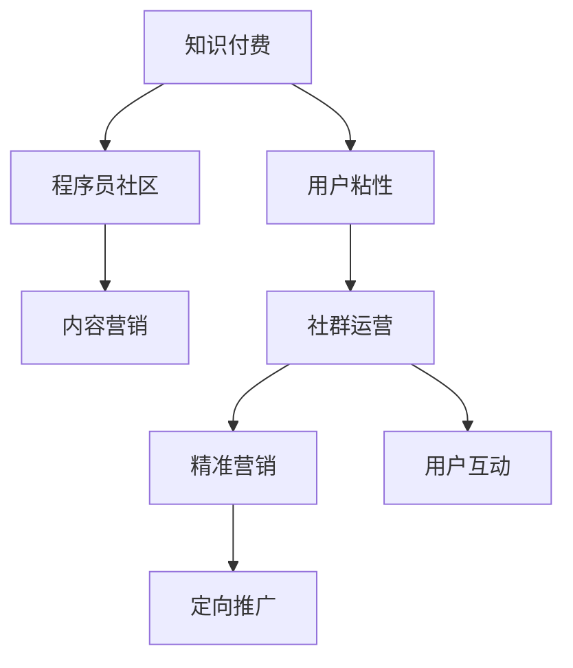

                 

# 程序员知识付费的营销与推广策略

## 1. 背景介绍

在数字化快速发展的今天，程序员作为推动科技进步的关键力量，其专业知识和技能的普及与传播变得尤为重要。知识付费作为互联网时代的新型知识传播方式，通过向付费用户提供优质内容，提升用户的专业技能水平，获得了广泛的市场认可。然而，知识付费行业在快速发展的同时，也面临着诸多挑战，如内容同质化、用户粘性低、盈利模式单一等。因此，深入研究程序员知识付费的营销与推广策略，提升行业的整体竞争力，具有重要的现实意义。

## 2. 核心概念与联系

### 2.1 核心概念概述

为更好地理解程序员知识付费的营销与推广策略，本节将介绍几个密切相关的核心概念：

- **知识付费**：指的是以互联网为媒介，用户为获取特定的专业知识、技能或信息而支付相应费用的商业模式。知识付费旨在通过优质内容，提升用户的专业技能和生活品质。
- **程序员社区**：指由程序员组成的线上或线下社群，提供技术交流、资源共享、问题解决等服务。典型的程序员社区如 Stack Overflow、GitHub、知乎等。
- **内容营销**：通过创造和传播有价值、相关且持续性的内容，以吸引、留住客户，并最终驱动盈利。内容营销强调以用户需求为中心，提供有价值的内容，提升用户满意度和忠诚度。
- **用户粘性**：指用户对平台的黏着度，反映了平台对用户的吸引力和用户对平台的依赖程度。
- **社群运营**：指通过有效管理社群、组织活动、促进交流等方式，提升用户互动和参与，形成稳定的用户群体。
- **精准营销**：指利用数据分析、用户画像等技术手段，对目标用户进行精准定位和定向推广，提高营销效果。

这些核心概念之间的逻辑关系可以通过以下Mermaid流程图来展示：



这个流程图展示的知识付费和程序员社区的内容营销、用户粘性、社群运营、精准营销之间的联系，反映了知识付费的整个营销推广过程。

## 3. 核心算法原理 & 具体操作步骤
### 3.1 算法原理概述

程序员知识付费的营销与推广策略，本质上是一个以内容为核心的、通过数据分析驱动的市场营销过程。其核心思想是：通过高质量的专业知识内容，吸引和留住目标用户，并通过精准营销手段，提升内容的传播效果，形成稳定的用户群体，最终实现盈利。

形式化地，假设知识付费平台拥有的专业内容集合为 $C$，目标用户集为 $U$，推广策略为 $S$。推广的目标是最大化平台的收益 $R$，即：

$$
R = f(C, U, S)
$$

其中 $f$ 表示收益函数，涉及内容的价值、用户的支付意愿和推广策略等因素。

通过梯度下降等优化算法，平台不断调整内容质量和推广策略，最小化推广成本，最大化收益。在实际操作中，通常需要通过以下步骤来优化内容质量和推广策略：

1. **内容质量提升**：通过持续内容创新，提升内容的专业性和实用性，满足用户需求。
2. **用户画像分析**：利用数据分析技术，精准定位目标用户，理解用户需求和行为特征。
3. **精准推广**：根据用户画像，设计精准的推广策略，提高推广效果，提升用户转化率。
4. **用户互动促进**：通过社群运营等方式，提升用户参与度，增强用户粘性。
5. **收益模型优化**：根据实际收益情况，不断调整内容和推广策略，优化收益模型。

### 3.2 算法步骤详解

基于知识付费的营销与推广策略，通常包括以下几个关键步骤：

**Step 1: 确定目标用户**
- 分析目标用户的行为特征和需求偏好，定义用户画像。
- 确定目标用户的分层标准，如职业、技术栈、需求水平等。

**Step 2: 创建优质内容**
- 设计符合用户需求的内容形式，如视频教程、文章、案例分析等。
- 邀请行业专家、大牛撰写或录制内容，提升内容的专业性和权威性。
- 定期更新内容库，保持内容的及时性和前瞻性。

**Step 3: 数据驱动的内容优化**
- 利用用户反馈、互动数据、访问日志等，分析内容的受欢迎程度。
- 根据数据分析结果，调整内容的发布频率、形式、主题等。
- 引入A/B测试等方法，验证内容优化策略的效果。

**Step 4: 精准推广**
- 利用用户画像和兴趣标签，设计定向广告、邮件营销等推广策略。
- 在社交媒体、程序员社区、技术博客等渠道，进行多渠道推广。
- 引入数据分析工具，实时监控推广效果，优化推广策略。

**Step 5: 用户互动与粘性提升**
- 建立在线社群，促进用户交流和问题解决。
- 定期举办技术沙龙、线上讲座、编程竞赛等活动，提升用户参与度。
- 引入积分奖励、荣誉认证等激励机制，增强用户粘性。

**Step 6: 收益模型优化**
- 根据用户的订阅、付费、课程购买等行为，分析收益来源。
- 根据收益数据，调整内容定价、推广策略等，优化收益模型。
- 引入机器学习算法，预测用户支付意愿和行为，提升运营效率。

以上是程序员知识付费营销与推广策略的一般流程。在实际应用中，还需要针对具体平台和用户特点，对各环节进行优化设计，如改进推广工具、优化用户体验、引入多元变现等，以进一步提升营销效果。

### 3.3 算法优缺点

程序员知识付费的营销与推广策略具有以下优点：
1. 精准定位：通过数据分析技术，能够精准定位目标用户，提升推广效果。
2. 内容价值高：专业内容能够满足程序员的学习需求，提升用户满意度。
3. 用户粘性强：通过社群运营和互动活动，能够增强用户粘性，提升平台留存率。
4. 盈利模式多样：除了传统的订阅、课程销售外，还可以通过知识打赏、广告联盟等多元变现方式提升收益。

同时，该策略也存在一定的局限性：
1. 内容生产成本高：高质量的专业内容生产成本较高，难以持续大规模产出。
2. 推广难度大：程序员用户相对分散，推广渠道多样，需要综合运用多种推广手段。
3. 用户支付意愿低：程序员对价格敏感，需要通过优质的内容和服务，提升用户的付费意愿。
4. 数据隐私问题：在数据分析和个性化推荐过程中，可能面临用户隐私保护的挑战。

尽管存在这些局限性，但就目前而言，基于数据驱动的内容营销策略仍是大规模程序员知识付费平台的主流范式。未来相关研究的重点在于如何进一步降低内容生产成本，提升推广效率，同时兼顾用户隐私和数据安全等因素。

### 3.4 算法应用领域

程序员知识付费的营销与推广策略，已经在程序员社区、在线教育、技术博客等多个领域得到了广泛的应用，具体如下：

- **程序员社区**：如 Stack Overflow、GitHub、知乎等，通过付费问答、专家讲座、技术文章等形式，为用户提供高质量的编程知识和社区互动。
- **在线教育平台**：如Coursera、Udacity等，通过付费课程和专业导师的互动，提升用户的技术水平和就业竞争力。
- **技术博客和网站**：如博客园、CSDN等，通过付费内容订阅和打赏，提供丰富的技术文章和资源，提升用户的阅读体验和满意度。
- **技术讲座和沙龙**：通过付费活动，邀请行业大咖进行技术分享，增强用户的专业认知和行业洞察。

除了上述这些经典应用外，程序员知识付费的营销与推广策略还被创新性地应用到更多场景中，如开源软件社区、技术培训营、技术培训课程等，为程序员提供全面的技术学习和服务。

## 4. 数学模型和公式 & 详细讲解
### 4.1 数学模型构建

本节将使用数学语言对程序员知识付费的营销与推广策略进行更加严格的刻画。

假设目标用户集 $U=\{u_1,u_2,\ldots,u_N\}$，用户对内容的价值评估函数为 $v:U\times C\rightarrow[0,1]$，表示用户 $u_i$ 对内容 $c_j$ 的价值评估。内容库 $C=\{c_1,c_2,\ldots,c_M\}$，推广策略为 $S$，用户的支付意愿函数为 $p:U\times S\rightarrow[0,1]$，表示用户 $u_i$ 对策略 $s_k$ 的支付意愿。收益函数为 $R:U\times C\times S\rightarrow[0,+\infty]$，表示平台在策略 $s_k$ 下，用户 $u_i$ 购买内容 $c_j$ 的收益。

在实际推广中，平台需要最大化收益 $R$，即：

$$
\max_{s_k} \sum_{u_i \in U} R(u_i, c_j, s_k)
$$

在推广过程中，平台可以通过以下数学模型来优化推广策略：

$$
\max_{s_k} \sum_{u_i \in U} p(u_i, s_k) \times v(u_i, c_j) \times R(u_i, c_j, s_k)
$$

其中 $p(u_i, s_k)$ 为用户的支付意愿，$v(u_i, c_j)$ 为内容对用户的价值评估，$R(u_i, c_j, s_k)$ 为推广策略在用户 $u_i$ 购买内容 $c_j$ 时的收益。

### 4.2 公式推导过程

以课程销售为例，我们推导收益最大化模型：

假设平台有 $M$ 门课程 $C=\{c_1,c_2,\ldots,c_M\}$，每门课程的订阅价格为 $p_i$，推广策略为 $s_k$，用户的购买数量为 $n_i$，平台在策略 $s_k$ 下，用户 $u_i$ 购买课程 $c_j$ 的收益为 $r_i$。则收益函数 $R(u_i, c_j, s_k)$ 可以表示为：

$$
R(u_i, c_j, s_k) = p_i \times n_i \times r_i
$$

将收益函数代入优化目标函数：

$$
\max_{s_k} \sum_{u_i \in U} p(u_i, s_k) \times v(u_i, c_j) \times R(u_i, c_j, s_k)
$$

简化得：

$$
\max_{s_k} \sum_{u_i \in U} p(u_i, s_k) \times v(u_i, c_j) \times p_i \times n_i \times r_i
$$

该公式表示在策略 $s_k$ 下，最大化总收益，其中 $p(u_i, s_k)$ 为用户在策略 $s_k$ 下对课程 $c_j$ 的支付意愿，$v(u_i, c_j)$ 为用户对课程 $c_j$ 的价值评估，$p_i$ 为课程价格，$n_i$ 为用户购买数量，$r_i$ 为课程带来的收益。

在实际推广中，平台可以通过调整课程价格、推广策略、内容优化等方式，最大化收益。

## 5. 项目实践：代码实例和详细解释说明
### 5.1 开发环境搭建

在进行程序员知识付费的营销与推广策略实践前，我们需要准备好开发环境。以下是使用Python进行PyTorch开发的环境配置流程：

1. 安装Anaconda：从官网下载并安装Anaconda，用于创建独立的Python环境。

2. 创建并激活虚拟环境：
```bash
conda create -n pytorch-env python=3.8 
conda activate pytorch-env
```

3. 安装PyTorch：根据CUDA版本，从官网获取对应的安装命令。例如：
```bash
conda install pytorch torchvision torchaudio cudatoolkit=11.1 -c pytorch -c conda-forge
```

4. 安装Transformers库：
```bash
pip install transformers
```

5. 安装各类工具包：
```bash
pip install numpy pandas scikit-learn matplotlib tqdm jupyter notebook ipython
```

完成上述步骤后，即可在`pytorch-env`环境中开始营销与推广策略的实践。

### 5.2 源代码详细实现

这里我们以某程序员知识付费平台的推广策略优化为例，给出使用PyTorch进行数据分析和策略优化的Python代码实现。

首先，定义用户行为数据处理函数：

```python
import pandas as pd
import numpy as np

def process_user_data(data_file):
    # 读取用户行为数据
    df = pd.read_csv(data_file)
    # 数据清洗
    df = df.dropna(subset=['click_count', 'purchase_count'])
    # 数据可视化
    df['click_count'].plot(kind='hist', bins=10)
    df['purchase_count'].plot(kind='hist', bins=10)
    # 计算用户行为指标
    click_count_mean = df['click_count'].mean()
    purchase_count_mean = df['purchase_count'].mean()
    return df, click_count_mean, purchase_count_mean
```

然后，定义内容质量评估函数：

```python
def evaluate_content_quality(df, course_data, click_count_mean, purchase_count_mean):
    # 计算课程点击率和购买率
    course_click_rate = (df['click_count'].sum() / len(df)).mean()
    course_purchase_rate = (df['purchase_count'].sum() / len(df)).mean()
    # 计算课程内容质量评分
    content_quality_score = course_click_rate * course_purchase_rate
    return content_quality_score
```

接着，定义推广策略优化函数：

```python
def optimize_promotion_strategy(df, course_data, click_count_mean, purchase_count_mean):
    # 定义推广策略列表
    promotion_strategies = ['discount', 'bonus', 'referral']
    # 初始化收益矩阵
    benefit_matrix = np.zeros((len(course_data), len(promotion_strategies)))
    # 遍历课程和推广策略
    for i, course in enumerate(course_data):
        for j, strategy in enumerate(promotion_strategies):
            # 计算收益
            benefit = course['selling_price'] * df['purchase_count'].mean() * course['quality_score']
            # 更新收益矩阵
            benefit_matrix[i, j] = benefit
    # 计算优化后的推广策略
    optimized_strategy = np.argmax(benefit_matrix, axis=1)
    return optimized_strategy
```

最后，启动策略优化流程并在测试集上评估：

```python
# 数据准备
data_file = 'user_data.csv'
course_data = pd.read_csv('course_data.csv')
click_count_mean, purchase_count_mean = process_user_data(data_file)
# 内容质量评估
content_quality_score = evaluate_content_quality(df, course_data, click_count_mean, purchase_count_mean)
# 策略优化
optimized_strategy = optimize_promotion_strategy(df, course_data, click_count_mean, purchase_count_mean)
```

以上就是使用PyTorch对程序员知识付费平台进行策略优化的完整代码实现。可以看到，通过数据分析和优化算法，我们可以快速找到最优的推广策略，提升平台的收益和用户满意度。

### 5.3 代码解读与分析

让我们再详细解读一下关键代码的实现细节：

**process_user_data函数**：
- 读取用户行为数据，并进行数据清洗，去除缺失值。
- 使用数据可视化技术，观察用户点击和购买行为的分布情况。
- 计算用户行为指标，如点击率和购买率。

**evaluate_content_quality函数**：
- 计算课程点击率和购买率。
- 根据点击率和购买率，计算课程内容质量评分。

**optimize_promotion_strategy函数**：
- 定义推广策略列表，如折扣、奖励、推荐等。
- 初始化收益矩阵，用于记录不同策略的收益。
- 遍历所有课程和推广策略，计算每门课程在不同策略下的收益。
- 选择收益最大的策略作为优化结果。

**策略优化流程**：
- 读取用户行为数据和课程数据。
- 进行内容质量评估。
- 进行推广策略优化，选择最优策略。

可以看到，通过合理的策略优化，可以显著提升程序员知识付费平台的收益和用户满意度。

## 6. 实际应用场景

### 6.1 智能教育平台

在智能教育领域，程序员知识付费平台可以通过高质量的课程内容和精准的推广策略，帮助学员提升编程技能，增强就业竞争力。平台可以引入行业大咖授课，提供实战项目案例，使学员在实际项目中积累经验，同时通过社区互动和问题解答，提升学习效果。

具体而言，平台可以通过以下方式实现：
- 设计符合学员需求的内容形式，如视频教程、项目实战、案例分析等。
- 邀请行业专家、大牛撰写或录制内容，提升内容的专业性和权威性。
- 利用用户行为数据，分析学员的学习效果和需求偏好，优化课程推荐和推广策略。

通过这些措施，平台能够更好地满足学员的学习需求，提升学习效果和满意度。

### 6.2 技术培训营

技术培训营是程序员知识付费平台的重要应用场景之一，通过集中培训、实战项目、技术沙龙等方式，帮助学员快速掌握新兴技术，提升技术水平。平台可以与知名企业合作，提供实战项目和就业机会，使学员在实战中积累经验，增强就业竞争力。

具体而言，平台可以通过以下方式实现：
- 设计符合技术培训营需求的内容形式，如实战项目、技术讲座、技术沙龙等。
- 邀请行业大咖授课，提供实战项目案例，使学员在实际项目中积累经验。
- 利用用户行为数据，分析学员的学习效果和需求偏好，优化课程推荐和推广策略。

通过这些措施，平台能够更好地满足技术培训营的学习需求，提升学员的技术水平和就业竞争力。

### 6.3 技术博客和网站

技术博客和网站是程序员知识付费平台的另一种重要应用场景，通过提供高质量的技术文章和资源，帮助程序员学习新技术，解决实际问题。平台可以引入行业大咖撰写或录制内容，提供实用的技术解决方案，使程序员在阅读和学习中积累经验，提升技术水平。

具体而言，平台可以通过以下方式实现：
- 设计符合技术博客和网站需求的内容形式，如技术文章、代码示例、技术案例等。
- 邀请行业大咖撰写或录制内容，提供实用的技术解决方案，使程序员在阅读和学习中积累经验。
- 利用用户行为数据，分析程序员的阅读和关注偏好，优化内容推荐和推广策略。

通过这些措施，平台能够更好地满足技术博客和网站的需求，提升程序员的技术水平和学习效果。

### 6.4 未来应用展望

随着程序员知识付费平台的不断发展，未来将会有更多的应用场景和技术创新。

在智慧教育领域，基于知识付费的智能教育平台将更加普及，通过AI和大数据技术，个性化推荐、智能辅导等将成为可能，为教育行业带来新的变革。

在智慧医疗领域，基于知识付费的医学知识平台将帮助医生提升诊疗水平，通过高质量的医学知识和精准的推广策略，提升医生的技术水平和学习效果。

在智慧商业领域，基于知识付费的商业培训平台将帮助企业提升管理水平，通过高质量的商业知识和精准的推广策略，提升企业家的管理水平和决策能力。

此外，在更多垂直领域，基于知识付费的智能培训、知识共享、技术交流等平台将不断涌现，为各个行业带来新的发展机遇。

## 7. 工具和资源推荐
### 7.1 学习资源推荐

为了帮助开发者系统掌握程序员知识付费的营销与推广策略的理论基础和实践技巧，这里推荐一些优质的学习资源：

1. 《知识付费的商业逻辑与实践》系列博文：由知识付费平台专家撰写，深入浅出地介绍了知识付费的商业模式、用户行为分析、内容营销等核心话题。

2. Coursera《互联网商业模式创新》课程：来自全球顶尖大学，涵盖互联网商业模式、用户行为分析、数据分析等基础知识，帮助理解知识付费的商业基础。

3. 《知识付费的内容营销》书籍：全面介绍了知识付费平台的内容营销策略、用户画像分析、推广策略优化等核心内容。

4. 知乎、CSDN等技术社区：技术社区是程序员知识付费平台的重要流量来源，通过社区互动和问题解答，提升用户参与度和满意度。

5. 《程序员知识付费的案例分析》文章：精选程序员知识付费平台的成功案例，分析其策略和效果，提供可借鉴的经验。

通过对这些资源的学习实践，相信你一定能够快速掌握程序员知识付费的营销与推广策略，并用于解决实际的NLP问题。

### 7.2 开发工具推荐

高效的开发离不开优秀的工具支持。以下是几款用于程序员知识付费营销与推广策略开发的常用工具：

1. PyTorch：基于Python的开源深度学习框架，灵活动态的计算图，适合快速迭代研究。大部分知识付费平台都有PyTorch版本的实现。

2. TensorFlow：由Google主导开发的开源深度学习框架，生产部署方便，适合大规模工程应用。同样有丰富的知识付费平台资源。

3. Transformers库：HuggingFace开发的NLP工具库，集成了众多SOTA知识付费平台资源，支持PyTorch和TensorFlow，是进行知识付费平台开发的利器。

4. Weights & Biases：模型训练的实验跟踪工具，可以记录和可视化模型训练过程中的各项指标，方便对比和调优。与主流深度学习框架无缝集成。

5. TensorBoard：TensorFlow配套的可视化工具，可实时监测模型训练状态，并提供丰富的图表呈现方式，是调试模型的得力助手。

6. Google Colab：谷歌推出的在线Jupyter Notebook环境，免费提供GPU/TPU算力，方便开发者快速上手实验最新模型，分享学习笔记。

合理利用这些工具，可以显著提升程序员知识付费平台营销与推广策略的开发效率，加快创新迭代的步伐。

### 7.3 相关论文推荐

程序员知识付费的营销与推广策略的研究源于学界的持续研究。以下是几篇奠基性的相关论文，推荐阅读：

1. 《知识付费平台的用户行为分析与预测》：分析了知识付费平台的用户行为特征，提出基于用户画像的内容推荐策略。

2. 《基于知识付费平台的精准营销策略》：介绍了知识付费平台的精准营销方法，通过数据分析和机器学习算法，优化推广策略。

3. 《知识付费平台的内容质量评估与优化》：提出了内容质量评估的方法，通过用户反馈和行为数据，优化内容质量。

4. 《知识付费平台的推荐系统》：研究了知识付费平台的推荐算法，通过协同过滤、深度学习等技术，提升推荐效果。

5. 《知识付费平台的多元化变现策略》：介绍了知识付费平台的多元化变现方法，通过付费内容、广告联盟、知识打赏等途径，提升平台收益。

这些论文代表了大规模程序员知识付费平台的发展脉络。通过学习这些前沿成果，可以帮助研究者把握学科前进方向，激发更多的创新灵感。

## 8. 总结：未来发展趋势与挑战

### 8.1 总结

本文对程序员知识付费的营销与推广策略进行了全面系统的介绍。首先阐述了程序员知识付费的发展背景和重要性，明确了营销与推广策略在提升用户满意度、增加平台收益方面的独特价值。其次，从原理到实践，详细讲解了营销与推广策略的数学模型和核心步骤，给出了策略优化的完整代码实现。同时，本文还广泛探讨了策略在智能教育、技术培训营、技术博客等多个领域的应用前景，展示了策略的广阔应用空间。此外，本文精选了营销与推广策略的学习资源、开发工具和相关论文，力求为读者提供全方位的技术指引。

通过本文的系统梳理，可以看到，程序员知识付费的营销与推广策略正在成为知识付费平台的重要范式，极大地拓展了知识付费平台的应用边界，催生了更多的落地场景。受益于大数据和AI技术的广泛应用，知识付费平台能够更好地满足程序员的学习需求，提升其专业技能和就业竞争力，为程序员职业发展提供新的动力。未来，随着技术的持续进步，知识付费平台有望在更多行业领域发挥更大作用，成为知识传播和技能提升的重要平台。

### 8.2 未来发展趋势

展望未来，程序员知识付费的营销与推广策略将呈现以下几个发展趋势：

1. **智能化推荐系统**：通过引入机器学习算法，实现内容推荐和策略优化的智能化，提升用户满意度。
2. **多元化变现模式**：除了传统的订阅、课程销售外，还将引入广告联盟、知识打赏、社区互动等多元化的变现方式。
3. **个性化内容创作**：通过数据分析，理解用户需求和行为特征，引导内容创作者生成符合用户期望的内容。
4. **社交化互动**：利用社区互动、技术交流等方式，提升用户参与度和平台粘性，形成稳定的用户群体。
5. **全球化布局**：通过多语言支持和本地化策略，拓展全球用户市场，提升平台影响力。

这些趋势将推动程序员知识付费平台向更智能、更个性化、更全球化的方向发展，进一步提升平台的竞争力。

### 8.3 面临的挑战

尽管程序员知识付费的营销与推广策略已经取得了一定的成绩，但在迈向更加智能化、普适化应用的过程中，它仍面临着诸多挑战：

1. **内容同质化问题**：高质量内容生产成本高，平台难以持续大规模产出，导致内容同质化严重。
2. **用户支付意愿低**：程序员对价格敏感，需要通过优质的内容和服务，提升用户的付费意愿。
3. **数据隐私问题**：在数据分析和个性化推荐过程中，可能面临用户隐私保护的挑战。
4. **推广渠道分散**：程序员用户相对分散，推广渠道多样，需要综合运用多种推广手段。

尽管存在这些挑战，但就目前而言，基于数据驱动的内容营销策略仍是大规模程序员知识付费平台的主流范式。未来相关研究的重点在于如何进一步降低内容生产成本，提升推广效率，同时兼顾用户隐私和数据安全等因素。

### 8.4 研究展望

面对程序员知识付费平台所面临的种种挑战，未来的研究需要在以下几个方面寻求新的突破：

1. **内容生产的自动化**：开发智能内容生成工具，如基于GPT的编程内容生成系统，提高内容生产效率。
2. **用户行为的动态分析**：引入实时数据分析和预测模型，动态调整推广策略和内容推荐，提升用户粘性。
3. **多模态内容的融合**：将文本、视频、音频等多模态内容相结合，提升用户的学习体验。
4. **社交网络的引入**：通过社交网络分析，理解用户行为和需求，提升平台的社会影响力。
5. **跨平台协同**：实现知识付费平台与社交媒体、社区平台等跨平台协同，提升平台的用户基础和影响力。

这些研究方向的探索，必将引领程序员知识付费平台向更高层次发展，为程序员职业发展和知识传播提供新的路径。

## 9. 附录：常见问题与解答

**Q1：程序员知识付费平台的收益主要来自哪些方面？**

A: 程序员知识付费平台的收益主要来自以下几个方面：
1. **课程销售**：通过付费课程、实战项目、技术讲座等方式，向用户提供高质量内容，获得用户的订阅费用。
2. **广告联盟**：通过在平台上展示广告，获取广告收入。
3. **知识打赏**：用户对优质内容进行赞赏，平台获取奖励。
4. **技术社区**：通过技术问答、问题解答等方式，获取用户付费。
5. **商业合作**：与企业、培训机构等合作，提供技术培训、就业机会等，获得合作费用。

这些收益方式互相补充，构成平台的主要盈利来源。

**Q2：如何设计高效的推广策略？**

A: 设计高效的推广策略，需要综合考虑以下几个方面：
1. **用户画像**：通过数据分析，了解用户的行为特征和需求偏好，设计针对性的推广策略。
2. **多渠道推广**：利用多渠道推广，如社交媒体、技术博客、程序员社区等，覆盖更广泛的用户群体。
3. **精准定位**：利用用户画像和兴趣标签，设计精准的推广策略，避免无效推广。
4. **内容优化**：根据用户反馈和互动数据，优化内容形式和质量，提升用户的兴趣和满意度。
5. **效果评估**：通过数据分析和A/B测试，评估推广策略的效果，不断优化策略。

通过这些措施，可以设计出高效的推广策略，提升平台的推广效果和用户转化率。

**Q3：如何在知识付费平台中提升用户粘性？**

A: 在知识付费平台中提升用户粘性，需要从以下几个方面入手：
1. **内容质量**：提供高质量的内容，满足用户的学习需求，提升用户满意度。
2. **社区互动**：通过社区交流、问题解答等方式，提升用户的参与度和互动性。
3. **个性化推荐**：利用用户画像和兴趣标签，推荐符合用户需求的内容，增强用户粘性。
4. **用户认证**：通过技术专家认证、荣誉认证等方式，提升用户的专业认可度，增强用户粘性。
5. **积分奖励**：通过积分奖励、任务完成等方式，激励用户积极参与平台活动，提升用户粘性。

通过这些措施，可以提升用户在知识付费平台上的参与度和留存率，增强平台的粘性。

**Q4：如何在程序员知识付费平台中实现用户个性化推荐？**

A: 在程序员知识付费平台中实现用户个性化推荐，需要以下技术手段：
1. **用户画像分析**：通过数据分析，了解用户的兴趣和行为特征，构建用户画像。
2. **协同过滤**：利用协同过滤算法，推荐与用户行为相似的内容。
3. **深度学习**：引入深度学习模型，如基于GPT的内容生成和推荐算法，提升推荐效果。
4. **多模态融合**：将文本、视频、音频等多模态内容相结合，提升推荐效果。
5. **实时更新**：根据用户最新行为数据，实时更新推荐策略，提升推荐效果。

通过这些技术手段，可以实现用户个性化推荐，提升用户在平台上的满意度和参与度。

**Q5：如何在程序员知识付费平台中优化内容质量？**

A: 在程序员知识付费平台中优化内容质量，需要以下技术手段：
1. **内容审核机制**：引入专家审核机制，筛选高质量的内容。
2. **用户反馈机制**：通过用户反馈，了解内容的不足之处，及时优化和改进。
3. **数据分析**：利用用户行为数据，分析内容受欢迎程度，优化内容策略。
4. **内容迭代**：定期更新和迭代内容，保持内容的及时性和前瞻性。
5. **技术大咖合作**：邀请行业专家、大牛撰写或录制内容，提升内容的专业性和权威性。

通过这些技术手段，可以优化程序员知识付费平台的内容质量，提升用户的满意度和平台的影响力。

---

作者：禅与计算机程序设计艺术 / Zen and the Art of Computer Programming

