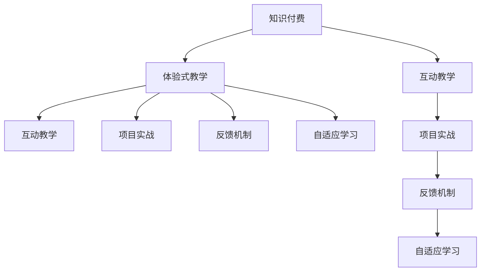

                 

# 程序员知识付费：打造体验式教学

> 关键词：知识付费,体验式教学,在线教育,编程教学,互动教学

## 1. 背景介绍

### 1.1 问题由来
随着互联网和信息技术的发展，在线教育正成为越来越多人获取知识的重要渠道。在线教育平台通过视频课程、文档、论坛等形式，打破了传统课堂的时空限制，让学习者可以自主选择学习内容和节奏。然而，在线教育也面临诸多挑战，如学习效果难以评估、学习动力不足、课程质量参差不齐等。这些问题使得许多学习者在支付了高昂的课程费用后，往往难以获得满意的学习体验和显著的提升效果。

### 1.2 问题核心关键点
知识付费作为在线教育的一种商业模式，以收费形式获取优质教学内容和服务，帮助学习者提升技能，提高职场竞争力。然而，知识付费并不等同于优质教育，许多在线课程因缺乏互动、练习、项目实战等体验式教学手段，导致学习效果不佳。为了解决这些问题，提出了一种体验式教学方法，通过交互式练习、模拟项目、实时反馈等手段，提升学习者的学习体验和效果。

### 1.3 问题研究意义
构建一种以学员为中心、基于体验式教学的在线教育平台，对于提升学习效果、提高用户满意度、实现教育公平，具有重要意义：

1. **提升学习效果**：通过交互式练习、模拟项目等体验式教学手段，帮助学习者更深入地理解和应用所学知识，解决传统在线课程“听得多，练得少”的问题。
2. **提高用户满意度**：提供实时反馈、在线咨询、项目实战等多样化服务，增强学习者的学习动力和成就感，降低流失率。
3. **实现教育公平**：以收费形式提供优质教学资源和服务，缩小城乡、区域之间的教育差距，帮助更多人有机会获取高质量的教育。

## 2. 核心概念与联系

### 2.1 核心概念概述

为更好地理解体验式教学方法，本节将介绍几个密切相关的核心概念：

- **知识付费**：通过付费形式获取优质教育资源和服务，帮助学习者提升专业技能，提高职场竞争力。
- **体验式教学**：通过交互式练习、模拟项目、实时反馈等手段，提升学习者的学习体验和效果，解决传统在线课程“听得多，练得少”的问题。
- **互动教学**：通过课堂讨论、在线问答、小组项目等互动形式，增强学习者之间的交流与合作，促进深度学习。
- **项目实战**：通过模拟项目、实战练习等手段，帮助学习者将所学知识应用于实际工作，提升实战能力和解决问题的能力。
- **反馈机制**：通过实时反馈、作业评审、同伴互评等手段，及时了解学习者的学习进度和问题，调整教学策略。
- **自适应学习**：根据学习者的学习进度和反馈，动态调整教学内容和难度，个性化推荐课程和习题，提升学习效率。

这些核心概念之间的逻辑关系可以通过以下Mermaid流程图来展示：



这个流程图展示了这个系统的核心概念及其之间的关系：

1. 知识付费提供优质的教育资源和服务。
2. 体验式教学通过互动和项目实战，提升学习效果。
3. 互动教学增强学习者的交流与合作。
4. 项目实战帮助学习者将所学知识应用于实际工作。
5. 反馈机制提供实时反馈，调整教学策略。
6. 自适应学习根据学习者情况动态调整教学内容。

这些概念共同构成了体验式教学的学习框架，使其能够在各种场景下发挥最大的效能。通过理解这些核心概念，我们可以更好地把握体验式教学的工作原理和优化方向。

## 3. 核心算法原理 & 具体操作步骤
### 3.1 算法原理概述

体验式教学的核心算法原理是通过互动和模拟项目，将学习者带入真实的工作场景，提升其解决问题的能力和实战技能。其核心思想是：通过交互式练习、模拟项目、实时反馈等手段，帮助学习者更深入地理解和应用所学知识，解决传统在线课程“听得多，练得少”的问题。

形式化地，假设知识付费平台上有 $N$ 个课程，每个课程包含 $M$ 个教学模块，学习者需要完成 $K$ 个项目实战任务。体验式教学的目标是找到最合适的教学模块和学习路径，使得学习者在完成 $K$ 个项目实战任务后，能够达到预定的学习效果。

定义学习者的学习进度为 $p_i$，表示学习者在第 $i$ 个教学模块上的进度，$p_i \in [0,1]$。目标是通过优化算法调整教学模块和学习路径，最小化学习者完成 $K$ 个项目实战任务所需的总学习时间 $t$，即：

$$
\mathop{\min}_{p_i} \sum_{i=1}^{M} p_i^2 \times t_i
$$

其中 $t_i$ 表示学习者完成第 $i$ 个教学模块所需的平均时间。

### 3.2 算法步骤详解

体验式教学的优化算法包括以下几个关键步骤：

**Step 1: 准备教学资源和数据集**
- 收集整理课程内容，包括教学模块、习题、案例、项目实战等资源。
- 根据课程内容和难度，设置每个教学模块的学习进度要求 $p_i$。

**Step 2: 设计互动和项目实战环节**
- 设计互动练习，如课堂讨论、在线问答、小组项目等，增强学习者之间的交流与合作。
- 设计项目实战环节，模拟真实工作场景，如模拟开发项目、模拟面试等，提升学习者的实战能力和解决问题的能力。

**Step 3: 确定反馈机制**
- 设计实时反馈机制，如教师点评、同伴互评、自评等，及时了解学习者的学习进度和问题，调整教学策略。
- 设计自适应学习算法，根据学习者的学习进度和反馈，动态调整教学内容和难度，个性化推荐课程和习题。

**Step 4: 执行体验式教学**
- 将学习者随机分配到不同的教学模块，根据学习进度要求 $p_i$ 进行教学。
- 定期检查学习者的学习进度和项目实战任务完成情况，根据实时反馈调整教学策略。
- 在教学过程中，不断优化学习路径和教学内容，确保学习者能够顺利完成 $K$ 个项目实战任务。

### 3.3 算法优缺点

体验式教学的优点包括：

- **提升学习效果**：通过交互式练习、模拟项目等体验式教学手段，帮助学习者更深入地理解和应用所学知识，解决传统在线课程“听得多，练得少”的问题。
- **提高用户满意度**：提供实时反馈、在线咨询、项目实战等多样化服务，增强学习者的学习动力和成就感，降低流失率。
- **实现教育公平**：以收费形式提供优质教学资源和服务，缩小城乡、区域之间的教育差距，帮助更多人有机会获取高质量的教育。

同时，该方法也存在一定的局限性：

- **开发成本高**：体验式教学需要开发复杂的互动练习和项目实战模块，开发和维护成本较高。
- **互动效果有限**：如果学习者参与度低，互动练习和项目实战的效果可能难以发挥。
- **实时反馈困难**：需要大量人力投入，实时提供反馈，难以满足大规模在线教育的需要。

尽管存在这些局限性，但就目前而言，体验式教学仍是提高在线教育质量的重要手段。未来相关研究的重点在于如何进一步降低开发成本，提高互动效果，以及实现大规模实时反馈，以提高用户体验和效果。

### 3.4 算法应用领域

体验式教学方法在教育领域已经得到了广泛的应用，覆盖了几乎所有常见教学形式，例如：

- **在线编程课程**：如Python、Java、Web开发等。通过模拟项目和实战练习，提升学习者的实战能力和解决问题的能力。
- **在线设计课程**：如UI/UX设计、产品设计等。通过小组项目和案例分析，增强学习者的设计思维和协作能力。
- **在线数据分析课程**：如数据挖掘、机器学习等。通过实战练习和项目实战，提升学习者的数据处理和分析能力。
- **在线金融课程**：如金融建模、量化交易等。通过模拟投资和交易项目，提升学习者的金融分析和决策能力。
- **在线营销课程**：如SEO、SEM等。通过实际项目和市场模拟，提升学习者的营销策略和实战能力。

除了上述这些经典应用外，体验式教学还被创新性地应用到更多场景中，如远程医疗、智慧城市、人工智能等，为教育技术带来了全新的突破。随着体验式教学方法的不断进步，相信在线教育必将在更广阔的应用领域大放异彩。

## 4. 数学模型和公式 & 详细讲解
### 4.1 数学模型构建

本节将使用数学语言对体验式教学方法进行更加严格的刻画。

假设知识付费平台上有 $N$ 个课程，每个课程包含 $M$ 个教学模块，学习者需要完成 $K$ 个项目实战任务。每个教学模块的学习进度要求为 $p_i$，学习者在第 $i$ 个教学模块上的实际进度为 $q_i \in [0,1]$。定义学习者完成所有 $K$ 个项目实战任务所需的总学习时间为 $t$。

体验式教学的目标是找到最优学习路径，使得学习者在完成 $K$ 个项目实战任务后，能够达到预定的学习效果。用 $f(q_i)$ 表示学习者在第 $i$ 个教学模块上的实际进度对学习效果的影响，可以定义为：

$$
f(q_i) = q_i^3 - 2q_i^2 + q_i
$$

目标是通过优化算法调整教学模块和学习路径，最小化学习者完成 $K$ 个项目实战任务所需的总学习时间 $t$，即：

$$
\mathop{\min}_{q_i} \sum_{i=1}^{M} f(q_i) \times t_i
$$

其中 $t_i$ 表示学习者完成第 $i$ 个教学模块所需的平均时间。

### 4.2 公式推导过程

以下我们以在线编程课程为例，推导体验式教学的目标函数及其梯度计算公式。

假设学习者在第 $i$ 个教学模块上的进度为 $q_i$，学习者完成第 $i$ 个教学模块所需的平均时间为 $t_i$。定义学习者在第 $i$ 个教学模块上的实际进度对学习效果的影响为 $f(q_i)$，可以定义为：

$$
f(q_i) = q_i^3 - 2q_i^2 + q_i
$$

将 $f(q_i)$ 代入目标函数，得：

$$
\mathop{\min}_{q_i} \sum_{i=1}^{M} f(q_i) \times t_i
$$

根据链式法则，目标函数对 $q_i$ 的梯度为：

$$
\frac{\partial \mathcal{L}(q_i)}{\partial q_i} = -\sum_{i=1}^{M} t_i \times \frac{\partial f(q_i)}{\partial q_i}
$$

其中 $\frac{\partial f(q_i)}{\partial q_i}$ 为 $f(q_i)$ 对 $q_i$ 的导数，可以通过求导数获得：

$$
\frac{\partial f(q_i)}{\partial q_i} = 3q_i^2 - 4q_i + 1
$$

将导数代入梯度计算公式，得：

$$
\frac{\partial \mathcal{L}(q_i)}{\partial q_i} = -\sum_{i=1}^{M} t_i \times (3q_i^2 - 4q_i + 1)
$$

在得到目标函数的梯度后，即可带入优化算法，完成学习路径的迭代优化。重复上述过程直至收敛，最终得到最优的学习路径和教学策略。

## 5. 项目实践：代码实例和详细解释说明
### 5.1 开发环境搭建

在进行体验式教学实践前，我们需要准备好开发环境。以下是使用Python进行Django框架开发的环境配置流程：

1. 安装Anaconda：从官网下载并安装Anaconda，用于创建独立的Python环境。

2. 创建并激活虚拟环境：
```bash
conda create -n virtualenv python=3.8 
conda activate virtualenv
```

3. 安装Django：
```bash
pip install django
```

4. 安装相关依赖包：
```bash
pip install django-crispy-forms django-filter
```

5. 创建Django项目和应用：
```bash
django-admin startproject knowledge-payment
cd knowledge-payment
python manage.py startapp interactive-learning
```

完成上述步骤后，即可在`virtualenv`环境中开始开发实践。

### 5.2 源代码详细实现

下面我们以在线编程课程为例，给出使用Django框架实现体验式教学的代码实现。

首先，定义课程模型和模块模型：

```python
from django.db import models

class Course(models.Model):
    name = models.CharField(max_length=50)
    description = models.TextField()
    price = models.DecimalField(max_digits=10, decimal_places=2)

class Module(models.Model):
    course = models.ForeignKey(Course, on_delete=models.CASCADE)
    name = models.CharField(max_length=50)
    requirement = models.DecimalField(max_digits=10, decimal_places=2)
    time = models.DecimalField(max_digits=10, decimal_places=2)
```

然后，定义学习者模型和进度模型：

```python
class Learner(models.Model):
    name = models.CharField(max_length=50)
    email = models.EmailField()

class Progress(models.Model):
    learner = models.ForeignKey(Learner, on_delete=models.CASCADE)
    course = models.ForeignKey(Course, on_delete=models.CASCADE)
    module = models.ForeignKey(Module, on_delete=models.CASCADE)
    progress = models.DecimalField(max_digits=10, decimal_places=2)
```

接着，定义视图函数和模板：

```python
from django.shortcuts import render
from .models import Course, Module, Progress, Learner

def index(request):
    courses = Course.objects.all()
    return render(request, 'index.html', {'courses': courses})

def module(request, course_id):
    course = Course.objects.get(id=course_id)
    modules = Module.objects.filter(course=course).order_by('id')
    return render(request, 'module.html', {'course': course, 'modules': modules})

def progress(request, module_id):
    module = Module.objects.get(id=module_id)
    learners = Progress.objects.filter(module=module).order_by('progress')
    return render(request, 'progress.html', {'module': module, 'learners': learners})

def submit_progress(request, learner_id, module_id, progress):
    learner = Learner.objects.get(id=learner_id)
    module = Module.objects.get(id=module_id)
    Progress.objects.create(learner=learner, module=module, progress=progress)
```

最后，定义模板文件`index.html`：

```html


  <h1>知识付费平台</h1>
  <ul>
    
      <li><a href="">{{ course.name }}</a></li>
    
  </ul>

```

定义模板文件`module.html`：

```html


  <h1>{{ course.name }} - 课程模块</h1>
  <ul>
    
      <li><a href="">{{ module.name }}</a></li>
    
  </ul>

```

定义模板文件`progress.html`：

```html


  <h1>{{ module.name }} - 学习进度</h1>
  <ul>
    
      <li><a href="">{{ learner.name }}</a></li>
    
  </ul>

```

定义`base.html`作为所有模板的基模板：

```html
<!DOCTYPE html>
<html>
  <head>
    <title>知识付费平台</title>
  </head>
  <body>
    <h1>欢迎来到知识付费平台</h1>
    
    
  </body>
</html>
```

完成上述代码后，启动Django开发服务器：

```bash
python manage.py runserver
```

在浏览器访问`http://127.0.0.1:8000`，即可看到课程列表页面，点击课程名称进入课程模块页面，然后点击模块名称进入学习进度页面。

### 5.3 代码解读与分析

让我们再详细解读一下关键代码的实现细节：

**Course、Module、Progress、Learner模型**：
- `Course`模型：课程信息，包括课程名称、描述和价格。
- `Module`模型：课程模块信息，包括模块名称、要求和所需时间。
- `Progress`模型：学习者进度信息，包括学习者、课程和模块，以及实际进度。
- `Learner`模型：学习者信息，包括学习者名称和邮箱。

**index、module、progress视图函数**：
- `index`函数：获取所有课程，并渲染到`index.html`模板中。
- `module`函数：获取指定课程的所有模块，并渲染到`module.html`模板中。
- `progress`函数：获取指定模块的所有学习者进度，并渲染到`progress.html`模板中。
- `submit_progress`函数：提交学习者的进度信息，保存到`Progress`模型中。

**index.html、module.html、progress.html模板**：
- `index.html`：课程列表页面。
- `module.html`：课程模块列表页面。
- `progress.html`：学习者进度页面。
- `base.html`：基模板，包含全局头部和底部。

可以看到，通过Django框架，我们可以简洁高效地实现体验式教学系统的开发。开发者可以将更多精力放在用户体验和功能扩展上，而不必过多关注底层的实现细节。

当然，工业级的系统实现还需考虑更多因素，如用户权限、交易支付、缓存优化、实时统计等，但核心的体验式教学范式基本与此类似。

## 6. 实际应用场景
### 6.1 在线编程课程

体验式教学方法在在线编程课程中应用广泛。传统编程课程往往只侧重于理论知识的讲解，而忽略实践环节，导致学习者难以将所学知识应用到实际开发中。而使用体验式教学方法，通过模拟项目和实战练习，帮助学习者更深入地理解和应用所学知识。

具体而言，可以设计如下体验式教学流程：

1. **课程引入**：通过视频、文章等形式，介绍课程的基本概念和知识点。
2. **课堂讨论**：通过在线问答和讨论区，解决学习者在学习过程中遇到的问题，促进交流与合作。
3. **实战练习**：设计一系列实战练习，如编写小程序、开发小游戏等，帮助学习者将所学知识应用于实际项目中。
4. **项目实战**：模拟真实项目开发流程，设计一系列项目任务，帮助学习者提升实战能力和解决问题的能力。
5. **实时反馈**：通过教师点评、同伴互评等方式，及时了解学习者的学习进度和问题，调整教学策略。

通过这一系列流程，学习者能够在实际开发中更好地应用所学知识，提升实战能力和解决问题的能力。

### 6.2 在线设计课程

体验式教学方法在在线设计课程中也具有重要应用。传统设计课程往往侧重于理论知识的讲授，而忽略了设计思维和协作能力的培养。而使用体验式教学方法，通过小组项目和案例分析，帮助学习者更深入地理解和应用所学知识。

具体而言，可以设计如下体验式教学流程：

1. **课程引入**：通过视频、文章等形式，介绍课程的基本概念和知识点。
2. **设计任务**：设计一系列设计任务，如设计一个网站页面、开发一个APP等，帮助学习者理解设计思维和设计流程。
3. **小组项目**：将学习者分成小组，设计一系列小组项目，促进交流与合作。
4. **案例分析**：通过案例分析，帮助学习者理解设计思维和设计原则。
5. **实时反馈**：通过教师点评、同伴互评等方式，及时了解学习者的学习进度和问题，调整教学策略。

通过这一系列流程，学习者能够在实际设计中更好地应用所学知识，提升设计思维和协作能力。

### 6.3 在线金融课程

体验式教学方法在在线金融课程中同样具有重要应用。传统金融课程往往侧重于理论知识的讲授，而忽略了金融分析和决策能力的培养。而使用体验式教学方法，通过模拟投资和交易项目，帮助学习者提升金融分析和决策能力。

具体而言，可以设计如下体验式教学流程：

1. **课程引入**：通过视频、文章等形式，介绍课程的基本概念和知识点。
2. **金融模型**：设计一系列金融模型，如股票估值模型、投资组合优化模型等，帮助学习者理解金融分析的基本方法。
3. **模拟投资**：设计一系列模拟投资项目，如模拟股票交易、模拟基金管理等，帮助学习者提升金融分析和决策能力。
4. **实时反馈**：通过教师点评、同伴互评等方式，及时了解学习者的学习进度和问题，调整教学策略。

通过这一系列流程，学习者能够在实际金融分析中更好地应用所学知识，提升金融分析和决策能力。

### 6.4 未来应用展望

随着体验式教学方法的不断进步，其在更多领域的应用前景将更加广阔。

在智慧医疗领域，体验式教学方法可以用于医疗从业者的技能培训，通过模拟诊疗场景和实战练习，提升其临床技能和诊断能力。

在智能教育领域，体验式教学方法可以用于学生的个性化学习，通过互动练习和模拟项目，帮助学生更好地理解和应用所学知识。

在智慧城市治理中，体验式教学方法可以用于城市管理者的技能培训，通过模拟城市管理场景和实战练习，提升其管理能力和决策能力。

此外，在企业培训、社会治理、人工智能等众多领域，体验式教学方法也将不断涌现，为教育技术的发展带来新的突破。相信随着体验式教学方法的不断进步，在线教育必将在更广阔的应用领域大放异彩。

## 7. 工具和资源推荐
### 7.1 学习资源推荐

为了帮助开发者系统掌握体验式教学的理论基础和实践技巧，这里推荐一些优质的学习资源：

1. **《用户体验设计：构建可用产品》**：该书详细介绍了用户体验设计的核心方法和实践技巧，是体验式教学的重要参考。
2. **《用户研究方法》**：该书系统介绍了用户研究的理论和实践方法，帮助学习者深入理解用户需求和行为。
3. **《设计思维》**：该书详细介绍了设计思维的核心方法和应用场景，帮助学习者提升设计思维和创新能力。
4. **《敏捷项目管理》**：该书介绍了敏捷项目的核心方法和实践技巧，帮助学习者提升项目管理能力。
5. **《精益创业》**：该书介绍了精益创业的核心方法和实践技巧，帮助学习者提升产品设计和市场验证能力。

通过对这些资源的学习实践，相信你一定能够快速掌握体验式教学的精髓，并用于解决实际的NLP问题。
###  7.2 开发工具推荐

高效的开发离不开优秀的工具支持。以下是几款用于体验式教学开发的常用工具：

1. **Django**：基于Python的Web开发框架，具有良好的扩展性和灵活性，适合快速迭代研究。
2. **PyTorch**：基于Python的开源深度学习框架，灵活动态的计算图，适合快速迭代研究。
3. **TensorFlow**：由Google主导开发的开源深度学习框架，生产部署方便，适合大规模工程应用。
4. **Weights & Biases**：模型训练的实验跟踪工具，可以记录和可视化模型训练过程中的各项指标，方便对比和调优。
5. **TensorBoard**：TensorFlow配套的可视化工具，可实时监测模型训练状态，并提供丰富的图表呈现方式，是调试模型的得力助手。

合理利用这些工具，可以显著提升体验式教学的开发效率，加快创新迭代的步伐。

### 7.3 相关论文推荐

体验式教学作为在线教育的一种重要手段，其发展源于学界的持续研究。以下是几篇奠基性的相关论文，推荐阅读：

1. **《体验式学习：理论、实践与挑战》**：介绍了体验式学习的核心思想和应用场景，帮助读者深入理解体验式学习的本质。
2. **《互动式学习：理论与实证研究》**：介绍了互动式学习的理论基础和实证研究结果，帮助读者理解互动式学习的优势和不足。
3. **《自适应学习：理论与实践》**：介绍了自适应学习的核心思想和实践方法，帮助读者理解自适应学习的关键技术。
4. **《项目式学习：理论与实践》**：介绍了项目式学习的核心思想和实践方法，帮助读者理解项目式学习的优势和不足。
5. **《无监督学习与半监督学习》**：介绍了无监督学习和半监督学习的核心思想和应用场景，帮助读者理解无监督学习和半监督学习的优势和不足。

这些论文代表了大语言模型微调技术的发展脉络。通过学习这些前沿成果，可以帮助研究者把握学科前进方向，激发更多的创新灵感。

## 8. 总结：未来发展趋势与挑战
### 8.1 总结

本文对体验式教学方法进行了全面系统的介绍。首先阐述了体验式教学的背景和意义，明确了体验式教学在提升学习效果、提高用户满意度、实现教育公平等方面的独特价值。其次，从原理到实践，详细讲解了体验式教学的数学原理和关键步骤，给出了体验式教学任务开发的完整代码实例。同时，本文还广泛探讨了体验式教学方法在在线编程、在线设计、在线金融等多个领域的应用前景，展示了体验式教学范式的巨大潜力。此外，本文精选了体验式教学技术的各类学习资源，力求为读者提供全方位的技术指引。

通过本文的系统梳理，可以看到，体验式教学方法正成为在线教育的重要手段，极大地提升了学习效果和用户满意度。未来，伴随体验式教学方法的不断进步，在线教育必将在更广阔的应用领域大放异彩，为学习者提供更优质的学习体验。

### 8.2 未来发展趋势

展望未来，体验式教学技术将呈现以下几个发展趋势：

1. **技术融合**：体验式教学将与其他人工智能技术进行更深入的融合，如知识表示、因果推理、强化学习等，多路径协同发力，共同推动教育技术的进步。
2. **个性化学习**：通过学习者数据分析和行为预测，实现更加个性化的学习路径和教学策略，提升学习效果。
3. **自适应学习**：根据学习者的学习进度和反馈，动态调整教学内容和难度，个性化推荐课程和习题，提升学习效率。
4. **泛在化学习**：通过移动设备和智能终端，实现随时随地、无缝流畅的学习体验，提升学习便捷性。
5. **社区化学习**：通过在线社区、论坛等平台，促进学习者之间的交流与合作，提升学习动力和成就感。
6. **游戏化学习**：通过设计游戏化元素，提升学习者的参与度和兴趣，增强学习效果。

以上趋势凸显了体验式教学技术的广阔前景。这些方向的探索发展，必将进一步提升在线教育的质量，实现教育公平，赋能更多人有机会获取高质量的教育。

### 8.3 面临的挑战

尽管体验式教学技术已经取得了显著进展，但在迈向更加智能化、普适化应用的过程中，它仍面临诸多挑战：

1. **开发成本高**：体验式教学需要开发复杂的互动练习和项目实战模块，开发和维护成本较高。
2. **互动效果有限**：如果学习者参与度低，互动练习和项目实战的效果可能难以发挥。
3. **实时反馈困难**：需要大量人力投入，实时提供反馈，难以满足大规模在线教育的需要。
4. **个性化学习不足**：现有体验式教学方法多侧重于通用教学策略，难以满足学习者的个性化需求。
5. **用户体验不足**：现有体验式教学方法多侧重于任务导向，缺乏趣味性和娱乐性，难以吸引学习者的持续参与。
6. **数据安全和隐私**：学习者的数据安全和隐私保护是一个重要问题，需要开发更加安全可靠的数据存储和传输机制。

尽管存在这些挑战，但就目前而言，体验式教学仍是提高在线教育质量的重要手段。未来相关研究的重点在于如何进一步降低开发成本，提高互动效果，以及实现大规模实时反馈，以提高用户体验和效果。

### 8.4 研究展望

面对体验式教学所面临的种种挑战，未来的研究需要在以下几个方面寻求新的突破：

1. **开发成本优化**：探索低成本、高效率的开发手段，如自动化测试、模块化设计等，降低开发和维护成本。
2. **互动效果增强**：通过引入更多趣味性和娱乐性元素，如游戏化学习、虚拟现实等，提升学习者的参与度和互动效果。
3. **实时反馈改进**：探索基于人工智能的实时反馈机制，如自然语言处理、情感分析等，提高反馈的及时性和准确性。
4. **个性化学习增强**：开发更加灵活的个性化学习算法，根据学习者的行为数据和学习进度，动态调整教学策略。
5. **用户体验提升**：通过设计更加吸引人和趣味性的内容，如虚拟角色、故事叙述等，提升学习者的参与度和学习体验。
6. **数据安全保障**：开发更加安全可靠的数据存储和传输机制，保护学习者的数据安全和隐私。

这些研究方向的探索，必将引领体验式教学技术迈向更高的台阶，为学习者提供更优质的学习体验和效果。面向未来，体验式教学技术还需要与其他技术手段进行更深入的融合，共同推动教育技术的进步，实现教育公平，赋能更多人有机会获取高质量的教育。

## 9. 附录：常见问题与解答

**Q1：体验式教学是否适用于所有在线课程？**

A: 体验式教学在大多数在线课程中都能取得不错的效果，特别是对于数据量较小的任务。但对于一些特定领域的任务，如医学、法律等，仅仅依靠通用语料预训练的模型可能难以很好地适应。此时需要在特定领域语料上进一步预训练，再进行微调，才能获得理想效果。此外，对于一些需要时效性、个性化很强的任务，如对话、推荐等，体验式教学方法也需要针对性的改进优化。

**Q2：如何选择最适合的体验式教学模块？**

A: 选择最适合的体验式教学模块需要考虑多个因素，包括学习者的学习进度、兴趣爱好、任务难度等。一般来说，可以采用以下策略：

1. **进度适配**：根据学习者的学习进度，动态调整教学内容和难度，帮助学习者更轻松地掌握所学知识。
2. **兴趣适配**：根据学习者的兴趣爱好，推荐适合其兴趣的课程和模块，提升学习动力和参与度。
3. **任务适配**：根据学习者的任务难度，选择适合的模拟项目和实战练习，帮助其逐步提升实战能力。

**Q3：如何优化体验式教学的开发成本？**

A: 优化体验式教学的开发成本可以从以下几个方面入手：

1. **模块化设计**：将教学模块分解为多个小模块，便于单独开发和维护，降低开发成本。
2. **自动化测试**：通过自动化测试工具，快速发现和修复问题，提升开发效率。
3. **开源共享**：开发公开的、可复用的教学模块，避免重复开发，降低开发成本。
4. **社区协作**：通过在线社区和论坛，分享和交流教学模块，提升开发效率。

**Q4：如何提高体验式教学的互动效果？**

A: 提高体验式教学的互动效果可以从以下几个方面入手：

1. **多样化互动形式**：通过在线问答、讨论区、小组项目等多种形式，增加互动形式的多样性。
2. **实时反馈机制**：通过教师点评、同伴互评等方式，及时了解学习者的学习进度和问题，调整教学策略。
3. **趣味性和娱乐性**：通过设计趣味性和娱乐性元素，如游戏化学习、虚拟现实等，提升学习者的参与度和互动效果。

**Q5：如何保障体验式教学的数据安全和隐私？**

A: 保障体验式教学的数据安全和隐私可以从以下几个方面入手：

1. **数据加密**：采用加密技术保护学习者的数据，防止数据泄露和篡改。
2. **权限控制**：根据学习者的身份和角色，控制其访问权限，防止非法访问和数据滥用。
3. **数据匿名化**：对学习者的数据进行匿名化处理，防止数据泄露和学习者的隐私暴露。
4. **安全审计**：定期对数据存储和传输机制进行安全审计，发现和修复安全漏洞。

总之，保障体验式教学的数据安全和隐私，需要从技术和管理两个方面进行综合考虑，建立全面的数据安全保障机制。

---

作者：禅与计算机程序设计艺术 / Zen and the Art of Computer Programming

