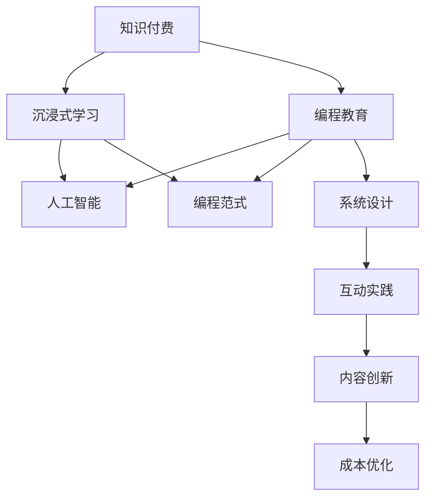

                 

# 程序员知识付费：打造沉浸式学习体验

> 关键词：知识付费、沉浸式学习、编程教育、人工智能、编程范式

## 1. 背景介绍

### 1.1 问题由来

随着互联网技术的不断发展，在线教育领域也迎来了快速变革。知识付费作为一种新兴的教育模式，凭借其灵活、高效的特性，迅速走红。特别是在程序员群体中，知识付费更是成为了一种重要的学习方式。

程序员的知识付费主要表现在以下几个方面：

1. **在线课程**：程序员通过购买平台上的编程课程，学习最新的编程技术和工具，提升自身技术能力。
2. **技术博客**：程序员订阅各大技术博客和社区，获取最新的技术文章和资讯。
3. **开源项目**：程序员通过参与开源项目，学习和交流编程技能，积累开发经验。
4. **在线问答**：程序员通过付费问答平台，解决编程中遇到的难题，获取专业指导。
5. **编程工具**：程序员通过购买编程工具和插件，提升开发效率和编程体验。

然而，传统的知识付费模式存在一些问题，例如：

- **内容同质化严重**：许多在线课程和博客内容重复、雷同，缺乏创新和深度。
- **缺乏沉浸式体验**：传统的学习方式以单向传授为主，缺乏互动和实践机会，学习效果不佳。
- **学习路径不合理**：许多课程和博客只关注某一方面技术，缺乏系统性，导致学习者难以构建完整的技术体系。
- **学习成本高**：高昂的学习费用和大量的时间投入，使得学习过程变得艰难和疲惫。

### 1.2 问题核心关键点

为了解决这些问题，我们需要重新思考程序员知识付费的方式，打造一种更加沉浸式、系统化的学习体验。以下是几个关键点：

- **内容创新**：提供高质量、具有创新性的课程和博客，避免同质化。
- **互动实践**：通过互动式学习和实践环节，提高学习者的参与度和学习效果。
- **系统设计**：构建系统化的学习路径，帮助学习者构建完整的技术体系。
- **成本优化**：通过合理定价和灵活的付费模式，降低学习者的成本。

## 2. 核心概念与联系

### 2.1 核心概念概述

为更好地理解沉浸式学习体验的构建，本节将介绍几个密切相关的核心概念：

- **知识付费**：通过付费获取知识，提升自身技能和素养的教育模式。
- **沉浸式学习**：通过深度互动和实践，让学习者全身心投入到学习过程中，提升学习效果。
- **编程教育**：通过编程课程和实践，培养程序员的核心编程能力和思维能力。
- **人工智能**：利用人工智能技术，提升学习体验和教学效果。
- **编程范式**：通过不同的编程范式（如面向对象、函数式编程等），提升编程思维和技巧。

这些核心概念之间的逻辑关系可以通过以下Mermaid流程图来展示：



这个流程图展示了几大核心概念之间的逻辑关系：

1. 知识付费是基础，提供高质量的学习内容和工具。
2. 沉浸式学习是关键，通过互动和实践提升学习效果。
3. 编程教育是目标，通过系统化的课程培养编程能力。
4. 人工智能和编程范式是手段，提升学习体验和编程技巧。
5. 系统设计和成本优化是保障，确保学习路径合理、成本可控。

这些概念共同构成了程序员知识付费的完整框架，旨在通过技术手段，构建沉浸式、高效的学习体验。

## 3. 核心算法原理 & 具体操作步骤
### 3.1 算法原理概述

沉浸式学习体验的构建，涉及多个技术领域的算法和模型。以下是几个关键点：

- **自适应学习算法**：通过分析学习者的学习行为和反馈，自动调整课程难度和内容，提供个性化的学习路径。
- **推荐系统算法**：通过学习者的兴趣和行为数据，推荐相关课程和文章，提升学习效率和效果。
- **自然语言处理(NLP)**：通过NLP技术，提供智能化的课程辅助工具，如自动摘要、关键词提取等。
- **人工智能辅助教学(AI for Education)**：通过AI技术，提供智能化的编程辅助和教学服务，提升教学效果和学生体验。
- **区块链技术**：通过区块链技术，保障知识付费的透明和信任度，防止欺诈和版权问题。

这些算法和技术共同构成了沉浸式学习体验的核心，通过科学的方法和先进的技术手段，提升学习效果和体验。

### 3.2 算法步骤详解

沉浸式学习体验的构建主要包括以下几个关键步骤：

**Step 1: 数据收集与分析**
- 收集学习者的行为数据，包括课程观看时间、问题回答频率、项目提交记录等。
- 分析学习者的兴趣和能力，了解学习者的需求和挑战。
- 利用数据挖掘和机器学习技术，对学习者进行细分和分类，确定其学习路径和内容。

**Step 2: 个性化课程推荐**
- 根据学习者的行为数据，利用推荐系统算法，推荐相关课程和文章。
- 利用协同过滤、基于内容的推荐等技术，提供个性化的课程推荐。
- 设置推荐机制，确保推荐结果的多样性和精准性，避免信息过载。

**Step 3: 沉浸式学习设计**
- 设计互动式学习模块，包括编程实战、在线讨论、代码审查等。
- 引入人工智能辅助教学，提供自动代码检查、错误提示等功能，提升学习效果。
- 利用自然语言处理技术，提供智能化的课程辅助工具，如自动摘要、关键词提取等。

**Step 4: 实践与反馈**
- 提供编程实战项目，让学习者通过实践提升技能。
- 引入代码审查和同行评审机制，提升代码质量和学习效果。
- 收集学习者的反馈，不断优化课程内容和教学方式。

**Step 5: 系统与成本优化**
- 利用区块链技术，确保知识付费的透明和信任度，防止欺诈和版权问题。
- 设计灵活的付费模式，如按需付费、订阅制等，降低学习者的成本。
- 优化课程内容和教学方式，确保学习路径合理、成本可控。

### 3.3 算法优缺点

沉浸式学习体验的构建，具有以下优点：

1. **提升学习效果**：通过个性化课程推荐和互动式学习，提升学习者的参与度和学习效果。
2. **灵活性高**：通过自适应学习算法，提供个性化的学习路径和内容。
3. **成本低廉**：通过灵活的付费模式和系统设计，降低学习者的成本。
4. **技术先进**：利用人工智能、区块链等先进技术，提升学习体验和教学效果。

同时，该方法也存在一些局限性：

1. **技术门槛高**：需要高度专业的技术团队和资源支持。
2. **数据隐私问题**：需要收集大量的学习者数据，可能引发隐私问题。
3. **课程设计复杂**：需要系统的课程设计和优化，难度较大。

尽管存在这些局限性，但就目前而言，沉浸式学习体验是提升程序员知识付费学习效果的重要手段。未来相关研究的重点在于如何进一步降低技术门槛，保障数据隐私，优化课程设计，以实现更好的学习体验。

### 3.4 算法应用领域

沉浸式学习体验的构建，已经在程序员知识付费中得到了广泛的应用，覆盖了几乎所有常见场景，例如：

- **在线课程**：通过个性化课程推荐和互动实践，提升学习者的学习效果。
- **技术博客**：利用自然语言处理技术，提供智能化的课程辅助工具，如自动摘要、关键词提取等。
- **开源项目**：通过编程实战和代码审查机制，提升学习者的实战经验和编程能力。
- **在线问答**：利用推荐系统和智能搜索，提供高效、精准的问题解答服务。
- **编程工具**：通过区块链技术，确保工具的透明和信任度，防止版权问题。

除了上述这些经典场景外，沉浸式学习体验还被创新性地应用到更多场景中，如虚拟实验室、虚拟导师、学习社区等，为程序员知识付费带来了全新的突破。

## 4. 数学模型和公式 & 详细讲解 & 举例说明
### 4.1 数学模型构建

本节将使用数学语言对沉浸式学习体验的构建进行更加严格的刻画。

假设学习者集为 $U=\{u_1,u_2,\cdots,u_n\}$，其中 $u_i$ 表示第 $i$ 个学习者。学习者 $u_i$ 的学习行为数据为 $D_i=\{(x_i,y_i)\}_{i=1}^N$，其中 $x_i$ 表示学习行为，如课程观看时间、问题回答频率等；$y_i$ 表示学习效果，如成绩、项目完成度等。

定义推荐系统模型为 $R(U,D)$，其中 $R$ 表示推荐函数，$U$ 表示学习者集，$D$ 表示学习行为数据集。推荐函数的目标是最大化预测准确率和用户满意度。

设推荐系统输出的推荐结果为 $R(u_i)$，推荐结果与真实结果之间的误差为 $e_i$，则推荐系统的目标函数为：

$$
\min_{R} \sum_{i=1}^N e_i^2
$$

在实践中，我们通常使用协同过滤、基于内容的推荐等算法，对学习者的行为数据进行分析和处理，得到推荐结果。

### 4.2 公式推导过程

以下我们以协同过滤算法为例，推导推荐系统模型的具体实现。

假设学习者集 $U$ 被分成 $K$ 个簇，每个簇内包含 $k$ 个学习者，即 $U_1,\cdots,U_K$。设学习者 $u_i$ 在簇 $U_j$ 中的邻居集为 $N(u_i;U_j)$。推荐系统利用 $u_i$ 在簇 $U_j$ 中的邻居行为，对 $u_i$ 进行推荐。

推荐函数 $R(u_i)$ 可以表示为：

$$
R(u_i) = \alpha \cdot \sum_{u_j \in N(u_i;U_j)} \frac{w_{ij}}{d_j} y_j
$$

其中 $\alpha$ 为平衡系数，$w_{ij}$ 为邻居 $u_j$ 在簇 $U_j$ 中的权重，$d_j$ 为簇 $U_j$ 的大小。推荐结果的误差为：

$$
e_i = R(u_i) - y_i
$$

通过最小化误差 $e_i$，可以优化推荐系统的推荐效果。

### 4.3 案例分析与讲解

**案例分析：在线课程推荐系统**

在线课程推荐系统的目标是，根据学习者的历史行为数据，推荐相关课程，提升学习效果。具体实现步骤如下：

1. 收集学习者的历史行为数据，包括课程观看时间、问题回答频率、项目提交记录等。
2. 分析学习者的兴趣和能力，确定其学习路径和内容。
3. 利用协同过滤算法，对学习者的行为数据进行分析和处理，得到推荐结果。
4. 引入个性化推荐机制，确保推荐结果的多样性和精准性，避免信息过载。

通过上述步骤，可以构建一个高效的在线课程推荐系统，提升学习者的学习效果和满意度。

## 5. 项目实践：代码实例和详细解释说明
### 5.1 开发环境搭建

在进行沉浸式学习体验的实践前，我们需要准备好开发环境。以下是使用Python进行Flask开发的环境配置流程：

1. 安装Anaconda：从官网下载并安装Anaconda，用于创建独立的Python环境。

2. 创建并激活虚拟环境：
```bash
conda create -n flask-env python=3.8 
conda activate flask-env
```

3. 安装Flask：
```bash
pip install flask
```

4. 安装Flask扩展库：
```bash
pip install flask-sqlalchemy flask-marshmallow flask-wtf
```

5. 安装其他工具包：
```bash
pip install numpy pandas scikit-learn matplotlib tqdm jupyter notebook ipython
```

完成上述步骤后，即可在`flask-env`环境中开始开发实践。

### 5.2 源代码详细实现

下面我以在线课程推荐系统为例，给出使用Flask框架开发推荐系统的PyTorch代码实现。

首先，定义课程推荐的数据模型：

```python
from flask_sqlalchemy import SQLAlchemy

db = SQLAlchemy()

class Course(db.Model):
    id = db.Column(db.Integer, primary_key=True)
    name = db.Column(db.String(100), nullable=False)
    description = db.Column(db.Text, nullable=False)
    rating = db.Column(db.Float, nullable=False)

class UserBehavior(db.Model):
    id = db.Column(db.Integer, primary_key=True)
    user_id = db.Column(db.Integer, db.ForeignKey('user.id', ondelete='CASCADE'), nullable=False)
    course_id = db.Column(db.Integer, db.ForeignKey('course.id', ondelete='CASCADE'), nullable=False)
    timestamp = db.Column(db.DateTime, nullable=False)
```

然后，定义推荐系统的数据处理和推荐函数：

```python
from sklearn.neighbors import NearestNeighbors

def find_neighbors(user, n_neighbors):
    behaviors = UserBehavior.query.filter_by(user_id=user).all()
    return behaviors

def recommend_courses(user, n_neighbors=5):
    neighbors = find_neighbors(user, n_neighbors)
    neighbor_ids = [neighbor.course_id for neighbor in neighbors]
    courses = Course.query.filter(Course.id.in_(neighbor_ids)).order_by(Course.rating.desc()).all()
    return courses
```

最后，启动Flask应用并实现推荐功能：

```python
from flask import Flask, jsonify

app = Flask(__name__)

@app.route('/recommend', methods=['POST'])
def recommend():
    user_id = request.json['user_id']
    courses = recommend_courses(user_id)
    return jsonify([{'id': course.id, 'name': course.name, 'description': course.description} for course in courses])

if __name__ == '__main__':
    app.run(debug=True)
```

通过上述步骤，可以构建一个简单的在线课程推荐系统，学习者可以根据自身历史行为数据，获取推荐的课程。

### 5.3 代码解读与分析

让我们再详细解读一下关键代码的实现细节：

**Course和UserBehavior类**：
- `Course`类：表示课程，包含课程ID、名称、描述、评分等信息。
- `UserBehavior`类：表示学习者的行为数据，包含用户ID、课程ID、时间戳等信息。

**find_neighbors函数**：
- 查询学习者 $u_i$ 的历史行为数据，并计算出其最近的 $n$ 个邻居。

**recommend_courses函数**：
- 根据邻居的行为数据，推荐相关课程。这里使用了KNN算法，选择评分最高的课程进行推荐。

**Flask应用**：
- 启动Flask应用，实现推荐功能。接收用户ID，返回推荐的课程列表。

可以看到，利用Flask框架和Python语言，可以较为轻松地实现一个在线课程推荐系统。实际应用中，还需要根据具体需求进行更多的优化和扩展，例如：

- 添加用户注册和登录功能，确保数据的安全性和隐私性。
- 引入机器学习算法，提升推荐效果。
- 优化数据库设计，提升查询效率。

## 6. 实际应用场景
### 6.1 智能编程辅助

基于沉浸式学习体验的编程辅助工具，已经在程序员知识付费中得到了广泛应用。智能编程辅助工具主要通过AI技术，提供编程语言的自动补全、代码检查、错误提示等功能，提升编程效率和代码质量。

具体应用场景包括：

- **自动补全**：根据学习者输入的代码片段，自动推荐可能的关键字和语法，提升编程速度和准确性。
- **代码检查**：利用AI技术，自动检查代码中的错误和异常，提供代码质量评估和优化建议。
- **错误提示**：在编译或运行时发现错误，提供详细的错误信息和解决方案，提升学习效果。

**案例分析：智能编程助手**

智能编程助手通过AI技术，提供自动补全、代码检查、错误提示等功能，提升学习者的编程效率和代码质量。具体实现步骤如下：

1. 收集学习者的代码片段和错误记录，利用AI技术进行分析和处理。
2. 根据代码片段和错误记录，提供自动补全、代码检查、错误提示等服务。
3. 引入个性化推荐机制，确保推荐结果的多样性和精准性，避免信息过载。

通过上述步骤，可以构建一个高效的智能编程助手，提升学习者的编程效率和代码质量。

### 6.2 在线学习社区

在线学习社区是程序员知识付费的另一个重要场景，通过在线互动和交流，提升学习效果和社区粘性。具体应用场景包括：

- **讨论区**：提供讨论板块，学习者可以发布问题和讨论代码实现。
- **代码审查**：引入代码审查机制，通过同行评审提升代码质量和编程技巧。
- **项目合作**：组织学习者参与开源项目，提升实战经验和团队协作能力。

**案例分析：在线学习社区**

在线学习社区通过讨论区、代码审查、项目合作等功能，提供互动式学习体验，提升学习效果和社区粘性。具体实现步骤如下：

1. 创建学习社区，提供讨论区、代码审查、项目合作等功能。
2. 收集学习者的讨论记录和项目记录，利用AI技术进行分析和处理。
3. 利用协同过滤算法，对学习者的行为数据进行分析和处理，推荐相关讨论和学习资源。
4. 引入个性化推荐机制，确保推荐结果的多样性和精准性，避免信息过载。

通过上述步骤，可以构建一个高效的在线学习社区，提升学习者的互动体验和社区粘性。

### 6.3 虚拟导师

虚拟导师是程序员知识付费的另一重要场景，通过AI技术，提供智能化的编程指导和知识分享，提升学习效果。具体应用场景包括：

- **智能答疑**：利用AI技术，提供智能化的编程答疑服务，解答学习者的问题。
- **知识分享**：通过视频、博客、直播等方式，分享编程知识和经验。
- **个性化辅导**：根据学习者的学习进度和能力，提供个性化的编程辅导。

**案例分析：虚拟导师**

虚拟导师通过智能答疑、知识分享、个性化辅导等功能，提供智能化的编程指导和知识分享，提升学习效果。具体实现步骤如下：

1. 创建虚拟导师系统，提供智能答疑、知识分享、个性化辅导等功能。
2. 收集学习者的提问记录和知识分享记录，利用AI技术进行分析和处理。
3. 利用协同过滤算法，对学习者的行为数据进行分析和处理，推荐相关知识分享和学习资源。
4. 引入个性化推荐机制，确保推荐结果的多样性和精准性，避免信息过载。

通过上述步骤，可以构建一个高效的虚拟导师系统，提升学习者的学习效果和知识分享体验。

## 7. 工具和资源推荐
### 7.1 学习资源推荐

为了帮助开发者系统掌握沉浸式学习体验的构建，这里推荐一些优质的学习资源：

1. **《Flask Web开发》**：介绍Flask框架的详细教程，涵盖Flask的各个方面，适合初学者和进阶开发者。
2. **《Python深度学习》**：介绍深度学习的基本概念和实战案例，适合希望进入深度学习领域的学习者。
3. **《自然语言处理入门》**：介绍自然语言处理的基本概念和常用技术，适合希望进入NLP领域的学习者。
4. **《数据科学与机器学习》**：介绍数据科学和机器学习的基本概念和实战案例，适合希望进入数据科学领域的学习者。
5. **《深度学习入门》**：介绍深度学习的基本概念和实战案例，适合希望进入深度学习领域的学习者。

通过对这些资源的学习实践，相信你一定能够快速掌握沉浸式学习体验的构建方法，并用于解决实际的编程问题。

### 7.2 开发工具推荐

高效的开发离不开优秀的工具支持。以下是几款用于沉浸式学习体验构建开发的常用工具：

1. **Flask**：轻量级Web框架，适合快速迭代开发。
2. **SQLAlchemy**：Python ORM框架，适合数据库设计和操作。
3. **Keras**：Python深度学习框架，适合快速原型设计和模型构建。
4. **TensorFlow**：Google开发的深度学习框架，生产部署方便，适合大规模工程应用。
5. **PyTorch**：Facebook开发的深度学习框架，适合科研和实验。
6. **Jupyter Notebook**：交互式编程环境，适合开发和调试。

合理利用这些工具，可以显著提升沉浸式学习体验的开发效率，加快创新迭代的步伐。

### 7.3 相关论文推荐

沉浸式学习体验的构建涉及多个技术领域的论文，以下是几篇经典论文，推荐阅读：

1. **《深度学习基础》**：介绍深度学习的基本概念和模型，适合初学者。
2. **《自然语言处理综述》**：介绍自然语言处理的基本概念和常用技术，适合希望进入NLP领域的学习者。
3. **《机器学习实战》**：介绍机器学习的基本概念和实战案例，适合希望进入机器学习领域的学习者。
4. **《人工智能基础》**：介绍人工智能的基本概念和常用技术，适合希望进入人工智能领域的学习者。
5. **《数据科学与机器学习实战》**：介绍数据科学和机器学习的基本概念和实战案例，适合希望进入数据科学领域的学习者。

这些论文代表了大语言模型微调技术的发展脉络。通过学习这些前沿成果，可以帮助研究者把握学科前进方向，激发更多的创新灵感。

## 8. 总结：未来发展趋势与挑战
### 8.1 研究成果总结

本文对沉浸式学习体验的构建进行了全面系统的介绍。首先阐述了知识付费、沉浸式学习、编程教育、人工智能、编程范式等核心概念，明确了沉浸式学习体验的构建目标和方法。其次，从原理到实践，详细讲解了沉浸式学习体验的数学模型和关键步骤，给出了沉浸式学习体验构建的完整代码实例。同时，本文还广泛探讨了沉浸式学习体验在智能编程辅助、在线学习社区、虚拟导师等诸多场景中的应用前景，展示了沉浸式学习体验的巨大潜力。此外，本文精选了沉浸式学习体验的学习资源，力求为读者提供全方位的技术指引。

通过本文的系统梳理，可以看到，沉浸式学习体验的构建正在成为程序员知识付费的重要手段，极大地提升学习效果和体验。基于沉浸式学习体验，程序员可以更加高效地学习和实践编程技能，提升自身竞争力。

### 8.2 未来发展趋势

展望未来，沉浸式学习体验的构建将呈现以下几个发展趋势：

1. **技术更加先进**：随着深度学习、自然语言处理等技术的不断发展，沉浸式学习体验将更加智能化、高效化。
2. **应用更加广泛**：沉浸式学习体验将广泛应用于在线课程、编程辅助、学习社区等多个场景，提升学习效果和体验。
3. **用户体验更加优化**：通过AI技术和个性化推荐，提升学习者的互动体验和满意度。
4. **成本更加低廉**：通过灵活的付费模式和系统设计，降低学习者的成本。

这些趋势凸显了沉浸式学习体验的广阔前景，相信未来在技术、应用、用户体验、成本等多个方面，都能取得更大的突破，为程序员知识付费带来更多的创新和应用。

### 8.3 面临的挑战

尽管沉浸式学习体验的构建已经取得了一定的成果，但在迈向更加智能化、普适化应用的过程中，仍面临诸多挑战：

1. **技术门槛高**：需要高度专业的技术团队和资源支持。
2. **数据隐私问题**：需要收集大量的学习者数据，可能引发隐私问题。
3. **课程设计复杂**：需要系统的课程设计和优化，难度较大。
4. **互动效果有限**：传统的沉浸式学习体验往往以单向传授为主，缺乏互动和实践机会。
5. **个性化推荐难度大**：需要深度分析和挖掘学习者的行为数据，才能实现精准的个性化推荐。

尽管存在这些挑战，但通过不断探索和优化，这些困难将逐步被克服，沉浸式学习体验必将在程序员知识付费中发挥更大的作用。

### 8.4 研究展望

面对沉浸式学习体验所面临的挑战，未来的研究需要在以下几个方面寻求新的突破：

1. **探索新的AI技术**：引入更多的AI技术，如因果推断、增强学习等，提升沉浸式学习体验的效果和智能性。
2. **优化数据隐私保护**：研究如何保护学习者的隐私，防止数据泄露和滥用。
3. **简化课程设计**：通过AI技术，自动生成课程内容和推荐，简化课程设计流程。
4. **提升互动效果**：引入更多互动和实践环节，提升学习者的参与度和学习效果。
5. **强化个性化推荐**：研究如何深度分析和挖掘学习者的行为数据，实现精准的个性化推荐。

这些研究方向的探索，将引领沉浸式学习体验的不断发展，为程序员知识付费带来更多的创新和突破。相信通过不断探索和优化，沉浸式学习体验必将迎来更广阔的应用前景。

## 9. 附录：常见问题与解答
**Q1：如何构建一个高效的沉浸式学习体验？**

A: 构建高效的沉浸式学习体验需要从多个方面入手，包括数据收集、个性化推荐、互动实践、系统设计等。具体步骤如下：

1. **数据收集**：收集学习者的行为数据，包括课程观看时间、问题回答频率、项目提交记录等。
2. **个性化推荐**：利用推荐系统算法，对学习者的行为数据进行分析和处理，得到推荐结果。
3. **互动实践**：提供编程实战、在线讨论、代码审查等互动式学习环节，提升学习者的参与度和学习效果。
4. **系统设计**：利用Flask等Web框架，实现推荐系统、智能编程助手、在线学习社区等应用。

通过上述步骤，可以构建一个高效的沉浸式学习体验，提升学习者的学习效果和满意度。

**Q2：沉浸式学习体验的主要应用场景有哪些？**

A: 沉浸式学习体验的主要应用场景包括在线课程推荐、智能编程辅助、在线学习社区、虚拟导师等。具体应用场景如下：

1. **在线课程推荐**：通过个性化推荐和互动实践，提升学习者的学习效果。
2. **智能编程辅助**：利用AI技术，提供编程语言的自动补全、代码检查、错误提示等功能，提升编程效率和代码质量。
3. **在线学习社区**：通过讨论区、代码审查、项目合作等功能，提供互动式学习体验，提升学习效果和社区粘性。
4. **虚拟导师**：通过智能答疑、知识分享、个性化辅导等功能，提供智能化的编程指导和知识分享，提升学习效果。

通过这些应用场景，可以构建一个完整的沉浸式学习体验系统，提升学习者的学习效果和满意度。

**Q3：沉浸式学习体验的技术门槛是否较高？**

A: 沉浸式学习体验的技术门槛相对较高，需要高度专业的技术团队和资源支持。具体原因如下：

1. **数据处理**：需要收集和处理大量的学习者数据，数据处理和清洗难度较大。
2. **算法实现**：需要设计和实现多种算法，包括推荐系统、AI技术等，技术难度较高。
3. **系统集成**：需要设计和实现多个应用模块，集成难度较大。

尽管存在较高的技术门槛，但通过不断探索和优化，这些困难将逐步被克服，沉浸式学习体验必将在程序员知识付费中发挥更大的作用。

**Q4：沉浸式学习体验的个性化推荐效果如何？**

A: 沉浸式学习体验的个性化推荐效果通常较好，但需要合理设计和实现推荐算法。具体原因如下：

1. **数据质量高**：推荐算法依赖于学习者的行为数据，如果数据质量较高，推荐效果会更好。
2. **算法优化**：通过深度学习和协同过滤等算法，可以提升推荐效果。
3. **多维度推荐**：通过综合考虑课程评分、学习者兴趣等多个维度，可以提升推荐效果。

尽管存在一定的局限性，但通过不断优化算法和技术，个性化推荐效果将进一步提升，提供更加精准的学习建议。

**Q5：沉浸式学习体验的开发成本是否较高？**

A: 沉浸式学习体验的开发成本相对较高，需要投入大量的人力和时间资源。具体原因如下：

1. **技术复杂**：沉浸式学习体验涉及多种技术和算法，开发难度较大。
2. **数据收集**：需要收集和处理大量的学习者数据，数据处理难度较大。
3. **系统集成**：需要设计和实现多个应用模块，集成难度较大。

尽管存在较高的开发成本，但通过合理规划和优化，开发成本将逐步降低，沉浸式学习体验必将在程序员知识付费中发挥更大的作用。

---

作者：禅与计算机程序设计艺术 / Zen and the Art of Computer Programming

