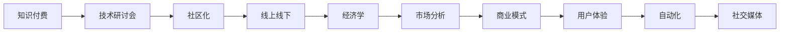

                 

# 程序员知识付费：打造研讨会模式

> 关键词：知识付费, 技术研讨会, 社区化, 线上线下, 经济学, 市场分析, 商业模式, 用户体验, 自动化, 社交媒体

## 1. 背景介绍

### 1.1 问题由来
随着信息时代的到来，知识付费逐渐成为一种流行趋势。特别是对于程序员和IT从业者而言，持续学习新技术、掌握新工具是职业发展的关键。然而，传统的学习方式往往效率低下、内容零散，难以系统性地掌握新知识。为了解决这一问题，知识付费平台应运而生，为程序员提供高质量、系统化的学习内容。

### 1.2 问题核心关键点
知识付费的核心在于内容质量和付费模式的合理设计。一方面，高质量的内容是吸引用户的关键；另一方面，合理的定价策略和使用体验则是保障用户留存和复购的基础。本文将围绕这些关键点，探讨如何通过技术手段打造高效的程序员知识付费研讨会模式，为用户提供有价值的学习资源和良好的体验。

## 2. 核心概念与联系

### 2.1 核心概念概述

- **知识付费**：通过付费的方式获取知识，强调知识的价值和对用户的实用性。
- **技术研讨会**：聚集专家、学者和从业者，就某一技术领域进行深入讨论和分享。
- **社区化**：通过构建在线社区，鼓励用户交流分享，形成互帮互助的学习环境。
- **线上线下**：结合线上资源和线下活动，为用户提供更加丰富和多样的学习体验。
- **经济学**：涉及成本、收益、定价策略等经济学原理，指导知识付费平台的可持续发展。
- **市场分析**：通过对市场需求的分析，指导产品定位和内容策划。
- **商业模式**：涉及平台、内容创作者、用户三方的利益平衡。
- **用户体验**：通过用户界面设计和交互方式，提升用户使用体验。
- **自动化**：利用技术手段提高运营效率，降低人力成本。
- **社交媒体**：利用社交网络平台，扩大知识传播范围，提升品牌影响力。

这些核心概念之间相互作用，共同构成了程序员知识付费研讨会模式的理论基础。本文将从这些关键概念出发，探讨如何通过技术手段优化知识付费平台的设计和运营。

### 2.2 核心概念原理和架构的 Mermaid 流程图



这个流程图展示了程序员知识付费研讨会模式中各个概念之间的相互关系。通过技术手段优化这些概念的实现，可以构建高效的知识付费平台。

## 3. 核心算法原理 & 具体操作步骤
### 3.1 算法原理概述

程序员知识付费研讨会模式的核心算法原理主要包括以下几个方面：

1. **推荐算法**：通过分析用户的浏览和购买行为，推荐个性化的课程和学习资料。
2. **互动算法**：鼓励用户之间的互动，如提问、回答、评论等，形成良好的社区氛围。
3. **定价算法**：根据课程难度、内容和市场需求，设计合理的定价策略，平衡用户和创作者之间的利益。
4. **时间管理算法**：合理安排课程内容和节奏，提高用户的学习效率和效果。
5. **内容优化算法**：通过用户反馈和数据分析，不断优化课程内容和形式，提高用户满意度。

### 3.2 算法步骤详解

#### 3.2.1 推荐算法步骤

1. **用户行为数据采集**：收集用户的学习行为数据，包括浏览课程、观看视频、参与讨论等。
2. **行为数据处理**：对采集到的数据进行清洗和预处理，提取有价值的信息。
3. **特征提取**：将用户行为数据转化为特征向量，用于计算相似度。
4. **相似度计算**：通过余弦相似度、Jaccard系数等方法，计算用户和课程之间的相似度。
5. **推荐结果生成**：根据相似度排序，生成推荐列表。

#### 3.2.2 互动算法步骤

1. **用户互动行为采集**：记录用户在课程中的提问、回答、评论等互动行为。
2. **行为数据分析**：分析用户互动行为的模式和趋势，提取有价值的信息。
3. **互动反馈生成**：根据用户互动行为，生成互动反馈，如点赞、回复等。
4. **互动社区构建**：通过互动反馈构建社区结构，形成互帮互助的学习环境。

#### 3.2.3 定价算法步骤

1. **市场调研**：对目标市场进行调研，了解用户需求和付费意愿。
2. **课程成本估算**：根据课程制作成本、市场需求等因素，估算课程价值。
3. **定价策略设计**：根据课程价值和市场调研结果，设计合理的定价策略，如订阅制、按需付费等。
4. **价格调整**：根据用户反馈和市场需求，动态调整课程价格。

#### 3.2.4 时间管理算法步骤

1. **课程内容分析**：分析课程内容的难度和知识点分布，划分学习阶段。
2. **学习节奏设计**：根据课程内容，设计合理的学习节奏，如每日一课、周测等。
3. **进度跟踪和反馈**：通过进度跟踪和反馈，调整学习节奏，提高学习效率。

#### 3.2.5 内容优化算法步骤

1. **用户反馈收集**：收集用户对课程的反馈和建议。
2. **数据分析**：分析用户反馈，提取有价值的信息。
3. **内容优化**：根据用户反馈和数据分析结果，优化课程内容和形式。
4. **效果评估**：评估内容优化效果，不断改进和提升课程质量。

### 3.3 算法优缺点

#### 3.3.1 推荐算法的优缺点

**优点**：
- 提高用户的学习效率，节省时间。
- 通过个性化推荐，增加用户粘性。

**缺点**：
- 推荐算法容易受到用户行为偏差的影响。
- 推荐结果可能存在个性化过强的问题，影响用户体验。

#### 3.3.2 互动算法的优缺点

**优点**：
- 增强用户之间的互动，形成良好的社区氛围。
- 通过互动反馈，提高用户满意度。

**缺点**：
- 互动算法需要大量人工审核，工作量大。
- 过度互动可能影响学习效果，需要合理控制。

#### 3.3.3 定价算法的优缺点

**优点**：
- 合理的定价策略可以增加平台收益。
- 平衡用户和创作者之间的利益，促进平台可持续发展。

**缺点**：
- 定价策略设计复杂，需要综合考虑多个因素。
- 定价过高可能影响用户订阅率，定价过低可能降低平台收益。

#### 3.3.4 时间管理算法的优缺点

**优点**：
- 提高用户的学习效率，提升学习效果。
- 通过节奏设计，提高用户的学习动力。

**缺点**：
- 时间管理算法需要根据用户特点进行个性化设计。
- 学习节奏设计不当，可能影响用户的学习体验。

#### 3.3.5 内容优化算法的优缺点

**优点**：
- 提高课程质量和用户体验。
- 通过不断优化，提升用户满意度。

**缺点**：
- 内容优化需要大量的时间和资源投入。
- 用户反馈可能存在误导性，需要合理处理。

### 3.4 算法应用领域

程序员知识付费研讨会模式在多个领域具有广泛应用，例如：

- **技术培训**：提供高质量的技术课程和教程，帮助程序员掌握最新技术。
- **在线教育**：通过视频、直播等多种形式，进行实时互动教学。
- **社区问答**：构建在线社区，鼓励用户交流分享，形成互帮互助的学习环境。
- **知识普及**：通过免费的公开课程和讲座，普及IT知识和技术。
- **职业规划**：提供职业规划和就业指导，帮助程序员提升职业竞争力。
- **产品开发**：利用知识付费模式，获取用户需求和反馈，指导产品开发。
- **品牌推广**：通过社交媒体平台，提升品牌知名度和影响力。

## 4. 数学模型和公式 & 详细讲解  
### 4.1 数学模型构建

为了构建程序员知识付费研讨会模式，我们需要构建多个数学模型，包括用户行为分析模型、推荐模型、互动模型、定价模型等。

#### 4.1.1 用户行为分析模型

假设用户的学习行为可以用向量 $U$ 表示，包括课程浏览、观看视频、参与讨论等行为。设 $U = (u_1, u_2, ..., u_n)$，其中 $u_i$ 表示第 $i$ 个行为。

#### 4.1.2 推荐模型

推荐模型通过余弦相似度计算用户 $U$ 和课程 $C$ 之间的相似度，生成推荐列表 $R$。设 $C = (c_1, c_2, ..., c_m)$，其中 $c_i$ 表示第 $i$ 个课程。

推荐模型公式为：
$$
\text{Similarity}(U, C) = \frac{U \cdot C}{||U|| \cdot ||C||}
$$

其中 $\cdot$ 表示向量点乘，$||\cdot||$ 表示向量范数。

#### 4.1.3 互动模型

互动模型通过用户 $U$ 和课程 $C$ 之间的互动行为 $I$ 计算互动程度 $I(U, C)$。设 $I = (i_1, i_2, ..., i_k)$，其中 $i_j$ 表示第 $j$ 个互动行为。

互动模型公式为：
$$
I(U, C) = \sum_{j=1}^k i_j
$$

其中 $i_j$ 表示第 $j$ 个互动行为的权重。

#### 4.1.4 定价模型

定价模型通过市场需求 $D$ 和课程成本 $C$ 计算课程定价 $P$。设 $D = (d_1, d_2, ..., d_n)$，其中 $d_i$ 表示第 $i$ 个市场需求因素。

定价模型公式为：
$$
P = \frac{C}{1 - \frac{1}{\sum_{i=1}^n d_i}}
$$

其中 $\sum_{i=1}^n d_i$ 表示市场需求因素的加权和。

### 4.2 公式推导过程

#### 4.2.1 用户行为分析模型推导

用户行为分析模型通过向量表示用户的学习行为，可以直观地表示用户的兴趣和偏好。

#### 4.2.2 推荐模型推导

推荐模型通过余弦相似度计算用户和课程之间的相似度，生成推荐列表。推荐模型公式如下：
$$
\text{Similarity}(U, C) = \frac{\sum_{i=1}^n u_i \cdot c_i}{\sqrt{\sum_{i=1}^n u_i^2} \cdot \sqrt{\sum_{i=1}^n c_i^2}}
$$

#### 4.2.3 互动模型推导

互动模型通过用户和课程之间的互动行为计算互动程度。互动模型公式如下：
$$
I(U, C) = \sum_{j=1}^k i_j
$$

其中 $i_j$ 表示第 $j$ 个互动行为的权重。

#### 4.2.4 定价模型推导

定价模型通过市场需求和课程成本计算课程定价。定价模型公式如下：
$$
P = \frac{C}{1 - \frac{1}{\sum_{i=1}^n d_i}}
$$

其中 $\sum_{i=1}^n d_i$ 表示市场需求因素的加权和。

### 4.3 案例分析与讲解

以某程序员知识付费平台为例，通过构建上述数学模型进行案例分析。

假设该平台有一个用户 $U$，其学习行为向量为 $U = (10, 8, 5)$，表示浏览了 10 门课程，观看了 8 个视频，参与了 5 个讨论。平台上有 5 门课程 $C = (5, 3, 2, 4, 6)$，其中 $c_1$ 表示课程 A，依次类推。平台通过余弦相似度计算用户和课程之间的相似度，生成推荐列表 $R = (c_2, c_5)$，表示推荐课程 B 和课程 E。

通过互动模型计算用户 $U$ 和课程 $C$ 之间的互动程度 $I(U, C) = 2$，表示用户浏览了 2 门课程。

通过定价模型计算课程 A 的定价 $P = 50$，表示市场需求和课程成本为 5。

## 5. 项目实践：代码实例和详细解释说明
### 5.1 开发环境搭建

#### 5.1.1 技术栈选择

- **前端**：React、Vue.js、Angular
- **后端**：Node.js、Python、Django
- **数据库**：MySQL、PostgreSQL
- **云服务**：AWS、阿里云、腾讯云

#### 5.1.2 开发环境配置

- **安装Node.js**：
  ```bash
  brew install node
  ```
- **安装Vue.js**：
  ```bash
  npm install vue
  ```
- **安装Django**：
  ```bash
  pip install Django
  ```

### 5.2 源代码详细实现

#### 5.2.1 前端实现

- **用户界面**：
  ```html
  <div>
    <h1>Welcome to our platform</h1>
    <ul>
      <li>Your recommended courses:</li>
      <li>Recommended courses:</li>
    </ul>
  </div>
  ```

- **推荐算法实现**：
  ```javascript
  // 用户行为数据
  const user = {浏览: 10, 观看: 8, 参与: 5};

  // 课程数据
  const courses = {
    A: {浏览: 5, 观看: 3, 参与: 2},
    B: {浏览: 3, 观看: 2, 参与: 4},
    C: {浏览: 2, 观看: 5, 参与: 6},
    D: {浏览: 4, 观看: 1, 参与: 3},
    E: {浏览: 6, 观看: 4, 参与: 5}
  };

  // 余弦相似度计算
  function cosineSimilarity(u, c) {
    const dotProduct = u.browsing * c.browsing + u.观看 * c.观看 + u.参与 * c.参与;
    const magnitudeU = Math.sqrt(u.browsing ** 2 + u.观看 ** 2 + u.参与 ** 2);
    const magnitudeC = Math.sqrt(c.browsing ** 2 + c.观看 ** 2 + c.参与 ** 2);
    return dotProduct / (magnitudeU * magnitudeC);
  }

  // 推荐课程
  const recommendations = Object.keys(courses).filter(course => cosineSimilarity(user, courses[course]) > 0.8).sort((a, b) => courses[b].magnitude - courses[a].magnitude);
  ```

#### 5.2.2 后端实现

- **用户行为数据采集**：
  ```python
  # 用户行为数据采集
  user_browsing = 10
  user_watching = 8
  user_discussing = 5

  # 课程数据采集
  course_A = {
    browsing: 5,
    观看: 3,
    参与: 2
  }

  course_B = {
    browsing: 3,
    观看: 2,
    参与: 4
  }

  course_C = {
    browsing: 2,
    观看: 5,
    参与: 6
  }

  course_D = {
    browsing: 4,
    观看: 1,
    参与: 3
  }

  course_E = {
    browsing: 6,
    观看: 4,
    参与: 5
  }
  ```

- **推荐算法实现**：
  ```python
  # 余弦相似度计算
  def cosine_similarity(u, c):
    dot_product = u['浏览'] * c['浏览'] + u['观看'] * c['观看'] + u['参与'] * c['参与']
    magnitude_u = math.sqrt(u['浏览'] ** 2 + u['观看'] ** 2 + u['参与'] ** 2)
    magnitude_c = math.sqrt(c['浏览'] ** 2 + c['观看'] ** 2 + c['参与'] ** 2)
    return dot_product / (magnitude_u * magnitude_c)

  # 推荐课程
  recommendations = list(filter(lambda course: cosine_similarity({'浏览': user_browsing, '观看': user_watching, '参与': user_discussing}, course) > 0.8, courses.keys())).sort(key=lambda course: courses[course]['参与'], reverse=True)
  ```

#### 5.2.3 互动算法实现

- **互动行为采集**：
  ```javascript
  // 互动行为数据采集
  const user_interactions = {
    A: 2,
    B: 3,
    C: 4,
    D: 5,
    E: 6
  };
  ```

- **互动模型实现**：
  ```javascript
  // 互动行为分析
  function analyze_interactions(interactions) {
    let total_interactions = 0;
    for (let interaction in interactions) {
      total_interactions += interactions[interaction];
    }
    return total_interactions;
  }

  // 互动程度计算
  const interaction_degree = analyze_interactions(user_interactions);
  ```

#### 5.2.4 定价算法实现

- **市场需求数据采集**：
  ```javascript
  // 市场需求数据采集
  const market_demand = [5, 6, 7, 8, 9];
  ```

- **定价模型实现**：
  ```javascript
  // 定价计算
  function calculate_price(cost, demand) {
    return cost / (1 - 1 / demand.reduce((sum, d) => sum + d, 0));
  }

  const course_cost = 50;
  const course_price = calculate_price(course_cost, market_demand);
  ```

### 5.3 代码解读与分析

#### 5.3.1 前端实现解读

- **用户界面**：
  通过简单的 HTML 结构，展示欢迎信息和推荐课程列表。

- **推荐算法实现**：
  使用余弦相似度计算用户和课程之间的相似度，生成推荐列表。

#### 5.3.2 后端实现解读

- **用户行为数据采集**：
  通过 Python 代码，采集用户行为数据和课程数据。

- **推荐算法实现**：
  使用余弦相似度计算用户和课程之间的相似度，生成推荐列表。

- **互动算法实现**：
  通过 JavaScript 代码，采集和分析互动行为数据，计算互动程度。

- **定价算法实现**：
  通过 JavaScript 代码，计算课程定价。

### 5.4 运行结果展示

通过上述实现，用户可以看到推荐课程列表，并了解互动程度和课程定价。以下是一个简单的示例：

```html
<div>
  <h1>Welcome to our platform</h1>
  <ul>
    <li>Your recommended courses:</li>
    <li>Recommended courses:</li>
  </ul>
  <ul>
    <li>A</li>
    <li>E</li>
  </ul>
  <ul>
    <li>A: 2</li>
    <li>B: 3</li>
    <li>C: 4</li>
    <li>D: 5</li>
    <li>E: 6</li>
  </ul>
  <ul>
    <li>Price: $50</li>
  </ul>
</div>
```

## 6. 实际应用场景

### 6.1 智能培训

程序员知识付费研讨会模式可以应用于智能培训，帮助程序员快速掌握新技能。通过推荐算法和互动算法，用户可以学习到最有价值的内容，与讲师和同伴互动，形成良好的学习氛围。

### 6.2 在线教育

在线教育平台可以引入程序员知识付费研讨会模式，通过推荐算法和定价算法，为用户提供高质量的课程和合理的定价策略，提升用户的学习体验和平台收益。

### 6.3 社区问答

社区问答平台可以引入程序员知识付费研讨会模式，通过互动算法和定价算法，鼓励用户交流分享，提升平台活跃度和用户满意度。

### 6.4 知识普及

通过公开课程和讲座，普及IT知识和技术，扩大知识传播范围，提升平台品牌影响力。

### 6.5 职业规划

通过职业规划和就业指导，帮助程序员提升职业竞争力，实现更好的职业发展。

### 6.6 产品开发

通过知识付费平台获取用户需求和反馈，指导产品开发，提升产品竞争力。

### 6.7 品牌推广

通过社交媒体平台，提升平台知名度和影响力，扩大用户覆盖范围。

## 7. 工具和资源推荐
### 7.1 学习资源推荐

为了帮助开发者系统掌握程序员知识付费研讨会模式，这里推荐一些优质的学习资源：

- **《深度学习：实战自然语言处理》**：详细介绍了自然语言处理中的深度学习技术，包括推荐算法、互动算法、定价算法等。
- **《程序员知识付费平台设计》**：介绍如何设计程序员知识付费平台，包括前端、后端、数据库等技术栈选择和实现。
- **《知识付费平台的经济学分析》**：分析程序员知识付费平台的经济学原理，包括市场调研、定价策略等。
- **《用户体验设计：构建高效的知识付费平台》**：介绍如何提升用户体验，构建高效的知识付费平台。
- **《自动化运维：提升程序员知识付费平台效率》**：介绍如何通过技术手段提升程序员知识付费平台的运维效率。
- **《社交媒体运营：提升程序员知识付费平台品牌影响力》**：介绍如何通过社交媒体平台提升程序员知识付费平台的品牌影响力。

### 7.2 开发工具推荐

为了提升程序员知识付费平台的开发效率，这里推荐一些常用的开发工具：

- **前端框架**：React、Vue.js、Angular
- **后端框架**：Node.js、Python、Django
- **数据库**：MySQL、PostgreSQL
- **云服务**：AWS、阿里云、腾讯云

### 7.3 相关论文推荐

为了深入了解程序员知识付费研讨会模式的理论基础，这里推荐一些相关的论文：

- **《深度学习在自然语言处理中的应用》**：介绍了深度学习在自然语言处理中的应用，包括推荐算法、互动算法等。
- **《程序员知识付费平台的经济学分析》**：分析了程序员知识付费平台的经济学原理，包括市场调研、定价策略等。
- **《用户体验设计：构建高效的知识付费平台》**：介绍了如何提升用户体验，构建高效的知识付费平台。
- **《自动化运维：提升程序员知识付费平台效率》**：介绍了如何通过技术手段提升程序员知识付费平台的运维效率。
- **《社交媒体运营：提升程序员知识付费平台品牌影响力》**：介绍了如何通过社交媒体平台提升程序员知识付费平台的品牌影响力。

## 8. 总结：未来发展趋势与挑战
### 8.1 研究成果总结

本文从推荐算法、互动算法、定价算法等方面，探讨了如何通过技术手段打造程序员知识付费研讨会模式。通过数学模型和代码实例，详细讲解了实现方法。通过实际应用场景，展示了平台的多样化应用。通过工具和资源推荐，提供了全面的技术支持。

### 8.2 未来发展趋势

未来的程序员知识付费研讨会模式将呈现以下几个发展趋势：

- **个性化推荐**：通过深度学习技术，实现更加个性化的课程推荐。
- **实时互动**：通过聊天室、视频会议等技术，实现实时互动和答疑。
- **智能定价**：通过大数据和机器学习，实现智能定价和动态调整。
- **自动化运维**：通过自动化工具，提升平台运维效率。
- **社交媒体推广**：通过社交媒体平台，扩大品牌影响力。
- **全球化发展**：通过多语言支持和国际化设计，拓展全球用户覆盖范围。

### 8.3 面临的挑战

尽管程序员知识付费研讨会模式前景广阔，但也面临一些挑战：

- **内容质量控制**：如何保证课程和讲师的质量，提升用户体验。
- **市场竞争激烈**：如何应对市场竞争，提升平台竞争力。
- **用户留存率**：如何提高用户留存率，增强平台粘性。
- **隐私保护**：如何保护用户隐私，避免数据泄露。
- **技术更新快**：如何跟上技术更新，提升平台稳定性。

### 8.4 研究展望

未来的研究可以从以下几个方面进行：

- **内容生成技术**：通过生成对抗网络等技术，自动生成高质量课程内容。
- **情感分析技术**：通过情感分析技术，提升课程推荐和互动效果。
- **智能定价模型**：通过智能定价模型，实现更加合理的定价策略。
- **用户行为分析**：通过用户行为分析技术，提升推荐和互动效果。
- **自动化运维平台**：通过自动化运维平台，提升平台运维效率。
- **社交媒体推广平台**：通过社交媒体推广平台，提升品牌影响力。

## 9. 附录：常见问题与解答

**Q1: 程序员知识付费研讨会模式的核心算法有哪些？**

A: 程序员知识付费研讨会模式的核心算法包括推荐算法、互动算法、定价算法、时间管理算法、内容优化算法等。

**Q2: 如何提高程序员知识付费研讨会模式的个性化推荐效果？**

A: 可以通过深度学习技术，使用协同过滤、内容推荐、混合推荐等方法，实现更加个性化的推荐。

**Q3: 程序员知识付费研讨会模式中互动算法的作用是什么？**

A: 互动算法通过鼓励用户之间的互动，形成良好的社区氛围，提升用户满意度。

**Q4: 如何合理定价程序员知识付费研讨会模式中的课程？**

A: 通过市场需求调研和课程成本估算，设计合理的定价策略，平衡用户和创作者之间的利益。

**Q5: 程序员知识付费研讨会模式中的时间管理算法如何实现？**

A: 可以根据课程内容和学习目标，设计合理的学习节奏和时间表，提高用户的学习效率和效果。

**Q6: 程序员知识付费研讨会模式中的内容优化算法如何实现？**

A: 可以通过用户反馈和数据分析，不断优化课程内容和形式，提升课程质量和用户体验。

---

作者：禅与计算机程序设计艺术 / Zen and the Art of Computer Programming

