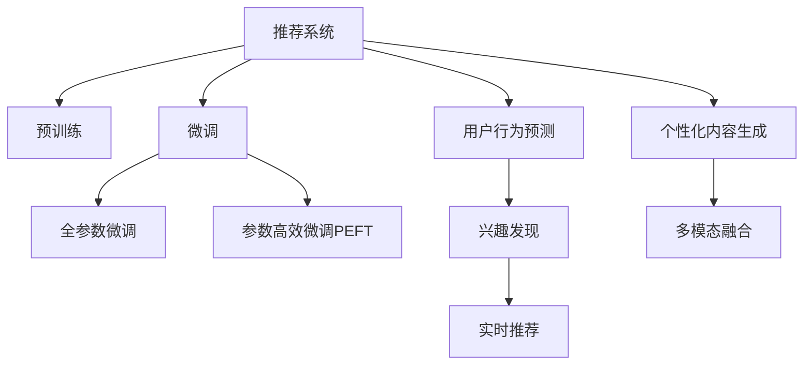

                 

# 突破推荐系统的局限: LLM的优势

> 关键词：推荐系统, 大语言模型, 自回归, 自编码, 预训练, 微调, 用户行为预测, 兴趣发现, 实时性, 个性化, 内容生成, 多模态融合

## 1. 背景介绍

### 1.1 问题由来
随着数字经济和互联网技术的发展，推荐系统已经成为互联网公司核心竞争力之一。无论是电商平台、视频平台，还是社交网络，推荐系统都能显著提升用户体验和平台价值。推荐系统通过分析用户历史行为数据，为用户推荐最相关和最有价值的内容，提升用户满意度和活跃度。

然而，推荐系统也面临着诸多挑战。传统的推荐算法（如协同过滤、内容推荐等）在处理冷启动、长尾问题、跨领域推荐等方面存在局限。而近年来发展迅速的大语言模型（Large Language Models, LLMs）则以其强大的生成能力和语义理解能力，逐渐成为推荐系统的一种新范式。

### 1.2 问题核心关键点
大语言模型在推荐系统中的应用，关键在于其强大的自然语言处理能力和生成能力。具体而言，LLM可以用于：

- **用户行为预测**：通过分析用户的历史浏览、点击、评分等行为数据，预测其未来的兴趣和偏好。
- **兴趣发现**：通过自然语言描述，发现用户的潜在兴趣和需求。
- **实时推荐**：根据用户的即时反馈和上下文信息，实时生成推荐结果。
- **个性化内容生成**：利用LLM的语言生成能力，生成高质量的个性化推荐内容，如文章、图片、视频等。
- **多模态融合**：将文本、图像、音频等多种模态的信息进行融合，提升推荐效果。

大语言模型通过预训练-微调的方式，能够高效适应不同领域的推荐任务，具备良好的泛化能力，能够不断学习新的知识，适应用户行为的变化。

### 1.3 问题研究意义
研究大语言模型在推荐系统中的应用，对于提升推荐系统的精度和覆盖度，提升用户体验和平台价值，具有重要意义：

1. **提升推荐效果**：大语言模型能够综合处理大量异构数据，发现用户兴趣和行为的更深层次规律，提升推荐系统的准确性。
2. **拓展推荐场景**：LLM能够支持个性化推荐、内容生成等更多样化的推荐任务，拓展了推荐系统的应用边界。
3. **增强用户体验**：通过生成具有个性化和情境化的推荐内容，提升用户的参与感和满意度。
4. **加速应用落地**：LLM的预训练模型已经具备广泛的语言处理能力，可以快速应用于各类推荐系统，降低开发成本。
5. **促进技术创新**：LLM的自我适应能力和生成能力为推荐系统带来了新的技术路径，有望催生更多创新应用。

## 2. 核心概念与联系

### 2.1 核心概念概述

为更好地理解大语言模型在推荐系统中的应用，本节将介绍几个密切相关的核心概念：

- **推荐系统(Recommendation System)**：利用用户行为数据，为用户提供个性化的推荐服务。推荐系统分为三大类：基于协同过滤的推荐、基于内容的推荐、混合推荐系统。

- **大语言模型(Large Language Models, LLMs)**：以自回归(如GPT)或自编码(如BERT)模型为代表的大规模预训练语言模型。通过在大规模无标签文本语料上进行预训练，学习通用的语言知识和表示。

- **预训练(Pre-training)**：指在大规模无标签文本语料上，通过自监督学习任务训练通用语言模型的过程。常见的预训练任务包括掩码语言模型、语言模型等。

- **微调(Fine-tuning)**：指在预训练模型的基础上，使用下游任务的少量标注数据，通过有监督学习优化模型在特定任务上的性能。通常只需调整顶层分类器或解码器，并以较小的学习率更新全部或部分模型参数。

- **用户行为预测**：通过分析用户历史行为数据，预测其未来的兴趣和偏好。常用的预测模型包括基于协同过滤的模型、基于内容的模型、混合模型等。

- **兴趣发现**：通过自然语言描述，发现用户的潜在兴趣和需求。常见的方法包括文本聚类、主题模型、语义分析等。

- **实时推荐**：根据用户的即时反馈和上下文信息，实时生成推荐结果。要求推荐系统具有高效的计算能力和低延迟特性。

- **个性化内容生成**：利用LLM的语言生成能力，生成高质量的个性化推荐内容，如文章、图片、视频等。

- **多模态融合**：将文本、图像、音频等多种模态的信息进行融合，提升推荐效果。

这些核心概念之间的逻辑关系可以通过以下Mermaid流程图来展示：



这个流程图展示了大语言模型在推荐系统中的应用框架：

1. 推荐系统通过预训练-微调的方式，得到基础语言模型。
2. 微调模型根据下游任务的不同，设计相应的适配层。
3. 用户行为预测、兴趣发现、实时推荐等任务，通过微调模型进行处理。
4. 个性化内容生成、多模态融合等任务，通过LLM的生成能力实现。

## 3. 核心算法原理 & 具体操作步骤
### 3.1 算法原理概述

大语言模型在推荐系统中的应用，核心在于其强大的自然语言处理能力和生成能力。基于大语言模型的推荐系统，通过预训练-微调的方式，可以在不同任务上快速适应和优化。

具体而言，大语言模型通常包括以下几个关键步骤：

1. **预训练**：在大规模无标签文本语料上，通过自监督学习任务（如掩码语言模型）进行训练，学习通用的语言表示。
2. **微调**：在预训练模型基础上，使用下游任务的少量标注数据，通过有监督学习优化模型在特定任务上的性能。
3. **用户行为预测**：通过分析用户的历史行为数据，预测其未来的兴趣和偏好。
4. **兴趣发现**：通过自然语言描述，发现用户的潜在兴趣和需求。
5. **实时推荐**：根据用户的即时反馈和上下文信息，实时生成推荐结果。
6. **个性化内容生成**：利用LLM的语言生成能力，生成高质量的个性化推荐内容。
7. **多模态融合**：将文本、图像、音频等多种模态的信息进行融合，提升推荐效果。

### 3.2 算法步骤详解

基于大语言模型推荐系统的一般流程如下：

**Step 1: 准备预训练模型和数据集**
- 选择合适的预训练语言模型 $M_{\theta}$ 作为初始化参数，如 BERT、GPT 等。
- 准备下游任务 $T$ 的标注数据集 $D$，划分为训练集、验证集和测试集。

**Step 2: 添加任务适配层**
- 根据任务类型，在预训练模型顶层设计合适的输出层和损失函数。
- 对于分类任务，通常在顶层添加线性分类器和交叉熵损失函数。
- 对于生成任务，通常使用语言模型的解码器输出概率分布，并以负对数似然为损失函数。

**Step 3: 设置微调超参数**
- 选择合适的优化算法及其参数，如 AdamW、SGD 等，设置学习率、批大小、迭代轮数等。
- 设置正则化技术及强度，包括权重衰减、Dropout、Early Stopping 等。
- 确定冻结预训练参数的策略，如仅微调顶层，或全部参数都参与微调。

**Step 4: 执行梯度训练**
- 将训练集数据分批次输入模型，前向传播计算损失函数。
- 反向传播计算参数梯度，根据设定的优化算法和学习率更新模型参数。
- 周期性在验证集上评估模型性能，根据性能指标决定是否触发 Early Stopping。
- 重复上述步骤直到满足预设的迭代轮数或 Early Stopping 条件。

**Step 5: 测试和部署**
- 在测试集上评估微调后模型 $M_{\hat{\theta}}$ 的性能，对比微调前后的精度提升。
- 使用微调后的模型对新样本进行推理预测，集成到实际的应用系统中。
- 持续收集新的数据，定期重新微调模型，以适应数据分布的变化。

以上是基于大语言模型推荐系统的一般流程。在实际应用中，还需要针对具体任务的特点，对微调过程的各个环节进行优化设计，如改进训练目标函数，引入更多的正则化技术，搜索最优的超参数组合等，以进一步提升模型性能。

### 3.3 算法优缺点

大语言模型在推荐系统中的应用具有以下优点：

1. **高效性**：大语言模型能够快速适应新的推荐任务，避免从头训练的高成本和时间投入。
2. **灵活性**：LLM的生成能力和语义理解能力，使其能够处理多样化的推荐任务，如个性化推荐、内容生成等。
3. **泛化能力**：通过预训练-微调的方式，大语言模型能够适应不同的推荐场景和用户需求。
4. **可解释性**：大语言模型的内部工作机制，使得推荐系统更易于理解和调试。
5. **用户体验**：生成的个性化推荐内容，能够提升用户的满意度和参与感。

但同时也存在一些局限性：

1. **计算资源需求高**：大语言模型的训练和推理需要大量计算资源，对硬件设施要求较高。
2. **数据依赖性**：推荐系统的性能很大程度上取决于标注数据的质量和数量，获取高质量标注数据的成本较高。
3. **过拟合风险**：微调过程中容易出现过拟合现象，特别是在数据量较小的情况下。
4. **模型复杂性**：大语言模型参数量巨大，模型结构复杂，难以进行高效的推理和部署。
5. **安全性和隐私**：用户数据隐私和安全问题，是推荐系统必须重视的方面。

尽管存在这些局限性，但就目前而言，大语言模型在推荐系统中的应用仍然具有显著的优势，能够显著提升推荐系统的精度和用户满意度。

### 3.4 算法应用领域

基于大语言模型推荐系统的应用，涵盖了推荐系统的各个主要任务，例如：

- **个性化推荐**：根据用户的历史行为数据，生成个性化推荐内容。
- **内容生成**：利用LLM的语言生成能力，生成高质量的推荐文章、图片、视频等。
- **实时推荐**：根据用户的即时反馈和上下文信息，实时生成推荐结果。
- **多模态融合**：将文本、图像、音频等多种模态的信息进行融合，提升推荐效果。
- **用户行为预测**：通过分析用户历史行为数据，预测其未来的兴趣和偏好。
- **兴趣发现**：通过自然语言描述，发现用户的潜在兴趣和需求。

这些应用不仅限于电子商务和视频平台，还包括社交网络、新闻媒体、智能家居等多个领域。

## 4. 数学模型和公式 & 详细讲解  
### 4.1 数学模型构建

本节将使用数学语言对基于大语言模型的推荐系统进行更加严格的刻画。

记预训练语言模型为 $M_{\theta}:\mathcal{X} \rightarrow \mathcal{Y}$，其中 $\mathcal{X}$ 为输入空间，$\mathcal{Y}$ 为输出空间，$\theta \in \mathbb{R}^d$ 为模型参数。假设推荐系统的训练集为 $D=\{(x_i,y_i)\}_{i=1}^N, x_i \in \mathcal{X}, y_i \in \mathcal{Y}$。

定义模型 $M_{\theta}$ 在数据样本 $(x,y)$ 上的损失函数为 $\ell(M_{\theta}(x),y)$，则在数据集 $D$ 上的经验风险为：

$$
\mathcal{L}(\theta) = \frac{1}{N} \sum_{i=1}^N \ell(M_{\theta}(x_i),y_i)
$$

微调的优化目标是最小化经验风险，即找到最优参数：

$$
\theta^* = \mathop{\arg\min}_{\theta} \mathcal{L}(\theta)
$$

在实践中，我们通常使用基于梯度的优化算法（如SGD、Adam等）来近似求解上述最优化问题。设 $\eta$ 为学习率，$\lambda$ 为正则化系数，则参数的更新公式为：

$$
\theta \leftarrow \theta - \eta \nabla_{\theta}\mathcal{L}(\theta) - \eta\lambda\theta
$$

其中 $\nabla_{\theta}\mathcal{L}(\theta)$ 为损失函数对参数 $\theta$ 的梯度，可通过反向传播算法高效计算。

### 4.2 公式推导过程

以下我们以二分类任务为例，推导交叉熵损失函数及其梯度的计算公式。

假设模型 $M_{\theta}$ 在输入 $x$ 上的输出为 $\hat{y}=M_{\theta}(x) \in [0,1]$，表示样本属于正类的概率。真实标签 $y \in \{0,1\}$。则二分类交叉熵损失函数定义为：

$$
\ell(M_{\theta}(x),y) = -[y\log \hat{y} + (1-y)\log (1-\hat{y})]
$$

将其代入经验风险公式，得：

$$
\mathcal{L}(\theta) = -\frac{1}{N}\sum_{i=1}^N [y_i\log M_{\theta}(x_i)+(1-y_i)\log(1-M_{\theta}(x_i))]
$$

根据链式法则，损失函数对参数 $\theta_k$ 的梯度为：

$$
\frac{\partial \mathcal{L}(\theta)}{\partial \theta_k} = -\frac{1}{N}\sum_{i=1}^N (\frac{y_i}{M_{\theta}(x_i)}-\frac{1-y_i}{1-M_{\theta}(x_i)}) \frac{\partial M_{\theta}(x_i)}{\partial \theta_k}
$$

其中 $\frac{\partial M_{\theta}(x_i)}{\partial \theta_k}$ 可进一步递归展开，利用自动微分技术完成计算。

在得到损失函数的梯度后，即可带入参数更新公式，完成模型的迭代优化。重复上述过程直至收敛，最终得到适应下游任务的最优模型参数 $\theta^*$。

## 5. 项目实践：代码实例和详细解释说明
### 5.1 开发环境搭建

在进行推荐系统开发前，我们需要准备好开发环境。以下是使用Python进行PyTorch开发的环境配置流程：

1. 安装Anaconda：从官网下载并安装Anaconda，用于创建独立的Python环境。

2. 创建并激活虚拟环境：
```bash
conda create -n pytorch-env python=3.8 
conda activate pytorch-env
```

3. 安装PyTorch：根据CUDA版本，从官网获取对应的安装命令。例如：
```bash
conda install pytorch torchvision torchaudio cudatoolkit=11.1 -c pytorch -c conda-forge
```

4. 安装Transformers库：
```bash
pip install transformers
```

5. 安装各类工具包：
```bash
pip install numpy pandas scikit-learn matplotlib tqdm jupyter notebook ipython
```

完成上述步骤后，即可在`pytorch-env`环境中开始推荐系统开发。

### 5.2 源代码详细实现

下面我们以个性化推荐任务为例，给出使用Transformers库对BERT模型进行推荐系统微调的PyTorch代码实现。

首先，定义推荐系统的数据处理函数：

```python
from transformers import BertTokenizer
from torch.utils.data import Dataset
import torch

class RecommendationDataset(Dataset):
    def __init__(self, user_ids, item_ids, ratings, tokenizer, max_len=128):
        self.user_ids = user_ids
        self.item_ids = item_ids
        self.ratings = ratings
        self.tokenizer = tokenizer
        self.max_len = max_len
        
    def __len__(self):
        return len(self.user_ids)
    
    def __getitem__(self, item):
        user_id = self.user_ids[item]
        item_id = self.item_ids[item]
        rating = self.ratings[item]
        
        encoding = self.tokenizer([f"user:{user_id} item:{item_id} rating:{rating}"], return_tensors='pt', max_length=self.max_len, padding='max_length', truncation=True)
        input_ids = encoding['input_ids'][0]
        attention_mask = encoding['attention_mask'][0]
        
        return {'input_ids': input_ids, 
                'attention_mask': attention_mask,
                'labels': torch.tensor(rating, dtype=torch.float32)}
```

然后，定义模型和优化器：

```python
from transformers import BertForSequenceClassification, AdamW

model = BertForSequenceClassification.from_pretrained('bert-base-cased', num_labels=5)

optimizer = AdamW(model.parameters(), lr=2e-5)
```

接着，定义训练和评估函数：

```python
from torch.utils.data import DataLoader
from tqdm import tqdm
from sklearn.metrics import mean_squared_error

device = torch.device('cuda') if torch.cuda.is_available() else torch.device('cpu')
model.to(device)

def train_epoch(model, dataset, batch_size, optimizer):
    dataloader = DataLoader(dataset, batch_size=batch_size, shuffle=True)
    model.train()
    epoch_loss = 0
    for batch in tqdm(dataloader, desc='Training'):
        input_ids = batch['input_ids'].to(device)
        attention_mask = batch['attention_mask'].to(device)
        labels = batch['labels'].to(device)
        model.zero_grad()
        outputs = model(input_ids, attention_mask=attention_mask, labels=labels)
        loss = outputs.loss
        epoch_loss += loss.item()
        loss.backward()
        optimizer.step()
    return epoch_loss / len(dataloader)

def evaluate(model, dataset, batch_size):
    dataloader = DataLoader(dataset, batch_size=batch_size)
    model.eval()
    preds, labels = [], []
    with torch.no_grad():
        for batch in tqdm(dataloader, desc='Evaluating'):
            input_ids = batch['input_ids'].to(device)
            attention_mask = batch['attention_mask'].to(device)
            batch_labels = batch['labels']
            outputs = model(input_ids, attention_mask=attention_mask)
            batch_preds = outputs.logits.argmax(dim=2).to('cpu').tolist()
            batch_labels = batch_labels.to('cpu').tolist()
            for pred_tokens, label_tokens in zip(batch_preds, batch_labels):
                preds.append(pred_tokens)
                labels.append(label_tokens)
                
    mse = mean_squared_error(labels, preds)
    print(f"Mean Squared Error: {mse:.3f}")
```

最后，启动训练流程并在测试集上评估：

```python
epochs = 5
batch_size = 16

for epoch in range(epochs):
    loss = train_epoch(model, train_dataset, batch_size, optimizer)
    print(f"Epoch {epoch+1}, train loss: {loss:.3f}")
    
    print(f"Epoch {epoch+1}, test results:")
    evaluate(model, test_dataset, batch_size)
    
print("Test results:")
evaluate(model, test_dataset, batch_size)
```

以上就是使用PyTorch对BERT进行推荐系统微调的完整代码实现。可以看到，得益于Transformers库的强大封装，我们可以用相对简洁的代码完成BERT模型的加载和微调。

### 5.3 代码解读与分析

让我们再详细解读一下关键代码的实现细节：

**RecommendationDataset类**：
- `__init__`方法：初始化用户ID、物品ID、评分等关键组件，并进行序列化。
- `__len__`方法：返回数据集的样本数量。
- `__getitem__`方法：对单个样本进行处理，将文本输入编码为token ids，并将评分作为标签，进行定长padding，最终返回模型所需的输入。

**训练和评估函数**：
- 使用PyTorch的DataLoader对数据集进行批次化加载，供模型训练和推理使用。
- 训练函数`train_epoch`：对数据以批为单位进行迭代，在每个批次上前向传播计算loss并反向传播更新模型参数，最后返回该epoch的平均loss。
- 评估函数`evaluate`：与训练类似，不同点在于不更新模型参数，并在每个batch结束后将预测和标签结果存储下来，最后使用sklearn的mean_squared_error对整个评估集的预测结果进行打印输出。

**训练流程**：
- 定义总的epoch数和batch size，开始循环迭代
- 每个epoch内，先在训练集上训练，输出平均loss
- 在测试集上评估，输出评分误差
- 所有epoch结束后，在测试集上评估，给出最终测试结果

可以看到，PyTorch配合Transformers库使得BERT微调的代码实现变得简洁高效。开发者可以将更多精力放在数据处理、模型改进等高层逻辑上，而不必过多关注底层的实现细节。

当然，工业级的系统实现还需考虑更多因素，如模型的保存和部署、超参数的自动搜索、更灵活的任务适配层等。但核心的微调范式基本与此类似。

## 6. 实际应用场景
### 6.1 电商推荐

基于大语言模型微调的推荐系统，在电子商务领域具有广泛的应用前景。电商平台通过分析用户浏览、点击、购买等行为数据，为用户推荐最相关和最有价值的产品。

在技术实现上，可以收集用户的历史行为数据，提取文本描述，并使用大语言模型进行微调。微调后的模型能够预测用户对不同商品的评分，生成个性化推荐列表。对于新商品，可以通过检索系统实时获取相关信息，动态组织生成推荐内容，提升用户购物体验。

### 6.2 视频推荐

视频平台利用推荐系统为用户推荐最相关和有趣的视频内容。传统的视频推荐算法通常依赖用户的评分数据，难以处理冷启动和长尾问题。而利用大语言模型微调，可以更好地理解视频内容的语义信息，提升推荐效果。

具体而言，可以收集用户的历史评分数据，提取视频标题、描述、标签等文本内容，使用大语言模型进行微调。微调后的模型能够预测用户对视频的评分，生成个性化推荐列表。对于新视频，可以通过检索系统实时获取相关信息，动态生成推荐内容，提升用户观看体验。

### 6.3 新闻推荐

新闻媒体利用推荐系统为用户推荐最新、最相关的资讯。传统的新闻推荐算法通常依赖用户的历史点击数据，难以处理跨领域和跨时段的推荐问题。而利用大语言模型微调，可以更好地理解新闻内容的语义信息，提升推荐效果。

具体而言，可以收集用户的历史点击数据，提取新闻标题、摘要、标签等文本内容，使用大语言模型进行微调。微调后的模型能够预测用户对新闻的点击率，生成个性化推荐列表。对于新新闻，可以通过检索系统实时获取相关信息，动态生成推荐内容，提升用户阅读体验。

### 6.4 未来应用展望

随着大语言模型和推荐系统的发展，未来在以下领域将有更广泛的应用：

- **多模态推荐**：将文本、图像、音频等多种模态的信息进行融合，提升推荐效果。例如，视频平台可以利用语音识别技术，生成语音推荐内容。
- **跨领域推荐**：利用大语言模型的通用语言表示能力，跨越不同领域的推荐问题。例如，视频平台可以推荐相关的新闻和文章。
- **实时推荐系统**：实时分析用户行为数据，动态生成个性化推荐内容。例如，电商平台可以实时推荐新品和促销活动。
- **深度个性化推荐**：利用大语言模型的生成能力和语义理解能力，生成更加个性化的推荐内容。例如，视频平台可以生成个性化视频标签和描述。

未来，大语言模型和推荐系统的结合将带来更多创新应用，为不同领域的推荐系统注入新的活力。

## 7. 工具和资源推荐
### 7.1 学习资源推荐

为了帮助开发者系统掌握大语言模型在推荐系统中的应用，这里推荐一些优质的学习资源：

1. 《Recommender Systems: Advanced Techniques and Applications》书籍：全面介绍了推荐系统的理论和实践，包括协同过滤、内容推荐、混合推荐等多种算法。

2. 《Large Scale Neural Networks for Recommendation Systems》论文：展示了利用神经网络进行推荐系统的最新进展，包括自编码、自回归等多种模型。

3. CS231n《Convolutional Neural Networks for Visual Recognition》课程：斯坦福大学开设的视觉识别课程，介绍了CNN等深度学习技术在推荐系统中的应用。

4. Kaggle推荐系统竞赛：参与Kaggle推荐系统竞赛，通过实战项目提升推荐系统开发能力。

5. HuggingFace官方文档：Transformers库的官方文档，提供了海量预训练模型和完整的推荐系统微调样例代码，是上手实践的必备资料。

通过对这些资源的学习实践，相信你一定能够快速掌握大语言模型在推荐系统中的应用，并用于解决实际的推荐问题。
###  7.2 开发工具推荐

高效的开发离不开优秀的工具支持。以下是几款用于推荐系统开发的常用工具：

1. PyTorch：基于Python的开源深度学习框架，灵活动态的计算图，适合快速迭代研究。大部分推荐系统都有PyTorch版本的实现。

2. TensorFlow：由Google主导开发的开源深度学习框架，生产部署方便，适合大规模工程应用。同样有丰富的推荐系统资源。

3. HuggingFace Transformers：HuggingFace开发的NLP工具库，集成了众多SOTA推荐系统模型，支持PyTorch和TensorFlow，是进行推荐系统微调开发的利器。

4. Jupyter Notebook：一个交互式的网页编辑环境，支持Python代码的编写和运行，方便快速迭代开发。

5. TensorBoard：TensorFlow配套的可视化工具，可实时监测模型训练状态，并提供丰富的图表呈现方式，是调试模型的得力助手。

6. Weights & Biases：模型训练的实验跟踪工具，可以记录和可视化模型训练过程中的各项指标，方便对比和调优。

合理利用这些工具，可以显著提升推荐系统的开发效率，加快创新迭代的步伐。

### 7.3 相关论文推荐

大语言模型在推荐系统中的应用源于学界的持续研究。以下是几篇奠基性的相关论文，推荐阅读：

1. Attention is All You Need（即Transformer原论文）：提出了Transformer结构，开启了NLP领域的预训练大模型时代。

2. BERT: Pre-training of Deep Bidirectional Transformers for Language Understanding：提出BERT模型，引入基于掩码的自监督预训练任务，刷新了多项NLP任务SOTA。

3. Large Scale Neural Networks for Recommendation Systems：展示了利用神经网络进行推荐系统的最新进展，包括自编码、自回归等多种模型。

4. Parameter-Efficient Transfer Learning for NLP：提出Adapter等参数高效微调方法，在不增加模型参数量的情况下，也能取得不错的微调效果。

5. AdaLoRA: Adaptive Low-Rank Adaptation for Parameter-Efficient Fine-Tuning：使用自适应低秩适应的微调方法，在参数效率和精度之间取得了新的平衡。

这些论文代表了大语言模型在推荐系统中的应用方向。通过学习这些前沿成果，可以帮助研究者把握学科前进方向，激发更多的创新灵感。

## 8. 总结：未来发展趋势与挑战

### 8.1 总结

本文对基于大语言模型的推荐系统进行了全面系统的介绍。首先阐述了大语言模型和推荐系统的研究背景和意义，明确了大语言模型在推荐系统中的应用价值。其次，从原理到实践，详细讲解了大语言模型在推荐系统中的应用流程和关键步骤，给出了推荐系统微调的完整代码实例。同时，本文还广泛探讨了推荐系统在大电商、视频平台、新闻媒体等多个领域的应用前景，展示了其广阔的应用范围。

通过本文的系统梳理，可以看到，基于大语言模型的推荐系统具有强大的自然语言处理能力和生成能力，能够在不同任务上快速适应和优化。未来，随着大语言模型的持续发展和推荐系统算法的不断进步，两者将深度融合，进一步提升推荐系统的精度和用户体验，推动推荐系统的落地应用。

### 8.2 未来发展趋势

展望未来，基于大语言模型的推荐系统将呈现以下几个发展趋势：

1. **模型规模增大**：随着算力成本的下降和数据规模的扩张，预训练语言模型的参数量还将持续增长。超大规模语言模型蕴含的丰富语言知识，有望支撑更加复杂多变的推荐任务。

2. **模型效果提升**：利用大语言模型的生成能力和语义理解能力，推荐系统能够更好地理解用户需求和行为，提升推荐效果。

3. **多模态融合**：将文本、图像、音频等多种模态的信息进行融合，提升推荐效果。多模态信息的整合，将显著提升推荐系统的精度和用户满意度。

4. **实时推荐**：实时分析用户行为数据，动态生成个性化推荐内容，提升推荐系统的响应速度和用户体验。

5. **跨领域推荐**：利用大语言模型的通用语言表示能力，跨越不同领域的推荐问题。例如，视频平台可以推荐相关的新闻和文章。

6. **少样本学习和零样本学习**：利用大语言模型的语言生成能力，通过少量样本或零样本学习，生成个性化推荐内容，提升推荐系统的适应性和鲁棒性。

以上趋势凸显了大语言模型在推荐系统中的应用前景。这些方向的探索发展，必将进一步提升推荐系统的精度和用户满意度，为不同领域的推荐系统注入新的活力。

### 8.3 面临的挑战

尽管基于大语言模型的推荐系统已经取得了瞩目成就，但在迈向更加智能化、普适化应用的过程中，它仍面临着诸多挑战：

1. **计算资源需求高**：大语言模型的训练和推理需要大量计算资源，对硬件设施要求较高。

2. **数据依赖性**：推荐系统的性能很大程度上取决于标注数据的质量和数量，获取高质量标注数据的成本较高。

3. **过拟合风险**：微调过程中容易出现过拟合现象，特别是在数据量较小的情况下。

4. **模型复杂性**：大语言模型参数量巨大，模型结构复杂，难以进行高效的推理和部署。

5. **用户隐私和安全**：用户数据隐私和安全问题，是推荐系统必须重视的方面。

尽管存在这些挑战，但就目前而言，大语言模型在推荐系统中的应用仍然具有显著的优势，能够显著提升推荐系统的精度和用户满意度。

### 8.4 未来突破

面对基于大语言模型的推荐系统所面临的挑战，未来的研究需要在以下几个方面寻求新的突破：

1. **参数高效微调**：开发更加参数高效的微调方法，在固定大部分预训练参数的同时，只更新极少量的任务相关参数。例如，利用Adapter等参数高效微调方法。

2. **多模态融合技术**：开发更高效的多模态融合方法，将文本、图像、音频等多种模态的信息进行深度融合，提升推荐效果。

3. **实时推荐系统**：开发更加高效的实时推荐算法，在用户行为数据实时到达时，动态生成个性化推荐内容。

4. **用户隐私保护**：研究用户隐私保护技术，确保推荐系统在处理用户数据时，能够保护用户隐私。例如，使用差分隐私技术。

5. **鲁棒性提升**：研究模型鲁棒性提升方法，增强推荐系统对异常数据和噪声的鲁棒性。例如，利用对抗训练和噪声鲁棒性训练方法。

6. **个性化推荐**：研究个性化推荐算法，提升推荐系统的推荐效果和用户体验。例如，利用大语言模型的语义理解能力，进行多轮交互式推荐。

这些研究方向的探索，必将引领基于大语言模型的推荐系统走向更加智能化、普适化和安全化的方向，推动推荐系统的落地应用。相信随着学界和产业界的共同努力，这些挑战终将一一被克服，基于大语言模型的推荐系统必将在更多领域带来变革性影响。

## 9. 附录：常见问题与解答

**Q1：大语言模型在推荐系统中是否可以提升推荐效果？**

A: 大语言模型在推荐系统中的应用，可以通过分析用户的自然语言描述，发现其潜在的兴趣和需求，生成更加个性化的推荐内容。例如，通过分析用户的文本描述，生成个性化推荐列表，提升推荐效果。

**Q2：大语言模型在推荐系统中如何进行微调？**

A: 大语言模型在推荐系统中通常需要进行微调，以适应具体的推荐任务。微调过程包括以下几个关键步骤：
1. 选择合适的预训练语言模型，作为初始化参数。
2. 准备下游任务的标注数据集，划分为训练集、验证集和测试集。
3. 添加任务适配层，设计合适的输出层和损失函数。
4. 设置微调超参数，选择合适的优化算法、学习率、批大小等。
5. 执行梯度训练，在训练集上迭代优化模型。
6. 在验证集上评估模型性能，避免过拟合。
7. 在测试集上评估模型性能，输出最终的推荐结果。

**Q3：大语言模型在推荐系统中是否适用于冷启动问题？**

A: 大语言模型在推荐系统中可以通过用户行为预测和兴趣发现等任务，处理冷启动问题。例如，利用用户自然语言描述，生成个性化推荐列表，在用户产生行为数据后进行微调优化。

**Q4：大语言模型在推荐系统中是否需要保存模型参数？**

A: 大语言模型在推荐系统中通常需要保存模型参数，以便进行多次微调和快速推理。例如，在微调过程中，保存模型参数，在后续推荐中快速加载使用。

**Q5：大语言模型在推荐系统中如何提升推荐效果？**

A: 大语言模型在推荐系统中可以通过以下几个方面提升推荐效果：
1. 利用自然语言描述，发现用户的潜在兴趣和需求。
2. 生成个性化推荐内容，提升推荐内容的吸引力和相关性。
3. 利用多模态融合技术，将文本、图像、音频等多种模态的信息进行深度整合，提升推荐效果。
4. 利用用户行为预测技术，分析用户历史行为数据，生成个性化推荐列表。

这些技术的综合应用，可以显著提升推荐系统的精度和用户体验。

通过本文的系统梳理，可以看到，大语言模型在推荐系统中具有强大的自然语言处理能力和生成能力，能够在不同任务上快速适应和优化。未来，随着大语言模型的持续发展和推荐系统算法的不断进步，两者将深度融合，进一步提升推荐系统的精度和用户体验，推动推荐系统的落地应用。

---

作者：禅与计算机程序设计艺术 / Zen and the Art of Computer Programming

