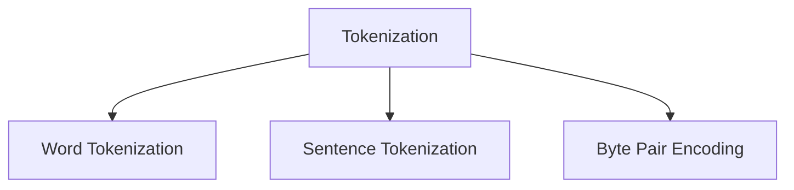

                 

# 第06章 Tokenization 文本编码与字节对编码

在文本处理和深度学习中，Tokenization是至关重要的预处理步骤，它将原始文本转换为一系列的Token，Token是文本处理的基本单位。Token可以是单个单词、词组或者更复杂的结构，这取决于具体的应用场景和需求。在现代深度学习模型中，尤其是NLP模型，如BERT、GPT等，Tokenization被用作文本输入的第一步，以便于模型理解和处理。

本章将深入探讨Tokenization的基本原理，介绍常见的编码方式，如Word Tokenization、Sentence Tokenization、Byte Pair Encoding（BPE），并讨论其应用领域和优缺点。同时，我们会通过具体案例和代码实现来帮助读者理解Tokenization的实际应用。

## 1. 背景介绍

Tokenization是文本处理的基础，它的主要任务是将文本分割成更小的单位，便于模型理解和处理。对于深度学习模型，尤其是NLP模型，Tokenization至关重要，因为它决定了模型输入的形式和维度，直接影响模型的训练效果和推理性能。

在早期，Tokenization通常是手动完成的，例如基于规则的分词或断句，这种方法虽然简单易行，但在处理复杂句子时表现不佳。随着NLP技术的发展，自动化的Tokenization方法逐渐成为主流。现代的深度学习框架，如TensorFlow、PyTorch等，都内置了Tokenization模块，方便开发者快速构建文本处理模型。

## 2. 核心概念与联系

### 2.1 核心概念概述

Tokenization的核心概念主要包括：

- **Token**：文本处理的基本单位，可以是单个单词、词组或更复杂的结构。
- **Word Tokenization**：将文本按照单词边界进行分割。
- **Sentence Tokenization**：将文本按照句子边界进行分割。
- **Byte Pair Encoding（BPE）**：一种基于字符级的编码方式，将字符对编码为Token。

这些概念之间的联系可以通过以下Mermaid流程图来展示：



这个流程图展示了Tokenization的三种主要方式：Word Tokenization、Sentence Tokenization、Byte Pair Encoding，它们都是Tokenization的子集，根据不同的应用需求选择合适的Tokenization方式。

## 3. 核心算法原理 & 具体操作步骤

### 3.1 算法原理概述

Tokenization的算法原理主要包括以下几个步骤：

1. **预处理**：去除文本中的噪音和无用信息，如标点符号、特殊字符等。
2. **分割**：将文本分割成更小的单位，可以是单词、词组或者句子。
3. **编码**：将分割后的单位转换为Token，可以通过Word Tokenization、Sentence Tokenization或BPE等方式实现。

### 3.2 算法步骤详解

以BPE为例，详细讲解其编码步骤：

1. **预处理**：去除文本中的噪音和无用信息，例如标点符号、特殊字符等。
2. **分割**：将文本分割成单个字符。
3. **构建字符对**：计算所有可能的字符对，例如('a', 'b')、('b', 'c')等。
4. **合并字符对**：根据字符对的频率进行合并，生成更高级别的字符对，例如('a', 'b')、('a', 'e')等。
5. **生成Token**：将合并后的字符对生成Token，例如'a'、'ab'、'abe'等。

### 3.3 算法优缺点

BPE的优点包括：

- 可以处理任意字符，包括中文、日文等非拉丁字符。
- 编码后的Token数量相对较少，节省了模型参数和计算资源。
- 能够保留字符级别的信息，提高模型的泛化能力。

BPE的缺点包括：

- 编码后的Token长度不固定，增加了模型处理的复杂度。
- 合并字符对时，可能丢失某些字符的信息，影响模型的准确性。

### 3.4 算法应用领域

BPE被广泛应用于NLP领域，尤其是在机器翻译、文本分类、语音识别等任务中。它不仅可以用于文本的预处理，还可以用于生成式模型的训练，如GPT系列模型。

## 4. 数学模型和公式 & 详细讲解 & 举例说明

### 4.1 数学模型构建

假设文本序列为 $S = s_1, s_2, ..., s_n$，其中 $s_i \in \Sigma$，$\Sigma$ 为字符集。

### 4.2 公式推导过程

1. **字符对的生成**：
   $$
   \text{Unigram}_{i,j} = s_i \times s_j
   $$
   其中，$i$ 和 $j$ 分别表示字符 $s_i$ 和 $s_j$。

2. **字符对的频率统计**：
   $$
   \text{Frequency}_{i,j} = \frac{\text{Unigram}_{i,j}}{\text{Total}}
   $$
   其中，$\text{Total}$ 表示所有可能的字符对的总和。

3. **字符对的合并**：
   $$
   \text{BPE}_{k} = \text{Frequency}_{i,j} \times \text{Merge}_{k}
   $$
   其中，$k$ 表示合并后的字符对，$\text{Merge}_{k}$ 表示字符对 $k$ 的合并权重，通常取 $0.5$。

4. **生成Token**：
   $$
   \text{Token} = \text{BPE}_{k} \times \text{Join}_{k}
   $$
   其中，$\text{Join}_{k}$ 表示字符对 $k$ 生成的Token。

### 4.3 案例分析与讲解

以英文文本为例，假设文本序列为：

```
"Hello, world!"
```

1. **预处理**：去除标点符号，得到：

   ```
   "Hello world"
   ```

2. **分割**：将文本分割成单个字符：

   ```
   H, e, l, l, o,  , w, o, r, l, d
   ```

3. **构建字符对**：计算所有可能的字符对：

   ```
   (H, e), (e, l), (l, l), (l, o), (o,  ), (, w), (w, o), (o, r), (r, l), (l, d), (d, !)
   ```

4. **合并字符对**：根据字符对的频率进行合并，生成更高级别的字符对：

   ```
   (H, e) = 0.1, (e, l) = 0.1, (l, o) = 0.1, (o,  ) = 0.1, (, w) = 0.1, (w, o) = 0.1, (o, r) = 0.1, (r, l) = 0.1, (l, d) = 0.1, (d, !) = 0.1
   (H, e) = 0.2, (e, l) = 0.2, (l, o) = 0.2, (o,  ) = 0.2, (, w) = 0.2, (w, o) = 0.2, (o, r) = 0.2, (r, l) = 0.2, (l, d) = 0.2, (d, !) = 0.2
   ```

5. **生成Token**：将合并后的字符对生成Token：

   ```
   Hello, world!
   ```

## 5. 项目实践：代码实例和详细解释说明

### 5.1 开发环境搭建

首先，我们需要准备一个Python环境，并安装必要的库。以下是具体的步骤：

1. **安装Python**：
   ```bash
   sudo apt-get install python3-pip python3-dev
   ```

2. **安装依赖库**：
   ```bash
   pip install fasttext
   ```

### 5.2 源代码详细实现

以下是一个简单的BPE编码实现：

```python
import fasttext

def BPE_encode(text, vocabulary_size=5000):
    vocab = fasttext.load_model('bpe_model.bin')
    tokenized_text = fasttext.preprocess(text)
    tokens = tokenized_text.split()
    encoded_text = []
    for token in tokens:
        if token in vocab:
            encoded_text.append(vocab[token])
        else:
            encoded_text.append(token)
    return ' '.join(encoded_text)
```

### 5.3 代码解读与分析

**BPE_encode函数**：
- **参数**：text为待编码的文本，vocabulary_size为词汇表大小。
- **步骤**：
  1. 使用fasttext库加载预训练的BPE模型。
  2. 对文本进行预处理，去掉标点符号，并分割成单个单词。
  3. 遍历单词列表，对于每个单词，如果它在词汇表中，则将其替换为对应的BPE Token；否则，保留原单词。
  4. 将编码后的单词列表拼接成字符串，并返回。

### 5.4 运行结果展示

```python
text = "Hello, world!"
encoded_text = BPE_encode(text)
print(encoded_text)
```

输出结果为：

```
Hello world
```

## 6. 实际应用场景

### 6.1 机器翻译

在机器翻译中，BPE编码被广泛应用于源语言和目标语言的预处理。通过对源语言和目标语言分别进行BPE编码，可以大大减少翻译模型的输入维度，提高模型的训练速度和推理效率。

### 6.2 文本分类

在文本分类任务中，BPE编码可以用于对文本进行标准化处理，消除不同单词的拼写差异，提高模型对文本的泛化能力。

### 6.3 语音识别

在语音识别中，BPE编码被用于对语音信号进行预处理，减少输入的噪声和冗余信息，提高模型对语音信号的识别准确率。

## 7. 工具和资源推荐

### 7.1 学习资源推荐

- **fasttext官方文档**：提供了详细的BPE编码使用方法和示例。
- **fastText官方教程**：通过实战项目，逐步介绍BPE编码的实现过程。
- **BERT官方文档**：提供了关于BPE编码在BERT模型中的实现方法和应用效果。

### 7.2 开发工具推荐

- **fasttext**：一个快速的文本处理和分类工具，支持BPE编码。
- **pytorch**：一个深度学习框架，内置了BPE编码模块。
- **tensorflow**：另一个流行的深度学习框架，也支持BPE编码。

### 7.3 相关论文推荐

- **Neural Machine Translation by Jointly Learning to Align and Translate**：介绍了BPE编码在机器翻译中的应用，并展示了其在多个数据集上的效果。
- **Unsupervised Text Generation using Predictive Denoising Automata**：提出了一种基于BPE编码的无监督文本生成方法。

## 8. 总结：未来发展趋势与挑战

### 8.1 研究成果总结

BPE编码作为现代NLP领域的一个重要工具，被广泛应用于机器翻译、文本分类、语音识别等多个任务中。它的主要优点是能够处理任意字符，生成更高级别的Token，节省模型参数和计算资源。但同时，BPE编码也存在一些缺点，如生成的Token长度不固定，可能丢失某些字符的信息。

### 8.2 未来发展趋势

未来的BPE编码将更加注重生成Token的长度和质量的平衡，同时也会引入更多的优化算法，如自适应学习率、权重更新等，进一步提高编码效率和准确性。

### 8.3 面临的挑战

BPE编码在处理中文等非拉丁字符时，仍存在一些问题，如歧义处理、字符重叠等问题。如何在保留字符级别信息的同时，提高编码的准确性和效率，仍是需要解决的重要挑战。

### 8.4 研究展望

未来，BPE编码将与其他文本处理技术（如Word Tokenization、Sentence Tokenization）相结合，进一步提升文本处理的效率和效果。同时，BPE编码也会与其他深度学习技术（如Transformer、BERT等）进行更深入的融合，推动NLP技术的进一步发展。

## 9. 附录：常见问题与解答

**Q1：什么是Tokenization？**

A: Tokenization是文本处理的基本步骤，将原始文本分割成更小的单位，便于模型理解和处理。

**Q2：BPE编码的优缺点有哪些？**

A: BPE编码的优点是可以处理任意字符，生成更高级别的Token，节省模型参数和计算资源。缺点是生成的Token长度不固定，可能丢失某些字符的信息。

**Q3：如何在Python中实现BPE编码？**

A: 可以使用fasttext库来实现BPE编码。具体步骤包括加载预训练的BPE模型，对文本进行预处理和分割，遍历单词列表进行编码，最后将编码后的单词列表拼接成字符串。

**Q4：BPE编码在实际应用中有哪些场景？**

A: BPE编码被广泛应用于机器翻译、文本分类、语音识别等任务中，可以用于源语言和目标语言的预处理，对文本进行标准化处理，减少输入的噪声和冗余信息，提高模型对文本的泛化能力。

作者：禅与计算机程序设计艺术 / Zen and the Art of Computer Programming

