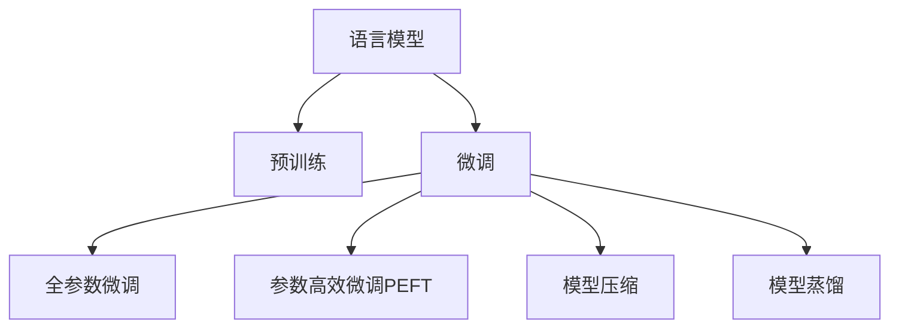

                 

# 第二章：选择合适的语言模型

## 1. 背景介绍

### 1.1 问题由来

在自然语言处理(Natural Language Processing, NLP)领域，选择合适的语言模型是提高模型效果和计算效率的重要环节。语言模型用于对文本数据进行概率建模，能够帮助机器更好地理解自然语言的语法和语义结构，广泛应用于文本分类、机器翻译、对话系统、语音识别等多个NLP任务中。

传统的语言模型包括基于统计的语言模型和基于神经网络的语言模型。前者如n-gram模型，可以捕捉词语之间的统计关系，但无法捕捉复杂的语义关系；后者如循环神经网络(RNN)、卷积神经网络(CNN)等，能够学习词语之间的依赖关系，但计算复杂度高，难以处理长文本。近年来，随着深度学习技术的发展，基于Transformer结构的大语言模型成为研究热点，取得了显著的性能提升。

### 1.2 问题核心关键点

选择语言模型时，主要考虑以下几个关键点：

- 模型参数规模：模型参数量越大，计算资源消耗越高，但表现能力越强。
- 预训练任务：不同预训练任务会影响模型的学习能力和泛化能力。
- 任务适配性：模型对特定任务的适配能力，包括微调效果、参数高效微调能力等。
- 模型结构：模型结构对计算资源、推理速度的影响。
- 模型应用场景：模型的应用场景，如机器翻译、文本分类、对话系统等。
- 模型计算效率：模型在实际应用中的计算效率，如推理速度、内存占用等。

选择合适的语言模型，需要综合考虑以上因素，找到性能、资源消耗和应用效果的最佳平衡点。

### 1.3 问题研究意义

选择合适的大语言模型，对于NLP技术的产业化进程和应用效果具有重要意义：

1. 提升模型性能：不同的语言模型对特定任务的表现效果不同，选择合适的模型可以显著提升模型性能。
2. 减少计算成本：合适的语言模型在计算资源消耗和推理速度上更具优势，降低模型训练和应用成本。
3. 优化资源利用：合理选择模型结构可以优化计算资源和存储资源的使用，提高系统整体效率。
4. 加速应用部署：合适的模型更易部署到生产环境中，加快NLP技术的落地应用。
5. 促进创新应用：选择适合的模型可以推动更多创新应用场景的探索，促进NLP技术在更多领域的应用。

## 2. 核心概念与联系

### 2.1 核心概念概述

为更好地理解选择合适的语言模型，本节将介绍几个密切相关的核心概念：

- 语言模型(Language Model)：用于对文本数据进行概率建模的模型，可以评估句子或文本的概率分布，是NLP中的基础模型。
- 预训练(Pre-training)：指在大量无标签数据上，通过自监督学习任务训练语言模型的过程。常用的预训练任务包括掩码语言模型、下一句预测等。
- 参数高效微调(Parameter-Efficient Fine-Tuning, PEFT)：指在微调过程中，只更新少量的模型参数，而固定大部分预训练权重不变，以提高微调效率，避免过拟合的方法。
- 模型压缩(模型剪枝、量化)：指通过减少模型参数量或降低参数精度，减少计算资源和存储资源消耗，提升模型推理速度的方法。
- 模型蒸馏(Distillation)：指通过知识传递机制，将大模型的知识迁移到小模型，实现模型压缩和推理加速的方法。

这些核心概念之间的逻辑关系可以通过以下Mermaid流程图来展示：



这个流程图展示了大语言模型的核心概念及其之间的关系：

1. 语言模型通过预训练获得基础能力。
2. 微调是对预训练模型进行任务特定的优化，可以分为全参数微调和参数高效微调（PEFT）。
3. 模型压缩可以优化计算资源和存储资源的使用，提升模型推理速度。
4. 模型蒸馏可以将大模型的知识迁移到小模型，实现模型压缩和推理加速。

这些概念共同构成了大语言模型的学习和应用框架，使其能够在各种场景下发挥强大的语言理解和生成能力。通过理解这些核心概念，我们可以更好地把握大语言模型的工作原理和优化方向。

## 3. 核心算法原理 & 具体操作步骤

### 3.1 算法原理概述

选择语言模型的过程，本质上是一个模型评估和优化的过程。需要综合考虑模型参数规模、预训练任务、任务适配性、模型结构、计算效率等多个因素，以找到最适合当前应用场景的模型。

### 3.2 算法步骤详解

选择合适的语言模型，一般需要经历以下步骤：

**Step 1: 收集预训练模型信息**

- 根据任务需求，收集各类预训练语言模型，包括模型名称、参数规模、预训练任务、模型结构、性能指标等。
- 使用学术、工业界的评测指标，如BLEU、ROUGE、METEOR等，对模型进行初步比较。

**Step 2: 准备微调环境**

- 搭建微调开发环境，包括安装必要的深度学习框架、模型库等。
- 选择合适的微调超参数，如学习率、批大小、优化器等。
- 准备下游任务的数据集，进行数据预处理和划分。

**Step 3: 选择预训练模型**

- 在多个候选预训练模型中，根据任务需求和计算资源，选择最合适的模型。
- 根据不同模型的参数规模和计算效率，合理分配计算资源。

**Step 4: 模型微调**

- 将预训练模型进行任务适配，增加或调整任务相关的层和参数。
- 在少量标注数据上，使用微调方法对模型进行优化。
- 评估微调后模型的性能，根据评估结果进行模型选择和优化。

**Step 5: 模型部署**

- 将微调后的模型集成到实际应用系统中。
- 进行模型压缩和优化，提升模型推理速度和资源利用效率。
- 监控模型性能，持续优化和更新模型。

以上是选择语言模型的基本步骤，需要根据具体任务和数据特点进行灵活调整。

### 3.3 算法优缺点

选择语言模型的方法具有以下优点：

1. 模型评估全面。通过收集和比较多个预训练模型的性能指标，可以从多个维度评估模型的优劣。
2. 选择合适的模型。综合考虑任务需求和计算资源，能够找到最合适的模型，提升模型性能和应用效果。
3. 模型微调高效。选择合适的预训练模型后，只需进行少量微调即可提升模型效果，降低开发成本和资源消耗。
4. 模型压缩优化。通过模型压缩技术，可以在不降低模型效果的前提下，大幅提升模型推理速度和资源利用效率。
5. 模型蒸馏可控。通过模型蒸馏，可以将大模型的知识迁移到小模型，实现模型压缩和推理加速。

同时，该方法也存在一定的局限性：

1. 预训练模型数量有限。目前主流的预训练模型有限，选择范围受限。
2. 模型评估耗时耗力。模型评估过程需要大量计算资源和时间，可能影响项目进度。
3. 微调效果不绝对。不同任务和数据集对模型的微调效果影响较大，可能存在一定的随机性。
4. 模型计算效率受限。部分模型计算效率较低，推理速度较慢，可能影响实际应用效果。

尽管存在这些局限性，但就目前而言，选择合适的大语言模型仍然是NLP技术开发的重要步骤。未来相关研究的重点在于如何进一步拓展预训练语言模型的选择空间，降低模型评估的复杂度，提升模型计算效率。

### 3.4 算法应用领域

选择合适的大语言模型，已经在NLP的多个领域得到了广泛应用，如：

- 文本分类：如情感分析、主题分类、意图识别等。通过选择适合的语言模型，可以提升分类精度和泛化能力。
- 机器翻译：将源语言文本翻译成目标语言。通过选择适合的语言模型，可以提升翻译质量，加速翻译速度。
- 对话系统：使机器能够与人自然对话。通过选择适合的语言模型，可以提升对话流畅度和自然性。
- 文本摘要：将长文本压缩成简短摘要。通过选择适合的语言模型，可以提升摘要的准确性和简洁性。
- 文本生成：生成自然流畅的文本。通过选择适合的语言模型，可以提升文本生成的流畅度和多样性。
- 代码生成：生成符合语法规则的代码。通过选择适合的语言模型，可以提升代码生成的准确性和可读性。

除了上述这些经典任务外，大语言模型选择方法也在更多场景中得到应用，如可控文本生成、常识推理、数据增强等，为NLP技术带来了新的突破。随着预训练模型和选择方法的不断进步，相信NLP技术将在更广阔的应用领域大放异彩。

## 4. 数学模型和公式 & 详细讲解 & 举例说明

### 4.1 数学模型构建

选择语言模型时，需要根据任务需求构建合适的数学模型。以下以文本分类任务为例，给出基于神经网络的语言模型的数学模型构建过程。

记输入文本为 $x$，文本分类模型为 $M_{\theta}$，输出为 $y$。模型的训练目标是最小化损失函数 $\mathcal{L}$，表示模型输出与真实标签的差异。假设模型输出为 $p(y|x)$，则损失函数可以定义为：

$$
\mathcal{L}(\theta) = -\frac{1}{N} \sum_{i=1}^N \log p(y_i|x_i)
$$

其中 $N$ 为训练样本数量，$y_i$ 为第 $i$ 个样本的真实标签。

### 4.2 公式推导过程

假设模型 $M_{\theta}$ 为神经网络结构，输入 $x$ 通过一系列层和激活函数转化为输出 $y$。输出层使用softmax函数，将输出转化为类别概率分布。损失函数可以进一步展开为：

$$
\mathcal{L}(\theta) = -\frac{1}{N} \sum_{i=1}^N \log \frac{e^{y_i\log p_i}}{\sum_{j=1}^C e^{y_j\log p_j}}
$$

其中 $C$ 为类别数，$p_i$ 为模型对第 $i$ 个类别的概率预测。

通过梯度下降等优化算法，模型参数 $\theta$ 更新公式为：

$$
\theta \leftarrow \theta - \eta \nabla_{\theta}\mathcal{L}(\theta)
$$

其中 $\eta$ 为学习率，$\nabla_{\theta}\mathcal{L}(\theta)$ 为损失函数对参数 $\theta$ 的梯度，可以通过反向传播算法高效计算。

### 4.3 案例分析与讲解

以下以BERT和GPT为例，分析两种预训练语言模型在文本分类任务中的选择和微调过程。

**BERT模型**：

BERT是由Google提出的预训练语言模型，基于Transformer结构，通过在大量无标签文本数据上进行自监督学习，学习到丰富的语言表示。BERT模型的计算复杂度较高，但表现能力较强，适用于高精度需求的任务。

**GPT模型**：

GPT是由OpenAI提出的预训练语言模型，基于自回归Transformer结构，能够生成高质量的自然语言文本。GPT模型在计算速度上具有优势，适用于需要高推理效率的任务。

在文本分类任务中，可以根据任务需求选择适合的模型。如果需要高精度，可以选择BERT模型，并进行微调；如果需要高推理效率，可以选择GPT模型，并进行微调。

## 5. 项目实践：代码实例和详细解释说明

### 5.1 开发环境搭建

在进行语言模型选择和微调实践前，需要先搭建好开发环境。以下是使用Python进行PyTorch开发的环境配置流程：

1. 安装Anaconda：从官网下载并安装Anaconda，用于创建独立的Python环境。

2. 创建并激活虚拟环境：
```bash
conda create -n pytorch-env python=3.8 
conda activate pytorch-env
```

3. 安装PyTorch：根据CUDA版本，从官网获取对应的安装命令。例如：
```bash
conda install pytorch torchvision torchaudio cudatoolkit=11.1 -c pytorch -c conda-forge
```

4. 安装Transformers库：
```bash
pip install transformers
```

5. 安装各类工具包：
```bash
pip install numpy pandas scikit-learn matplotlib tqdm jupyter notebook ipython
```

完成上述步骤后，即可在`pytorch-env`环境中开始选择和微调实践。

### 5.2 源代码详细实现

这里我们以BERT模型为例，给出使用Transformers库进行文本分类任务的代码实现。

首先，定义数据处理函数：

```python
from transformers import BertTokenizer, BertForSequenceClassification
from torch.utils.data import Dataset, DataLoader
import torch

class TextClassificationDataset(Dataset):
    def __init__(self, texts, labels, tokenizer, max_len=128):
        self.texts = texts
        self.labels = labels
        self.tokenizer = tokenizer
        self.max_len = max_len
        
    def __len__(self):
        return len(self.texts)
    
    def __getitem__(self, item):
        text = self.texts[item]
        label = self.labels[item]
        
        encoding = self.tokenizer(text, return_tensors='pt', max_length=self.max_len, padding='max_length', truncation=True)
        input_ids = encoding['input_ids'][0]
        attention_mask = encoding['attention_mask'][0]
        
        # 将标签转化为数字
        label = torch.tensor(label, dtype=torch.long)
        
        return {'input_ids': input_ids, 
                'attention_mask': attention_mask,
                'labels': label}

# 加载BERT模型和tokenizer
model = BertForSequenceClassification.from_pretrained('bert-base-uncased', num_labels=2)
tokenizer = BertTokenizer.from_pretrained('bert-base-uncased')

# 定义数据集
train_dataset = TextClassificationDataset(train_texts, train_labels, tokenizer)
dev_dataset = TextClassificationDataset(dev_texts, dev_labels, tokenizer)
test_dataset = TextClassificationDataset(test_texts, test_labels, tokenizer)

# 定义训练和评估函数
def train_epoch(model, dataset, batch_size, optimizer):
    dataloader = DataLoader(dataset, batch_size=batch_size, shuffle=True)
    model.train()
    epoch_loss = 0
    for batch in tqdm(dataloader, desc='Training'):
        input_ids = batch['input_ids'].to(device)
        attention_mask = batch['attention_mask'].to(device)
        labels = batch['labels'].to(device)
        model.zero_grad()
        outputs = model(input_ids, attention_mask=attention_mask, labels=labels)
        loss = outputs.loss
        epoch_loss += loss.item()
        loss.backward()
        optimizer.step()
    return epoch_loss / len(dataloader)

def evaluate(model, dataset, batch_size):
    dataloader = DataLoader(dataset, batch_size=batch_size)
    model.eval()
    preds, labels = [], []
    with torch.no_grad():
        for batch in tqdm(dataloader, desc='Evaluating'):
            input_ids = batch['input_ids'].to(device)
            attention_mask = batch['attention_mask'].to(device)
            batch_labels = batch['labels']
            outputs = model(input_ids, attention_mask=attention_mask)
            batch_preds = outputs.logits.argmax(dim=2).to('cpu').tolist()
            batch_labels = batch_labels.to('cpu').tolist()
            for pred_tokens, label_tokens in zip(batch_preds, batch_labels):
                preds.append(pred_tokens[:len(label_tokens)])
                labels.append(label_tokens)
                
    print(classification_report(labels, preds))

# 启动训练流程并在测试集上评估
epochs = 5
batch_size = 16

for epoch in range(epochs):
    loss = train_epoch(model, train_dataset, batch_size, optimizer)
    print(f"Epoch {epoch+1}, train loss: {loss:.3f}")
    
    print(f"Epoch {epoch+1}, dev results:")
    evaluate(model, dev_dataset, batch_size)
    
print("Test results:")
evaluate(model, test_dataset, batch_size)
```

这里我们以GPT模型为例，给出使用Transformer库进行文本生成任务的代码实现。

首先，定义数据处理函数：

```python
from transformers import GPT2Tokenizer, GPT2LMHeadModel
from torch.utils.data import Dataset, DataLoader
import torch

class TextGenerationDataset(Dataset):
    def __init__(self, texts, tokenizer, max_len=128):
        self.texts = texts
        self.tokenizer = tokenizer
        self.max_len = max_len
        
    def __len__(self):
        return len(self.texts)
    
    def __getitem__(self, item):
        text = self.texts[item]
        
        encoding = self.tokenizer(text, return_tensors='pt', max_length=self.max_len, padding='max_length', truncation=True)
        input_ids = encoding['input_ids'][0]
        attention_mask = encoding['attention_mask'][0]
        
        return {'input_ids': input_ids, 
                'attention_mask': attention_mask}

# 加载GPT2模型和tokenizer
model = GPT2LMHeadModel.from_pretrained('gpt2')
tokenizer = GPT2Tokenizer.from_pretrained('gpt2')

# 定义数据集
train_dataset = TextGenerationDataset(train_texts, tokenizer)
dev_dataset = TextGenerationDataset(dev_texts, tokenizer)
test_dataset = TextGenerationDataset(test_texts, tokenizer)

# 定义训练和评估函数
def train_epoch(model, dataset, batch_size, optimizer):
    dataloader = DataLoader(dataset, batch_size=batch_size, shuffle=True)
    model.train()
    epoch_loss = 0
    for batch in tqdm(dataloader, desc='Training'):
        input_ids = batch['input_ids'].to(device)
        attention_mask = batch['attention_mask'].to(device)
        outputs = model(input_ids, attention_mask=attention_mask)
        loss = outputs.loss
        epoch_loss += loss.item()
        loss.backward()
        optimizer.step()
    return epoch_loss / len(dataloader)

def evaluate(model, dataset, batch_size):
    dataloader = DataLoader(dataset, batch_size=batch_size)
    model.eval()
    preds = []
    with torch.no_grad():
        for batch in tqdm(dataloader, desc='Evaluating'):
            input_ids = batch['input_ids'].to(device)
            attention_mask = batch['attention_mask'].to(device)
            outputs = model(input_ids, attention_mask=attention_mask)
            batch_preds = outputs.logits.argmax(dim=2).to('cpu').tolist()
            preds.append(batch_preds)
                
    print(preds)

# 启动训练流程并在测试集上评估
epochs = 5
batch_size = 16

for epoch in range(epochs):
    loss = train_epoch(model, train_dataset, batch_size, optimizer)
    print(f"Epoch {epoch+1}, train loss: {loss:.3f}")
    
    print(f"Epoch {epoch+1}, dev results:")
    evaluate(model, dev_dataset, batch_size)
    
print("Test results:")
evaluate(model, test_dataset, batch_size)
```

以上就是使用PyTorch对BERT和GPT模型进行文本分类和文本生成任务的代码实现。可以看到，使用Transformers库可以大大简化模型的加载和微调过程，使得开发更加高效便捷。

### 5.3 代码解读与分析

让我们再详细解读一下关键代码的实现细节：

**TextClassificationDataset类**：
- `__init__`方法：初始化文本、标签、tokenizer等关键组件。
- `__len__`方法：返回数据集的样本数量。
- `__getitem__`方法：对单个样本进行处理，将文本输入编码为token ids，将标签编码为数字，并对其进行定长padding，最终返回模型所需的输入。

**TextGenerationDataset类**：
- `__init__`方法：初始化文本、tokenizer等关键组件。
- `__len__`方法：返回数据集的样本数量。
- `__getitem__`方法：对单个样本进行处理，将文本输入编码为token ids，并对其进行定长padding，最终返回模型所需的输入。

**模型微调**：
- 使用PyTorch的DataLoader对数据集进行批次化加载，供模型训练和推理使用。
- 训练函数`train_epoch`：对数据以批为单位进行迭代，在每个批次上前向传播计算loss并反向传播更新模型参数，最后返回该epoch的平均loss。
- 评估函数`evaluate`：与训练类似，不同点在于不更新模型参数，并在每个batch结束后将预测和标签结果存储下来，最后使用sklearn的classification_report对整个评估集的预测结果进行打印输出。
- 训练流程：定义总的epoch数和batch size，开始循环迭代，每个epoch内，先在训练集上训练，输出平均loss，并在验证集上评估，输出分类指标。所有epoch结束后，在测试集上评估，给出最终测试结果。

**文本生成**：
- 训练函数`train_epoch`：对数据以批为单位进行迭代，在每个批次上前向传播计算loss并反向传播更新模型参数，最后返回该epoch的平均loss。
- 评估函数`evaluate`：与训练类似，不同点在于不更新模型参数，并在每个batch结束后将预测结果存储下来，最后直接打印预测结果。
- 训练流程：定义总的epoch数和batch size，开始循环迭代，每个epoch内，先在训练集上训练，输出平均loss，并在验证集上评估，输出生成结果。所有epoch结束后，在测试集上评估，给出最终生成结果。

## 6. 实际应用场景

### 6.1 智能客服系统

基于大语言模型选择和微调技术，可以广泛应用于智能客服系统的构建。传统客服往往需要配备大量人力，高峰期响应缓慢，且一致性和专业性难以保证。而使用选择和微调后的语言模型，可以7x24小时不间断服务，快速响应客户咨询，用自然流畅的语言解答各类常见问题。

在技术实现上，可以收集企业内部的历史客服对话记录，将问题和最佳答复构建成监督数据，在此基础上对预训练语言模型进行微调。微调后的语言模型能够自动理解用户意图，匹配最合适的答复模板进行回复。对于客户提出的新问题，还可以接入检索系统实时搜索相关内容，动态组织生成回答。如此构建的智能客服系统，能大幅提升客户咨询体验和问题解决效率。

### 6.2 金融舆情监测

金融机构需要实时监测市场舆论动向，以便及时应对负面信息传播，规避金融风险。传统的人工监测方式成本高、效率低，难以应对网络时代海量信息爆发的挑战。基于大语言模型选择和微调技术的文本分类和情感分析技术，为金融舆情监测提供了新的解决方案。

具体而言，可以收集金融领域相关的新闻、报道、评论等文本数据，并对其进行主题标注和情感标注。在此基础上对预训练语言模型进行微调，使其能够自动判断文本属于何种主题，情感倾向是正面、中性还是负面。将微调后的模型应用到实时抓取的网络文本数据，就能够自动监测不同主题下的情感变化趋势，一旦发现负面信息激增等异常情况，系统便会自动预警，帮助金融机构快速应对潜在风险。

### 6.3 个性化推荐系统

当前的推荐系统往往只依赖用户的历史行为数据进行物品推荐，无法深入理解用户的真实兴趣偏好。基于大语言模型选择和微调技术，个性化推荐系统可以更好地挖掘用户行为背后的语义信息，从而提供更精准、多样的推荐内容。

在实践中，可以收集用户浏览、点击、评论、分享等行为数据，提取和用户交互的物品标题、描述、标签等文本内容。将文本内容作为模型输入，用户的后续行为（如是否点击、购买等）作为监督信号，在此基础上选择和微调预训练语言模型。微调后的模型能够从文本内容中准确把握用户的兴趣点。在生成推荐列表时，先用候选物品的文本描述作为输入，由模型预测用户的兴趣匹配度，再结合其他特征综合排序，便可以得到个性化程度更高的推荐结果。

### 6.4 未来应用展望

随着大语言模型选择和微调技术的不断发展，基于微调范式将在更多领域得到应用，为传统行业带来变革性影响。

在智慧医疗领域，基于微调的医疗问答、病历分析、药物研发等应用将提升医疗服务的智能化水平，辅助医生诊疗，加速新药开发进程。

在智能教育领域，微调技术可应用于作业批改、学情分析、知识推荐等方面，因材施教，促进教育公平，提高教学质量。

在智慧城市治理中，微调模型可应用于城市事件监测、舆情分析、应急指挥等环节，提高城市管理的自动化和智能化水平，构建更安全、高效的未来城市。

此外，在企业生产、社会治理、文娱传媒等众多领域，基于大语言模型选择和微调的人工智能应用也将不断涌现，为经济社会发展注入新的动力。相信随着技术的日益成熟，微调方法将成为人工智能落地应用的重要范式，推动人工智能技术在垂直行业的规模化落地。总之，选择合适的大语言模型和进行适当的微调，是大语言模型技术走向成熟的必由之路。面向未来，大语言模型选择和微调技术还需要与其他人工智能技术进行更深入的融合，如知识表示、因果推理、强化学习等，多路径协同发力，共同推动自然语言理解和智能交互系统的进步。只有勇于创新、敢于突破，才能不断拓展语言模型的边界，让智能技术更好地造福人类社会。

## 7. 工具和资源推荐

### 7.1 学习资源推荐

为了帮助开发者系统掌握大语言模型选择和微调的理论基础和实践技巧，这里推荐一些优质的学习资源：

1. 《Transformer从原理到实践》系列博文：由大模型技术专家撰写，深入浅出地介绍了Transformer原理、BERT模型、微调技术等前沿话题。

2. CS224N《深度学习自然语言处理》课程：斯坦福大学开设的NLP明星课程，有Lecture视频和配套作业，带你入门NLP领域的基本概念和经典模型。

3. 《Natural Language Processing with Transformers》书籍：Transformers库的作者所著，全面介绍了如何使用Transformers库进行NLP任务开发，包括选择和微调在内的诸多范式。

4. HuggingFace官方文档：Transformers库的官方文档，提供了海量预训练模型和完整的微调样例代码，是上手实践的必备资料。

5. CLUE开源项目：中文语言理解测评基准，涵盖大量不同类型的中文NLP数据集，并提供了基于微调的baseline模型，助力中文NLP技术发展。

通过对这些资源的学习实践，相信你一定能够快速掌握大语言模型选择和微调的精髓，并用于解决实际的NLP问题。
###  7.2 开发工具推荐

高效的开发离不开优秀的工具支持。以下是几款用于大语言模型选择和微调开发的常用工具：

1. PyTorch：基于Python的开源深度学习框架，灵活动态的计算图，适合快速迭代研究。大部分预训练语言模型都有PyTorch版本的实现。

2. TensorFlow：由Google主导开发的开源深度学习框架，生产部署方便，适合大规模工程应用。同样有丰富的预训练语言模型资源。

3. Transformers库：HuggingFace开发的NLP工具库，集成了众多SOTA语言模型，支持PyTorch和TensorFlow，是进行选择和微调任务开发的利器。

4. Weights & Biases：模型训练的实验跟踪工具，可以记录和可视化模型训练过程中的各项指标，方便对比和调优。与主流深度学习框架无缝集成。

5. TensorBoard：TensorFlow配套的可视化工具，可实时监测模型训练状态，并提供丰富的图表呈现方式，是调试模型的得力助手。

6. Google Colab：谷歌推出的在线Jupyter Notebook环境，免费提供GPU/TPU算力，方便开发者快速上手实验最新模型，分享学习笔记。

合理利用这些工具，可以显著提升大语言模型选择和微调任务的开发效率，加快创新迭代的步伐。

### 7.3 相关论文推荐

大语言模型选择和微调技术的发展源于学界的持续研究。以下是几篇奠基性的相关论文，推荐阅读：

1. Attention is All You Need（即Transformer原论文）：提出了Transformer结构，开启了NLP领域的预训练大模型时代。

2. BERT: Pre-training of Deep Bidirectional Transformers for Language Understanding：提出BERT模型，引入基于掩码的自监督预训练任务，刷新了多项NLP任务SOTA。

3. Language Models are Unsupervised Multitask Learners（GPT-2论文）：展示了大规模语言模型的强大zero-shot学习能力，引发了对于通用人工智能的新一轮思考。

4. Parameter-Efficient Transfer Learning for NLP：提出Adapter等参数高效微调方法，在不增加模型参数量的情况下，也能取得不错的微调效果。

5. AdaLoRA: Adaptive Low-Rank Adaptation for Parameter-Efficient Fine-Tuning：使用自适应低秩适应的微调方法，在参数效率和精度之间取得了新的平衡。

这些论文代表了大语言模型选择和微调技术的发展脉络。通过学习这些前沿成果，可以帮助研究者把握学科前进方向，激发更多的创新灵感。

## 8. 总结：未来发展趋势与挑战

### 8.1 总结

本文对大语言模型选择和微调方法进行了全面系统的介绍。首先阐述了大语言模型选择和微调技术的研究背景和意义，明确了选择和微调在拓展预训练模型应用、提升下游任务性能方面的独特价值。其次，从原理到实践，详细讲解了大语言模型选择和微调的数学原理和关键步骤，给出了选择和微调任务开发的完整代码实例。同时，本文还广泛探讨了大语言模型选择和微调方法在智能客服、金融舆情、个性化推荐等多个行业领域的应用前景，展示了微调范式的巨大潜力。此外，本文精选了选择和微调技术的各类学习资源，力求为读者提供全方位的技术指引。

通过本文的系统梳理，可以看到，大语言模型选择和微调技术在大规模NLP应用中发挥着越来越重要的作用，成为推动NLP技术发展的重要驱动力。未来，伴随预训练语言模型和选择方法的不断进步，相信NLP技术将在更广阔的应用领域大放异彩，深刻影响人类的生产生活方式。

### 8.2 未来发展趋势

展望未来，大语言模型选择和微调技术将呈现以下几个发展趋势：

1. 模型规模持续增大。随着算力成本的下降和数据规模的扩张，预训练语言模型的参数量还将持续增长。超大规模语言模型蕴含的丰富语言知识，有望支撑更加复杂多变的下游任务选择和微调。

2. 选择方法日趋多样。除了传统的全参数微调外，未来会涌现更多参数高效的微调方法，如Prefix-Tuning、LoRA等，在节省计算资源的同时也能保证选择和微调精度。

3. 持续学习成为常态。随着数据分布的不断变化，选择和微调模型也需要持续学习新知识以保持性能。如何在不遗忘原有知识的同时，高效吸收新样本信息，将成为重要的研究课题。

4. 标注样本需求降低。受启发于提示学习(Prompt-based Learning)的思路，未来的选择和微调方法将更好地利用大模型的语言理解能力，通过更加巧妙的任务描述，在更少的标注样本上也能实现理想的选择和微调效果。

5. 模型通用性增强。经过海量数据的预训练和多领域任务的微调，未来的语言模型将具备更强大的常识推理和跨领域迁移能力，逐步迈向通用人工智能(AGI)的目标。

以上趋势凸显了大语言模型选择和微调技术的广阔前景。这些方向的探索发展，必将进一步提升NLP系统的性能和应用范围，为人类认知智能的进化带来深远影响。

### 8.3 面临的挑战

尽管大语言模型选择和微调技术已经取得了瞩目成就，但在迈向更加智能化、普适化应用的过程中，它仍面临着诸多挑战：

1. 标注成本瓶颈。虽然微调大大降低了标注数据的需求，但对于长尾应用场景，难以获得充足的高质量标注数据，成为制约选择和微调性能的瓶颈。如何进一步降低选择和微调对标注样本的依赖，将是一大难题。

2. 模型鲁棒性不足。当前选择和微调模型面对域外数据时，泛化性能往往大打折扣。对于测试样本的微小扰动，选择和微调模型的预测也容易发生波动。如何提高选择和微调模型的鲁棒性，避免灾难性遗忘，还需要更多理论和实践的积累。

3. 推理效率有待提高。大规模语言模型虽然精度高，但在实际部署时往往面临推理速度慢、内存占用大等效率问题。如何在保证性能的同时，简化模型结构，提升推理速度，优化资源占用，将是重要的优化方向。

4. 可解释性亟需加强。当前选择和微调模型更像是"黑盒"系统，难以解释其内部工作机制和决策逻辑。对于医疗、金融等高风险应用，算法的可解释性和可审计性尤为重要。如何赋予选择和微调模型更强的可解释性，将是亟待攻克的难题。

5. 安全性有待保障。预训练语言模型难免会学习到有偏见、有害的信息，通过选择和微调传递到下游任务，产生误导性、歧视性的输出，给实际应用带来安全隐患。如何从数据和算法层面消除模型偏见，避免恶意用途，确保输出的安全性，也将是重要的研究课题。

6. 知识整合能力不足。现有的选择和微调模型往往局限于任务内数据，难以灵活吸收和运用更广泛的先验知识。如何让选择和微调过程更好地与外部知识库、规则库等专家知识结合，形成更加全面、准确的信息整合能力，还有很大的想象空间。

正视选择和微调面临的这些挑战，积极应对并寻求突破，将是大语言模型选择和微调走向成熟的必由之路。相信随着学界和产业界的共同努力，这些挑战终将一一被克服，大语言模型选择和微调必将在构建安全、可靠、可解释、可控的智能系统铺平道路。面向未来，大语言模型选择和微调技术还需要与其他人工智能技术进行更深入的融合，如知识表示、因果推理、强化学习等，多路径协同发力，共同推动自然语言理解和智能交互系统的进步。只有勇于创新、敢于突破，才能不断拓展语言模型的边界，让智能技术更好地造福人类社会。

### 8.4 研究展望

面对大语言模型选择和微调所面临的种种挑战，未来的研究需要在以下几个方面寻求新的突破：

1. 探索无监督和半监督选择方法。摆脱对大规模标注数据的依赖，利用自监督学习、主动学习等无监督和半监督范式，最大限度利用非结构化数据，实现更加灵活高效的选择。

2. 研究参数高效和计算高效的微调范式。开发更加参数高效的微调方法，在固定大部分预训练参数的同时，只更新极少量的任务相关参数。同时优化微调模型的计算图，减少前向传播和反向传播的资源消耗，实现更加轻量级、实时性的部署。

3. 融合因果和对比学习范式。通过引入因果推断和对比学习思想，增强选择和微调模型建立稳定因果关系的能力，学习更加普适、鲁棒的语言表征，从而提升模型泛化性和抗干扰能力。

4. 引入更多先验知识。将符号化的先验知识，如知识图谱、逻辑规则等，与神经网络模型进行巧妙融合，引导选择和微调过程学习更准确、合理的语言模型。同时加强不同模态数据的整合，实现视觉、语音等多模态信息与文本信息的协同建模。

5. 结合因果分析和博弈论工具。将因果分析方法引入选择和微调模型，识别出模型决策的关键特征，增强输出解释的因果性和逻辑性。借助博弈论工具刻画人机交互过程，主动探索并规避模型的脆弱点，提高系统稳定性。

6. 纳入伦理道德约束。在模型训练目标中引入伦理导向的评估指标，过滤和惩罚有偏见、有害的输出倾向。同时加强人工干预和审核，建立模型行为的监管机制，确保输出符合人类价值观和伦理道德。

这些研究方向的探索，必将引领大语言模型选择和微调技术迈向更高的台阶，为构建安全、可靠、可解释、可控的智能系统铺平道路。面向未来，大语言模型选择和微调技术还需要与其他人工智能技术进行更深入的融合，如知识表示、因果推理、强化学习等，多路径协同发力，共同推动自然语言理解和智能交互系统的进步。只有勇于创新、敢于突破，才能不断拓展语言模型的边界，让智能技术更好地造福人类社会。

## 9. 附录：常见问题与解答

**Q1：大语言模型选择和微调是否适用于所有NLP任务？**

A: 大语言模型选择和微调在大多数NLP任务上都能取得不错的效果，特别是对于数据量较小的任务。但对于一些特定领域的任务，如医学、法律等，仅仅依靠通用语料预训练的模型可能难以很好地适应。此时需要在特定领域语料上进一步预训练，再进行微调，才能获得理想效果。此外，对于一些需要时效性、个性化很强的任务，如对话、推荐等，选择和微调方法也需要针对性的改进优化。

**Q2：如何选择合适的预训练语言模型？**

A: 选择合适的预训练语言模型需要综合考虑任务需求和计算资源，主要包括以下几个方面：

1. 参数规模：选择参数量与任务复杂度相匹配的模型，避免过小或过大的模型。
2. 预训练任务：选择预训练任务与任务需求相匹配的模型，如掩码语言模型、下一句预测等。
3. 模型结构：选择适合任务类型的模型结构，如自回归Transformer、自编码Transformer等。
4. 性能指标：使用学术、工业界的评测指标，如BLEU、ROUGE、METEOR等，对多个模型进行对比选择。

在选择模型时，需要平衡模型参数规模、预训练任务、任务适配性等因素，找到最适合当前任务和计算资源的模型。

**Q3：微调过程中如何选择合适的学习率？**

A: 微调的学习率一般要比预训练时小1-2个数量级，如果使用过大的学习率，容易破坏预训练权重，导致过拟合。一般建议从1e-5开始调参，逐步减小学习率，直至收敛。也可以使用warmup策略，在开始阶段使用较小的学习率，再逐渐过渡到预设值。需要注意的是，不同的优化器(如AdamW、Adafactor等)以及不同的学习率调度策略，可能需要设置不同的学习率阈值。

**Q4：如何选择和微调过程中的过拟合问题？**

A: 过拟合是选择和微调面临的主要挑战之一。以下几种方法可以缓解过拟合问题：

1. 数据增强：通过回译、近义替换等方式扩充训练集。
2. 正则化：使用L2正则、Dropout、Early Stopping等避免过拟合。
3. 对抗训练：引入对抗样本，提高模型鲁棒性。
4. 参数高效微调：只调整少量参数(如Adapter、Prefix等)，减小过拟合风险。

这些策略往往需要根据具体任务和数据特点进行灵活组合，以最大限度地缓解过拟合问题。

**Q5：如何选择和微调模型在实际应用中的计算效率？**

A: 在选择和微调模型时，计算效率是一个重要的考虑因素。以下是一些提升计算效率的方法：

1. 模型裁剪：去除不必要的层和参数，减小模型尺寸，加快推理速度。
2. 模型压缩：通过剪枝、量化等技术，降低模型参数量和计算复杂度。
3. 模型并行：采用模型并行、分布式训练等技术，提高计算效率。
4. 梯度累加：在批处理中累加梯度，减小计算量。
5. 动态计算图：使用动态计算图技术，减少前向传播和反向传播的资源消耗。

合理选择模型和优化计算效率，可以在保证模型性能的同时，提升系统整体效率。

综上所述，大语言模型选择和微调技术在NLP领域具有重要应用价值，但也需要综合考虑任务需求和计算资源，不断优化模型选择和微调过程，以提升系统性能和应用效果。

