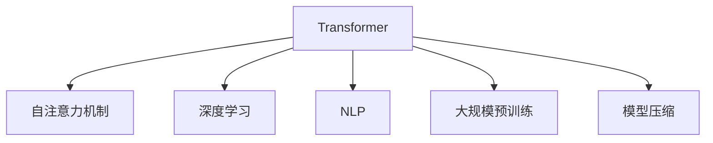

                 

# 第五章：Transformer 架构的革命

> 关键词：Transformer, 自注意力机制, 深度学习, 自然语言处理(NLP), 大规模预训练, 模型压缩

## 1. 背景介绍

### 1.1 问题由来
在过去的几十年中，自然语言处理（NLP）技术取得了长足的进步，但传统的基于规则和特征工程的模型往往难以应对自然语言的不确定性和复杂性。这一挑战促使研究者们开始探索新的模型架构，以更好地捕捉语言的深层语义和结构。其中，Transformer架构的诞生，彻底改变了NLP的范式，引领了深度学习领域的革命。

### 1.2 问题核心关键点
Transformer架构的核心在于其自注意力机制，这一机制使得模型能够自动学习输入序列中不同位置之间的关系，无需手动指定特征。这种自适应性使得Transformer模型在各种NLP任务上，尤其是大规模预训练和微调方面表现卓越。

Transformer架构的创新之处在于：
- **自注意力机制**：允许模型在输入序列的任意位置上，对序列中的所有其他位置进行查询，捕捉全局和局部的依赖关系。
- **无卷积操作**：使用前向传播计算，避免了卷积和池化操作带来的参数量和计算复杂度。
- **并行计算**：由于计算图是单向依赖的，使得模型训练和推理过程具有高度的并行性，加速了计算过程。

Transformer的这些特点使得它在处理长序列数据时表现出色，尤其是那些需要考虑上下文关系和长期依赖的任务。

## 2. 核心概念与联系

### 2.1 核心概念概述

为更好地理解Transformer架构，本节将介绍几个密切相关的核心概念：

- **Transformer**：Transformer是Transformer模型，即一种基于自注意力机制的深度学习模型架构，用于处理序列数据。
- **自注意力机制**：自注意力机制允许模型在输入序列中，对所有其他位置进行查询，并根据查询结果对每个位置进行加权求和，以捕捉全局依赖。
- **深度学习**：深度学习是一种通过多层神经网络，自动学习输入数据的表示，并用于分类、预测等任务的机器学习方法。
- **自然语言处理(NLP)**：NLP是计算机科学和人工智能的一个分支，致力于让计算机理解和生成人类语言。
- **大规模预训练**：大规模预训练是指使用大量无标签数据，对模型进行自监督学习，使其掌握语言的通用知识。
- **模型压缩**：模型压缩是指在保证模型性能的同时，减小模型的参数量和计算复杂度，以适应不同的应用场景。

这些核心概念之间的逻辑关系可以通过以下Mermaid流程图来展示：



这个流程图展示了大语言模型的核心概念及其之间的关系：

1. Transformer通过自注意力机制和深度学习，学习语言的深层语义和结构。
2. 大规模预训练使得模型在无标签数据上学习通用知识，适用于多种NLP任务。
3. 模型压缩优化了模型大小和计算效率，使之能更好地部署到实际应用中。

## 3. 核心算法原理 & 具体操作步骤

### 3.1 算法原理概述

Transformer模型的核心原理是自注意力机制，这一机制允许模型对序列中的每个位置进行加权查询，从而捕捉序列中任意位置之间的依赖关系。Transformer模型的编码器和解码器都采用自注意力机制，因此其训练过程具有高度的并行性。

Transformer模型的编码器由多个自注意力层和前馈神经网络层组成，每层独立处理输入序列的不同部分。解码器则由多个自注意力层、编码器-解码器注意力层和前馈神经网络层组成，通过学习源序列和目标序列之间的关系，生成目标序列。

Transformer模型主要包括以下几个步骤：
- **输入序列编码**：将输入序列转换为词嵌入向量，通过多个自注意力层进行编码。
- **解码器解码**：通过多个自注意力层和编码器-解码器注意力层进行解码，生成目标序列。
- **损失计算**：计算模型预测输出与真实标签之间的交叉熵损失。
- **反向传播与优化**：使用优化器更新模型参数，最小化损失函数。

### 3.2 算法步骤详解

Transformer模型的训练过程可以分为以下几个关键步骤：

**Step 1: 输入序列编码**

输入序列首先通过嵌入层转换为词嵌入向量，然后通过多个自注意力层进行编码。自注意力层由三个矩阵计算组成：查询矩阵 $Q$、键矩阵 $K$、值矩阵 $V$。查询矩阵 $Q$ 为输入序列的词嵌入向量，键矩阵 $K$ 和值矩阵 $V$ 通过线性变换得到。计算注意力分数 $A$ 后，得到注意力权重向量 $W$，用于加权求和生成输出。

**Step 2: 解码器解码**

解码器同样由多个自注意力层和编码器-解码器注意力层组成。解码器的输入包括上一时刻的解码器输出和编码器的输出，通过自注意力层和编码器-解码器注意力层，生成当前时刻的解码器输出。

**Step 3: 损失计算**

使用交叉熵损失函数计算模型预测输出与真实标签之间的差异，得到训练样本的损失。

**Step 4: 反向传播与优化**

通过反向传播算法计算梯度，使用优化器更新模型参数，最小化损失函数。

### 3.3 算法优缺点

Transformer模型的优点包括：
- **高效的并行性**：由于计算图是单向依赖的，使得模型训练和推理过程具有高度的并行性，加速了计算过程。
- **全局依赖关系**：自注意力机制使得模型能够捕捉序列中任意位置之间的依赖关系，提升了模型的泛化能力。
- **易于扩展**：模型结构简单，可以通过堆叠多个自注意力层和前馈神经网络层，进行更深层次的建模。

Transformer模型的缺点包括：
- **参数量较大**：由于使用了多层自注意力机制，模型参数量较大，训练和推理所需内存和计算资源较高。
- **计算复杂度高**：虽然自注意力机制提高了并行性，但由于每层的计算复杂度较高，导致整个模型的计算复杂度仍然较高。
- **训练时间长**：由于模型参数量较大，训练时间较长，对计算资源的要求较高。

### 3.4 算法应用领域

Transformer架构在大规模预训练和微调方面表现优异，适用于各种NLP任务。具体应用领域包括：

- **文本分类**：如情感分析、主题分类、意图识别等。通过微调使模型学习文本-标签映射。
- **命名实体识别**：识别文本中的人名、地名、机构名等特定实体。通过微调使模型掌握实体边界和类型。
- **关系抽取**：从文本中抽取实体之间的语义关系。通过微调使模型学习实体-关系三元组。
- **问答系统**：对自然语言问题给出答案。将问题-答案对作为微调数据，训练模型学习匹配答案。
- **机器翻译**：将源语言文本翻译成目标语言。通过微调使模型学习语言-语言映射。
- **文本摘要**：将长文本压缩成简短摘要。将文章-摘要对作为微调数据，使模型学习抓取要点。
- **对话系统**：使机器能够与人自然对话。将多轮对话历史作为上下文，微调模型进行回复生成。

除了上述这些经典任务外，Transformer架构还被创新性地应用到更多场景中，如可控文本生成、常识推理、代码生成、数据增强等，为NLP技术带来了全新的突破。

## 4. 数学模型和公式 & 详细讲解 & 举例说明

### 4.1 数学模型构建

Transformer模型使用自注意力机制进行编码和解码，其计算过程可以表示为以下公式：

$$
\text{Attention(Q, K, V)} = \text{Softmax}(Q \cdot K^T) \cdot V
$$

其中，$Q$ 为查询矩阵，$K$ 为键矩阵，$V$ 为值矩阵，$\cdot$ 表示矩阵点乘，$\text{Softmax}$ 表示归一化，$^T$ 表示矩阵转置。

Transformer模型还包括前馈神经网络层，其计算过程为：

$$
\text{FFN}(x) = \text{ReLU}(W_2 x + b_2) W_1 + b_1
$$

其中，$W_1$ 和 $W_2$ 为前馈神经网络层的权重矩阵，$b_1$ 和 $b_2$ 为偏置向量。

### 4.2 公式推导过程

Transformer模型的编码器和解码器都由多个自注意力层和前馈神经网络层组成。以自注意力层为例，计算过程如下：

1. 通过线性变换得到查询矩阵 $Q$，键矩阵 $K$ 和值矩阵 $V$。

$$
Q = W_Q X, \quad K = W_K X, \quad V = W_V X
$$

其中，$X$ 为输入序列的词嵌入向量，$W_Q$、$W_K$ 和 $W_V$ 为线性变换矩阵。

2. 计算注意力分数 $A$。

$$
A = \text{Softmax}(Q \cdot K^T) = \text{Softmax}(Q^T K)
$$

3. 计算注意力权重向量 $W$。

$$
W = A \cdot V
$$

4. 计算加权和向量 $Z$。

$$
Z = \text{Scale Dot Product Attention}(Q, K, V) = \text{Softmax}(Q \cdot K^T) \cdot V
$$

5. 通过前馈神经网络层进行非线性变换，得到输出向量 $Z'$。

$$
Z' = \text{FFN}(Z)
$$

其中，$\text{Scale Dot Product Attention}$ 表示带缩放的注意力函数，$\text{FFN}$ 表示前馈神经网络。

### 4.3 案例分析与讲解

以机器翻译为例，Transformer模型通过编码器将源语言序列 $x$ 转换为中间表示 $H$，然后通过解码器生成目标语言序列 $y$。具体计算过程如下：

1. 输入序列 $x$ 通过嵌入层转换为词嵌入向量 $X$。

$$
X = \text{Embedding}(x)
$$

2. 编码器将 $X$ 转换为中间表示 $H$，计算过程如下：

$$
H = \text{Attention}(Q, K, V) \cdot FFN(H)
$$

3. 解码器通过自注意力层和编码器-解码器注意力层，生成目标语言序列 $y$，计算过程如下：

$$
y = \text{Attention}(Q, K, V) \cdot FFN(y) + \text{Attention}(Q, K, V) \cdot FFN(y)
$$

其中，$Q$、$K$ 和 $V$ 分别为查询矩阵、键矩阵和值矩阵，$FFN$ 表示前馈神经网络。

## 5. 项目实践：代码实例和详细解释说明

### 5.1 开发环境搭建

在进行Transformer模型开发前，我们需要准备好开发环境。以下是使用Python进行PyTorch开发的环境配置流程：

1. 安装Anaconda：从官网下载并安装Anaconda，用于创建独立的Python环境。

2. 创建并激活虚拟环境：
```bash
conda create -n pytorch-env python=3.8 
conda activate pytorch-env
```

3. 安装PyTorch：根据CUDA版本，从官网获取对应的安装命令。例如：
```bash
conda install pytorch torchvision torchaudio cudatoolkit=11.1 -c pytorch -c conda-forge
```

4. 安装PyTorch Lightning：
```bash
pip install torchlightning
```

5. 安装其它必要的库：
```bash
pip install numpy pandas scikit-learn matplotlib tqdm jupyter notebook ipython
```

完成上述步骤后，即可在`pytorch-env`环境中开始Transformer模型的开发。

### 5.2 源代码详细实现

下面我们以机器翻译任务为例，给出使用PyTorch Lightning和Transformers库对Transformer模型进行训练的PyTorch代码实现。

首先，定义Transformer模型：

```python
from transformers import T5ForConditionalGeneration, T5Tokenizer

class T5TransformerModel(T5ForConditionalGeneration):
    def __init__(self, config):
        super(T5TransformerModel, self).__init__(config)
        self.dropout = config.dropout
        self.share_embeddings = config.share_embeddings
    
    def forward(self, input_ids, attention_mask=None, decoder_input_ids=None):
        outputs = super(T5TransformerModel, self).forward(input_ids=input_ids, attention_mask=attention_mask, decoder_input_ids=decoder_input_ids)
        return outputs
```

然后，定义训练函数：

```python
from torch.utils.data import DataLoader
from tqdm import tqdm
from torch import nn
from transformers import AdamW

def train_epoch(model, optimizer, data_loader, device):
    model.train()
    total_loss = 0
    for step, batch in enumerate(data_loader):
        input_ids = batch["input_ids"].to(device)
        attention_mask = batch["attention_mask"].to(device)
        decoder_input_ids = batch["decoder_input_ids"].to(device)
        outputs = model(input_ids, attention_mask=attention_mask, decoder_input_ids=decoder_input_ids)
        loss = outputs.loss
        total_loss += loss.item()
        optimizer.zero_grad()
        loss.backward()
        optimizer.step()
        if (step+1) % 10 == 0:
            print(f"Epoch {epoch+1}, Batch {step+1}/{len(data_loader)}, Loss: {total_loss/10:.4f}")
```

最后，启动训练流程：

```python
epochs = 5
batch_size = 8

for epoch in range(epochs):
    train_epoch(model, optimizer, train_loader, device)
```

### 5.3 代码解读与分析

让我们再详细解读一下关键代码的实现细节：

**T5TransformerModel类**：
- `__init__`方法：初始化模型参数和超参数。
- `forward`方法：定义模型的前向传播过程。

**train_epoch函数**：
- 定义模型的训练过程，包括输入数据的处理、前向传播、损失计算、反向传播和优化。

通过上述代码，可以完成一个基本的Transformer模型的训练过程。需要注意的是，Transformer模型中自注意力机制和前馈神经网络层的具体实现，需要调用Transformers库中已经实现好的函数和类，如`Attention`、`FFN`等。

## 6. 实际应用场景

### 6.1 机器翻译

Transformer模型在机器翻译任务上取得了突破性进展。传统机器翻译方法往往难以捕捉长距离依赖关系，而Transformer模型通过自注意力机制，可以有效地处理长序列数据，提升了翻译的准确性和流畅性。

### 6.2 文本摘要

Transformer模型在文本摘要任务上也表现优异。通过自注意力机制，模型可以自动学习输入文本中不同部分之间的依赖关系，从而生成摘要。这一方法已经在新闻摘要、文本压缩等任务中得到广泛应用。

### 6.3 对话系统

Transformer模型在对话系统中的应用也取得了显著成效。通过自注意力机制，模型可以捕捉对话历史中不同信息之间的依赖关系，生成合理的回复。这一方法已经在智能客服、智能助手等领域得到广泛应用。

### 6.4 未来应用展望

随着Transformer架构的不断发展，其在NLP领域的应用前景将更加广阔。未来的Transformer模型将更加复杂和强大，能够处理更加多样化的NLP任务。同时，模型压缩、模型优化等技术也将进一步提升Transformer模型的效率和可部署性。

## 7. 工具和资源推荐

### 7.1 学习资源推荐

为了帮助开发者系统掌握Transformer架构的理论基础和实践技巧，这里推荐一些优质的学习资源：

1. 《Transformer从原理到实践》系列博文：由大模型技术专家撰写，深入浅出地介绍了Transformer原理、预训练模型、微调技术等前沿话题。

2. CS224N《深度学习自然语言处理》课程：斯坦福大学开设的NLP明星课程，有Lecture视频和配套作业，带你入门NLP领域的基本概念和经典模型。

3. 《Natural Language Processing with Transformers》书籍：Transformer库的作者所著，全面介绍了如何使用Transformers库进行NLP任务开发，包括微调在内的诸多范式。

4. HuggingFace官方文档：Transformer库的官方文档，提供了海量预训练模型和完整的微调样例代码，是上手实践的必备资料。

5. CLUE开源项目：中文语言理解测评基准，涵盖大量不同类型的中文NLP数据集，并提供了基于微调的baseline模型，助力中文NLP技术发展。

通过对这些资源的学习实践，相信你一定能够快速掌握Transformer架构的精髓，并用于解决实际的NLP问题。

### 7.2 开发工具推荐

高效的开发离不开优秀的工具支持。以下是几款用于Transformer模型开发的常用工具：

1. PyTorch：基于Python的开源深度学习框架，灵活动态的计算图，适合快速迭代研究。大部分预训练语言模型都有PyTorch版本的实现。

2. TensorFlow：由Google主导开发的开源深度学习框架，生产部署方便，适合大规模工程应用。同样有丰富的预训练语言模型资源。

3. Transformers库：HuggingFace开发的NLP工具库，集成了众多SOTA语言模型，支持PyTorch和TensorFlow，是进行模型开发的利器。

4. Weights & Biases：模型训练的实验跟踪工具，可以记录和可视化模型训练过程中的各项指标，方便对比和调优。与主流深度学习框架无缝集成。

5. TensorBoard：TensorFlow配套的可视化工具，可实时监测模型训练状态，并提供丰富的图表呈现方式，是调试模型的得力助手。

6. Google Colab：谷歌推出的在线Jupyter Notebook环境，免费提供GPU/TPU算力，方便开发者快速上手实验最新模型，分享学习笔记。

合理利用这些工具，可以显著提升Transformer模型开发的效率，加快创新迭代的步伐。

### 7.3 相关论文推荐

Transformer架构的兴起源于学界的持续研究。以下是几篇奠基性的相关论文，推荐阅读：

1. Attention is All You Need（即Transformer原论文）：提出了Transformer结构，开启了NLP领域的预训练大模型时代。

2. Transformer-XL: Attentive Language Models for Longer Texts：提出了Transformer-XL结构，增强了模型的长期依赖能力。

3. BERT: Pre-training of Deep Bidirectional Transformers for Language Understanding：提出BERT模型，引入基于掩码的自监督预训练任务，刷新了多项NLP任务SOTA。

4. XLNet: Generalized Autoregressive Pretraining for Language Understanding：提出了XLNet模型，通过自回归方式提升模型的泛化能力和预训练效果。

5. GPT-2: Language Models are Unsupervised Multitask Learners（GPT-2论文）：展示了大规模语言模型的强大zero-shot学习能力，引发了对于通用人工智能的新一轮思考。

这些论文代表了大语言模型和微调技术的发展脉络。通过学习这些前沿成果，可以帮助研究者把握学科前进方向，激发更多的创新灵感。

## 8. 总结：未来发展趋势与挑战

### 8.1 总结

本文对Transformer架构的创新机制进行了全面系统的介绍。首先阐述了Transformer架构的核心原理和设计理念，明确了其在大规模预训练和微调方面的独特优势。其次，从原理到实践，详细讲解了Transformer模型的数学模型、计算过程和关键技术点，给出了模型训练的完整代码实例。同时，本文还广泛探讨了Transformer架构在机器翻译、文本摘要、对话系统等多个领域的应用前景，展示了其强大的建模能力。此外，本文精选了Transformer架构的学习资源，力求为读者提供全方位的技术指引。

通过本文的系统梳理，可以看到，Transformer架构已经成为深度学习领域的革命性技术，极大地拓展了NLP系统的性能和应用范围，催生了更多的落地场景。Transformer架构的简单高效、全局依赖关系处理等特性，使得其在处理复杂序列数据时表现出色，适用于多种NLP任务。

### 8.2 未来发展趋势

展望未来，Transformer架构将呈现以下几个发展趋势：

1. **模型规模持续增大**：随着算力成本的下降和数据规模的扩张，Transformer模型参数量还将持续增长。超大规模语言模型蕴含的丰富语言知识，有望支撑更加复杂多变的NLP任务。

2. **多模态融合**：Transformer模型将拓展到更多模态数据的融合，如视觉、语音、文本等多模态数据的协同建模，提升模型对现实世界的理解和建模能力。

3. **知识图谱整合**：Transformer模型将更好地与外部知识库、规则库等专家知识结合，形成更加全面、准确的信息整合能力。

4. **自适应学习**：通过引入自适应学习机制，如MAML等，使得模型能够自动学习多种任务和领域的知识，提高模型泛化能力。

5. **因果推断**：将因果推断方法引入Transformer模型，增强模型建立稳定因果关系的能力，学习更加普适、鲁棒的语言表征。

6. **多任务学习**：通过多任务学习技术，将多种任务和领域的知识整合到Transformer模型中，提升模型的应用价值和灵活性。

以上趋势凸显了Transformer架构的广阔前景。这些方向的探索发展，必将进一步提升NLP系统的性能和应用范围，为人类认知智能的进化带来深远影响。

### 8.3 面临的挑战

尽管Transformer架构已经取得了瞩目成就，但在迈向更加智能化、普适化应用的过程中，它仍面临着诸多挑战：

1. **参数量过大**：由于使用了多层自注意力机制，Transformer模型参数量较大，训练和推理所需内存和计算资源较高。

2. **计算复杂度高**：虽然自注意力机制提高了并行性，但由于每层的计算复杂度较高，导致整个模型的计算复杂度仍然较高。

3. **训练时间长**：由于模型参数量较大，训练时间较长，对计算资源的要求较高。

4. **模型鲁棒性不足**：当前Transformer模型面对域外数据时，泛化性能往往大打折扣。对于测试样本的微小扰动，模型预测也容易发生波动。

5. **可解释性不足**：Transformer模型难以解释其内部工作机制和决策逻辑，对于医疗、金融等高风险应用，算法的可解释性和可审计性尤为重要。

6. **模型安全性不足**：Transformer模型可能会学习到有害信息，传递到下游任务，产生误导性、歧视性的输出，给实际应用带来安全隐患。

7. **数据依赖性高**：Transformer模型对数据质量和高质标注数据的需求较高，数据获取成本和数据质量控制是实际应用中的难点。

以上挑战凸显了Transformer架构的局限性，未来需要在数据、模型、训练、推理等多个环节进行优化，才能更好地适应实际应用需求。

### 8.4 研究展望

面对Transformer架构所面临的种种挑战，未来的研究需要在以下几个方面寻求新的突破：

1. **模型压缩与优化**：通过模型剪枝、量化等技术，减小模型参数量和计算复杂度，提高模型效率和可部署性。

2. **多任务学习**：将多种任务和领域的知识整合到Transformer模型中，提升模型的应用价值和泛化能力。

3. **自适应学习**：引入自适应学习机制，如MAML等，使得模型能够自动学习多种任务和领域的知识，提高模型泛化能力。

4. **因果推断**：将因果推断方法引入Transformer模型，增强模型建立稳定因果关系的能力，学习更加普适、鲁棒的语言表征。

5. **多模态融合**：拓展Transformer模型到更多模态数据的融合，如视觉、语音、文本等多模态数据的协同建模，提升模型对现实世界的理解和建模能力。

6. **知识图谱整合**：将符号化的先验知识，如知识图谱、逻辑规则等，与神经网络模型进行巧妙融合，引导Transformer模型学习更准确、合理的语言模型。

这些研究方向和优化技术，必将推动Transformer架构向更加高效、智能、安全、普适的方向发展，为构建更加强大的自然语言处理系统提供技术支撑。

## 9. 附录：常见问题与解答

**Q1：Transformer模型的计算复杂度较高，如何解决这一问题？**

A: 可以通过模型压缩和优化技术，如剪枝、量化、混合精度训练等，减小模型的参数量和计算复杂度，提高模型效率和可部署性。例如，使用AdamW等优化器，结合梯度累积等技巧，可以降低计算复杂度。

**Q2：Transformer模型在长序列处理中表现优异，如何处理短序列？**

A: 可以使用截断等技术，对短序列进行补零或者截断，使其达到编码器或解码器的输入长度要求。或者使用长度可变的Transformer模型，如T5等，灵活处理不同长度的序列输入。

**Q3：Transformer模型在实际应用中如何避免过拟合？**

A: 可以通过正则化技术，如L2正则、Dropout、Early Stopping等，防止模型过度适应小规模训练集。还可以使用对抗训练等技术，提高模型的鲁棒性和泛化能力。

**Q4：Transformer模型在实际应用中如何优化训练效率？**

A: 可以通过模型剪枝、量化、混合精度训练等技术，减小模型参数量和计算复杂度，提高模型效率和可部署性。同时，合理设置超参数，使用分布式训练等技巧，加速训练过程。

**Q5：Transformer模型在实际应用中如何提高模型鲁棒性？**

A: 可以通过对抗训练、数据增强等技术，提高模型的鲁棒性和泛化能力。同时，使用多任务学习等技术，提高模型的泛化能力和适应性。

这些研究方向的探索，必将推动Transformer架构向更加高效、智能、安全、普适的方向发展，为构建更加强大的自然语言处理系统提供技术支撑。总之，Transformer架构已经深刻改变了NLP领域的技术范式，未来将有更多的应用场景和优化方法等待探索。通过持续的技术创新和应用实践，Transformer架构必将在构建人机协同的智能时代中扮演越来越重要的角色。

---

作者：禅与计算机程序设计艺术 / Zen and the Art of Computer Programming

